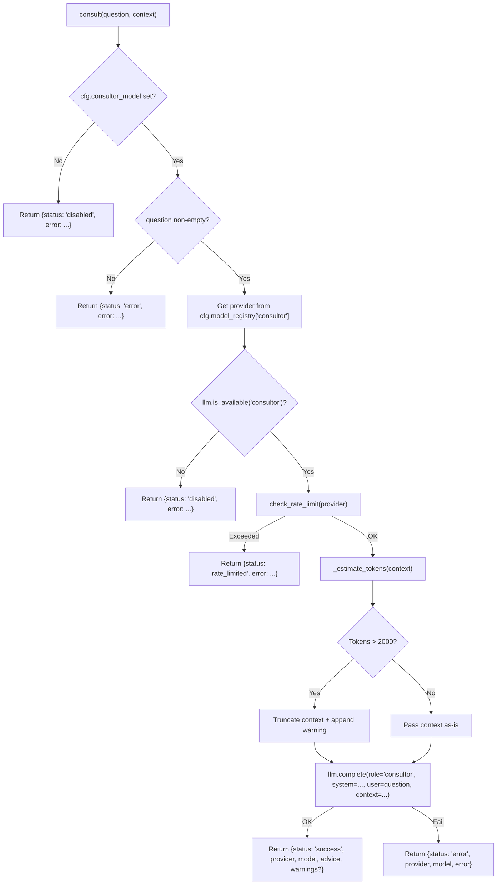

# 🔍 Consult Tool

The `consult()` tool provides **optional cloud LLM advisory** for high-stakes tasks requiring stronger reasoning, domain expertise, or external validation. It is strictly **opt-in** and controlled via a `.env` kill-switch.

**Key characteristics:**
- **Cloud LLM dispatch** — Routes to a dedicated consultor model configured separately from local planner/executor/router chains
- **Kill-switch ready** — Returns `{"status": "disabled"}` if `CONSULTOR_MODEL` is empty; no crashes, no silent fallbacks
- **Rate-limit guard** — Pre-flight `check_rate_limit()` prevents accidental API quota burn
- **Token-aware truncation** — Context pruned via `tiktoken` (cl100k_base) before dispatch to prevent overflow
- **Cost-conscious** — Not in `PARALLEL_SAFE`, excluded from aggressive routing, intended for targeted use

---

## 🚀 Quick Start

```python
# Basic advisory query
consult(question="What are the trade-offs between async and sync database drivers in Python?")

# With supporting context
consult(
    question="Why is this query slow?",
    context="EXPLAIN ANALYZE output: Seq Scan on users..."
)

# Disabled by default — returns clear status if unconfigured
consult(question="Should I use pydantic v1 or v2?")
# → {"status": "disabled", "error": "Consultor is disabled. Set CONSULTOR_MODEL in .env to enable."}
```

---

## 🏗️ Architecture

```text
tools/consult.py
├── consult(question, context="")    # @tool facade — validation, rate-limit, context guard, LLM dispatch
├── _estimate_tokens(text)         # tiktoken cl100k_base fallback to char-count heuristic
└── _ADVISORY_SYSTEM_PROMPT          # Static system prompt for consultor role
```

### Dispatch Flow



**Key design decisions:**
- **Optional by design** — The tool gracefully degrades to a clear `disabled` status if the consultor stack isn't configured. No crashes, no silent fallbacks to local models.
- **Separate model config** — Uses `consultor_model` via `cfg.model_registry["consultor"]`, completely isolated from local planner/executor/router chains. Provider resolution (base_url, api_key, timeout) is handled by the standard LLM backend.
- **Hard token ceiling** — `_MAX_CONTEXT_TOKENS = 2000` is a conservative hardcoded limit. Context exceeding this is truncated *before* the LLM call to prevent cloud quota waste and prompt injection via oversized inputs.
- **Rate-limit pre-flight** — `check_rate_limit()` gates the call before any network I/O. Prevents 429 loops and protects API budgets.
- **Single system prompt** — All consult queries share one advisory system prompt. No per-task prompt engineering in the facade; the caller shapes the question.

---

## 📝 Tool Signature

```python
@tool
def consult(
    question: str,
    context: str = "",
) -> dict:
    """Consult the configured AI advisor for high-level help.
    Use for breaking deadlocks, architectural decisions, or complex logic reviews.
    Do not use for routine code generation or simple questions.
    """
```

| Parameter | Type | Required | Description |
|-----------|------|----------|-------------|
| `question` | `str` | **Yes** | The core question, architecture decision, or code snippet to analyze |
| `context` | `str` | No | Supporting background (logs, error traces, file contents). Truncated to ~2000 tokens if oversized. |

---

## ⚙️ Configuration & Kill-Switch

The consult tool is **disabled by default**. It only activates when explicitly configured:

```ini
# .env
CONSULTOR_MODEL=gpt-4o                     # Cloud model name — must match provider /v1/models
CONSULTOR_BASE_URL=https://api.openai.com/v1
CONSULTOR_API_KEY=sk-...
CONSULTOR_TIMEOUT=60                       # HTTP timeout (seconds)
```

**Kill-switch behavior:**

| Condition | Return Status | Message |
|-----------|--------------|---------|
| `CONSULTOR_MODEL` empty / unset | `disabled` | `Consultor is disabled. Set CONSULTOR_MODEL in .env to enable.` |
| `question` empty or whitespace | `error` | `The question parameter cannot be empty.` |
| Provider unavailable (`llm.is_available`) | `disabled` | `Provider for consultor role ('{provider}') is not available...` |
| Rate limit exceeded | `rate_limited` | `Rate limit exceeded for {provider}. Please wait before consulting again.` |

> **Note:** `consultor` is added to `cfg.model_registry` **only** if `CONSULTOR_MODEL` resolves to a non-empty model. Unlike other roles, there is no fallback chain — if unset, the role simply does not exist in the registry.

---

## 📤 Output

All responses are flat `dict`s with a `status` key:

### Success
```json
{
  "status": "success",
  "provider": "openai",
  "model": "gpt-4o",
  "advice": "...",
  "warnings": ["Context truncated from ~5000 to 2000 tokens..."]
}
```
> `warnings` is omitted when no truncation occurred.

### Disabled
```json
{
  "status": "disabled",
  "error": "Consultor is disabled. Set CONSULTOR_MODEL in .env to enable."
}
```

### Rate Limited
```json
{
  "status": "rate_limited",
  "error": "Rate limit exceeded for openai. Please wait before consulting again."
}
```

### LLM Error
```json
{
  "status": "error",
  "provider": "openai",
  "model": "gpt-4o",
  "error": "HTTP 503: Service unavailable"
}
```

---

## 🛡️ Security & Safety

| Feature | Implementation |
|---------|---------------|
| **Kill-switch** | Returns `disabled` immediately if `cfg.consultor_model` is falsy — no network call |
| **Rate-limit guard** | `check_rate_limit(provider)` blocks the call before any HTTP request |
| **Context truncation** | `_estimate_tokens()` + hard 2000-token ceiling prunes oversized `context` before dispatch |
| **No local FS access** | `consult` only processes text passed by the caller. Never reads files or executes code directly |
| **Isolated config** | Uses dedicated `CONSULTOR_*` env vars resolved through `cfg.model_registry`. Never shares keys with local LM Studio |

---

## 🔄 When to Use vs Alternatives

| Need | Tool | Why |
|------|------|-----|
| Local code execution | `python` | Fast, free, sandboxed |
| Local web search | `web` / `tavily` | Self-hosted or API-optimized |
| Cloud advisory / architecture review | `consult` | Stronger reasoning, external validation |
| Local architecture review | `agent` (review role) | Free, local, but weaker model |
| Complex debugging | `consult` | Deep trace analysis, higher accuracy |
| Strategic planning | `consult` | Trade-off analysis, industry context |
| Routine code generation | `python` or `agent` (code role) | Faster, cheaper, no cloud quota |
| Simple factual lookup | `web` | No LLM cost, direct source |

---

## 🧪 Testing

```powershell
# Run the single consult test
D:\mcp\agent\venv\Scripts\pytest.exe tests/tools/consult/test_consult.py -W error --tb=short -v
```

**Mock strategy:**
- Patch `core.config.cfg.consultor_model` to `""` to test kill-switch
- Patch `core.llm.llm.is_available` to `False` to test provider-unavailable path
- Patch `core.llm_backend.rate_limit.check_rate_limit` to `False` to test rate-limit path
- Patch `core.llm.llm.complete` to return a mock `Result` object for success paths
- Test context truncation with inputs > 2000 tokens (or mock `_estimate_tokens`)

**Current test layout:**
```text
tests/tools/consult/
└── test_consult.py          # Single monolithic test file (all paths in one)
```

> **Future:** When the tool is refactored to `@meta_tool` + un-multiplex, this will expand to `conftest.py` + per-action test files following the `tests/tools/browser/` pattern.

---

## 🗺️ Roadmap

### ✅ Completed

| Feature | Status | Notes |
|---------|--------|-------|
| Kill-switch (`disabled` status) | ✅ v1.0 | Returns clear error if `CONSULTOR_MODEL` unset |
| Rate-limit pre-flight | ✅ v1.0 | `check_rate_limit()` before every call |
| Token-aware truncation | ✅ v1.0 | `tiktoken` cl100k_base with char-count fallback |
| Provider isolation | ✅ v1.0 | Resolved via `cfg.model_registry["consultor"]` |
| Three return statuses | ✅ v1.0 | `success` / `disabled` / `rate_limited` / `error` |

### 🔄 In Progress / Next Up

| Feature | Notes | Priority |
|---------|-------|----------|
| `@meta_tool` refactor | Add `action` param (`review`, `advise`, `explain`) with `Literal` validation and auto-generated schema | P0 |
| Un-multiplex | Extract `_do_review`, `_do_advise`, `_do_explain` into atomic handlers (follow `browser_core/actions/` pattern) | P0 |
| Test restructure | Add `conftest.py`, split `test_consult.py` into per-action files | P1 |
| `trace_id` support | Inject `trace_id` into all responses for observability | P1 |
| `format` param | `markdown` / `json` / `bullet_points` output formatting | P1 |
| Memory hook | Auto-store lightweight episodic memory on successful consult | P2 |
| Cost tracking | Tokens × price metadata for agent budget visibility | P2 |
| Context type auto-detection | `context_type` param (`code`, `logs`, `architecture`) to auto-select specialized system prompts | P2 |
| Batch review | `action="batch_review"` for parallel multi-file analysis | P3 |

### 🚫 Deferred / Out of Scope

| # | Feature | Why Deferred | Priority |
|---|---------|------------|----------|
| 1 | **Local model fallback** | Consultor is explicitly *cloud-only*. Local fallback defeats the purpose of stronger external reasoning. | Skip |
| 2 | **Streaming responses** | MCP stdio transport doesn't support streaming. Would require gateway-only mode. | Skip |
| 3 | **Conversation history** | `consult` is stateless by design. Memory integration (episodic) covers recall without conversation state. | Skip |
| 4 | **Image/multimodal input** | Vision tasks are handled by the `vision` role. Consultor is text-only advisory. | Skip |
| 5 | **Configurable `_MAX_CONTEXT_TOKENS` via `.env`** | Hardcoded 2000 is a deliberate safety rail. User must explicitly request a change. | Skip |

---

## 🛡️ AI Agent Instructions

### NEVER DO
1. **Never add an `action` param** — the tool is not multiplexed. Wait for the `@meta_tool` refactor.
2. **Never hardcode model names** — always use `cfg.consultor_model` / `cfg.model_registry["consultor"]`.
3. **Never remove the kill-switch check** — the first `if not cfg.consultor_model` guard must remain. The tool must degrade gracefully.
4. **Never bypass `check_rate_limit()`** — always gate cloud calls behind the rate-limit pre-flight.
5. **Never increase `_MAX_CONTEXT_TOKENS` without explicit user approval** — 2000 is a deliberate safety rail.
6. **Never skip `llm.is_available("consultor")`** — verify provider readiness before any network I/O.
7. **Never print to stdout** — MCP stdio corruption. Return dicts only.
8. **Never create `.bak` files** — forbidden by project rules.
9. **Never rewrite the entire file** — surgical edits only. Preserve existing code exactly.
10. **Never add `**kwargs` to the `@tool` facade** — FastMCP schema breaks.

### ALWAYS DO
11. **Always include `warnings` when context is truncated** — consumers need to know their input was pruned.
12. **Always preserve the three return statuses** — `success`, `disabled`, `rate_limited`, `error`. Do not collapse them.
13. **Always use `compileall` before `pytest`** — catches syntax errors early.
14. **Always test the kill-switch path** — patch `cfg.consultor_model = ""` and assert `status == "disabled"`.
15. **Always test the rate-limit path** — patch `check_rate_limit` to `False` and assert `status == "rate_limited"`.
16. **Always update this doc** when adding params, changing return shapes, or modifying behavior.

---

## 🔗 Source Code Reference

| File | Purpose |
|------|---------|
| `tools/consult.py` | `@tool` facade: validation, rate-limit, context guard, LLM dispatch |
| `core/config.py` | `cfg.consultor_model`, `cfg.model_registry["consultor"]` — model + provider + timeout resolution |
| `core/llm.py` | `llm.complete()` and `llm.is_available()` — LLM dispatch and provider health |
| `core/llm_backend/rate_limit.py` | `check_rate_limit()` — pre-flight rate-limit guard |
| `tests/tools/consult/test_consult.py` | Single monolithic test covering all return paths |

---

*Architecture: thin @tool facade + kill-switch guard + rate-limit pre-flight + token-aware context truncation + isolated cloud model config via cfg.model_registry.*
