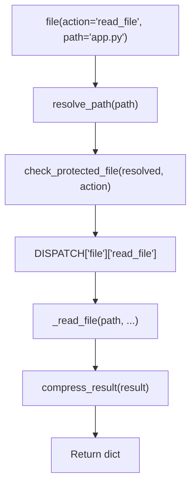

# 📁 File Tool

The `file()` tool provides **atomic file system actions** for the MCP Agent Stack. Each action does exactly one thing — no subcommand parsing, no overloaded behaviors.

**Key characteristics:**
- **Atomic actions** — `read_file`, `write_file`, `create_directory`, `directory_tree`, etc. One action = one behavior
- **Auto-generated schema** — `@meta_tool` decorator builds `Literal` enum and docstring from DISPATCH
- **Semantic parameter names** — `path` = file path, `source`/`destination` = move/copy paths, `query` = search text
- **Path guard integration** — All operations validate through `core.path_guard`
- **Cancellation guard** — Mutating actions abort if the trace is cancelled
- **Result compression** — Large outputs auto-truncate to prevent MCP context overflow

---

## ⚠️ Breaking Changes (v1 → v1.1)

| Old Action | New Action | Migration |
|------------|-----------|-----------|
| `read` | `read_file` | `file(action="read_file", ...)` |
| `write` | `write_file` | `file(action="write_file", ...)` |
| `list` | `list_directory` | `file(action="list_directory", ...)` |
| `search` | `search_files` | `file(action="search_files", ...)` |
| `patch` | `patch_file` | `file(action="patch_file", ...)` |
| `backup` | `backup_file` | `file(action="backup_file", ...)` |
| `read_many` | `read_multiple_files` | `file(action="read_multiple_files", ...)` |
| `mode` param | Removed | Use `max_chars`, `head`, or `tail` |

### v1.1 (path_guard integration)
- Replaced custom `_resolve()` in `helpers.py` with thin wrapper around `core.path_guard.resolve_path`
- Updated `write_file`, `append_file`, `edit_file`, `patch_file` handlers to use `check_protected_file()` instead of direct `cfg.is_protected()`
- Added `move_file`, `copy_file`, `create_directory` to `WRITE_OPERATIONS` in `core/path_guard.py`
- Fixed facade destination protected check to run even when destination doesn't exist yet
- Added `list_allowed_directories` to `READ_OPERATIONS`
- Added `test_file_path_guard_integration.py` to prevent regression

---

## 🏗️ Architecture

The file tool follows a **thin facade + atomic action modules** pattern.

```
tools/file.py                    # @tool facade — validation, dispatch, compression
tools/_meta_tool.py              # @meta_tool decorator — auto Literal + docstring
tools/file_ops/
├── _registry.py                 # DISPATCH dict + @register_action decorator
├── helpers.py                   # Thin wrapper around core.path_guard (v1.1)
│                                #   DO NOT implement custom path resolution here.
│                                #   See INTEGRATION GUIDE in core/path_guard.py
├── index.py                     # SQLite FTS index for search_files
└── actions/
    ├── read_file.py             # Read text file (head/tail/max_chars)
    ├── write_file.py            # Write text file
    ├── list_directory.py        # List directory contents
    ├── create_directory.py      # Create directory (mkdir -p)
    ├── directory_tree.py        # Recursive tree view
    ├── move_file.py             # Move/rename file or directory
    ├── copy_file.py             # Copy file or directory
    ├── delete_file.py           # Delete file or directory (force required)
    ├── get_file_info.py         # File metadata (stat)
    ├── exists.py                # Check if path exists
    ├── patch_file.py            # Single str_replace patch
    ├── edit_file.py             # MCP-style multi-edit with diff
    ├── append_file.py           # Append content without reading full file
    ├── search_files.py          # Full-text search (SQLite FTS)
    ├── find_files.py            # Glob pattern matching
    ├── read_multiple_files.py   # Concurrent multi-file read
    ├── read_media_file.py       # Binary file → base64 + MIME type
    ├── read_pdf.py              # Extract text from PDF
    ├── write_pdf.py             # Write text to PDF
    ├── read_docx.py             # Read Word document
    ├── write_docx.py            # Write Word document
    ├── read_xlsx.py             # Read Excel spreadsheet
    ├── write_xlsx.py            # Write Excel spreadsheet
    ├── read_pptx.py             # Read PowerPoint
    └── write_pptx.py            # Write PowerPoint
```

### Dispatch Flow



**Key design decisions:**
- **Unified DISPATCH** — Single dict holds all actions, handlers, help text, examples. `@meta_tool` reads it to generate schema and docstring. One source. Zero drift.
- **Action name consistency** — `core/path_guard.py` maintains `READ_OPERATIONS` and `WRITE_OPERATIONS` sets. When renaming actions (e.g., `write` → `write_file`), these sets MUST be updated or protected file checks will silently fail. **v1.1 added `move_file`, `copy_file`, `create_directory` to `WRITE_OPERATIONS`.**
- **Atomic actions** — No `message` subcommand parsing. `create_directory` is one action, `delete_file` is another.
- **Semantic parameters** — `path` = file path, `source`/`destination` = move/copy paths, `query` = search text, `edits` = edit array.
- **Path validation in facade** — `resolve_path` + `check_protected_file` runs once before dispatch. No duplication across 20+ handlers. **v1.1 fix: destination paths are checked for protection even if they don't exist yet.**
- **Cancellation guard** — `ensure_not_cancelled(trace_id)` aborts before any file mutations. Catches `BaseException` (not just `Exception`) to handle `asyncio.CancelledError`.
- **Destructive actions require force** — `delete_file`, `move_file`, `copy_file` need explicit `force=True`.

### Path Guard Integration (v1.1)

**Every file action MUST flow through `core/path_guard.py`.** This is the canonical example for future tool refactors.

```python
# Facade (tools/file.py)
from core.path_guard import resolve_path, check_protected_file, make_path_error

resolved, err = resolve_path(path, default_root="agent")
if not resolved:
    return make_path_error(path, action, err, trace_id)
allowed, err = check_protected_file(resolved, action)
if not allowed:
    return make_path_error(path, action, err, trace_id)

# Helpers (tools/file_ops/helpers.py) — thin wrapper, NO custom logic
from core.path_guard import resolve_path

def _safe_resolve(path_str, require_exists=False):
    resolved, err = resolve_path(path_str, default_root="agent", require_exists=require_exists)
    return resolved, err

# Handlers (tools/file_ops/actions/*.py) — trust paths, do business logic
from tools.file_ops.helpers import _safe_resolve

def _handle_write_file(path="", content="", **kwargs):
    p, err = _safe_resolve(path)
    if err:
        return {"status": "error", "error": err}
    # ... write logic, no path re-validation
```

**Anti-pattern (old file_ops, fixed in v1.1):**
```python
# BAD — helpers.py reimplemented path resolution
from core.config import cfg  # bypassed path_guard entirely

def _resolve(path_str):
    for root in _allowed_roots():  # custom logic, diverged from path_guard
        ...
```

## Path Resolution & Security

All paths are resolved through `core.path_guard.resolve_path()` before any file operation:

| Path Type | Behavior |
|-----------|----------|
| **Relative** | Resolved against `default_root` ("agent" or "workspace") |
| **Absolute** | Allowed only if within `AGENT_ROOT` |
| **Traversal** (`../..`) | Blocked if resolves outside `AGENT_ROOT` |
| **Null bytes** | Blocked immediately |
| **Symlinks** | Followed via `Path.resolve()` — escapes caught by `_is_within()` |

**Protected files:** Infrastructure files (e.g., `core/config.py`) are read-allowed but write-blocked. The `WRITE_OPERATIONS` frozenset in `core/path_guard.py` controls which actions trigger the protected check. **v1.1 added `move_file`, `copy_file`, `create_directory` to this set.**

**v1.1 fix:** Destination paths for `move_file`/`copy_file`/`write_file` are checked for protection even when they don't exist yet. The resolved path tells us where the file would land.

---

## 📋 Tool Signature

```python
@tool
@meta_tool(DISPATCH["file"])
def file(
    action: Literal[
        "read_file", "write_file", "list_directory", "create_directory",
        "directory_tree", "move_file", "copy_file", "delete_file",
        "get_file_info", "exists", "patch_file", "edit_file",
        "append_file", "search_files", "find_files",
        "read_multiple_files", "read_media_file",
        "read_pdf", "write_pdf", "read_docx", "write_docx",
        "read_xlsx", "write_xlsx", "read_pptx", "write_pptx",
        "list_allowed_directories",
    ],
    path: str = "",
    paths: list[str] | None = None,
    content: str = "",
    query: str = "",
    pattern: str = "",
    max_chars: int | None = None,
    max_results: int | None = None,
    head: int | None = None,
    tail: int | None = None,
    max_depth: int | None = None,
    max_bytes: int | None = None,
    exclude_patterns: list[str] | None = None,
    old: str = "",
    new: str = "",
    edits: list[dict] | None = None,
    dry_run: bool = False,
    force: bool = False,
    recursive: bool = False,
    parents: bool = True,
    source: str = "",
    destination: str = "",
    trace_id: str = "",
) -> dict:
    """..."""
```

| Param | Type | Default | Description |
|-------|------|---------|-------------|
| `action` | `Literal[...]` | — | **Required.** Atomic action name. See Actions table below |
| `path` | `str` | `""` | File or directory path |
| `paths` | `list[str]` | `None` | Multiple paths (for `read_multiple_files`) |
| `content` | `str` | `""` | File content (for write actions) |
| `query` | `str` | `""` | Search query (for `search_files`) |
| `pattern` | `str` | `""` | Glob pattern (for `find_files`) |
| `max_chars` | `int` | `None` | Character limit for read actions |
| `max_results` | `int` | `None` | Result limit for search |
| `head` | `int` | `None` | Read first N lines |
| `tail` | `int` | `None` | Read last N lines |
| `max_depth` | `int` | `None` | Depth limit for `directory_tree` |
| `max_bytes` | `int` | `None` | Size limit for `read_media_file` (default 5MB) |
| `exclude_patterns` | `list[str]` | `None` | Glob patterns to exclude |
| `old` | `str` | `""` | Old text (for `patch_file`) |
| `new` | `str` | `""` | New text (for `patch_file`) |
| `edits` | `list[dict]` | `None` | Edit array (for `edit_file`) |
| `dry_run` | `bool` | `False` | Preview mode (for `edit_file`) |
| `force` | `bool` | `False` | Confirm destructive actions |
| `recursive` | `bool` | `False` | Recursive delete |
| `parents` | `bool` | `True` | Create parent directories |
| `source` | `str` | `""` | Source path (for `move_file`, `copy_file`) |
| `destination` | `str` | `""` | Destination path (for `move_file`, `copy_file`) |
| `trace_id` | `str` | `""` | Trace identifier |

---

## 🎬 Actions

### Read-Only Actions

| Action | Required Params | Optional Params | Description |
|--------|-----------------|-----------------|-------------|
| `read_file` | `path` | `max_chars`, `head`, `tail` | Read text file with line/char truncation. Max 10MB. |
| `list_directory` | `path` | — | List directory contents with metadata |
| `directory_tree` | `path` | `max_depth`, `exclude_patterns` | Recursive tree as structured JSON |
| `get_file_info` | `path` | — | File metadata (size, mode, times) |
| `exists` | `path` | — | Check if path exists |
| `search_files` | `query` | `max_results` | Full-text search across workspace |
| `find_files` | `pattern` | `path` | Glob pattern matching. Max 1000 results. |
| `read_multiple_files` | `paths` | `max_chars` | Concurrent multi-file read |
| `read_media_file` | `path` | `max_bytes` | Binary file → base64 + MIME type. Default 5MB. |
| `read_pdf` | `path` | `max_chars` | Extract text from PDF |
| `read_docx` | `path` | `max_chars` | Read Word document |
| `read_xlsx` | `path` | — | Read Excel spreadsheet |
| `read_pptx` | `path` | `max_chars` | Read PowerPoint |
| `list_allowed_directories` | — | — | Return allowed roots |

### Write Actions

| Action | Required Params | Optional Params | Description |
|--------|-----------------|-----------------|-------------|
| `write_file` | `path`, `content` | — | Write text file (auto-creates parents) |
| `append_file` | `path`, `content` | — | Append content without reading full file |
| `create_directory` | `path` | `parents` | Create directory |
| `move_file` | `source`, `destination` | `force` | Move/rename file or directory |
| `copy_file` | `source`, `destination` | `force` | Copy file or directory |
| `delete_file` | `path` | `force`, `recursive` | Delete file or directory |
| `patch_file` | `path`, `old`, `new` | — | Single str_replace |
| `edit_file` | `path`, `edits` | `dry_run` | Multi-edit with diff preview |
| `write_pdf` | `path`, `content` | `title` | Write text to PDF |
| `write_docx` | `path`, `content` | `title` | Write Word document |
| `write_xlsx` | `path`, `content` | — | Write Excel spreadsheet |
| `write_pptx` | `path`, `content` | — | Write PowerPoint |

### Action Details

#### `read_file` — Head, Tail, Max Chars

```python
# Full file (default)
file(action="read_file", path="app.py")

# First 50 lines
file(action="read_file", path="app.py", head=50)

# Last 20 lines (great for logs)
file(action="read_file", path="logs/app.log", tail=20)

# Character truncation
file(action="read_file", path="big.json", max_chars=10000)
```

Priority: `tail` > `head` > `max_chars`

**Size limit:** Files larger than 10MB are rejected before reading into memory.

#### `patch_file` vs `edit_file`

```python
# Single replacement — immediate apply
file(action="patch_file", path="app.py",
     old="def old():", new="def new():")

# Multiple edits — with diff preview
file(action="edit_file", path="app.py",
     edits=[
         {"oldText": "def a():", "newText": "def a_v2():"},
         {"oldText": "def b():", "newText": "def b_v2():"},
     ],
     dry_run=True)
```

**Note:** `oldText` replaces **all** occurrences in the file, not just the first match. This matches the MCP `edit_file` specification. For targeted single replacement, use `patch_file` instead.

#### `delete_file` — Force Required

```python
# Error — force not set
file(action="delete_file", path="tmp/old.txt")
# → {"status": "error", "error": "delete_file is destructive. Set force=True to confirm."}

# Success
file(action="delete_file", path="tmp/old.txt", force=True)
```

#### `directory_tree` — Structured JSON

```python
file(action="directory_tree", path=".", max_depth=3,
     exclude_patterns=["__pycache__", "*.pyc", ".git"])
```

Returns:
```json
{
  "tree": [
    {"name": "src", "type": "directory", "children": [
      {"name": "main.py", "type": "file", "size": 1234}
    ]}
  ],
  "files": 1,
  "directories": 1
}
```

**Symlink cycle guard:** Detects and reports symlink cycles instead of infinite recursion.

#### `find_files` — Glob Pattern Matching

```python
file(action="find_files", pattern="**/*.py", path=".")
file(action="find_files", pattern="*.md", path="docs")
```

Returns up to 1000 results. Use `exclude_patterns` on `directory_tree` for broader filtering.

#### `append_file` — Append Without Reading

```python
file(action="append_file", path="logs/app.log", content="New log line
")
```

Opens file in append mode. Creates file if not exists. No `.bak` garbage.

---

## 🔒 Security & Safety

| Feature | Implementation |
|---------|---------------|
| **Path guard** | `resolve_path()` + `check_protected_file()` validates all paths |
| **Cancellation guard** | `ensure_not_cancelled(trace_id)` aborts before mutations |
| **Destructive actions** | `force=True` required for `delete_file`, `move_file`, `copy_file` |
| **Protected files** | `cfg.is_protected()` blocks edits to sensitive files |
| **Result compression** | `compress_result()` prevents MCP context overflow |
| **Null byte injection** | Blocked in `_safe_resolve()` |
| **Symlink cycles** | Detected in `directory_tree` with visited-path tracking |
| **Read size limits** | `read_file` rejects files >10MB; `read_media_file` rejects >5MB (default) |

---

## ⚙️ Configuration

No dedicated `.env` variables. Uses:
- `cfg.agent_root` — default root for relative paths
- `cfg.workspace_root` — workspace root for relative paths
- `cfg.is_protected()` — blocks edits to sensitive files

---

## 📊 `@meta_tool` Decorator

See `docs/tools/GIT.md` for full `@meta_tool` documentation. The same decorator is used for `file()`, `git()`, and future meta-tools.

---

## 🧪 Testing

```powershell
# Run all file tests
D:\mcp\agent\venv\Scripts\pytest.exe tests/tools/file -v -W error
```

**Test architecture:**
- `conftest.py` provides `mock_cfg` (autouse, redirects roots to `tmp_path`)
- Tests are **fully isolated** — real file operations in `tmp_path`, no mocking
- **Conftest mocking** — Must patch `core.config.cfg`, `core.path_guard.cfg`, AND `tools.file_ops.helpers.cfg` because each module imported `cfg` at import time, creating separate name bindings. Also patch `tools.file.resolve_path` and `tools.file.check_protected_file` because the facade imports them at module level.
- One test file per action/concern

**Test file layout:**

```
tests/tools/file/
├── conftest.py                          # Shared fixtures (autouse cfg mock)
├── test_file_dispatch.py                # Unknown action, basic dispatch
├── test_file_read_file.py               # read_file action
├── test_file_write_file.py              # write_file action
├── test_file_list_directory.py          # list_directory action
├── test_file_create_directory.py        # create_directory action
├── test_file_directory_tree.py          # directory_tree action
├── test_file_move_file.py               # move_file action
├── test_file_copy_file.py               # copy_file action
├── test_file_delete_file.py             # delete_file action
├── test_file_get_file_info.py           # get_file_info action
├── test_file_exists.py                  # exists action
├── test_file_patch_file.py              # patch_file action
├── test_file_edit_file.py               # edit_file action
├── test_file_append_file.py             # append_file action
├── test_file_search_files.py            # search_files action
├── test_file_find_files.py              # find_files action
├── test_file_read_multiple_files.py     # read_multiple_files action
├── test_file_read_media_file.py         # read_media_file action
├── test_file_protected.py               # Protected file enforcement
├── test_file_cancellation.py            # Cancellation guard
├── test_file_compression.py             # Result compression
└── test_file_real_integration.py        # Full lifecycle test
```

---

## 🔀 When to Use vs Alternatives

| Need | Tool | Why |
|------|------|-----|
| Read a file | `file(read_file)` | Line/char truncation, 10MB size limit |
| Write a file | `file(write_file)` | Auto-creates parents, no .bak garbage |
| Append to file | `file(append_file)` | No read-before-write, no .bak |
| List a directory | `file(list_directory)` | Structured metadata |
| Project structure | `file(directory_tree)` | Recursive JSON tree, cycle guard |
| Search code | `file(search_files)` | SQLite FTS across workspace |
| Find files | `file(find_files)` | Glob patterns, 1000 result limit |
| Move/rename | `file(move_file)` | Cross-directory, force overwrite |
| Copy | `file(copy_file)` | Cross-directory, force overwrite |
| Delete | `file(delete_file)` | Explicit force required |
| File metadata | `file(get_file_info)` | Size, mode, times |
| Check existence | `file(exists)` | Boolean, fast |
| Patch a file | `file(patch_file)` | Single str_replace |
| Multi-edit preview | `file(edit_file)` | Diff preview, dry_run |
| Read binary | `file(read_media_file)` | Base64 + MIME type, 5MB limit |

---

## 🛡️ AI Agent Instructions

If you are an AI assistant modifying the file tool:

1. **Never add subcommand parsing to action handlers** — one action = one behavior.
2. **Use `path` for file paths, `source`/`destination` for move/copy** — semantic clarity.
3. **Add new actions by creating a file + `@register_action`** — DISPATCH auto-updates via `@meta_tool`.
4. **Never use `operation` parameter** — removed in v1. Use `action` only.
5. **Never create wrapper functions inside `@meta_tool`** — return `fn` directly.
6. **Never hardcode `Literal` values separate from DISPATCH** — DRY violation.
7. **Never forget to delete `fn.__signature__`** — stale cache won't reflect annotation mutations.
8. **Never skip action name validation before `eval()`** — `^[a-z][a-z0-9_]*$` regex.
9. **Never use `str.isidentifier()` alone** — accepts `__import__`, dunder names.
10. **Never create shadow tools** — one `file()` tool with atomic actions.
11. **Never use AST introspection for action discovery** — DISPATCH dict is explicit.
12. **Never patch FastMCP internal schema after registration** — patch `__annotations__` BEFORE `mcp.tool()(fn)`.
13. **Never leave orphaned old files when renaming** — delete `read.py` when creating `read_file.py`.
14. **Never skip test file cleanup when restructuring** — delete old test files.
15. **Keep tool facade thin** — validation, dispatch, compression. Business logic in action handlers.
16. **Document design decisions in comments** — explain WHY, not just WHAT.
17. **Never re-validate paths in action handlers** — the facade already validates. Handlers receive pre-resolved paths. Calling `_safe_resolve` again creates dual validation paths with inconsistent logic.
18. **Never add `force` requirement to read-only actions** — only `delete_file`, `move_file` (overwrite), `copy_file` (overwrite), and `edit_file` need explicit confirmation.

---

## 🗺️ V2 Roadmap

### Planned Actions
| Action | Status | Notes |
|--------|--------|-------|
| `copy_file` | ✅ v1.1 | Copy file or directory with force overwrite |
| `append_file` | ✅ v1.1 | Append content without reading full file |
| `find_files` | ✅ v1.1 | Glob pattern matching (`**/*.py`), max 1000 results |
| `read_media_file` size limit | ✅ v1.1 | `max_bytes` param, default 5MB |
| `read_file` size limit | ✅ v1.1 | 10MB hard ceiling |
| `directory_tree` cycle guard | ✅ v1.1 | Symlink cycle detection |
| `path_guard` action names | ✅ v1.1 | `READ_OPERATIONS`/`WRITE_OPERATIONS` updated for new action names |
| `read_file` / `write_file` encoding | v2 | Support cp1252, latin-1, etc. |
| `file_hash` (SHA256/MD5) | v2 | Artifact verification |
| `search_content` (grep-like) | v2 | Fast content search without FTS index |
| `count_lines` / `wc` | v2 | Fast stats without reading full file |
| `get_disk_usage` | v2 | Workspace size management |
| `touch` | v2 | Create empty file or update timestamp |
| `watch_file` | v3 | File change detection (deferred) |

### Known Limitations
- `search_files` index only covers `workspace_root`, not `agent_root`
- `directory_tree` max_depth defaults to 5; very deep trees may be truncated
- `read_media_file` returns base64; use `max_bytes` to prevent MCP payload issues

---

## 🔗 Source Code Reference

| File | Purpose |
|------|---------|
| `tools/file.py` | `@tool` facade: validation, dispatch, compression |
| `tools/_meta_tool.py` | `@meta_tool` decorator: auto `Literal`, docstring |
| `tools/file_ops/_registry.py` | `DISPATCH` dict, `@register_action` decorator |
| `tools/file_ops/helpers.py` | `_safe_resolve`, `_allowed_roots` |
| `tools/file_ops/index.py` | SQLite FTS index for `search_files` |
| `tools/file_ops/actions/*.py` | Individual atomic action handlers |
| `registry.py` | `get_tool_names()`, `get_tool_actions()` for router introspection |
| `tests/tools/file/` | 25+ test files covering all actions |
| `tests/tools/file/conftest.py` | Test fixtures: `mock_cfg` (autouse) |
| `core/path_guard.py` | Centralized path validation and security guards |
| `tests/core/path_guard/` | Path guard unit tests |

---

*Architecture: thin facade + @meta_tool + atomic action modules + real file test isolation.*
