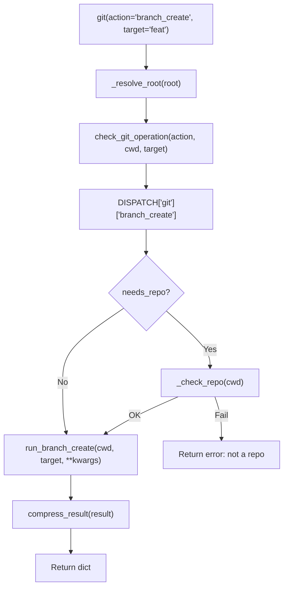

# 🌿 Git Tool

The `git()` tool provides **atomic version control actions** for the MCP Agent Stack. Each action does exactly one thing — no subcommand parsing, no multiplexed behaviors, no `message`-as-DSL.

**Key characteristics:**
- **Atomic actions** — `branch_create`, `tag_delete`, `checkout_new`, etc. One action = one behavior
- **Auto-generated schema** — `@meta_tool` decorator builds `Literal` enum and docstring from DISPATCH
- **Semantic parameter names** — `target` = entity name, `message` = human-readable text
- **Path guard integration** — All operations validate through `core.path_guard`
- **Cancellation guard** — Mutating actions abort if the trace is cancelled
- **Result compression** — Large outputs auto-truncate to prevent MCP context overflow

---

## 🏗️ Architecture

The git tool follows a **thin facade + atomic action modules** pattern.

```
tools/git.py                    # @tool facade — validation, dispatch, compression
tools/_meta_tool.py             # @meta_tool decorator — auto Literal + docstring
tools/git_ops/
├── _registry.py                # DISPATCH dict + @register_action decorator
├── helpers.py                  # _git runner, _resolve_root, _check_repo
└── actions/
    ├── status.py               # Read-only: working tree status
    ├── log.py                  # Read-only: commit history
    ├── diff.py                 # Read-only: unstaged diff
    ├── show.py                 # Read-only: commit/tag/tree details
    ├── branch_list.py          # Read-only: list branches
    ├── branch_create.py        # Write: create branch pointer
    ├── branch_delete.py        # Write: delete branch (safe or force)
    ├── tag_list.py             # Read-only: list tags
    ├── tag_create.py           # Write: lightweight tag
    ├── tag_delete.py           # Write: delete tag
    ├── checkout_branch.py      # Write: switch to existing branch
    ├── checkout_new.py         # Write: create and switch to new branch
    ├── commit.py               # Write: stage all + commit
    ├── add.py                  # Write: stage files
    ├── init.py                 # Write: init repo + .gitignore + initial commit
    ├── restore.py              # Write: restore file to HEAD
    ├── rollback.py             # Write: reset to HEAD (safe stash or force)
    └── snapshot.py             # Write: stage all + timestamped commit
```

### Dispatch Flow



**Key design decisions:**
- **Unified DISPATCH** — Single dict holds all actions, handlers, repo validation, help text, examples. `@meta_tool` reads it to generate schema and docstring. One source. Zero drift.
- **Atomic actions** — No `message` subcommand parsing. `branch_create` is one action, `branch_delete` is another. The LLM never needs to learn a mini-DSL.
- **Semantic parameters** — `target` = branch name, tag name, commit hash. `message` = commit message, snapshot note. `path` = file path. No overloaded parameters.
- **Needs repo validation** — Dispatcher checks `_check_repo()` before write actions. Read-only actions skip this (git handles non-repo errors gracefully).
- **Backward-compat alias** — `path` parameter can override `root="workspace"` with an absolute directory path (legacy behavior preserved).
- **Cancellation guard** — `ensure_not_cancelled(trace_id)` aborts before any git mutations.

---

## 📋 Tool Signature

```python
@tool
@meta_tool(DISPATCH["git"])
def git(
    action: Literal[
        "status", "log", "diff", "commit", "add", "init",
        "restore", "rollback", "snapshot", "show",
        "branch_list", "branch_create", "branch_delete",
        "tag_list", "tag_create", "tag_delete",
        "checkout_branch", "checkout_new",
    ],
    message: str = "",
    root: str = "agent",
    n: int = 10,
    path: str = "",
    force: bool = False,
    target: str = "",
    trace_id: str = "",
) -> dict:
    """..."""
```

| Param | Type | Default | Description |
|-------|------|---------|-------------|
| `action` | `Literal[...]` | — | **Required.** Atomic action name. See Actions table below |
| `message` | `str` | `""` | Human-readable text (commit message, snapshot note) |
| `root` | `str` | `"agent"` | Repo directory: `"agent"` \| `"workspace"` \| `"/absolute/path"` |
| `n` | `int` | `10` | Limit for `log` (number of commits) |
| `path` | `str` | `""` | File path for `diff`, `restore`, `add`. Backward-compat alias for absolute dirs |
| `force` | `bool` | `False` | Destructive flag for `rollback`, `branch_delete` |
| `target` | `str` | `""` | Entity name: branch, tag, commit hash, ref |
| `trace_id` | `str` | `""` | Trace identifier for observability |

**Removed in v1:** `operation` parameter. Use `action` only.

---

## 🎬 Actions

### Read-Only Actions

| Action | Required Params | Optional Params | Description |
|--------|-----------------|-----------------|-------------|
| `status` | — | `root` | Working tree status: branch, changes, clean flag |
| `log` | — | `n` (default 10), `root` | Recent commit history |
| `diff` | — | `path`, `max_lines`, `root` | Unstaged diff, optionally filtered by file |
| `show` | — | `target` (default HEAD), `root` | Commit/tag/tree details, capped at 10KB |
| `branch_list` | — | `root` | List local branches with current marker |
| `tag_list` | — | `root` | List all lightweight tags |

### Write Actions (require valid repo)

| Action | Required Params | Optional Params | Description |
|--------|-----------------|-----------------|-------------|
| `branch_create` | `target` | `root` | Create branch at current HEAD (does NOT switch) |
| `branch_delete` | `target` | `force`, `root` | Delete merged branch. `force=True` for unmerged |
| `tag_create` | `target` | `root` | Create lightweight tag at current HEAD |
| `tag_delete` | `target` | `root` | Delete a local tag |
| `checkout_branch` | `target` | `root` | Switch to existing branch/tag/commit |
| `checkout_new` | `target` | `root` | Create and switch to new branch (`git checkout -b`) |
| `commit` | `message` | `root` | Stage all + commit. Returns `nothing_to_commit` if clean |
| `add` | — | `path`, `all_files`, `root` | Stage specific file or all changes |
| `init` | — | `root` | Init repo + .gitignore + initial commit |
| `restore` | `path` | `message` (commit ref), `root` | Restore file to HEAD or specified commit |
| `rollback` | — | `force`, `root` | Reset to HEAD. Safe stash or force discard |
| `snapshot` | — | `message`, `root` | Stage all + timestamped commit (safe rollback point) |

### Action Details

#### `branch_create` vs `checkout_new`

```python
# Creates branch pointer only — does NOT switch
git(action="branch_create", target="experiment")

# Creates AND switches — equivalent to `git checkout -b`
git(action="checkout_new", target="experiment")
```

#### `branch_delete` — Safe vs Force

```python
# Safe delete — only if merged
git(action="branch_delete", target="old-fix")

# Force delete — even if unmerged (destructive)
git(action="branch_delete", target="wip", force=True)
```

#### `tag_create` — Lightweight Only

```python
# Lightweight tag (current behavior)
git(action="tag_create", target="v1.0")

# Annotated tags = future `tag_annotate` action (not yet implemented)
```

#### `show` — Target Parameter (not message)

```python
# v1: use target for commit hash/tag name
git(action="show", target="abc1234")
git(action="show", target="v1.0")

# Default: shows HEAD
git(action="show")
```

---

## 🔒 Security & Safety

| Feature | Implementation |
|---------|---------------|
| **Path guard** | `check_git_operation()` validates cwd is within `agent_root`/`workspace_root` |
| **Cancellation guard** | `ensure_not_cancelled(trace_id)` aborts before mutations |
| **Repo validation** | `needs_repo=True` actions call `_check_repo()` before handler |
| **Excluded commands** | `fetch`, `pull`, `merge`, `rebase`, `push` — require human judgement |
| **Safe rollback** | `rollback` stashes changes before reset (recoverable) |
| **Force flag** | `force=True` required for destructive operations |
| **Result compression** | `compress_result()` prevents MCP context overflow |
| **Timeout** | All git commands timeout at 15s |

---

## ⚙️ Configuration

No dedicated `.env` variables. Uses:
- `cfg.agent_root` — default repo for `root="agent"`
- `cfg.workspace_root` — default repo for `root="workspace"`

---

## 📊 `@meta_tool` Decorator

The `@meta_tool` decorator (in `tools/_meta_tool.py`) auto-generates:

1. **`Literal` enum** for the `action` parameter from DISPATCH keys
2. **Dynamic docstring** from DISPATCH help text and examples
3. **`__tool_metadata__`** for registry introspection

```python
from tools._meta_tool import meta_tool
from tools.git_ops._registry import DISPATCH

@tool
@meta_tool(DISPATCH["git"])
def git(action: str = "", ...) -> dict:
    ...
```

**Why `eval()`?** Python's `typing.Literal` requires literal values at parse time. No dynamic construction exists in the standard library. `eval()` is safe because we only eval strings constructed from validated DISPATCH keys (`^[a-z][a-z0-9_]*$`).

**Why `del fn.__signature__`?** `inspect.signature()` caches results. Stale cache won't reflect annotation mutations.

**Why return `fn` directly?** `@tool` is a marker decorator. Wrappers risk annotation loss through `functools.wraps`.

---

## 🧪 Testing

```powershell
# Run all git tests (real git repos, no mocking)
D:\mcp\agent\venv\Scripts\pytest.exe tests/tools/git -v -W error
```

**Test architecture:**
- `conftest.py` provides `mock_cfg` (autouse, redirects roots to `tmp_path`) and `git_repo` fixture
- `git_repo` creates a real git repo with initial commit in `tmp_path`
- Tests are **fully isolated** — real git operations, no subprocess mocking, no shared state
- One test file per action/concern

**Test file layout (mirrors source):**

```
tests/tools/git/
├── conftest.py                          # Shared fixtures (autouse cfg mock, git_repo)
├── test_git_branch_list.py              # branch_list action
├── test_git_branch_create.py            # branch_create action
├── test_git_branch_delete.py            # branch_delete action
├── test_git_tag_list.py                 # tag_list action
├── test_git_tag_create.py               # tag_create action
├── test_git_tag_delete.py               # tag_delete action
├── test_git_checkout_branch.py          # checkout_branch action
├── test_git_checkout_new.py             # checkout_new action
├── test_git_show.py                     # show action (target param)
├── test_git_dispatch.py                 # Unknown action, basic dispatch
├── test_git_compression.py              # Result compression
├── test_git_real_integration.py         # Full lifecycle test
└── test_git_scoping.py                  # Workflow node routing (workflows/)
```

**Mock strategy:**
- `core.config.cfg` patched at module level in `conftest.py`
- `core.path_guard.resolve_path` bypassed with permissive version
- Real `git` commands run in `tmp_path` repos

---

## 🔀 When to Use vs Alternatives

| Need | Tool | Why |
|------|------|-----|
| Check working tree | `git(status)` | Fast, read-only |
| View recent commits | `git(log)` | Structured history |
| See file changes | `git(diff)` | Unified diff, smart truncation |
| Create safe point | `git(snapshot)` | Before automated changes |
| Commit changes | `git(commit)` | After successful changes |
| Create branch | `git(branch_create)` | Atomic, no switch |
| Create + switch branch | `git(checkout_new)` | One action, no subcommand parsing |
| Switch branches | `git(checkout_branch)` | Atomic, clear intent |
| Tag release | `git(tag_create)` | Lightweight tag |
| View commit details | `git(show)` | Capped at 10KB |
| Undo uncommitted changes | `git(rollback)` | Safe stash or force discard |
| Restore file | `git(restore)` | To HEAD or specific commit |
| Init new repo | `git(init)` | With .gitignore + initial commit |

---

## 🛡️ AI Agent Instructions

If you are an AI assistant modifying the git tool:

1. **Never add subcommand parsing to action handlers** — one action = one behavior. No `message` as mini-DSL.
2. **Use `target` for entity names, `message` for human-readable text** — semantic clarity for the LLM.
3. **Add new actions by creating a file + `@register_action`** — DISPATCH and schema auto-update via `@meta_tool`.
4. **Never use `operation` parameter** — removed in v1. Use `action` only.
5. **Never create wrapper functions inside `@meta_tool`** — return `fn` directly. `@tool` is a marker decorator.
6. **Never hardcode `Literal` values separate from DISPATCH** — DRY violation. DISPATCH is single source of truth.
7. **Never forget to delete `fn.__signature__`** — stale cache won't reflect annotation mutations.
8. **Never skip action name validation before `eval()`** — `^[a-z][a-z0-9_]*$` regex. Rejects dunder names, builtins, Unicode.
9. **Never use `str.isidentifier()` alone** — accepts `__import__`, dunder names.
10. **Never create shadow tools** — one `git()` tool with atomic actions, not `git_branch()`, `git_tag()`, etc.
11. **Never use AST introspection for action discovery** — DISPATCH dict is explicit and robust.
12. **Never patch FastMCP internal schema after registration** — patch `__annotations__` BEFORE `mcp.tool()(fn)`.
13. **Never leave orphaned old files when splitting** — delete `branch.py` when creating `branch_list.py` + `branch_create.py` + `branch_delete.py`.
14. **Never use `**kwargs` in tool function signatures** — breaks FastMCP schema generation. Exception: inside action handlers, `**kwargs` absorbs unused dispatcher params.
15. **Never add legacy aliases** — two ways to do the same thing = two failure modes.
16. **Never duplicate docstring sources** — DISPATCH `help_text` and `examples` are canonical. `@meta_tool` generates the rest.
17. **Never use `message` for non-human-readable values** — `target` = commit hash, branch name, tag name.
18. **Never forget to restart LM Studio after schema changes** — cached tool schemas require full restart.
19. **Never skip `compileall` before `pytest`** — syntax errors crash pytest with confusing tracebacks.
20. **Never use `@meta_tool` without `@tool`** — `@meta_tool` alone won't register with MCP. `@tool` alone won't generate the `Literal` enum.
21. **Never store metadata as scattered attributes** — `__tool_metadata__` single object.
22. **Never use `needs_repo=False` for actions that require a repo** — per-action `needs_repo` lets the dispatcher validate uniformly.
23. **Never create annotated tags in `tag_create`** — lightweight only. Annotated tags = separate `tag_annotate` action.
24. **Never confuse `branch_create` with `checkout_new`** — `branch_create` = `git branch <name>` (pointer only). `checkout_new` = `git checkout -b <name>` (creates AND switches).
25. **Never forget to search entire codebase for old references** — after renaming params or actions, run `Select-String` across all `.py` files.
26. **Never skip test file cleanup when restructuring** — delete old test files. Verify no import references remain.
27. **Keep tool facade thin** — validation, dispatch, compression. Business logic lives in action handlers.
28. **Document design decisions in comments** — explain WHY, not just WHAT. Future AI auditors need context.

---

## 🔗 Source Code Reference

| File | Purpose |
|------|---------|
| `tools/git.py` | `@tool` facade: validation, dispatch, compression, cancellation guard |
| `tools/_meta_tool.py` | `@meta_tool` decorator: auto `Literal`, docstring, metadata |
| `tools/git_ops/_registry.py` | `DISPATCH` dict, `@register_action` decorator |
| `tools/git_ops/helpers.py` | `_git` runner, `_resolve_root`, `_check_repo` |
| `tools/git_ops/actions/*.py` | Individual atomic action handlers |
| `registry.py` | `get_tool_names()`, `get_tool_actions()` for router introspection |
| `tests/tools/git/conftest.py` | Test fixtures: `mock_cfg` (autouse), `git_repo` |
| `workflows/autocode_helpers/git_ops.py` | Autocode workflow helpers: `_git_snapshot`, `_git_commit`, `_git_create_branch` |

---

## 🔮 Future Roadmap

### ✅ Completed Phases

| Phase | Status | Description |
|-------|--------|-------------|
| **v1** | ✅ Complete | Un-multiplex git: 8 atomic actions, `@meta_tool`, semantic params, test restructure |

### 🔵 v2 (Planned)

| Priority | Feature | Description |
|----------|---------|-------------|
| 🔵 1 | Per-action param filtering | Dispatcher only passes params the handler accepts. `@meta_tool` generates param-to-action matrix. |
| 🔵 2 | Roll `@meta_tool` to `browser` | `browser` already has clean DISPATCH — low effort, high value |
| 🔵 3 | Roll `@meta_tool` to `file` | `file` has DISPATCH from `_registry` — mechanical refactor |
| 🔵 4 | Roll `@meta_tool` to `web` | Requires DISPATCH refactor first, then mechanical |
| 🔵 5 | Evaluate `memory`, `agent`, `report` | Complex dispatch patterns — may need different approach |

### 🔵 v3 (Planned)

| Priority | Feature | Description |
|----------|---------|-------------|
| 🔵 1 | Role-aware action visibility | Per-role action filters in router prompt (not schema — FastMCP limitation) |
| 🔵 2 | Action telemetry | Automatic usage tracking per action: calls, errors, avg duration |

### 🔵 v4 (Planned)

| Priority | Feature | Description |
|----------|---------|-------------|
| 🔵 1 | `git push` action | Requires explicit remote name for safety. Enables GitHub tool integration. |
| 🔵 2 | GitHub tool | PR/Issue/Release CRUD via GitHub API. Separate tool from git. |

### 🔵 v5 (Planned)

| Priority | Feature | Description |
|----------|---------|-------------|
| 🔵 1 | Composite action hints | `@meta_tool` exposes "suggested next actions" in metadata for planner guidance |

---

*Last updated: v1 complete. 37 git tests passing, 1082 total tests passing. Architecture: thin facade + @meta_tool + atomic action modules + real git test repos.*
