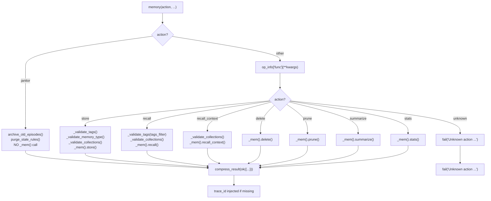

# 🧠 Memory Tool

The `memory()` tool is the **LLM-facing interface** to the agent's persistent memory backend. It wraps `core.memory_engine.MemoryStore` in a single `@tool` function with `@meta_tool` auto-discovery dispatch, providing the LLM with a unified API for storing, recalling, and maintaining memories across three collections.

**Key characteristics:**
- **Atomic action dispatch** — `@meta_tool` + `@register_action` auto-discovery (v1.0)
- **Lazy loading** — ChromaDB is only imported on first non-janitor call via `_mem()` in `helpers.py`
- **Janitor bypass** — `archive_old_episodes()` and `purge_stale_rules()` run without touching the memory store (avoids ChromaDB load)
- **Tag validation** — MED-05 compliant: XSS/injection prevention, length limits, character whitelist
- **Result compression** — All responses pass through `compress_result()` to prevent context window bloat
- **Trace ID threading** — `trace_id` propagated through all action results for observability
- **Fail-fast validation** — Invalid `memory_type` and empty `collections=[]` rejected at tool layer, not silently coerced

---

## ⚠️ Breaking Changes (v1.0)

| Old | New | Migration |
|-----|-----|-----------|
| `core/memory.py` import | `core/memory_engine.py` | Internal change — no LLM-facing impact |
| `tools/memory_tool.py` | `tools/memory.py` | Facade renamed; all imports updated |
| `tools/memory_tool.py` monolith | `tools/memory_ops/actions/*.py` | Logic split into 8 atomic action files |
| `tests/tools/memory_tool/` | `tests/tools/memory/` | Test folder renamed; monolithic tests split |
| Monolithic if/elif dispatch | `@meta_tool` + `@register_action` auto-discovery | Same API surface; internal architecture changed |
| 7 actions | 8 actions | Added `recall_context` (formatted string for prompt injection) |

---

## 🚀 Quick Start

```python
# Store an episodic memory
memory(
    action="store",
    memory_type="episodic",
    text="Fixed SyntaxError in tools/web.py -- missing colon after def",
    importance=8,
    goal="fix scraping bug",
    outcome="success",
    tools_used="python,git",
    trace_id="abc123"
)

# Recall procedural rules`nmemory(`n    action="recall",`n    query="how to fix syntax errors",`n    collections=["procedural"],`n    top_k=3`n)`n`n# Get formatted context for prompt injection`nmemory(`n    action="recall_context",`n    query="how to fix syntax errors",`n    collections=["procedural"],`n    top_k=3`n)

# Get formatted context for prompt injection
memory(
    action="recall_context",
    query="how to fix syntax errors",
    collections=["procedural"],
    top_k=3
)

# Run maintenance
memory(action="janitor")
```

---

## 🏗️ Architecture

```text
tools/memory.py                    # @tool + @meta_tool facade — pure dispatch
tools/memory_ops/
├── __init__.py                    # Auto-imports actions to trigger @register_action
├── _registry.py                   # DISPATCH dict + @register_action decorator
├── state.py                       # Singleton store instance + reset_state()
├── helpers.py                     # _mem(), _validate_tags(), _validate_memory_type(), _validate_collections()
└── actions/
    ├── store.py                   # @register_action("memory", "store")
    ├── recall.py                  # @register_action("memory", "recall")
    ├── recall_context.py          # @register_action("memory", "recall_context") — NEW v1.0
    ├── delete.py                  # @register_action("memory", "delete")
    ├── prune.py                   # @register_action("memory", "prune")
    ├── summarize.py               # @register_action("memory", "summarize")
    ├── stats.py                   # @register_action("memory", "stats")
    └── janitor.py                 # @register_action("memory", "janitor") — NEVER calls _mem()

core/memory_engine.py              # Thin facade — re-exports MemoryStore singleton
core/memory_backend/               # Implementation (see docs/core/MEMORY.md)
```

### Dispatch Flow



### Lazy Loading Pattern

```python
# tools/memory_ops/helpers.py
import tools.memory_ops.state as state

def _mem() -> "MemoryStore":
    """Lazy import of memory store — avoids slow ChromaDB load at startup."""
    with state._store_lock:
        if state._store is None:
            from core.memory_engine import MemoryStore
            state._store = MemoryStore()
        return state._store
```

The `janitor` action is handled by a separate handler that **never** calls `_mem()`. This means:
- `memory(action="janitor")` never imports ChromaDB
- Server startup is fast even if ChromaDB is not installed
- The janitor operates on the filesystem (JSONL logs) and isolated ChromaDB instance, not the main store

### State Ownership Pattern

```python
# tools/memory_ops/state.py
_store: "MemoryStore | None" = None
_store_lock = threading.Lock()

def reset_state() -> None:
    """Clear the cached store instance. Call between tests."""
    global _store
    with _store_lock:
        _store = None
```

All access to `_store` goes through `state._store`. Tests clear it via `state.reset_state()`. No cross-module reference divergence possible.

---

## 📝 Tool Signature

```python
@tool
@meta_tool(DISPATCH.get("memory", {}), doc_sections=[...])
def memory(
    action: str,
    text: str = "",
    memory_type: str = "semantic",
    importance: int = 5,
    tags: str = "",
    trace_id: str = "",
    goal: str = "",
    outcome: str = "unknown",
    tools_used: str = "",
    source: str = "",
    query: str = "",
    top_k: int = 5,
    collections: list = None,
    min_score: float = 0.5,
    tags_filter: str = "",
    threshold: float = 0.0,
    confirm_ids: list = None,
    max_age_days: int = 30,
    min_importance: int = 3,
    dry_run: bool = True,
) -> dict:
    """Memory meta-tool — atomic actions."""
```

| Parameter | Type | Required | Description |
|-----------|------|----------|-------------|
| `action` | `Literal[...]` | **Yes** | One of: `store`, `recall`, `recall_context`, `delete`, `prune`, `summarize`, `stats`, `janitor` |
| `text` | `str` | No | Memory content. **Required** for `store`. |
| `memory_type` | `str` | No | Target collection: `episodic` / `semantic` / `procedural`. Default: `semantic`. |
| `importance` | `int` | No | Base score 1–10. Default: `5`. Higher = slower decay. |
| `tags` | `str` | No | Comma-separated tags. Max `cfg.max_tags_per_entry`. |
| `trace_id` | `str` | No | Trace identifier for logging and correlation. |
| `goal` | `str` | No | What was being attempted (episodic/procedural). |
| `outcome` | `str` | No | `success` / `failure` / `partial` / `unknown`. Default: `unknown`. |
| `tools_used` | `str` | No | Comma-separated tool names (episodic). |
| `source` | `str` | No | Source attribution (semantic), e.g. URL. |
| `query` | `str` | No | Search query. **Required** for `recall`, `recall_context`, and `delete`. |
| `top_k` | `int` | No | Max results for `recall` / `recall_context`. Default: `5`. |
| `collections` | `list` | No | Filter to specific collections. Default: all. `[]` is **rejected**. |
| `min_score` | `float` | No | Minimum decay score for `recall`. Default: `0.5`. |
| `tags_filter` | `str` | No | Comma-separated — only return memories with ANY of these tags. |
| `threshold` | `float` | No | Similarity threshold for `delete`. |
| `confirm_ids` | `list` | No | Specific IDs to delete (bypasses similarity search). |
| `max_age_days` | `int` | No | For `prune`: max age before removal. Default: `30`. |
| `min_importance` | `int` | No | For `prune`: minimum importance to keep. Default: `3`. |
| `dry_run` | `bool` | No | For `prune`: preview deletions without executing. Default: `True`. |

---

## ⚡ Actions

### `store` — Save a Memory

Stores text into one of three typed collections with deduplication, decay scoring, and tag validation.

**Validation:**
- Missing `text` → `fail("text is required for store")`
- `importance` outside 1–10 → `fail("importance must be 1-10, got ...")`
- Text exceeds `cfg.memory_max_entry_bytes` → `fail("text is ... bytes -- exceeds ...")`
- Invalid tags → `fail("Tags cannot contain: ...")` or `fail("Tag contains invalid characters: ...")`
- Invalid `memory_type` → `fail("Invalid memory_type '...'. Must be one of: episodic, procedural, semantic")`
- Empty `collections=[]` → `fail("collections cannot be empty — omit or pass None for all")`

**Typed helpers in backend:**
- `memory_type="episodic"` → `store.store_episodic(...)` — task runs, outcomes
- `memory_type="semantic"` → `store.store_semantic(...)` — facts, research
- `memory_type="procedural"` → `store.store_procedural(...)` — fix patterns, solutions

**Return:**
```json
{
  "status": "success",
  "data": {
    "status": "stored",
    "id": "uuid",
    "trace_id": "abc123"
  }
}
```

Or if duplicate detected:
```json
{
  "status": "success",
  "data": {
    "status": "skipped_duplicate",
    "reason": "semantic_match",
    "directive": "This knowledge is already in memory. Do not retry.",
    "matched_snippet": "First 200 chars...",
    "existing_id": "uuid",
    "retry_recommended": false
  }
}
```

### `recall` — Semantic Search

Searches across memory collections using ChromaDB vector similarity, ranked by decay score.

**Validation:**
- Missing `query` → `fail("query is required for recall")`
- Invalid `tags_filter` → `fail("Tags cannot contain: ...")`
- Empty `collections=[]` → `fail("collections cannot be empty — omit or pass None for all")`

**Return:**
```json
{
  "status": "success",
  "data": {
    "count": 3,
    "results": [
      {
        "text": "To fix SyntaxError: always check line N-2 for unclosed bracket",
        "collection": "procedural",
        "score": 0.95,
        "tags": ["syntax", "debug"],
        "metadata": {...},
        "id": "uuid"
      }
    ]
  }
}
```

### `recall_context` — Formatted Context for Prompt Injection *(NEW v1.0)*

Returns a pre-formatted string of top memories, not a JSON list. Use this when you need to inject memory context directly into a system prompt.

**Validation:**
- Missing `query` → `fail("query is required for recall_context")`
- Empty `collections=[]` → `fail("collections cannot be empty — omit or pass None for all")`

**Return:**
```json
{
  "status": "success",
  "data": {
    "context": "1. [procedural] To fix SyntaxError...\n2. [semantic] ChromaDB supports..."
  }
}
```

### `delete` — Remove Memories

Removes memories by similarity query or explicit IDs.

**Validation:**
- Missing `query` → `fail("query is required for delete")`

**Return:** Deletion status payload from `store.delete()`.

### `prune` — Maintenance Cleanup

Removes stale or low-importance memories. Defaults to `dry_run=True` for safety.

**Return:** Prune statistics from `store.prune()`.

### `summarize` — Collection Summary

Generates an LLM summary of top memories across collections.

**Return:** Summary text from `store.summarize()`.

### `stats` — Collection Statistics

Returns counts for all collections without loading ChromaDB vectors.

**Return:**
```json
{
  "status": "success",
  "data": {
    "collections": {
      "episodic": {"count": 1234},
      "semantic": {"count": 567},
      "procedural": {"count": 89}
    },
    "total": 1890
  }
}
```

### `janitor` — Memory Compaction

Runs maintenance without loading the main memory store. This is the **fastest** memory action because it bypasses ChromaDB entirely.

**What it does:**
1. `archive_old_episodes()` — Move old episodic memories to `episodic_archive` collection
2. `purge_stale_rules()` — Delete low-confidence rules from the isolated `procedural_meta` collection

**Return:**
```json
{
  "status": "success",
  "data": {
    "episodic_archived": 42,
    "rules_purged": 7,
    "errors": []
  }
}
```

---

## 🔒 Tag Validation (MED-05)

All tag inputs (`tags` for `store`, `tags_filter` for `recall`) pass through `_validate_tags()`:

| Rule | Enforcement |
|------|-------------|
| **Dangerous characters** | `< > " ' \` \|` — immediate rejection |
| **Max tags per entry** | `cfg.max_tags_per_entry` (default 6) for `store`; 10 for `tags_filter` |
| **Max tag length** | `cfg.max_tag_length` (default 50) |
| **Must start with** | Letter `[a-zA-Z]` |
| **Allowed characters** | Letters, numbers, hyphens, dots, underscores, spaces |
| **Pattern** | `^[a-zA-Z][a-zA-Z0-9_.\s-]*$` |

```python
def _validate_tags(tags: str, max_count: int = 6) -> tuple[bool, str]:
    """
    Returns (is_valid, error_message).
    Empty string is valid (no tags).
    """
```

**[DESIGN] `_validate_tags()` uses different limits for store vs recall:**
- `store`: `cfg.max_tags_per_entry` (default 6) — strict, enforced at write time
- `recall tags_filter`: hardcoded 10 — relaxed, read-only query parameter
This is intentional. Do not "simplify" both to the same config value.

---

## 📊 Result Compression

All action results pass through `compress_result()` from `core.utils`:

- Large `text` fields are truncated with artifact recovery
- Full content saved to `workspace/.artifacts/`
- Structured metadata always preserved
- `trace_id` threaded through for observability

**[DESIGN] `compress_result()` is called in the facade, not individual actions.**
The facade applies it uniformly to all handler outputs (both success and error). This is infrastructure, not business logic.

---

## ⚙️ Configuration

| Env Variable | Default | Description |
|--------------|---------|-------------|
| `MEMORY_MAX_ENTRY_BYTES` | `50000` | Max bytes per memory entry (50KB) |
| `MAX_TAGS_PER_ENTRY` | `6` | Max tags per memory entry |
| `MAX_TAG_LENGTH` | `50` | Max characters per tag |

---

## 🧪 Testing

```powershell
# Run all memory tool tests
D:\mcpgentenv\Scripts\pytest.exe tests/tools/memory/ -v -W error --tb=short
```

**Test layout:**
```text
tests/tools/memory/
├── conftest.py              # Shared fixtures: reset_memory_state, mock_store, mock_cfg
├── test_facade.py           # @meta_tool metadata, action Literal, unknown action, trace_id, compress_result
├── test_registry.py         # DISPATCH, @register_action, duplicate guard
├── test_store.py            # store action: validation, dedup, size limits, memory_type fail-fast, collections guard
├── test_recall.py           # recall action: search, filtering, tags_filter
├── test_recall_context.py   # recall_context action: formatted string, collections guard
├── test_delete.py           # delete action: similarity, confirm_ids
├── test_prune.py            # prune action: dry_run, age/importance filters
├── test_summarize.py        # summarize action
├── test_stats.py            # stats action
├── test_janitor.py          # janitor action: bypass (assert _mem never called), archive, purge
└── test_tag_validation.py   # MED-05: XSS, length, character rules
```

**Mock strategy:**
- Patch `tools.memory_ops.helpers._mem` with `MagicMock` for all unit tests
- Patch `core.memory_backend.janitor.archive_old_episodes` for janitor tests
- Patch `core.sleep_learn.janitor.purge_stale_rules` for janitor tests
- Patch `cfg.memory_max_entry_bytes`, `cfg.max_tags_per_entry`, `cfg.max_tag_length` for validation tests
- Call `tools.memory_ops.state.reset_state()` between tests (autouse fixture)

---

## 🗺️ Roadmap

### ✅ Completed

| Feature | Status | Notes |
|---------|--------|-------|
| Monolithic `memory(action, ...)` dispatch | ✅ pre-v1 | Single `@tool` function with if/elif branching |
| Lazy ChromaDB loading | ✅ pre-v1 | `_mem()` closure; janitor bypasses store entirely |
| 7 actions (store/recall/delete/prune/summarize/stats/janitor) | ✅ pre-v1 | All wired to `core.memory_engine.MemoryStore` |
| Tag validation (MED-05) | ✅ pre-v1 | XSS/injection prevention, length limits, character whitelist |
| Result compression | ✅ pre-v1 | `compress_result()` on all outputs |
| Trace ID threading | ✅ pre-v1 | Propagated through all action results |
| Janitor bypass optimization | ✅ pre-v1 | `archive_old_episodes()` + `purge_stale_rules()` without store load |
| `@meta_tool` + `@register_action` auto-discovery | ✅ v1.0 | `Literal` enum, dynamic docstring, no central wiring |
| Un-multiplex to `memory_ops/actions/*.py` | ✅ v1.0 | 8 atomic action files |
| Rename `tools/memory_tool.py` → `tools/memory.py` | ✅ v1.0 | Facade renamed; all imports updated |
| Rename test folder `memory_tool/` → `memory/` | ✅ v1.0 | Monolithic tests split into per-action files |
| Add `conftest.py` with shared fixtures | ✅ v1.0 | `reset_memory_state`, `mock_store`, `mock_cfg` |
| Split tests into per-action files | ✅ v1.0 | `test_store.py`, `test_recall.py`, etc. |
| Add `test_tag_validation.py` | ✅ v1.0 | Dedicated MED-05 coverage |
| Add `test_facade.py` | ✅ v1.0 | `@meta_tool` metadata, action Literal, unknown action guard |
| Add `test_registry.py` | ✅ v1.0 | `DISPATCH` dict, `@register_action`, duplicate guard |
| Add `recall_context` action | ✅ v1.0 | Formatted string for direct prompt injection |
| Fail-fast `memory_type` validation | ✅ v1.0 | Reject invalid types instead of silent coercion to "semantic" |
| Reject empty `collections=[]` | ✅ v1.0 | Prevent silent all-collections fallback |
| `state.py` singleton pattern | ✅ v1.0 | Isolated `_store` with `reset_state()` for tests |

### 🔄 In Progress / Next Up (v1.1)

| Feature | Notes | Priority |
|---------|-------|----------|
| `export`/`import` actions | JSONL backup/restore for collections. Needs file path validation (path guard). | P1 |
| AND-based tag filtering (`tags_required`) | Current `tags_filter` is OR-based. AND filtering for precise procedural recall. | P1 |
| `memory(action="health")` | Lightweight ChromaDB connectivity check. | P2 |
| `store_batch` action | Store multiple memories in one call. Cap at 20 entries. | P2 |

### 🚫 Deferred / Out of Scope

| # | Feature | Why Deferred | Priority |
|---|---------|------------|----------|
| 1 | Streaming memory writes | ChromaDB does not support streaming inserts | Skip |
| 2 | Real-time memory sync | No multi-agent deployment currently | Skip |
| 3 | Custom embedding models | `all-MiniLM-L6-v2` is fast and accurate enough | Skip |
| 4 | Memory graph queries | Relationship tracking belongs in backend, not tool | Skip |
| 5 | Typed convenience actions (`store_episodic`, etc.) | Bloats schema; LLM handles `memory_type` fine | Skip |
| 6 | Tag auto-completion | Complex, low ROI; LLM generates tags well from context | Skip |
| 7 | Memory versioning / diffs | Complex; audit trails belong in UI layer | Skip |
| 8 | Collection migration | Only needed if schema changes; rare | Skip |
| 9 | Namespace isolation | Only needed for multi-tenant deployments | Skip |

---

## 🛡️ AI Agent Instructions

### NEVER DO
1. **Never add logic to `tools/memory.py`** — Logic belongs in `core.memory_backend/` or `core.memory_engine`. The facade is pure dispatch.
2. **Never remove the janitor bypass** — `archive_old_episodes()` and `purge_stale_rules()` must run without loading the memory store.
3. **Never skip `_validate_tags()`** — All tag inputs must pass MED-05 validation before reaching the backend.
4. **Never remove `compress_result()`** — All tool outputs must be compressed to prevent context window bloat.
5. **Never hardcode tag limits** — Use `cfg.max_tags_per_entry` and `cfg.max_tag_length`, not magic numbers.
6. **Never create `.bak` files** — Forbidden by project rules.
7. **Never rewrite entire files** — Surgical edits only. Preserve existing code exactly.
8. **Never add `**kwargs` to the `@tool` facade** — FastMCP schema breaks.
9. **Never print to stdout** — MCP stdio corruption. Return dicts only.
10. **Never skip `compileall` before `pytest`** — Catches syntax errors early.
11. **Never call `_mem()` from `janitor.py`** — The janitor action must remain completely isolated from the main store.
12. **Never rely on backend silent coercion** — The backend defaults invalid `memory_type` to "semantic". The tool layer must reject invalid types explicitly.

### ALWAYS DO
13. **Always use `_mem()` for lazy loading** — Never import `core.memory_engine` at module level.
14. **Always handle `janitor` before `_mem()`** — Preserve the ChromaDB bypass optimization.
15. **Always thread `trace_id` through all results** — For observability and result correlation.
16. **Always validate `tags` and `tags_filter` with `_validate_tags()`** — MED-05 compliance is mandatory.
17. **Always return `fail()` with clear messages** — Unknown actions, missing params, validation errors.
18. **Always run `compileall` after editing tool files** — Verify syntax before running tests.
19. **Always run targeted tests (`tests/tools/memory/`) after changes** — Per-action coverage.
20. **Always reject empty `collections=[]`** — Prevent silent all-collections fallback.

---

## 🔗 Source Code Reference

| File | Purpose |
|------|---------|
| `tools/memory.py` | `@tool` + `@meta_tool` facade — pure dispatch (v1.0) |
| `tools/memory_ops/__init__.py` | Auto-imports actions to trigger `@register_action` |
| `tools/memory_ops/_registry.py` | `DISPATCH` dict + `@register_action` decorator |
| `tools/memory_ops/state.py` | Singleton store instance + `reset_state()` |
| `tools/memory_ops/helpers.py` | `_mem()`, `_validate_tags()`, `_validate_memory_type()`, `_validate_collections()` |
| `tools/memory_ops/actions/store.py` | Store action handler |
| `tools/memory_ops/actions/recall.py` | Recall action handler |
| `tools/memory_ops/actions/recall_context.py` | Recall context action handler (v1.0) |
| `tools/memory_ops/actions/delete.py` | Delete action handler |
| `tools/memory_ops/actions/prune.py` | Prune action handler |
| `tools/memory_ops/actions/summarize.py` | Summarize action handler |
| `tools/memory_ops/actions/stats.py` | Stats action handler |
| `tools/memory_ops/actions/janitor.py` | Janitor action handler — NEVER calls `_mem()` |
| `core/memory_engine.py` | Thin facade — re-exports `MemoryStore` singleton |
| `core/memory_backend/store.py` | `MemoryStore` class — collections, stats, write lock |
| `core/memory_backend/write_ops.py` | `execute_store()` — dedup pipeline |
| `core/memory_backend/read_ops.py` | `execute_recall()` — semantic search |
| `core/memory_backend/maintenance.py` | `execute_delete/prune/summarize/stats()` |
| `core/memory_backend/janitor.py` | `archive_old_episodes()` — episodic archival |
| `core/sleep_learn/janitor.py` | `purge_stale_rules()` — rule purging from isolated collection |
| `core/utils.py` | `compress_result()` — context window compression |
| `core/contracts.py` | `ok()`, `fail()` — standardized response format |
| `core/config.py` | `memory_max_entry_bytes`, `max_tags_per_entry`, `max_tag_length` |

---

*Last updated: July 2026. Tool signature and action behaviors reflect current `tools/memory.py` source (v1.0).*
