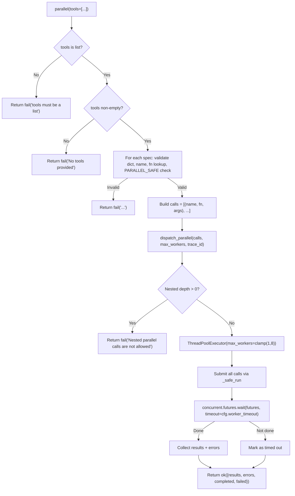

# ⚡ Parallel Tool

The `parallel()` tool executes multiple independent tool calls concurrently, reducing latency for multi-step operations. It uses a `ThreadPoolExecutor` with real global timeout enforcement and nested-call protection.

**Key characteristics:**
- **Concurrent execution** — Multiple tool calls run in parallel via `ThreadPoolExecutor`
- **Real global timeout** — `concurrent.futures.wait()` with `cfg.worker_timeout` (default 60s), not broken `as_completed()` per-future timeout
- **Nested-call guard** — `threading.local()` prevents `parallel → parallel` recursion / deadlock
- **Safety-first** — Conservative `PARALLEL_SAFE` allowlist; write-heavy tools excluded
- **Explicit mapping** — `_TOOL_MAP` imports tool functions directly; no runtime discovery

---

## 🚀 Quick Start

```python
# Parallel web searches
parallel(tools=[
    {"name": "web", "args": {"action": "search", "query": "Python 3.12 features"}},
    {"name": "web", "args": {"action": "search", "query": "Rust async patterns"}},
])

# Parallel file reads
parallel(tools=[
    {"name": "file", "args": {"action": "read", "path": "config.yaml"}},
    {"name": "file", "args": {"action": "read", "path": "README.md"}},
])

# Mixed safe tools
parallel(tools=[
    {"name": "web", "args": {"action": "search", "query": "ChromaDB best practices"}},
    {"name": "python", "args": {"mode": "run", "code": "print(2 + 2)"}},
    {"name": "notify", "args": {"action": "send", "message": "Research started"}},
])
```

---

## 🏗️ Architecture

```text
tools/parallel.py
├── parallel(tools, max_workers, allow_unsafe, trace_id)  # @tool facade — validation, safety, mapping
├── _TOOL_MAP                                              # Explicit name → function mapping (8 tools + 2 aliases)
└── dispatch_parallel(calls, max_workers, trace_id)         # Delegates to core executor

core/parallel_executor.py
├── dispatch_parallel(calls, max_workers, trace_id)         # ThreadPoolExecutor + timeout + nested guard
├── _safe_run(name, fn, args)                              # Passthrough wrapper: fn(**args)
└── PARALLEL_SAFE                                          # frozenset of 5 safe tool names
```

### Dispatch Flow



**Key design decisions:**
- **Explicit imports, no discovery** — `_TOOL_MAP` is a hardcoded dict. Tools are imported directly at module level. No runtime registry lookup, no dynamic loading. This keeps the parallel tool deterministic and avoids circular import issues.
- **Two-layer architecture** — `tools/parallel.py` handles LLM-facing validation and safety. `core/parallel_executor.py` handles pure execution. Separation means the executor can be tested independently.
- **Real global timeout** — `concurrent.futures.wait(futures, timeout=cfg.worker_timeout)` enforces a true deadline. The old `as_completed()` + `future.result(timeout=30)` pattern was broken: `as_completed()` blocks indefinitely waiting for a future to finish, so the per-future timeout never fires on a hung future.
- **Nested-call guard** — `threading.local()` tracks recursion depth. `parallel → parallel` creates a deadlock (outer waits for inner, inner waits for outer's thread pool). The guard prevents this with a clear error.
- **Conservative allowlist** — Only 5 tools in `PARALLEL_SAFE`. Write-heavy tools (`git`, `memory`, `cli`) are excluded by default. `allow_unsafe=True` bypasses the check but does not bypass the guard.
- **Result wrapping** — Every tool result is wrapped as `{"tool": name, "status": ..., "result": ...}` so consumers can correlate outputs with inputs.

---

## 📝 Tool Signature

```python
@tool
def parallel(
    tools: list[dict],
    max_workers: int = 4,
    allow_unsafe: bool = False,
    trace_id: str = "",
) -> dict:
    """Execute multiple tool calls in parallel.

    Args:
        tools: List of tool call specs. Each spec is a dict with:
            - name: str — tool name
            - args: dict — arguments to pass
        max_workers: Max concurrent threads (1-8, default 4)
        allow_unsafe: If True, allow tools not in PARALLEL_SAFE
        trace_id: Trace ID for observability

    Returns:
        ToolResult with data containing results and errors.
    """
```

| Parameter | Type | Required | Description |
|-----------|------|----------|-------------|
| `tools` | `list[dict]` | **Yes** | Each dict: `{"name": "tool_name", "args": {...}}`. Minimum 1 item. |
| `max_workers` | `int` | No | Thread pool size. Clamped to 1–8. Default: 4. |
| `allow_unsafe` | `bool` | No | If `True`, bypass `PARALLEL_SAFE` check. Default: `False`. |
| `trace_id` | `str` | No | Trace identifier for logging and result correlation. |

### Tool Spec Format

```python
{"name": "web", "args": {"action": "search", "query": "..."}}
```

| Key | Type | Required | Description |
|-----|------|----------|-------------|
| `name` | `str` | **Yes** | Tool name. Must exist in `_TOOL_MAP`. |
| `args` | `dict` | No | Keyword arguments passed to the tool function. Default: `{}`. |

---

## 🔒 Safety Model

### PARALLEL_SAFE Allowlist

```python
PARALLEL_SAFE = frozenset({
    "web",           # Network I/O — safe
    "file",          # Read ops — safe (write ops have internal locks)
    "python",        # Sandboxed execution — safe
    "python_exec",   # Alias for python — safe
    "notify",        # Desktop notification — safe
})
```

**Excluded tools (and why):**

| Tool | Reason |
|------|--------|
| `git` | Write ops (`commit`, `push`) cause `index.lock` collisions |
| `memory` | ChromaDB concurrent writes risk `database is locked` |
| `cli` | Shell commands may conflict (e.g., two `mkdir` on same path) |

### _TOOL_MAP (All Registered Tools)

| Name | Maps To | In PARALLEL_SAFE? |
|------|---------|-------------------|
| `web` | `tools.web.web` | ✅ Yes |
| `git` | `tools.git.git` | ❌ No |
| `file` | `tools.file.file` | ✅ Yes |
| `python` | `tools.python_exec.python` | ✅ Yes |
| `python_exec` | `tools.python_exec.python` (alias) | ✅ Yes |
| `notify` | `tools.notify.notify` | ✅ Yes |
| `memory` | `tools.memory_tool.memory` | ❌ No |
| `memory_tool` | `tools.memory_tool.memory` (alias) | ❌ No |
| `cli` | `tools.cli.cli` | ❌ No |

### Override (Use with Caution)

```python
parallel(tools=[...], allow_unsafe=True)
```

This bypasses the `PARALLEL_SAFE` check. **Only use if you understand the risks** (e.g., all calls are read-only, or tools have internal locking).

---

## ⏱️ Timeout Enforcement

The executor uses `concurrent.futures.wait()` with a **global timeout** from `cfg.worker_timeout`:

```python
timeout = cfg.worker_timeout  # Default: 60s (from .env WORKER_TIMEOUT)
done, not_done = concurrent.futures.wait(futures, timeout=timeout)

for future in done:
    # Collect results

for future in not_done:
    # Mark as "Timed out after {timeout} seconds"
```

**Why `wait()` instead of `as_completed()`?** The previous implementation used `as_completed()` + `future.result(timeout=30)`, which is broken: `as_completed()` blocks indefinitely waiting for a future to finish, so the per-future timeout never fires if the future hangs. `wait()` enforces a true global deadline.

**Configurable:** Set `WORKER_TIMEOUT` in `.env` to adjust the global timeout. Default is 60 seconds.

**Note:** `ThreadPoolExecutor` cannot forcefully kill a hung thread. Timed-out threads remain orphaned until their internal timeout (e.g., `httpx` timeout, `subprocess` timeout) fires. This is acceptable for I/O-bound tools with their own timeouts.

---

## 🔄 Nested-Call Guard

The executor uses `threading.local()` to track recursion depth:

```python
_parallel_depth = threading.local()

def dispatch_parallel(...):
    if getattr(_parallel_depth, "value", 0) > 0:
        return fail("Nested parallel calls are not allowed", trace_id=trace_id)

    _parallel_depth.value = getattr(_parallel_depth, "value", 0) + 1
    try:
        # Execute calls
    finally:
        _parallel_depth.value -= 1
```

**Why?** If the LLM calls `parallel` inside `parallel`, it creates a deadlock: the outer call waits for the inner call, which waits for the outer call's thread pool. The guard prevents this with a clear error message.

---

## 📤 Output

All responses are `ToolResult` dicts from `core.contracts`:

### Success
```json
{
  "status": "success",
  "trace_id": "abc123",
  "data": {
    "results": [
      {
        "tool": "web",
        "status": "success",
        "result": {"status": "success", "data": "..."}
      },
      {
        "tool": "python",
        "status": "success",
        "result": {"status": "success", "data": "4"}
      }
    ],
    "errors": [
      {
        "tool": "file",
        "error": "FileNotFoundError: config.yaml not found"
      }
    ],
    "completed": 2,
    "failed": 1
  }
}
```

### Validation Error (from facade)
```json
{
  "status": "error",
  "trace_id": "",
  "error": "Tool 'git' is not parallel-safe. Set allow_unsafe=True to override."
}
```

### Nested Call Error (from executor)
```json
{
  "status": "error",
  "trace_id": "abc123",
  "error": "Nested parallel calls are not allowed"
}
```

### Timeout Error (from executor)
```json
{
  "status": "success",
  "trace_id": "abc123",
  "data": {
    "results": [],
    "errors": [
      {"tool": "web", "error": "Timed out after 60 seconds"}
    ],
    "completed": 0,
    "failed": 1
  }
}
```

| Key | Type | Description |
|-----|------|-------------|
| `results` | `list` | Successful calls: `{"tool": str, "status": str, "result": Any}` |
| `errors` | `list` | Failed calls: `{"tool": str, "error": str}` |
| `completed` | `int` | Number of successful calls |
| `failed` | `int` | Number of failed calls (including timeouts) |

---

## 🔄 When to Use vs Alternatives

| Need | Tool | Why |
|------|------|-----|
| Multiple independent web searches | `parallel` | Network I/O is parallelizable |
| Multiple file reads | `parallel` | Disk I/O is parallelizable |
| Mixed read-only operations | `parallel` | No write conflicts |
| Multiple git commits | ❌ sequential `git` | `index.lock` collisions |
| Multiple memory writes | ❌ sequential `memory` | ChromaDB `database is locked` |
| Dependent operations (B depends on A) | ❌ sequential calls | Parallel would race |
| Single tool call | ❌ direct call | Thread pool overhead is wasteful |

---

## 🧪 Testing

```powershell
# Run all parallel tests
D:\mcp\agent\venv\Scripts\pytest.exe tests/tools/parallel/test_parallel.py -W error --tb=short -v
```

**Test coverage (15 tests):**

| Class | Tests | Coverage |
|-------|-------|----------|
| `TestValidation` | 5 | Bad types, empty tools, non-dict specs, missing name, unknown tool |
| `TestParallelSafe` | 2 | Unsafe tool blocked, `allow_unsafe=True` override |
| `TestParallelExecution` | 3 | Two tools run, tool error captured, `trace_id` passed |
| `TestExecutorEngine` | 5 | Empty calls, single call, `max_workers` extreme (capped), result wrapping, error wrapping |

**Mock strategy:**
- Patch `_TOOL_MAP` via `patch.dict` to inject `MagicMock` functions
- Mock tool functions return `{"status": "success", "data": ...}` for happy paths
- Mock `side_effect=RuntimeError("boom")` for error paths
- Test `max_workers=100` → internally capped to 8
- Test `trace_id` propagation through `ok()` / `fail()` wrappers

**Current test layout:**
```text
tests/tools/parallel/
└── test_parallel.py          # Single monolithic test file (15 tests, 4 classes)
```

> **Future:** When the tool is refactored to `@meta_tool` + un-multiplex, this will expand to `conftest.py` + per-concern test files following the `tests/tools/browser/` pattern.

---

## 🗺️ Roadmap

### ✅ Completed

| Feature | Status | Notes |
|---------|--------|-------|
| ThreadPoolExecutor concurrent execution | ✅ v1.0 | `dispatch_parallel` in `core/parallel_executor.py` |
| Real global timeout via `wait()` | ✅ v1.0 | Replaced broken `as_completed()` + `future.result()` pattern |
| Nested-call guard | ✅ v1.0 | `threading.local()` depth tracking |
| `PARALLEL_SAFE` allowlist | ✅ v1.0 | 5 tools: `web`, `file`, `python`, `python_exec`, `notify` |
| `allow_unsafe` override | ✅ v1.0 | Bypass safety check with explicit flag |
| `max_workers` clamp (1–8) | ✅ v1.0 | Prevents thread pool exhaustion |
| Explicit `_TOOL_MAP` | ✅ v1.0 | 8 tools + 2 aliases, no runtime discovery |
| Result/error wrapping | ✅ v1.0 | `{"tool": name, "status": ..., "result": ...}` per call |

### 🔄 In Progress / Next Up

| Feature | Notes | Priority |
|---------|-------|----------|
| `@meta_tool` refactor | Add `action` param for sub-commands if tool grows beyond simple dispatch | P1 |
| Test restructure | Add `conftest.py`, split `test_parallel.py` into facade vs executor test files | P1 |
| Per-tool timeout configuration | `timeout={"web": 10, "python": 60}` override global `cfg.worker_timeout` | P2 |
| Streaming partial results | Yield results as each call completes instead of batch return | P2 |
| Dynamic `PARALLEL_SAFE` | `@tool(parallel_safe=True)` decorator metadata instead of hardcoded frozenset | P3 |

### 🚫 Deferred / Out of Scope

| # | Feature | Why Deferred | Priority |
|---|---------|------------|----------|
| 1 | **ProcessPoolExecutor** | `ThreadPoolExecutor` is sufficient for I/O-bound tools. Process overhead is wasteful for short-lived calls. | Skip |
| 2 | **Asyncio rewrite** | `ThreadPoolExecutor` works fine. Asyncio would require rewriting all tool signatures to `async`. | Skip |
| 3 | **Auto-retry failed calls** | Individual tools should handle their own retry logic. Parallel layer should not mask transient failures. | Skip |
| 4 | **Result deduplication** | Not a common use case. Callers can deduplicate if needed. | Skip |
| 5 | **Cross-call dependency graph** | Would require a DAG scheduler. Use sequential calls or a workflow engine instead. | Skip |

---

## 🛡️ AI Agent Instructions

### NEVER DO
1. **Never add runtime tool discovery** — `_TOOL_MAP` is explicit. Dynamic loading risks circular imports and non-deterministic behavior.
2. **Never expand `PARALLEL_SAFE` without testing** — Adding `git`, `memory`, or `cli` causes real-world lock collisions and data corruption.
3. **Never remove the nested-call guard** — `threading.local()` is the only protection against `parallel → parallel` deadlock.
4. **Never hardcode timeout values** — Always use `cfg.worker_timeout`. The `.env` is the single source of truth.
5. **Never use `as_completed()` for timeout** — It blocks indefinitely. Always use `concurrent.futures.wait()`.
6. **Never create `.bak` files** — forbidden by project rules.
7. **Never rewrite the entire file** — surgical edits only. Preserve existing code exactly.
8. **Never add `**kwargs` to the `@tool` facade** — FastMCP schema breaks.
9. **Never print to stdout** — MCP stdio corruption. Return dicts only.
10. **Never skip `compileall` before `pytest`** — catches syntax errors early.

### ALWAYS DO
11. **Always clamp `max_workers` to 1–8** — Both in the facade and the executor. Defense in depth.
12. **Always include `trace_id` in `fail()` and `ok()` calls** — Observability requires trace correlation.
13. **Always test the kill-switch paths** — Empty `tools`, bad types, missing `name`, unknown tool, unsafe tool.
14. **Always test the nested-call guard** — Patch `_parallel_depth.value` and assert the error message.
15. **Always test timeout behavior** — Mock `cfg.worker_timeout` to a small value and verify `not_done` futures are marked timed out.
16. **Always update this doc** when adding tools to `_TOOL_MAP`, changing `PARALLEL_SAFE`, or modifying timeout behavior.

---

## 🔗 Source Code Reference

| File | Purpose |
|------|---------|
| `tools/parallel.py` | `@tool` facade: input validation, `_TOOL_MAP` lookup, `PARALLEL_SAFE` enforcement, delegates to executor |
| `core/parallel_executor.py` | Pure execution engine: `ThreadPoolExecutor`, `wait()` timeout, nested-call guard, result/error wrapping |
| `core/contracts.py` | `ok()` / `fail()` — standardized return dicts with `trace_id` injection |
| `core/config.py` | `cfg.worker_timeout` — global timeout configurable via `.env` |
| `tests/tools/parallel/test_parallel.py` | 15 tests: validation, safety, execution, executor engine |

---

*Architecture: thin @tool facade + explicit _TOOL_MAP + PARALLEL_SAFE allowlist + ThreadPoolExecutor + concurrent.futures.wait() global timeout + threading.local() nested-call guard + result/error wrapping via core.contracts.*
