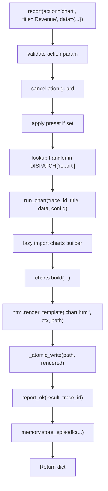

# 📊 Report Tool

The `report()` tool generates self-contained interactive HTML reports — charts, maps, dashboards, diagrams, comparisons, timelines, and scorecards. All outputs are saved to `workspace/reports/{trace_id}/` as portable HTML files that open in any browser without a server.

**Key characteristics:**
- **Atomic actions** — `chart`, `map`, `report`, `dashboard`, `diagram`, `export`, `compare`, `timeline`, `scorecard`, `list`, `help`. One action = one behavior
- **Auto-generated schema** — `@meta_tool` decorator builds `Literal` enum and docstring from DISPATCH
- **Lazy heavy imports** — pandas, jinja2, plotly, playwright imported inside function bodies only
- **Path guard integration** — All file operations validate through `core.path_guard`
- **Cancellation guard** — Aborts before any report generation if trace is cancelled
- **XSS-safe templates** — Jinja2 autoescape + no `| safe` on user-controlled text
- **Atomic file writes** — `_atomic_write` prevents partial/corrupted files on crash

---

## ⚠️ Breaking Changes (v1 → v1.1)

| Old | New | Migration |
|-----|-----|-----------|
| Manual `DISPATCH` dict with `_dispatch_*` wrappers | `@register_action` auto-discovery | No migration needed — same API |
| Manual docstring in `report()` | `@meta_tool` auto-generated | No migration needed — same API |
| `chart` rendered via `report.html` template | Dedicated `chart.html` template | No migration — output is identical |
| `sec.text \| safe` in templates | Auto-escaped (no `\| safe`) | No migration — safer by default |
| `mermaid_src \| safe` in diagram template | Auto-escaped with pre-sanitization | Mermaid.js parses escaped text correctly |
| `export` resolved against `agent` root | Resolved against `workspace` root | Reports now scoped to workspace |
| No UNC path blocking | UNC paths (`\\server\share`) blocked | Already handled by path guard |
| Cancellation import inside try/except | Import moved outside try block | ImportError no longer masked as "cancelled" |

### v1.1 (security hardening + template fixes)
- Removed `| safe` from all user-controlled template variables (`sec.text`, `mermaid_src`, `content`)
- Added `.replace("&lt;/", "&lt;\\/")` to all JSON dumps before template render (prevents `&lt;/script&gt;` injection)
- Added `_sanitize_mermaid()` in `diagrams.py` — strips `&lt;script&gt;`, `&lt;iframe&gt;`, `&lt;object&gt;`, `&lt;embed&gt;`, event handlers, `javascript:` URLs from raw mermaid strings
- Added `_validate_hex_color()` in `timeline.py` — regex `^#[0-9a-fA-F]{6}$`, fallback to `STATUS_COLORS`
- Added `_escape_svg()` quote escaping (`"` → `&quot;`) in `timeline.py`
- Added UNC path block in `data.py`: `if lowered.startswith(("\\\\", "//"))`
- Changed `export.py` to use `resolve_path(..., default_root="workspace")`
- Added `_atomic_write` to `html.py` (temp file + `os.replace`)
- Added `report.list` and `report.help` actions for LLM self-discovery
- Added `elapsed_ms` timing to all report results
- Added `tracer.warning()` logging for memory hook failures
- Added duplicate action guard in `@register_action`: raises `ValueError` on collision
- Fixed `report.html` and `dashboard.html`: added `` + `` + ``
- Fixed `dashboard.html` data structure: outer `for tab in tabs` → inner `for sec in tab.sections`
- Removed Chart.js from `base.html` `&lt;head&gt;` — loaded by individual templates (`chart.html`, `scorecard.html`) to avoid double-load

---

## 🏗️ Architecture

```
tools/report.py              # @tool facade — validation, preset merge, dispatch, memory hook
tools/_meta_tool.py         # @meta_tool decorator — auto Literal + docstring (shared)
tools/report_core/
├── _registry.py            # DISPATCH dict + @register_action + DISPATCH_METADATA + PRESETS
├── __init__.py             # Auto-discovery: glob(actions/*.py) + importlib
├── contracts.py            # report_ok / report_fail with trace_id injection
├── paths.py                # Per-run folder resolver (workspace/reports/{trace_id}/)
├── data.py                 # CSV/JSON/Excel/SQLite loader with SSRF + UNC guard
├── charts.py               # Chart.js config builder (lazy jinja2 import)
├── maps.py                 # Leaflet.js map builder (lazy jinja2 import)
├── diagrams.py             # Mermaid.js diagram builder (lazy jinja2 import)
├── html.py                 # Jinja2 renderer + _atomic_write + manifest/metrics writers
├── export.py               # Playwright PDF/PNG export (lazy import, optional)
├── compare.py              # Side-by-side diff table builder
├── timeline.py             # SVG Gantt chart builder
├── scorecard.py            # RAG status dashboard + radar chart builder
└── actions/                # Atomic action wrappers (one file per action)
    ├── chart.py            # @register_action("report", "chart")
    ├── map.py
    ├── report.py
    ├── dashboard.py
    ├── diagram.py
    ├── export.py
    ├── compare.py
    ├── timeline.py
    ├── scorecard.py
    ├── list.py             # Returns all available actions
    └── help.py             # Returns metadata for specific action
└── templates/
    ├── base.html           # Layout + sidebar + theme toggle + CSS
    ├── macros.html         # Reusable components (kpi_card, data_table, bug_card, etc.)
    ├── chart.html          # Dedicated Chart.js canvas template (NEW v1.1)
    ├── report.html         # Single-scroll report sections
    ├── dashboard.html      # Multi-panel tabs + KPIs
    ├── map.html            # Full-screen Leaflet map
    ├── diagram.html        # Mermaid architecture diagram
    ├── compare.html        # Side-by-side diff with delta highlighting
    ├── timeline.html       # SVG Gantt + event list
    └── scorecard.html      # RAG cards + radar chart
```

### Dispatch Flow



**Key design decisions:**
- **Unified DISPATCH** — Single dict holds all actions, handlers, help text, examples. `@meta_tool` reads it to generate schema and docstring. One source. Zero drift.
- **Auto-discovery** — Drop a new file in `actions/` with `@register_action` and it\'s immediately available. No manual registry updates.
- **Lazy imports** — All heavy modules (pandas, jinja2, plotly, playwright) are imported inside function bodies. MCP startup stays fast.
- **Thin facade** — `report()` validates, merges preset, dispatches, wraps result, fires memory hook. Business logic lives in builders + action wrappers.
- **Template safety** — All user-controlled text is auto-escaped by Jinja2. JSON blobs in `<script>` tags are `</script>`-escaped before render.
- **Atomic writes** — All file writes use temp file + `os.replace` to prevent partial files on crash.

---

## 🐛 Bugs Found & Fixed During v1.1 Review

These were caught by multi-LLM review (Gemini, DeepSeek, Mistral, Qwen, GLM, mimo, Claude) and fixed in v1.1. Future editors should verify these patterns are preserved.

### Template `extends` Missing
**Bug:** `report.html` and `dashboard.html` had no `` — produced raw HTML fragments without CSS/layout.  
**Fix:** Added `` + `` + `` + `` to both templates.  
**Lesson:** Always verify templates render standalone, not just as fragments inside other templates.

### Dashboard Data Structure Mismatch
**Bug:** `dashboard.html` iterated `tabs` as flat sections (`for sec in tabs`), but builder passed `tabs=[{"name": "Tab1", "sections": [...]}]`. Template expected `sec.title`, builder provided `tab.name` + `tab.sections`.  
**Fix:** Restructured to outer `for tab in tabs` → inner `for sec in tab.sections`.  
**Lesson:** Template variable names must match builder data structures exactly.

### Mermaid Autoescape Breaks Syntax
**Bug:** Removing `| safe` from `mermaid_src` caused Jinja2 autoescape to convert `&gt;` → `&gt;`, breaking Mermaid.js syntax (`A --&gt; B` became `A --&gt; B`).  
**Fix:** Added `| safe` back to `mermaid_src` in `diagram.html`, but added `_sanitize_mermaid()` in `diagrams.py` to strip HTML tags/event handlers before template render. Dict-based diagrams use `html.escape()` on labels.  
**Lesson:** `| safe` is required for syntax-heavy strings, but MUST be paired with pre-sanitization.

### SVG Color Injection
**Bug:** `timeline.py` injected `ev["color"]` directly into SVG `fill` attribute. Invalid hex or malicious strings broke SVG syntax.  
**Fix:** Added `_validate_hex_color()` with regex `^#[0-9a-fA-F]{6}$`. Fallback to `STATUS_COLORS[status]`.  
**Lesson:** Never inject user data into HTML/SVG attributes without validation.

### Cancellation Import Masks ImportError
**Bug:** `from core.runtime.cancellation import ensure_not_cancelled` was inside `try/except BaseException`. If module missing, `ImportError` (a `BaseException`) was caught and reported as "Workflow cancelled."  
**Fix:** Moved import outside try block. Set `ensure_not_cancelled = None` if `ImportError`, skip cancellation check.  
**Lesson:** Never put imports inside `except BaseException` — it masks real errors.

### Chart.js Double-Loaded
**Bug:** `base.html` loaded Chart.js CDN in `&lt;head&gt;`. `chart.html` and `scorecard.html` also loaded it. Double load wasted bandwidth and risked initialization conflicts.  
**Fix:** Removed Chart.js from `base.html`. Added `` at end of body. Individual templates load Chart.js in their script block.  
**Lesson:** Shared base templates should not load library-specific scripts — let leaf templates handle it.

### Raw String Escape Bugs
**Bug:** Regex patterns in `_sanitize_mermaid()` used raw strings with unescaped quotes: `r"[^\s&gt;"']+"` caused `SyntaxError: unterminated string literal`.  
**Fix:** Properly escaped inner quotes: `r"[^\s&gt;\"']+"`.  
**Lesson:** Always `compileall` before `pytest` — syntax errors in new code crash with confusing tracebacks.

### Template Test Data Structure Mismatch
**Bug:** Tests for `dashboard.html` passed `tabs=[{"title": "Tab1", "text": payload}]` but template expected `tabs=[{"name": "Tab1", "sections": [{"title": "Sec", "text": payload}]}]`. Tests passed empty content, assertions on escaped text failed.  
**Fix:** Updated all test data to match new template structure.  
**Lesson:** When refactoring templates, update ALL tests that render those templates — not just the builder tests.

---

## 📋 Tool Signature

```python
@tool
@meta_tool(
    DISPATCH.get("report", {}),
    doc_sections=[...]
)
def report(
    action: str = "",
    trace_id: str = "",
    title: str = "",
    data: Any = None,
    config: dict = None,
    preset: str = "",
) -> dict:
    """..."""
```

| Parameter | Type | Required | Description |
|-----------|------|----------|-------------|
| `action` | `str` | **Yes** | Report type: `chart`, `map`, `report`, `dashboard`, `diagram`, `export`, `compare`, `timeline`, `scorecard`, `list`, `help` |
| `trace_id` | `str` | No | Trace ID for correlation. Auto-generated if empty. |
| `title` | `str` | No | Report title. Used in HTML `<title>` and header. |
| `data` | `Any` | No | Inline data (dict, list) or file path string. Use `data_path` in `config` for files. |
| `config` | `dict` | No | Action-specific configuration (see below). |
| `preset` | `str` | No | Pre-configured layout: `financial`, `code_audit`, `research`, `system_health`, `compare`, `timeline`, `scorecard` |

### Config by Action

#### `action="chart"`
```python
config = {
    "chart_type": "bar",        # bar | line | scatter | pie | radar | doughnut | polarArea
    "x_label": "",
    "y_label": "",
    "color": "",                # hex or "auto" for palette
    "data_path": "",            # local CSV/JSON/Excel path (SSRF-guarded)
    "theme": "dark",            # dark | light
}
```

#### `action="map"`
```python
config = {
    "map_type": "markers",      # markers | heatmap | route | circles
    "center_lat": -15.78,
    "center_lon": -47.93,
    "zoom": 5,
    "theme": "dark",
}
```

#### `action="report"`
```python
config = {
    "sections": [...],          # [{"title": "", "text": "", "type": "text|table|chart|mermaid|code"}]
    "kpis": [...],              # [{"label": "", "value": "", "delta": ""}]
    "sources": [...],           # [{"number": 1, "url": "", "title": "", "snippets": []}]
    "theme": "dark",
    "accent": "#0d9488",
}
```

#### `action="dashboard"`
```python
config = {
    "tabs": [...],              # [{"title": "", "text": "", "type": "..."}]
    "kpis": [...],
    "charts": [...],            # list of chart specs
    "columns": 2,               # 1-4
    "theme": "dark",
    "accent": "#0d9488",
}
```

#### `action="diagram"`
```python
config = {
    "diagram_type": "flowchart",  # flowchart | sequence | class | state | gantt
    "theme": "dark",
}
```

#### `action="export"`
```python
config = {
    "format": "pdf",            # pdf | png
    "width": 1920,
    "height": 1080,
}
```

#### `action="compare"`
```python
config = {
    "before_label": "Before",
    "after_label": "After",
    "key_col": "",              # column to match rows by (for table mode)
    "theme": "dark",
}
```

#### `action="timeline"`
```python
config = {
    "width": 900,
    "bar_height": 32,
    "row_gap": 48,
    "theme": "dark",
}
```

#### `action="scorecard"`
```python
config = {
    "theme": "dark",
    "accent": "#0d9488",
}
```

#### `action="list"`
```python
# No config needed. Returns catalog of all actions.
report(action="list")
```

#### `action="help"`
```python
# data = action name to get help for
report(action="help", data="chart")
# data = empty → returns help for all actions
report(action="help")
```

### Data Shapes

**Chart data:**
```python
data = {"x": ["Q1", "Q2", "Q3"], "y": [100, 150, 130]}
data = {"labels": ["A", "B"], "values": [30, 70]}  # pie/doughnut
```

**Map data:**
```python
data = {"lat": [-23.5, -22.9], "lon": [-46.6, -43.2], "labels": ["SP", "RJ"]}
data = [{"lat": -23.5, "lon": -46.6, "popup": "São Paulo", "color": "blue"}]
```

**Table data:**
```python
data = [{"Month": "Jul", "Sales": 400}, {"Month": "Aug", "Sales": 520}]
```

**Compare data:**
```python
data = {"before": {"price": 100, "volume": 500}, "after": {"price": 120, "volume": 500}}
# or table mode:
data = {"before": [{"ticker": "PETR4", "price": 30}], "after": [{"ticker": "PETR4", "price": 32}]}
```

**Timeline data:**
```python
data = [
    {"label": "Phase 1", "start": "2026-01-01", "end": "2026-02-15", "status": "done"},
    {"label": "Phase 2", "start": "2026-02-16", "end": "2026-04-01", "status": "active"},
]
```

**Scorecard data:**
```python
data = [
    {"name": "CPU", "score": 85, "target": 90, "weight": 1.0},
    {"name": "Memory", "score": 92, "target": 90, "weight": 1.0},
]
```

---

## 🎨 Presets

Presets auto-configure layout, colors, and default sections.

| Preset | Use Case | Accent | Default Sections |
|--------|----------|--------|------------------|
| `financial` | B3/CVM market reports | `#0d9488` | overview, charts, data, sources |
| `code_audit` | Autocode bug reports | `#6366f1` | summary, issues, recommendations, changes, sources |
| `research` | Web research dossiers | `#3b82f6` | overview, findings, data, sources |
| `system_health` | Agent health dashboard | `#14b8a6` | overview, metrics, issues, logs |
| `compare` | Side-by-side diffs | `#0d9488` | diff |
| `timeline` | Project planning | `#3b82f6` | gantt, events |
| `scorecard` | Health/status checks | `#14b8a6` | overview, radar, details |

---

## 🔒 Security

| Feature | Implementation |
|---------|---------------|
| **SSRF guard** | `data_path` blocks `http://`, `https://`, `ftp://`, `file://` unconditionally |
| **UNC guard** | Windows network paths (`\\\\server\\share`, `//server/share`) blocked |
| **Path guard** | All paths resolved via `core.path_guard.resolve_path()` |
| **XSS prevention** | Jinja2 autoescape enabled; no `\| safe` on user text; JSON `</script>`-escaped |
| **Atomic writes** | `_atomic_write` uses temp file + `os.replace` to prevent partial files |
| **trace_id sanitization** | Whitelist `a-zA-Z0-9_-` — no path traversal possible |
| **Playwright optional** | If not installed, returns graceful warning instead of crash |

### Template XSS Audit (v1.1)

| Template | Variable | Status |
|----------|----------|--------|
| `report.html` | `sec.text` | ✅ Auto-escaped (no `\| safe`) |
| `dashboard.html` | `sec.text` | ✅ Auto-escaped (no `\| safe`) |
| `diagram.html` | `mermaid_src` | ✅ Auto-escaped (no `\| safe`) |
| `macros.html` | `content` (collapsible) | ✅ Auto-escaped (no `\| safe`) |
| `map.html` | `map_config_json` | ✅ `\| safe` kept (JSON in `<script>`) + `</script>` escaped |
| `scorecard.html` | `radar_config_json` | ✅ `\| safe` kept (JSON in `<script>`) + `</script>` escaped |
| `timeline.html` | `svg_html` | ✅ `\| safe` kept (builder-generated, `_escape_svg()` sanitizes text) |

### Mermaid Sanitization
| Check | Implementation |
|-------|---------------|
| Raw string input | `_sanitize_mermaid()` strips `<script>`, `<iframe>`, `<object>`, `<embed>`, event handlers (`onerror=`, `onclick=`), `javascript:` URLs |
| Dict-based input | `_dict_to_mermaid()` HTML-escapes all node labels and edge labels via `html.escape()` |
| Template render | `| safe` used on pre-sanitized string — Mermaid syntax characters (`>`, `|`, `[`, `]`) preserved |

### SVG Color Validation
| Check | Implementation |
|-------|---------------|
| User-provided color | `_validate_hex_color()` regex `^#[0-9a-fA-F]{6}$` |
| Invalid color | Falls back to `STATUS_COLORS[status]` |
| SVG text | `_escape_svg()` escapes `&`, `<`, `>`, `"` |

---

## 📤 Output

Returns:
```python
{
    "status": "success",
    "trace_id": "abc123",
    "type": "chart",
    "title": "Revenue",
    "html_path": "workspace/reports/abc123/Revenue.html",
    "chart_type": "bar",
}
```

A `manifest.json` is written alongside the HTML (for builders that support it):
```json
{
    "trace_id": "abc123",
    "action": "chart",
    "title": "Revenue",
    "created_at": "2026-06-26T21:00:00+0000",
    "files": ["Revenue.html"],
    "preset": "",
    "theme": "dark"
}
```

A `metrics.json` is also written for external ingestion:
```json
{
    "trace_id": "abc123",
    "action": "chart",
    "title": "Revenue",
    "created_at": "2026-06-26T21:00:00+0000",
    "files_count": 1,
    "preset": "",
    "theme": "dark",
    "accent": "",
    "chart_engine": "",
    "has_data": true
}
```

---

## 🧠 Memory Integration

Successful report generation stores an episodic memory entry:
```
"Generated chart report: \'Revenue\' at workspace/reports/abc123/Revenue.html"
```

The memory hook is fire-and-forget — if storage fails, the report still returns successfully.

---

## 🖨️ Print / PDF / PNG

- **Browser print** (`Ctrl+P`): Hides sidebar, expands all tabs/collapsible sections. Cards use `page-break-inside: avoid`.
- **Playwright export** (`action="export"`): Captures full report including hidden tabs. Requires `pip install playwright`.
- **Fallback**: If Playwright is not installed, returns HTML path + warning message.

---

## 🧪 Testing

```powershell
# Run all report tests
D:\\mcp\\agent\\venv\\Scripts\\pytest.exe tests/tools/report/ -W error --tb=short -v
```

**Test architecture:**
- `conftest.py` provides `mock_cfg` (autouse, redirects roots to `tmp_path`)
- Tests are **fully isolated** — real file operations in `tmp_path`, no mocking for integration tests
- One test file per concern (dispatch, contracts, paths, data, each builder, XSS, cancellation, etc.)
- `test_report_real_integration.py` exercises real `resolve_path` with real files (no monkeypatch)

**Test file layout:**
```
tests/tools/report/
├── conftest.py                           # Shared fixtures (autouse cfg mock)
├── test_report_dispatch.py               # Unknown/empty/case-insensitive actions
├── test_report_contracts.py              # report_ok / report_fail
├── test_report_paths.py                  # report_out_dir, sanitization, manifest paths
├── test_report_data.py                   # load_data: inline, file, CSV, JSON, URL/UNC blocking
├── test_report_chart.py                  # Chart.js config, palette, build
├── test_report_map.py                    # Leaflet map build
├── test_report_diagram.py                # Mermaid diagram build
├── test_report_html.py                   # render_template, atomic write, manifest/metrics
├── test_report_compare.py                # Side-by-side diff: dict, table, list modes
├── test_report_timeline.py               # SVG Gantt: parse, build, escape
├── test_report_scorecard.py              # RAG status, radar config, weighted score
├── test_report_export.py                 # PDF/PNG export, Playwright fallback
├── test_report_presets.py                # Preset merge, override, unknown preset
├── test_report_registry.py               # DISPATCH keys, metadata coverage, PRESETS
├── test_report_list.py                   # report.list action via facade
├── test_report_help.py                   # report.help action via facade
├── test_report_xss.py                    # XSS injection: text, mermaid, collapsible
├── test_report_cancellation.py           # Cancellation guard (BaseException)
├── test_report_real_integration.py       # Full stack: facade → builder → template → filesystem
└── test_report_gateway.py                # metrics.json + gateway backend routes
```

---

## 🔀 When to Use vs Alternatives

| Need | Tool | Why |
|------|------|-----|
| Bar/line/pie chart | `report(chart)` | Chart.js, client-side, no server |
| Interactive map | `report(map)` | Leaflet.js, OpenStreetMap tiles |
| Multi-section report | `report(report)` | Single-scroll, KPIs, tables, sources |
| Tabbed dashboard | `report(dashboard)` | Multi-panel with side nav |
| Architecture diagram | `report(diagram)` | Mermaid.js, auto-rendered |
| Side-by-side diff | `report(compare)` | Delta highlighting, dict/table/list modes |
| Project timeline | `report(timeline)` | SVG Gantt, status colors, today marker |
| Health/status scorecard | `report(scorecard)` | RAG colors, radar chart, weighted scoring |
| Export to PDF/PNG | `report(export)` | Playwright headless capture |
| List available actions | `report(list)` | Self-discovery for LLMs |
| Get action help | `report(help)` | Metadata: params, config keys, examples |

---

## 🛡️ AI Agent Instructions

If you are an AI assistant modifying the report tool:

### NEVER DO
1. **Never add subcommand parsing to action handlers** — one action = one behavior.
2. **Never import pandas/jinja2/plotly/playwright at module level in `actions/`** — lazy imports only. Use `from tools.report_core import charts` inside the function body.
3. **Never add `**kwargs` to the `@tool` facade** — FastMCP schema breaks. Internal dispatch wrappers can use `**kwargs`.
4. **Never print to stdout** — MCP stdio corruption. Use `sys.stderr` if needed.
5. **Never create `.bak` files** — forbidden by project rules.
6. **Never use `| safe` in templates for user-controlled text** — XSS vector. Jinja2 autoescape handles it. Exception: syntax-heavy strings (Mermaid, JSON) that are pre-sanitized.
7. **Never touch `@meta_tool` or `@register_action` shared decorators** — use `help_text` for param docs. Infrastructure changes need separate commits.
8. **Never put non-action files in `report_core/actions/`** — auto-discovery imports everything.
9. **Never cache `cfg.workspace_root` at module level** — breaks test mocking.
10. **Never skip `compileall` before `pytest`** — syntax errors crash with confusing tracebacks.
11. **Never rewrite entire files when surgical edits suffice** — preserve existing code.
12. **Never forget `&lt;/script&gt;` escaping on JSON dumps** — `json.dumps(obj).replace("&lt;/", "&lt;\\/")`
13. **Never register actions outside the `report` namespace** — `DISPATCH["report"]` is the only valid key.
14. **Never put imports inside `except BaseException`** — masks real errors (e.g., `ImportError` reported as "cancelled").
15. **Never inject user data into HTML/SVG attributes without validation** — always sanitize/validate before template render.
16. **Never load library-specific scripts in `base.html`** — let leaf templates load their own JS in ``.

### ALWAYS DO
17. **Always verify templates render standalone** — `` + `` structure must be complete.
18. **Always match template variable names to builder data structures** — `tab.name` vs `sec.title`, `tab.sections` vs flat `tabs`.
19. **Always pair `| safe` with pre-sanitization** — if you need `| safe` for syntax, sanitize the string first.
20. **Always update tests when refactoring templates** — test data structures must match template expectations.
21. **Always add `` for template-specific JS** — Chart.js, Mermaid init, etc.
22. **Always use `compileall` before `pytest`** — catches syntax errors early.

---

## 🗺️ V2 Roadmap

### Planned Actions
| Action | Status | Notes |
|--------|--------|-------|
| `compare` | ✅ v1.1 | Side-by-side diff with delta highlighting |
| `timeline` | ✅ v1.1 | SVG Gantt chart with status colors |
| `scorecard` | ✅ v1.1 | RAG dashboard with radar chart |
| `list` | ✅ v1.1 | Self-discovery: all actions with metadata |
| `help` | ✅ v1.1 | Per-action metadata lookup |
| `@meta_tool` refactor | ✅ v1.1 | Auto-generated schema + docstring |
| `@register_action` pattern | ✅ v1.1 | Auto-discovery via `actions/` directory |
| `chart.html` template | ✅ v1.1 | Dedicated template for Chart.js |
| XSS `| safe` removal | ✅ v1.1 | All user text auto-escaped |
| `_atomic_write` | ✅ v1.1 | Temp file + `os.replace` |
| UNC path blocking | ✅ v1.1 | `\\\\server\\share` blocked |
| Export workspace scoping | ✅ v1.1 | `default_root="workspace"` |
| Template standalone rendering | ✅ v1.1 | Fixed missing `` in report.html, dashboard.html |
| Mermaid pre-sanitization | ✅ v1.1 | `_sanitize_mermaid()` strips HTML tags, event handlers, javascript: URLs |
| SVG color validation | ✅ v1.1 | `_validate_hex_color()` regex + fallback |
| Cancellation import fix | ✅ v1.1 | Import outside try block |
| Chart.js deduplication | ✅ v1.1 | Removed from base.html, loaded per-template |
| `elapsed_ms` timing | ✅ v1.1 | Added to all report results |
| Memory hook logging | ✅ v1.1 | `tracer.warning()` on failure |
| Duplicate action guard | ✅ v1.1 | `ValueError` on collision in `@register_action` |
| Action-level presets | v2 | Per-action override of global presets |
| Action-level timing | v2 | `elapsed_ms` in results |
| Conditional registration | v2 | Hide `export` if Playwright missing |
| `report.compose` | v3 | Multi-step reports in one call |
| `report.preview` | v3 | Low-res preview before full render |
| Template hot-reload | v3 | Dev mode: auto-reload templates on change |
| Theme system expansion | v3 | Custom themes beyond dark/light |

### Known Limitations
- `search_files` not yet implemented for reports (no FTS index)
- `chart_engine: "plotly"` config key exists but Chart.js is the only implemented engine
- `export` PNG format works but PDF is primary use case
- Very large datasets (>10K points) may slow Chart.js rendering in browser
- Mermaid.js diagrams require internet connection for CDN (no offline bundle)

---

## 🔗 Source Code Reference

| File | Purpose |
|------|---------|
| `tools/report.py` | `@tool` facade: validation, preset merge, dispatch, memory hook |
| `tools/_meta_tool.py` | `@meta_tool` decorator: auto `Literal`, docstring (shared with git/file/cli) |
| `tools/report_core/_registry.py` | `DISPATCH` dict, `@register_action`, `DISPATCH_METADATA`, `PRESETS` |
| `tools/report_core/__init__.py` | Auto-discovery: glob + importlib for `actions/*.py` |
| `tools/report_core/contracts.py` | `report_ok`, `report_fail` return contracts |
| `tools/report_core/paths.py` | `report_out_dir()`, `report_manifest_path()` |
| `tools/report_core/data.py` | `load_data()` with SSRF + UNC blocking |
| `tools/report_core/charts.py` | Chart.js config builder |
| `tools/report_core/maps.py` | Leaflet.js map builder |
| `tools/report_core/diagrams.py` | Mermaid.js diagram builder |
| `tools/report_core/html.py` | Jinja2 renderer, `_atomic_write`, manifest/metrics writers |
| `tools/report_core/export.py` | Playwright PDF/PNG export (lazy, optional) |
| `tools/report_core/compare.py` | Side-by-side diff builder |
| `tools/report_core/timeline.py` | SVG Gantt chart builder |
| `tools/report_core/scorecard.py` | RAG status + radar chart builder |
| `tools/report_core/actions/*.py` | Atomic action wrappers (11 files) |
| `tools/report_core/templates/*.html` | Jinja2 templates (10 files) |
| `tests/tools/report/` | 21 test files + conftest.py |
| `tests/tools/report/conftest.py` | `mock_cfg` fixture (autouse) |
| `core/path_guard.py` | Centralized path validation |
| `core/gateway_backend/routes/reports.py` | Gateway API for listing reports |

---

*Architecture: thin facade + @meta_tool + atomic action modules + auto-discovery + lazy imports + XSS-safe templates + atomic file writes.*
