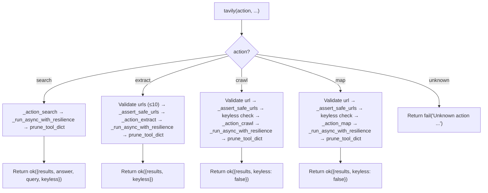

# 🔬 Tavily Tool

The `tavily()` tool provides **AI-optimized web search and content extraction** via the [Tavily API](https://tavily.com). It complements the existing `web` tool with superior ranking, automatic citations, and bulk extraction capabilities.

**Key characteristics:**
- **AI-ranked results** — Tavily's relevance engine outperforms raw SearXNG for research queries
- **Automatic citations** — Every result includes URL, title, and confidence score
- **Bulk extraction** — `extract` action can process up to 10 URLs in one call
- **Keyless mode** — Works without API key for `search` and `extract` (rate-limited)
- **Async client, sync facade** — `AsyncTavilyClient` wrapped in `_run_async()` bridge for MCP compatibility
- **Lazy client loading** — `AsyncTavilyClient` imported and instantiated only on first use
- **PARALLEL_SAFE** — Pure network I/O, no shared state
- **Circuit breaker** — Automatic fail-fast after 3 consecutive failures, recovers after 60s
- **Rate-limit retry** — Exponential backoff on `RateLimitError` (5s, 10s)

---

## ⚠️ Breaking Changes

### v1.1

| Old | New | Migration |
|-----|-----|-----------|
| `crawl`/`map` accepted `query` as URL fallback | `url` is **strictly required** for `crawl`/`map` | Pass `url=` explicitly; `query` is now only for contextual `instructions` |
| `search` silently dropped `include_images` | `include_images` is now passed to SDK | No migration — it just works now |
| `max_results` had no upper bound | `max_results` validated to 1–20 range | Values >20 now fail fast with clear error |
| `_close_client()` was a no-op | Actually closes `AsyncTavilyClient` connection pool | No migration — internal fix |
| `_run_async()` timeout was decorative | Timeout now actually fires and returns control | No migration — internal fix |

### v1.0

| Old | New | Migration |
|-----|-----|-----------|
| Monolithic `tools/tavily.py` (~526 lines) | Atomic `tools/tavily_ops/actions/*.py` (5 files) + thin facade | No migration needed — same API |
| Manual `if action == "search": ... elif ...` dispatch in facade | `@register_action` auto-discovery + `@meta_tool` | No migration needed — same API |
| Manual docstring in `tavily()` | `@meta_tool` auto-generated from `help_text` + `examples` | No migration needed — same API |
| `crawl()`/`map()` passed `query=` to SDK | Now translates to `instructions=` (SDK 0.7.26) | No migration needed — facade param name unchanged |
| `crawl()` missing `extract_depth`/`format` | Now exposed (SDK 0.7.26) | New optional params, no breaking change |
| `research()` not validated | Now validates `citation_format` against SDK Literal | Internal-only, no breaking change |
| `trace_id` hardcoded `""` in actions | Now threaded through `ok()`/`fail()`/`prune_tool_dict()` | No migration needed — already a facade param |

---

## 🚀 Quick Start

```python
# AI-ranked search
result = tavily(action="search", query="FastMCP python tutorial", max_results=5)

# Bulk URL extraction
result = tavily(action="extract", urls=["https://docs.python.org/3/library/pathlib.html", "https://..."])

# Deep site crawl (requires API key)
result = tavily(action="crawl", url="https://example.com", max_depth=2, max_breadth=10)

# Site structure map (requires API key)
result = tavily(action="map", url="https://example.com", max_depth=2)

# Keyless mode — works without API key for search/extract
result = tavily(action="search", query="Python async patterns")
# → {"status": "success", "data": {"keyless": true, ...}}

# Domain-scoped search (v1.1)
result = tavily(
    action="search",
    query="Python asyncio",
    include_domains=["github.com", "docs.python.org"],
    exclude_domains=["pinterest.com", "quora.com"]
)

# News-scoped search (v1.1)
result = tavily(action="search", query="AI regulation", topic="news")
```

---

## 🏗️ Architecture

```text
tools/tavily.py                    # @tool + @meta_tool facade — thin dispatch only
tools/tavily_ops/
├── __init__.py                    # Auto-discovery: imports _registry, glob actions/*.py
├── _registry.py                   # DISPATCH dict + @register_action decorator
├── state.py                       # _TAVILY_CLIENT, _CLIENT_LOCK, _KEYLESS_WARNED, reset_state()
├── client.py                      # _get_singleton_client(), _close_client(), _TAVILY_CB
│                                  # CRITICAL: uses `import state; state._TAVILY_CLIENT = ...`
├── bridge.py                      # _run_async() + _run_async_with_resilience() (CB + retry)
├── errors.py                      # _handle_tavily_error(), re-exports _assert_safe_urls from core.security
└── actions/
    ├── search.py                  # @register_action("tavily", "search", ...)
    ├── extract.py                 # @register_action("tavily", "extract", ...)
    ├── crawl.py                   # @register_action("tavily", "crawl", ...)
    ├── map.py                     # @register_action("tavily", "map", ...)
    └── research.py                # PLAIN function, NO @register_action (workflow-only)

core/security.py                   # is_safe_network_address(), _assert_safe_urls() (v1.1: cross-tool shared)
core/web_errors.py                 # classify_http_error(), is_retryable_error() (v1.1: new shared module)
```

### Dispatch Flow



**Key design decisions:**
- **Async-to-sync bridge** — `_run_async()` handles two cases: (1) no running loop → `asyncio.run(coro)`; (2) running loop (e.g., inside MCP) → spawns a `ThreadPoolExecutor(max_workers=1)` and runs `asyncio.run` in a fresh thread. Timeout: `cfg.tavily_timeout + 10` seconds. Deliberately uses per-call ThreadPoolExecutor instead of a persistent background loop — Tavily calls are short network requests, not long Playwright sessions.
- **v1.1: _run_async_with_resilience()** — Wraps `_run_async()` with circuit breaker (`_TAVILY_CB`) and automatic rate-limit retry (3 attempts, exponential backoff 5s/10s). Centralized in `bridge.py` so every action gets resilience without per-action edits.
- **Lazy client with key caching** — `_get_singleton_client()` caches the `AsyncTavilyClient` instance and re-creates it only if the API key changes. Thread-safe via `_CLIENT_LOCK` (double-checked locking). Keyless mode uses `api_key=None`.
- **State ownership** — `state.py` owns `_TAVILY_CLIENT`, `_CLIENT_LOCK`, `_KEYLESS_WARNED`. `client.py` does `import tools.tavily_ops.state as state` and reads/writes `state._TAVILY_CLIENT` directly. This prevents the name-binding divergence bug that broke `web_ops`'s `reset_state()`.
- **Keyless warning once** — `_warn_keyless_once()` logs a single `logger.warning` on first keyless invocation to avoid log spam. `state.reset_state()` clears `_KEYLESS_WARNED` for test isolation.
- **SSRF at action level** — `_assert_safe_urls()` is called inside `_action_extract`, `_action_crawl`, and `_action_map` (not at the facade level). `search` does not need SSRF since it doesn't fetch arbitrary URLs. v1.1: `_assert_safe_urls` moved to `core/security.py` for cross-tool sharing.
- **Raw content stripping** — `_action_search` strips `raw_content` from all results unless `include_raw_content=True`. Prevents context window explosion.
- **v1.1: Error type detection + sanitization** — `_handle_tavily_error()` uses both `isinstance` checks (with lazy tavily imports) and `type(e).__name__` string fallback. API key is stripped from all error messages before returning to the LLM, preventing accidental leakage into logs or context windows.
- **`research` is workflow-only** — `run_research()` in `actions/research.py` exists but is NOT exposed in the `@tool` facade. Not registered in `DISPATCH`. Reserved for `workflows/deep_research_impl/nodes/search.py`.
- **All outputs pruned** — Every action result passes through `prune_tool_dict()` from `core.memory_backend.pruner` before return.
- **trace_id propagation** — `trace_id` is threaded from facade through `ok()` / `fail()` / `prune_tool_dict()` in all action handlers.
- **Non-dict handler guard** — Facade checks `isinstance(result, dict)` after handler call. Returns `fail()` if handler returns non-dict (regression guard from prior refactors).

---

## 📝 Tool Signature

```python
@tool
@meta_tool(DISPATCH.get("tavily", {}), doc_sections=[...])
def tavily(
    action: str,
    query: str = "",
    urls: Optional[list[str]] = None,
    url: str = "",
    max_results: int = 5,
    search_depth: str = "basic",
    topic: str = "general",
    time_range: str = "",
    include_domains: Optional[list[str]] = None,
    exclude_domains: Optional[list[str]] = None,
    include_answer: bool = True,
    include_raw_content: bool = False,
    include_images: bool = False,
    extract_depth: str = "basic",
    format: str = "markdown",
    max_depth: int = 2,
    max_breadth: int = 10,
    limit: int = 100,
    trace_id: str = "",
) -> dict:
    """Tavily AI research tool — atomic actions for search/extract/crawl/map."""
```

| Parameter | Type | Required | Description |
|-----------|------|----------|-------------|
| `action` | `str` | **Yes** | One of `search`, `extract`, `crawl`, `map` (auto-generated Literal by @meta_tool) |
| `query` | `str` | No | Search query. **Required** for `search`. Also accepted by `crawl`/`map` as contextual `instructions`. |
| `urls` | `list[str]` | No | URLs for `extract`. **Required** for `extract`. Max 10 items. |
| `url` | `str` | No | Starting URL for `crawl`/`map`. **Required** for `crawl`/`map`. |
| `max_results` | `int` | No | Results per search. Default: 5. Range: 1–20. **Capped at 3 in keyless mode.** |
| `search_depth` | `str` | No | `"basic"` or `"advanced"`. Default: `"basic"`. |
| `topic` | `str` | No | Topic filter for search: `"general"`, `"news"`, `"finance"`. Default: `"general"`. **v1.1** |
| `time_range` | `str` | No | Time range filter for search. |
| `include_domains` | `list[str]` | No | Whitelist domains for search. **v1.1** |
| `exclude_domains` | `list[str]` | No | Blacklist domains for search. **v1.1** |
| `include_answer` | `bool` | No | Include AI-generated answer in search. Default: `True`. |
| `include_raw_content` | `bool` | No | Include full page text in search results. Default: `False`. **Large!** |
| `include_images` | `bool` | No | Include images in search results. Default: `False`. **v1.1: Now passed to SDK.** |
| `extract_depth` | `str` | No | `"basic"` or `"advanced"`. Default: `"basic"`. Now also supported by `crawl`. |
| `format` | `str` | No | Output format for extract/crawl. `"markdown"` or `"text"`. Default: `"markdown"`. |
| `max_depth` | `int` | No | Max link depth for crawl/map. Default: 2. |
| `max_breadth` | `int` | No | Max pages per level for crawl/map. Default: 10. |
| `limit` | `int` | No | Max total pages for crawl/map. Default: 100. |
| `trace_id` | `str` | No | Trace identifier for logging and result correlation. Threaded through all handlers. |

> **Note:** `input`, `model`, `citation_format` params were removed from the facade. They only existed for `research`, which is not exposed as a tool action. Call `run_research()` directly from workflows.

---

## ⚡ Actions

### `search` — AI-ranked web search

Queries Tavily and returns AI-ranked results with titles, URLs, snippets, and an optional AI-generated answer.

**Keyless behavior:**
- `max_results` is silently capped to `3`
- Response includes `"keyless": true`
- Lower rate limits apply (~100 requests/day)
- Single `logger.warning` on first keyless use

**v1.1 additions:**
- `include_images` is now passed to the SDK (was silently dropped before)
- `include_domains`/`exclude_domains` for domain-scoped research
- `topic` parameter for news/current-events filtering
- `max_results` validated to 1–20 range (fail fast on invalid values)

**Return:**
```json
{
  "status": "success",
  "data": {
    "results": [
      {"title": "...", "url": "https://...", "content": "...", "score": 0.95}
    ],
    "answer": "AI-generated summary...",
    "query": "FastMCP python tutorial",
    "keyless": false
  }
}
```

**Raw content handling:**
- Stripped from all results by default (prevents context window explosion)
- Included only if `include_raw_content=True`

**Error cases:**
- Missing `query` → `fail("action='search' requires query=")`
- `max_results` < 1 or > 20 → `fail("max_results must be >= 1")` / `fail("max_results must be <= 20")`
- Keyless rate limit → `fail("Tavily keyless rate limit reached...")`
- Invalid API key → `fail("Tavily API key invalid or revoked...")`
- Timeout → `fail("Tavily request timed out after {timeout}s.")`
- Connection error → `fail("Cannot connect to Tavily API. Check network.")`
- Circuit breaker OPEN → `fail("Tavily circuit breaker is OPEN...")`

### `extract` — Bulk URL content extraction

Accepts up to 10 URLs and returns extracted content with citations for each.

**Return:**
```json
{
  "status": "success",
  "data": {
    "results": [
      {"url": "https://...", "text": "Extracted markdown...", "images": []}
    ],
    "keyless": false
  }
}
```

**Validation:**
- Missing `urls` → `fail("urls is required for extract action")`
- More than 10 URLs → `fail("urls cannot exceed 10 items")`
- Unsafe URLs → `fail("Blocked: {url} resolves to a private/internal address")`

### `crawl` — Deep site traversal

Follows links from a starting URL up to `max_depth` levels. **Requires API key.**

**SDK note:** Tavily SDK 0.7.26 uses `instructions=` internally. The facade keeps `query` as the parameter name for backward compatibility but translates it automatically: `client.crawl(url=..., instructions=query, ...)`.

**v1.1 breaking change:** `url` is now **strictly required**. The old `url or query` fallback (where `query` would be used as the target URL) has been removed because it produced misleading SSRF errors when users passed search strings instead of URLs.

**Return:**
```json
{
  "status": "success",
  "data": {
    "results": [{"url": "...", "title": "...", "content": "..."}],
    "keyless": false
  }
}
```

**Validation:**
- Missing `url` → `fail("action='crawl' requires url=")`
- Keyless mode → `fail("action='crawl' requires a Tavily API key...")`
- Unsafe URL → `fail("Blocked: {url} resolves to a private/internal address")`

### `map` — Site structure discovery

Discovers site hierarchy without fetching full content. **Requires API key.**

**SDK note:** Same `instructions=` translation as `crawl`.

**v1.1 breaking change:** Same as `crawl` — `url` is strictly required, `query` is only for contextual instructions.

**Return:**
```json
{
  "status": "success",
  "data": {
    "results": [{"url": "...", "title": "..."}],
    "keyless": false
  }
}
```

**Validation:** Same as `crawl`.

### `research` — End-to-end deep research (workflow-only)

**NOT exposed as a tool action.** Call directly from workflows:

```python
from tools.tavily_ops.actions.research import run_research

result = run_research(
    input="Research topic",
    model=None,
    citation_format="apa",  # "numbered" | "mla" | "apa" | "chicago"
    trace_id="...",
)
```

Requires API key. Validates `citation_format` against SDK Literal type (`"numbered" | "mla" | "apa" | "chicago"`).

---

## 🔒 Security

### SSRF Guard (`_assert_safe_urls`)

All URL parameters (`url`, `urls`) pass through `_assert_safe_urls()` inside the action handlers:

```python
def _assert_safe_urls(urls: list[str]) -> tuple[bool, str]:
    for url in urls:
        hostname = urlparse(url).hostname or ""
        if not is_safe_network_address(hostname):
            return False, f"Blocked: {url} resolves to a private/internal address"
    return True, ""
```

Uses `core.security.is_safe_network_address` — same guard as `web.py`. v1.1: `_assert_safe_urls` was extracted to `core/security.py` for cross-tool sharing. Both `web_ops` and `tavily_ops` should import from there.

**Note:** `search` does not call `_assert_safe_urls()` because it does not fetch arbitrary URLs — it queries the Tavily API with a search string.

### API Key Sanitization (v1.1)

All error messages from `_handle_tavily_error()` strip the Tavily API key before returning to the LLM:

```python
raw_msg = str(e)
api_key = cfg.tavily_api_key
if api_key and api_key in raw_msg:
    raw_msg = raw_msg.replace(api_key, "***")
```

This prevents accidental key leakage into logs, traces, or LLM context windows.

---

## ⚠️ Error Handling

`_handle_tavily_error()` maps exceptions to standardized `fail()` responses:

| Condition | Detection | User Message |
|-----------|-----------|--------------|
| Keyless rate limit | `TavilyKeylessLimitError` or name match | `"Tavily keyless rate limit reached. Set TAVILY_API_KEY..."` |
| Invalid API key | `InvalidAPIKeyError` or name match | `"Tavily API key invalid or revoked. Check TAVILY_API_KEY..."` |
| Monthly quota | `UsageLimitExceededError` or name match | `"Tavily monthly quota exhausted."` |
| Tavily API error (429) | `TavilyAPIError` with status 429 | `"Tavily rate limit exceeded (HTTP 429). Retry after a short delay."` |
| Tavily API error (other) | `TavilyAPIError` | `"Tavily API error ({status}): {msg[:200]}"` |
| HTTP timeout | `httpx.TimeoutException` | `"Tavily request timed out after {cfg.tavily_timeout}s."` |
| HTTP connection error | `httpx.ConnectError` | `"Cannot connect to Tavily API. Check network."` |
| HTTP 401/403 | `httpx.HTTPStatusError` | `"Tavily authentication failed. Check API key."` |
| HTTP other | `httpx.HTTPStatusError` | `"Tavily HTTP error {status}: {msg[:200]}"` |
| Generic | Any other exception | `"Tavily error: {type}: {msg[:200]}"` |

**Detection strategy:** Uses `isinstance` checks with lazy tavily imports, falling back to `type(e).__name__` string matching. This handles both installed and mocked tavily packages.

**v1.1: Circuit breaker integration:**
- After 3 consecutive failures, the circuit breaker opens and all Tavily calls fail fast with: `"Tavily circuit breaker is OPEN. Service temporarily unavailable. Try again later or use web(search) as fallback."`
- After 60 seconds, the circuit enters HALF_OPEN and allows 1 test call.
- Success → CLOSED; failure → OPEN again.

**v1.1: Rate-limit retry:**
- `RateLimitError` triggers up to 3 retry attempts with exponential backoff (5s, 10s).
- Only `RateLimitError` is retried; other exceptions trip the circuit breaker immediately.

---

## ⚙️ Configuration

```ini
# .env
TAVILY_API_KEY=tvly-...        # Optional — enables full functionality (crawl, map, research)
TAVILY_TIMEOUT=60              # Request timeout in seconds (1-300, default 60)
```

```python
# core/config.py
self.tavily_api_key = os.getenv("TAVILY_API_KEY", "")
self.tavily_timeout = int(os.getenv("TAVILY_TIMEOUT", "60"))
```

**Requirements:**
```
tavily-python>=0.7.0,<0.8.0    # Locked to SDK version this refactor is built against
```

**Keyless mode:** When `TAVILY_API_KEY` is empty, `AsyncTavilyClient(api_key=None)` supports `search` and `extract` with lower limits. `crawl`, `map`, and `research` fail with a clear message.

---

## 📤 Output & Pruning

All responses pass through `prune_tool_dict()` from `core.memory_backend.pruner`:
- Large `raw_content` / `text` fields are truncated with artifact recovery
- Full content saved to `workspace/.artifacts/`
- Structured citations always preserved
- `trace_id` is threaded through `ok()`/`fail()`/`prune_tool_dict()` for observability

---

## 🧪 Testing

```powershell
# Run all tavily tests (fully mocked, no API calls)
D:\mcp\agent\venv\Scripts\pytest.exe tests/tools/tavily/ -W error --tb=short -v
```

**Test coverage (14 files):**

| File | Tests | Coverage |
|------|-------|----------|
| `conftest.py` | — | Shared fixtures: reset_state, mock_cfg, mock_tavily_client |
| `test_search.py` | 5 | Search action, result parsing, keyless capping, trace_id propagation |
| `test_extract.py` | 5 | Extract action, URL validation, batch processing, format handling, SSRF |
| `test_crawl.py` | 7 | Crawl action, keyless rejection, URL requirement, extract_depth/format, SDK translation |
| `test_map.py` | 6 | Map action, keyless rejection, URL requirement, SDK translation |
| `test_tavily_error_handling.py` | 11 | All error types + non-dict handler guard |
| `test_tavily_keyless_mode.py` | 5 | Keyless search/extract, keyless crawl/map rejection, warning once |
| `test_tavily_ssrf.py` | 4 | `_assert_safe_urls` blocking across extract/crawl/map, search exempt |
| `test_tavily_client.py` | 3 | Lazy client creation, key change detection, thread safety |
| `test_tavily_state.py` | 2 | State ownership regression guard (web bug), keyless warning reset |
| `test_facade.py` | 5 | `@meta_tool` metadata, action Literal, unknown action, trace_id |
| `test_registry.py` | 6 | Duplicate guard, research not in DISPATCH, all actions registered |
| `test_bridge_timeout.py` | 3 | **v1.1** — Regression test for timeout actually firing |
| `test_circuit_breaker.py` | 4 | **v1.1** — Circuit breaker state transition tests |

**Mock strategy:**
- Patch `tools.tavily_ops.client._get_singleton_client` to return `MagicMock` with `side_effect=_async_return(...)` (no `tavily` package installation required for unit tests)
- Patch `tools.tavily_ops.client.cfg.tavily_api_key` to `""` for keyless mode tests
- Patch `tools.tavily_ops.client.cfg.tavily_api_key` to `"tvly-test"` for keyed mode tests
- Patch `core.security.is_safe_network_address` for SSRF tests
- Mock `AsyncTavilyClient.search()` / `.extract()` / `.crawl()` / `.map()` / `.research()` to return deterministic responses
- Test `_handle_tavily_error()` with both real and mocked exception types
- Reset state via `tools.tavily_ops.state.reset_state()` (not direct module var poking)
- Reset circuit breaker via `tools.tavily_ops.client._TAVILY_CB` state reset between tests

**Current test layout:**
```text
tests/tools/tavily/
├── conftest.py
├── test_search.py
├── test_extract.py
├── test_crawl.py
├── test_map.py
├── test_tavily_error_handling.py
├── test_tavily_keyless_mode.py
├── test_tavily_ssrf.py
├── test_tavily_client.py
├── test_tavily_state.py
├── test_facade.py
├── test_registry.py
├── test_bridge_timeout.py          # v1.1
└── test_circuit_breaker.py          # v1.1
```

---

## 🔄 When to Use vs Alternatives

| Need | Tool | Why |
|------|------|-----|
| Quick search (free) | `web(search)` | SearXNG, no API costs |
| AI-ranked search | `tavily(search)` | Better relevance, citations, AI answer |
| Domain-scoped search | `tavily(search, include_domains=...)` | **v1.1** — Research precision |
| News/current events | `tavily(search, topic="news")` | **v1.1** — Time-relevant results |
| Single static page (free) | `web(read)` | Fast, lightweight, no API costs |
| Bulk URL extraction | `tavily(extract)` | Optimized batch, AI-powered, up to 10 URLs |
| Site crawling | `tavily(crawl)` | Follows links, discovers pages (API key required) |
| Site structure | `tavily(map)` | Discovers hierarchy without fetching content (API key required) |
| Deep research | `workflows/deep_research.py` | Uses `run_research()` internally (not exposed as tool action) |
| JS-rendered page | `browser(navigate+text_content)` | Renders JavaScript |
| Interactive forms | `browser(click, fill)` | Supports interaction |

---

## 🗺️ Roadmap

### ✅ Completed

| Feature | Status | Notes |
|---------|--------|-------|
| 4 exposed actions (`search`, `extract`, `crawl`, `map`) | ✅ v1.0 | `research` is workflow-only |
| Async-to-sync bridge | ✅ v1.0 | `_run_async()` handles nested loops + ThreadPoolExecutor fallback |
| Lazy client with key caching | ✅ v1.0 | `_get_singleton_client()` re-creates only on API key change, thread-safe lock |
| Keyless mode | ✅ v1.0 | `search`/`extract` work without API key; `crawl`/`map`/`research` reject |
| SSRF guard | ✅ v1.0 | `_assert_safe_urls()` on `extract`/`crawl`/`map` |
| Raw content stripping | ✅ v1.0 | `_action_search` strips `raw_content` unless `include_raw_content=True` |
| Comprehensive error handling | ✅ v1.0 | `_handle_tavily_error()` covers 8+ exception types with lazy imports |
| `prune_tool_dict` integration | ✅ v1.0 | All action outputs piped through pruner |
| `PARALLEL_SAFE` | ✅ v1.0 | Pure network I/O, no shared state |
| `max_results` keyless cap | ✅ v1.0 | Silently clamps to 3 in keyless mode |
| URL count validation | ✅ v1.0 | `extract` rejects > 10 URLs |
| `crawl`/`map` url/query fallback | ✅ v1.0 | Accepts either `url` or `query` param |
| `@meta_tool` facade | ✅ v1.0 | Auto-generated Literal + docstring from DISPATCH metadata |
| Un-multiplex to `tavily_ops/` | ✅ v1.0 | Atomic action files with auto-discovery |
| `trace_id` propagation | ✅ v1.0 | Threaded through all handlers |
| SDK 0.7.26 compatibility | ✅ v1.0 | `instructions` translation, `extract_depth`/`format` for crawl |
| State ownership bug guard | ✅ v1.0 | `test_tavily_state.py` regression test |
| Non-dict handler guard | ✅ v1.0 | Facade checks `isinstance(result, dict)` |
| **Bridge timeout actually works** | ✅ **v1.1** | `shutdown(wait=False)` prevents blocking; timeout fires correctly |
| **Circuit breaker + rate-limit retry** | ✅ **v1.1** | `_run_async_with_resilience()` in `bridge.py` |
| **`include_images` passed to SDK** | ✅ **v1.1** | Was silently dropped in `search` |
| **`max_results` validated (1–20)** | ✅ **v1.1** | Fail fast instead of confusing SDK error |
| **`include_domains`/`exclude_domains`** | ✅ **v1.1** | Domain-scoped research |
| **`topic` parameter surfaced** | ✅ **v1.1** | News/current-events filtering |
| **API key sanitization** | ✅ **v1.1** | Key stripped from all error messages |
| **`_assert_safe_urls` in `core/security.py`** | ✅ **v1.1** | Cross-tool shared SSRF guard |
| **`core/web_errors.py` shared module** | ✅ **v1.1** | `classify_http_error()`, `is_retryable_error()` for web + tavily |
| **`_close_client()` actually closes** | ✅ **v1.1** | Properly awaits `client.close()` via bridge |
| **`crawl`/`map` URL strictly required** | ✅ **v1.1** | Removed misleading `url or query` fallback |

### 🔄 In Progress / Next Up

| Feature | Notes | Priority |
|---------|-------|----------|
| Wire `run_research()` into `workflows/deep_research_impl/nodes/search.py` | Trigger: "when iteration > 3 and completeness < 50" as accelerator | P1 |
| Unify error handling between `web_ops` and `tavily_ops` | Adopt `core/web_errors.py` in `web_ops`; remove inline exception handling from `web_ops/actions/*.py` | P1 |
| `tavily(search)` as primary search in research workflow | Replace `web(search)` with `tavily(search)` in `workflows/research.py` when API key present | P2 |
| `tavily(search)` → `browser` fallback chain | For JS-heavy results, auto-retry with `browser(navigate+text_content)` | P2 |
| Search result deduplication | Similar to `web(search_and_read)`, deduplicate identical URLs across Tavily result pages | P3 |
| Cost tracking | Tokens × price metadata for agent budget visibility | P3 |
| Response caching | Cache Tavily responses (TTL-based) to avoid redundant API calls | P3 |
| Client-side batching for `extract` | Split >10 URLs into batches of 10, execute concurrently, merge results | P2 |
| Persistent event loop in `bridge.py` | Background thread with dedicated loop to save ~1ms per call | P3 |
| Surface `include_images`/`include_image_descriptions` in `search` | SDK supports it; facade needs param | P2 |
| Surface `search_depth`/`topic`/`time_range` validation | Client-side enum validation instead of SDK error | P2 |
| Tavily as `web` tool fallback | When SearXNG fails, fall back to `tavily(search)` | P3 |
| Composite `deep_research` action | Search + extract + LLM synthesis in one call | P3 |

### 🚫 Deferred / Out of Scope

| # | Feature | Why Deferred | Priority |
|---|---------|------------|----------|
| 1 | **Expose `research` as tool action** | `run_research()` is intentionally workflow-only. Exposing it as a tool action would bypass the research workflow's planning, routing, and memory integration. | Skip |
| 2 | **Streaming responses** | MCP stdio transport doesn't support streaming. Would require gateway-only mode. | Skip |
| 3 | **Synchronous client** | `AsyncTavilyClient` is the only official client. A sync wrapper would be redundant given `_run_async()`. | Skip |
| 4 | **Custom HTTP adapter** | `httpx` handles retries and connection pooling well. No need for a custom adapter. | Skip |
| 5 | **Result pagination** | Tavily API returns all results in one call. No pagination API exists. | Skip |
| 6 | **Configurable keyless `max_results`** | Hardcoded cap of 3 is Tavily API-imposed, not arbitrary. Making it configurable invites users to hit rate limits. | Skip |

---

## 🛡️ AI Agent Instructions

### NEVER DO
1. **Never expose `run_research()` as a tool action** — it is workflow-only by design.
2. **Never bypass `_assert_safe_urls()`** — SSRF protection must run before every URL-touching action.
3. **Never remove the keyless check from `crawl`/`map`** — these require an API key. Keyless mode is search/extract only.
4. **Never hardcode timeout values** — Always use `cfg.tavily_timeout`. The `.env` is the single source of truth.
5. **Never skip `_handle_tavily_error()`** — Always route exceptions through the centralized handler for consistent error messages.
6. **Never create `.bak` files** — forbidden by project rules.
7. **Never rewrite the entire file** — surgical edits only. Preserve existing code exactly.
8. **Never add `**kwargs` to the `@tool` facade** — FastMCP schema breaks.
9. **Never print to stdout** — MCP stdio corruption. Return dicts only.
10. **Never skip `compileall` before `pytest`** — catches syntax errors early.
11. **Never use `from tools.tavily_ops.state import _TAVILY_CLIENT`** — use `import tools.tavily_ops.state as state` and `state._TAVILY_CLIENT` directly. Prevents name-binding divergence bug.
12. **Never call `asyncio.run()` directly from action handlers** — Always use `_run_async()` or `_run_async_with_resilience()` from `bridge.py`.
13. **Never leak the API key in error messages** — `_handle_tavily_error()` sanitizes automatically; don't bypass it.

### ALWAYS DO
14. **Always pass `trace_id` to `ok()` and `fail()`** — Threaded from facade through all action handlers.
15. **Always use `_run_async_with_resilience()` for Tavily client calls** — Handles circuit breaker, rate-limit retry, and nested event loops.
16. **Always strip `raw_content` by default** — `_action_search` must pop `raw_content` from results unless `include_raw_content=True`.
17. **Always test keyless and keyed modes** — Patch `cfg.tavily_api_key` to `""` and `"tvly-test"` respectively.
18. **Always test error paths with both real and mocked exceptions** — `_handle_tavily_error()` uses both `isinstance` and name matching.
19. **Always update this doc** when adding actions, changing return shapes, or modifying the client lifecycle.
20. **Always add the non-dict handler return fallback** in the facade — `if not isinstance(result, dict): return fail(...)`.
21. **Always reset the circuit breaker between tests** — `tools.tavily_ops.client._TAVILY_CB` must be in a known state.

---

## 🔗 Source Code Reference

| File | Purpose |
|------|---------|
| `tools/tavily.py` | `@tool` + `@meta_tool` facade: action dispatch, validation |
| `tools/tavily_ops/__init__.py` | Auto-discovery: glob actions/*.py, importlib import |
| `tools/tavily_ops/_registry.py` | `DISPATCH` dict + `@register_action` decorator with duplicate guard |
| `tools/tavily_ops/state.py` | `_TAVILY_CLIENT`, `_CLIENT_LOCK`, `_KEYLESS_WARNED`, `reset_state()` |
| `tools/tavily_ops/client.py` | `_get_singleton_client()`, `_close_client()`, `_TAVILY_CB`, `_is_keyless()`, `_warn_keyless_once()` |
| `tools/tavily_ops/bridge.py` | `_run_async()`, `_run_async_with_resilience()` — async-to-sync bridge with CB + retry |
| `tools/tavily_ops/errors.py` | `_handle_tavily_error()`, re-exports `_assert_safe_urls` from `core.security` |
| `tools/tavily_ops/actions/search.py` | `@register_action("tavily", "search")` handler |
| `tools/tavily_ops/actions/extract.py` | `@register_action("tavily", "extract")` handler |
| `tools/tavily_ops/actions/crawl.py` | `@register_action("tavily", "crawl")` handler |
| `tools/tavily_ops/actions/map.py` | `@register_action("tavily", "map")` handler |
| `tools/tavily_ops/actions/research.py` | `run_research()` — workflow-only, NOT registered |
| `core/security.py` | `is_safe_network_address()`, `_assert_safe_urls()` — cross-tool SSRF protection |
| `core/web_errors.py` | `classify_http_error()`, `is_retryable_error()` — shared HTTP error classification |
| `core/contracts.py` | `ok()` / `fail()` — standardized return dicts with `trace_id` injection |
| `core/config.py` | `cfg.tavily_api_key`, `cfg.tavily_timeout` |
| `core/memory_backend/pruner.py` | `prune_tool_dict()` — head+tail truncation, artifact storage |
| `core/llm_backend/circuit_breaker.py` | `CircuitBreaker` class — thread-safe state machine |
| `tests/tools/tavily/conftest.py` | Shared fixtures |
| `tests/tools/tavily/test_search.py` | Search action tests |
| `tests/tools/tavily/test_extract.py` | Extract action tests |
| `tests/tools/tavily/test_crawl.py` | Crawl action tests |
| `tests/tools/tavily/test_map.py` | Map action tests |
| `tests/tools/tavily/test_tavily_error_handling.py` | Error handler tests |
| `tests/tools/tavily/test_tavily_keyless_mode.py` | Keyless mode tests |
| `tests/tools/tavily/test_tavily_ssrf.py` | SSRF guard tests |
| `tests/tools/tavily/test_tavily_client.py` | Client lifecycle tests |
| `tests/tools/tavily/test_tavily_state.py` | State ownership regression guard |
| `tests/tools/tavily/test_facade.py` | `@meta_tool` facade tests |
| `tests/tools/tavily/test_registry.py` | `DISPATCH` auto-discovery + duplicate guard |
| `tests/tools/tavily/test_bridge_timeout.py` | **v1.1** — Timeout regression tests |
| `tests/tools/tavily/test_circuit_breaker.py` | **v1.1** — Circuit breaker state tests |
| `tests/core/test_security.py` | **v1.1** — `_assert_safe_urls` and `is_safe_network_address` tests |
| `tests/core/test_web_errors.py` | **v1.1** — `classify_http_error` and `is_retryable_error` tests |
| `workflows/deep_research_impl/nodes/search.py` | Uses `tavily(action="search")` facade |

---

*Architecture: thin @tool + @meta_tool facade + @register_action auto-discovery + lazy AsyncTavilyClient with key caching + double-checked locking + async-to-sync bridge with circuit breaker + rate-limit retry + SSRF guard + comprehensive error handler with API key sanitization + prune_tool_dict truncation + keyless mode with warning + trace_id propagation + non-dict handler guard.*
