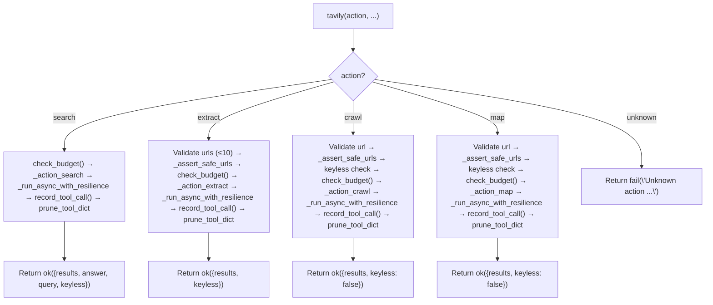

# 🔬 Tavily Tool

The `tavily()` tool provides **AI-optimized web search and content extraction** via the [Tavily API](https://tavily.com). It complements the existing `web` tool with superior ranking, automatic citations, and bulk extraction capabilities.

**Key characteristics:**
- **AI-ranked results** — Tavily\'s relevance engine outperforms raw SearXNG for research queries
- **Automatic citations** — Every result includes URL, title, and confidence score
- **Bulk extraction** — `extract` action can process up to 10 URLs in one call
- **Keyless mode** — Works without API key for `search` and `extract` (rate-limited)
- **Async client, sync facade** — `AsyncTavilyClient` wrapped in `_run_async()` bridge for MCP compatibility
- **Lazy client loading** — `AsyncTavilyClient` imported and instantiated only on first use
- **PARALLEL_SAFE** — Pure network I/O, no shared state
- **Circuit breaker** — Automatic fail-fast after 5 consecutive failures, recovers after 60s
- **Rate-limit retry** — Exponential backoff on retryable errors via `core/net/retry.py` (2s base, unified across tools)
- **Structured error codes** — Every error response includes `error_code` for programmatic fallback decisions
- **API budget tracking** — Per-tool cost counter with configurable limits and auto-block
- **Shared network infrastructure** — `core/net/` modules used by tavily, web_ops, browser
- **v1.3: `extract` + `research` now use `_run_async_with_resilience()`** — Was bypassing all resilience in v1.2 (coroutine reuse bug)
- **v1.3: `include_domains`/`exclude_domains` validated as `list[str]`** — Rejected with `INVALID_PARAMS` if wrong type
- **v1.3: `citation_format` only passed to `research`** — No longer leaked to other actions
- **v1.3: URL normalization** — `extract` and `crawl` use `normalize_url()` from `core/net/url.py`
- **v1.3: Budget tracking wired to all 5 actions** — `check_budget()` before, `record_tool_call()` after
- **v1.3: `CB_OPEN` error code** — Properly returned when circuit breaker is OPEN (was `UNKNOWN` in v1.2)
- **v1.4: `on_failure` only fires for retryable errors** — CB no longer tripped by validation/4xx failures
- **v1.4: HTTP 408 mapped to `RATE_LIMITED`** — Aligns with `classify_http_error()` in `core/net/errors.py`
- **v1.4: `httpx` network errors classified** — `ReadError`/`WriteError`/`RemoteProtocolError`/`NetworkError` → `NETWORK_ERROR`
- **v1.4: Dead params removed** — `max_chars` and `research` action block removed from facade

---

## ⚠️ Breaking Changes

### v1.4

| Old | New | Migration |
|-----|-----|-----------|
| `on_failure()` fired on all errors | Only fires for retryable errors | No migration — internal fix |
| HTTP 408 → `CLIENT_ERROR` | HTTP 408 → `RATE_LIMITED` | No migration — internal fix |
| `httpx.ReadError`/`WriteError`/`RemoteProtocolError` fell to `UNKNOWN` | Now map to `NETWORK_ERROR` | No migration — internal fix |
| `max_chars` in facade signature | Removed (no handler accepted it) | No migration — was dead code |
| `research` action block in facade | Removed (never executed, not in DISPATCH) | No migration — was dead code |
| `www.` strip via `removeprefix("www.")` | Boundary check: `www2.example.com` preserved | No migration — internal fix |

### v1.3

| Old | New | Migration |
|-----|-----|-----------|
| `extract`/`research` bypassed `_run_async_with_resilience()` | Now uses it correctly (factory pattern) | No migration — internal fix |
| `include_domains`/`exclude_domains` accepted any type | Must be `list[str]` | Pass lists, not strings or tuples |
| `citation_format` passed to all actions | Only passed to `research` | No migration — internal fix |
| `core/net/security.py` IPv6 parsing broken | Fixed bracket + unbracketed IPv6 handling | No migration — internal fix |
| `core/net/errors.py` `NetworkError` → `CONNECT_ERROR` | Now correctly returns `NETWORK_ERROR` | No migration — internal fix |
| `can_execute()` OPEN→HALF_OPEN didn\'t count against `half_open_max_calls` | Now counts correctly | No migration — internal fix |
| `get_status()` returned `{}` when no budget config | Now returns tool info with `used` count | No migration — internal fix |

### v1.2

| Old | New | Migration |
|-----|-----|-----------|
| `_run_async_with_resilience(coro)` takes coroutine object | Takes **coroutine factory** callable | Pass `_call` not `_call()` at all action call sites |
| `core/security.py` + `core/web_errors.py` standalone | Moved to `core/net/` package | Update imports: `core.net.security` → `core.net.security`, `core.net.retry` → `core.net.errors` |
| `max_depth` default 2, `limit` default 100 | `max_depth` default 3, `limit` default 50 | No migration — facade now accepts params again; defaults changed |
| `raw_content` always included in search results | Stripped when `include_raw_content=False` | No migration — restored v1.0 behavior |
| Error messages plain strings | All errors include `error_code` field | Consumers can now check `error_code` instead of parsing strings |
| `_close_client()` swallows exceptions silently | Logs exceptions; acquires lock; closes old client on key change | No migration — internal fix |
| API key sanitization exact string match | Regex-based + URL-encoded variants + header patterns | No migration — internal fix |
| `5 * (2 ** attempt)` hardcoded backoff | `get_retry_delay()` from `core/net/retry.py` | No migration — internal fix |

### v1.1

| Old | New | Migration |
|-----|-----|-----------|
| `crawl`/`map` accepted `query` as URL fallback | `url` is **strictly required** for `crawl`/`map` | Pass `url=` explicitly; `query` is now only for contextual `instructions` |
| `search` silently dropped `include_images` | `include_images` is now passed to SDK | No migration — it just works now |
| `max_results` had no upper bound | `max_results` validated to 1–20 range | Values >20 now fail fast with clear error |
| `_close_client()` was a no-op | Actually closes `AsyncTavilyClient` connection pool | No migration — internal fix |
| `_run_async()` timeout was decorative | Timeout now actually fires and returns control | No migration — internal fix |

### v1.0

| Old | New | Migration |
|-----|-----|-----------|
| Monolithic `tools/tavily.py` (~526 lines) | Atomic `tools/tavily_ops/actions/*.py` (5 files) + thin facade | No migration needed — same API |
| Manual `if action == "search": ... elif ...` dispatch in facade | `@register_action` auto-discovery + `@meta_tool` | No migration needed — same API |
| Manual docstring in `tavily()` | `@meta_tool` auto-generated from `help_text` + `examples` | No migration needed — same API |
| `crawl()`/`map()` passed `query=` to SDK | Now translates to `instructions=` (SDK 0.7.26) | No migration needed — facade param name unchanged |
| `crawl()` missing `extract_depth`/`format` | Now exposed (SDK 0.7.26) | New optional params, no breaking change |
| `research()` not validated | Now validates `citation_format` against SDK Literal | Internal-only, no breaking change |
| `trace_id` hardcoded `""` in actions | Now threaded through `ok()`/`fail()`/`prune_tool_dict()` | No migration needed — already a facade param |

---

## 🚀 Quick Start

```python
# AI-ranked search
result = tavily(action="search", query="FastMCP python tutorial", max_results=5)

# Bulk URL extraction
result = tavily(action="extract", urls=["https://docs.python.org/3/library/pathlib.html", "https://..."])

# Deep site crawl (requires API key)
result = tavily(action="crawl", url="https://example.com", max_depth=2, max_breadth=10)

# Site structure map (requires API key)
result = tavily(action="map", url="https://example.com", max_depth=2)

# Keyless mode — works without API key for search/extract
result = tavily(action="search", query="Python async patterns")
# → {"status": "success", "data": {"keyless": true, ...}}

# Domain-scoped search (v1.1)
result = tavily(
    action="search",
    query="Python asyncio",
    include_domains=["github.com", "docs.python.org"],
    exclude_domains=["pinterest.com", "quora.com"]
)

# News-scoped search (v1.1)
result = tavily(action="search", query="AI regulation", topic="news")
```

---

## 🏗️ Architecture

```text
tools/tavily.py              # @tool + @meta_tool facade — thin dispatch only
tools/tavily_ops/
├── __init__.py              # Auto-discovery: imports _registry, glob actions/*.py
├── _registry.py             # DISPATCH dict + @register_action decorator
├── state.py                 # _TAVILY_CLIENT, _CLIENT_LOCK, _KEYLESS_WARNED, reset_state()
├── client.py                # _get_singleton_client(), _close_client(), _TAVILY_CB
│                            # v1.2: closes old client on key change, lock on close
│                            # v1.3: _warn_keyless_once() uses state._KEYLESS_WARNED
│                            # v1.3: registers Tavily RateLimitError as retryable
├── bridge.py                # _run_async() + _run_async_with_resilience() (CB + retry)
│                            # v1.2: accepts coroutine factory, uses core/net/retry.py
│                            # v1.3: uses retry_async_factory() from core/net/retry.py
│                            # v1.3: raises CircuitBreakerOpen exception
├── errors.py                # _handle_tavily_error(), error_code, API key sanitization
│                            # v1.2: regex sanitization, 500-char truncation
│                            # v1.3: handles CircuitBreakerOpen → error_code="CB_OPEN"
│                            # v1.3: wires budget tracking into error responses
│                            # v1.4: ReadError/WriteError/RemoteProtocolError/NetworkError → NETWORK_ERROR
│                            # v1.4: HTTP 408 → RATE_LIMITED (was CLIENT_ERROR)
└── actions/
    ├── search.py            # @register_action("tavily", "search", ...)
    │                        # v1.3: imports SEARCH_MAX_RESULTS from core.net.default
    │                        # v1.3: check_budget() + record_tool_call() wired
    │                        # v1.3: validates include_domains/exclude_domains as list[str]
    ├── extract.py           # @register_action("tavily", "extract", ...)
    │                        # v1.3: NOW uses _run_async_with_resilience (was bypassing)
    │                        # v1.3: normalize_url() on URLs, budget wired
    │                        # v1.3: imports EXTRACT_MAX_URLS/EXTRACT_DEPTH from defaults
    ├── crawl.py             # @register_action("tavily", "crawl", ...)
    │                        # v1.3: normalize_url() on URL, budget wired
    │                        # v1.3: imports CRAWL_* constants from defaults
    ├── map.py               # @register_action("tavily", "map", ...)
    │                        # v1.3: imports CRAWL_* constants from defaults, budget wired
    └── research.py          # PLAIN function, NO @register_action (workflow-only)
                             # v1.3: NOW uses _run_async_with_resilience (was bypassing)
                             # v1.3: budget wired, citation_format only passed here

core/net/                    # v1.2: Shared network infrastructure
│                            # v1.3: __init__.py re-exports all modules for cross-tool use
│                            # v1.4: on_failure only for retryable errors; 0.0.0.0/:: blocked
├── __init__.py              # v1.3 NEW: public re-exports for `from core.net import ...`
├── errors.py                # classify_http_error(), is_retryable_error(), get_retry_delay()
│                            # v1.3: NetworkError → NETWORK_ERROR (not CONNECT_ERROR)
│                            # v1.3: 408 → RATE_LIMITED, Read/WriteError → NETWORK_ERROR
├── security.py              # is_safe_network_address(), _assert_safe_urls() — SSRF guard
│                            # v1.3: Fixed IPv6 bracket parsing, DNS timeout via ThreadPoolExecutor
│                            # v1.4: is_unspecified check blocks 0.0.0.0 and ::
├── retry.py                 # retry_sync() + retry_async_factory() — unified retry with CB hooks
│                            # v1.3: Added retry_async_factory() for async coroutine retry
│                            # v1.4: on_failure only fires for retryable errors
│                            # v1.4: Removed dead raise last_exception
├── budget.py                # APICostTracker — cost tracking per tool
│                            # v1.3: Lock() → RLock(), daily reset, get_status() fix
├── url.py                   # normalize_url(), extract_domain(), is_same_domain()
│                            # v1.3: is_same_domain strips www. prefix
│                            # v1.4: Boundary check — www2.example.com NOT stripped
└── default.py               # Shared defaults: SEARCH_MAX_RESULTS, CRAWL_MAX_DEPTH, etc.
                             # v1.3: Fixed header comment (defaults.py → default.py)
```

### Dispatch Flow



**Key design decisions:**
- **Async-to-sync bridge** — `_run_async()` handles two cases: (1) no running loop → `asyncio.run(coro)`; (2) running loop (e.g., inside MCP) → spawns a `ThreadPoolExecutor(max_workers=1)` and runs `asyncio.run` in a fresh thread. Timeout: `cfg.tavily_timeout + 10` seconds. Deliberately uses per-call ThreadPoolExecutor instead of a persistent background loop — Tavily calls are short network requests, not long Playwright sessions.
- **v1.2: `_run_async_with_resilience()`** — Wraps `_run_async()` with circuit breaker (`_TAVILY_CB`) and automatic retry on all retryable errors (3 attempts, exponential backoff via `core/net/retry.py:get_retry_delay()`). **Accepts a coroutine factory (callable), not a coroutine object** — ensures fresh coroutine per retry attempt. Centralized in `bridge.py` so every action gets resilience without per-action edits.
- **v1.3: `retry_async_factory()`** — Extracted from bridge pattern to `core/net/retry.py` for reuse by web_ops/browser. `bridge.py` now delegates to it.
- **v1.4: `on_failure` only for retryable errors** — `retry_async_factory()` checks `is_retryable(e)` BEFORE calling `on_failure()`. A single workflow node with a parameter bug can no longer DOS the entire Tavily tool for all agents.
- **Lazy client with key caching** — `_get_singleton_client()` caches the `AsyncTavilyClient` instance and re-creates it only if the API key changes. Thread-safe via `_CLIENT_LOCK` (double-checked locking). Keyless mode uses `api_key=None`.
- **v1.2: Client lifecycle** — `_get_singleton_client()` closes the old client before creating a new one when the API key changes. `_close_client()` acquires `_CLIENT_LOCK` and logs exceptions instead of silently swallowing.
- **v1.3: Client close** — `_close_client_locked()` uses `_run_async()` instead of creating a fresh ThreadPoolExecutor.
- **State ownership** — `state.py` owns `_TAVILY_CLIENT`, `_CLIENT_LOCK`, `_KEYLESS_WARNED`. `client.py` does `import tools.tavily_ops.state as state` and reads/writes `state._TAVILY_CLIENT` directly. This prevents the name-binding divergence bug that broke `web_ops`\'s `reset_state()`.
- **v1.3: Keyless warning** — `_warn_keyless_once()` uses `state._KEYLESS_WARNED` directly so `reset_state()` properly clears it.
- **SSRF at action level** — `_assert_safe_urls()` is called inside `_action_extract`, `_action_crawl`, and `_action_map` (not at the facade level). `search` does not need SSRF since it doesn\'t fetch arbitrary URLs. v1.2: `_assert_safe_urls` moved to `core/net/security.py` with scheme validation, empty hostname rejection, and IPv6 port stripping. v1.3: Fixed IPv6 bracket parsing (`[::1]:8080`, `2001:db8::1`). v1.4: Blocks `0.0.0.0` and `::`.
- **Raw content stripping** — `_action_search` strips `raw_content` from all results unless `include_raw_content=True`. Prevents context window explosion.
- **v1.2: Error type detection + sanitization** — `_handle_tavily_error()` uses both `isinstance` checks (with lazy tavily imports) and `type(e).__name__` string fallback. API key is stripped via regex (exact match, URL-encoded, Authorization header, query param) from all error messages before returning to the LLM. Error messages truncated to 500 chars to prevent context window bloat.
- **v1.4: Network error classification** — `httpx.ReadError`, `httpx.WriteError`, `httpx.RemoteProtocolError`, `httpx.NetworkError` now map to `NETWORK_ERROR` instead of falling through to `UNKNOWN`.
- **v1.4: HTTP 408 classification** — Maps to `RATE_LIMITED` (retryable) instead of `CLIENT_ERROR` (non-retryable), aligning with `classify_http_error()` in `core/net/errors.py`.
- **v1.2: Error codes** — `core/contracts.py:fail()` accepts an `error_code` parameter. Tavily returns standardized codes: `CB_OPEN`, `RATE_LIMITED`, `AUTH_FAILED`, `QUOTA_EXHAUSTED`, `TIMEOUT`, `CONNECT_ERROR`, `SERVER_ERROR`, `CLIENT_ERROR`, `NETWORK_ERROR`, `API_ERROR`, `UNKNOWN`.
- **v1.3: Budget tracking** — Every action calls `check_budget("tavily.{action}")` before execution and `record_tool_call("tavily.{action}")` after success. Daily limits auto-reset at midnight.
- **`research` is workflow-only** — `run_research()` in `actions/research.py` exists but is NOT exposed in the `@tool` facade. Not registered in `DISPATCH`. Reserved for `workflows/deep_research_impl/nodes/search.py`.
- **All outputs pruned** — Every action result passes through `prune_tool_dict()` from `core.memory_backend.pruner` before return.
- **trace_id propagation** — `trace_id` is threaded from facade through `ok()` / `fail()` / `prune_tool_dict()` in all action handlers.
- **Non-dict handler guard** — Facade checks `isinstance(result, dict)` after handler call. Returns `fail()` if handler returns non-dict (regression guard from prior refactors).
- **v1.2: Coroutine factory pattern** — `_run_async_with_resilience()` accepts a callable that produces a fresh coroutine (`_call`), not an already-instantiated coroutine (`_call()`). This prevents `RuntimeError: cannot reuse already awaited coroutine` on retry attempts.
- **v1.2: Unified network infrastructure** — All HTTP error classification, retry logic, SSRF guards, and budget tracking live in `core/net/`. Adopted by tavily_ops; web_ops and browser adoption scheduled.
- **v1.3: Cross-tool adoption ready** — `core/net/__init__.py` re-exports all modules. `register_retryable_exception()` allows SDK-specific exception registration.

---

## 📝 Tool Signature

```python
@tool
@meta_tool(DISPATCH.get("tavily", {}), doc_sections=[...])
def tavily(
    action: str,
    query: str = "",
    urls: Optional[list[str]] = None,
    url: str = "",
    max_results: int = 5,
    search_depth: str = "basic",
    topic: str = "general",
    time_range: str = "",
    include_domains: Optional[list[str]] = None,
    exclude_domains: Optional[list[str]] = None,
    include_answer: bool = True,
    include_raw_content: bool = False,
    include_images: bool = False,
    extract_depth: str = "basic",
    format: str = "markdown",
    max_depth: int = 3,          # v1.2: restored, default 3
    max_breadth: int = 10,       # v1.2: restored
    limit: int = 50,             # v1.2: restored, default 50
    trace_id: str = "",
) -> dict:
    """Tavily AI research tool — atomic actions for search/extract/crawl/map."""
```

| Parameter | Type | Required | Description |
|-----------|------|----------|-------------|
| `action` | `str` | **Yes** | One of `search`, `extract`, `crawl`, `map` (auto-generated Literal by @meta_tool) |
| `query` | `str` | No | Search query. **Required** for `search`. Also accepted by `crawl`/`map` as contextual `instructions`. |
| `urls` | `list[str]` | No | URLs for `extract`. **Required** for `extract`. Max 10 items. |
| `url` | `str` | No | Starting URL for `crawl`/`map`. **Required** for `crawl`/`map`. |
| `max_results` | `int` | No | Results per search. Default: 5. Range: 1–20. **Capped at 3 in keyless mode.** |
| `search_depth` | `str` | No | `"basic"` or `"advanced"`. Default: `"basic"`. |
| `topic` | `str` | No | Topic filter for search: `"general"`, `"news"`, `"finance"`. Default: `"general"`. **v1.1** |
| `time_range` | `str` | No | Time range filter for search. |
| `include_domains` | `list[str]` | No | Whitelist domains for search. **v1.1**. **v1.3: validated as `list[str]`.** |
| `exclude_domains` | `list[str]` | No | Blacklist domains for search. **v1.1**. **v1.3: validated as `list[str]`.** |
| `include_answer` | `bool` | No | Include AI-generated answer in search. Default: `True`. |
| `include_raw_content` | `bool` | No | Include full page text in search results. Default: `False`. **Large!** |
| `include_images` | `bool` | No | Include images in search results. Default: `False`. **v1.1: Now passed to SDK.** |
| `extract_depth` | `str` | No | `"basic"` or `"advanced"`. Default: `"basic"`. Now also supported by `crawl`. |
| `format` | `str` | No | Output format for extract/crawl. `"markdown"` or `"text"`. Default: `"markdown"`. |
| `max_depth` | `int` | No | Max link depth for crawl/map. Default: **3**. **v1.2: restored.** |
| `max_breadth` | `int` | No | Max pages per level for crawl/map. Default: **10**. **v1.2: restored.** |
| `limit` | `int` | No | Max total pages for crawl/map. Default: **50**. **v1.2: restored.** |
| `trace_id` | `str` | No | Trace identifier for logging and result correlation. Threaded through all handlers. |

> **Note:** `input`, `model`, `citation_format`, `max_chars` params were removed from the facade. `citation_format` only existed for `research`, which is not exposed as a tool action. Call `run_research()` directly from workflows.

---

## ⚡ Actions

### `search` — AI-ranked web search

Queries Tavily and returns AI-ranked results with titles, URLs, snippets, and an optional AI-generated answer.

**Keyless behavior:**
- `max_results` is silently capped to `3`
- Response includes `"keyless": true`
- Lower rate limits apply (~100 requests/day)
- Single `logger.warning` on first keyless use

**v1.1 additions:**
- `include_images` is now passed to the SDK (was silently dropped before)
- `include_domains`/`exclude_domains` for domain-scoped research
- `topic` parameter for news/current-events filtering
- `max_results` validated to 1–20 range (fail fast on invalid values)

**v1.2 additions:**
- `raw_content` stripped from results when `include_raw_content=False` (restored v1.0 behavior)
- Facade accepts `max_depth`, `max_breadth`, `limit` again (was removed in v1.1)

**v1.3 additions:**
- `include_domains`/`exclude_domains` validated as `list[str]` — rejected with `INVALID_PARAMS` if not
- `check_budget("tavily.search")` guard before execution
- `record_tool_call("tavily.search")` after success
- `SEARCH_MAX_RESULTS` imported from `core.net.default`

**Return:**
```json
{
  "status": "success",
  "data": {
    "results": [
      {"title": "...", "url": "https://...", "content": "...", "score": 0.95}
    ],
    "answer": "AI-generated summary...",
    "query": "FastMCP python tutorial",
    "keyless": false
  }
}
```

**Raw content handling:**
- Stripped from all results by default (prevents context window explosion)
- Included only if `include_raw_content=True`

**Error cases:**
- Missing `query` → `fail("action=\'search\' requires query=")`
- `max_results` < 1 or > 20 → `fail("max_results must be >= 1")` / `fail("max_results must be <= 20")`
- Keyless rate limit → `fail("Tavily keyless rate limit reached...")` with `error_code="AUTH_FAILED"`
- Invalid API key → `fail("Tavily API key is invalid...")` with `error_code="AUTH_FAILED"`
- Timeout → `fail("Tavily request timed out...")` with `error_code="TIMEOUT"`
- Connection error → `fail("Tavily connection failed...")` with `error_code="CONNECT_ERROR"`
- **v1.3: Network error → `fail("Tavily network error...")` with `error_code="NETWORK_ERROR"`**
- **v1.4: Read/Write/Protocol error → `fail("Tavily read/write/protocol error...")` with `error_code="NETWORK_ERROR"`**
- Circuit breaker OPEN → `fail("Tavily circuit breaker is OPEN...")` with `error_code="CB_OPEN"`
- **v1.3: Budget exhausted → `fail("Tavily budget exhausted...")` with `error_code="QUOTA_EXHAUSTED"`**

### `extract` — Bulk URL content extraction

Accepts up to 10 URLs and returns extracted content with citations for each.

**v1.3 additions:**
- Now uses `_run_async_with_resilience()` (was bypassing all resilience in v1.2)
- URLs normalized via `normalize_url()` before extraction
- `EXTRACT_MAX_URLS`/`EXTRACT_DEPTH` imported from `core.net.default`
- Budget tracking wired

**Return:**
```json
{
  "status": "success",
  "data": {
    "results": [
      {"url": "https://...", "text": "Extracted markdown...", "images": []}
    ],
    "keyless": false
  }
}
```

**Validation:**
- Missing `urls` → `fail("urls is required for extract action")`
- More than 10 URLs → `fail("urls cannot exceed 10 items")`
- Unsafe URLs → `fail("Blocked: {url} resolves to a private/internal address")`

### `crawl` — Deep site traversal

Follows links from a starting URL up to `max_depth` levels. **Requires API key.**

**SDK note:** Tavily SDK 0.7.26 uses `instructions=` internally. The facade keeps `query` as the parameter name for backward compatibility but translates it automatically: `client.crawl(url=..., instructions=query, ...)`.

**v1.1 breaking change:** `url` is now **strictly required**. The old `url or query` fallback (where `query` would be used as the target URL) has been removed because it produced misleading SSRF errors when users passed search strings instead of URLs.

**v1.2:** Facade accepts `max_depth`, `max_breadth`, `limit` again.

**v1.3 additions:**
- URL normalized via `normalize_url()` before crawl
- `CRAWL_*` constants imported from `core.net.default`
- Budget tracking wired

**Return:**
```json
{
  "status": "success",
  "data": {
    "results": [{"url": "...", "title": "...", "content": "..."}],
    "keyless": false
  }
}
```

**Validation:**
- Missing `url` → `fail("action=\'crawl\' requires url=")`
- Keyless mode → `fail("action=\'crawl\' requires a Tavily API key...")`
- Unsafe URL → `fail("Blocked: {url} resolves to a private/internal address")`

### `map` — Site structure discovery

Discovers site hierarchy without fetching full content. **Requires API key.**

**SDK note:** Same `instructions=` translation as `crawl`.

**v1.1 breaking change:** Same as `crawl` — `url` is strictly required, `query` is only for contextual instructions.

**v1.2:** Facade accepts `max_depth`, `max_breadth`, `limit` again.

**v1.3 additions:**
- `CRAWL_*` constants imported from `core.net.default`
- Budget tracking wired

**Return:**
```json
{
  "status": "success",
  "data": {
    "results": [{"url": "...", "title": "..."}],
    "keyless": false
  }
}
```

**Validation:** Same as `crawl`.

### `research` — End-to-end deep research (workflow-only)

**NOT exposed as a tool action.** Call directly from workflows:

```python
from tools.tavily_ops.actions.research import run_research

result = run_research(
    input="Research topic",
    model=None,
    citation_format="apa",  # "numbered" | "mla" | "apa" | "chicago"
    trace_id="...",
)
```

Requires API key. Validates `citation_format` against SDK Literal type (`"numbered" | "mla" | "apa" | "chicago"`).

**v1.3 additions:**
- Now uses `_run_async_with_resilience()` (was bypassing all resilience in v1.2)
- Budget tracking wired
- `citation_format` is **only** passed to `research` action (not leaked to others)

---

## 🔒 Security

### SSRF Guard (`_assert_safe_urls`)

All URL parameters (`url`, `urls`) pass through `_assert_safe_urls()` inside the action handlers:

```python
def _assert_safe_urls(urls: list[str]) -> tuple[bool, str]:
    for url in urls:
        parsed = urlparse(url)
        if parsed.scheme not in ("http", "https"):
            return False, f"Blocked: {url} — only http/https schemes allowed"
        if not parsed.hostname:
            return False, f"Blocked: {url} — no valid hostname"
        if not is_safe_network_address(parsed.hostname):
            return False, f"Blocked: {url} — resolves to private/internal address"
    return True, ""
```

Uses `core.net.security.is_safe_network_address` — same guard as `web.py`. v1.2: `_assert_safe_urls` moved to `core/net/security.py` with scheme validation, empty hostname rejection, and IPv6 port stripping. v1.3: Fixed IPv6 bracket parsing (`[::1]:8080`, `2001:db8::1`). v1.4: Blocks `0.0.0.0` and `::` via `is_unspecified` check.

**Note:** `search` does not call `_assert_safe_urls()` because it does not fetch arbitrary URLs — it queries the Tavily API with a search string.

### API Key Sanitization (v1.2)

All error messages from `_handle_tavily_error()` strip the Tavily API key before returning to the LLM:

```python
api_key = getattr(cfg, "tavily_api_key", None)
if api_key and len(api_key) > 4:
    escaped_key = re.escape(api_key)
    raw_msg = re.sub(escaped_key, "***", raw_msg)
    raw_msg = re.sub(re.escape(api_key.replace("-", "%2D")), "***", raw_msg)
    raw_msg = re.sub(r"Authorization:\s*Bearer\s+[^\s]+", "Authorization: Bearer ***", raw_msg)
    raw_msg = re.sub(r"[?&]api_key=[^&\s]+", "api_key=***", raw_msg)
raw_msg = raw_msg[:500]  # Truncate to prevent token waste
```

This prevents accidental key leakage into logs, traces, or LLM context windows. v1.2 adds regex, URL-encoded, header, and query param patterns plus 500-char truncation.

---

## ⚠️ Error Handling

`_handle_tavily_error()` maps exceptions to standardized `fail()` responses:

| Condition | Detection | error_code | User Message |
|-----------|-----------|------------|--------------|
| Keyless rate limit | `TavilyKeylessLimitError` | `AUTH_FAILED` | `"Tavily keyless rate limit reached. Set TAVILY_API_KEY..."` |
| Invalid API key | `InvalidAPIKeyError` | `AUTH_FAILED` | `"Tavily API key is invalid. Check TAVILY_API_KEY..."` |
| Monthly quota | `UsageLimitExceededError` | `QUOTA_EXHAUSTED` | `"Tavily monthly quota exhausted. Upgrade..."` |
| Tavily API error (429) | `APIError` with status 429 | `RATE_LIMITED` | `"Tavily rate limit (HTTP 429): ..."` |
| Tavily API error (5xx) | `APIError` with status >= 500 | `SERVER_ERROR` | `"Tavily server error (HTTP {status}): ..."` |
| Tavily API error (other) | `APIError` | `API_ERROR` | `"Tavily API error: ..."` |
| HTTP timeout | `httpx.TimeoutException` | `TIMEOUT` | `"Tavily request timed out: ..."` |
| HTTP connection error | `httpx.ConnectError` | `CONNECT_ERROR` | `"Tavily connection failed: ..."` |
| **v1.4: HTTP read error** | **`httpx.ReadError`** | **`NETWORK_ERROR`** | **`"Tavily read error: ..."`** |
| **v1.4: HTTP write error** | **`httpx.WriteError`** | **`NETWORK_ERROR`** | **`"Tavily write error: ..."`** |
| **v1.4: HTTP protocol error** | **`httpx.RemoteProtocolError`** | **`NETWORK_ERROR`** | **`"Tavily protocol error: ..."`** |
| **v1.4: HTTP network error** | **`httpx.NetworkError`** | **`NETWORK_ERROR`** | **`"Tavily network error: ..."`** |
| HTTP 401/403 | `httpx.HTTPStatusError` | `AUTH_FAILED` | `"Tavily authentication failed..."` |
| HTTP 408 | `httpx.HTTPStatusError` status 408 | `RATE_LIMITED` | `"Tavily rate limit (HTTP 408): ..."` |
| HTTP other 4xx | `httpx.HTTPStatusError` | `CLIENT_ERROR` | `"Tavily HTTP error (HTTP {status}): ..."` |
| Circuit breaker OPEN | `_TAVILY_CB.can_execute()` | `CB_OPEN` | `"Tavily circuit breaker is OPEN..."` |
| Generic | Any other exception | `UNKNOWN` | `"Tavily error: ..."` |

**Detection strategy:** Uses `isinstance` checks with lazy tavily imports, falling back to `type(e).__name__` string matching. This handles both installed and mocked tavily packages.

**v1.2: Circuit breaker integration:**
- After **5** consecutive failures, the circuit breaker opens and all Tavily calls fail fast with: `"Tavily circuit breaker is OPEN. Service temporarily unavailable. Try again later or use web(search) as fallback."` (error_code: `CB_OPEN`)
- After 60 seconds, the circuit enters HALF_OPEN and allows 1 test call.
- Success → CLOSED; failure → OPEN again.
- **v1.3 FIX: OPEN→HALF_OPEN transition now counts against `half_open_max_calls` (was allowing 1 extra call).**

**v1.2: Retry policy:**
- All retryable errors (HTTP 429, 408, 5xx, timeouts, connection errors, network errors, and registered SDK exceptions) trigger up to 3 retry attempts with exponential backoff via `core/net/retry.py:get_retry_delay()` (2s base, 30s max, 0-25% jitter).
- Non-retryable errors (4xx client errors, auth failures) do NOT trip the circuit breaker.
- **v1.4 CRITICAL:** `retry_async_factory()` only calls `on_failure()` for retryable errors. A validation bug or 400 Bad Request from Tavily raises immediately without touching the CB.

**v1.3: Budget tracking integration:**
- Each action calls `check_budget("tavily.{action}")` before execution.
- On budget exhaustion: returns `QUOTA_EXHAUSTED` error immediately.
- Each action calls `record_tool_call("tavily.{action}")` after success.
- Daily limit auto-resets at midnight (date change detection in `record_call()`).

---

## ⚙️ Configuration

```ini
# .env
TAVILY_API_KEY=tvly-...    # Optional — enables full functionality (crawl, map, research)
TAVILY_TIMEOUT=60          # Request timeout in seconds (1-300, default 60)
```

```python
# core/config.py
self.tavily_api_key = os.getenv("TAVILY_API_KEY", "")
self.tavily_timeout = int(os.getenv("TAVILY_TIMEOUT", "60"))
```

**Requirements:**
```
tavily-python>=0.7.0,<0.8.0  # Locked to SDK version this refactor is built against
```

**Keyless mode:** When `TAVILY_API_KEY` is empty, `AsyncTavilyClient(api_key=None)` supports `search` and `extract` with lower limits. `crawl`, `map`, and `research` fail with a clear message.

---

## 📤 Output & Pruning

All responses pass through `prune_tool_dict()` from `core.memory_backend.pruner`:
- Large `raw_content` / `text` fields are truncated with artifact recovery
- Full content saved to `workspace/.artifacts/`
- Structured citations always preserved
- `trace_id` is threaded through `ok()` / `fail()` / `prune_tool_dict()` for observability

---

## 🧪 Testing

```powershell
# Run all tavily tests (fully mocked, no API calls)
D:\\mcp\\agent\\venv\\Scripts\\pytest.exe tests/tools/tavily/ -W error --tb=short -v

# Run all core/net tests
D:\\mcp\\agent\\venv\\Scripts\\pytest.exe tests/core/net/ -W error --tb=short -v
```

**Test coverage:**

| File | Tests | Coverage |
|------|-------|----------|
| `conftest.py` | — | Shared fixtures: reset_state, mock_tavily_client, budget reset, resource warning filter |
| `test_search.py` | 8 | Search action, result parsing, keyless capping, trace_id propagation, raw_content stripping, facade params |
| `test_extract.py` | 5 | Extract action, URL validation, batch processing, SSRF, keyless mode |
| `test_crawl.py` | 9 | Crawl action, keyless rejection, URL requirement, extract_depth/format, SDK translation, facade params, coroutine factory |
| `test_map.py` | 7 | Map action, keyless rejection, URL requirement, SDK translation, facade params |
| `test_tavily_error_handling.py` | 14 | All error types + non-dict handler guard, sanitization, truncation, error_code, CB_OPEN |
| `test_tavily_keyless_mode.py` | 5 | Keyless search/extract, keyless crawl/map rejection, warning once |
| `test_tavily_ssrf.py` | 4 | `_assert_safe_urls` blocking across extract/crawl/map, search exempt |
| `test_tavily_client.py` | 3 | Lazy client creation, key change detection, thread safety |
| `test_tavily_state.py` | 2 | State ownership regression guard (web bug), keyless warning reset |
| `test_facade.py` | 5 | `@meta_tool` metadata, action Literal, unknown action, trace_id |
| `test_registry.py` | 6 | Duplicate guard, research not in DISPATCH, all actions registered |
| `test_bridge_timeout.py` | 2 | Timeout actually fires |
| `test_circuit_breaker.py` | 7 | **v1.2:** State transitions, half_open_max_calls, reset, record_success noop |
| `test_bridge_resilience.py` | 6 | **v1.2/v1.3:** Coroutine factory, retry, CB integration, unified backoff |
| `test_client.py` | 5 | **v1.2/v1.3:** Singleton, key change, close logging, old client cleanup, lock verification |

**Core/net tests (`tests/core/net/`):**

| File | Tests | Coverage |
|------|-------|----------|
| `test_security.py` | 12 | SSRF guard, IPv6 (loopback + public), empty hostname, scheme validation |
| `test_web_errors.py` | 12 | Classification, BOT_BLOCKED, 408, SDK duck-typing, retry delay, NetworkError |
| `test_retry.py` | 6 | Success, retry, exhaust, non-retryable, custom predicate, backoff, jitter |
| `test_budget.py` | 6 | Record, afford, warning, status, thread safety, daily reset |
| `test_url.py` | 7 | Normalize, domain extract, same domain (www stripping) |
| `test_path_validation.py` | 5 | Path-specific SSRF validation |
| `test_ssrf_edge_cases.py` | — | Edge cases (moved from `tests/core/`) |
| `test_ssrf_protection.py` | 7 | SSRF protection tests |

**Mock strategy:**
- Patch `tools.tavily_ops.client._get_singleton_client` to return `MagicMock` with **v1.3: `AsyncMock`** for async methods (search/extract/crawl/map/research return coroutines)
- Patch `tools.tavily_ops.client.cfg.tavily_api_key` to `"tvly-test"` for keyed mode tests
- Patch `tools.tavily_ops.client.cfg.tavily_api_key` to `""` for keyless mode tests
- **v1.3: Patch `tools.tavily_ops.client._is_keyless_mode` / `_is_keyless` for keyless behavior tests**
- Patch `core.net.security.is_safe_network_address` for SSRF tests (or mock `_assert_safe_urls` directly)
- Test `_handle_tavily_error()` with both real and mocked exception types
- Reset state via `tools.tavily_ops.state.reset_state()` (not direct module var poking)
- Reset circuit breaker via `tools.tavily_ops.client._TAVILY_CB.reset()` between tests
- **v1.3: Reset budget tracker via `core.net.budget._budget_tracker._calls.clear()` between tests**

**Current test layout:**
```text
tests/tools/tavily/
├── conftest.py
├── test_search.py
├── test_extract.py
├── test_crawl.py
├── test_map.py
├── test_tavily_error_handling.py
├── test_tavily_keyless_mode.py
├── test_tavily_ssrf.py
├── test_tavily_client.py
├── test_tavily_state.py
├── test_facade.py
├── test_registry.py
├── test_bridge_timeout.py
├── test_circuit_breaker.py
├── test_bridge_resilience.py    # v1.2/v1.3
└── test_client.py               # v1.2/v1.3

tests/core/net/                  # v1.2/v1.3
├── conftest.py                  # v1.3: budget tracker reset fixture
├── test_security.py
├── test_web_errors.py
├── test_retry.py                # v1.3: retry_async_factory tests
├── test_budget.py               # v1.3: daily reset, RLock tests
├── test_url.py
├── test_path_validation.py
├── test_ssrf_edge_cases.py
└── test_ssrf_protection.py
```

---

## 🔄 When to Use vs Alternatives

| Need | Tool | Why |
|------|------|-----|
| Quick search (free) | `web(search)` | SearXNG, no API costs |
| AI-ranked search | `tavily(search)` | Better relevance, citations, AI answer |
| Domain-scoped search | `tavily(search, include_domains=...)` | **v1.1** — Research precision |
| News/current events | `tavily(search, topic="news")` | **v1.1** — Time-relevant results |
| Single static page (free) | `web(read)` | Fast, lightweight, no API costs |
| Bulk URL extraction | `tavily(extract)` | Optimized batch, AI-powered, up to 10 URLs |
| Site crawling | `tavily(crawl)` | Follows links, discovers pages (API key required) |
| Site structure | `tavily(map)` | Discovers hierarchy without fetching content (API key required) |
| Deep research | `workflows/deep_research.py` | Uses `run_research()` internally (not exposed as tool action) |
| JS-rendered page | `browser(navigate+text_content)` | Renders JavaScript |
| Interactive forms | `browser(click, fill)` | Supports interaction |

---

## 🗺️ Roadmap

### ✅ Completed

| Feature | Status | Notes |
|---------|--------|-------|
| 4 exposed actions (`search`, `extract`, `crawl`, `map`) | ✅ v1.0 | `research` is workflow-only |
| Async-to-sync bridge | ✅ v1.0 | `_run_async()` handles nested loops + ThreadPoolExecutor fallback |
| Lazy client with key caching | ✅ v1.0 | `_get_singleton_client()` re-creates only on API key change, thread-safe lock |
| Keyless mode | ✅ v1.0 | `search`/`extract` work without API key; `crawl`/`map`/`research` reject |
| SSRF guard | ✅ v1.0 | `_assert_safe_urls()` on `extract`/`crawl`/`map` |
| Raw content stripping | ✅ v1.0 | `_action_search` strips `raw_content` unless `include_raw_content=True` |
| Comprehensive error handling | ✅ v1.0 | `_handle_tavily_error()` covers 8+ exception types with lazy imports |
| `prune_tool_dict` integration | ✅ v1.0 | All action outputs piped through pruner |
| `PARALLEL_SAFE` | ✅ v1.0 | Pure network I/O, no shared state |
| `max_results` keyless cap | ✅ v1.0 | Silently clamps to 3 in keyless mode |
| URL count validation | ✅ v1.0 | `extract` rejects > 10 URLs |
| `crawl`/`map` url/query fallback | ✅ v1.0 | Accepts either `url` or `query` param |
| `@meta_tool` facade | ✅ v1.0 | Auto-generated Literal + docstring from DISPATCH metadata |
| Un-multiplex to `tavily_ops/` | ✅ v1.0 | Atomic action files with auto-discovery |
| `trace_id` propagation | ✅ v1.0 | Threaded through all handlers |
| SDK 0.7.26 compatibility | ✅ v1.0 | `instructions` translation, `extract_depth`/`format` for crawl |
| State ownership bug guard | ✅ v1.0 | `test_tavily_state.py` regression test |
| Non-dict handler guard | ✅ v1.0 | Facade checks `isinstance(result, dict)` |
| **Bridge timeout actually works** | ✅ **v1.1** | `shutdown(wait=False)` prevents blocking; timeout fires correctly |
| **Circuit breaker + rate-limit retry** | ✅ **v1.1** | `_run_async_with_resilience()` in `bridge.py` |
| **`include_images` passed to SDK** | ✅ **v1.1** | Was silently dropped in `search` |
| **`max_results` validated (1–20)** | ✅ **v1.1** | Fail fast instead of confusing SDK error |
| **`include_domains`/`exclude_domains`** | ✅ **v1.1** | Domain-scoped research |
| **`topic` parameter surfaced** | ✅ **v1.1** | News/current-events filtering |
| **API key sanitization** | ✅ **v1.1** | Key stripped from all error messages |
| **`_assert_safe_urls` in `core/net/security.py`** | ✅ **v1.1** | Cross-tool shared SSRF guard |
| **`core/net/retry.py` shared module** | ✅ **v1.1** | `classify_http_error()`, `is_retryable_error()` for web + tavily |
| **`_close_client()` actually closes** | ✅ **v1.1** | Properly awaits `client.close()` via bridge |
| **`crawl`/`map` URL strictly required** | ✅ **v1.1** | Removed misleading `url or query` fallback |
| **Coroutine factory pattern** | ✅ **v1.2** | Prevents coroutine reuse crash on retry; `_call` not `_call()` |
| **Shared `core/net/` infrastructure** | ✅ **v1.2** | errors, security, retry, budget, url, default modules |
| **Structured error codes** | ✅ **v1.2** | `error_code` in all `fail()` responses via `core/contracts.py` |
| **API budget tracking** | ✅ **v1.2** | `APICostTracker` with daily limits, warnings, thread safety |
| **Unified retry/backoff** | ✅ **v1.2** | `get_retry_delay()` + `retry_sync()` in `core/net/retry.py` |
| **IPv6 SSRF fixes** | ✅ **v1.2** | Port stripping, empty hostname rejection, scheme validation |
| **Client lifecycle fixes** | ✅ **v1.2** | Lock on close, old client cleanup on key change, `api_key or None` |
| **Error message truncation** | ✅ **v1.2** | 500 char cap to prevent context window bloat |
| **API key sanitization v2** | ✅ **v1.2** | Regex, URL-encoded, header, and query param patterns |
| **BOT_BLOCKED classification** | ✅ **v1.2** | Cloudflare/cf-ray detection in `core/net/errors.py` |
| **Default constants** | ✅ **v1.2** | `core/net/default.py` — shared across tavily, web_ops, browser |
| **`extract`/`research` use `_run_async_with_resilience()`** | ✅ **v1.3** | Was bypassing all resilience (coroutine reuse bug) |
| **`CB_OPEN` error code** | ✅ **v1.3** | Properly returned when circuit breaker is OPEN |
| **Budget tracking wired to all 5 actions** | ✅ **v1.3** | `check_budget()` + `record_tool_call()` on every action |
| **`include_domains`/`exclude_domains` validation** | ✅ **v1.3** | Must be `list[str]` — rejected with `INVALID_PARAMS` |
| **`citation_format` only for `research`** | ✅ **v1.3** | No longer leaked to other actions |
| **`normalize_url()` in `extract`/`crawl`** | ✅ **v1.3** | URLs normalized before extraction/crawl |
| **`core/net/__init__.py` re-exports** | ✅ **v1.3** | `from core.net import ...` for cross-tool adoption |
| **`retry_async_factory()` in `core/net/retry.py`** | ✅ **v1.3** | Async coroutine retry with CB hooks for web_ops/browser reuse |
| **`RLock` in budget tracker** | ✅ **v1.3** | Prevents deadlock in nested `get_status()` calls |
| **Daily reset in budget tracker** | ✅ **v1.3** | Date change detection in `record_call()` |
| **`_is_private_or_localhost()` restored** | ✅ **v1.3** | Cross-tool IP check for web_ops/browser adoption |
| **DNS timeout via ThreadPoolExecutor** | ✅ **v1.3** | `socket.getaddrinfo` has no `timeout` kwarg |
| **`can_execute()` HALF_OPEN fix** | ✅ **v1.3** | OPEN→HALF_OPEN transition counts against `half_open_max_calls` |
| **`NetworkError` → `NETWORK_ERROR`** | ✅ **v1.3** | Fixed classification in `core/net/errors.py` |
| **408 → `RATE_LIMITED`** | ✅ **v1.3** | HTTP 408 is in `RETRYABLE_STATUS_CODES` |
| **`is_same_domain` strips `www.`** | ✅ **v1.3** | `www.example.com` and `example.com` match |
| **`state._KEYLESS_WARNED` sync** | ✅ **v1.3** | `client.py` uses `state._KEYLESS_WARNED` for proper reset |
| **`RateLimitError` registered as retryable** | ✅ **v1.3** | Tavily SDK exception auto-registered |
| **`on_failure` only for retryable errors** | ✅ **v1.4** | CB no longer tripped by validation/4xx failures |
| **HTTP 408 → `RATE_LIMITED`** | ✅ **v1.4** | Aligns with `classify_http_error()` in `core/net/errors.py` |
| **`httpx` network error handlers** | ✅ **v1.4** | ReadError/WriteError/RemoteProtocolError/NetworkError → `NETWORK_ERROR` |
| **`max_chars` removed** | ✅ **v1.4** | Dead param, no handler accepted it |
| **`research` block removed** | ✅ **v1.4** | Dead code, not in DISPATCH |
| **`www.` strip boundary fix** | ✅ **v1.4** | `www2.example.com` no longer stripped |
| **`0.0.0.0`/`::` blocked** | ✅ **v1.4** | `is_unspecified` check in `core/net/security.py` |

### 🔄 In Progress / Next Up

| Feature | Notes | Priority |
|---------|-------|----------|
| Wire `run_research()` into `workflows/deep_research_impl/nodes/search.py` | Trigger: "when iteration > 3 and completeness < 50" as accelerator | P1 |
| Adopt `core/net/` in `web_ops` | Use `core/net/errors.py`, `core/net/security.py`, `core/net/retry.py` in `web_ops/actions/scrape.py` and `search.py` | P1 |
| Adopt `core/net/` in `browser` tool | Use `classify_http_error()` for Playwright errors; `get_retry_delay()` for nav retries | P1 |
| `tavily(search)` → `web(search)` fallback chain | Automatic fallback when CB open / no key / rate limited, using `error_code` | P2 |
| `tavily(search)` as primary search in research workflow | Replace `web(search)` with `tavily(search)` in `workflows/research.py` when API key present | P2 |
| Add `@cached` decorator | LRU cache for search/extract results (TTL 300s/1800s) | P2 |
| URL normalization module | `core/net/url.py` — strip slashes, sort params, lowercase domain | P2 |
| Remove backward-compat wrappers | Delete `core/net/security.py` and `core/net/retry.py` re-exports once web_ops/browser migrate | P3 |
| Search result deduplication | Similar to `web(search_and_read)`, deduplicate identical URLs across Tavily result pages | P3 |
| Response caching | Cache Tavily responses (TTL-based) to avoid redundant API calls | P3 |
| Client-side batching for `extract` | Split >10 URLs into batches of 10, execute concurrently, merge results | P2 |
| Persistent event loop in `bridge.py` | Background thread with dedicated loop to save ~1ms per call | P3 |
| Surface `include_images`/`include_image_descriptions` in `search` | SDK supports it; facade needs param | P2 |
| Surface `search_depth`/`topic`/`time_range` validation | Client-side enum validation instead of SDK error | P2 |
| Tavily as `web` tool fallback | When SearXNG fails, fall back to `tavily(search)` | P3 |
| Composite `deep_research` action | Search + extract + LLM synthesis in one call | P3 |

### 🚫 Deferred / Out of Scope

| # | Feature | Why Deferred | Priority |
|---|---------|------------|----------|
| 1 | **Expose `research` as tool action** | `run_research()` is intentionally workflow-only. Exposing it as a tool action would bypass the research workflow\'s planning, routing, and memory integration. | Skip |
| 2 | **Streaming responses** | MCP stdio transport doesn\'t support streaming. Would require gateway-only mode. | Skip |
| 3 | **Synchronous client** | `AsyncTavilyClient` is the only official client. A sync wrapper would be redundant given `_run_async()`. | Skip |
| 4 | **Custom HTTP adapter** | `httpx` handles retries and connection pooling well. No need for a custom adapter. | Skip |
| 5 | **Result pagination** | Tavily API returns all results in one call. No pagination API exists. | Skip |
| 6 | **Configurable keyless `max_results`** | Hardcoded cap of 3 is Tavily API-imposed, not arbitrary. Making it configurable invites users to hit rate limits. | Skip |

---

## 🛡️ AI Agent Instructions

### NEVER DO
1. **Never expose `run_research()` as a tool action** — it is workflow-only by design.
2. **Never bypass `_assert_safe_urls()`** — SSRF protection must run before every URL-touching action.
3. **Never remove the keyless check from `crawl`/`map`** — these require an API key. Keyless mode is search/extract only.
4. **Never hardcode timeout values** — Always use `cfg.tavily_timeout`. The `.env` is the single source of truth.
5. **Never skip `_handle_tavily_error()`** — Always route exceptions through the centralized handler for consistent error messages.
6. **Never create `.bak` files** — forbidden by project rules.
7. **Never rewrite the entire file** — surgical edits only. Preserve existing code exactly.
8. **Never add `**kwargs` to the `@tool` facade** — FastMCP schema breaks.
9. **Never print to stdout** — MCP stdio corruption. Return dicts only.
10. **Never skip `compileall` before `pytest`** — catches syntax errors early.
11. **Never use `from tools.tavily_ops.state import _TAVILY_CLIENT`** — use `import tools.tavily_ops.state as state` and `state._TAVILY_CLIENT` directly. Prevents name-binding divergence bug.
12. **Never call `asyncio.run()` directly from action handlers** — Always use `_run_async()` or `_run_async_with_resilience()` from `bridge.py`.
13. **Never leak the API key in error messages** — `_handle_tavily_error()` sanitizes automatically; don\'t bypass it.
14. **Never pass `_call()` to `_run_async_with_resilience()`** — Always pass `_call` (the factory). Passing `_call()` creates a single coroutine that cannot be reused on retry.
15. **Never hardcode backoff math** — Use `core/net/retry.py:get_retry_delay()` for all retry timing.
16. **Never skip `error_code` in `fail()` calls** — Every error response must include a structured `error_code` for programmatic consumers.
17. **Never forget to call `record_tool_call()` after paid API success** — Budget tracking requires it.
18. **Never forget to call `check_budget()` before paid API execution** — Prevents quota overruns.
19. **Never call `on_failure()` before `is_retryable()`** — Non-retryable errors must NOT trip the circuit breaker. `retry_async_factory` handles this correctly; don\'t bypass it.
20. **Never forget `ip.is_unspecified` in IP checks** — `0.0.0.0` and `::` are NOT caught by `is_private`/`is_loopback`/`is_reserved`/`is_multicast`.
21. **Never use `removeprefix("www.")` without boundary check** — `www2.example.com` becomes `2.example.com`. Use `startswith("www.") and count(".") >= 2`.
22. **Never use non-raw strings for `</` → `<\/` replacement** — `.replace("</", r"<\/")` avoids invalid escape sequence SyntaxError under `-W error`.

### ALWAYS DO
23. **Always pass `trace_id` to `ok()` and `fail()`** — Threaded from facade through all action handlers.
24. **Always use `_run_async_with_resilience()` for Tavily client calls** — Handles circuit breaker, rate-limit retry, and nested event loops.
25. **Always strip `raw_content` by default** — `_action_search` must pop `raw_content` from results unless `include_raw_content=True`.
26. **Always test keyless and keyed modes** — Patch `cfg.tavily_api_key` to `""` and `"tvly-test"` respectively.
27. **Always test error paths with both real and mocked exceptions** — `_handle_tavily_error()` uses both `isinstance` and name matching.
28. **Always update this doc** when adding actions, changing return shapes, or modifying the client lifecycle.
29. **Always add the non-dict handler return fallback** in the facade — `if not isinstance(result, dict): return fail(...)`.
30. **Always reset the circuit breaker between tests** — `tools.tavily_ops.client._TAVILY_CB.reset()` must be in a known state.
31. **Always use `core/net/` imports** — `core.net.security`, `core.net.errors`, `core.net.retry`, `core.net.budget`. Not the backward-compat wrappers.
32. **Always register SDK exceptions** — If a tool wraps a new SDK, call `register_retryable_exception()` for its retryable exception types.
33. **Always record paid API calls** — After every successful Tavily call, call `record_tool_call("tavily.search")` (or appropriate tool name).
34. **Always reset the budget tracker between tests** — `core.net.budget._budget_tracker._calls.clear()` prevents singleton pollution.
35. **Always use `AsyncMock` for async client methods in tests** — `_run_async_with_resilience` calls `asyncio.run(coro)`, so mock methods must return coroutines.

---

## 🔗 Source Code Reference

| File | Purpose |
|------|---------|
| `tools/tavily.py` | `@tool` + `@meta_tool` facade: action dispatch, validation |
| `tools/tavily_ops/__init__.py` | Auto-discovery: glob actions/*.py, importlib import |
| `tools/tavily_ops/_registry.py` | `DISPATCH` dict + `@register_action` decorator with duplicate guard |
| `tools/tavily_ops/state.py` | `_TAVILY_CLIENT`, `_CLIENT_LOCK`, `_KEYLESS_WARNED`, `reset_state()` |
| `tools/tavily_ops/client.py` | `_get_singleton_client()`, `_close_client()`, `_TAVILY_CB`, `_is_keyless()`, `_warn_keyless_once()` |
| `tools/tavily_ops/bridge.py` | `_run_async()`, `_run_async_with_resilience()` — async-to-sync bridge with CB + retry |
| `tools/tavily_ops/errors.py` | `_handle_tavily_error()`, API key sanitization, `error_code` classification |
| `tools/tavily_ops/actions/search.py` | `@register_action("tavily", "search", ...)` handler |
| `tools/tavily_ops/actions/extract.py` | `@register_action("tavily", "extract", ...)` handler |
| `tools/tavily_ops/actions/crawl.py` | `@register_action("tavily", "crawl", ...)` handler |
| `tools/tavily_ops/actions/map.py` | `@register_action("tavily", "map", ...)` handler |
| `tools/tavily_ops/actions/research.py` | `run_research()` — workflow-only, NOT registered |
| `core/net/__init__.py` | **v1.3:** Public re-exports for `from core.net import ...` |
| `core/net/security.py` | `is_safe_network_address()`, `_assert_safe_urls()` — cross-tool SSRF protection |
| `core/net/errors.py` | `classify_http_error()`, `is_retryable_error()`, `get_retry_delay()`, `register_retryable_exception()` — shared HTTP error classification |
| `core/net/retry.py` | `retry_sync()` + `retry_async_factory()` — unified retry with CB hooks |
| `core/net/budget.py` | `APICostTracker`, `record_tool_call()`, `check_budget()` — cost tracking |
| `core/net/url.py` | `normalize_url()`, `extract_domain()`, `is_same_domain()` — URL utilities |
| `core/net/default.py` | `SEARCH_MAX_RESULTS`, `CRAWL_MAX_DEPTH`, `RETRY_BASE_DELAY`, `CB_FAILURE_THRESHOLD` — shared defaults |
| `core/contracts.py` | `ok()` / `fail()` — standardized return dicts with `trace_id` + `error_code` injection |
| `core/config.py` | `cfg.tavily_api_key`, `cfg.tavily_timeout` |
| `core/memory_backend/pruner.py` | `prune_tool_dict()` — head+tail truncation, artifact storage |
| `core/llm_backend/circuit_breaker.py` | `CircuitBreaker` class — thread-safe state machine |
| `tests/tools/tavily/` | Tavily test suite |
| `tests/core/net/` | Net test suite |
| `workflows/deep_research_impl/nodes/search.py` | Uses `tavily(action="search")` facade |

---

*Architecture: thin @tool + @meta_tool facade + @register_action auto-discovery + lazy AsyncTavilyClient with key caching + double-checked locking + async-to-sync bridge with circuit breaker + rate-limit retry + SSRF guard + comprehensive error handler with API key sanitization + prune_tool_dict truncation + keyless mode with warning + trace_id propagation + non-dict handler guard + coroutine factory pattern + structured error codes + unified network infrastructure + budget tracking + URL normalization + cross-tool adoption ready.*
