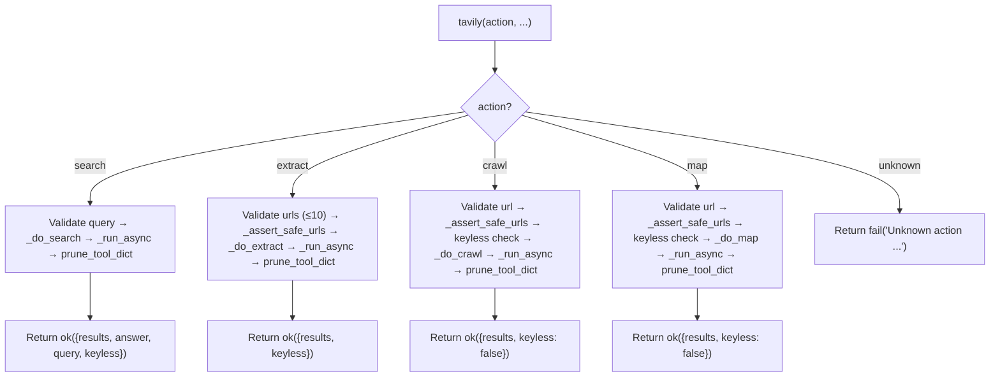

# 🔬 Tavily Tool

The `tavily()` tool provides **AI-optimized web search and content extraction** via the [Tavily API](https://tavily.com). It complements the existing `web` tool with superior ranking, automatic citations, and bulk extraction capabilities.

**Key characteristics:**
- **AI-ranked results** — Tavily's relevance engine outperforms raw SearXNG for research queries
- **Automatic citations** — Every result includes URL, title, and confidence score
- **Bulk extraction** — `extract` action can process up to 10 URLs in one call
- **Keyless mode** — Works without API key for `search` and `extract` (rate-limited)
- **Async client, sync facade** — `AsyncTavilyClient` wrapped in `_run_async()` bridge for MCP compatibility
- **Lazy client loading** — `AsyncTavilyClient` imported and instantiated only on first use
- **PARALLEL_SAFE** — Pure network I/O, no shared state

---

## 🚀 Quick Start

```python
# AI-ranked search
web(action="search", query="FastMCP python tutorial", max_results=5)

# Bulk URL extraction
web(action="extract", urls=["https://docs.python.org/3/library/pathlib.html", "https://..."])

# Deep site crawl (requires API key)
web(action="crawl", url="https://example.com", max_depth=2, max_breadth=10)

# Site structure map (requires API key)
web(action="map", url="https://example.com", max_depth=2)

# Keyless mode — works without API key for search/extract
web(action="search", query="Python async patterns")
# → {"status": "success", "data": {"keyless": true, ...}}
```

---

## 🏗️ Architecture

```text
tools/tavily.py
├── tavily(action, ...)                    # @tool facade — action dispatch, validation
├── _do_search(...)                       # AsyncTavilyClient.search() via _run_async()
├── _do_extract(...)                      # AsyncTavilyClient.extract() via _run_async()
├── _do_crawl(...)                        # AsyncTavilyClient.crawl() via _run_async() (API key required)
├── _do_map(...)                          # AsyncTavilyClient.map() via _run_async() (API key required)
├── _do_research(...)                     # AsyncTavilyClient.research() via _run_async() (workflow-only)
├── _get_client()                         # Lazy AsyncTavilyClient (keyless or keyed)
├── _is_keyless()                         # Check if cfg.tavily_api_key is empty
├── _warn_keyless_once()                  # Single logger.warning on first keyless use
├── _assert_safe_urls(urls)               # SSRF guard via core/security.py
├── _handle_tavily_error(e)               # Exception → standardized fail() with type detection
└── _run_async(coro)                      # Async-to-sync bridge (asyncio.run or ThreadPoolExecutor)
```

### Dispatch Flow



**Key design decisions:**
- **Async-to-sync bridge** — `_run_async()` handles two cases: (1) no running loop → `asyncio.run(coro)`; (2) running loop (e.g., inside MCP) → spawns a `ThreadPoolExecutor(max_workers=1)` and runs `asyncio.run` in a fresh thread. Timeout: `cfg.tavily_timeout + 10` seconds.
- **Lazy client with key caching** — `_get_client()` caches the `AsyncTavilyClient` instance and re-creates it only if the API key changes. Thread-safe via `_get_client_lock`. Keyless mode uses `api_key=None`.
- **Keyless warning once** — `_warn_keyless_once()` logs a single `logger.warning` on first keyless invocation to avoid log spam.
- **SSRF at action level** — `_assert_safe_urls()` is called inside `_do_extract`, `_do_crawl`, and `_do_map` (not at the facade level). `search` does not need SSRF since it doesn't fetch arbitrary URLs.
- **Raw content stripping** — `_do_search` strips `raw_content` from all results unless `include_raw_content=True`. Prevents context window explosion.
- **Error type detection** — `_handle_tavily_error()` uses both `isinstance` checks (with lazy tavily imports) and `type(e).__name__` string fallback. This handles both installed and mocked tavily packages.
- **`research` is workflow-only** — `_do_research()` exists but is NOT exposed in the `@tool` facade. Reserved for `workflows/deep_research.py`.
- **All outputs pruned** — Every action result passes through `prune_tool_dict()` from `core.memory_backend.pruner` before return.

---

## 📝 Tool Signature

```python
@tool
def tavily(
    action: str,
    query: str = "",
    urls: Optional[list[str]] = None,
    url: str = "",
    input: str = "",
    max_results: int = 5,
    search_depth: str = "basic",
    topic: Optional[str] = None,
    time_range: Optional[str] = None,
    include_domains: Optional[list[str]] = None,
    exclude_domains: Optional[list[str]] = None,
    include_answer: bool = True,
    include_raw_content: bool = False,
    include_images: bool = False,
    extract_depth: str = "basic",
    format: str = "markdown",
    max_depth: int = 2,
    max_breadth: int = 10,
    limit: int = 100,
    model: Optional[str] = None,
    citation_format: str = "apa",
    trace_id: str = "",
) -> dict:
    """Tavily AI research tool — AI-ranked search, extraction, and deep research."""
```

| Parameter | Type | Required | Description |
|-----------|------|----------|-------------|
| `action` | `str` | **Yes** | One of `search`, `extract`, `crawl`, `map` |
| `query` | `str` | No | Search query. **Required** for `search`. Also accepted by `crawl`/`map` as fallback for `url`. |
| `urls` | `list[str]` | No | URLs for `extract`. **Required** for `extract`. Max 10 items. |
| `url` | `str` | No | Starting URL for `crawl`/`map`. **Required** for `crawl`/`map` (or use `query` as fallback). |
| `input` | `str` | No | Research input for `_do_research()` (workflow-only, not exposed in facade). |
| `max_results` | `int` | No | Results per search. Default: 5. Range: 1–10. **Capped at 3 in keyless mode.** |
| `search_depth` | `str` | No | `"basic"` or `"advanced"`. Default: `"basic"`. |
| `topic` | `str` | No | Topic filter for search. |
| `time_range` | `str` | No | Time range filter for search. |
| `include_domains` | `list[str]` | No | Whitelist domains for search. |
| `exclude_domains` | `list[str]` | No | Blacklist domains for search. |
| `include_answer` | `bool` | No | Include AI-generated answer in search. Default: `True`. |
| `include_raw_content` | `bool` | No | Include full page text in search results. Default: `False`. **Large!** |
| `include_images` | `bool` | No | Include images in extract results. Default: `False`. |
| `extract_depth` | `str` | No | `"basic"` or `"advanced"`. Default: `"basic"`. |
| `format` | `str` | No | Output format for extract. `"markdown"` or `"text"`. Default: `"markdown"`. |
| `max_depth` | `int` | No | Max link depth for crawl/map. Default: 2. |
| `max_breadth` | `int` | No | Max pages per level for crawl/map. Default: 10. |
| `limit` | `int` | No | Max total pages for crawl/map. Default: 100. |
| `model` | `str` | No | Model override for `_do_research()` (workflow-only). |
| `citation_format` | `str` | No | Citation format for `_do_research()`. `"apa"` or `"ieee"`. Default: `"apa"`. |
| `trace_id` | `str` | No | Trace identifier for logging and result correlation. |

> **Note:** The `research` action is **not exposed** in the `@tool` facade. Use `workflows/deep_research.py` for end-to-end deep research.

---

## ⚡ Actions

### `search` — AI-ranked web search

Queries Tavily and returns AI-ranked results with titles, URLs, snippets, and an optional AI-generated answer.

**Keyless behavior:**
- `max_results` is silently capped to `3`
- Response includes `"keyless": true`
- Lower rate limits apply (~100 requests/day)
- Single `logger.warning` on first keyless use

**Return:**
```json
{
  "status": "success",
  "data": {
    "results": [
      {"title": "...", "url": "https://...", "content": "...", "score": 0.95}
    ],
    "answer": "AI-generated summary...",
    "query": "FastMCP python tutorial",
    "keyless": false
  }
}
```

**Raw content handling:**
- Stripped from all results by default (prevents context window explosion)
- Included only if `include_raw_content=True`

**Error cases:**
- Missing `query` → `fail("query is required for search action")`
- Keyless rate limit → `fail("Tavily keyless rate limit reached...")`
- Invalid API key → `fail("Tavily API key invalid or revoked...")`
- Timeout → `fail("Tavily request timed out after {timeout}s.")`
- Connection error → `fail("Failed to connect to Tavily API. Check network.")`

### `extract` — Bulk URL content extraction

Accepts up to 10 URLs and returns extracted content with citations for each.

**Return:**
```json
{
  "status": "success",
  "data": {
    "results": [
      {"url": "https://...", "text": "Extracted markdown...", "images": []}
    ],
    "keyless": false
  }
}
```

**Validation:**
- Missing `urls` → `fail("urls is required for extract action")`
- More than 10 URLs → `fail("urls cannot exceed 10 items")`
- Unsafe URLs → `fail("Blocked: {url} resolves to a private/internal address")`

### `crawl` — Deep site traversal

Follows links from a starting URL up to `max_depth` levels. **Requires API key.**

**Return:**
```json
{
  "status": "success",
  "data": {
    "results": [{"url": "...", "title": "...", "content": "..."}],
    "keyless": false
  }
}
```

**Validation:**
- Missing `url` (and `query` fallback) → `fail("url or query is required for crawl action")`
- Keyless mode → `fail("crawl action requires a Tavily API key...")`
- Unsafe URL → `fail("Blocked: {url} resolves to a private/internal address")`

### `map` — Site structure discovery

Discovers site hierarchy without fetching full content. **Requires API key.**

**Return:**
```json
{
  "status": "success",
  "data": {
    "results": [{"url": "...", "title": "..."}],
    "keyless": false
  }
}
```

**Validation:** Same as `crawl`.

---

## 🔒 Security

### SSRF Guard (`_assert_safe_urls`)

All URL parameters (`url`, `urls`) pass through `_assert_safe_urls()` inside the action handlers:

```python
def _assert_safe_urls(urls: list[str]) -> Optional[str]:
    for url in urls:
        hostname = urlparse(url).hostname or ""
        if not is_safe_network_address(hostname):
            return f"Blocked: {url} resolves to a private/internal address"
    return None
```

Uses `core.security.is_safe_network_address` — same guard as `web.py`.

**Note:** `search` does not call `_assert_safe_urls()` because it does not fetch arbitrary URLs — it queries the Tavily API with a search string.

---

## ⚠️ Error Handling

`_handle_tavily_error()` maps exceptions to standardized `fail()` responses:

| Condition | Detection | User Message |
|-----------|-----------|--------------|
| Keyless rate limit | `TavilyKeylessLimitError` or name match | `"Tavily keyless rate limit reached. Set TAVILY_API_KEY..."` |
| Invalid API key | `InvalidAPIKeyError` or name match | `"Tavily API key invalid or revoked. Check TAVILY_API_KEY..."` |
| Monthly quota | `UsageLimitExceededError` or name match | `"Tavily monthly quota exhausted."` |
| Tavily API error (429) | `TavilyAPIError` with status 429 | `"Tavily rate limit exceeded (HTTP 429). Retry after a short delay."` |
| Tavily API error (other) | `TavilyAPIError` | `"Tavily API error ({status}): {msg[:200]}"` |
| HTTP timeout | `httpx.TimeoutException` | `"Tavily request timed out after {cfg.tavily_timeout}s."` |
| HTTP connection error | `httpx.ConnectError` | `"Failed to connect to Tavily API. Check network."` |
| HTTP 401/403 | `httpx.HTTPStatusError` | `"Tavily authentication failed. Check API key."` |
| HTTP other | `httpx.HTTPStatusError` | `"Tavily HTTP error {status}: {msg[:200]}"` |
| Generic | Any other exception | `"Tavily error: {type}: {msg[:200]}"` |

**Detection strategy:** Uses `isinstance` checks with lazy tavily imports, falling back to `type(e).__name__` string matching. This handles both installed and mocked tavily packages.

---

## ⚙️ Configuration

```ini
# .env
TAVILY_API_KEY=tvly-...          # Optional — enables full functionality (crawl, map, research)
TAVILY_TIMEOUT=60                # Request timeout in seconds (1-300, default 60)
```

```python
# core/config.py
self.tavily_api_key = os.getenv("TAVILY_API_KEY", "")
self.tavily_timeout = int(os.getenv("TAVILY_TIMEOUT", "60"))
```

**Keyless mode:** When `TAVILY_API_KEY` is empty, `AsyncTavilyClient(api_key=None)` supports `search` and `extract` with lower limits. `crawl`, `map`, and `research` fail with a clear message.

---

## 📤 Output & Pruning

All responses pass through `prune_tool_dict()` from `core.memory_backend.pruner`:
- Large `raw_content` / `text` fields are truncated with artifact recovery
- Full content saved to `workspace/.artifacts/`
- Structured citations always preserved

---

## 🧪 Testing

```powershell
# Run all tavily tests (fully mocked, no API calls)
D:\mcp\agent\venv\Scripts\pytest.exe tests/tools/tavily/ -W error --tb=short -v
```

**Test coverage (7 files):**

| File | Tests | Coverage |
|------|-------|----------|
| `test_search.py` | — | Search action, result parsing, keyless capping, include_answer, include_raw_content |
| `test_extract.py` | — | Extract action, URL validation, batch processing, format handling |
| `test_crawl.py` | — | Crawl action, keyless rejection, depth/breadth params, result parsing |
| `test_map.py` | — | Map action, keyless rejection, query fallback, result parsing |
| `test_error_handling.py` | — | All error types: keyless limit, invalid key, quota, 429, timeout, connection, generic |
| `test_keyless_mode.py` | — | Keyless search/extract, keyless crawl/map rejection, warning once |
| `test_ssrf.py` | — | `_assert_safe_urls` blocking, safe URL passthrough |
| `test_client_caching.py` | — | Lazy client creation, key change detection, thread safety |

**Mock strategy:**
- Patch `tools.tavily._get_client` to return `AsyncMock` (no `tavily` package installation required for unit tests)
- Patch `cfg.tavily_api_key` to `""` for keyless mode tests
- Patch `cfg.tavily_api_key` to `"tvly-test"` for keyed mode tests
- Patch `core.security.is_safe_network_address` for SSRF tests
- Mock `AsyncTavilyClient.search()` / `.extract()` / `.crawl()` / `.map()` to return deterministic responses
- Test `_handle_tavily_error()` with both real and mocked exception types

**Current test layout:**
```text
tests/tools/tavily/
├── __init__.py
├── test_client_caching.py
├── test_crawl.py
├── test_error_handling.py
├── test_extract.py
├── test_keyless_mode.py
├── test_map.py
├── test_search.py
└── test_ssrf.py
```

> **Future:** When the tool is refactored to `@meta_tool` + un-multiplex, this will expand to `conftest.py` + per-action test files following the `tests/tools/browser/` and `tests/tools/git/` patterns. Some existing tests may be merged or restructured.

---

## 🔄 When to Use vs Alternatives

| Need | Tool | Why |
|------|------|-----|
| Quick search (free) | `web(search)` | SearXNG, no API costs |
| AI-ranked search | `tavily(search)` | Better relevance, citations, AI answer |
| Single static page (free) | `web(read)` | Fast, lightweight, no API costs |
| Bulk URL extraction | `tavily(extract)` | Optimized batch, AI-powered, up to 10 URLs |
| Site crawling | `tavily(crawl)` | Follows links, discovers pages (API key required) |
| Site structure | `tavily(map)` | Discovers hierarchy without fetching content (API key required) |
| Deep research | `workflows/deep_research.py` | End-to-end research via `_do_research()` (not exposed as tool action) |
| JS-rendered page | `browser(navigate+text_content)` | Renders JavaScript |
| Interactive forms | `browser(click, fill)` | Supports interaction |

---

## 🗺️ Roadmap

### ✅ Completed

| Feature | Status | Notes |
|---------|--------|-------|
| 4 exposed actions (`search`, `extract`, `crawl`, `map`) | ✅ v1.0 | `research` is workflow-only |
| Async-to-sync bridge | ✅ v1.0 | `_run_async()` handles nested loops + ThreadPoolExecutor fallback |
| Lazy client with key caching | ✅ v1.0 | Re-creates client only on API key change, thread-safe lock |
| Keyless mode | ✅ v1.0 | `search`/`extract` work without API key; `crawl`/`map`/`research` reject |
| SSRF guard | ✅ v1.0 | `_assert_safe_urls()` on `extract`/`crawl`/`map` |
| Raw content stripping | ✅ v1.0 | `_do_search` strips `raw_content` unless `include_raw_content=True` |
| Comprehensive error handling | ✅ v1.0 | `_handle_tavily_error()` covers 8+ exception types with lazy imports |
| `prune_tool_dict` integration | ✅ v1.0 | All action outputs piped through pruner |
| `PARALLEL_SAFE` | ✅ v1.0 | Pure network I/O, no shared state |
| `max_results` keyless cap | ✅ v1.0 | Silently clamps to 3 in keyless mode |
| URL count validation | ✅ v1.0 | `extract` rejects > 10 URLs |
| `crawl`/`map` url/query fallback | ✅ v1.0 | Accepts either `url` or `query` param |

### 🔄 In Progress / Next Up

| Feature | Notes | Priority |
|---------|-------|----------|
| `@meta_tool` refactor | Add `Literal` action validation and auto-generated schema/docstring (follow `browser` pattern) | P0 |
| Un-multiplex | Extract `_do_search`, `_do_extract`, `_do_crawl`, `_do_map` into atomic handlers under `tavily_core/actions/` with auto-discovery | P0 |
| Test restructure | Add `conftest.py`, consolidate per-action tests following `tests/tools/browser/` pattern | P1 |
| `trace_id` propagation | Currently `""` in all action results. Pass facade `trace_id` through to `ok()`/`fail()` calls in all handlers | P1 |
| `research` workflow integration | Formalize `_do_research()` as a node in `workflows/deep_research.py` with proper input/output contracts | P1 |
| `_do_research()` expose or remove | Decide: (a) add `action="research"` to facade, (b) keep internal and wire directly from `deep_research`, or (c) remove if unused. Currently exists but has no caller | P1 |
| Wire `_do_research()` into `deep_research` | Call from `deep_research_impl/nodes/search.py` when iteration > 3 and completeness < 50 as accelerator | P1 |
| `tavily(search)` as primary search in research workflow | Replace `web(search)` with `tavily(search)` in `workflows/research.py` when API key is available | P2 |
| `tavily(search)` → `browser` fallback chain | For JS-heavy results, auto-retry with `browser(navigate+text_content)` | P2 |
| Cost tracking | Tokens × price metadata for agent budget visibility | P3 |
| Response caching | Cache Tavily responses (TTL-based) to avoid redundant API calls for identical queries | P3 |
| `search` result deduplication | Similar to `web(search_and_read)`, deduplicate identical URLs across Tavily result pages | P3 |
| Keyless `max_results` configurable | Currently hardcoded cap at 3. Add `TAVILY_KEYLESS_MAX_RESULTS` to `.env` | P3 |


### 🚫 Deferred / Out of Scope

| # | Feature | Why Deferred | Priority |
|---|---------|------------|----------|
| 1 | **Expose `research` as tool action** | `_do_research()` is intentionally workflow-only. Exposing it as a tool action would bypass the research workflow's planning, routing, and memory integration. | Skip |
| 2 | **Streaming responses** | MCP stdio transport doesn't support streaming. Would require gateway-only mode. | Skip |
| 3 | **Synchronous client** | `AsyncTavilyClient` is the only official client. A sync wrapper would be redundant given `_run_async()`. | Skip |
| 4 | **Custom HTTP adapter** | `httpx` handles retries and connection pooling well. No need for a custom adapter. | Skip |
| 5 | **Result pagination** | Tavily API returns all results in one call. No pagination API exists. | Skip |
| 6 | **Image extraction in `search`** | `include_images` is supported in `extract`, not `search`. Tavily API limitation. | Skip |
| 7 | **Expose `_do_research()` as standalone tool action without workflow integration** | Would bypass the research workflow's planning, routing, and memory integration. Either expose with clear "use deep_research instead" warning, or keep internal-only. | Skip |

---

## 🛡️ AI Agent Instructions

### NEVER DO
1. **Never expose `_do_research()` as a tool action** — it is workflow-only by design.
2. **Never bypass `_assert_safe_urls()`** — SSRF protection must run before every URL-touching action.
3. **Never remove the keyless check from `crawl`/`map`** — these require an API key. Keyless mode is search/extract only.
4. **Never hardcode timeout values** — Always use `cfg.tavily_timeout`. The `.env` is the single source of truth.
5. **Never skip `_handle_tavily_error()`** — Always route exceptions through the centralized handler for consistent error messages.
6. **Never create `.bak` files** — forbidden by project rules.
7. **Never rewrite the entire file** — surgical edits only. Preserve existing code exactly.
8. **Never add `**kwargs` to the `@tool` facade** — FastMCP schema breaks.
9. **Never print to stdout** — MCP stdio corruption. Return dicts only.
10. **Never skip `compileall` before `pytest`** — catches syntax errors early.

### ALWAYS DO
11. **Always pass `trace_id` to `ok()` and `fail()`** — Currently `""` in most places. Fix this when adding trace_id support.
12. **Always use `_run_async()` for Tavily client calls** — Never call `asyncio.run()` directly; the bridge handles nested event loops.
13. **Always strip `raw_content` by default** — `_do_search` must pop `raw_content` from results unless `include_raw_content=True`.
14. **Always test keyless and keyed modes** — Patch `cfg.tavily_api_key` to `""` and `"tvly-test"` respectively.
15. **Always test error paths with both real and mocked exceptions** — `_handle_tavily_error()` uses both `isinstance` and name matching.
16. **Always update this doc** when adding actions, changing return shapes, or modifying the client lifecycle.

---

## 🔗 Source Code Reference

| File | Purpose |
|------|---------|
| `tools/tavily.py` | `@tool` facade: action dispatch, validation, async-to-sync bridge, error handling |
| `core/security.py` | `is_safe_network_address()` — SSRF protection |
| `core/contracts.py` | `ok()` / `fail()` — standardized return dicts with `trace_id` injection |
| `core/config.py` | `cfg.tavily_api_key`, `cfg.tavily_timeout` |
| `core/memory_backend/pruner.py` | `prune_tool_dict()` — head+tail truncation, artifact storage |
| `tests/tools/tavily/test_search.py` | Search action tests |
| `tests/tools/tavily/test_extract.py` | Extract action tests |
| `tests/tools/tavily/test_crawl.py` | Crawl action tests |
| `tests/tools/tavily/test_map.py` | Map action tests |
| `tests/tools/tavily/test_error_handling.py` | Error handler tests |
| `tests/tools/tavily/test_keyless_mode.py` | Keyless mode tests |
| `tests/tools/tavily/test_ssrf.py` | SSRF guard tests |
| `tests/tools/tavily/test_client_caching.py` | Client lifecycle tests |
| `workflows/deep_research.py` | Uses `_do_research()` (workflow-only) |

---

*Architecture: thin @tool facade + action dispatch + lazy AsyncTavilyClient with key caching + async-to-sync bridge + SSRF guard + comprehensive error handler + prune_tool_dict truncation + keyless mode with warning.*
