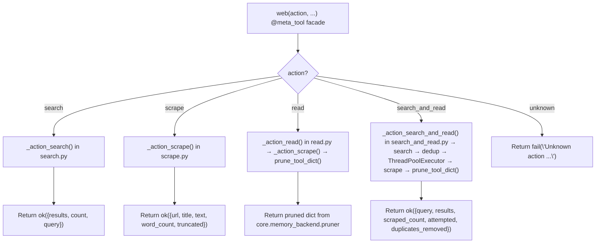

# 🌐 Web Tool

The `web()` tool provides web search and content extraction via **SearXNG** (self-hosted metasearch) and **BeautifulSoup4** (HTML parsing). It is the agent\'s primary tool for discovering URLs and reading static HTML pages.

**Key characteristics:**
- **Free / self-hosted** — requires only a running SearXNG instance (no API keys)
- **Static HTML only** — JavaScript-rendered pages may return empty/short text
- **Parallel scraping** — `search_and_read` fans out to `ThreadPoolExecutor` for concurrent page fetching
- **Lightweight** — pure Python (`httpx` + `BS4`), no browser overhead
- **Connection pooling** — singleton `httpx.Client` reuses TCP/TLS connections across calls
- **SSRF protection** — all URLs validated via `core.net.security.is_safe_network_address` before any HTTP request
- **Content-type guard** — rejects PDFs, images, and oversized responses before parsing
- **Retry with backoff** — one retry on transient errors (503, 429, timeout) with exponential backoff
- **User-agent rotation** — rotates through a pool of browser UAs to reduce 403 blocks

---

## 🚀 Quick Start

```python
# Search the web
web(action="search", query="FastMCP python tutorial", max_results=5)

# Read a single page
web(action="read", url="https://docs.python.org/3/library/pathlib.html")

# Scrape a page (same as read, but no pruning)
web(action="scrape", url="https://example.com")

# Search + scrape top results in parallel
web(action="search_and_read", query="ChromaDB persistent client", max_results=5)
```

---

## 🏗️ Architecture

### v1.1 Refactored Structure

```text
tools/web.py
├── web(action, ...) # @tool + @meta_tool facade — action dispatch, validation
tools/web_ops/
├── __init__.py      # Auto-discovers actions/*.py at import time
├── _registry.py     # DISPATCH dict + @register_action decorator
├── state.py         # _HTTP_CLIENT, _HTTP_CLIENT_LOCK, reset_state(), reset_loop()
├── client.py        # Singleton httpx.Client: _get_singleton_client(), _make_client(), _close_client(), _pick_user_agent()
├── utils.py         # _is_safe_url() — SSRF guard, scheme allowlist, shared by search + scrape
└── actions/
    ├── search.py           # _action_search() — SearXNG query
    ├── scrape.py           # _action_scrape() — Fetch + guards + retry + BS4 clean → {url, title, text, word_count, truncated}
    ├── read.py             # _action_read() — Alias: scrape + prune_tool_dict()
    └── search_and_read.py  # _action_search_and_read() — Search → dedup → parallel scrape → prune
```

### Dispatch Flow



**Key design decisions:**
- **Thin `@tool` + `@meta_tool` facade** — `tools/web.py` is the only file scanned by `registry.py`. `web_ops/` submodules are invisible to the registry. The facade looks up handlers in `DISPATCH["web"]` and routes parameters.
- **Auto-discovery via `@register_action`** — Action modules in `web_ops/actions/*.py` self-register into `DISPATCH` at import time. Adding a new action = create a file + add decorator. No central wiring needed.
- **Singleton client in `client.py`** — `_HTTP_CLIENT` created once with `httpx.Limits(max_connections=20)` and reused across all calls. `atexit.register(_close_client)` ensures cleanup on process exit. Thread-safe for `ThreadPoolExecutor` usage.
- **User-agent rotation** — `_pick_user_agent()` selects from a pool of 4 realistic browser UAs on singleton creation. Reduces 403 blocks from sites filtering on default `python-httpx` UA.
- **State isolation in `state.py`** — `reset_state()` closes the singleton and nullifies the reference for test isolation. `reset_loop()` is a no-op for compatibility with browser test fixtures.
- **SSRF in `utils.py`** — `_is_safe_url()` is shared by both `search.py` (validates SearXNG URL) and `scrape.py` (validates target URLs). Calls `core.net.security.is_safe_network_address`. Also enforces an `http`/`https` scheme allowlist — rejects `file://`, `ftp://`, `javascript:`, etc.
- **Lazy BS4 import** — `from bs4 import BeautifulSoup` only happens inside `_html_to_text()` on first call. Keeps startup fast if web tool is never used.
- **`read` = `scrape` + pruning** — The `read` action calls `_action_scrape()` internally, then pipes the result through `prune_tool_dict()` from `core.memory_backend.pruner`. This truncates oversized outputs and saves full content to `workspace/.artifacts/`.
- **`scrape` = raw extraction** — Returns the full unpruned result. Exposed as a public action for callers that want complete text without truncation.
- **URL deduplication in `search_and_read`** — SearXNG often returns the same URL from multiple engines. `search_and_read` deduplicates while preserving rank order before scraping.
- **`concurrent.futures.wait()` in `search_and_read`** — Uses `wait()` with `cfg.worker_timeout` global timeout (not `as_completed()`). Handles `not_done` futures as timeout errors. Follows the `parallel_executor.py` pattern. Uses `shutdown(wait=False)` to prevent blocking on slow threads after timeout fires.
- **Pruning in action files** — `read.py` and `search_and_read.py` apply `prune_tool_dict()` inside their handlers. This keeps the facade thin and avoids the facade needing to know which actions prune.
- **Content-type guard in `_fetch_html`** — After receiving headers, rejects `application/pdf` and `image/*` with structured errors. Suggests using `file(action="read_pdf")` or `browser(action="screenshot")` respectively.
- **Response size guard** — Rejects responses with `Content-Length > 10 MB` before reading body. Prevents memory exhaustion from malicious/misconfigured servers.
- **Retry with exponential backoff** — `_fetch_html` retries once on transient errors (HTTP 429/500/502/503/504, `TimeoutException`, `ConnectError`, `NetworkError`) with `sleep(min(2^attempt, 8))` seconds. Does NOT retry client errors (4xx except 429) or permanent failures.

---

## 📝 Tool Signature

```python
@tool
@meta_tool(DISPATCH["web"], doc_sections=[...])
def web(
    action: str,       # Literal["search", "scrape", "read", "search_and_read"]
    query: str = "",
    url: str = "",
    max_results: int = 5,
    max_chars: Optional[int] = None,  # None = use cfg.web_max_text_chars (resolved in handlers)
    trace_id: str = "",
) -> dict:
    """Web meta-tool — atomic actions for search and scraping."""
```

| Parameter | Type | Required | Description |
|-----------|------|----------|-------------|
| `action` | `str` | **Yes** | One of `search`, `scrape`, `read`, `search_and_read` |
| `query` | `str` | No | Search query. **Required** for `search` and `search_and_read`. |
| `url` | `str` | No | Target URL. **Required** for `scrape` and `read`. |
| `max_results` | `int` | No | Max search results. Default: 5. Upper bound: `cfg.web_max_search_results`. |
| `max_chars` | `Optional[int]` | No | Max characters per scraped page. Default: `None` (resolved to `cfg.web_max_text_chars` in handlers). |
| `trace_id` | `str` | No | Trace identifier for logging and pruning artifacts. |

> **Note:** There is no `summarize` or `include_raw` parameter. The old doc incorrectly listed these. `search_and_read` returns raw scraped text, not LLM summaries. Raw HTML is never included in responses.

---

## ⚡ Actions

### `search` — Find URLs via SearXNG

Queries the configured SearXNG instance and returns ranked results with titles, URLs, snippets, and source engines.

**Config:**
```ini
SEARXNG_URL=http://localhost:8080
WEB_MAX_SEARCH_RESULTS=10
WEB_SNIPPET_CHARS=300
```

**Return:**
```json
{
  "status": "success",
  "data": {
    "results": [
      {"url": "https://...", "title": "...", "snippet": "...", "engine": "google"}
    ],
    "count": 5,
    "query": "FastMCP python tutorial"
  }
}
```

| Field | Type | Description |
|-------|------|-------------|
| `url` | `str` | Result URL |
| `title` | `str` | Page title from SearXNG |
| `snippet` | `str` | Content snippet, truncated to `cfg.web_snippet_chars` |
| `engine` | `str` | Source search engine (e.g., `google`, `bing`, `duckduckgo`) |

**Error cases:**
- Missing query → `fail("action=\'search\' requires query=")`
- SSRF blocked SearXNG URL → `fail("SSRF blocked: SearXNG URL ...")`
- SearXNG timeout → `fail("SearXNG timeout at {url}")`
- SearXNG unreachable → `fail("Cannot reach SearXNG at {url}")`
- General failure → `fail("Search failed: {exception}")`

---

### `scrape` — Read a single static page (raw)

Fetches HTML via `httpx`, parses with BeautifulSoup4, and returns clean text + metadata. **No pruning** — returns the full text up to `max_chars`.

**Guards applied:**
- SSRF: URL validated before request
- Scheme: only `http://` and `https://` allowed
- PDF pre-flight: URLs ending in `.pdf` rejected before HTTP request
- Content-type: `application/pdf` and `image/*` rejected after headers arrive
- Size: `Content-Length > 10 MB` rejected before reading body
- Retry: one retry with exponential backoff on transient errors

**Return:**
```json
{
  "status": "success",
  "data": {
    "url": "https://...",
    "title": "Page Title",
    "text": "Clean extracted text...",
    "word_count": 1500,
    "truncated": false
  }
}
```

**JS limitation:** If the page requires JavaScript (React, Angular, etc.), `text` may be empty or very short (`< 300 chars`). Use the `browser` tool as fallback.

---

### `read` — Read a single static page (pruned)

Identical to `scrape`, but the result is piped through `prune_tool_dict()` from `core.memory_backend.pruner`:
- Head + tail truncation with `[TRUNCATED: ...]` marker if `text > max_chars`
- Full content saved to `workspace/.artifacts/`
- Recovery hint included in response

**Return:** Same shape as `scrape`, but potentially truncated with artifact path.

> **Note:** `read` is the preferred action for reading web pages. Use `scrape` only when you need the raw unpruned text.

---

### `search_and_read` — Parallel search + scrape (most powerful)

Runs `search`, deduplicates URLs while preserving rank order, then fans out to `scrape` each result in parallel via `ThreadPoolExecutor(max_workers=min(len(urls), 4))`.

**Flow:**
```text
search(query, n) → [url1, url2, url3]
 ├─ Deduplicate URLs (preserve rank order)
 ├─ ThreadPoolExecutor(max_workers=min(len(urls), 4))
 │ ├─ Worker 1: _action_scrape(url1) → result1
 │ ├─ Worker 2: _action_scrape(url2) → result2
 │ └─ Worker 3: _action_scrape(url3) → result3
 ├─ Reassemble in original URL order
 ├─ concurrent.futures.wait() with cfg.worker_timeout global timeout
 │ ├─ done futures: collect results
 │ └─ not_done futures: report as timeout errors
 ├─ shutdown(wait=False) — do not block on slow threads after timeout
 └─ prune_tool_dict() on final aggregated result
```

**Return:**
```json
{
  "status": "success",
  "data": {
    "query": "ChromaDB persistent client",
    "results": [
      {"url": "https://...", "title": "...", "text": "...", "word_count": 1500}
    ],
    "scraped_count": 3,
    "attempted": 3,
    "duplicates_removed": 2
  }
}
```

| Field | Type | Description |
|-------|------|-------------|
| `query` | `str` | Original search query |
| `results` | `list` | Successfully scraped pages, in original rank order |
| `scraped_count` | `int` | Number of pages with non-empty text |
| `attempted` | `int` | Number of unique URLs attempted |
| `duplicates_removed` | `int` | Number of duplicate URLs filtered before scraping |

> **Cross-action coupling note:** `search_and_read` directly imports `_action_search` and `_action_scrape` from sibling modules. This is intentional for performance (avoids facade overhead). If `search`/`scrape` signatures change, update this file.

---

## 🔒 Security

### SSRF Guard (`_is_safe_url`)

All URL parameters pass through `_is_safe_url()` in `web_ops/utils.py` before any HTTP request:

```python
def _is_safe_url(url: str) -> bool:
    parsed = urlparse(url)
    if parsed.scheme not in ("http", "https"):
        return False
    hostname = parsed.hostname
    if not hostname:
        return False
    from core.net.security import is_safe_network_address
    return is_safe_network_address(hostname)
```

**Blocks:**
- Non-HTTP schemes (`file://`, `ftp://`, `javascript:`, etc.)
- Private IP ranges (`192.168.x.x`, `10.x.x.x`, `172.16-31.x.x`)
- Loopback (`127.0.0.1`, `localhost`)
- Link-local (`169.254.x.x`)
- IPv6 loopback (`::1`)
- Malformed URLs (empty hostname)

**Applied to:**
- SearXNG URL in `search` (validates the configured endpoint itself)
- Target URLs in `scrape` / `read`
- All URLs in `search_and_read` (via internal `_action_scrape` calls)

### HTTP Client

The singleton `httpx.Client` is configured with:
- `headers`: rotating User-Agent from a pool of 4 realistic browser UAs
- `timeout`: 10.0s (client default; individual requests override: `_fetch_html` uses 20s, `_do_search` uses 15s)
- `follow_redirects`: `True`
- `limits`: `httpx.Limits(max_connections=20)`

**Thread safety:** `httpx.Client` is thread-safe. Safe to use inside `ThreadPoolExecutor` in `search_and_read`.

---

## 📤 Output & Pruning

All actions return `ok()/fail()` dicts from `core/contracts.py`.

**Pruning behavior by action:**

| Action | Pruned? | Notes |
|--------|---------|-------|
| `search` | ❌ No | Results are small; no pruning needed |
| `scrape` | ❌ No | Returns full text up to `max_chars` |
| `read` | ✅ Yes | Piped through `prune_tool_dict()` — truncated outputs saved to `workspace/.artifacts/` |
| `search_and_read` | ✅ Yes | Final result piped through `prune_tool_dict()` |

---

## 🔄 When to Use vs Alternatives

| Need | Tool | Why |
|------|------|-----|
| Quick search | `web(search)` | Free, SearXNG, no API costs |
| Static page text (full) | `web(scrape)` | Fast, lightweight, no overhead, no pruning |
| Static page text (pruned) | `web(read)` | Same as scrape but with truncation guard for large pages |
| Bulk scrape from search | `web(search_and_read)` | Parallel, automated, deduplicated |
| AI-ranked search | `tavily(search)` | Better relevance, citations, AI answer |
| JS-rendered page | `browser(navigate+text_content)` | Renders JavaScript |
| Bulk URL extraction | `tavily(extract)` | Optimized batch extraction |

---

## 🧪 Testing

```powershell
# Run all web tests
D:\\mcp\\agent\\venv\\Scripts\\pytest.exe tests/tools/web/ -W error --tb=short -v
```

**Test coverage (9 files):**

| File | Tests | Coverage |
|------|-------|----------|
| `conftest.py` | — | Shared fixtures: `reset_web_state()`, `mock_cfg_for_web()` (single shared mock), `mock_httpx()` |
| `test_search.py` | — | SearXNG query building, result parsing, timeout, connection error, SSRF on SearXNG URL |
| `test_scrape.py` | — | HTML extraction, title parsing, text cleaning, truncation, missing URL, `max_chars=None` default, content-type guards, response size guard, retry backoff, PDF pre-flight |
| `test_read.py` | — | Alias behavior: scrape + prune_tool_dict() call, missing URL |
| `test_search_and_read.py` | — | URL deduplication, parallel execution, result ordering, empty result handling, timeout with partial results, mixed success/failure |
| `test_error_handling.py` | — | Unknown action, no search results, HTTP errors, SSRF blocking (real is_safe_network_address mock), scheme blocking, invalid hostnames |
| `test_client.py` | — | Singleton creation, thread safety, context manager, connection limits (public API), close/reset, user-agent rotation |
| `test_registry.py` | — | DISPATCH auto-discovery, action metadata, duplicate registration guard |
| `test_facade.py` | — | `@meta_tool` Literal enum generation, unknown action error, tracer step calls, `max_chars=None` not passed to handlers |

**Mock strategy:**
- Mock `httpx.Client` at the action module level (patch `tools.web_ops.actions.{search,scrape}._make_client`)
- Mock `cfg` with explicit integers (no `MagicMock` comparison errors for `cfg.web_max_text_chars`, `cfg.web_snippet_chars`)
- Use a **single shared mock** patched into all action modules — ensures mutations are visible to every handler
- Test SSRF blocking by patching `core.net.security.is_safe_network_address` (not the wrapper)
- Test timeout and connection error handling via `httpx.TimeoutException`, `httpx.ConnectError`
- Test action dispatch (`search`, `scrape`, `read`, `search_and_read`, unknown action)
- Test `_html_to_text` with various HTML structures (no `bs4` mock needed — it\'s pure HTML parsing)
- Test retry backoff by mocking `time.sleep` and asserting call count
- Test content-type guards by setting `response.headers = {"content-type": "..."}`

**Test patch path migration (old → new):**

| Old Patch | New Patch |
|-----------|-----------|
| `tools.web.cfg` | `tools.web_ops.actions.search.cfg` / `tools.web_ops.actions.scrape.cfg` |
| `tools.web._make_client` | `tools.web_ops.actions.search._make_client` / `tools.web_ops.actions.scrape._make_client` |
| `tools.web._get_singleton_client` | `tools.web_ops.client._get_singleton_client` |
| `tools.web._HTTP_CLIENT` | `tools.web_ops.state._HTTP_CLIENT` |
| `tools.web._is_safe_url` | `tools.web_ops.utils._is_safe_url` |
| `tools.web._do_search` | `tools.web_ops.actions.search._action_search` |
| `tools.web._do_scrape` | `tools.web_ops.actions.scrape._action_scrape` |

**Current test layout:**
```text
tests/tools/web/
├── __init__.py
├── conftest.py              # Shared fixtures (reset_web_state, mock_cfg_for_web, mock_httpx)
├── test_search.py           # Search action tests
├── test_scrape.py           # Scrape action tests + guards + retry
├── test_read.py             # Read alias tests
├── test_search_and_read.py  # Parallel search+scrape tests + timeout
├── test_error_handling.py   # SSRF, HTTP error, timeout, unknown action, scheme blocking
├── test_client.py           # Singleton client lifecycle tests + UA rotation
├── test_registry.py         # DISPATCH registry tests
└── test_facade.py           # @meta_tool facade tests + max_chars=None dispatch
```

---

## ⚠️ Breaking Changes

### v1.1 (Hardening + Guards)

- **`max_chars` facade default fixed** — Was `int = 0` (broken: truncated all text to 0 chars). Now `Optional[int] = None` (handlers resolve `cfg.web_max_text_chars`). Callers omitting `max_chars` now get the config default instead of empty text.
- **Content-type guard added** — `_fetch_html` now rejects `application/pdf` and `image/*` responses with structured errors. Previously, binary data was passed to BeautifulSoup, producing garbage.
- **Response size guard added** — `_fetch_html` rejects responses with `Content-Length > 10 MB`. Previously, malicious servers could stream multi-GB responses into memory.
- **Retry with exponential backoff added** — `_fetch_html` retries once on transient errors (503, 429, timeout, connect error) with `sleep(min(2^attempt, 8))`. Previously, a single transient error permanently dropped the URL.
- **PDF pre-flight detection** — URLs ending in `.pdf` are rejected before any HTTP request. Previously, PDFs were fetched and passed to BeautifulSoup.
- **User-agent rotation added** — Singleton client now uses a rotating pool of 4 browser UAs. Previously, a single hardcoded UA was used.
- **Scheme allowlist in `_is_safe_url`** — Only `http://` and `https://` are allowed. Previously, `file:///etc/passwd` could bypass hostname checks.
- **`is_safe_network_address` lazy import** — Moved from module-level to inside `_is_safe_url()`. Prevents `core.net.security` from being loaded at `web_ops` import time.
- **`ThreadPoolExecutor` shutdown fix** — `search_and_read` now uses explicit `ex.shutdown(wait=False)` after `wait()` returns. Previously, the `with` context manager called `shutdown(wait=True)`, blocking until all threads finished and making `cfg.worker_timeout` ineffective.

### v1 (`@meta_tool` refactor + atomic actions)

- **Split monolithic `tools/web.py` into `tools/web_ops/` subpackage** — `web_ops/_registry.py`, `web_ops/__init__.py`, `web_ops/state.py`, `web_ops/client.py`, `web_ops/utils.py`, and `web_ops/actions/{search,scrape,read,search_and_read}.py`
- **Added `@register_action` auto-discovery** via `pathlib` + `importlib` in `web_ops/__init__.py`
- **Added `@meta_tool` auto-generated `Literal` enum and docstring** — `action` parameter is now `Literal["search", "scrape", "read", "search_and_read"]`
- **Moved singleton client logic to `web_ops/client.py`** — `_get_singleton_client()`, `_make_client()`, `_close_client()`, `_SingletonClientContext`
- **Moved global state to `web_ops/state.py`** — `_HTTP_CLIENT`, `_HTTP_CLIENT_LOCK`, `reset_state()`, `reset_loop()`
- **Extracted `_is_safe_url` to `web_ops/utils.py`** — Shared SSRF guard used by both `search` and `scrape` actions
- **Replaced `as_completed` with `concurrent.futures.wait()`** in `search_and_read` — Global timeout via `cfg.worker_timeout`, `not_done` futures reported as timeout errors
- **`atexit.register(_close_client)` moved to `client.py`** — Was in `web.py`. Now only in `client.py` module level.
- **`reset_state()` now closes sockets** — Calls `._close()` before nullifying `_HTTP_CLIENT`. Prevents connection leaks in tests.
- **`sorted()` in `__init__.py` glob** — `sorted(_actions_dir.glob("*.py"))` for deterministic import order across filesystems.
- **Test restructure** — Added `conftest.py` with shared fixtures, split into 9 focused test files matching action structure
- **Added `test_registry.py`** — Verifies all 4 actions registered in `DISPATCH`
- **Added `test_facade.py`** — Verifies `@meta_tool` generates `Literal` enum, unknown action error, param filtering

---

## 🗺️ Roadmap

### ✅ Completed

| Feature | Status | Notes |
|---------|--------|-------|
| 4 actions (`search`, `scrape`, `read`, `search_and_read`) | ✅ v1.0 | `read` is `scrape` + pruning alias |
| `@meta_tool` + `@register_action` auto-discovery | ✅ v1.0 | `Literal` enum, dynamic docstring, no central wiring |
| SearXNG integration | ✅ v1.0 | `httpx` GET to `/search?format=json` |
| BeautifulSoup4 extraction | ✅ v1.0 | Decomposes `script`, `style`, `nav`, `footer`, `header`, `aside`, `noscript`, `iframe`; targets `main`/`article`/content id/class |
| Module-level singleton `httpx.Client` | ✅ v1.0 | Connection pooling, `atexit` cleanup, thread-safe |
| SSRF protection | ✅ v1.0 | `_is_safe_url` → `core.net.security.is_safe_network_address` |
| URL deduplication in `search_and_read` | ✅ v1.0 | Preserves rank order, counts `duplicates_removed` |
| Parallel scraping with global timeout | ✅ v1.0 | `ThreadPoolExecutor` + `concurrent.futures.wait()` + `cfg.worker_timeout` |
| Config-driven limits | ✅ v1.0 | `cfg.web_max_text_chars`, `cfg.web_snippet_chars`, `cfg.web_max_search_results`, `cfg.searxng_url` |
| `prune_tool_dict` integration | ✅ v1.0 | `read` and `search_and_read` pipe through pruner |
| Test restructure with conftest.py | ✅ v1.0 | 9 focused test files, shared fixtures, no duplication |
| **`max_chars` sentinel fix** | ✅ **v1.1** | `Optional[int] = None` instead of broken `int = 0` |
| **Content-type guard** | ✅ **v1.1** | Rejects PDF/image before BS4 parsing |
| **Response size guard** | ✅ **v1.1** | 10 MB ceiling on `Content-Length` |
| **Retry with exponential backoff** | ✅ **v1.1** | One retry on transient errors |
| **PDF pre-flight detection** | ✅ **v1.1** | Rejects `.pdf` URLs before HTTP request |
| **User-agent rotation** | ✅ **v1.1** | 4-browser UA pool |
| **Scheme allowlist** | ✅ **v1.1** | `http`/`https` only |
| **Lazy `is_safe_network_address` import** | ✅ **v1.1** | Inside `_is_safe_url()`, not module-level |
| **`ThreadPoolExecutor` shutdown fix** | ✅ **v1.1** | `shutdown(wait=False)` after `wait()` timeout |

### 🔄 In Progress / Next Up

| Feature | Notes | Priority |
|---------|-------|----------|
| Standardize `max_results` across tools | Use `cfg.web_max_search_results` consistently across `web/search`, `research`, and `deep_research` nodes. Currently `web` defaults to 5, `research` hardcodes 3, `deep_research` hardcodes 5. **Will be addressed when research/deep_research are refactored.** | P2 |
| Browser fallback in `search_and_read` | When `_action_scrape` returns `< 300` chars, auto-retry with `browser(navigate+text_content)` for JS-rendered pages. Run sequentially after `ThreadPoolExecutor` closes, NOT inside workers | P1 |
| SearXNG circuit breaker / Tavily fallback | If SearXNG fails (timeout, 503, connection error), auto-fallback to `tavily(action="search")` if `TAVILY_API_KEY` is configured | P2 |
| PDF handling | Detect `.pdf` URLs, download to `workspace/.artifacts/`, return structured reference. Or route to `file(action="read_pdf")` | P2 |
| `read` vs `scrape` consolidation discussion | `read` is `scrape` + `prune_tool_dict`. Consider making `read` the default and `scrape` internal, or adding a `prune` flag | P2 |
| LRU cache for `read` | `functools.lru_cache` or disk-backed cache keyed by URL hash. Avoids re-fetching the same page twice in a trace | P2 |
| Cached read | `web(action="cached_read", url=...)` — check local cache before fetching, TTL-based invalidation | P3 |
| Robots.txt respect | Check `robots.txt` before scraping to avoid getting blocked. Cache parsed robots.txt per domain | P3 |
| Rate limiting per domain | Track request timestamps per domain. Sleep if exceeding N requests/second. Prevents 429 bans | P3 |
| Extract `_html_to_text` to `core/html.py` | Pure HTML→text converter. Extract when a second consumer appears (email tool, RSS reader, etc.) | P3 |

### 🚫 Deferred / Out of Scope

| # | Feature | Why Deferred | Priority |
|---|---------|------------|----------|
| 1 | **LLM summarization in `search_and_read`** | The old doc incorrectly claimed this exists. It was never implemented. Summarization belongs in the `research` workflow, not the web tool. | Skip |
| 2 | **`include_raw` parameter** | Never existed in the code. Raw HTML bloats context windows. Use `browser(extract_html)` if DOM structure is needed. | Skip |
| 3 | **Structured extraction (`headers`, `links`, `images`)** | The old LLM draft fabricated this. `scrape` only returns `url`, `title`, `text`, `word_count`, `truncated`. Use `browser(extract_links)` / `browser(extract_tables)` for structured extraction. | Skip |
| 4 | **JavaScript rendering in web tool** | Out of scope. Use `browser` for JS-rendered pages. | Skip |
| 5 | **Rate limiting / politeness delay** | `search_and_read` already has implicit politeness via connection pooling. Explicit delays would slow down parallel scraping. | Skip |
| 6 | **Proxy / SOCKS5 support** | Not needed for current deployment. Can be added via `httpx` proxy config if required. | Skip |
| 7 | **Browser fallback inside thread pool workers** | Browser is `NOT_PARALLEL_SAFE`. Fallback must run sequentially after `ThreadPoolExecutor` closes, not inside worker threads. | Skip |
| 8 | **HTTP connection pooling optimization** | Already optimal. Singleton `httpx.Client` with `Limits(max_connections=20)` is reused across all threads. Nothing to tune. | Skip |
| 9 | **Response compression** | `httpx` already handles gzip/brotli transparently via `Accept-Encoding`. No action needed. | Skip |

---

## 🛡️ AI Agent Instructions

### NEVER DO
1. **Never add `summarize` or `include_raw` params** — these never existed in the code. The LLM draft fabricated them.
2. **Never add per-action prompt engineering in the facade** — the web tool is a data-fetching tool, not an LLM orchestrator. Summarization belongs in workflows.
3. **Never remove the singleton client** — per-request `httpx.Client()` causes TCP/TLS handshake overhead and connection leaks. The singleton is the correct pattern.
4. **Never skip `_is_safe_url()` in `_fetch_html()`** — SSRF protection must be at the HTTP layer, not just the facade.
5. **Never expand `PARALLEL_SAFE` to include `web`** — `web` is already in `PARALLEL_SAFE`. The tool itself is safe for `parallel()` usage.
6. **Never create `.bak` files** — forbidden by project rules.
7. **Never rewrite the entire file** — surgical edits only. Preserve existing code exactly.
8. **Never add `**kwargs` to the `@tool` facade** — FastMCP schema breaks.
9. **Never print to stdout** — MCP stdio corruption. Return dicts only.
10. **Never skip `compileall` before `pytest`** — catches syntax errors early.
11. **Never call `future.cancel()` on running threads** — `ThreadPoolExecutor` futures that are `not_done` after `wait()` are already running. `.cancel()` is a no-op. Report them as timeout errors instead.

### ALWAYS DO
12. **Always use `_make_client()` context manager** — yields the singleton without closing it. Never use `httpx.Client()` directly in new code.
13. **Always call `prune_tool_dict()` for `read` and `search_and_read`** — these are the user-facing actions that may return large text. `scrape` is the raw internal helper.
14. **Always test SSRF blocking** — patch `core.net.security.is_safe_network_address` (not the wrapper) and assert blocked URLs return `fail`.
15. **Always test with explicit `cfg` values** — `MagicMock` causes comparison errors with `cfg.web_max_text_chars`. Use `patch.object(cfg, \'web_max_text_chars\', 8000)`.
16. **Always test the unknown action path** — `web(action="nonsense")` must return `fail` with the usage hint.
17. **Always patch where the name is looked up** — `tools.web_ops.actions.search._make_client`, not `tools.web._make_client`.
18. **Always update this doc** when adding actions, changing return shapes, or modifying the singleton client.
19. **Always use `sorted()` in `__init__.py` glob** — `sorted(_actions_dir.glob("*.py"))` for deterministic import order across filesystems.
20. **Always lazy-import `prune_tool_dict`** — Import inside the handler function, not at module top, to avoid circular imports with `core.memory_backend.pruner`.
21. **Always use a single shared `cfg` mock** in `conftest.py` — patch all action modules to the same `MagicMock` object so mutations are visible to every handler.
22. **Always test the `max_chars=None` default path** — omit `max_chars` from facade calls and assert handlers resolve `cfg.web_max_text_chars`.
23. **Always test content-type guards** — set `response.headers = {"content-type": "application/pdf"}` and assert structured error.
24. **Always test retry behavior** — mock `time.sleep` to avoid real delays, assert call count equals retry attempts.

---

## 🔗 Source Code Reference

| File | Purpose |
|------|---------|
| `tools/web.py` | `@tool` + `@meta_tool` facade: action dispatch, validation, tracer steps |
| `tools/web_ops/_registry.py` | `DISPATCH` dict, `@register_action` decorator with duplicate guard |
| `tools/web_ops/__init__.py` | Auto-discovers `actions/*.py` via `pathlib` + `importlib` |
| `tools/web_ops/state.py` | `_HTTP_CLIENT`, `_HTTP_CLIENT_LOCK`, `reset_state()`, `reset_loop()` |
| `tools/web_ops/client.py` | Singleton `httpx.Client`: `_get_singleton_client()`, `_make_client()`, `_close_client()`, `_pick_user_agent()`, `_USER_AGENTS` |
| `tools/web_ops/utils.py` | `_is_safe_url()` — SSRF guard with scheme allowlist, shared by search and scrape |
| `tools/web_ops/actions/search.py` | `_action_search()` — SearXNG query handler |
| `tools/web_ops/actions/scrape.py` | `_action_scrape()`, `_fetch_html()` (guards + retry), `_html_to_text()` — fetch + extract |
| `tools/web_ops/actions/read.py` | `_action_read()` — scrape + `prune_tool_dict()` alias |
| `tools/web_ops/actions/search_and_read.py` | `_action_search_and_read()` — composite: search → dedup → parallel scrape → prune |
| `core/net/security.py` | `is_safe_network_address()` — SSRF protection |
| `core/contracts.py` | `ok()` / `fail()` — standardized return dicts with `trace_id` injection |
| `core/config.py` | `cfg.searxng_url`, `cfg.web_max_text_chars`, `cfg.web_snippet_chars`, `cfg.web_max_search_results`, `cfg.worker_timeout` |
| `core/memory_backend/pruner.py` | `prune_tool_dict()` — head+tail truncation, artifact storage |
| `core/parallel_executor.py` | `concurrent.futures.wait()` pattern for global timeout handling |

---

*Architecture: thin `@tool` + `@meta_tool` facade → `DISPATCH` registry → atomic action handlers in `web_ops/actions/` → singleton `httpx.Client` (with UA rotation) → SSRF guard + scheme allowlist → content-type guard → response size guard → retry with exponential backoff → BeautifulSoup4 extraction → `ThreadPoolExecutor` parallel scraping (with `wait()` + `shutdown(wait=False)`) → `prune_tool_dict` truncation → `atexit` cleanup.*
