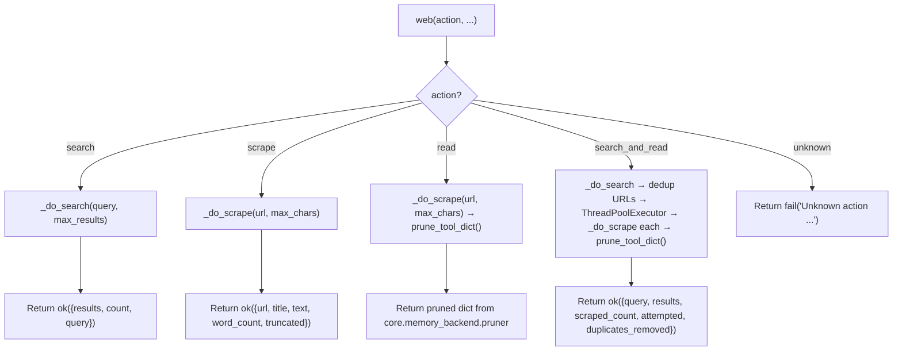

# 🌐 Web Tool

The `web()` tool provides web search and content extraction via **SearXNG** (self-hosted metasearch) and **BeautifulSoup4** (HTML parsing). It is the agent's primary tool for discovering URLs and reading static HTML pages.

**Key characteristics:**
- **Free / self-hosted** — requires only a running SearXNG instance (no API keys)
- **Static HTML only** — JavaScript-rendered pages may return empty/short text
- **Parallel scraping** — `search_and_read` fans out to `ThreadPoolExecutor` for concurrent page fetching
- **Lightweight** — pure Python (`httpx` + `BS4`), no browser overhead
- **Connection pooling** — module-level singleton `httpx.Client` reuses TCP/TLS connections across calls
- **SSRF protection** — all URLs validated via `core.security.is_safe_network_address` before any HTTP request

---

## 🚀 Quick Start

```python
# Search the web
web(action="search", query="FastMCP python tutorial", max_results=5)

# Read a single page
web(action="read", url="https://docs.python.org/3/library/pathlib.html")

# Scrape a page (same as read, but no pruning)
web(action="scrape", url="https://example.com")

# Search + scrape top results in parallel
web(action="search_and_read", query="ChromaDB persistent client", max_results=5)
```

---

## 🏗️ Architecture

```text
tools/web.py
├── web(action, ...)                    # @tool facade — action dispatch, validation
├── _do_search(query, max_results)      # SearXNG query via httpx
├── _do_scrape(url, max_chars)          # Fetch + BS4 clean → {url, title, text, word_count, truncated}
├── _fetch_html(url, timeout=20)        # httpx GET with SSRF guard → (html, error)
├── _is_safe_url(url)                   # SSRF: blocks private IPs via core.security
├── _html_to_text(html, max_chars)    # BS4 extraction → (clean_text, title)
├── _get_singleton_client()             # Module-level httpx.Client with connection pooling
├── _SingletonClientContext             # Context manager yielding singleton (no close on exit)
└── _close_client()                     # atexit hook to close singleton on process exit
```

### Dispatch Flow



**Key design decisions:**
- **Module-level singleton client** — `_HTTP_CLIENT` is created once with `httpx.Limits(max_connections=20)` and reused across all calls. `atexit.register(_close_client)` ensures cleanup on process exit. Thread-safe for `ThreadPoolExecutor` usage.
- **Lazy BS4 import** — `from bs4 import BeautifulSoup` only happens inside `_html_to_text` on first call. Keeps startup fast if web tool is never used.
- **`read` = `scrape` + pruning** — The `read` action is identical to `scrape` but pipes the result through `prune_tool_dict()` from `core.memory_backend.pruner`. This truncates oversized outputs and saves full content to `workspace/.artifacts/`.
- **`scrape` = raw extraction** — Returns the full unpruned result. Useful when the caller wants the complete text without truncation.
- **URL deduplication in `search_and_read`** — SearXNG often returns the same URL from multiple engines. `search_and_read` deduplicates while preserving rank order before scraping.
- **`as_completed` in `search_and_read`** — Uses `concurrent.futures.as_completed()` (not `wait()`). This is acceptable here because each future has its own timeout via `_fetch_html(timeout=20)`. The global timeout is implicit through the individual scrape timeouts.
- **SSRF at the HTTP layer** — `_is_safe_url()` is called inside `_fetch_html()`, not at the facade level. This means any internal helper that calls `_fetch_html()` is automatically protected.

---

## 📝 Tool Signature

```python
@tool
def web(
    action: str,
    query: str = "",
    url: str = "",
    max_results: int = 5,
    max_chars: Optional[int] = None,
    trace_id: str = "",
) -> dict:
    """Web tool -- search the web or read web pages.

    action: "search" | "scrape" | "read" | "search_and_read"

    search: Search SearXNG and return ranked URLs with titles and snippets.
    scrape / read: Fetch a URL and return clean text (JS/CSS removed).
    search_and_read: Search then scrape the top results in parallel.
    """
```

| Parameter | Type | Required | Description |
|-----------|------|----------|-------------|
| `action` | `str` | **Yes** | One of `search`, `scrape`, `read`, `search_and_read` |
| `query` | `str` | No | Search query. **Required** for `search` and `search_and_read`. |
| `url` | `str` | No | Target URL. **Required** for `scrape` and `read`. |
| `max_results` | `int` | No | Max search results. Default: 5. Upper bound: `cfg.web_max_search_results`. |
| `max_chars` | `int` | No | Max characters per scraped page. Default: `cfg.web_max_text_chars`. |
| `trace_id` | `str` | No | Trace identifier for logging and pruning artifacts. |

> **Note:** There is no `summarize` or `include_raw` parameter. The old doc incorrectly listed these. `search_and_read` returns raw scraped text, not LLM summaries. Raw HTML is never included in responses.

---

## ⚡ Actions

### `search` — Find URLs via SearXNG

Queries the configured SearXNG instance and returns ranked results with titles, URLs, snippets, and source engines.

**Config:**
```ini
SEARXNG_URL=http://localhost:8080
WEB_MAX_SEARCH_RESULTS=10
WEB_SNIPPET_CHARS=300
```

**Return:**
```json
{
  "status": "success",
  "data": {
    "results": [
      {"url": "https://...", "title": "...", "snippet": "...", "engine": "google"}
    ],
    "count": 5,
    "query": "FastMCP python tutorial"
  }
}
```

| Field | Type | Description |
|-------|------|-------------|
| `url` | `str` | Result URL |
| `title` | `str` | Page title from SearXNG |
| `snippet` | `str` | Content snippet, truncated to `cfg.web_snippet_chars` |
| `engine` | `str` | Source search engine (e.g., `google`, `bing`, `duckduckgo`) |

**Error cases:**
- SearXNG timeout → `fail("SearXNG timeout at {url}")`
- SearXNG unreachable → `fail("Cannot reach SearXNG at {url}")`
- General failure → `fail("Search failed: {exception}")`

### `scrape` — Read a single static page (raw)

Fetches HTML via `httpx`, parses with BeautifulSoup4, and returns clean text + metadata. **No pruning** — returns the full text up to `max_chars`.

**Return:**
```json
{
  "status": "success",
  "data": {
    "url": "https://...",
    "title": "Page Title",
    "text": "Clean extracted text...",
    "word_count": 1500,
    "truncated": false
  }
}
```

**JS limitation:** If the page requires JavaScript (React, Angular, etc.), `text` may be empty or very short (`< 300 chars`). Use the `browser` tool as fallback.

### `read` — Read a single static page (pruned)

Identical to `scrape`, but the result is piped through `prune_tool_dict()` from `core.memory_backend.pruner`:
- Head + tail truncation with `[TRUNCATED: ...]` marker if `text > max_chars`
- Full content saved to `workspace/.artifacts/`
- Recovery hint included in response

**Return:** Same shape as `scrape`, but potentially truncated with artifact path.

### `search_and_read` — Parallel search + scrape (most powerful)

Runs `search`, deduplicates URLs while preserving rank order, then fans out to `scrape` each result in parallel via `ThreadPoolExecutor(max_workers=min(len(urls), 4))`.

**Flow:**
```text
search(query, n) → [url1, url2, url3]
  ├─ Deduplicate URLs (preserve rank order)
  ├─ ThreadPoolExecutor(max_workers=min(len(urls), 4))
  │   ├─ Worker 1: _do_scrape(url1) → result1
  │   ├─ Worker 2: _do_scrape(url2) → result2
  │   └─ Worker 3: _do_scrape(url3) → result3
  ├─ Reassemble in original URL order
  └─ prune_tool_dict() on final result
```

**Return:**
```json
{
  "status": "success",
  "data": {
    "query": "ChromaDB persistent client",
    "results": [
      {"url": "https://...", "title": "...", "text": "...", "word_count": 1500}
    ],
    "scraped_count": 3,
    "attempted": 3,
    "duplicates_removed": 2
  }
}
```

| Field | Type | Description |
|-------|------|-------------|
| `query` | `str` | Original search query |
| `results` | `list` | Successfully scraped pages, in original rank order |
| `scraped_count` | `int` | Number of pages with non-empty text |
| `attempted` | `int` | Number of unique URLs attempted |
| `duplicates_removed` | `int` | Number of duplicate URLs filtered before scraping |

---

## 🔒 Security

### SSRF Guard (`_is_safe_url`)

All URL parameters pass through `_is_safe_url()` inside `_fetch_html()` before any HTTP request:

```python
def _is_safe_url(url: str) -> bool:
    hostname = urlparse(url).hostname or ""
    from core.security import is_safe_network_address
    return is_safe_network_address(hostname)
```

**Blocks:**
- Private IP ranges (`192.168.x.x`, `10.x.x.x`, `172.16-31.x.x`)
- Loopback (`127.0.0.1`, `localhost`)
- Link-local (`169.254.x.x`)
- IPv6 loopback (`::1`)

### HTTP Client

The singleton `httpx.Client` is configured with:
- `headers`: `{"User-Agent": "Mozilla/5.0 MCP-Agent/1.0"}`
- `timeout`: 10.0s (client default; individual requests override: `_fetch_html` uses 20s, `_do_search` uses 15s)
- `follow_redirects`: `True`
- `limits`: `httpx.Limits(max_connections=20)`

**Thread safety:** `httpx.Client` is thread-safe. Safe to use inside `ThreadPoolExecutor` in `search_and_read`.

---

## 📤 Output & Pruning

All actions return `ok()/fail()` dicts from `core/contracts.py`.

**Pruning behavior by action:**

| Action | Pruned? | Notes |
|--------|---------|-------|
| `search` | ❌ No | Results are small; no pruning needed |
| `scrape` | ❌ No | Returns full text up to `max_chars` |
| `read` | ✅ Yes | Piped through `prune_tool_dict()` — truncated outputs saved to `workspace/.artifacts/` |
| `search_and_read` | ✅ Yes | Final result piped through `prune_tool_dict()` |

---

## 🔄 When to Use vs Alternatives

| Need | Tool | Why |
|------|------|-----|
| Quick search | `web(search)` | Free, SearXNG, no API costs |
| Static page text (full) | `web(scrape)` | Fast, lightweight, no overhead, no pruning |
| Static page text (pruned) | `web(read)` | Same as scrape but with truncation guard for large pages |
| Bulk scrape from search | `web(search_and_read)` | Parallel, automated, deduplicated |
| AI-ranked search | `tavily(search)` | Better relevance, citations, AI answer |
| JS-rendered page | `browser(navigate+text_content)` | Renders JavaScript |
| Bulk URL extraction | `tavily(extract)` | Optimized batch extraction |

---

## 🧪 Testing

```powershell
# Run all web tests
D:\mcp\agent\venv\Scripts\pytest.exe tests/tools/web/ -W error --tb=short -v
```

**Test coverage (5 files):**

| File | Tests | Coverage |
|------|-------|----------|
| `test_web_search.py` | — | SearXNG query building, result parsing, timeout, connection error |
| `test_web_scrape.py` | — | HTML extraction, title parsing, text cleaning, truncation |
| `test_web_search_and_read.py` | — | URL deduplication, parallel execution, result ordering, empty result handling |
| `test_web_error_handling.py` | — | SSRF blocking, HTTP errors, timeout, connection error, malformed HTML |
| `test_web_singleton.py` | — | Singleton client creation, thread safety, atexit cleanup |

**Mock strategy:**
- Mock `httpx.Client` at module level (patch `tools.web._get_singleton_client` or `_HTTP_CLIENT`)
- Mock `cfg` with explicit integers (no `MagicMock` comparison errors for `cfg.web_max_text_chars`, `cfg.web_snippet_chars`)
- Test SSRF blocking with `192.168.1.1`, `127.0.0.1`, `localhost`
- Test timeout and connection error handling via `httpx.TimeoutException`, `httpx.ConnectError`
- Test action dispatch (`search`, `scrape`, `read`, `search_and_read`, unknown action)
- Test `_html_to_text` with various HTML structures (no `bs4` mock needed — it's pure HTML parsing)

**Current test layout:**
```text
tests/tools/web/
├── __init__.py
├── test_web_error_handling.py
├── test_web_scrape.py
├── test_web_search.py
├── test_web_search_and_read.py
└── test_web_singleton.py
```

> **Future:** When the tool is refactored to `@meta_tool` + un-multiplex, this will expand to `conftest.py` + per-action test files under `tests/tools/web/` following the `tests/tools/browser/` and `tests/tools/git/` patterns. Some existing tests may be merged or deleted during the restructure.

---

## 🗺️ Roadmap

### ✅ Completed

| Feature | Status | Notes |
|---------|--------|-------|
| 4 actions (`search`, `scrape`, `read`, `search_and_read`) | ✅ v1.0 | `read` is `scrape` + pruning alias |
| SearXNG integration | ✅ v1.0 | `httpx` GET to `/search?format=json` |
| BeautifulSoup4 extraction | ✅ v1.0 | Decomposes `script`, `style`, `nav`, `footer`, `header`, `aside`, `noscript`, `iframe`; targets `main`/`article`/content id/class |
| Module-level singleton `httpx.Client` | ✅ v1.0 | Connection pooling, `atexit` cleanup, thread-safe |
| SSRF protection | ✅ v1.0 | `_is_safe_url` → `core.security.is_safe_network_address` |
| URL deduplication in `search_and_read` | ✅ v1.0 | Preserves rank order, counts `duplicates_removed` |
| Parallel scraping | ✅ v1.0 | `ThreadPoolExecutor(max_workers=min(len(urls), 4))` |
| Config-driven limits | ✅ v1.0 | `cfg.web_max_text_chars`, `cfg.web_snippet_chars`, `cfg.web_max_search_results`, `cfg.searxng_url` |
| `prune_tool_dict` integration | ✅ v1.0 | `read` and `search_and_read` pipe through pruner |

### 🔄 In Progress / Next Up

| Feature | Notes | Priority |
|---------|-------|----------|
| `@meta_tool` refactor | Add `Literal` action validation and auto-generated schema/docstring (follow `browser` pattern) | P0 |
| Un-multiplex | Extract `_do_search`, `_do_scrape`, `_do_search_and_read` into atomic handlers under `web_core/actions/` with auto-discovery | P0 |
| Test restructure | Add `conftest.py`, split into per-action files (`test_search.py`, `test_scrape.py`, `test_read.py`, `test_search_and_read.py`), merge `test_web_singleton.py` into `conftest.py` or `test_facade.py` | P1 |
| `search_and_read` timeout hardening | Replace `as_completed` with `concurrent.futures.wait()` + configurable global timeout (follow `parallel_executor` pattern) | P1 |
| Browser fallback in `search_and_read` | When `_do_scrape` returns `< 300` chars, auto-retry with `browser(navigate+text_content)` for JS-rendered pages (run sequentially after thread pool, NOT inside workers) | P1 |
| Standardize `max_results` defaults | Use `cfg.web_max_search_results` consistently across `web/search`, `research`, and `deep_research` nodes. Currently `web` defaults to 5, `research` hardcodes 3, `deep_research` hardcodes 5 | P2 |
| PDF handling | Detect `.pdf` URLs, download to `workspace/.artifacts/`, return structured reference instead of garbage HTML | P2 |
| HTTP connection pooling optimization | Reuse `httpx.Client` across `search_and_read` workers more efficiently; evaluate `Limits` tuning | P2 |
| `read` vs `scrape` consolidation | `read` is just `scrape` + `prune_tool_dict`. Consider making `read` the default and `scrape` an internal helper, or adding a `prune` flag to `scrape` | P2 |
| Cached read | `web(action="cached_read", url=...)` — check local cache before fetching, TTL-based invalidation | P3 |
| Content-type detection | Auto-detect `application/pdf`, `application/json`, `text/plain` and route to appropriate handlers | P3 |
| Robots.txt respect | Check `robots.txt` before scraping to avoid getting blocked | P3 |

| `search_and_read` timeout hardening | Replace `as_completed` with `concurrent.futures.wait()` + configurable global timeout (follow `parallel_executor` pattern) | P1 |
| Browser fallback in `search_and_read` | When `_do_scrape` returns `< 300` chars, auto-retry with `browser(navigate+text_content)` for JS-rendered pages (run sequentially after thread pool, NOT inside workers) | P1 |
| Standardize `max_results` defaults | Use `cfg.web_max_search_results` consistently across `web/search`, `research`, and `deep_research` nodes. Currently `web` defaults to 5, `research` hardcodes 3, `deep_research` hardcodes 5 | P2 |

### 🚫 Deferred / Out of Scope

| # | Feature | Why Deferred | Priority |
|---|---------|------------|----------|
| 1 | **LLM summarization in `search_and_read`** | The old doc incorrectly claimed this exists. It was never implemented. Summarization belongs in the `research` workflow, not the web tool. | Skip |
| 2 | **`include_raw` parameter** | Never existed in the code. Raw HTML bloats context windows. Use `browser(extract_html)` if DOM structure is needed. | Skip |
| 3 | **Structured extraction (`headers`, `links`, `images`)** | The old LLM draft fabricated this. `scrape` only returns `url`, `title`, `text`, `word_count`, `truncated`. Use `browser(extract_links)` / `browser(extract_tables)` for structured extraction. | Skip |
| 4 | **JavaScript rendering** | Out of scope for the web tool. Use `browser` for JS-rendered pages. | Skip |
| 5 | **Rate limiting / politeness delay** | `search_and_read` already has implicit politeness via connection pooling. Explicit delays would slow down parallel scraping. | Skip |
| 6 | **Proxy / SOCKS5 support** | Not needed for current deployment. Can be added via `httpx` proxy config if required. | Skip |
| 7 | **Browser fallback inside thread pool workers** | Browser is NOT_PARALLEL_SAFE. Fallback must run sequentially after `ThreadPoolExecutor` closes, not inside worker threads. | Skip |

---

## 🛡️ AI Agent Instructions

### NEVER DO
1. **Never add `summarize` or `include_raw` params** — these never existed in the code. The LLM draft fabricated them.
2. **Never add per-action prompt engineering in the facade** — the web tool is a data-fetching tool, not an LLM orchestrator. Summarization belongs in workflows.
3. **Never remove the singleton client** — per-request `httpx.Client()` causes TCP/TLS handshake overhead and connection leaks. The singleton is the correct pattern.
4. **Never skip `_is_safe_url()` in `_fetch_html()`** — SSRF protection must be at the HTTP layer, not just the facade.
5. **Never expand `PARALLEL_SAFE` to include `web`** — `web` is already in `PARALLEL_SAFE`. The tool itself is safe for `parallel()` usage.
6. **Never create `.bak` files** — forbidden by project rules.
7. **Never rewrite the entire file** — surgical edits only. Preserve existing code exactly.
8. **Never add `**kwargs` to the `@tool` facade** — FastMCP schema breaks.
9. **Never print to stdout** — MCP stdio corruption. Return dicts only.
10. **Never skip `compileall` before `pytest`** — catches syntax errors early.

### ALWAYS DO
11. **Always use `_make_client()` context manager** — yields the singleton without closing it. Never use `httpx.Client()` directly in new code.
12. **Always call `prune_tool_dict()` for `read` and `search_and_read`** — these are the user-facing actions that may return large text. `scrape` is the raw internal helper.
13. **Always test SSRF blocking** — patch `core.security.is_safe_network_address` and assert blocked URLs return `fail`.
14. **Always test with explicit `cfg` values** — `MagicMock` causes comparison errors with `cfg.web_max_text_chars`. Use `patch.object(cfg, 'web_max_text_chars', 8000)`.
15. **Always test the unknown action path** — `web(action="nonsense")` must return `fail` with the usage hint.
16. **Always update this doc** when adding actions, changing return shapes, or modifying the singleton client.

---

## 🔗 Source Code Reference

| File | Purpose |
|------|---------|
| `tools/web.py` | `@tool` facade: action dispatch, `_do_search`, `_do_scrape`, `_fetch_html`, `_html_to_text`, singleton client management |
| `core/security.py` | `is_safe_network_address()` — SSRF protection |
| `core/contracts.py` | `ok()` / `fail()` — standardized return dicts with `trace_id` injection |
| `core/config.py` | `cfg.searxng_url`, `cfg.web_max_text_chars`, `cfg.web_snippet_chars`, `cfg.web_max_search_results` |
| `core/memory_backend/pruner.py` | `prune_tool_dict()` — head+tail truncation, artifact storage |
| `tests/tools/web/test_web_search.py` | Search action tests |
| `tests/tools/web/test_web_scrape.py` | Scrape/read action tests |
| `tests/tools/web/test_web_search_and_read.py` | Parallel search+scrape tests |
| `tests/tools/web/test_web_error_handling.py` | SSRF, HTTP error, timeout tests |
| `tests/tools/web/test_web_singleton.py` | Singleton client lifecycle tests |

---

*Architecture: thin @tool facade + action dispatch + SearXNG search + httpx singleton client + BeautifulSoup4 extraction + ThreadPoolExecutor parallel scraping + SSRF guard + prune_tool_dict truncation + atexit cleanup.*
