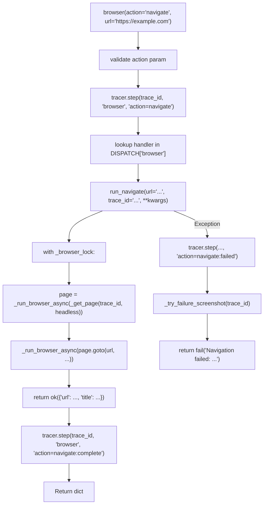

<- Back to [Browser Overview](../BROWSER.md)

# 🏗️ Architecture

## 🔗 Source Code Reference

| File | Purpose |
|------|---------|
| `tools/browser.py` | `@tool` facade: validation, dispatch, tracer, screenshot-on-failure |
| `tools/_meta_tool.py` | `@meta_tool` decorator: auto `Literal`, docstring (shared with git/file/cli/report) |
| `tools/browser_ops/_registry.py` | `DISPATCH` dict, `@register_action` |
| `tools/browser_ops/__init__.py` | Auto-discovery: glob + importlib for `actions/*.py` |
| `tools/browser_ops/factory.py` | Browser/context/page creation (Playwright bridge) |
| `tools/browser_ops/lifecycle.py` | Idle context reaper, screenshot cleanup, atexit |
| `tools/browser_ops/loop.py` | Dedicated async event loop for Playwright |
| `tools/browser_ops/state.py` | Global state: `_browser`, `_contexts`, `_pages`, `_browser_lock` |
| `tools/browser_ops/actions/*.py` | Atomic action handlers (20 files) |
| `tests/tools/browser/` | 27 test files + conftest.py |
| `tests/tools/browser/conftest.py` | `mock_browser`, `mock_cfg_for_browser`, `reset_browser_state` |
| `core/net/security.py` | `is_safe_network_address` — SSRF protection |
| `core/net/errors.py` | `get_retry_delay()` — unified backoff for navigate retry |
| `core/net/default.py` | `BROWSER_TIMEOUT`, `BROWSER_NAV_RETRIES`, `RETRY_BASE_DELAY`, `RETRY_MAX_DELAY` — shared constants |
| `core/tracer.py` | `tracer.step()` — observability |

---

## 🌳 Module Tree

```text
tools/browser.py
├── @tool facade — validation, dispatch, tracer, screenshot-on-failure
tools/_meta_tool.py
├── @meta_tool decorator — auto Literal + docstring (shared)
tools/browser_ops/
├── _registry.py              # DISPATCH dict + @register_action decorator
├── __init__.py               # Auto-discovery: glob(actions/*.py) + importlib
├── factory.py                # Browser/context/page creation (Playwright bridge)
├── lifecycle.py              # Idle context reaper, screenshot cleanup, atexit
├── loop.py                   # Dedicated async event loop for Playwright
├── state.py                  # Global state + threading.Lock()
└── actions/                  # Atomic action handlers (20 files)
    ├── __init__.py           # Empty package init
    ├── navigate.py           # @register_action("browser", "navigate")
    ├── click.py
    ├── fill.py
    ├── type.py
    ├── screenshot.py
    ├── text_content.py
    ├── evaluate.py
    ├── select_option.py      # <select> dropdown option selection
    ├── keyboard_press.py
    ├── get_url.py
    ├── close.py              # Requires trace_id (no anonymous close)
    ├── wait_for_selector.py
    ├── scroll.py
    ├── wait_for_url.py
    ├── hover.py              # NEW v1
    ├── cookies.py            # NEW v1 — get/set/clear with URL filter
    ├── set_viewport.py       # NEW v1 — headless param forwarded
    ├── extract_html.py       # NEW v1 — full_page label for no selector
    ├── extract_links.py      # NEW v1 — json.dumps() for safe JS injection
    ├── extract_tables.py     # NEW v1 — json.dumps() for safe JS injection
    └── upload.py             # NEW v1.1 — file upload to <input type="file">
```

---

## 🔀 Dispatch Flow



---

## 💡 Key Design Decisions

- **Unified DISPATCH** — Single dict holds all actions, handlers, help text, examples. `@meta_tool` reads it to generate schema and docstring. One source. Zero drift.
- **Auto-discovery** — Drop a new file in `actions/` with `@register_action` and it's immediately available. No manual registry updates.
- **Dedicated event loop** — Playwright runs in a separate daemon thread with its own `asyncio` loop. The main thread never blocks on browser I/O.
- **Thread-safe lock** — `_browser_lock` serializes all browser operations. One action at a time per process.
- **Trace isolation** — Each `trace_id` gets its own `BrowserContext`. Cookies and localStorage are isolated between traces.
- **Lazy browser launch** — Chromium is only launched on first action. No startup cost if browser is never used.
- **Screenshot-on-failure** — Failed actions (except `screenshot` and `close`) auto-capture a debug screenshot to `workspace/screenshots/error_{trace_id}_{timestamp}.png`.
- **Safe JS injection** — `extract_links` and `extract_tables` use `json.dumps()` (not `repr()` or f-strings) to embed selectors into JavaScript. Prevents injection of malformed or malicious selectors.

---

## 🧪 Testing

```powershell
# Run all browser tests
.\venv\Scripts\python tests/tools/browser/ -W error --tb=short -v

> **Note:** Ensure `pytest` resolves to your venv. If not, use `python -m pytest` or the full venv path (`venv\Scripts\pytest.exe` on Windows, `venv/bin/pytest` on Unix).
```

**Test architecture:**
- `conftest.py` provides `mock_browser` (autouse) and `mock_cfg_for_browser` (autouse)
- All browser infrastructure is fully mocked — no real Chromium is launched
- Tests are isolated — `reset_browser_state()` resets globals before each test
- One test file per action (20 action tests + registry + facade + error handling + SSRF + screenshot limits)

**Test file layout:**
```text
tests/tools/browser/
├── conftest.py                    # Shared fixtures (autouse)
├── test_navigate.py               # Retry with backoff, scheme validation
├── test_click.py
├── test_fill.py
├── test_type.py
├── test_screenshot.py
├── test_text_content.py
├── test_evaluate.py
├── test_select_option.py          # NEW v1.1
├── test_keyboard_press.py
├── test_get_url.py
├── test_close.py                  # trace_id required
├── test_wait_for_selector.py
├── test_scroll.py
├── test_wait_for_url.py
├── test_hover.py                  # NEW v1
├── test_cookies.py                # URL filter, JSON validation
├── test_set_viewport.py           # headless pass-through
├── test_extract_html.py           # full_page label
├── test_extract_links.py          # safe JS injection, empty selector default
├── test_extract_tables.py         # safe JS injection, empty selector default
├── test_upload.py                 # NEW v1.1
├── test_browser_error_handling.py
├── test_browser_screenshot.py
├── test_browser_ssrf.py           # scheme validation
├── test_registry.py               # NEW v1
├── test_facade.py                 # screenshot-on-failure exclusion
└── test_screenshot_base64.py      # real base64 encoding
```

---

*Last updated: 2026-07-03. See [API.md](API.md) for action details, [CHANGELOG.md](CHANGELOG.md) for version history, [INSTRUCTIONS.md](INSTRUCTIONS.md) for AI editing rules.*
