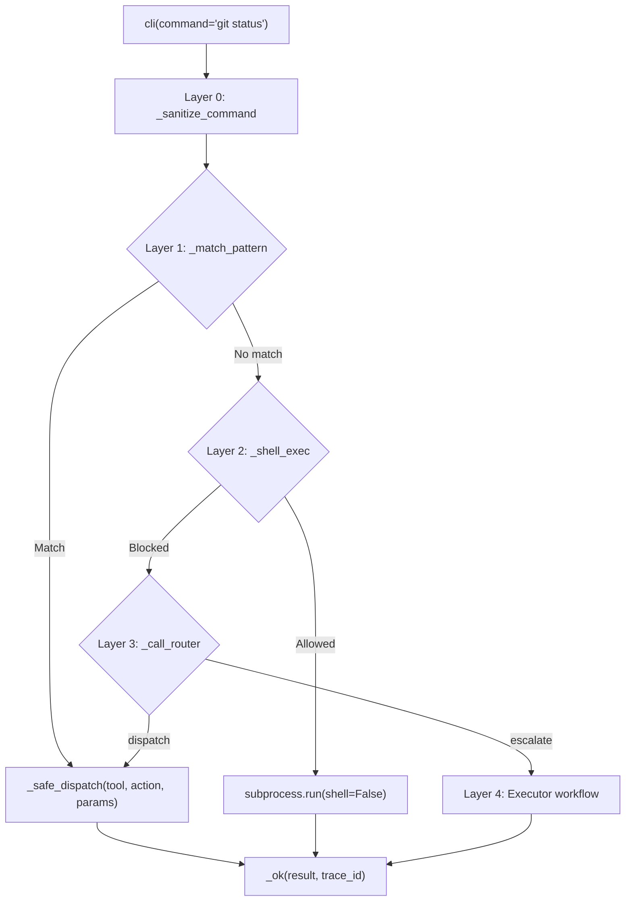

<- Back to [CLI Overview](../CLI.md)

# 🏗️ Architecture

## 🔗 Source Code Reference

| File | Purpose |
|------|---------|
| `tools/cli.py` | `@tool` facade: 4-layer dispatch, security, trace propagation |
| `tools/_meta_tool.py` | `@meta_tool` decorator: auto `Literal`, docstring, metadata |
| `tools/cli_ops/_registry.py` | `DISPATCH` dict, `@register_action` decorator |
| `tools/cli_ops/helpers.py` | `_sanitize_command`, `_shell_exec`, `_safe_dispatch` |
| `tools/cli_ops/patterns.py` | `_match_pattern` — regex-based Layer 1 dispatch |
| `tools/cli_ops/router.py` | `_call_router` — LLM-based Layer 3 dispatch |
| `tools/cli_ops/actions/*.py` | Proxy handlers per tool namespace |
| `tests/tools/cli/` | 9 test files covering all concerns |
| `tests/tools/cli/conftest.py` | `mock_cfg` (autouse), `reset_dispatch` |
| `core/path_guard.py` | Centralized path validation |
| `registry.py` | `get_tool_names()`, `get_tool_actions()` for router introspection |

---

## 🌳 Module Tree

```text
tools/cli.py                    # @tool facade — 4-layer orchestration, security
tools/_meta_tool.py             # @meta_tool decorator — auto docstring, metadata
tools/cli_ops/
├── __init__.py                 # Auto-imports all action modules (import order critical)
├── _registry.py                # DISPATCH dict + @register_action decorator
├── helpers.py                  # _sanitize_command, _shell_exec, _safe_dispatch
├── patterns.py                 # Layer 1 — regex pattern matching (zero tokens)
├── router.py                   # Layer 3 — LLM classification (router role)
└── actions/
    ├── system.py               # system:health, system:help
    ├── file.py                 # file:read_file, file:write_file, etc. (proxy)
    ├── git.py                  # git:status, git:log, etc. (proxy)
    ├── web.py                  # web:search, web:scrape, web:read (proxy)
    ├── python.py               # python:run, python:calc, python:data (proxy)
    ├── memory.py               # memory:recall, memory:store, etc. (proxy)
    ├── notify.py               # notify:send (proxy)
    ├── cleanup.py              # cleanup:autocode, cleanup:dry_run
    ├── skill.py                # skill:call (proxy)
    └── lms.py                  # lms:ls, lms:ps, lms:load, lms:unload, lms:log
```

---

## 🔀 Dispatch Flow



---

## 💡 Key Design Decisions

- **4-layer dispatch** — Layer 0 (sanitize) → Layer 1 (pattern match, zero tokens) → Layer 2 (shell whitelist, zero tokens) → Layer 3 (router LLM) → Layer 4 (executor workflow). Each layer is a fallback for the previous.
- **Thin `@tool` + `@meta_tool` facade** — `tools/cli.py` is the only file scanned by `registry.py`. `cli_ops/` submodules are invisible to the registry. The facade orchestrates the 4 layers.
- **Meta-tool vs direct dispatcher** — `cli()` is a router, not a direct action tool. It delegates to `git()`, `file()`, `web()`, etc. This is fundamentally different from `git()`/`file()` which dispatch directly to action handlers.
- **No `action` parameter** — `cli()` takes `command: str`, not `action: str`. `@meta_tool` skips the `Literal` patch and generates docstring only.
- **Synthetic flat dispatch** — `_CLI_META_DISPATCH` flattens all tool namespaces into one dict for docstring generation. This lets the LLM see all proxy actions. Collision note: if two namespaces define the same action name, the later one wins in `_CLI_META_DISPATCH`. Currently `lms:log` wins over `git:log` in docstring. Runtime dispatch is unaffected.
- **Proxy handlers with stacked decorators** — One handler per namespace (`_file`, `_git`, `_web`, etc.) with stacked decorators, not one file per action like git/file.
- **Path guard at Layer 2** — `core.path_guard` validates all filesystem paths in shell execution. Proxy handlers delegate to underlying tools which already apply path guards. CLI does not re-validate.
- **Shell whitelist** — `ALLOWED_COMMANDS` frozenset controls safe binaries. `BLOCKED_FLAGS` prevents arbitrary code execution. `SHELL_OPERATORS` blocks command chaining. `shell=False` is the core security boundary.
- **Human-readable output** — Proxy handlers format tool responses as `str` for CLI consumption. `_ok()` always returns `status: "success"` even when the routed action fails.
- **`python` proxy ignores `action` for `mode`** — The `_python` handler receives `action="calc"` but always uses `mode="run"` (default). The `mode_map` is in place for future extensibility.
- **`shell=False` + Windows builtins** — Windows shell builtins (`type`, `dir`, `copy`, `move`, `del`) are not real executables. `subprocess.run("type file.txt", shell=False)` raises `FileNotFoundError` on Windows. This is expected behavior — CLI is not a full shell replacement.

---

## 🧪 Testing

```powershell
# Run all CLI tests
.\venv\Scripts\python tests/tools/cli/ -W error --tb=short -v
```

> **Note:** Ensure `pytest` resolves to your venv. If not, use `python -m pytest` or the full venv path (`venv\Scripts\pytest.exe` on Windows, `venv/bin/pytest` on Unix).

**Test coverage (9 files):**

| File | Tests | Coverage |
|------|-------|----------|
| `conftest.py` | — | `mock_cfg` (autouse), `reset_dispatch` (restores DISPATCH between tests) |
| `test_cli_dispatch.py` | — | `_safe_dispatch`, pattern → dispatch flow |
| `test_cli_fuzz.py` | — | Malicious inputs, edge cases, boundary conditions |
| `test_cli_meta_tool.py` | — | `@meta_tool` docstring, `__tool_metadata__` |
| `test_cli_path_guard.py` | — | `resolve_path` integration in `_shell_exec` |
| `test_cli_patterns.py` | — | `_match_pattern` regex coverage |
| `test_cli_router.py` | — | `_call_router`, JSON parsing, escalation |
| `test_cli_sanitize.py` | — | `_sanitize_command` validation |
| `test_cli_shell.py` | — | `_shell_exec` whitelist, flags, operators, output |

**Mock strategy:**
- Heavy use of `monkeypatch` and `unittest.mock.patch`
- `mock_cfg` (autouse) provides shared config mock
- `reset_dispatch` restores DISPATCH between tests
- Tests are isolated — each file covers one concern

**Known test gaps (P1 — next session):**
- No proxy-specific tests (python, memory, notify, cleanup, skill, lms, web)
- No end-to-end `cli()` facade test through all 4 layers
- No test for router → `_safe_dispatch` integration
- No `FileNotFoundError` test for missing shell commands
- No `TimeoutExpired` test (handler exists but untested)
- No `_safe_dispatch` exception handling + redaction test
- No `@meta_tool` with empty DISPATCH test
- No router JSON schema validation tests (invalid `tool_name`/`action`/`params`)

*77 CLI tests passing, 1125 total suite passing.*

---

*Last updated: 2026-07-03. See [API.md](API.md) for action details, [CHANGELOG.md](CHANGELOG.md) for version history, [INSTRUCTIONS.md](INSTRUCTIONS.md) for AI editing rules.*
