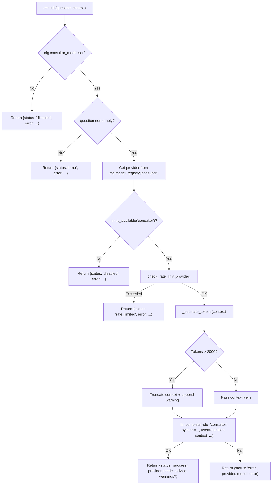

<- Back to [Consult Overview](../CONSULT.md)

# 🏗️ Architecture

## 🔗 Source Code Reference

| File | Purpose |
|------|---------|
| `tools/consult.py` | `@tool` facade: validation, rate-limit, context guard, LLM dispatch |
| `core/config.py` | `cfg.consultor_model`, `cfg.model_registry["consultor"]` — model + provider + timeout resolution |
| `core/llm.py` | `llm.complete()` and `llm.is_available()` — LLM dispatch and provider health |
| `core/llm_backend/rate_limit.py` | `check_rate_limit()` — pre-flight rate-limit guard |
| `tests/tools/consult/test_consult.py` | Single monolithic test covering all return paths |

---

## 🌳 Module Tree

```text
tools/consult.py
├── consult(question, context="")    # @tool facade — validation, rate-limit, context guard, LLM dispatch
├── _estimate_tokens(text)         # tiktoken cl100k_base fallback to char-count heuristic
└── _ADVISORY_SYSTEM_PROMPT          # Static system prompt for consultor role
```

---

## 🔀 Dispatch Flow



---

## 💡 Key Design Decisions

- **Optional by design** — The tool gracefully degrades to a clear `disabled` status if the consultor stack isn't configured. No crashes, no silent fallbacks to local models.
- **Separate model config** — Uses `consultor_model` via `cfg.model_registry["consultor"]`, completely isolated from local planner/executor/router chains. Provider resolution (base_url, api_key, timeout) is handled by the standard LLM backend.
- **Hard token ceiling** — `_MAX_CONTEXT_TOKENS = 2000` is a conservative hardcoded limit. Context exceeding this is truncated *before* the LLM call to prevent cloud quota waste and prompt injection via oversized inputs.
- **Rate-limit pre-flight** — `check_rate_limit()` gates the call before any network I/O. Prevents 429 loops and protects API budgets.
- **Single system prompt** — All consult queries share one advisory system prompt. No per-task prompt engineering in the facade; the caller shapes the question.

---

## 🧪 Testing

```powershell
# Run the single consult test
.\venv\Scripts\python tests/tools/consult/ -W error --tb=short -v
```

> **Note:** Ensure `pytest` resolves to your venv. If not, use `python -m pytest` or the full venv path (`venv\Scripts\pytest.exe` on Windows, `venv/bin/pytest` on Unix).

**Mock strategy:**
- Patch `core.config.cfg.consultor_model` to `""` to test kill-switch
- Patch `core.llm.llm.is_available` to `False` to test provider-unavailable path
- Patch `core.llm_backend.rate_limit.check_rate_limit` to `False` to test rate-limit path
- Patch `core.llm.llm.complete` to return a mock `Result` object for success paths
- Test context truncation with inputs > 2000 tokens (or mock `_estimate_tokens`)

**Current test layout:**
```text
tests/tools/consult/
└── test_consult.py          # Single monolithic test file (all paths in one)
```

> **Future:** When the tool is refactored to `@meta_tool` + un-multiplex, this will expand to `conftest.py` + per-action test files following the `tests/tools/browser/` pattern.

---

*Last updated: 2026-07-03. See [API.md](API.md) for action details, [CHANGELOG.md](CHANGELOG.md) for version history, [INSTRUCTIONS.md](INSTRUCTIONS.md) for AI editing rules.*
