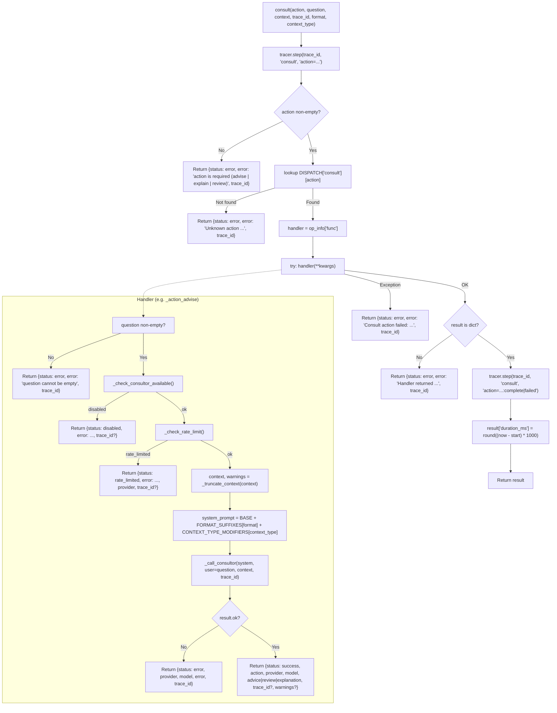

<- Back to [Consult Overview](../CONSULT.md)

# 🏗️ Architecture

## 🔗 Source Code Reference

| File | Purpose |
|------|---------|
| `tools/consult.py` | `@tool @meta_tool` facade — validates `action`, dispatches to handler via `DISPATCH`, wraps in `try/except`, threads `trace_id`, records `duration_ms` |
| `tools/consult_ops/__init__.py` | Auto-discovery: globs `actions/*.py` and imports each so `@register_action` runs before the facade reads `DISPATCH` |
| `tools/consult_ops/_registry.py` | `DISPATCH` dict + `register_action()` decorator. Duplicate registration raises `ValueError` loudly |
| `tools/consult_ops/helpers.py` | 6 pure helpers: `_estimate_tokens`, `_truncate_context`, `_check_consultor_available`, `_check_rate_limit`, `_get_consultor_provider`, **`_call_consultor`** |
| `tools/consult_ops/prompts.py` | 3 base system prompts + `FORMAT_SUFFIXES` + `CONTEXT_TYPE_MODIFIERS` dicts (suffix-based composition) |
| `tools/consult_ops/actions/__init__.py` | Empty — exists so `Path.glob("*.py")` sees the package as a directory |
| `tools/consult_ops/actions/advise.py` | `@register_action("consult", "advise")` — `ADVISE_SYSTEM_PROMPT`, returns `advice` key |
| `tools/consult_ops/actions/review.py` | `@register_action("consult", "review")` — `REVIEW_SYSTEM_PROMPT` (5-dimension structured findings), returns `review` key |
| `tools/consult_ops/actions/explain.py` | `@register_action("consult", "explain")` — `EXPLAIN_SYSTEM_PROMPT` (educator persona), returns `explanation` key |
| `tools/_meta_tool.py` | Generic `@meta_tool(DISPATCH, doc_sections=...)` decorator — generates the `action: Literal[...]` annotation + action list in the docstring from `DISPATCH` keys |
| `core/llm.py` | `llm.complete(role, system, user, context, trace_id)` — the only LLM entry point used by `_call_consultor` |
| `core/config.py` | `cfg.consultor_model`, `cfg.model_registry["consultor"]` — model + provider + timeout resolution |
| `core/llm_backend/rate_limit.py` | `check_rate_limit(provider)` — pre-flight rate-limit guard, wrapped by `_check_rate_limit()` |
| `core/tracer.py` | `tracer.step(trace_id, ...)` — called by the facade at entry, on failure, and on completion |
| `tests/tools/consult/conftest.py` | Shared fixtures: `mock_cfg`, `mock_llm`, `mock_budget`, `mock_tiktoken`, `MockTiktokenEncoder`, `make_mock_response()` |
| `tests/tools/consult/test_advise.py` | 20 tests — Success/Disabled/RateLimited/LLMError/ContextTruncation/TraceID/Format/ContextType classes |
| `tests/tools/consult/test_review.py` | 18 tests — same 8-class structure, adapted for `review` action |
| `tests/tools/consult/test_explain.py` | 18 tests — same 8-class structure, adapted for `explain` action |
| `tests/tools/consult/test_dispatch.py` | 11 tests — `TestDispatch` (facade behavior) + `TestRegistry` (DISPATCH shape + `@meta_tool` annotation generation) |
| `tests/tools/consult/test_helpers.py` | 25 tests — `_estimate_tokens` / `_truncate_context` / `_check_consultor_available` / `_check_rate_limit` / `_get_consultor_provider` / `_call_consultor` unit coverage |

> **8-file subpackage:** `consult_ops/` has exactly 8 files: `__init__.py`, `_registry.py`, `helpers.py`, `prompts.py`, and 4 files under `actions/` (`__init__.py` + `advise.py` + `review.py` + `explain.py`). The old 111-line `tools/consult.py` is now a 117-line facade — net implementation moved into the subpackage.

---

## 🌳 Module Tree

```text
tools/consult.py                        # @tool @meta_tool facade — dispatch + tracer + duration_ms
└── tools/consult_ops/
    ├── __init__.py                     # Auto-discovery: Path.glob("actions/*.py") → import_module
    ├── _registry.py
    │   ├── DISPATCH: Dict[str, Dict[str, Dict[str, Any]]]   # {"consult": {"advise": {func, help, examples}, ...}}
    │   └── register_action(tool_name, action_name, help_text, examples)  # decorator
    ├── helpers.py
    │   ├── _MAX_CONTEXT_TOKENS = 2000
    │   ├── _estimate_tokens(text)                          # tiktoken cl100k_base → char//4 fallback
    │   ├── _truncate_context(context, max_tokens)          # → (ctx, warnings)
    │   ├── _check_consultor_available()                    # → (ok, err_dict) status="disabled"
    │   ├── _check_rate_limit()                             # → (ok, err_dict) status="rate_limited"
    │   ├── _get_consultor_provider()                       # → str (centralizes cfg.model_registry access)
    │   └── _call_consultor(system, user, context, trace_id)  # → LLMResponse (centralizes llm.complete)
    ├── prompts.py
    │   ├── ADVISE_SYSTEM_PROMPT       # advisory persona
    │   ├── REVIEW_SYSTEM_PROMPT       # 5-dimension reviewer (correctness/security/perf/maintainability/best-practices)
    │   ├── EXPLAIN_SYSTEM_PROMPT      # educator persona (analogies + step-by-step)
    │   ├── FORMAT_SUFFIXES            # {"markdown": "", "json": ..., "bullet_points": ...}
    │   └── CONTEXT_TYPE_MODIFIERS     # {"code": ..., "logs": ..., "architecture": ...}
    └── actions/
        ├── __init__.py                # empty (auto-discovery contract docstring only)
        ├── advise.py                  # @register_action("consult", "advise") → _action_advise
        ├── review.py                  # @register_action("consult", "review") → _action_review
        └── explain.py                 # @register_action("consult", "explain") → _action_explain
```

---

## 🔀 Dispatch Flow



---

## 🧬 The `_call_consultor` Indirection (Why Patches Work)

**The pattern:** action handlers do **not** call `llm.complete()` directly. They call `helpers._call_consultor(system, user, context, trace_id)`, which in turn calls `llm.complete(role="consultor", ...)`.

**Why it exists:** Python's `from X import Y` creates a *local binding* at import time. If an action module did `from core.llm import llm` and then called `llm.complete(...)`, patching `core.llm.llm` (or `tools.consult_ops.helpers.llm`) at test time would have **no effect** — the action module already holds its own reference to the original `llm` object.

**Why the indirection fixes it:** `_call_consultor()` is defined in `helpers.py` and references `llm` via the *module namespace lookup*:

```python
# tools/consult_ops/helpers.py (simplified)
from core.llm import llm   # imported once, into helpers' namespace

def _call_consultor(system, user, context="", trace_id=""):
    return llm.complete(role="consultor", system=system, user=user,
                        context=context, trace_id=trace_id)
```

When the test fixture patches `tools.consult_ops.helpers.llm`, it replaces the `llm` attribute on the `helpers` module object. At call time, `_call_consultor` looks up `llm` via the module's `__dict__` — so it sees the patched mock. **This is the only patch point needed** to intercept every LLM call from every action handler.

**Same pattern applies to:** `_get_consultor_provider()` (centralizes `cfg.model_registry["consultor"]` access), `_check_consultor_available()` (centralizes the kill-switch + `llm.is_available` check), `_check_rate_limit()` (wraps `core.llm_backend.rate_limit.check_rate_limit`). All four cfg/llm/rate-limit interactions go through `helpers`, so `conftest.py` only needs 3 patches (`mock_cfg`, `mock_llm`, `mock_budget`) to control all four.

> **Lesson learned (recorded in INSTRUCTIONS.md):** the first test run had 43 failures because action handlers imported `llm` directly. Adding `_call_consultor` and refactoring handlers to use it dropped failures to 6 (all tiktoken-related), then to 0 after installing tiktoken in the smoke-test venv.

---

## 🎭 The 3-Action Pattern (Same LLM, Different Prompts)

All three action handlers share an **identical pre-flight and dispatch flow**. The only differences are:

| Aspect | `advise` | `review` | `explain` |
|--------|----------|----------|-----------|
| **Base system prompt** | `ADVISE_SYSTEM_PROMPT` (concise advisory persona) | `REVIEW_SYSTEM_PROMPT` (5-dimension reviewer with severity tags) | `EXPLAIN_SYSTEM_PROMPT` (educator with analogies + step-by-step) |
| **Response payload key** | `advice` | `review` | `explanation` |
| **Typical caller intent** | Architectural decision, deadlock breaker | Code critique with structured findings | Concept understanding, onboarding |
| **Recommended `context_type`** | `architecture` (often) | `code` (default-ish) | `""` or `code` |

**Shared flow (identical across handlers):**

1. **Validate `question`** — return `{"status": "error", "error": "The question parameter cannot be empty.", "trace_id": ...}` if blank.
2. **`_check_consultor_available()`** — return `status="disabled"` on kill-switch or provider-unavailable.
3. **`_check_rate_limit()`** — return `status="rate_limited"` on quota denial.
4. **`_truncate_context(context)`** — prune to ≤2000 tokens; collect `warnings` if truncated.
5. **Build `system_prompt`** — `BASE + FORMAT_SUFFIXES.get(format, "") + CONTEXT_TYPE_MODIFIERS.get(context_type, "")`. Unknown `format`/`context_type` values silently degrade to `""` (no suffix) — safe fallback.
6. **`_call_consultor(system, user=question, context, trace_id)`** — single LLM call to the consultor role.
7. **Check `result.ok`** — return `status="error"` with `provider`/`model`/`error` on LLM failure.
8. **Build response** — `{"status": "success", "action": <name>, "provider", "model", <action_key>: result.text}`; conditionally add `trace_id` (only if non-empty) and `warnings` (only if non-empty).

**Why three actions instead of one with a "mode" param:** the `@meta_tool` pattern treats each `action` value as a first-class entry in `DISPATCH` with its own handler function, help text, and examples. This gives the LLM calling `consult` a clear schema (`action: Literal["advise", "explain", "review"]`) and lets each handler evolve independently — e.g. `review` can later add a `severity_filter` param without touching `advise` or `explain`.

**Why all three share the same LLM call:** the consultor role is a single configured cloud model. Switching models per-action would require either three `*_MODEL` env vars (config sprawl) or a routing layer inside consult (defeats the "atomic action" principle). Same call, different prompt = cleanest decomposition.

---

## 💡 Key Design Decisions

- **Optional by design** — The tool gracefully degrades to a clear `disabled` status if the consultor stack isn't configured. No crashes, no silent fallbacks to local models.
- **Separate model config** — Uses `consultor_model` via `cfg.model_registry["consultor"]`, completely isolated from local planner/executor/router chains. Provider resolution (base_url, api_key, timeout) is handled by the standard LLM backend.
- **Hard token ceiling** — `_MAX_CONTEXT_TOKENS = 2000` is a conservative hardcoded limit. Context exceeding this is truncated *before* the LLM call to prevent cloud quota waste and prompt injection via oversized inputs.
- **Rate-limit pre-flight** — `_check_rate_limit()` gates the call before any network I/O. Prevents 429 loops and protects API budgets.
- **Three actions, one LLM** — `advise`/`review`/`explain` share the consultor role and dispatch path. Only the system prompt differs (base + format suffix + context-type modifier). See [The 3-Action Pattern](#-the-3-action-pattern-same-llm-different-prompts) above.
- **Prompt composition via suffixes** — Format and context-type are *orthogonal* dimensions appended to the base prompt. 3 base prompts × 3 formats × 4 context-types = 36 effective variations from 10 strings (3 + 3 + 4). Avoids the N×M prompt matrix explosion.
- **`_call_consultor` indirection** — Action handlers never reference `llm` directly. See [The `_call_consultor` Indirection](#-the-_call_consultor-indirection-why-patches-work) above. Single patch point for tests; clean separation of "what to ask" (handlers) from "how to ask" (helpers).
- **`@meta_tool` auto-discovery** — Adding a new action = drop a file in `consult_ops/actions/` with `@register_action("consult", "<name>", ...)`. The facade's `action: Literal[...]` annotation and docstring action list are regenerated from `DISPATCH` automatically. No edits to `consult.py` needed.
- **`duration_ms` always present** — The facade records start time, calls the handler, then unconditionally sets `result["duration_ms"]`. Even error returns carry the timing — useful for SLO debugging without separate instrumentation.
- **`trace_id` conditional inclusion** — Added to the response only when the caller passed a non-empty `trace_id`. Keeps the response shape clean for ad-hoc `consult(action="advise", question="...")` calls while still threading observability when called from a workflow.

---

## 🧪 Testing

```powershell
# Run all consult tests (92 tests across 6 files)
.\venv\Scripts\pytest tests/tools/consult/ -W error --tb=short -v
```

> **Note:** Ensure `pytest` resolves to your venv. If not, use `python -m pytest` or the full venv path (`venv\Scripts\pytest.exe` on Windows, `venv/bin/pytest` on Unix). `tiktoken` must be installed (`pip install tiktoken`) — without it, 6 tests in `test_helpers.py` skip the tiktoken path and fall through to the char-count heuristic.

**Mock strategy (single patch surface in `helpers`):**
- Patch `tools.consult_ops.helpers.cfg` (via `mock_cfg`) → controls `consultor_model`, `model_registry["consultor"]`
- Patch `tools.consult_ops.helpers.llm` (via `mock_llm`) → controls `llm.is_available()` + `llm.complete()` return values
- Patch `tools.consult_ops.helpers.check_rate_limit` (via `mock_budget`) → controls rate-limit pre-flight
- Patch `tiktoken.get_encoding` (via `mock_tiktoken`) → controls deterministic token counting in truncation tests
- `MockTiktokenEncoder` returns 1 token per character so truncation boundaries are predictable

**Test layout:**
```text
tests/tools/consult/
├── conftest.py            # Shared fixtures (mock_cfg, mock_llm, mock_budget, mock_tiktoken, make_mock_response)
├── test_advise.py         # 20 tests — 8 scenario classes (Success/Disabled/RateLimited/LLMError/ContextTruncation/TraceID/Format/ContextType)
├── test_review.py         # 18 tests — same 8-class structure for review action
├── test_explain.py        # 18 tests — same 8-class structure for explain action
├── test_dispatch.py       # 11 tests — TestDispatch (facade) + TestRegistry (DISPATCH shape + Literal generation)
└── test_helpers.py        # 25 tests — unit tests for all 6 helpers
```

**Total: 92 tests.** Replaces the old single-file `test_consult.py` (8 tests).

**What each scenario class verifies (consistent across `test_advise` / `test_review` / `test_explain`):**
- `Success` — happy path: returns `status=success`, correct payload key (`advice`/`review`/`explanation`), `provider` + `model` present
- `Disabled` — `cfg.consultor_model = ""` → `status=disabled`
- `RateLimited` — `check_rate_limit → False` → `status=rate_limited`
- `LLMError` — `result.ok = False` → `status=error` with `provider`/`model`/`error`
- `ContextTruncation` — oversized context triggers `warnings` list
- `TraceID` — `trace_id` threaded through success and all error paths
- `Format` — `markdown`/`json`/`bullet_points` suffixes appended to system prompt
- `ContextType` — `code`/`logs`/`architecture` modifiers appended; unknown values silently ignored

---

*Last updated: 2026-07-15 (v1.0). See [API.md](API.md) for action details, [CHANGELOG.md](CHANGELOG.md) for version history, [INSTRUCTIONS.md](INSTRUCTIONS.md) for AI editing rules.*
