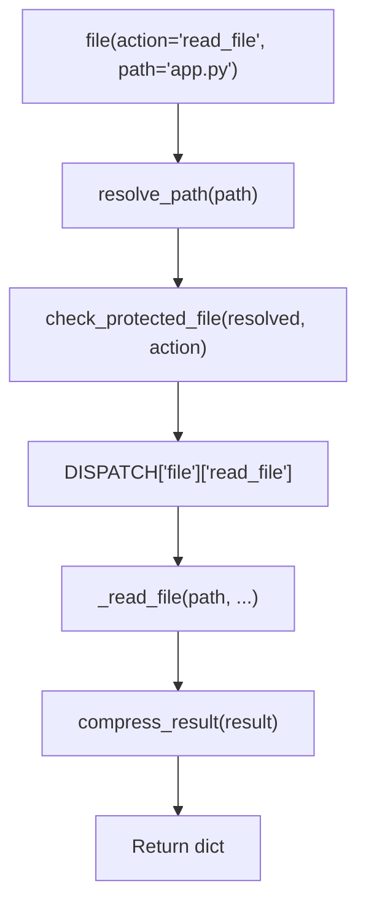

<- Back to [File Overview](../FILE.md)

# 🏗️ Architecture

## 🔗 Source Code Reference

| File | Purpose |
|------|---------|
| `tools/file.py` | `@tool` facade: validation, dispatch, compression (v1.2: chunk params) |
| `tools/_meta_tool.py` | `@meta_tool` decorator: auto `Literal`, docstring |
| `tools/file_ops/_registry.py` | `DISPATCH` dict, `@register_action` decorator |
| `tools/file_ops/helpers.py` | `_safe_resolve`, `_allowed_roots` |
| `tools/file_ops/index.py` | SQLite FTS index for `search_files` |
| `tools/file_ops/actions/*.py` | Individual atomic action handlers (v1.2: 27 actions) |
| `tools/file_ops/actions/read_file.py` | v1.2: encoding fallback chain + `_chunk_text()` helper (shared with read_multiple_files) |
| `tools/file_ops/actions/count_lines.py` | v1.2 NEW: wc -l equivalent, 64KB binary chunk reads |
| `registry.py` | `get_tool_names()`, `get_tool_actions()` for router introspection |
| `tests/tools/file/` | 26 test files covering all actions (v1.2: +3 new) |
| `tests/tools/file/conftest.py` | Test fixtures: `mock_cfg` (autouse) |
| `core/path_guard.py` | Centralized path validation and security guards (v1.2: `count_lines` in READ_OPERATIONS) |
| `tests/core/path_guard/` | Path guard unit tests |

---

## 🌳 Module Tree

```text
tools/file.py                    # @tool facade — validation, dispatch, compression
tools/_meta_tool.py              # @meta_tool decorator — auto Literal + docstring
tools/file_ops/
├── _registry.py                 # DISPATCH dict + @register_action decorator
├── helpers.py                   # Thin wrapper around core.path_guard (v1.1)
│                                #   DO NOT implement custom path resolution here.
│                                #   See INTEGRATION GUIDE in core/path_guard.py
├── index.py                     # SQLite FTS index for search_files
└── actions/
    ├── read_file.py             # Read text file (head/tail/max_chars)
    ├── write_file.py            # Write text file
    ├── list_directory.py        # List directory contents
    ├── create_directory.py      # Create directory (mkdir -p)
    ├── directory_tree.py        # Recursive tree view
    ├── move_file.py             # Move/rename file or directory
    ├── copy_file.py             # Copy file or directory
    ├── delete_file.py           # Delete file or directory (force required)
    ├── get_file_info.py         # File metadata (stat)
    ├── exists.py                # Check if path exists
    ├── patch_file.py            # Single str_replace patch
    ├── edit_file.py             # MCP-style multi-edit with diff
    ├── append_file.py           # Append content without reading full file
    ├── search_files.py          # Full-text search (SQLite FTS)
    ├── find_files.py            # Glob pattern matching
    ├── read_multiple_files.py   # Concurrent multi-file read (v1.2: chunking + encoding fallback)
    ├── read_media_file.py       # Binary file → base64 + MIME type
    ├── read_pdf.py              # Extract text from PDF
    ├── write_pdf.py             # Write text to PDF
    ├── read_docx.py             # Read Word document
    ├── write_docx.py            # Write Word document
    ├── read_xlsx.py             # Read Excel spreadsheet
    ├── write_xlsx.py            # Write Excel spreadsheet
    ├── read_pptx.py             # Read PowerPoint
    ├── write_pptx.py            # Write PowerPoint
    └── count_lines.py           # v1.2 — wc -l equivalent, 64KB binary chunk reads
```

---

## 🔀 Dispatch Flow



---

## 💡 Key Design Decisions

- **Unified DISPATCH** — Single dict holds all actions, handlers, help text, examples. `@meta_tool` reads it to generate schema and docstring. One source. Zero drift.
- **Action name consistency** — `core/path_guard.py` maintains `READ_OPERATIONS` and `WRITE_OPERATIONS` sets. When renaming actions (e.g., `write` → `write_file`), these sets MUST be updated or protected file checks will silently fail. **v1.1 added `move_file`, `copy_file`, `create_directory` to `WRITE_OPERATIONS`. v1.2 added `count_lines` to `READ_OPERATIONS`.**
- **Atomic actions** — No `message` subcommand parsing. `create_directory` is one action, `delete_file` is another.
- **Semantic parameters** — `path` = file path, `source`/`destination` = move/copy paths, `query` = search text, `edits` = edit array.
- **Path validation in facade** — `resolve_path` + `check_protected_file` runs once before dispatch. No duplication across 27+ handlers. **v1.1 fix: destination paths are checked for protection even if they don't exist yet.**
- **Cancellation guard** — `ensure_not_cancelled(trace_id)` aborts before any file mutations. Catches `BaseException` (not just `Exception`) to handle `asyncio.CancelledError`.
- **Destructive actions require force** — `delete_file`, `move_file`, `copy_file` need explicit `force=True`.
- **Path Guard Integration (v1.1)** — Every file action MUST flow through `core/path_guard.py`. This is the canonical example for future tool refactors.
- **Encoding fallback chain (v1.2)** — `read_file` and `read_multiple_files` try UTF-8 (strict) first, then cp1252 (strict), then latin-1 (which never raises). The encoding that succeeded is reported in the result `encoding` field. This replaces the v1.0/v1.1 behavior of `errors="replace"` (which silently corrupted non-UTF-8 bytes to U+FFFD).
- **Chunking via chonkie (v1.2)** — When `chunk=True`, `read_file` and `read_multiple_files` return a `chunks` list instead of `content`. Token and sentence chunkers are supported. `chonkie` is a **soft dependency** — imported lazily inside the chunking branch only. If missing, the action returns a clear `pip install chonkie` error; non-chunk reads and all other file actions work fine without it.
- **Chunking is mutually exclusive with head/tail/max_chars (v1.2)** — When `chunk=True`, the line/char truncation params are ignored entirely. The result shape changes (no `content`, no `truncated`, instead `chunks`/`chunk_count`/`chunk_method`/`chunk_size`). Callers must pick one mode per call.
- **Streaming reads for line counting (v1.2)** — `count_lines` reads the file in 64KB binary blocks and counts `0x0A` bytes (matches `wc -l` semantics). O(1) memory, O(n) time, encoding-independent (binary mode). Works on files larger than `read_file`'s 10MB ceiling.

  ```python
  # Facade (tools/file.py)
  from core.path_guard import resolve_path, check_protected_file, make_path_error

  resolved, err = resolve_path(path, default_root="agent")
  if not resolved:
      return make_path_error(path, action, err, trace_id)
  allowed, err = check_protected_file(resolved, action)
  if not allowed:
      return make_path_error(path, action, err, trace_id)

  # Helpers (tools/file_ops/helpers.py) — thin wrapper, NO custom logic
  from core.path_guard import resolve_path

  def _safe_resolve(path_str, require_exists=False):
      resolved, err = resolve_path(path_str, default_root="agent", require_exists=require_exists)
      return resolved, err

  # Handlers (tools/file_ops/actions/*.py) — trust paths, do business logic
  from tools.file_ops.helpers import _safe_resolve

  def _handle_write_file(path="", content="", **kwargs):
      p, err = _safe_resolve(path)
      if err:
          return {"status": "error", "error": err}
      # ... write logic, no path re-validation
  ```

  **Anti-pattern (old file_ops, fixed in v1.1):**
  ```python
  # BAD — helpers.py reimplemented path resolution
  from core.config import cfg  # bypassed path_guard entirely

  def _resolve(path_str):
      for root in _allowed_roots():  # custom logic, diverged from path_guard
          ...
  ```
- **`@meta_tool` Decorator** — See `docs/tools/GIT.md` for full `@meta_tool` documentation. The same decorator is used for `file()`, `git()`, and future meta-tools.

---

## 🧪 Testing

```powershell
# Run all file tests
.\venv\Scripts\python tests/tools/file/ -W error --tb=short -v
```

> **Note:** Ensure `pytest` resolves to your venv. If not, use `python -m pytest` or the full venv path (`venv\Scripts\pytest.exe` on Windows, `venv/bin/pytest` on Unix).

**Test coverage (26 files):**

| File | Tests | Coverage |
|------|-------|----------|
| `conftest.py` | — | `mock_cfg` (autouse, redirects roots to `tmp_path`) |
| `test_file_dispatch.py` | — | Unknown action, basic dispatch |
| `test_file_read_file.py` | — | read_file action |
| `test_read_file_chunking.py` | v1.2 | Encoding fallback (UTF-8→cp1252→latin-1), token + sentence chunking, chunk interplay, read_multiple_files chunking |
| `test_count_lines.py` | v1.2 | wc -l semantics, encoding independence (binary mode), 64KB boundary, large file streaming, error paths |
| `test_read_file_line_count.py` | v1.2 | `lines` field correctness (trailing newline, no trailing newline, head/tail/max_chars paths, read_multiple_files) |
| `test_file_write_file.py` | — | write_file action |
| `test_file_list_directory.py` | — | list_directory action |
| `test_file_create_directory.py` | — | create_directory action |
| `test_file_directory_tree.py` | — | directory_tree action |
| `test_file_move_file.py` | — | move_file action |
| `test_file_copy_file.py` | — | copy_file action |
| `test_file_delete_file.py` | — | delete_file action |
| `test_file_get_file_info.py` | — | get_file_info action |
| `test_file_exists.py` | — | exists action |
| `test_file_patch_file.py` | — | patch_file action |
| `test_file_edit_file.py` | — | edit_file action |
| `test_file_append_file.py` | — | append_file action |
| `test_file_search_files.py` | — | search_files action |
| `test_file_find_files.py` | — | find_files action |
| `test_file_read_multiple_files.py` | — | read_multiple_files action |
| `test_file_read_media_file.py` | — | read_media_file action |
| `test_file_protected.py` | — | Protected file enforcement |
| `test_file_cancellation.py` | — | Cancellation guard |
| `test_file_compression.py` | — | Result compression |
| `test_file_real_integration.py` | — | Full lifecycle test |

**Mock strategy:**
- Tests are **fully isolated** — real file operations in `tmp_path`, no mocking
- **Conftest mocking** — Must patch `core.config.cfg`, `core.path_guard.cfg`, AND `tools.file_ops.helpers.cfg` because each module imported `cfg` at import time, creating separate name bindings. Also patch `tools.file.resolve_path` and `tools.file.check_protected_file` because the facade imports them at module level.

---

*Last updated: 2026-07-08. See [API.md](API.md) for action details, [CHANGELOG.md](CHANGELOG.md) for version history, [INSTRUCTIONS.md](INSTRUCTIONS.md) for AI editing rules.*
