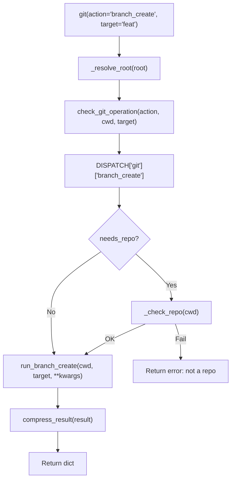

<- Back to [Git Overview](../GIT.md)

# 🏗️ Architecture

## 🔗 Source Code Reference

| File | Purpose |
|------|---------|
| `tools/git.py` | `@tool` facade: validation, dispatch, compression, cancellation guard |
| `tools/_meta_tool.py` | `@meta_tool` decorator: auto `Literal`, docstring, metadata |
| `tools/git_ops/_registry.py` | `DISPATCH` dict, `@register_action` decorator |
| `tools/git_ops/helpers.py` | `_git` runner, `_resolve_root`, `_check_repo` |
| `tools/git_ops/actions/*.py` | Individual atomic action handlers |
| `registry.py` | `get_tool_names()`, `get_tool_actions()` for router introspection |
| `tests/tools/git/` | Test files covering all actions |
| `tests/tools/git/conftest.py` | Test fixtures: `mock_cfg` (autouse), `git_repo` |
| `tests/tools/test_meta_tool.py` | `@meta_tool` decorator unit tests |
| `workflows/autocode_impl/git_ops.py` | Autocode workflow helpers: `_git_snapshot`, `_git_commit`, `_git_create_branch` |

---

## 🌳 Module Tree

```text
tools/git.py                     # @tool facade — validation, dispatch, compression
tools/_meta_tool.py              # @meta_tool decorator — auto Literal + docstring
tools/git_ops/
├── _registry.py                 # DISPATCH dict + @register_action decorator
├── helpers.py                   # Git executable detection, subprocess runner, repo resolution
└── actions/
    ├── init.py                  # Initialise new repo
    ├── clone.py                 # Clone remote repo (v1.1 — WORKSPACE_ROOT only)
    ├── status.py                # Working tree status
    ├── log.py                   # Commit history
    ├── diff.py                  # Unstaged diff
    ├── add.py                   # Stage files
    ├── commit.py                # Create commit
    ├── snapshot.py              # Safe checkpoint commit
    ├── restore.py               # Restore file to HEAD
    ├── rollback.py              # Reset to HEAD (with stash)
    ├── show.py                  # Show commit/tag details
    ├── branch_list.py           # List branches
    ├── branch_create.py         # Create branch
    ├── branch_delete.py         # Delete branch
    ├── checkout_branch.py       # Switch to existing branch
    ├── checkout_new.py          # Create and switch to new branch
    ├── tag_list.py              # List tags
    ├── tag_create.py            # Create tag
    └── tag_delete.py            # Delete tag
```

---

## 🔀 Dispatch Flow



---

## 💡 Key Design Decisions

- **Unified DISPATCH** — Single dict holds all actions, handlers, repo validation, help text, examples. `@meta_tool` reads it to generate schema and docstring. One source. Zero drift.
- **Atomic actions** — No `message` subcommand parsing. `branch_create` is one action, `branch_delete` is another. The LLM never needs to learn a mini-DSL.
- **Semantic parameters** — `target` = branch name, tag name, commit hash. `message` = commit message, snapshot note. `path` = file path. No overloaded parameters.
- **Needs repo validation** — Dispatcher checks `_check_repo()` before write actions. Read-only actions skip this (git handles non-repo errors gracefully).
- **Backward-compat alias** — `path` parameter can override `root="workspace"` with an absolute directory path (legacy behavior preserved).
- **Cancellation guard** — `ensure_not_cancelled(trace_id)` aborts before any git mutations.
- **Path Guard Integration** — Git operations use `core.path_guard` via `check_git_operation()` for scoping rules. All git operations must be within `AGENT_ROOT`. `init` and `clone` must be within `WORKSPACE_ROOT`. `clone` target directory must be within `WORKSPACE_ROOT`.
- **v1.1 fix:** `check_git_operation()` no longer silently falls back from `require_exists=True` to `False`. A non-existent `cwd` now fails fast with a clear error.
- **v1.1:** `clone` target is a remote URL, not a filesystem path. The handler validates the derived local directory path.
- **Parameter Absorption (`**kwargs`)** — The dispatcher passes all kwargs to every handler. Handlers absorb unused params via `**kwargs`. This means LLM typos are silently ignored rather than raising errors. The LLM sees all params as optional for all actions, which can cause confusion. **Why:** Prevents the agent from crashing on minor hallucinations. Keeps dispatcher simple. **v2 plan:** Per-action parameter filtering using `inspect.signature(handler).parameters`.
- **Signature Cache Busting (`del fn.__signature__`)** — `@meta_tool` deletes `fn.__signature__` to force `inspect` to re-evaluate the mutated `Literal` annotations. This is necessary because `inspect.signature()` caches results per-function-object. **Do not remove this line.**
- **`@meta_tool` Decorator** — See `docs/tools/GIT.md` for full `@meta_tool` documentation. The same decorator is used for `file()`, `git()`, and future meta-tools. `eval()` is safe because we only eval strings constructed from validated DISPATCH keys (`^[a-z][a-z0-9_]*$`). The eval namespace is restricted: `{"Literal": Literal, "__builtins__": {}}`. The expression is structurally a type construction (`Literal["a", "b"]`), not executable code. `@meta_tool` must be INNER (closest to function). `@tool` must be OUTER. If a future decorator uses `functools.wraps` (creating a wrapper callable), `@meta_tool` must run BEFORE that wrapper is created.

---

## 🧪 Testing

```powershell
# Run all git tests (real git repos, no mocking)
.\venv\Scripts\python tests/tools/git/ -W error --tb=short -v
```

> **Note:** Ensure `pytest` resolves to your venv. If not, use `python -m pytest` or the full venv path (`venv\Scripts\pytest.exe` on Windows, `venv/bin/pytest` on Unix).

**Test coverage (mirrors source):**

| File | Tests | Coverage |
|------|-------|----------|
| `conftest.py` | — | `mock_cfg` (autouse, redirects roots to `tmp_path`), `git_repo` fixture |
| `test_git_branch_list.py` | — | branch_list action |
| `test_git_branch_create.py` | — | branch_create action |
| `test_git_branch_delete.py` | — | branch_delete action |
| `test_git_tag_list.py` | — | tag_list action |
| `test_git_tag_create.py` | — | tag_create action |
| `test_git_tag_delete.py` | — | tag_delete action |
| `test_git_checkout_branch.py` | — | checkout_branch action |
| `test_git_checkout_new.py` | — | checkout_new action |
| `test_git_show.py` | — | show action (target param) |
| `test_git_add.py` | — | add action |
| `test_git_dispatch.py` | — | Unknown action, basic dispatch |
| `test_git_compression.py` | — | Result compression |
| `test_git_real_integration.py` | — | Full lifecycle test |
| `test_git_scoping.py` | — | Workflow node routing (workflows/) |
| `test_git_clone.py` | — | v1.1 — clone action tests |

**Mock strategy:**
- `core.config.cfg` patched at module level in `conftest.py`
- `core.path_guard.resolve_path` bypassed with permissive version
- Real `git` commands run in `tmp_path` repos
- Tests are **fully isolated** — real git operations, no subprocess mocking, no shared state

---

*Last updated: 2026-07-03. See [API.md](API.md) for action details, [CHANGELOG.md](CHANGELOG.md) for version history, [INSTRUCTIONS.md](INSTRUCTIONS.md) for AI editing rules.*
