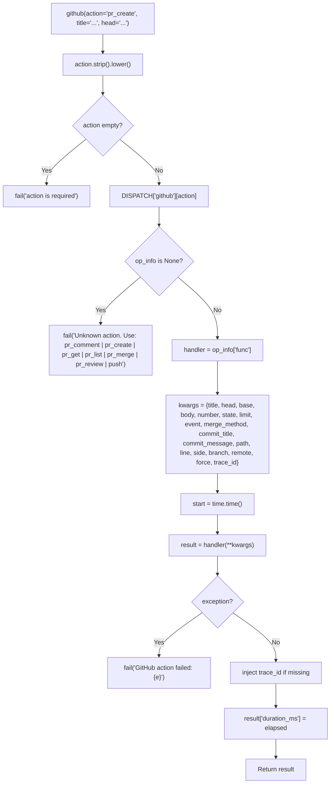
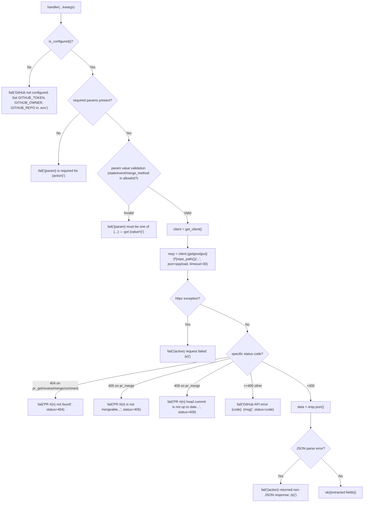
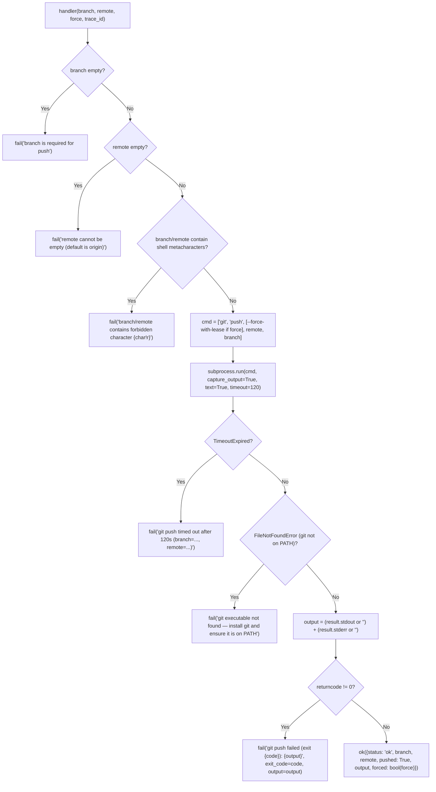

<- Back to [GitHub Overview](../GITHUB.md)

# 🏗️ Architecture

## 🔗 Source Code Reference

| File | Purpose |
|------|---------|
| `tools/github.py` | `@tool` facade: action dispatch, kwargs forwarding, exception capture, `duration_ms` timing, `trace_id` injection, `_NOT_PARALLEL_SAFE = frozenset({"push"})`. v1.2 facade params: 23 total (added `page` in v1.2; `state` default changed to `""`) |
| `tools/_meta_tool.py` | `@meta_tool` decorator: docstring `doc_sections` + metadata. (github uses `action: str` — no `Literal` enum generated) |
| `tools/github_ops/__init__.py` | Auto-imports every `actions/*.py` module to trigger `@register_action` side effects |
| `tools/github_ops/_registry.py` | `DISPATCH` dict + `@register_action` decorator (duplicate-action detection) |
| `tools/github_ops/client.py` | GitHub API singleton httpx.Client (`get_client()`, `close_client()`, `is_configured()`, `repo_path()`, `GITHUB_API_BASE`, `parse_link_header()`). v1.2 added `parse_link_header()` for `Link` header pagination parsing |
| `tools/github_ops/actions/pr_create.py` | POST `/repos/{owner}/{repo}/pulls` — open a new PR |
| `tools/github_ops/actions/pr_list.py` | GET `/repos/{owner}/{repo}/pulls?state=...&per_page=...&page=...` — list PRs (paginated; uses `parse_link_header`) |
| `tools/github_ops/actions/pr_get.py` | GET `/repos/{owner}/{repo}/pulls/{number}` — single PR details (incl. `mergeable` + `mergeable_state` in v1.2) |
| `tools/github_ops/actions/pr_review.py` | POST `/repos/{owner}/{repo}/pulls/{number}/reviews` — APPROVE / REQUEST_CHANGES / COMMENT |
| `tools/github_ops/actions/pr_merge.py` | PUT `/repos/{owner}/{repo}/pulls/{number}/merge` — squash / merge / rebase |
| `tools/github_ops/actions/pr_comment.py` | POST `/issues/{number}/comments` (general) OR `/pulls/{number}/comments` (line-level) — dual-mode |
| `tools/github_ops/actions/push.py` | Local `git push` subprocess (NOT an API call) — `--force-with-lease` when `force=True` |
| `tools/github_ops/actions/issue_create.py` | POST `/repos/{owner}/{repo}/issues` — open a new issue (v1.1) |
| `tools/github_ops/actions/issue_list.py` | GET `/repos/{owner}/{repo}/issues?state=...&labels=...&page=...` — list issues (paginated; uses `parse_link_header`; v1.1 + v1.2 pagination) |
| `tools/github_ops/actions/issue_get.py` | GET `/repos/{owner}/{repo}/issues/{number}` — single issue details (v1.2) |
| `tools/github_ops/actions/issue_update.py` | PATCH `/repos/{owner}/{repo}/issues/{number}` — unified close/reopen/edit (v1.2) |
| `tools/github_ops/actions/issue_comment.py` | POST `/repos/{owner}/{repo}/issues/{number}/comments` — comment on issue or PR (v1.1) |
| `tools/github_ops/actions/release_create.py` | POST `/repos/{owner}/{repo}/releases` — create a release from a tag (v1.1) |
| `tools/github_ops/actions/release_list.py` | GET `/repos/{owner}/{repo}/releases` — list releases (v1.1) |
| `tools/github_ops/actions/release_get.py` | GET `/repos/{owner}/{repo}/releases/tags/{tag}` (by tag) OR `/releases/{id}` (by ID) — single release details (v1.2) |
| `core/config.py` | `cfg.github_token`, `cfg.github_owner`, `cfg.github_repo` — read by `is_configured()` and `repo_path()` |
| `core/contracts.py` | `ok()` / `fail()` — standardized return shape |
| `core/tracer.py` | `tracer` — observability (imported by facade) |
| `registry.py` | `@tool` decorator — auto-discovery of `github()` into MCP |
| `core/parallel_executor.py` | `PARALLEL_SAFE` frozenset — `push` is excluded (subprocess); 14 API actions are safe to parallelize |

> **Note:** Unlike `git_ops/`, `web_ops/`, `tavily_ops/`, `memory_ops/`, the `github_ops/` subpackage has **no `helpers.py`** file. Each action handler is self-contained — there's no shared utility beyond `client.py` (the httpx singleton + config check + v1.2 `parse_link_header()`). The dual-mode logic in `pr_comment.py` and the per-action validation logic are kept inline in each handler for clarity. If shared helpers accumulate later (e.g. rate-limit tracking), a `helpers.py` can be added without breaking the existing pattern.

---

## 🌳 Module Tree

```text
tools/github.py                       # @tool facade — action dispatch, timing, error capture
                                     # v1.2: 23 params (added page; state default "")
tools/_meta_tool.py                   # @meta_tool decorator — docstring + metadata (no Literal for github)
tools/github_ops/
├── __init__.py                       # Auto-imports all actions/*.py to trigger @register_action
├── _registry.py                      # DISPATCH dict + @register_action decorator
├── client.py                         # httpx.Client singleton: get_client, close_client,
│                                     # is_configured, repo_path, GITHUB_API_BASE,
│                                     # parse_link_header (v1.2 — Link-header pagination)
└── actions/
    ├── __init__.py                   # (empty — package marker)
    ├── pr_create.py                  # POST /pulls — open a new PR (title, head required)
    ├── pr_list.py                    # GET /pulls — list PRs (state, limit, page optional)
    │                                 # Uses parse_link_header for has_next/next_page
    ├── pr_get.py                     # GET /pulls/{n} — single PR details
    │                                 # v1.2: surfaces mergeable + mergeable_state
    ├── pr_review.py                  # POST /pulls/{n}/reviews — APPROVE / REQUEST_CHANGES / COMMENT
    ├── pr_merge.py                   # PUT /pulls/{n}/merge — squash / merge / rebase (default: squash)
    ├── pr_comment.py                 # Dual-mode: general (/issues/{n}/comments) OR
    │                                 # line-level (/pulls/{n}/comments)
    ├── issue_create.py               # POST /issues — open a new issue (v1.1)
    ├── issue_list.py                 # GET /issues — list issues (paginated; v1.1 + v1.2)
    ├── issue_get.py                  # GET /issues/{n} — single issue details (v1.2)
    ├── issue_update.py               # PATCH /issues/{n} — unified close/reopen/edit (v1.2)
    ├── issue_comment.py              # POST /issues/{n}/comments — comment on issue/PR (v1.1)
    ├── release_create.py             # POST /releases — create a release from a tag (v1.1)
    ├── release_list.py               # GET /releases — list releases (v1.1)
    ├── release_get.py                # GET /releases/tags/{tag} OR /releases/{id} — (v1.2)
    └── push.py                       # Local `git push` subprocess (--force-with-lease when force=True)
                                      # NOT an API call — does NOT require GITHUB_TOKEN
```

---

## 🔀 Dispatch Flow

### Facade dispatch (all 15 actions)



### API action handler flow (pr_create / pr_list / pr_get / pr_review / pr_merge / pr_comment / issue_create / issue_list / issue_get / issue_update / issue_comment / release_create / release_list / release_get)



### `push` action flow (subprocess, NOT API)



---

## 💡 Key Design Decisions

### 1. `httpx` direct (NOT PyGithub)

The github tool uses `httpx.Client` directly to call the GitHub REST API. **Why not PyGithub:** (a) PyGithub is a heavy dependency (~1MB pure Python, but adds transitive deps); (b) PyGithub's abstraction layer hides the raw HTTP request shape, making error handling and debugging harder; (c) all other HTTP-based tools in the project (`web`, `tavily`, swarm provider calls) use `httpx` directly — consistency wins; (d) the GitHub REST API is well-documented and stable, the abstraction layer doesn't add much value; (e) `httpx.Client` supports connection pooling via a singleton, which PyGithub doesn't expose cleanly.

**Implication:** Every API action manually constructs the URL (`f"{repo_path()}/pulls"` etc.), parses the JSON response, and extracts fields. This is more verbose than PyGithub's `repo.create_pull(...)` but is also more transparent — the URL, payload, and response shape are all visible in the action source code.

### 2. `push` lives in `github_ops/` (NOT `git_ops/`)

The `push` action spawns a local `git push` subprocess. Conceptually, it could live in `git_ops/` alongside `commit`, `add`, `status`, etc. It was placed in `github_ops/` instead. **Why:** Pushing a local branch to `origin` is the **prerequisite** for the entire PR workflow — push → open PR → review → merge. Grouping it with the other PR actions makes the workflow discoverable: every step from local commit to merged PR is reachable via `github(action=...)`. The `git_ops` tool remains focused on **local repo inspection and mutation** (`status`, `diff`, `log`, `branch_create`, `commit`, `restore`, `rollback`, `clone`). The split is: `git = local VCS, github = remote PR workflow`.

**Implication:** When you need to push a branch, use `github(action="push", branch="...")`, NOT `git(action="push", ...)`. There is no `push` action in the `git` tool — and there shouldn't be (see INSTRUCTIONS.md → NEVER DO rule).

### 3. `PARALLEL_SAFE` for API actions, NOT for `push`

The 6 API actions are stateless HTTPS calls to `https://api.github.com` — they're safe to parallelize in `parallel(tools=[...])`. The `push` action spawns a `git push` subprocess; concurrent pushes to the same branch will fail with lock contention. The facade declares `_NOT_PARALLEL_SAFE = frozenset({"push"})` and `push` is excluded from `PARALLEL_SAFE` in `core/parallel_executor.py`. **Why:** Subprocesses hold git index locks; two simultaneous `git push` operations on the same repo race on `.git/index.lock`. API actions don't have this problem — each is an independent HTTP request.

**Implication:** You can safely do `parallel(tools=[github(pr_get, number=42), github(pr_get, number=43)])`. You CANNOT safely do `parallel(tools=[github(push, branch="x"), github(push, branch="y")])` — the second will likely fail.

### 4. `--force-with-lease` (NOT `--force`)

When `force=True`, `push` uses `git push --force-with-lease`, NOT `git push --force`. **Why:** `--force-with-lease` checks the remote ref against the local tracking ref before overwriting. If the remote has been updated since your last fetch (e.g. a teammate pushed in the meantime), the push is rejected. `--force` would silently overwrite, destroying the teammate's commits. The lease check makes force-push safe by default — you have to explicitly fetch + force-with-lease to overwrite, which is the correct mental model. Use `force=True` only when you intend to rewrite remote branch history (e.g. after a rebase).

### 5. `is_configured()` short-circuits on first empty value

`is_configured()` returns `bool(cfg.github_token and cfg.github_owner and cfg.github_repo)`. **Why short-circuit:** It's a pre-flight check — if any of the three is missing, the API call would fail with a 401/404 anyway. Failing fast with a clear "GitHub not configured. Set GITHUB_TOKEN, GITHUB_OWNER, GITHUB_REPO in .env" message is much friendlier than a confusing GitHub API error. **Implication:** Tests can set just `github_token = ""` (via the `mock_not_configured` fixture) to trigger the not-configured path — they don't need to clear all three.

### 6. Singleton `httpx.Client` with `is_closed` check

`get_client()` lazily builds a single `httpx.Client` and reuses it across all API actions. The `if _client is None or _client.is_closed` check handles the edge case where the client was closed (e.g. via `close_client()`) and needs to be rebuilt. **Why a singleton:** Connection pooling — reusing TCP/TLS connections across API calls reduces latency (no handshake on every call). `httpx.Client` is thread-safe for concurrent reads. **Implication:** Tests need to patch `get_client` at the **action module level** (not at `tools.github_ops.client.get_client`) because each action module imports `get_client` by name at module load time — patching the source attribute after import doesn't intercept the local reference. See `tests/tools/github/conftest.py` for the multi-module patch strategy.

### 7. `pr_comment` dual-mode (XOR validation on `path` / `line`)

`pr_comment` is the only action with two distinct API endpoints: `/issues/{number}/comments` for general comments and `/pulls/{number}/comments` for line-level comments. The mode is selected by whether `path` AND `line` are BOTH provided. **Why XOR validation:** Providing `path` without `line` (or vice versa) is a programming error — there's no sensible API call to make. Failing fast with `fail("path and line must be provided together for line-level comments")` is better than silently treating it as a general comment (which would discard the path) or sending a malformed line-level payload (which GitHub would reject with 422). **Implication:** Tests can verify both modes by toggling the presence of `path`/`line`.

### 8. Default `merge_method="squash"`

`pr_merge` defaults to `merge_method="squash"`, NOT `merge_method="merge"`. **Why:** Squash keeps the base branch history clean — one commit per PR, with the PR title as the commit message. This is the most common convention for PR workflows. `"merge"` (the GitHub API default) creates a merge commit, preserving all individual commits from the PR branch — useful for long-lived feature branches with meaningful commit history. `"rebase"` adds the PR commits on top of the base without a merge commit — useful when you want linear history. Callers who want a different method can pass `merge_method="merge"` or `merge_method="rebase"` explicitly.

### 9. `pr_list` client-side slice vs. API `per_page` (updated in v1.2)

`pr_list` computes `per_page = min(limit, 100)` (GitHub API caps per_page at 100 for this endpoint) and slices `items[:limit_int]` after extraction. **Why both:** The API call asks for up to `per_page` results (capped at 100), then the client-side slice ensures the returned count never exceeds the caller's `limit`. This handles the case where the caller asks for `limit=5` — we still call with `per_page=5` (under the 100 cap), and the slice is a no-op. For `limit=200`, we call with `per_page=100` (the cap) and the slice reduces to 100 — which is the most GitHub will return in one page anyway. **v1.2: multi-page iteration is now supported** — pass `page=2`, `page=3`, etc. for repos with >100 PRs; the response includes `has_next` + `next_page` from the parsed `Link` header (see decision #13).

### 10. `**kwargs` absorption in handlers

Each handler signature includes `**kwargs` to absorb unused dispatcher params. The facade forwards ALL 23 params (`title`, `head`, `base`, `body`, `number`, `state`, `limit`, `page`, `event`, `merge_method`, `commit_title`, `commit_message`, `path`, `line`, `side`, `branch`, `remote`, `force`, `labels`, `assignees`, `tag`, `draft`, `prerelease`, `trace_id`) to EVERY handler; `pr_create` ignores `number`/`state`/`limit`/`page`/`event`/etc. via `**kwargs`, `push` ignores all the API params via `**kwargs`. Same pattern as git/file/swarm — prevents the dispatcher from needing per-action parameter filtering.

### 11. `duration_ms` at facade level (not handler level)

The facade measures `time.time()` before/after `handler(**kwargs)` and injects `duration_ms` into the result. **Why:** Single source of truth for wall-clock timing — handlers don't need to remember to time themselves. Includes the full handler execution (API call + JSON parsing + field extraction + ok() construction), which is what callers actually want to know. Same pattern as swarm.

### 12. `issue_update` unifies close / reopen / edit (v1.2)

The original v1.0 roadmap planned `issue_close` + `issue_reopen` as two separate actions, mirroring the (then-hypothetical) `pr_close` / `pr_reopen` split. v1.2 shipped them as a **single unified `issue_update` action** that handles close/reopen via the `state` param AND edits `title`/`body`/`labels`/`assignees` in the same PATCH call. **Why unify:** (a) GitHub's API endpoint is the same either way — `PATCH /repos/{owner}/{repo}/issues/{number}` — so a split would be two actions wrapping the same endpoint with different payloads; (b) a single action lets the caller close + relabel in one round-trip ("close this as a duplicate and add the `duplicate` label"); (c) follows the precedent set by `pr_review` — one action, one `event` param selects APPROVE/REQUEST_CHANGES/COMMENT. **Implication:** callers who want "close only" pass `state="closed"`; "reopen only" pass `state="open"`; "edit fields only" omit `state` entirely. The `state=""` "don't change" sentinel makes this work cleanly (see decision #13).

### 13. Facade `state` default changed `"open"` → `""` (v1.2)

In v1.0/v1.1, the facade defaulted `state: str = "open"`. v1.2 changed the default to `state: str = ""`. **Why:** `issue_update` needs a "don't change the state" option (so callers can edit `labels` without flipping `state`). A separate `state=None` sentinel would have required a `Optional[str]` signature and special-case handling; reusing `""` (empty string) keeps the type as `str` and works naturally with the existing "omit-if-empty" payload builder. `pr_list` / `issue_list` were updated to internally default `"open"` when `state=""` — preserving the v1.0 caller-visible behavior (you still get open PRs/issues by default). **Implication:** callers who relied on `state="open"` being the facade default see no change. Callers who explicitly pass `state=""` to `pr_list`/`issue_list` still get the `"open"` filter applied (list actions normalize empty → `"open"`). Only `issue_update` treats `state=""` as "don't change".

### 14. Pagination via `parse_link_header()` + `page` param (v1.2)

v1.0/v1.1 `pr_list` and (v1.1) `issue_list` were capped at 100 items (GitHub's `per_page` max). v1.2 adds a `page` param to both actions and a `parse_link_header()` helper in `client.py` that extracts `next`/`last` page numbers from GitHub's `Link` response header. **Why parse the Link header:** GitHub doesn't tell you the total page count in the JSON body — only in the `Link` header as `rel="next"` / `rel="last"`. Surfacing `has_next` + `next_page` in the response lets callers iterate without manually counting pages. **Implication:** the response shape for `pr_list` / `issue_list` gains `page` (current page int), `has_next` (bool), `next_page` (int or `None`). Callers iterate: `while result["data"]["has_next"]: result = github(action="pr_list", page=result["data"]["next_page"])`. The `parse_link_header()` helper lives in `client.py` (not a `helpers.py`) because it's tightly coupled to GitHub's response format and is the only piece of pagination logic shared across actions.

### 15. Bug fix — `if not number:` vs `if number is None:` (v1.2)

v1.0/v1.1 `pr_get`/`pr_review`/`pr_merge`/`pr_comment` checked `if number is None:` to detect a missing PR number. But the facade defaults `number: int = 0`, so calling `github(action="pr_get")` (no `number` arg) passed the `is None` check, hit the API with `number=0`, and got a confusing 404 (or worse, a 200 if PR #0 existed — it can't, but the principle stands). v1.2 changed the check to `if not number:` — fails fast with `"number is required for <action>"` whenever `number` is `0`, `None`, `""`, or any other falsy value. The same fix was applied to `pr_comment`'s `line` field: `line_set = bool(line)` instead of `line_set = line is not None` — catches the facade default `line=0`. **Why this matters:** the facade's default-zero pattern (`number: int = 0`, `line: int = 0`) is intentional (keeps the signature simple, no `Optional`), but it shifts the responsibility for detecting "not provided" to the handler. `is None` checks don't catch integer-zero defaults; `if not x:` does.

---

## 🧪 Testing

```bash
# Run all github tool tests
python -m pytest tests/tools/github/ -W error --tb=short -v
```

**Test layout:**
```text
tests/tools/github/
├── conftest.py              # Fixtures: mock_cfg, mock_not_configured, mock_httpx_client (14 API modules)
├── test_dispatch.py         # Facade: unknown action (lists all 15), empty action, DISPATCH has 15 actions, duration_ms
├── test_pr_create.py        # Success, not configured, missing title, missing head (4 tests)
├── test_pr_list.py          # Success, not configured, state filter pass-through, pagination, no-next-page (5 tests)
├── test_pr_get.py           # Success, not configured, missing number, not found, non-numeric, mergeable=null (6 tests) [v1.2]
├── test_pr_review.py        # Approve, request_changes, comment, not configured, missing number, missing event, invalid event (7 tests) [v1.2]
├── test_pr_merge.py         # Squash, custom method, not configured, missing number, invalid method, not mergeable, conflict (7 tests) [v1.2]
├── test_pr_comment.py       # General, line-level, not configured, missing number, missing body, XOR violation, side validation (7 tests) [v1.2]
├── test_issues_releases.py  # issue_create/list/get/update/comment + release_create/list/get + pagination (26 tests) [v1.1 + v1.2]
└── test_push.py             # Success, missing branch, force-with-lease, non-zero exit code (4 tests)
```

**Mock strategy:**
- **`mock_cfg`** fixture: patches `core.config.cfg.github_token` / `github_owner` / `github_repo` with test values → `is_configured()` returns True. Used by `mock_httpx_client`.
- **`mock_not_configured`** fixture: patches `core.config.cfg.github_token` with `""` → `is_configured()` returns False. Used by "not configured" tests.
- **`mock_httpx_client`** fixture (depends on `mock_cfg`): patches `get_client` in ALL 14 API action modules' namespaces (`tools.github_ops.actions.{pr_create,pr_list,pr_get,pr_review,pr_merge,pr_comment,issue_create,issue_list,issue_get,issue_update,issue_comment,release_create,release_list,release_get}.get_client`) to return a single MagicMock httpx client. Tests override `.get()` / `.post()` / `.put()` / `.patch()` return_value with canned responses. v1.2 update: default mock `headers = {}` so `pr_list`/`issue_list` `resp.headers.get("link", "")` works without per-test setup.
- **`push` tests** patch `tools.github_ops.actions.push.subprocess.run` directly — no httpx mock needed (push doesn't use httpx).

**Critical mock-patching note (conftest.py docstring):**
Each action module imports `get_client` by name (`from tools.github_ops.client import get_client`). After import, the action module holds a direct reference to the function object. Patching `tools.github_ops.client.get_client` AFTER the actions are imported does NOT intercept calls made via the action module's local reference. The `mock_httpx_client` fixture patches `get_client` at every action module's namespace (`tools.github_ops.actions.<name>.get_client`) — this is the only way to intercept the call. This is the same issue solved in `tests/tools/tavily/conftest.py` (which patches `_get_singleton_client` at the source — tavily imports it lazily inside functions, so source patching works).

**Coverage (as of v1.2):**
- ✅ Facade dispatch (unknown action — lists all 15, empty action, DISPATCH registry has 15, duration_ms)
- ✅ `pr_create` (4 tests: success, not configured, missing title, missing head)
- ✅ `pr_list` (5 tests: success, not configured, state filter pass-through, pagination via Link header, no-next-page case) [v1.2: +2 pagination tests]
- ✅ `pr_get` (6 tests: success, not configured, missing number, not found, non-numeric number, mergeable=null case) [v1.2 NEW]
- ✅ `pr_review` (7 tests: approve, request_changes, comment, not configured, missing number, missing event, invalid event) [v1.2 NEW]
- ✅ `pr_merge` (7 tests: squash, custom method, not configured, missing number, invalid method, not mergeable 405, conflict 409) [v1.2 NEW]
- ✅ `pr_comment` (7 tests: general, line-level, not configured, missing number, missing body, XOR violation, side validation) [v1.2 NEW]
- ✅ `issue_create` / `issue_list` / `issue_comment` / `release_create` / `release_list` (v1.1, in `test_issues_releases.py`)
- ✅ `issue_get` (4 tests) / `issue_update` (7 tests) / `release_get` (5 tests) / `issue_list` pagination (1 test) [v1.2 NEW in `test_issues_releases.py`]
- ✅ `push` (4 tests: success, missing branch, force-with-lease, non-zero exit code)

**Total: 78 tests** (was 32 in v1.1; was 16 in v1.0).

**Run command:**
```bash
python -m pytest tests/tools/github/ -W error --tb=short -v
```

---

*Last updated: 2026-07-10 (v1.2). See [API.md](API.md) for action details, [CHANGELOG.md](CHANGELOG.md) for version history, [INSTRUCTIONS.md](INSTRUCTIONS.md) for AI editing rules.*
