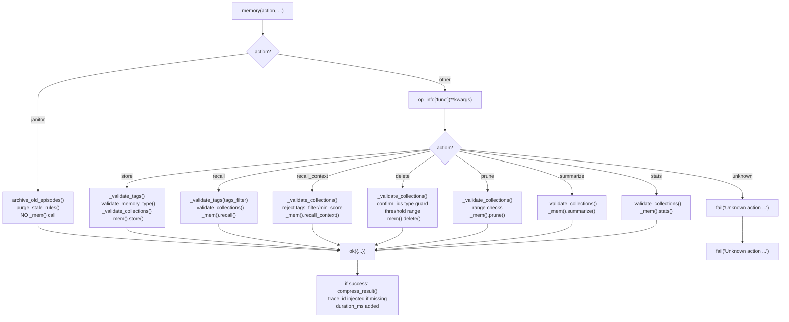

<- Back to [Memory Overview](../MEMORY.md)

# 🏗️ Architecture

## 🔗 Source Code Reference

| File | Purpose |
|------|---------|
| `tools/memory.py` | `@tool` + `@meta_tool` facade — pure dispatch (v1.0) |
| `tools/memory_ops/__init__.py` | Auto-imports actions to trigger `@register_action` |
| `tools/memory_ops/_registry.py` | `DISPATCH` dict + `@register_action` decorator |
| `tools/memory_ops/state.py` | Singleton store instance + `reset_state()` |
| `tools/memory_ops/helpers.py` | `_mem()`, `_validate_tags()`, `_validate_memory_type()`, `_validate_collections()` |
| `tools/memory_ops/actions/store.py` | Store action handler (v1.3: chunked store path — `chunk=True` routes to `store_chunked()`) |
| `tools/memory_ops/actions/recall.py` | Recall action handler |
| `tools/memory_ops/actions/recall_context.py` | Recall context action handler (v1.0) |
| `tools/memory_ops/actions/update.py` | **v1.4 NEW.** `update` action — modify by ID with SQLite audit log (`rule_history` table). Append-only history, queryable. Updatable fields: importance, confidence, tags, goal, outcome, reasoning, source, tools_used, enabled. |
| `tools/memory_ops/actions/export_import.py` | **v1.4 NEW.** `export` + `import` actions — JSONL backup/restore. Needed for the `procedural_meta` → `procedural` migration. |
| `tools/memory_ops/actions/delete.py` | Delete action handler |
| `tools/memory_ops/actions/prune.py` | Prune action handler |
| `tools/memory_ops/actions/summarize.py` | Summarize action handler |
| `tools/memory_ops/actions/stats.py` | Stats action handler |
| `tools/memory_ops/actions/janitor.py` | Janitor action handler — NEVER calls `_mem()` |
| `core/memory_engine.py` | Thin facade — re-exports `MemoryStore` singleton |
| `core/memory_backend/store.py` | `MemoryStore` class — collections, stats, write lock |
| `core/memory_backend/write_ops.py` | `execute_store()` — dedup pipeline |
| `core/memory_backend/read_ops.py` | `execute_recall()` — semantic search |
| `core/memory_backend/maintenance.py` | `execute_delete/prune/summarize/stats()` |
| `core/memory_backend/janitor.py` | `archive_old_episodes()` — episodic archival |
| `core/sleep_learn/janitor.py` | `purge_stale_rules()` — rule purging from isolated collection |
| `core/utils.py` | `compress_result()` — context window compression |
| `core/contracts.py` | `ok()`, `fail()` — standardized response format |
| `core/config.py` | `memory_max_entry_bytes`, `max_tags_per_entry`, `max_tag_length` |

---

## Module Tree

```text
tools/memory.py              # @tool + @meta_tool facade — pure dispatch
tools/memory_ops/
├── __init__.py              # Auto-imports actions to trigger @register_action
├── _registry.py             # DISPATCH dict + @register_action decorator
├── state.py                 # Singleton store instance + reset_state()
├── helpers.py               # _mem(), _validate_tags(), _validate_memory_type(), _validate_collections()
└── actions/
    ├── store.py             # @register_action("memory", "store")
    ├── recall.py            # @register_action("memory", "recall")
    ├── recall_context.py    # @register_action("memory", "recall_context") — NEW v1.0
    ├── delete.py            # @register_action("memory", "delete")
    ├── prune.py             # @register_action("memory", "prune")
    ├── summarize.py         # @register_action("memory", "summarize")
    ├── stats.py             # @register_action("memory", "stats")
    └── janitor.py           # @register_action("memory", "janitor") — NEVER calls _mem()

core/memory_engine.py        # Thin facade — re-exports MemoryStore singleton
core/memory_backend/         # Implementation (see docs/core/MEMORY.md)
```

---

## Dispatch Flow



---

## Lazy Loading Pattern

```python
# tools/memory_ops/helpers.py
import tools.memory_ops.state as state

def _mem() -> "MemoryStore":
    '''Lazy import of memory store — avoids slow ChromaDB load at startup.'''
    with state._store_lock:
        if state._store is None:
            from core.memory_engine import MemoryStore
            state._store = MemoryStore()
        return state._store
```

The `janitor` action is handled by a separate handler that **never** calls `_mem()`. This means:
- `memory(action="janitor")` never imports ChromaDB
- Server startup is fast even if ChromaDB is not installed
- The janitor operates on the filesystem (JSONL logs) and isolated ChromaDB instance, not the main store

---

## State Ownership Pattern

```python
# tools/memory_ops/state.py
_store: "MemoryStore | None" = None
_store_lock = threading.Lock()

def reset_state() -> None:
    '''Clear the cached store instance. Call between tests.'''
    global _store
    with _store_lock:
        _store = None
```

All access to `_store` goes through `state._store`. Tests clear it via `state.reset_state()`. No cross-module reference divergence possible.

---

## 🧪 Testing

```powershell
# Run all memory tool tests
.\venv\Scripts\python tests/tools/memory/ -W error --tb=short -v

> **Note:** Ensure `pytest` resolves to your venv. If not, use `python -m pytest` or the full venv path (`venv\Scripts\pytest.exe` on Windows, `venv/bin/pytest` on Unix).
```

**Test layout:**
```text
tests/tools/memory/
├── conftest.py              # Shared fixtures: reset_memory_state, mock_store, mock_cfg
├── test_facade.py           # @meta_tool metadata, action Literal, unknown action, trace_id, compress_result, duration_ms
├── test_registry.py         # DISPATCH, @register_action, duplicate guard
├── test_store.py            # store action: validation, dedup, size limits, memory_type fail-fast, collections guard
├── test_store_chunking.py   # v1.3: chunk=True routing, procedural rejection, param pass-through, error handling
├── test_recall.py           # recall action: search, filtering, tags_filter
├── test_recall_context.py   # recall_context action: formatted string, collections guard, unsupported param rejection
├── test_delete.py           # delete action: similarity, confirm_ids, collections validation, threshold=0.0, threshold range
├── test_prune.py            # prune action: dry_run, age/importance filters, collections validation, range checks
├── test_summarize.py        # summarize action: collections validation, trace_id pass-through
├── test_stats.py            # stats action: collections validation
├── test_janitor.py          # janitor action: bypass (assert _mem never called), archive, purge, non-dict guards
├── test_tag_validation.py   # MED-05: XSS, length, character rules, multi-word tags
└── test_helpers.py          # v1.1: _validate_collections, _validate_memory_type, _validate_tags, _mem() singleton
```

**Mock strategy:**
- Patch `tools.memory_ops.helpers._mem` with `MagicMock` for all unit tests
- Patch `core.memory_backend.janitor.archive_old_episodes` for janitor tests
- Patch `core.sleep_learn.janitor.purge_stale_rules` for janitor tests
- Patch `cfg.memory_max_entry_bytes`, `cfg.max_tags_per_entry`, `cfg.max_tag_length` for validation tests
- Call `tools.memory_ops.state.reset_state()` between tests (autouse fixture)
- Patch `core.memory_engine.MemoryStore` in `test_helpers.py` to avoid real ChromaDB dependency

**[DESIGN] conftest.py maintenance:** Each action module does `from tools.memory_ops.helpers import _mem`, creating a local binding. The conftest must patch each binding individually. When adding a new action, update the `patches` list in `conftest.py` or tests for that action will use the real `MemoryStore`.

---

*Last updated: 2026-07-08. See [API.md](API.md) for action details, [CHANGELOG.md](CHANGELOG.md) for version history, [INSTRUCTIONS.md](INSTRUCTIONS.md) for AI editing rules.*
