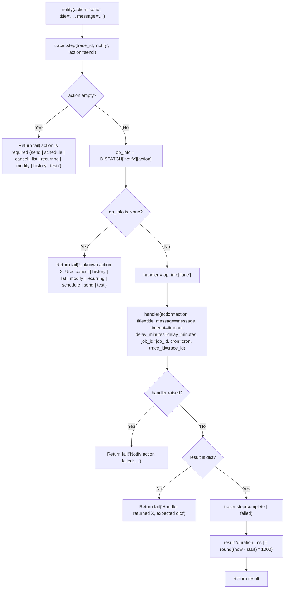
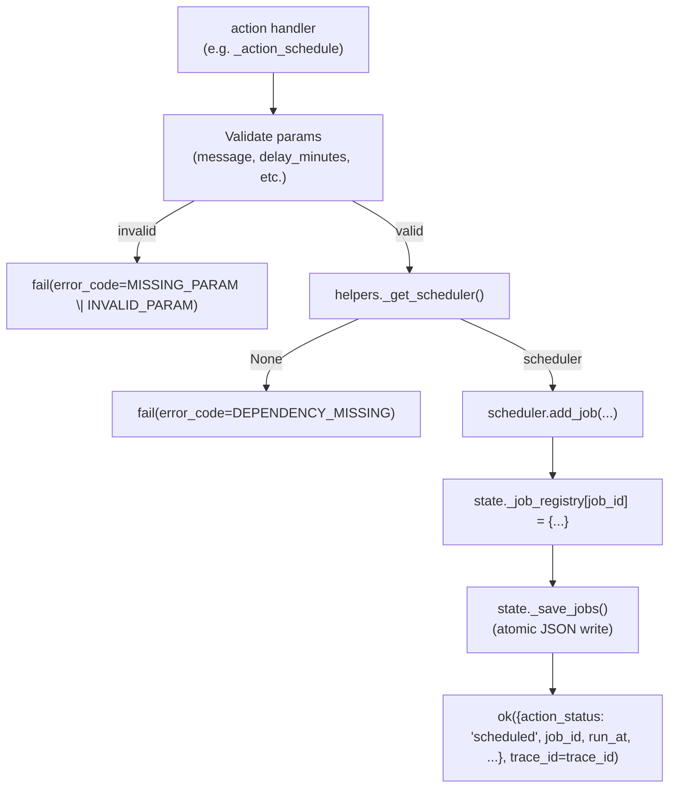

<- Back to [Notify Overview](../NOTIFY.md)

# 🏗️ Architecture

## 🔗 Source Code Reference

| File | Purpose |
|------|---------|
| `tools/notify.py` | `@tool @meta_tool` facade (154 lines) — strips/lowercases `action`, looks up handler in `DISPATCH["notify"][action]`, wraps handler exceptions as `"Notify action failed: ..."`, adds `duration_ms` to every response. Decorator order: `@tool` outer, `@meta_tool` inner (per `tools/_meta_tool.py` invariant). Imports `from tools import notify_ops` BEFORE reading `DISPATCH` so auto-discovery populates the table first. |
| `tools/notify_ops/__init__.py` | Auto-discovery: globs `actions/*.py`, imports each via `importlib.import_module` to trigger `@register_action` decoration. Runs BEFORE the facade reads `DISPATCH` so the table is populated when `@meta_tool` runs. Mirrors `consult_ops/__init__.py` exactly. |
| `tools/notify_ops/_registry.py` | `DISPATCH` dict + `@register_action` decorator. Module-level `DISPATCH` is shared by all action modules via the `from ... import DISPATCH` re-export pattern. Duplicate registration raises `ValueError` loudly. The `func` reference is the raw callable (not a partial/wrapper) so `@meta_tool`'s parameter introspection works. |
| `tools/notify_ops/state.py` | All shared mutable state: `_scheduler` singleton + `_scheduler_lock`, `_job_registry` dict (job_id → metadata), `_delivery_log` bounded list (max 50), `_jobs_path()` / `_save_jobs()` / `_load_jobs()` (atomic JSON persistence to `workspace/.notify_jobs/jobs.json`), `_log_delivery()` append helper, `_noop_fire()` stub for re-loaded jobs, `reset_state()` for test isolation. |
| `tools/notify_ops/helpers.py` | Two responsibilities: `_get_scheduler()` (lazy APScheduler singleton — imports + starts + calls `state._load_jobs()` on first call; returns `None` on ImportError) and `_send_notification()` (cross-platform chain: plyer → notify-send → console; calls `state._log_delivery()` after every delivery). |
| `tools/notify_ops/actions/__init__.py` | Docstring-only marker file explaining the auto-discovery convention. |
| `tools/notify_ops/actions/send.py` | `@register_action("notify", "send", ...)` + `_action_send` — immediate desktop notification via `_send_notification`. Default title `"Agent"`. Semantic status `"sent"` in `data.action_status`. |
| `tools/notify_ops/actions/schedule.py` | `@register_action("notify", "schedule", ...)` + `_action_schedule` — APScheduler `DateTrigger` one-shot N minutes from now. Default title `"Agent Reminder"`. Calls `_save_jobs()` after registering. Semantic status `"scheduled"`. |
| `tools/notify_ops/actions/cancel.py` | `@register_action("notify", "cancel", ...)` + `_action_cancel` — remove job by `job_id`. Fast-fails with `NOT_FOUND` if job_id not in registry. Pops from registry even if `scheduler.remove_job` raises (job already fired). Calls `_save_jobs()` after. Semantic status `"cancelled"`. |
| `tools/notify_ops/actions/list_workflows.py` | `@register_action("notify", "list", ...)` + `_action_list` — enumerate APScheduler jobs + enrich with registry metadata. Returns empty list with note (NOT error) when scheduler is `None`. Adds `recurring` + `cron` fields per job. Semantic status `"ok"`. (Module named `list_workflows.py` to mirror `workflow_ops` pattern — action_name is `"list"`.) |
| `tools/notify_ops/actions/recurring.py` | `@register_action("notify", "recurring", ...)` + `_action_recurring` — cron-style via APScheduler `CronTrigger.from_crontab()`. Validates cron expression before adding job (raises `INVALID_PARAM` on bad syntax). Computes next fire time via `trigger.get_next_fire_time(None, now)`. Stores `"recurring": True` + `"cron"` in registry. Calls `_save_jobs()`. Semantic status `"scheduled"`. Includes a docstring section on the future `schedule` tool integration plan and the proposed delivery-backend roadmap (ntfy.sh / Slack / Discord / Telegram / email). |
| `tools/notify_ops/actions/modify.py` | `@register_action("notify", "modify", ...)` + `_action_modify` — updates `_job_registry` title and/or message in place. Supports partial updates (only-title or only-message). Explicitly documents the v1.0 limitation: APScheduler kwargs are frozen at scheduling time, so metadata changes show in `list()` immediately but DON'T take effect on the next fire without cancel+re-create. Calls `_save_jobs()`. Semantic status `"modified"`. |
| `tools/notify_ops/actions/history.py` | `@register_action("notify", "history", ...)` + `_action_history` — returns last 20 entries from `state._delivery_log` (the full log is capped at 50). Documents why the log is in-memory only (debugging aid, not audit trail). Semantic status `"ok"`. |
| `tools/notify_ops/actions/test_notify.py` | `@register_action("notify", "test", ...)` + `_action_test` — sends fixed `title="Test"`, `message="Notification test successful"` through the full `_send_notification` chain. Useful for verifying the delivery pipeline works in the current environment. Appears in `history` immediately. Module named `test_notify.py` (not `test.py`) to avoid pytest discovery pattern confusion. Semantic status `"sent"`. |
| `core/contracts.py` | `ok()` / `fail()` — standardized return dicts with `trace_id` injection. All notify action handlers use these. |
| `core/config.py` | `cfg.is_windows` (platform detection for `_send_notification`), `cfg.workspace_root` (for `_jobs_path()`). |
| `core/tracer.py` | `tracer.step(trace_id, "notify", ...)` — called by the facade on action entry + completion/failure. |
| `tests/tools/notify/conftest.py` | 5 fixtures (`reset_notify_state` autouse, `mock_cfg`, `mock_scheduler`, `mock_scheduler_none`, `mock_plyer`, `mock_notify_send`) — see [Testing section](#-testing) for the full breakdown. |
| `tests/tools/notify/test_send.py` | 12 tests — success on Linux/Windows, default title, missing message, console fallback (3 paths), trace_id threading, delivery log entry + history visibility |
| `tests/tools/notify/test_schedule.py` | 11 tests — success, DateTrigger used, missing message, missing/negative delay, APScheduler not installed, trace_id threading, registry metadata, `_save_jobs` called, real `jobs.json` file written to tmp_path |
| `tests/tools/notify/test_cancel.py` | 8 tests — success, `_save_jobs` called, scheduler.remove_job raises still succeeds, missing job_id, job not in registry (NOT_FOUND), scheduler not running (DEPENDENCY_MISSING), trace_id threading |
| `tests/tools/notify/test_list.py` | 5 tests — jobs with metadata enrichment, recurring jobs include cron field, empty list, scheduler not running returns empty + note (NOT error), trace_id threading |
| `tests/tools/notify/test_recurring.py` | 12 tests — success, CronTrigger.from_crontab invoked, default title, registry marks recurring=True, `_save_jobs` called, missing message, missing/whitespace cron, invalid cron expression (INVALID_PARAM), APScheduler not installed, trace_id threading |
| `tests/tools/notify/test_modify.py` | 9 tests — updates both fields, `_save_jobs` called, partial update (only title / only message), missing job_id, no fields provided (MISSING_PARAM), job not found (NOT_FOUND), trace_id threading |
| `tests/tools/notify/test_history.py` | 5 tests — returns log after send, multiple entries, empty log, log capped at 50 (response returns last 20), trace_id threading |
| `tests/tools/notify/test_test.py` | 8 tests — sends notification, fixed title/message, returns method, Windows uses plyer, delivery log entry, visible via history, trace_id threading, no trace_id when not provided |
| `tests/tools/notify/test_dispatch.py` | 15 tests — unknown action lists valid actions, empty action, case insensitive (SEND/Send/send), duration_ms always present on success, duration_ms present on handler error, handler exception caught + wrapped, trace_id in dispatch errors, all 8 actions in DISPATCH, all actions have func/help/examples metadata, action names match `^[a-z][a-z0-9_]*$`, `@meta_tool Literal[...]` generated correctly, docstring has action list, facade exposes all 8 expected params (action/title/message/timeout/delay_minutes/job_id/cron/trace_id), cron typed as str, trace_id typed as str |

---

## 🌳 Module Tree

```text
tools/notify.py
├── notify(action, title, message, timeout, delay_minutes, job_id, cron, trace_id)  # @tool @meta_tool facade
├── DISPATCH["notify"][action]["func"]                                              # Handler lookup
└── duration_ms                                                                     # Added post-handler by facade

tools/notify_ops/
├── __init__.py                # Path.glob("actions/*.py") → importlib.import_module (auto-discovery)
├── _registry.py               # DISPATCH dict + @register_action decorator
├── state.py
│   ├── _scheduler             # Module-level singleton (lazy-init via helpers._get_scheduler())
│   ├── _scheduler_lock        # threading.Lock — guards singleton init
│   ├── _job_registry          # dict {job_id → {title, message, run_at, cron, status, recurring}}
│   ├── _delivery_log          # list (bounded to _MAX_DELIVERY_LOG=50)
│   ├── _jobs_path()           # cfg.workspace_root / ".notify_jobs" / "jobs.json"
│   ├── _save_jobs()           # Atomic write (tmp + os.replace) — best-effort, never crashes
│   ├── _load_jobs()           # Called ONCE by _get_scheduler() after start. Re-creates DateTrigger
│   │                          # + CronTrigger jobs from jobs.json. Skips past-fire DateTrigger jobs.
│   ├── _noop_fire()           # Stub for re-loaded jobs — lazy-imports _send_notification at fire time
│   │                          # (avoids state ↔ helpers circular import at module load)
│   ├── _log_delivery()        # Appends {title, message, method, trace_id, timestamp} to _delivery_log
│   └── reset_state()          # TEST-ONLY — shuts down scheduler, clears registry + log
├── helpers.py
│   ├── _get_scheduler()       # Lazy APScheduler singleton (returns None on ImportError)
│   └── _send_notification()   # Cross-platform chain: plyer → notify-send → console. Always succeeds
│                               # via console fallback. Calls _log_delivery() after every delivery.
└── actions/
    ├── __init__.py            # Docstring-only marker
    ├── send.py                # @register_action("notify", "send")     — immediate desktop notification
    ├── schedule.py            # @register_action("notify", "schedule") — APScheduler DateTrigger one-shot
    ├── cancel.py              # @register_action("notify", "cancel")   — remove job by job_id
    ├── list_workflows.py      # @register_action("notify", "list")     — enumerate jobs + metadata
    ├── recurring.py           # @register_action("notify", "recurring") — CronTrigger.from_crontab()
    ├── modify.py              # @register_action("notify", "modify")   — update registry metadata
    ├── history.py             # @register_action("notify", "history")  — last 20 from _delivery_log
    └── test_notify.py         # @register_action("notify", "test")     — fixed test notification

workspace/.notify_jobs/jobs.json    # Persisted _job_registry (atomic-write, reloaded on startup)
```

---

## 🔀 Dispatch Flow

### Facade → Handler → Response



### Handler → Helper → State (cross-cutting view)



### Delivery chain (`_send_notification`)

```mermaid
graph TD
    N["_send_notification(title, message, timeout)"] --> W{"cfg.is_windows?"}
    W -->|Yes| P["plyer.notification.notify(...)"]
    P -->|success| L["_log_delivery(title, message, 'plyer')"]
    P -->|exception| C["fall through"]
    W -->|No| S["subprocess.run(['notify-send', '-t', timeout*1000, title, message])"]
    S -->|returncode 0| L2["_log_delivery(title, message, 'notify-send')"]
    S -->|FileNotFoundError\|nonzero| C
    C --> F["print('[NOTIFY ...] title: message', file=sys.stderr)"]
    F --> L3["_log_delivery(title, message, 'console')"]
```

---

## 🧠 The 8-Action Pattern

All 8 actions are auto-discovered from `tools/notify_ops/actions/*.py` at import time. The facade's `action: Literal[...]` enum and docstring are generated from `DISPATCH["notify"].keys()` by `@meta_tool`.

| Action | Module file | Trigger | Semantic status | Persists? |
|--------|-------------|---------|-----------------|-----------|
| `send` | `send.py` | immediate | `sent` | no (delivery logged) |
| `schedule` | `schedule.py` | APScheduler `DateTrigger` (one-shot) | `scheduled` | ✅ `_save_jobs()` |
| `cancel` | `cancel.py` | user call | `cancelled` | ✅ `_save_jobs()` |
| `list` | `list_workflows.py` | user call | `ok` | read-only |
| `recurring` | `recurring.py` | APScheduler `CronTrigger` (cron) | `scheduled` | ✅ `_save_jobs()` |
| `modify` | `modify.py` | user call | `modified` | ✅ `_save_jobs()` |
| `history` | `history.py` | user call | `ok` | read-only |
| `test` | `test_notify.py` | immediate (fixed payload) | `sent` | no (delivery logged) |

**Naming convention:** the module file name does NOT have to match the action_name. `list_workflows.py` registers `action_name="list"`; `test_notify.py` registers `action_name="test"`. The auto-discovery globs `*.py` and the `@register_action("notify", "<name>", ...)` decorator is what populates `DISPATCH["notify"][<name>]` — `@meta_tool` then reads the keys for the `Literal` enum.

---

## 💾 Job Persistence

### File location

`workspace/.notify_jobs/jobs.json` — resolved by `state._jobs_path()` from `cfg.workspace_root`. Tests patch `cfg.workspace_root` (via the `mock_cfg` fixture) to redirect persistence to a `tmp_path`.

### Write semantics (`_save_jobs`)

1. Serialize `_job_registry` to JSON (`indent=2`, `default=str` for any non-JSON-native types).
2. Write to `jobs.json.tmp` (sibling of the final path).
3. `os.replace(tmp, jobs.json)` — atomic on POSIX and Windows.
4. Failures are swallowed and logged to `sys.stderr` — persistence is best-effort. A failed save MUST NOT crash the calling action; the in-memory registry is still authoritative for the current session.

### Read semantics (`_load_jobs`)

Called ONCE by `helpers._get_scheduler()` after the scheduler starts. Reads `jobs.json` (if it exists), re-creates each job in APScheduler:

- **DateTrigger jobs** (`recurring=False`): re-create with `DateTrigger(run_date=datetime.fromisoformat(run_at))`. **Skipped if `run_at <= now`** — the fire time passed while offline.
- **CronTrigger jobs** (`recurring=True`): re-create with `CronTrigger.from_crontab(cron)`. NOT skipped (cron jobs are forward-looking).

All re-created jobs use `state._noop_fire` as the firing callback (NOT `helpers._send_notification`) to avoid a `state ↔ helpers` circular import at module load. `_noop_fire` lazy-imports `_send_notification` at fire time, well after module initialization.

### Registry value shape

```python
_job_registry[job_id] = {
    "title":    str,           # resolved title (default applied)
    "message":  str,
    "run_at":   str,           # ISO 8601 — for DateTrigger jobs; "" for recurring
    "cron":     str,           # cron expr — for recurring jobs; "" for DateTrigger
    "status":   "scheduled" | "recurring",
    "recurring": bool,
}
```

---

## 📜 Delivery Log (`_delivery_log`)

**In-memory only. NOT persisted.** Bounded to `_MAX_DELIVERY_LOG = 50` entries. Older entries drop off the front.

**Why in-memory only?** The log exists so the LLM can verify "did my last `notify(action='send')` actually deliver?" — it's a debugging aid, not an audit trail. Persisting it would create cross-process state coupling (one process's history bleeding into another's) and unbounded growth concerns. If you need a persistent audit trail, wire up a future delivery backend (ntfy.sh / Slack / Discord / Telegram / email) which all have their own server-side history.

**Entry shape** (appended by `state._log_delivery()` after every `_send_notification` call — success or fallback):

```python
{
    "title":     str,
    "message":   str,
    "method":    "plyer" | "notify-send" | "console",
    "trace_id":  str,
    "timestamp": str (ISO 8601),
}
```

**Query surface:** `notify(action="history")` returns `state._delivery_log[-20:]` (last 20 entries) plus `total_logged` (the full log size, capped at 50).

---

## 🔮 Future `schedule` Tool Integration Plan

A separate `schedule` tool is planned to own richer scheduling semantics. Notify's `recurring` action is a stop-gap until that lands.

| Concern | Owner (current) | Owner (future) |
|---------|------------------|----------------|
| Immediate notification delivery | `notify(action="send")` | `notify(action="send")` — unchanged |
| One-shot delayed reminder (N minutes) | `notify(action="schedule")` | `notify(action="schedule")` — likely stays (simple case) |
| Cron-style recurring notification | `notify(action="recurring")` | `schedule(action="add_cron", ...)` — richer cron (CRON_TZ, human-readable parsing) |
| Calendar sync (iCal / CalDAV) | — | `schedule(action="sync_calendar", ...)` |
| Recurring task execution (not just notification) | — | `schedule(action="add_task", ...)` |
| Cross-timezone scheduling | — | `schedule` tool (CRON_TZ, DST handling) |
| Delivery backend selection | — | `notify(action="send", backend="slack", ...)` — notify owns delivery, schedule owns timing |

**Key principle:** notify stays focused on notification delivery. The `schedule` tool will USE notify as its delivery mechanism:

```python
# Future API (proposed — not yet implemented):
schedule(action="add_cron", cron="0 9 * * *",
         delivery=notify(action="send", title="Standup", message="Daily standup time"))
```

When `schedule` lands, the `recurring` action should be deprecated (or re-exported as a thin shim that calls `schedule(action="add_cron", delivery=notify(action="send", ...))`). Until then, `recurring` stays in notify as a stop-gap.

### Future delivery backends

The current implementation only supports local desktop notifications (plyer / notify-send / console). Future delivery backends will be added either as new actions (`notify(action="ntfy")`, `notify(action="slack")`, etc.) OR as a backend abstraction (`notify(action="send", backend="ntfy", backend_config={...})`). See the [CHANGELOG.md Suggested Roadmap](CHANGELOG.md#-suggested-roadmap-future-sessions) for the full list.

Proposed backends:
- **ntfy.sh** — self-hosted Docker push service (HTTP POST → phone)
- **Slack** — incoming webhook (channel-scoped)
- **Discord** — incoming webhook (bot-channel-scoped)
- **Telegram** — Bot API (chat_id-scoped)
- **Email** — SMTP (recipient-scoped)

When the `schedule` tool lands, the `backend` param will likely move to the `schedule` tool's ownership — notify's job is "deliver via the configured channel", not "decide which channel".

---

## 💡 Key Design Decisions

- **`@meta_tool` over hand-rolled `action` dispatch** — The facade signature's `action: Literal[...]` type is auto-generated from `DISPATCH["notify"].keys()` at decoration time. Adding a 9th action = drop a new file in `actions/` — the `Literal` enum updates automatically. No edits to the facade needed.
- **Auto-discovery of actions** — `tools/notify_ops/__init__.py` globs `actions/*.py` and imports each via `importlib.import_module`, triggering `@register_action` decoration. Hardcoding imports would create a maintenance footgun (forgetting to add a new action = silent omission from the `Literal` enum + `"Unknown action"` at runtime).
- **`ok()` / `fail()` standardization (BREAKING)** — Pre-v1 returned raw dicts with semantic top-level `status` (`sent` / `scheduled` / `cancelled` / `ok`). v1.0 uses `core.contracts.ok()` / `fail()` so `response.status` is `"success"` / `"error"` only. The semantic status is preserved in `data.action_status` so callers that branched on `"sent"` can migrate to `data.action_status == "sent"`. This matches the consult / parallel / vision / swarm pattern.
- **`trace_id` in BOTH the `ok()` kwarg AND the data dict** — The `ok(data, trace_id=trace_id)` kwarg puts `trace_id` at the top level of the response (only when non-empty). The data dict inclusion makes `trace_id` accessible at `result["data"]["trace_id"]` too, matching the task spec example. Tests assert both paths where applicable.
- **Module-lookup pattern for helpers** — Action handlers reference helpers via `from tools.notify_ops import helpers` + `helpers._get_scheduler()` / `helpers._send_notification()` (module-level lookup at runtime), NOT direct `from ... import` of the functions. This is required because the conftest's `mock_scheduler` fixture patches `tools.notify_ops.helpers._get_scheduler` — direct imports would capture the original function at module-load time and bypass the patch. The `consult_ops` pattern uses direct imports because it patches `cfg` / `llm` / `check_rate_limit` (data), not the helper functions themselves. Notify's `_get_scheduler` is a function that wraps `state._scheduler` in non-trivial ways (lazy import + start + load_jobs), so patching it directly is the cleanest test seam — hence the module-lookup pattern.
- **`_noop_fire` stub breaks the state ↔ helpers circular import** — `state._load_jobs()` needs a firing callback for re-loaded jobs. The natural choice is `helpers._send_notification`, but `state.py` importing `helpers.py` at module load creates a cycle (helpers imports state for the scheduler). The fix: `state._noop_fire` is a stub that lazy-imports `_send_notification` at fire time, well after module initialization. Verified working: scheduled + recurring jobs survive `state.reset_state()` + scheduler re-init.
- **Atomic JSON persistence** — `_save_jobs()` writes to `jobs.json.tmp`, then `os.replace(tmp, jobs.json)`. This is atomic on POSIX and Windows — a SIGKILL mid-write cannot corrupt the file. Failures are swallowed and logged to `sys.stderr` — never crash the calling action.
- **In-memory delivery log (NOT persisted)** — The log exists for the `history` action — "did my last `notify(action='send')` actually deliver?". Persisting it would create cross-process state coupling and unbounded growth concerns. Bounded to 50 entries (`_MAX_DELIVERY_LOG`) so long-running agents don't leak memory.
- **`cancel` fast-fails with `NOT_FOUND`** — Pre-v1 deferred to `scheduler.remove_job` and silently popped missing keys. v1.0 fast-fails if `job_id` is not in `_job_registry` because the registry is the authoritative source of truth (a `job_id` not in the registry either already fired or never existed). The pre-v1 lenient behaviour is intentionally dropped — callers that called `cancel` defensively on already-fired jobs must now check `error_code`.
- **`cancel` pops from registry even if `scheduler.remove_job` raises** — APScheduler raises `JobLookupError` if the job already fired + was auto-removed. We still pop from `_job_registry` to keep the in-memory registry consistent with the user's intent (don't fire again) and match the original tool's lenient behaviour on this specific edge case.
- **`modify` is metadata-only in v1.0** — APScheduler jobs reference `_send_notification` at scheduling time, with `title`/`message` baked in as `kwargs`. Re-creating the job would lose the trigger's positional state (next fire time, cron position) and require full cancel+re-add. v1.0 updates `_job_registry` in place — the metadata change shows in `list()` immediately but DOESN'T take effect on the next fire without cancel+re-create. v1.1 will change the firing callback to look up `_job_registry` by `job_id` at fire time, so metadata changes propagate without cancel+re-create. Documented in the `modify.py` docstring.
- **`recurring` validates cron BEFORE adding the job** — APScheduler raises `ValueError` on invalid cron expressions. We catch it at the action layer to produce a clean `fail(error_code="INVALID_PARAM")` response rather than letting it bubble up as `INTERNAL_ERROR`.
- **`list` returns empty list (NOT error) when scheduler is `None`** — Callers can call `list()` defensively without conditional logic. The note field explains why the list is empty.
- **Lazy APScheduler import** — `from apscheduler.schedulers.background import BackgroundScheduler` happens inside `_get_scheduler()`, not at module top. Allows `send` / `test` / `history` to work without `apscheduler` installed (only `schedule` / `cancel` / `list` / `recurring` need it).
- **Console fallback as feature, not bug** — `sys.stderr` print ensures the user always sees the notification, even in headless environments or when desktop APIs are unavailable. Always returns `(True, "console")` so nothing is silently swallowed.
- **`reset_state()` is TEST-ONLY** — Called by the autouse `reset_notify_state` fixture in `conftest.py` before AND after each test. NEVER call `reset_state()` in production code — it would silently nuke scheduled reminders.

---

## 🧪 Testing

```powershell
# Run all notify tests (85 tests across 9 test_*.py files + 1 conftest.py)
.\venv\Scripts\pytest tests/tools/notify/ -W error --tb=short -v
```

> **Note:** Ensure `pytest` resolves to your venv. If not, use `python -m pytest` or the full venv path (`venv\Scripts\pytest.exe` on Windows, `venv/bin/pytest` on Unix).

**Test coverage (85 tests across 10 files):**

| File | Tests | Coverage |
|------|-------|----------|
| `conftest.py` | — (fixtures) | `reset_notify_state` (autouse, calls `state.reset_state()` before AND after each test); `mock_cfg` (patches BOTH `tools.notify_ops.helpers.cfg` AND `tools.notify_ops.state.cfg` with `tmp_path/workspace`); `mock_scheduler` (patches `tools.notify_ops.helpers._get_scheduler` with MagicMock); `mock_scheduler_none` (returns None — simulates APScheduler not installed); `mock_plyer` (patches `plyer.notification.notify` via `sys.modules`); `mock_notify_send` (patches `subprocess.run` with `returncode=0`) |
| `test_send.py` | 12 | success on Linux/Windows (2), default title (1), missing message (1), console fallback — plyer raises / `FileNotFoundError` / nonzero exit (3), trace_id threading (1), delivery log entry created + visible via `history` (4) |
| `test_schedule.py` | 11 | success (1), DateTrigger used (1), missing message (1), missing/negative delay (2), APScheduler not installed (1), trace_id threading (1), `_job_registry` updated with correct metadata (1), `_save_jobs` called (1), real `jobs.json` file written to `tmp_path` (2) |
| `test_cancel.py` | 8 | success (1), `_save_jobs` called (1), `scheduler.remove_job` raises still succeeds (1), missing job_id (1), job not in registry — `NOT_FOUND` (1), scheduler not running — `DEPENDENCY_MISSING` (1), trace_id threading (2) |
| `test_list.py` | 5 | jobs with metadata enrichment (1), recurring jobs include `cron` field (1), empty list (1), scheduler not running returns empty + note — NOT error (1), trace_id threading (1) |
| `test_recurring.py` | 12 | success (1), `CronTrigger.from_crontab` invoked (1), default title (1), registry marks `recurring=True` (1), `_save_jobs` called (1), missing message (1), missing/whitespace cron (2), invalid cron expression — `INVALID_PARAM` (1), APScheduler not installed (1), trace_id threading (2) |
| `test_modify.py` | 9 | updates both fields (1), `_save_jobs` called (1), partial update — only title / only message (2), missing job_id (1), no fields provided — `MISSING_PARAM` (1), job not found — `NOT_FOUND` (1), trace_id threading (2) |
| `test_history.py` | 5 | returns log after send (1), multiple entries (1), empty log (1), log capped at 50 — response returns last 20 (1), trace_id threading (1) |
| `test_test.py` | 8 | sends notification (1), fixed title/message (1), returns method (1), Windows uses plyer (1), delivery log entry (1), visible via history (1), trace_id threading (1), no trace_id when not provided (1) |
| `test_dispatch.py` | 15 | unknown action lists valid actions (1), empty action (1), case insensitive — SEND/Send/send (1), duration_ms always present on success (1), duration_ms present on handler error (1), handler exception caught + wrapped (1), trace_id in dispatch errors (1), all 8 actions in DISPATCH (1), all actions have func/help/examples metadata (1), action names match `^[a-z][a-z0-9_]*$` (1), `@meta_tool Literal[...]` generated correctly (1), docstring has action list (1), facade exposes all 8 expected params (1), cron typed as str (1), trace_id typed as str (1) |

**Mock strategy:**
- `mock_cfg` patches BOTH `tools.notify_ops.helpers.cfg` AND `tools.notify_ops.state.cfg` because both modules do `from core.config import cfg` at module load (same Python `from-x-import-y` pitfall documented in `consult-v1.0-staging` and `parallel-v1.0-staging`).
- `mock_scheduler` patches `tools.notify_ops.helpers._get_scheduler` (not `state._scheduler` directly) so tests can exercise the "scheduler not running" path via `mock_scheduler_none`. This is why action handlers use the module-lookup pattern (`helpers._get_scheduler()`) instead of direct imports — direct imports would capture the original function at module-load time and bypass the patch.
- `mock_plyer` patches `plyer.notification.notify` via `patch.dict(sys.modules, {...})` so it works even if `plyer` is not installed in the test environment.
- `mock_notify_send` patches `subprocess.run` (NOT `tools.notify_ops.helpers.subprocess`) because helpers does `import subprocess` at function call time (lazy), so the patch target is the global `subprocess.run`.
- Tests asserting the delivery log entries use `state._delivery_log` directly (introspection) AND `notify(action="history")` (round-trip) to verify both the internal state and the public API surface.
- `test_dispatch.py`'s `test_handler_exception_caught` patches `DISPATCH["notify"]["send"]["func"]` with a raising handler to verify the facade's try/except wraps handler exceptions as `"Notify action failed: ..."`.

**Current test layout:**
```text
tests/tools/notify/
├── conftest.py          # 5 fixtures (123 lines)
├── test_send.py         # 12 tests
├── test_schedule.py     # 11 tests
├── test_cancel.py       # 8 tests
├── test_list.py         # 5 tests
├── test_recurring.py    # 12 tests
├── test_modify.py       # 9 tests
├── test_history.py      # 5 tests
├── test_test.py         # 8 tests
└── test_dispatch.py     # 15 tests
                        # Total: 85 tests across 9 test_*.py files + 1 conftest.py
```

> **Pre-v1 history:** the old `tests/tools/notify/test_notify.py` (10 tests, 107 lines) was deleted in v1.0. Its coverage is now distributed across the per-action files (`test_send.py` covers the pre-v1 send tests; `test_schedule.py` covers the pre-v1 schedule tests; etc.).

---

*Last updated: 2026-07-15 (v1.0). See [API.md](API.md) for action details, [CHANGELOG.md](CHANGELOG.md) for version history, [INSTRUCTIONS.md](INSTRUCTIONS.md) for AI editing rules.*
