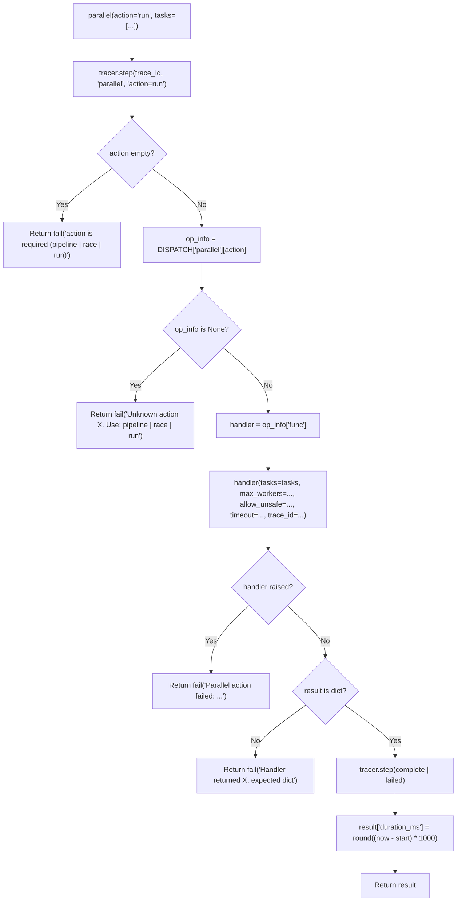

<- Back to [Parallel Overview](../PARALLEL.md)

# 🏗️ Architecture

## 🔗 Source Code Reference

| File | Purpose |
|------|---------|
| `tools/parallel.py` | `@tool @meta_tool` facade — strips/lowercases `action`, looks up handler in `DISPATCH["parallel"][action]`, wraps handler exceptions as `"Parallel action failed: ..."`, adds `duration_ms` to every response |
| `tools/parallel_ops/__init__.py` | Auto-discovery: globs `actions/*.py`, imports each via `importlib.import_module` to trigger `@register_action` decoration. Runs BEFORE the facade reads `DISPATCH` so the table is populated when `@meta_tool` runs. |
| `tools/parallel_ops/_registry.py` | `DISPATCH` dict + `@register_action` decorator. Module-level `DISPATCH` is shared by all action modules via the `from ... import DISPATCH` re-export pattern. Duplicate registration raises `ValueError` loudly. |
| `tools/parallel_ops/tool_map.py` | `PARALLEL_SAFE` frozenset (10 tools) + `_TOOL_MAP` dict (17 tools, all lazy) + `_get_tool_fn(name)` resolver. `"parallel"` intentionally omitted (nested-parallel guard). `python_exec` is an alias for `python`. |
| `tools/parallel_ops/executor.py` | Three execution engines: `dispatch_run` (barrier — `wait()`), `dispatch_race` (`as_completed()` — first success wins), `dispatch_pipeline` (sequential — feeds results forward). Also: `_resolve_timeout`, `_safe_run`, `_resolve_dot_path`, `_parallel_depth` thread-local. |
| `tools/parallel_ops/actions/__init__.py` | Docstring-only marker file explaining the auto-discovery convention |
| `tools/parallel_ops/actions/run.py` | `@register_action("parallel", "run", ...)` + `_action_run` handler + shared `_validate_tasks` helper (also used by `race.py`). Enforces `PARALLEL_SAFE` unless `allow_unsafe=True`. |
| `tools/parallel_ops/actions/race.py` | `@register_action("parallel", "race", ...)` + `_action_race` handler. Reuses `_validate_tasks` from `run.py`. Same `PARALLEL_SAFE` enforcement. |
| `tools/parallel_ops/actions/pipeline.py` | `@register_action("parallel", "pipeline", ...)` + `_action_pipeline` handler + pipeline-specific `_validate_pipeline_tasks` (extracts optional `feed` key per task). Does NOT enforce `PARALLEL_SAFE` (sequential execution). |
| `core/parallel_executor.py` | **Backwards-compat shim** (37 lines). Re-exports `dispatch_parallel` (alias for `dispatch_run`), `dispatch_run`, `dispatch_race`, `dispatch_pipeline`, `_parallel_depth`, `_safe_run` from `tools.parallel_ops.executor`; re-exports `PARALLEL_SAFE`, `_TOOL_MAP`, `_get_tool_fn` from `tools.parallel_ops.tool_map`. |
| `core/contracts.py` | `ok()` / `fail()` — standardized return dicts with `trace_id` injection |
| `core/config.py` | `cfg.worker_timeout` — global timeout fallback (default 60s) used when `timeout=-1` |
| `tests/tools/parallel/conftest.py` | 2 fixtures (`mock_cfg` patches `tools.parallel_ops.executor.cfg`; `mock_tools` returns 4 `MagicMock` callables) + 1 helper factory (`make_mock_tool`) |
| `tests/tools/parallel/test_run.py` | 15 tests — validation (6), PARALLEL_SAFE enforcement (2), execution (7) |
| `tests/tools/parallel/test_race.py` | 9 tests — validation (3), execution (6) |
| `tests/tools/parallel/test_pipeline.py` | 11 tests — validation (3), execution (8) |
| `tests/tools/parallel/test_dispatch.py` | 11 tests — facade dispatch (6), DISPATCH registry (5) |
| `tests/tools/parallel/test_tool_map.py` | 12 tests — unknown tool (2), cached value (2), lazy import (2), PARALLEL_SAFE contents (3), _TOOL_MAP contents (3) |
| `tests/tools/parallel/test_executor.py` | 35 tests — dispatch_run (9), dispatch_race (7), dispatch_pipeline (7), _resolve_dot_path (6), _resolve_timeout (4), _safe_run (2) |

---

## 🌳 Module Tree

```text
tools/parallel.py
├── parallel(action, tasks, max_workers, allow_unsafe, timeout, trace_id)  # @tool @meta_tool facade
├── DISPATCH["parallel"][action]["func"]                                    # Handler lookup
└── duration_ms                                                             # Added post-handler by facade

tools/parallel_ops/
├── __init__.py                # Path.glob("actions/*.py") → importlib.import_module (auto-discovery)
├── _registry.py               # DISPATCH dict + @register_action decorator
├── tool_map.py
│   ├── PARALLEL_SAFE          # frozenset of 10 safe tool names
│   ├── _TOOL_MAP              # dict of 17 tool names → None (lazy) | callable (cached)
│   └── _get_tool_fn(name)     # Lazy import + cache. Returns None for unknown names.
├── executor.py
│   ├── _parallel_depth        # threading.local() — nested-call guard
│   ├── _resolve_timeout(t)    # -1 / None / other-negative → cfg.worker_timeout; >=0 → as-is
│   ├── _safe_run(name, fn, args)  # Module-level (picklable): fn(**args)
│   ├── dispatch_run(calls, max_workers, timeout, trace_id)            # Barrier via wait()
│   ├── dispatch_race(calls, max_workers, timeout, trace_id)           # First success via as_completed()
│   ├── _resolve_dot_path(obj, dot_path)                              # str/dict key + object attr traversal
│   └── dispatch_pipeline(calls, timeout, trace_id)                   # Sequential chain with feed
└── actions/
    ├── __init__.py            # Docstring-only marker
    ├── run.py
    │   ├── _validate_tasks(tasks, trace_id)   # Shared with race.py
    │   └── _action_run(...)                   # @register_action("parallel", "run")
    ├── race.py
    │   └── _action_race(...)                  # @register_action("parallel", "race") — imports _validate_tasks
    └── pipeline.py
        ├── _validate_pipeline_tasks(tasks, trace_id)  # Extracts per-task "feed" key
        └── _action_pipeline(...)                       # @register_action("parallel", "pipeline")

core/parallel_executor.py       # 37-line backwards-compat shim — re-exports from parallel_ops/
```

---

## 🔀 Dispatch Flow

### Facade → Handler → Engine



### Three Execution Engines

```mermaid
graph TD
    subgraph run["dispatch_run — barrier"]
        R1["Submit all calls to ThreadPoolExecutor"] --> R2["concurrent.futures.wait(futures, timeout)"]
        R2 --> R3["Collect done → results/errors"]
        R2 --> R4["Collect not_done → 'Timed out' errors"]
        R3 --> R5["ok({results, errors, completed, failed, duration_ms})"]
        R4 --> R5
    end

    subgraph race["dispatch_race — first success wins"]
        A1["Submit all calls"] --> A2["for f in as_completed(futures, timeout)"]
        A2 --> A3{"first non-error result?"}
        A3 -->|Yes| A4["winner = {tool, status, result}"]
        A4 --> A5["f.cancel() on all others (started ones can't be preempted)"]
        A3 -->|No| A6["append to failed[]"]
        A2 -->|TimeoutError| A7["mark all unfinished as 'Timed out'"]
        A5 --> A8["ok({winner: {...}|None, cancelled: [...], failed: [...], duration_ms})"]
        A6 --> A8
        A7 --> A8
    end

    subgraph pipeline["dispatch_pipeline — sequential chain"]
        P1["For each (name, fn, args, feed) in calls"] --> P2{"idx==0 or feed is None?"}
        P2 -->|Yes| P3["effective_args = dict(args)"]
        P2 -->|No| F1{"feed is str?"}
        F1 -->|Yes| F2["resolved = _resolve_dot_path(prev_result, feed)"]
        F2 --> F3{"resolved is dict?"}
        F3 -->|Yes| F4["effective_args = dict(resolved)"]
        F3 -->|No| F5["error: 'feed did not resolve to dict' → break"]
        F1 -->|No| F6{"feed is dict?"}
        F6 -->|Yes| F7["effective_args = dict(args) + {arg_key: _resolve_dot_path(prev_result, dot_path) for ...}"]
        F6 -->|No| F8["error: 'feed must be None | str | dict' → break"]
        P3 --> P9["fn(**effective_args)"]
        F4 --> P9
        F7 --> P9
        P9 -->|success| P10["results.append(...); prev_result = result"]
        P9 -->|exception| P11["errors.append(...); break"]
        P10 --> P1
        P11 --> P12["ok({results, errors, completed, failed, duration_ms})"]
        P5 --> P12
        F8 --> P12
    end
```



---

## 🧠 The Three Execution Engines

### `dispatch_run` — Barrier (pre-v1 behaviour)

Submit all calls to a `ThreadPoolExecutor`, then `concurrent.futures.wait(futures, timeout=effective_timeout)`. Returns `ok({"results": [...], "errors": [...], "completed": N, "failed": M, "duration_ms": int})`.

- **`max_workers` clamped 1–8** — both in the handler and the executor (defense in depth).
- **Done futures**: `future.result()` either succeeds (wrapped as `{"tool", "status", "result"}`) or raises (wrapped as `{"tool", "error"}` in `errors`).
- **Not-done futures**: marked `"Timed out after {effective_timeout} seconds"` in `errors`.
- **Failure isolation**: a single task raising does NOT abort the run — its error goes in `errors`, the rest finish normally.

### `dispatch_race` — First Success Wins

Submit all calls, then iterate `concurrent.futures.as_completed(futures, timeout=...)`. The first future that returns a **non-error** result wins; remaining futures are cancelled via `f.cancel()`.

- **Cancel is best-effort**: `f.cancel()` returns `True` only for futures that haven't started yet. Already-running threads cannot be preempted (Python doesn't support thread cancellation). Late finishes are drained: late successes are recorded in `failed` as `"race: not the winner"`; late errors are recorded with their error message.
- **Envelope status is `"success"` even when all tasks fail** — the race itself completed; callers must check `winner is not None`.
- **`TimeoutError`**: if no future completes within `effective_timeout`, all unfinished futures are marked `"Timed out after {effective_timeout} seconds"` in `failed`.

### `dispatch_pipeline` — Sequential Chain (NOT parallel despite the tool name)

Iterate `calls` in order. Each task's result may be **fed** into the next call's args via the per-task `feed` key. Pipeline **stops on first failure** (no upstream result to feed downstream).

- **NOT parallel**: despite the tool name `parallel`, `pipeline` is sequential. The "parallel" in the tool name refers to the meta-tool umbrella, not this action's semantics.
- **`max_workers` ignored**: sequential execution has no concurrency hazard, so the param is not accepted by `_action_pipeline`.
- **`PARALLEL_SAFE` not enforced**: same reason — sequential execution cannot race. `allow_unsafe=True` is accepted for API symmetry with `run`/`race` but ignored.

#### Pipeline "feed" mechanism (None | str | dict)

| `feed` value | Behaviour | Example |
|--------------|-----------|---------|
| **`None`** (or omitted) | Use the task's own `args` as-is. | `{"name": "file", "args": {"action": "read", "path": "x.txt"}}` |
| **`str`** (dot-path) | Resolve the dot-path against the previous result; the resolved value **REPLACES** the next call's args entirely. Only valid if the resolved value is a dict — otherwise the chain breaks with `"feed 'X' did not resolve to a dict"`. | `{"name": "python", "args": {}, "feed": "result.text"}` where prev result is `{"result": {"text": {"action": "run", "code": "..."}}}` — next call's args become `{"action": "run", "code": "..."}`. |
| **`dict`** (arg-name → dot-path) | Keep the task's own `args` as the base, then **MERGE** each fed value in (overriding matching keys). Missing paths yield `None` (soft error — chain continues, downstream may tolerate None). | `{"name": "python", "args": {"action": "run"}, "feed": {"code": "result.text"}}` — next call's args become `{"action": "run", "code": "<prev result.text>"}`. |

The dot-path resolver (`_resolve_dot_path`) supports:
- Dict keys: `"result.text"` against `{"result": {"text": "x"}}` → `"x"`
- Object attrs: same syntax against `obj.result.text` → `obj.result.text`
- Multi-segment paths
- Missing segments → `None` (defensive — caller decides whether None is fatal)

---

## 🔁 Backwards-Compat Shim

`core/parallel_executor.py` is now a 37-line re-export shim. It exists so existing imports continue to work without code changes:

```python
# OLD (still works):
from core.parallel_executor import dispatch_parallel, PARALLEL_SAFE, _parallel_depth, _safe_run

# NEW (preferred for new code):
from tools.parallel_ops.executor import dispatch_run, dispatch_race, dispatch_pipeline
from tools.parallel_ops.tool_map import PARALLEL_SAFE, _TOOL_MAP, _get_tool_fn
```

| Re-exported name | Source | Notes |
|------------------|--------|-------|
| `dispatch_parallel` | `dispatch_run` (alias) | Legacy name from pre-v1 |
| `dispatch_run` | `tools.parallel_ops.executor` | v1.0 name (same fn as `dispatch_parallel`) |
| `dispatch_race` | `tools.parallel_ops.executor` | NEW in v1.0 |
| `dispatch_pipeline` | `tools.parallel_ops.executor` | NEW in v1.0 |
| `PARALLEL_SAFE` | `tools.parallel_ops.tool_map` | Expanded 6 → 10 in v1.0 |
| `_TOOL_MAP` | `tools.parallel_ops.tool_map` | Expanded 9 → 17 in v1.0 |
| `_get_tool_fn` | `tools.parallel_ops.tool_map` | NEW in v1.0 (was inline in pre-v1) |
| `_parallel_depth` | `tools.parallel_ops.executor` | Thread-local guard |
| `_safe_run` | `tools.parallel_ops.executor` | Picklable wrapper: `fn(**args)` |

The shim's `__all__` lists all 9 names + a docstring directing new code to the new import paths.

---

## 🔒 PARALLEL_SAFE Expansion (6 → 10 tools)

| Tool | In PARALLEL_SAFE? | Why / Why Not |
|------|-------------------|---------------|
| `web` | ✅ Yes | Network I/O — safe (each call has its own httpx client) |
| `file` | ✅ Yes | Read ops — safe; write ops have internal locks |
| `python` | ✅ Yes | Sandboxed execution — safe (each call has isolated namespace; `_STDOUT_LOCK` prevents stdout clobbering) |
| `python_exec` | ✅ Yes | Alias for `python` — safe |
| `notify` | ✅ Yes | Desktop notification — safe (one-shot send) |
| `github` | ✅ Yes | API-only actions safe; `push`/`pull` excluded via `_NOT_PARALLEL_SAFE` inside the github tool itself |
| `consult` | ✅ Yes (NEW v1.0) | Cloud LLM call — stateless, safe to fan out |
| `vision` | ✅ Yes (NEW v1.0) | Cloud LLM call — stateless, safe to fan out |
| `report` | ✅ Yes (NEW v1.0) | Pure HTML/PDF generation — no shared mutable state |
| `agent` | ✅ Yes (NEW v1.0) | Specialist LLM dispatch — stateless per call |
| `git` | ❌ No | Write ops (`commit`, `push`) cause `index.lock` collisions |
| `memory` | ❌ No | ChromaDB concurrent writes risk `database is locked` |
| `cli` | ❌ No | Shared shell — commands may conflict (e.g., two `mkdir` on same path) |
| `browser` | ❌ No | Playwright session — single browser context, concurrent actions corrupt state |
| `tavily` | ❌ No | Shared `AsyncTavilyClient` instance — concurrent calls race on the client's internal state |
| `swarm` | ❌ No | Uses `ThreadPoolExecutor` internally — nesting risks thread-pool exhaustion |
| `workflow` | ❌ No | Long-running blocking calls — would hold pool workers for minutes |
| `parallel` | ❌ No (also omitted from `_TOOL_MAP` entirely) | Nested parallel calls blocked by `_parallel_depth`; attempting dispatch returns `"Tool 'parallel' not found"` |

### `_TOOL_MAP` (17 tools, all lazy)

All values start as `None` at module load. `_get_tool_fn(name)` lazy-imports on first use and caches the resolved callable back into `_TOOL_MAP` for O(1) subsequent lookups. Thread-safe under the GIL — worst case two threads race to import the same module; the second overwrites the cache with the same value.

`python_exec` is kept as a separate key (alias for `python`) for backwards-compat with callers that used the older name.

---

## 💡 Key Design Decisions

- **`@meta_tool` over hand-rolled `action` dispatch** — The facade signature's `action: Literal["pipeline", "race", "run"]` is auto-generated from `DISPATCH["parallel"].keys()` at decoration time. Adding a 4th action = drop a new file in `actions/` — the `Literal` enum updates automatically. No edits to the facade needed.
- **Auto-discovery of actions** — `tools/parallel_ops/__init__.py` globs `actions/*.py` and imports each via `importlib.import_module`, triggering `@register_action` decoration. Hardcoding imports would create a maintenance footgun (forgetting to add a new action = silent omission from the `Literal` enum + `"Unknown action"` at runtime).
- **Lazy imports in `_TOOL_MAP`** — All 17 tool values start as `None`. Importing all tools at module load would (a) slow startup, (b) trigger circular imports (`parallel` is itself a tool), and (c) pull in optional dependencies (Playwright, ChromaDB, tavily async client) that may not be installed in every environment. `_get_tool_fn` resolves on first use and caches.
- **`_safe_run` is a separate module-level function** — `ThreadPoolExecutor.submit` needs a picklable callable in some Python implementations. A module-level function is picklable; a closure isn't. Even though CPython's `ThreadPoolExecutor` doesn't pickle, keeping `_safe_run` module-level matches the original `core/parallel_executor.py` shape and makes the executor easy to mock in tests.
- **Real global timeout via `wait()`** — `concurrent.futures.wait(futures, timeout=cfg.worker_timeout)` enforces a true deadline. The pre-v1 `as_completed()` + `future.result(timeout=30)` pattern was broken: `as_completed()` blocks indefinitely waiting for a future to finish, so the per-future timeout never fires on a hung future. `dispatch_race` still uses `as_completed()` (legitimately — it needs to react to completion order), but `dispatch_run` and `dispatch_pipeline` use `wait()` / sequential iteration respectively.
- **Nested-call guard via `_parallel_depth`** — `threading.local()` tracks recursion depth. `parallel → parallel` creates a thread-pool-of-thread-pools deadlock risk (outer waits for inner, inner waits for outer's pool). The guard rejects any nested entry — even `pipeline` (which is sequential) increments it so a pipeline stage that itself calls `parallel()` is also blocked.
- **Three engines, one shared `_parallel_depth`** — All three engines increment the same thread-local. A `pipeline` stage that calls `parallel(action="run", ...)` is blocked the same way a `run` task that calls `parallel(action="race", ...)` is.
- **`race` envelope status is `"success"` even when all tasks fail** — The race itself completed; the per-call failures are in `failed`. Callers must check `winner is not None`. This avoids conflating "the race ran" with "the race produced a winner".
- **`pipeline` does NOT enforce `PARALLEL_SAFE`** — Sequential execution has no concurrency hazard regardless of which tool is called. `allow_unsafe=True` is accepted for API symmetry with `run`/`race` but ignored.
- **Backwards-compat shim, not a delete** — `core/parallel_executor.py` is preserved as a 37-line re-export so existing imports continue to work. New code should import from `tools.parallel_ops.*` directly (the shim's `__all__` lists all 9 names + a docstring directing callers to the new paths).
- **`"parallel"` omitted from `_TOOL_MAP` entirely** — Attempting `parallel(action="run", tasks=[{"name": "parallel", ...}])` returns `"Tool 'parallel' not found"` from the validator, which is cleaner than allowing dispatch and then failing on the nested-parallel guard inside `dispatch_run`.

---

## 🧪 Testing

```powershell
# Run all parallel tests (93 tests across 6 test_*.py files + 1 conftest.py)
.\venv\Scripts\pytest tests/tools/parallel/ -W error --tb=short -v
```

> **Note:** Ensure `pytest` resolves to your venv. If not, use `python -m pytest` or the full venv path (`venv\Scripts\pytest.exe` on Windows, `venv/bin/pytest` on Unix).

**Test coverage (93 tests across 7 files):**

| File | Tests | Coverage |
|------|-------|----------|
| `conftest.py` | — (fixtures) | `mock_cfg` (patches `tools.parallel_ops.executor.cfg` with `worker_timeout=60`); `mock_tools` (4 `MagicMock` callables for parallel-safe tool names); `make_mock_tool` helper factory |
| `test_run.py` | 15 | Validation (6: tasks-must-be-list, empty-tasks, spec-must-be-dict, missing-name, unknown-tool, args-must-be-dict); PARALLEL_SAFE enforcement (2: unsafe-blocked, allow-unsafe-override); execution (7: two-tools-run, tool-error-captured, trace-id-passed, duration-ms-present, timeout-uses-cfg-when-negative, timeout-explicit-override, max-workers-clamped) |
| `test_race.py` | 9 | Validation (3: empty-tasks, unknown-tool, unsafe-blocked); execution (6: first-success-wins, all-fail-returns-none-winner, status-error-treated-as-failure, trace-id-threaded, duration-ms-present, single-task-race) |
| `test_pipeline.py` | 11 | Validation (3: empty-tasks, unknown-tool, invalid-feed-type); execution (8: no-feed-uses-own-args, feed-string-replaces-args, feed-string-non-dict-breaks-chain, feed-dict-merges-into-args, feed-dict-missing-path-yields-none, error-mid-chain-stops-pipeline, trace-id-threaded, pipeline-allows-unsafe-tools) |
| `test_dispatch.py` | 11 | Facade dispatch (6: unknown-action, empty-action, case-insensitive, duration-ms-always-present, handler-exception-caught, trace-id-threaded); DISPATCH registry (5: dispatch-has-3-actions, all-actions-have-metadata, action-names-match-pattern, facade-action-literal-generated, facade-docstring-has-action-list) |
| `test_tool_map.py` | 12 | Unknown tool (2: unknown-returns-none, parallel-self-not-in-map); cached value (2: cached-value-returned-directly, cached-value-not-overwritten); lazy import (2: lazy-import-resolves-and-caches, lazy-import-for-python-exec-alias); PARALLEL_SAFE contents (3: has-documented-members, excludes-unsafe-tools, is-frozenset); _TOOL_MAP contents (3: has-documented-keys, all-values-start-none, python-exec-is-separate-key) |
| `test_executor.py` | 35 | dispatch_run (9: empty-calls, single-call, max-workers-high-clamped, max-workers-low-clamped, result-wrapping, error-wrapping, duration-ms-present, trace-id-threaded, nested-parallel-blocked); dispatch_race (7: empty-calls, first-success-wins, all-fail-returns-none-winner, status-error-does-not-win, trace-id-threaded, duration-ms-present, nested-parallel-blocked); dispatch_pipeline (7: empty-calls, no-feed-runs-each-with-own-args, feed-string-replaces-args, feed-string-non-dict-breaks-chain, feed-dict-merges-into-args, error-mid-chain-stops-pipeline, trace-id-threaded); _resolve_dot_path (6: single-segment-dict, multi-segment-dict, missing-segment-returns-none, empty-path-returns-obj, object-attrs, malformed-path-returns-none); _resolve_timeout (4: explicit-positive, explicit-zero, negative-one-falls-back-to-cfg, other-negative-also-falls-back); _safe_run (2: invokes-fn-with-kwargs, propagates-exceptions) |

**Mock strategy:**
- `patch.dict("tools.parallel_ops.tool_map._TOOL_MAP", {...}, clear=False)` injects mock tool callables. `_get_tool_fn` returns the cached mock (since `mock_fn is not None`, the lazy-import branch is skipped).
- Tests that exercise the lazy-import path use `patch.dict(sys.modules, {"tools.web": fake_module})` to inject fake modules without triggering real imports.
- `mock_cfg` patches `tools.parallel_ops.executor.cfg` (not `core.config.cfg`) because the executor does `from core.config import cfg` at module load — patching the local binding is required (same Python `from-x-import-y` pitfall documented in consult-v1.0-staging).
- Tests asserting strict pipeline-feed behaviour pass mock tools whose return values match the dot-path expectations (e.g. `{"result": {"text": "print('hi')"}}` for `"result.text"` feeds).
- `test_dispatch.py`'s `test_handler_exception_caught` patches `DISPATCH["parallel"]["run"]["func"]` with a raising handler to verify the facade's try/except wraps handler exceptions as `"Parallel action failed: ..."`.

**Current test layout:**
```text
tests/tools/parallel/
├── conftest.py          # 2 fixtures + 1 helper factory (60 lines)
├── test_run.py          # 15 tests
├── test_race.py         # 9 tests
├── test_pipeline.py     # 11 tests
├── test_dispatch.py     # 11 tests
├── test_tool_map.py     # 12 tests
└── test_executor.py     # 35 tests
                        # Total: 93 tests across 6 test_*.py files + 1 conftest.py
```

> **Pre-v1 history:** the old `tests/tools/parallel/test_parallel.py` (156 lines, 15 tests, 4 classes) was deleted in v1.0. Its coverage is now distributed across the per-action files (`test_run.py` covers the pre-v1 facade validation + execution tests; `test_executor.py` covers the pre-v1 `TestExecutorEngine` class).

---

*Last updated: 2026-07-15 (v1.0). See [API.md](API.md) for action details, [CHANGELOG.md](CHANGELOG.md) for version history, [INSTRUCTIONS.md](INSTRUCTIONS.md) for AI editing rules.*
