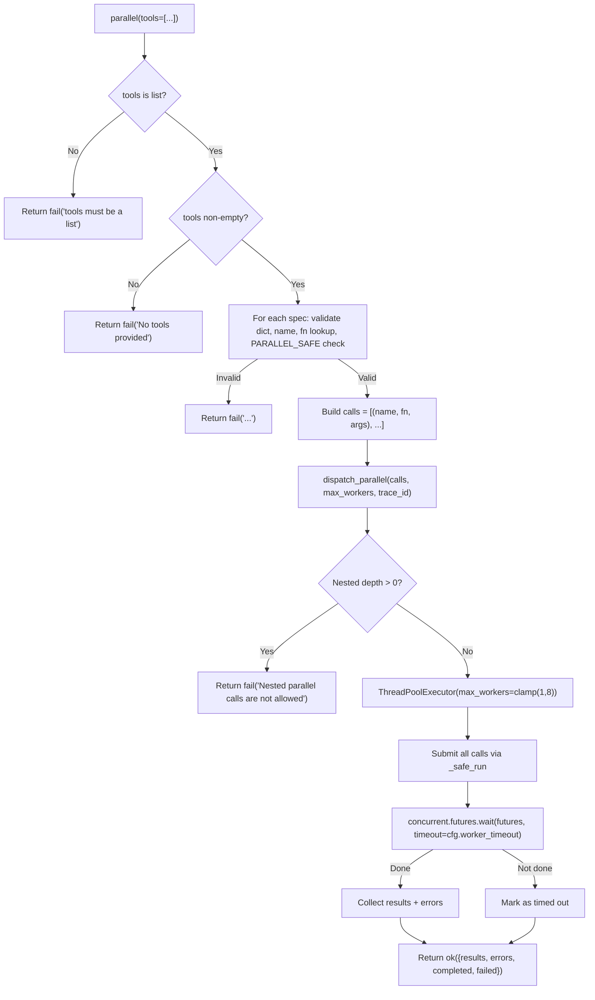

<- Back to [Parallel Overview](../PARALLEL.md)

# 🏗️ Architecture

## 🔗 Source Code Reference

| File | Purpose |
|------|---------|
| `tools/parallel.py` | `@tool` facade: input validation, `_TOOL_MAP` lookup, `PARALLEL_SAFE` enforcement, delegates to executor |
| `core/parallel_executor.py` | Pure execution engine: `ThreadPoolExecutor`, `wait()` timeout, nested-call guard, result/error wrapping |
| `core/contracts.py` | `ok()` / `fail()` — standardized return dicts with `trace_id` injection |
| `core/config.py` | `cfg.worker_timeout` — global timeout configurable via `.env` |
| `tests/tools/parallel/test_parallel.py` | 15 tests: validation, safety, execution, executor engine |

---

## 🌳 Module Tree

```text
tools/parallel.py
├── parallel(tools, max_workers, allow_unsafe, trace_id)  # @tool facade — validation, safety, mapping
├── _TOOL_MAP                                              # Explicit name → function mapping (8 tools + 2 aliases)
└── dispatch_parallel(calls, max_workers, trace_id)         # Delegates to core executor

core/parallel_executor.py
├── dispatch_parallel(calls, max_workers, trace_id)         # ThreadPoolExecutor + timeout + nested guard
├── _safe_run(name, fn, args)                              # Passthrough wrapper: fn(**args)
└── PARALLEL_SAFE                                          # frozenset of 5 safe tool names
```

---

## 🔀 Dispatch Flow



---

## 💡 Key Design Decisions

- **Explicit imports, no discovery** — `_TOOL_MAP` is a hardcoded dict. Tools are imported directly at module level. No runtime registry lookup, no dynamic loading. This keeps the parallel tool deterministic and avoids circular import issues.
- **Two-layer architecture** — `tools/parallel.py` handles LLM-facing validation and safety. `core/parallel_executor.py` handles pure execution. Separation means the executor can be tested independently.
- **Real global timeout** — `concurrent.futures.wait(futures, timeout=cfg.worker_timeout)` enforces a true deadline. The old `as_completed()` + `future.result(timeout=30)` pattern was broken: `as_completed()` blocks indefinitely waiting for a future to finish, so the per-future timeout never fires on a hung future.
- **Nested-call guard** — `threading.local()` tracks recursion depth. `parallel → parallel` creates a deadlock (outer waits for inner, inner waits for outer's thread pool). The guard prevents this with a clear error.
- **Conservative allowlist** — Only 5 tools in `PARALLEL_SAFE`. Write-heavy tools (`git`, `memory`, `cli`) are excluded by default. `allow_unsafe=True` bypasses the check but does not bypass the guard.
- **Result wrapping** — Every tool result is wrapped as `{"tool": name, "status": ..., "result": ...}` so consumers can correlate outputs with inputs.

---

## 🧪 Testing

```powershell
# Run all parallel tests
.\venv\Scripts\python tests/tools/parallel/ -W error --tb=short -v
```

> **Note:** Ensure `pytest` resolves to your venv. If not, use `python -m pytest` or the full venv path (`venv\Scripts\pytest.exe` on Windows, `venv/bin/pytest` on Unix).

**Test coverage (15 tests):**

| Class | Tests | Coverage |
|-------|-------|----------|
| `TestValidation` | 5 | Bad types, empty tools, non-dict specs, missing name, unknown tool |
| `TestParallelSafe` | 2 | Unsafe tool blocked, `allow_unsafe=True` override |
| `TestParallelExecution` | 3 | Two tools run, tool error captured, `trace_id` passed |
| `TestExecutorEngine` | 5 | Empty calls, single call, `max_workers` extreme (capped), result wrapping, error wrapping |

**Mock strategy:**
- Patch `_TOOL_MAP` via `patch.dict` to inject `MagicMock` functions
- Mock tool functions return `{"status": "success", "data": ...}` for happy paths
- Mock `side_effect=RuntimeError("boom")` for error paths
- Test `max_workers=100` → internally capped to 8
- Test `trace_id` propagation through `ok()` / `fail()` wrappers

**Current test layout:**
```text
tests/tools/parallel/
└── test_parallel.py          # Single monolithic test file (15 tests, 4 classes)
```

> **Future:** When the tool is refactored to `@meta_tool` + un-multiplex, this will expand to `conftest.py` + per-concern test files following the `tests/tools/browser/` pattern.

---

*Last updated: 2026-07-03. See [API.md](API.md) for action details, [CHANGELOG.md](CHANGELOG.md) for version history, [INSTRUCTIONS.md](INSTRUCTIONS.md) for AI editing rules.*
