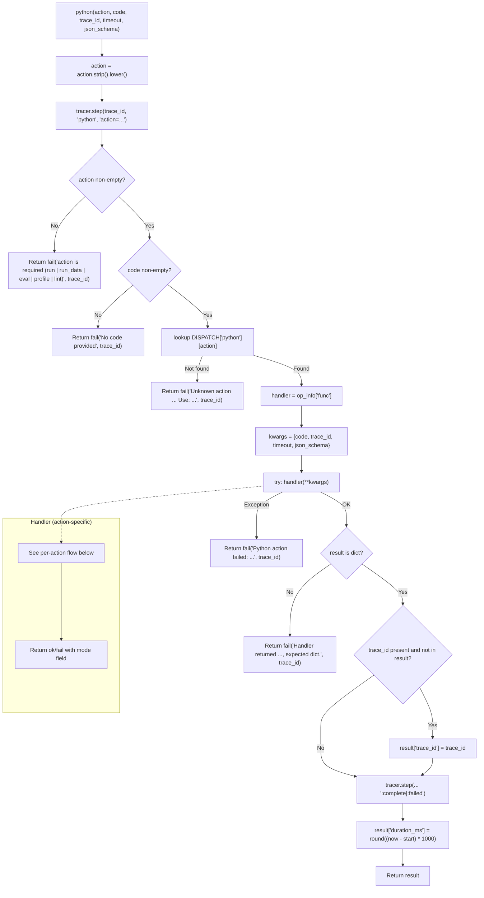

<- Back to [Python Overview](../PYTHON.md)

# 🏗️ Architecture

## 🔗 Source Code Reference

| File | Purpose |
|------|---------|
| `tools/python.py` | `@tool @meta_tool` facade (111 lines) — validates `action`, dispatches to handler via `DISPATCH`, wraps in `try/except`, threads `trace_id`, records `duration_ms`. All implementation logic moved to `python_ops/`. |
| `tools/python_ops/__init__.py` | Auto-discovery: globs `actions/*.py` and imports each so `@register_action` runs before the facade reads `DISPATCH` |
| `tools/python_ops/_registry.py` | `DISPATCH` dict + `register_action()` decorator. Duplicate registration raises `ValueError` loudly. `func` reference stored raw (no `functools.wraps` wrapper) so `@meta_tool` can introspect the parameter signature. |
| `tools/python_ops/sandbox.py` | `SAFE_BUILTINS`, `FORBIDDEN_IN_SANDBOX`, `DANGEROUS_*` sets, `_validate_sandbox_ast(code)` (statement-level), `_validate_eval_ast(code)` (expression-only). The security boundary for `run` / `eval`. |
| `tools/python_ops/imports.py` | `STDLIB_IMPORTS`, `HEAVY_IMPORTS`, `CORE_ALLOWED`, `BLOCKED_IMPORTS`, `ALL_ALLOWED`, `_parse_imports(code)`. The import policy used by `run_data`. |
| `tools/python_ops/executors.py` | `_STDOUT_LOCK` (thread-safe stdout), `_run_inprocess(code, imports)`, `_run_subprocess(code, timeout_override=-1)`, `_validate_against_schema(value, schema)`, `_validate_output_text_against_schema(output_text, schema_dict)`. The execution + JSON-schema validation helpers. |
| `tools/python_ops/actions/__init__.py` | Empty marker — exists so `Path.glob("*.py")` sees the package as a directory |
| `tools/python_ops/actions/run.py` | `@register_action("python", "run")` — strict sandbox, no imports, whitelisted builtins, AST-validated |
| `tools/python_ops/actions/run_data.py` | `@register_action("python", "run_data")` — controlled imports, stdlib in-process, heavy libs in subprocess |
| `tools/python_ops/actions/eval.py` | `@register_action("python", "eval")` — pure-expression evaluation, no statements, sandbox-validated (NEW in v1.0) |
| `tools/python_ops/actions/profile.py` | `@register_action("python", "profile")` — `cProfile` top-20 cumulative, subprocess if imports (NEW in v1.0, NOT sandboxed) |
| `tools/python_ops/actions/lint.py` | `@register_action("python", "lint")` — `ruff check --select E,F` (or `flake8` fallback), 10s hard timeout (NEW in v1.0) |
| `tools/_meta_tool.py` | Generic `@meta_tool(DISPATCH, doc_sections=...)` decorator — generates the `action: Literal[...]` annotation + action list in the docstring from `DISPATCH` keys. Shared infrastructure (also used by `consult`, `swarm`, `tavily`, `file`, `git`, `github`, `browser`, `web`, `report`). |
| `core/config.py` | `cfg.execution_timeout`, `cfg.workspace_root` — subprocess timeout + temp file directory |
| `core/contracts.py` | `ok()` / `fail()` — standardized return dicts |
| `core/memory_backend/pruner.py` | `prune_text()` — MCP context overflow prevention (called from `run` and `run_data`) |
| `core/tracer.py` | `tracer.step(trace_id, ...)` — called by the facade at entry, on failure, and on completion |
| `tests/tools/python/conftest.py` | Shared fixtures: `mock_cfg`, `mock_pruner` (dual patch — see Anti-Pattern #1 in INSTRUCTIONS.md), `temp_workspace`, `mock_tracer`, `make_subprocess_result()` factory |
| `tests/tools/python/test_run.py` | 27 tests — 8 classes (Success / ForbiddenTokens / ASTBlocks / SandboxError / EmptyCode / TraceID / JSONSchema / Duration) |
| `tests/tools/python/test_run_data.py` | 19 tests — 8 classes (StdlibInProcess / HeavySubprocess / BlockedImports / UnknownImports / SyntaxError / TimeoutOverride / EmptyCode / TraceID) |
| `tests/tools/python/test_eval.py` | 26 tests — 8 classes (Success / RejectsStatements / SandboxSecurity / ResultReturned / JSONSchema / EmptyCode / TraceID) |
| `tests/tools/python/test_profile.py` | 11 tests — 7 classes (SimpleInProcess / SubprocessRouting / OutputFormat / SyntaxError / EmptyCode / TraceID / TimeoutOverride) |
| `tests/tools/python/test_lint.py` | 13 tests — 7 classes (CleanCode / WithErrors / RuffNotInstalledFallback / NeitherInstalled / EmptyCode / TraceID / TimeoutEnforced) |
| `tests/tools/python/test_dispatch.py` | 15 tests — 3 classes (TestDispatch facade behavior + TestRegistry DISPATCH shape + TestFacadeSignature param defaults) |
| `tests/tools/python/test_sandbox_security.py` | 16 tests (Pre-v1, updated `mode`→`action`) — sandbox security: forbidden tokens, dangerous builtins, imports |
| `tests/tools/python/test_sandbox_ast_bypass.py` | 15 tests (Pre-v1, updated import path) — AST bypass vectors: `__builtins__`, `__subclasses__`, `getattr`, dynamic subscripts, metaclass attacks |
| `tests/tools/python/test_python_exec_thread_safety.py` | 3 tests (Pre-v1, updated `mode`→`action`) — thread-safe stdout capture (BUGFIX-2) |

> **11-file subpackage:** `python_ops/` has exactly 11 files: `__init__.py`, `_registry.py`, `sandbox.py`, `imports.py`, `executors.py`, and 6 files under `actions/` (`__init__.py` + `run.py` + `run_data.py` + `eval.py` + `profile.py` + `lint.py`). The old 367-line `tools/python.py` is now a 111-line facade — net implementation moved into the subpackage. Total subpackage LOC ≈ 1190.

---

## 🌳 Module Tree

```text
tools/python.py                                # @tool @meta_tool facade — dispatch + tracer + duration_ms (111 lines)
└── tools/python_ops/
    ├── __init__.py                            # Auto-discovery: Path.glob("actions/*.py") → import_module (27 lines)
    ├── _registry.py
    │   ├── DISPATCH: Dict[str, Dict[str, Dict[str, Any]]]   # {"python": {"run": {func, help, examples}, "run_data": ..., "eval": ..., "profile": ..., "lint": ...}}
    │   └── register_action(tool_name, action_name, help_text, examples)  # decorator (60 lines)
    ├── sandbox.py                             # Security boundary (157 lines)
    │   ├── SAFE_BUILTINS                      # 30+ whitelisted builtins (hash removed: DoS risk)
    │   ├── FORBIDDEN_IN_SANDBOX               # Fast-path tokens: __import__, eval(, exec(, open(, compile(
    │   ├── DANGEROUS_BUILTINS                 # AST-blocked: eval, exec, compile, open, __import__, input, breakpoint, globals, locals, vars, dir, getattr, setattr, delattr
    │   ├── DANGEROUS_MODULES                  # AST-blocked: os, sys, subprocess, shutil, socket, ctypes, multiprocessing
    │   ├── DANGEROUS_ATTRS                    # MRO traversal: __class__, __base__, __bases__, __subclasses__, __mro__, __dict__
    │   ├── DANGEROUS_NAMES                    # Direct name access: __builtins__
    │   ├── _validate_sandbox_ast(code)        # AST walk → (is_safe, error_message)
    │   └── _validate_eval_ast(code)           # ast.parse(mode='eval') → must be expression, then _validate_sandbox_ast (NEW)
    ├── imports.py                             # Import policy (78 lines)
    │   ├── STDLIB_IMPORTS                     # 29 fast stdlib modules (in-process)
    │   ├── HEAVY_IMPORTS                      # 11 heavy libs (subprocess): pandas, numpy, matplotlib, scipy, sklearn, seaborn, plotly, PIL, cv2, torch, tensorflow
    │   ├── CORE_ALLOWED                       # Granular: {"core.br_validator"} only
    │   ├── BLOCKED_IMPORTS                    # Never allowed: os, sys, subprocess, shutil, socket, pickle, multiprocessing, ctypes, importlib, builtins, signal, pty, tty, termios, fcntl, resource
    │   ├── ALL_ALLOWED                        # STDLIB_IMPORTS | HEAVY_IMPORTS | CORE_ALLOWED
    │   └── _parse_imports(code)               # AST walk → list of top-level module names (preserves `core.*` dotted path for granular check)
    ├── executors.py                           # Execution + schema validation helpers (232 lines)
    │   ├── _STDOUT_LOCK                       # threading.Lock guarding contextlib.redirect_stdout (BUGFIX-2)
    │   ├── _run_inprocess(code, import_names) # Stdlib execution: pre-imports modules into exec_globals, captures stdout
    │   ├── _run_subprocess(code, timeout_override=-1)  # Heavy-lib execution: temp .py file under cfg.workspace_root, subprocess.run, finally cleanup
    │   ├── _PY_TYPE_MAP                       # JSON Schema type → Python type mapping
    │   ├── _validate_against_schema(value, schema)            # Recursive: type/enum/required/properties/items (NEW)
    │   └── _validate_output_text_against_schema(text, schema) # Graceful: parse-as-JSON then validate (NEW)
    └── actions/
        ├── __init__.py                        # empty (auto-discovery contract docstring only)
        ├── run.py                             # @register_action("python", "run") — strict sandbox (119 lines)
        ├── run_data.py                        # @register_action("python", "run_data") — controlled imports (129 lines)
        ├── eval.py                            # @register_action("python", "eval") — pure expression (NEW, 112 lines)
        ├── profile.py                         # @register_action("python", "profile") — cProfile top-20 (NEW, 130 lines)
        └── lint.py                            # @register_action("python", "lint") — ruff/flake8 (NEW, 133 lines)
```

---

## 🔀 Dispatch Flow



### Per-Action Handler Flows

**`run` (strict sandbox):**
```text
1. Fast-path: FORBIDDEN_IN_SANDBOX string check → fail on match
2. _validate_sandbox_ast(code) → fail on dangerous AST node
3. _STDOUT_LOCK + contextlib.redirect_stdout + exec(code, {__builtins__: SAFE_BUILTINS}, locals)
4. output = stdout or str(locals)
5. prune_text(output) if stdout non-empty
6. json_schema (graceful): _validate_output_text_against_schema → append warning on mismatch
7. return ok(output, mode="sandbox")
```

**`run_data` (controlled imports):**
```text
1. ast.parse(code) → fail on SyntaxError
2. _parse_imports(code) → import names (preserves core.* dotted path)
3. BLOCKED_IMPORTS intersection → fail (security boundary)
4. ALL_ALLOWED check → fail on unknown import
5. Route: any HEAVY_IMPORTS → _run_subprocess(code, timeout_override=timeout)
         else → _run_inprocess(code, imports)
6. prune_text(output) on success
7. json_schema (graceful): _validate_output_text_against_schema → append warning on mismatch
8. return ok/fail with mode="in_process" or "subprocess"
```

**`eval` (pure expression):**
```text
1. _validate_eval_ast(code):
   a. ast.parse(code, mode='eval') — must be single expression, no statements
   b. _validate_sandbox_ast(code) — same security boundary as run
2. compile(ast, '<string>', 'eval') + eval(compiled, {__builtins__: SAFE_BUILTINS})
3. json_schema (STRICT): _validate_against_schema(result_value, schema) → fail on mismatch
   (strict because the value is a structured object, not arbitrary stdout text)
4. _stringify(result_value): JSON for dict/list/bool/None/numbers, else repr
5. return ok(str(result), mode="eval")
```

**`profile` (cProfile top-20):**
```text
1. ast.parse(code) → fail on SyntaxError
2. _parse_imports(code) → if non-empty, route to _profile_subprocess
   else _profile_inprocess
3. _profile_inprocess: cProfile.Profile + exec(code, full builtins) + pstats top-20
   _profile_subprocess: wrap code in _PROFILE_WRAPPER template + _run_subprocess
4. Forces mode="profile" on the result regardless of executor path
5. json_schema IGNORED (output is profiling data, not user data)
6. return ok(pstats_output, mode="profile")

NOTE: NOT sandboxed — profiling needs full builtins (cProfile, pstats, io).
Use only on trusted code (already passed lint or run/run_data validation).
```

**`lint` (ruff/flake8 pre-check):**
```text
1. shutil.which("ruff") → if present, run `ruff check --select E,F --no-cache <tmp>`
   elif shutil.which("flake8") → run `flake8 <tmp>`
   else → fail("Neither ruff nor flake8 is installed. Install with: pip install ruff")
2. Write code to tempfile.NamedTemporaryFile(suffix=".py")
3. subprocess.run(cmd, timeout=10)  # 10-second HARD cap
4. Combine stdout+stderr; "(tool reported no issues — clean)" if empty
5. Exit code 0 = clean; 1 = lint issues found (still success); >1 = tool error → fail
6. unlink temp file in finally block
7. json_schema IGNORED; timeout param IGNORED (documented for callers)
8. return ok(lint_output, mode="lint")
```

---

## 🛡️ Security Layers

The python tool applies security at **three** distinct layers, each owned by a separate module in `python_ops/`. The layers are designed to fail independently — a bypass in one layer is still caught by the next.

### Layer 1 — Sandbox (`sandbox.py`)

Used by: `run`, `eval`. **NOT** used by `run_data` (which uses Layer 2), `profile`, or `lint`.

- **`SAFE_BUILTINS`** — A dict of 30+ whitelisted builtins passed as `__builtins__` to `exec()`/`eval()`. Includes `print`, `range`, `len`, `int`, `float`, `str`, `bool`, `list`, `dict`, `set`, `tuple`, `sum`, `min`, `max`, `abs`, `round`, `enumerate`, `zip`, `map`, `filter`, `sorted`, `reversed`, `isinstance`, `issubclass`, `type`, `repr`, `any`, `all`, `chr`, `ord`, `hex`, `oct`, `bin`, `divmod`, `pow`, `True`, `False`, `None`. **`hash` was deliberately removed** — DoS risk via collision attacks (see INSTRUCTIONS.md NEVER DO #1).
- **`FORBIDDEN_IN_SANDBOX`** — Cheap string-matching fast path: `["__import__", "eval(", "exec(", "open(", "compile("]`. Catches obvious violations before AST parsing runs.
- **`DANGEROUS_BUILTINS`** — AST-level blocklist of builtin names that must not be called: `eval`, `exec`, `compile`, `open`, `__import__`, `input`, `breakpoint`, `globals`, `locals`, `vars`, `dir`, `getattr`, `setattr`, `delattr`.
- **`DANGEROUS_MODULES`** — AST-level blocklist of modules whose attributes must not be called: `os`, `sys`, `subprocess`, `shutil`, `socket`, `ctypes`, `multiprocessing`.
- **`DANGEROUS_ATTRS`** — AST-level blocklist of attributes that enable MRO traversal: `__class__`, `__base__`, `__bases__`, `__subclasses__`, `__mro__`, `__dict__`. These allow finding arbitrary classes already loaded in the interpreter (e.g., `subprocess.Popen`) without needing `__import__`.
- **`DANGEROUS_NAMES`** — Direct name access blocklist: `__builtins__` (which is a `Name` node in the AST, not an `Attribute`).
- **`_validate_sandbox_ast(code)`** — Walks the AST and rejects: imports (`ast.Import`, `ast.ImportFrom`), `DANGEROUS_NAMES` references, calls to `DANGEROUS_BUILTINS`, attribute access to `DANGEROUS_ATTRS`, calls to attributes on `DANGEROUS_MODULES`, dynamic subscripts accessing `DANGEROUS_BUILTINS` (e.g., `__builtins__["eval"]`), class definitions (metaclass attacks), async function defs, context managers (`with`). Returns `(is_safe, error_message)`.
- **`_validate_eval_ast(code)`** — NEW in v1.0. Stricter than `_validate_sandbox_ast`: first tries `ast.parse(code, mode='eval')` to ensure the code is a pure expression (any statement — assignment, loop, if, def, with — causes `SyntaxError` in `eval` mode), then composes `_validate_sandbox_ast(code)` for the same security boundary as `run`. Used only by the `eval` action.

### Layer 2 — Imports (`imports.py`)

Used by: `run_data`. (The `run` and `eval` actions bypass this layer entirely because they reject all imports at Layer 1.)

- **`STDLIB_IMPORTS`** — 29 fast stdlib modules safe for in-process execution: `random`, `json`, `math`, `statistics`, `datetime`, `calendar`, `collections`, `itertools`, `functools`, `re`, `csv`, `io`, `textwrap`, `string`, `decimal`, `fractions`, `heapq`, `bisect`, `pprint`, `copy`, `time`, `uuid`, `hashlib`, `base64`, `struct`, `dataclasses`, `typing`, `enum`, `abc`.
- **`HEAVY_IMPORTS`** — 11 heavy libs that route to subprocess: `pandas`, `numpy`, `matplotlib`, `scipy`, `sklearn`, `seaborn`, `plotly`, `PIL`, `cv2`, `torch`, `tensorflow`.
- **`CORE_ALLOWED`** — Granular internal-codebase allowlist: `{"core.br_validator"}` only. **No arbitrary `core.*` access** — the parser preserves the full dotted path for `core.*` imports so this granular check works.
- **`BLOCKED_IMPORTS`** — Never allowed, even in `run_data`: `os`, `sys`, `subprocess`, `shutil`, `socket`, `pickle`, `multiprocessing`, `ctypes`, `importlib`, `builtins`, `signal`, `pty`, `tty`, `termios`, `fcntl`, `resource`. These can access filesystem, processes, network, or environment vars — callers must use `file()`, `git()`, `web()` instead.
- **`ALL_ALLOWED`** — Union of `STDLIB_IMPORTS | HEAVY_IMPORTS | CORE_ALLOWED`. Anything not in this set is rejected.
- **`_parse_imports(code)`** — AST walk that returns top-level module names. For `core.*` imports, the full dotted path is preserved so `CORE_ALLOWED` can apply granular sub-module allowlisting; everything else yields the top-level package name only (e.g., `from os.path import X` yields `'os'`, not `'os.path'`).

### Layer 3 — Executors (`executors.py`)

Used by: `run_data` (both paths) and `profile` (subprocess path). The `run` action takes its own `_STDOUT_LOCK` and uses `exec()` directly with `SAFE_BUILTINS`; the `eval` action uses `eval()` directly with `SAFE_BUILTINS`.

- **`_STDOUT_LOCK`** — Module-level `threading.Lock` guarding `contextlib.redirect_stdout`. `contextlib.redirect_stdout` is reentrant but NOT cross-thread-safe because `sys.stdout` is process-global. The lock serializes stdout redirection so concurrent `python(action="run")` calls don't clobber each other's captured output. (BUGFIX-2 — see INSTRUCTIONS.md NEVER DO #2.)
- **`_run_inprocess(code, import_names)`** — Pre-loads each requested module into `exec_globals` (so the code can use the imported name without going through exec's import machinery, which would bypass the allowlist if the code itself contained an import statement we missed). Captures stdout via `contextlib.redirect_stdout`. Returns `ok(output, mode="in_process")` or `fail(error, mode="in_process")`.
- **`_run_subprocess(code, timeout_override=-1)`** — Writes code to a temp `.py` file under `cfg.workspace_root`, runs `[sys.executable, str(tmp)]` with `subprocess.run(capture_output=True, text=True, timeout=...)`. The `timeout_override` parameter is NEW in v1.0: `-1` (default) → uses `cfg.execution_timeout`; any non-negative int → overrides. Temp file is removed in a `finally` block; failures are tolerated. Returns `ok(stdout, mode="subprocess")`, `fail(stderr, mode="subprocess")`, or `fail("Timed out after Ns...", mode="subprocess")`.
- **`_validate_against_schema(value, schema)`** — NEW in v1.0. Best-effort JSON Schema validation without depending on the `jsonschema` package (not in `requirements.txt`). Supports a useful subset of keywords: `type` (string/integer/number/boolean/array/object/null), `enum`, `required`, `properties` (recursive), `items` (recursive). Bool-vs-int disambiguation: `bool` is a subclass of `int` in Python; the validator explicitly rejects boolean values when the schema declares `integer` or `number` to avoid silent type confusion. Returns `(ok, error_message)`.
- **`_validate_output_text_against_schema(output_text, schema_dict)`** — NEW in v1.0. Used by `run` and `run_data`: tries to parse `output_text` as JSON. If parsing fails OR validation fails, appends a warning to a list and returns the original output as-is (graceful degradation). If validation passes, returns the original output unchanged. Returns `(output_text, warnings_list)`.

> **Warning:** All three layers are defense-in-depth against LLM mistakes and prompt injection. They are NOT a security boundary against determined adversarial code. Do not expose the python tool to untrusted multi-tenant input without OS-level sandboxing.

---

## 🎭 The 5-Action Pattern

The python tool exposes 5 actions, each with distinct security semantics and output shape. The `@meta_tool` decorator auto-generates the `action: Literal["eval","lint","profile","run","run_data"]` annotation and the action list in the docstring from `DISPATCH` keys.

| Aspect | `run` | `run_data` | `eval` | `profile` | `lint` |
|--------|-------|------------|--------|-----------|--------|
| **Layer 1 (Sandbox)** | ✅ `_validate_sandbox_ast` | ❌ (uses Layer 2 instead) | ✅ `_validate_eval_ast` (stricter — expressions only) | ❌ NOT sandboxed (needs full builtins) | N/A (doesn't execute code) |
| **Layer 2 (Imports)** | ❌ (all imports blocked at Layer 1) | ✅ `BLOCKED_IMPORTS` + `ALL_ALLOWED` | ❌ (all imports blocked at Layer 1) | ⚠️ Routes to subprocess if any imports | N/A |
| **Layer 3 (Executors)** | `_STDOUT_LOCK` + `exec()` | `_run_inprocess` or `_run_subprocess` | `eval()` with `SAFE_BUILTINS` | `_profile_inprocess` or `_profile_subprocess` | `subprocess.run([ruff/flake8])` |
| **`timeout` param honored?** | ❌ Ignored (in-process) | ✅ Forwards to `_run_subprocess` | ❌ Ignored (in-process) | ✅ Forwards to `_run_subprocess` | ❌ Ignored (fixed 10s hard cap) |
| **`json_schema` semantics** | Graceful (warnings) | Graceful (warnings) | Strict (fail on mismatch) | Ignored | Ignored |
| **`mode` field in result** | `"sandbox"` | `"in_process"` or `"subprocess"` | `"eval"` | `"profile"` | `"lint"` |
| **Output semantics** | stdout from `print()` or env dump | stdout from `print()` | The expression value (stringified) | `pstats` top-20 cumulative | Linter stdout+stderr |
| **NEW in v1.0?** | ❌ (Pre-v1, renamed from `mode="run"`) | ❌ (Pre-v1, renamed from `mode="run_data"`) | ✅ NEW | ✅ NEW | ✅ NEW |

**Shared facade flow (identical across all 5 actions):** The `@tool @meta_tool` facade in `tools/python.py` does the same 8 steps for every action:
1. `action = action.strip().lower()` (case-insensitive, whitespace-tolerant)
2. `tracer.step(trace_id, "python", f"action={action}")`
3. Empty-action check → `fail("action is required (run | run_data | eval | profile | lint)", trace_id)`
4. Empty-code check → `fail("No code provided", trace_id)`
5. `DISPATCH["python"][action]` lookup → unknown-action `fail("Unknown action '<x>'. Use: ...", trace_id)`
6. `handler(**kwargs)` in `try/except Exception` → on exception `fail("Python action failed: <exc>", trace_id)`
7. Non-dict result check → `fail("Handler returned <type>, expected dict.", trace_id)`
8. Trace-id threading (only if non-empty and not already in result), tracer step, `duration_ms` unconditional attach

**Why 5 actions instead of one `mode` param:** The `@meta_tool` pattern treats each `action` value as a first-class entry in `DISPATCH` with its own handler function, help text, and examples. This gives the LLM calling `python` a clear schema (`action: Literal["eval","lint","profile","run","run_data"]`) and lets each handler evolve independently — e.g. `eval` can later add a `strict_types` param without touching `run` or `lint`. The breaking `mode`→`action` rename aligns python with every other `@meta_tool` tool (`consult`, `swarm`, `tavily`, `file`, `git`, `github`, `browser`, `web`, `report`).

**Why `eval` is strict and `run`/`run_data` are graceful for `json_schema`:** The `eval` action's output IS a structured Python object (the expression value) — `json_schema` validation is meaningful and a mismatch signals a real bug, so it returns `fail("Output does not match schema: ...")`. The `run`/`run_data` actions' output is arbitrary stdout text — `json_schema` is best-effort (parse-as-JSON then validate), so a mismatch appends a warning to `warnings[]` and returns the original output as-is. See API.md § JSON Schema Validation for details.

---

## 🧬 JSON Schema Validation (v1.0)

The `json_schema` param is NEW in v1.0. It accepts a JSON Schema string and is enforced differently per action:

| Action | Behavior | Rationale |
|--------|----------|-----------|
| `run` | **Graceful** — parse output as JSON, validate, append warning on mismatch, return output as-is | Output is arbitrary stdout text; JSON-ness isn't guaranteed |
| `run_data` | **Graceful** — same as `run` | Same rationale |
| `eval` | **Strict** — validate the expression value against schema, `fail` on mismatch | The value IS a structured object; mismatch is a real bug |
| `profile` | **Ignored** | Output is `pstats` data, not user data |
| `lint` | **Ignored** | Output is linter text, not user data |

**Supported JSON Schema keywords** (best-effort, no `jsonschema` dependency):
- `type` — One of `string`, `integer`, `number`, `boolean`, `array`, `object`, `null`. **Bool-vs-int disambiguation:** `bool` is a subclass of `int` in Python; the validator explicitly rejects boolean values when the schema declares `integer` or `number` to avoid silent type confusion.
- `enum` — Value must be in the enum list.
- `required` — For `object` types: every key in `required[]` must be present.
- `properties` — For `object` types: validate each present key's value against its sub-schema (recursive).
- `items` — For `array` types: validate each element against the items schema (recursive).

**Invalid `json_schema` string handling:**
- `run`/`run_data` — Append `"json_schema was provided but is not valid JSON — schema check skipped."` to `warnings[]`; output returned as-is.
- `eval` — Return `fail("json_schema was provided but is not valid JSON.", mode="eval")` (strict — caller error).
- `profile`/`lint` — Ignored (no validation runs).

**Why no `jsonschema` package dependency:** `jsonschema` is not in `requirements.txt`, and adding it would pull in `pyrsistent`, `attrs`, `rfc3339-validator`, `fqdn`, `isoduration`, `uri-template`, `webcolors`, and `referencing` transitively. The hand-rolled validator covers the keywords LLMs most commonly request (`type`, `enum`, `required`, `properties`, `items`) and keeps the dependency surface minimal. If a future caller needs `$ref`/`allOf`/`anyOf`/`oneOf`/`format` support, add `jsonschema` to requirements and swap `_validate_against_schema` for `jsonschema.validate()` — the call signature is compatible.

---

## 💡 Key Design Decisions

- **5-action decomposition** — `run` / `run_data` / `eval` / `profile` / `lint` are five independent behaviors with different security semantics. Splitting them via `@meta_tool` lets each evolve independently (e.g. `eval` can add a `strict_types` param without touching `run`). See [The 5-Action Pattern](#-the-5-action-pattern) above.
- **`@meta_tool` auto-discovery** — Adding a new action = drop a file in `python_ops/actions/` with `@register_action("python", "<name>", ...)`. The facade's `action: Literal[...]` annotation and docstring action list are regenerated from `DISPATCH` automatically. No edits to `python.py` needed.
- **Three-layer defense (sandbox → imports → executors)** — Each layer is owned by a separate module (`sandbox.py`, `imports.py`, `executors.py`) and can fail independently. A bypass in one layer is still caught by the next. The layers are designed for LLM-mistake defense, not adversarial security.
- **AST-based sandbox validation (Pre-v1)** — `_validate_sandbox_ast()` replaces brittle string-matching with syntax-tree analysis. Blocks imports, dangerous builtins, module attribute access, MRO traversal vectors, dynamic subscripts, metaclass attacks, and context managers. This is defense-in-depth against LLM mistakes and prompt injection, NOT a security boundary against determined adversarial code.
- **Fast-path + AST two-layer defense (Pre-v1)** — `FORBIDDEN_IN_SANDBOX` string check catches obvious violations cheaply. `_validate_sandbox_ast()` catches obfuscated bypasses authoritatively.
- **`_validate_eval_ast` is stricter than `_validate_sandbox_ast`** — NEW in v1.0. The `eval` action rejects ALL statements (assignments, loops, ifs, defs, with) by first parsing in `mode='eval'`. Only pure expressions survive. Then it composes `_validate_sandbox_ast` for the same security boundary as `run`.
- **Thread-safe stdout capture (Pre-v1, BUGFIX-2)** — `_STDOUT_LOCK` prevents cross-thread clobbering. `contextlib.redirect_stdout` is reentrant but NOT cross-thread-safe because `sys.stdout` is process-global.
- **Import allowlisting with security boundary (Pre-v1)** — `STDLIB_IMPORTS` + `HEAVY_IMPORTS` + `CORE_ALLOWED` are allowed; `BLOCKED_IMPORTS` (os, sys, subprocess, shutil, socket, etc.) are never allowed even in `run_data`. The `core.*` dotted path is preserved by `_parse_imports` so `CORE_ALLOWED` can apply granular sub-module allowlisting.
- **Subprocess isolation for heavy libs (Pre-v1)** — `pandas`, `numpy`, `matplotlib`, etc. run in a subprocess with timeout. First import is slow but worth isolating. The `timeout_override` param (NEW in v1.0) lets callers override `cfg.execution_timeout` per-call.
- **`profile` is NOT sandboxed** — Profiling requires full builtins access (`cProfile`, `pstats`, `io`) and the profiled code may need imports. Restricting builtins would defeat the purpose. Use only on trusted code (already passed `lint` or `run`/`run_data` validation).
- **`lint` uses `shutil.which`, not try/import** — Ruff and flake8 are CLI tools, not Python modules. `shutil.which()` detects them on `PATH` without trying to import them. 10-second hard timeout because linting should be fast.
- **`eval` is strict on `json_schema`; `run`/`run_data` are graceful** — The `eval` action's output IS a structured Python object (the expression value), so `json_schema` mismatch is a real bug → `fail`. The `run`/`run_data` actions' output is arbitrary stdout text, so `json_schema` is best-effort → append warning, return output as-is. See [JSON Schema Validation](#-json-schema-validation-v10) above.
- **No `jsonschema` package dependency** — Best-effort validation supports `type`, `enum`, `required`, `properties`, `items` keywords. Sufficient for tool-output contract enforcement without pulling in 8 transitive dependencies. Swap-in compatible if a future caller needs full JSON Schema.
- **Result pruning (Pre-v1)** — `prune_text()` prevents MCP context overflow on large outputs (e.g., pandas DataFrame dumps). Applied only to stdout output, not env dumps.
- **Always print() reminder** — The docstring and error messages remind the LLM to use `print()` to return results. Variables are not captured automatically — except in `eval`, where the expression value IS the output.
- **Clean error messages (Pre-v1)** — Errors tell the model exactly what went wrong and which action to use (e.g., "Use action='run_data' for code that needs imports or file access.").
- **`duration_ms` always present (v1.0)** — The facade records start time, calls the handler, then unconditionally sets `result["duration_ms"]`. Even error returns carry the timing — useful for SLO debugging without separate instrumentation.
- **`trace_id` conditional inclusion (v1.0)** — Added to the response only when the caller passed a non-empty `trace_id`. Keeps the response shape clean for ad-hoc `python(action="run", code="...")` calls while still threading observability when called from a workflow.

---

## 🧪 Testing

```powershell
# Run all python tests (145 tests across 10 files)
.\venv\Scripts\pytest tests/tools/python/ -W error --tb=short -v
```

> **Note:** Ensure `pytest` resolves to your venv. If not, use `python -m pytest` or the full venv path (`venv\Scripts\pytest.exe` on Windows, `venv/bin/pytest` on Unix). `ruff` must be installed (`pip install ruff`) for the lint action tests — without it, 2 tests in `test_lint.py` (`TestLintCleanCode`, `TestLintWithErrors`) fall through to the flake8 fallback path or the neither-installed fail path.

**Test layout:**
```text
tests/tools/python/
├── conftest.py                          # 93 lines — Shared fixtures (mock_cfg, mock_pruner, temp_workspace, mock_tracer, make_subprocess_result)
├── test_run.py                          # 27 tests — 8 classes (Success/ForbiddenTokens/ASTBlocks/SandboxError/EmptyCode/TraceID/JSONSchema/Duration)
├── test_run_data.py                     # 19 tests — 8 classes (StdlibInProcess/HeavySubprocess/BlockedImports/UnknownImports/SyntaxError/TimeoutOverride/EmptyCode/TraceID)
├── test_eval.py                         # 26 tests — 8 classes (Success/RejectsStatements/SandboxSecurity/ResultReturned/JSONSchema/EmptyCode/TraceID)
├── test_profile.py                      # 11 tests — 7 classes (SimpleInProcess/SubprocessRouting/OutputFormat/SyntaxError/EmptyCode/TraceID/TimeoutOverride)
├── test_lint.py                         # 13 tests — 7 classes (CleanCode/WithErrors/RuffNotInstalledFallback/NeitherInstalled/EmptyCode/TraceID/TimeoutEnforced)
├── test_dispatch.py                     # 15 tests — 3 classes (TestDispatch facade + TestRegistry DISPATCH shape + TestFacadeSignature param defaults)
├── test_sandbox_security.py             # 16 tests (Pre-v1, updated mode→action) — sandbox security: forbidden tokens, dangerous builtins, imports
├── test_sandbox_ast_bypass.py           # 15 tests (Pre-v1, updated import path) — AST bypass vectors: __builtins__, __subclasses__, getattr, dynamic subscripts, metaclass attacks
└── test_python_exec_thread_safety.py    # 3 tests (Pre-v1, updated mode→action) — thread-safe stdout capture (BUGFIX-2)
```

**Total: 145 tests across 10 files.** The Pre-v1 layout had 3 files / 34 tests; v1.0 adds 7 new files (conftest + 5 action tests + test_dispatch) and updates the 3 existing files for the breaking `mode`→`action` rename and the `_validate_sandbox_ast` import-path move.

**Mock strategy (dual-patch surface in `conftest.py`):**
- Patch `tools.python_ops.executors.cfg` (via `mock_cfg`) → controls `execution_timeout`, `workspace_root`
- Patch `tools.python_ops.actions.run.prune_text` AND `tools.python_ops.actions.run_data.prune_text` (via `mock_pruner`) → both action modules `from ... import prune_text` at the top, so the patch must target each binding site individually (see INSTRUCTIONS.md Anti-Pattern #1 — the import-time-binding lesson)
- Patch `core.tracer.tracer` (via `mock_tracer`) → no-op for tests that don't assert tracer calls
- `temp_workspace` fixture yields a real tmpdir for subprocess tests that exercise the actual `_run_subprocess` code path
- `make_subprocess_result()` factory for fake `CompletedProcess` objects (used by lint tests to mock `subprocess.run`)

**Subprocess tests are mocked:** `test_run_data.py` patches `tools.python_ops.actions.run_data._run_subprocess` to avoid actually spinning up Python subprocesses (slow + fragile in CI). `test_profile.py` does the same for `tools.python_ops.actions.profile._run_subprocess`. `test_lint.py` patches `subprocess.run` directly to inject fake `CompletedProcess` results.

---

*Last updated: 2026-07-15 (v1.0). See [API.md](API.md) for action details, [CHANGELOG.md](CHANGELOG.md) for version history, [INSTRUCTIONS.md](INSTRUCTIONS.md) for AI editing rules.*
