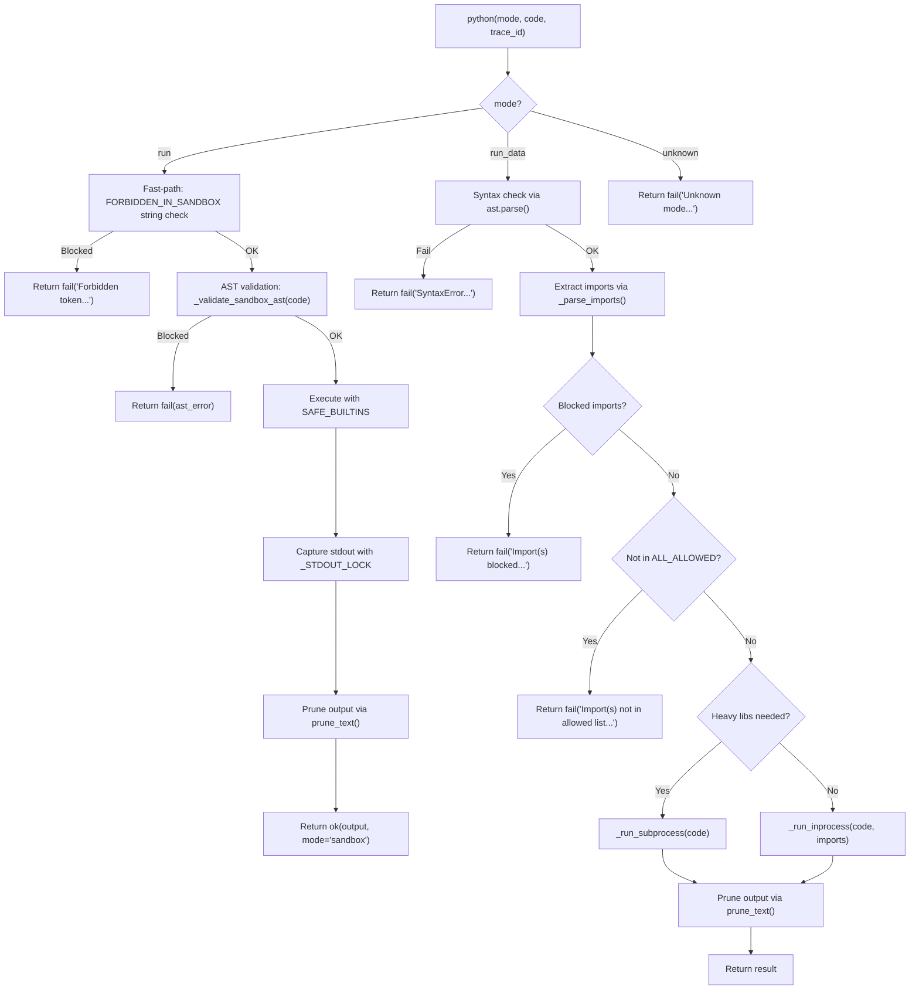

<- Back to [Python Overview](../PYTHON.md)

# 🏗️ Architecture

## 🔗 Source Code Reference

| File | Purpose |
|------|---------|
| `tools/python.py` | `@tool` facade: mode dispatch, sandbox validation, import checking, execution |
| `core/config.py` | `cfg.execution_timeout`, `cfg.workspace_root` |
| `core/contracts.py` | `ok()` / `fail()` — standardized return dicts |
| `core/memory_backend/pruner.py` | `prune_text()` — MCP context overflow prevention |
| `tests/tools/python/` | Test files (to be restructured — see roadmap) |

---

## 🌳 Module Tree

```text
tools/python.py
├── python(mode, code, trace_id)           # @tool facade — mode dispatch, validation, execution
├── _validate_sandbox_ast(code)            # AST-based security validation (P0)
├── _parse_imports(code)                   # Extract top-level import names from AST
├── _run_inprocess(code, import_names)     # Stdlib execution in current process
├── _run_subprocess(code)                  # Heavy-lib execution in isolated subprocess
├── SAFE_BUILTINS                          # Whitelisted builtins for sandbox mode
├── FORBIDDEN_IN_SANDBOX                 # Fast-path string tokens for sandbox
├── DANGEROUS_BUILTINS                   # AST-blocked builtins (eval, exec, open, etc.)
├── DANGEROUS_MODULES                    # AST-blocked modules (os, sys, subprocess, etc.)
├── DANGEROUS_ATTRS                      # MRO traversal vectors (__class__, __subclasses__, etc.)
├── DANGEROUS_NAMES                      # Direct name access (__builtins__)
├── STDLIB_IMPORTS                       # Allowed stdlib modules for run_data
├── HEAVY_IMPORTS                        # Allowed heavy libs for run_data (subprocess)
├── CORE_ALLOWED                         # Granular core module allowlist
├── BLOCKED_IMPORTS                      # Never-allowed modules (security boundary)
└── _STDOUT_LOCK                         # Thread-safe stdout capture lock
```

---

## 🔀 Dispatch Flow



---

## 💡 Key Design Decisions

- **Dual-mode execution** — `run` for pure logic (fast, in-process, no imports), `run_data` for data analysis (controlled imports, subprocess isolation for heavy libs).
- **AST-based sandbox validation (P0)** — `_validate_sandbox_ast()` replaces brittle string-matching with syntax-tree analysis. Blocks imports, dangerous builtins, module attribute access, MRO traversal vectors, and metaclass attacks. This is defense-in-depth against LLM mistakes and prompt injection, NOT a security boundary against determined adversarial code.
- **Fast-path + AST two-layer defense** — `FORBIDDEN_IN_SANDBOX` string check catches obvious violations cheaply. `_validate_sandbox_ast()` catches obfuscated bypasses authoritatively.
- **Thread-safe stdout capture** — `_STDOUT_LOCK` prevents cross-thread clobbering. `contextlib.redirect_stdout` is reentrant but NOT cross-thread-safe because `sys.stdout` is process-global.
- **Import allowlisting with security boundary** — `STDLIB_IMPORTS` + `HEAVY_IMPORTS` + `CORE_ALLOWED` are allowed. `BLOCKED_IMPORTS` (os, sys, subprocess, shutil, socket, etc.) are never allowed even in `run_data`.
- **Granular core module allowlist** — Only `core.br_validator` is allowed from the project codebase. No arbitrary `core.*` access.
- **Subprocess isolation for heavy libs** — `pandas`, `numpy`, `matplotlib`, etc. run in a subprocess with timeout. First import is slow but worth isolating.
- **Result pruning** — `prune_text()` prevents MCP context overflow on large outputs (e.g., pandas DataFrame dumps).
- **Always print() reminder** — The docstring and error messages remind the LLM to use `print()` to return results. Variables are not captured automatically.
- **Clean error messages** — Errors tell the model exactly what went wrong and which mode to use (e.g., "Use mode='run_data' for code that needs imports").

---

## 🧪 Testing

```powershell
# Run all python tests
.\venv\Scripts\python tests/tools/python/ -W error --tb=short -v
```

> **Note:** Ensure `pytest` resolves to your venv. If not, use `python -m pytest` or the full venv path (`venv\Scripts\pytest.exe` on Windows, `venv/bin/pytest` on Unix).

**Current test layout:**
```text
tests/tools/python/
├── __init__.py
├── test_python_exec_thread_safety.py   # Thread-safe stdout capture (BUGFIX-2)
├── test_sandbox_ast_bypass.py          # AST sandbox bypass attempts
└── test_sandbox_security.py            # Sandbox security: forbidden tokens, dangerous builtins, imports
```

**Mock strategy:**
- Patch `core.config.cfg.execution_timeout` for subprocess timeout tests
- Patch `core.config.cfg.workspace_root` for temp file location
- Patch `core.memory_backend.pruner.prune_text` to test pruning integration
- Test AST bypass vectors: `__builtins__`, `__subclasses__`, `getattr`, dynamic subscripts, metaclass attacks
- Test thread safety: concurrent `python()` calls with `_STDOUT_LOCK`

**Future test restructure (see roadmap):**
```text
tests/tools/python/
├── conftest.py                          # Shared fixtures: mock_cfg, mock_pruner
├── test_python_validation.py            # Mode validation, empty code, unknown mode
├── test_python_sandbox.py             # Sandbox: SAFE_BUILTINS, forbidden tokens, AST validation
├── test_python_sandbox_ast_bypass.py    # AST bypass vectors (existing)
├── test_python_run_data_imports.py      # Import parsing, blocked imports, allowed lists
├── test_python_run_data_execution.py    # In-process vs subprocess dispatch
├── test_python_thread_safety.py         # _STDOUT_LOCK concurrent execution (existing)
├── test_python_subprocess.py            # Subprocess: timeout, temp file cleanup, return codes
├── test_python_output.py                # Output format, pruning, no-output handling
└── test_python_integration.py           # End-to-end with real code execution
```

---

*Last updated: 2026-07-03. See [API.md](API.md) for action details, [CHANGELOG.md](CHANGELOG.md) for version history, [INSTRUCTIONS.md](INSTRUCTIONS.md) for AI editing rules.*
