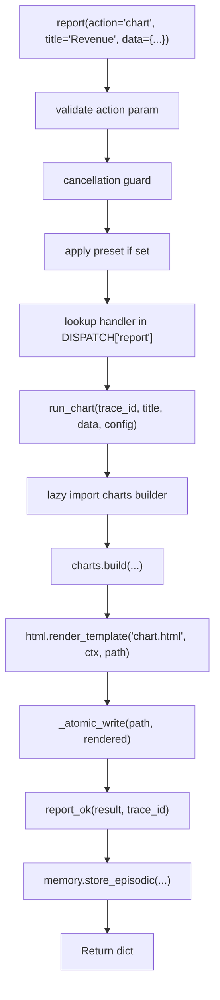

<- Back to [Report Overview](../REPORT.md)

# 🏗️ Architecture

## 🔗 Source Code Reference

| File | Purpose |
|------|---------|
| `tools/report.py` | `@tool` facade: validation, preset merge, dispatch, memory hook |
| `tools/_meta_tool.py` | `@meta_tool` decorator: auto `Literal`, docstring (shared with git/file/cli) |
| `tools/report_ops/_registry.py` | `DISPATCH` dict, `@register_action`, `DISPATCH_METADATA`, `PRESETS` |
| `tools/report_ops/__init__.py` | Auto-discovery: glob + importlib for `actions/*.py` |
| `tools/report_ops/contracts.py` | `report_ok`, `report_fail` return contracts |
| `tools/report_ops/paths.py` | `report_out_dir()`, `report_manifest_path()` |
| `tools/report_ops/data.py` | `load_data()` with SSRF + UNC blocking |
| `tools/report_ops/charts.py` | Chart.js config builder |
| `tools/report_ops/maps.py` | Leaflet.js map builder |
| `tools/report_ops/diagrams.py` | Mermaid.js diagram builder |
| `tools/report_ops/html.py` | Jinja2 renderer, `_atomic_write`, manifest/metrics writers |
| `tools/report_ops/export.py` | Playwright PDF/PNG export (lazy, optional) |
| `tools/report_ops/compare.py` | Side-by-side diff builder |
| `tools/report_ops/timeline.py` | SVG Gantt chart builder |
| `tools/report_ops/scorecard.py` | RAG status + radar chart builder |
| `tools/report_ops/actions/*.py` | Atomic action wrappers (11 files) |
| `tools/report_ops/templates/*.html` | Jinja2 templates (10 files) |
| `tests/tools/report/` | 21 test files + conftest.py |
| `tests/tools/report/conftest.py` | `mock_cfg` fixture (autouse) |
| `core/path_guard.py` | Centralized path validation |
| `core/gateway_backend/routes/reports.py` | Gateway API for listing reports |

---

## 🌳 Module Tree

```text
tools/report.py             # @tool facade — validation, preset merge, dispatch, memory hook
tools/_meta_tool.py         # @meta_tool decorator — auto Literal + docstring (shared)
tools/report_ops/
├── _registry.py            # DISPATCH dict + @register_action + DISPATCH_METADATA + PRESETS
├── __init__.py             # Auto-discovery: glob(actions/*.py) + importlib
├── contracts.py            # report_ok / report_fail with trace_id injection
├── paths.py                # Per-run folder resolver (workspace/reports/{trace_id}/)
├── data.py                 # CSV/JSON/Excel/SQLite loader with SSRF + UNC guard
├── charts.py               # Chart.js config builder (lazy jinja2 import)
├── maps.py                 # Leaflet.js map builder (lazy jinja2 import)
├── diagrams.py             # Mermaid.js diagram builder (lazy jinja2 import)
├── html.py                 # Jinja2 renderer + _atomic_write + manifest/metrics writers
├── export.py               # Playwright PDF/PNG export (lazy import, optional)
├── compare.py              # Side-by-side diff table builder
├── timeline.py             # SVG Gantt chart builder
├── scorecard.py            # RAG status dashboard + radar chart builder
└── actions/                # Atomic action wrappers (one file per action)
    ├── chart.py            # @register_action("report", "chart")
    ├── map.py
    ├── report.py
    ├── dashboard.py
    ├── diagram.py
    ├── export.py
    ├── compare.py
    ├── timeline.py
    ├── scorecard.py
    ├── list.py             # Returns all available actions
    └── help.py             # Returns metadata for specific action

tools/report_ops/templates/
├── base.html           # Layout + sidebar + theme toggle + CSS
├── macros.html         # Reusable components (kpi_card, data_table, bug_card, etc.)
├── chart.html          # Dedicated Chart.js canvas template (NEW v1.1)
├── report.html         # Single-scroll report sections
├── dashboard.html      # Multi-panel tabs + KPIs
├── map.html            # Full-screen Leaflet map
├── diagram.html        # Mermaid architecture diagram
├── compare.html        # Side-by-side diff with delta highlighting
├── timeline.html       # SVG Gantt + event list
└── scorecard.html      # RAG cards + radar chart
```

---

## 🔀 Dispatch Flow



---

## 💡 Key Design Decisions

- **Unified DISPATCH** — Single dict holds all actions, handlers, help text, examples. `@meta_tool` reads it to generate schema and docstring. One source. Zero drift.
- **Auto-discovery** — Drop a new file in `actions/` with `@register_action` and it's immediately available. No manual registry updates.
- **Lazy imports** — All heavy modules (pandas, jinja2, plotly, playwright) are imported inside function bodies. MCP startup stays fast.
- **Thin facade** — `report()` validates, merges preset, dispatches, wraps result, fires memory hook. Business logic lives in builders + action wrappers.
- **Template safety** — All user-controlled text is auto-escaped by Jinja2. JSON blobs in `<script>` tags are `</script>`-escaped before render.
- **Atomic writes** — All file writes use temp file + `os.replace` to prevent partial files on crash.

---

## 🧪 Testing

```powershell
# Run all report tests
.\venv\Scripts\python tests/tools/report/ -W error --tb=short -v

> **Note:** Ensure `pytest` resolves to your venv. If not, use `python -m pytest` or the full venv path (`venv\Scripts\pytest.exe` on Windows, `venv/bin/pytest` on Unix).
```

**Test architecture:**
- `conftest.py` provides `mock_cfg` (autouse, redirects roots to `tmp_path`)
- Tests are **fully isolated** — real file operations in `tmp_path`, no mocking for integration tests
- One test file per concern (dispatch, contracts, paths, data, each builder, XSS, cancellation, etc.)
- `test_report_real_integration.py` exercises real `resolve_path` with real files (no monkeypatch)

**Test file layout:**
```text
tests/tools/report/
├── conftest.py                           # Shared fixtures (autouse cfg mock)
├── test_report_dispatch.py               # Unknown/empty/case-insensitive actions
├── test_report_contracts.py              # report_ok / report_fail
├── test_report_paths.py                  # report_out_dir, sanitization, manifest paths
├── test_report_data.py                   # load_data: inline, file, CSV, JSON, URL/UNC blocking
├── test_report_chart.py                  # Chart.js config, palette, build
├── test_report_map.py                    # Leaflet map build
├── test_report_diagram.py                # Mermaid diagram build
├── test_report_html.py                   # render_template, atomic write, manifest/metrics
├── test_report_compare.py                # Side-by-side diff: dict, table, list modes
├── test_report_timeline.py               # SVG Gantt: parse, build, escape
├── test_report_scorecard.py              # RAG status, radar config, weighted score
├── test_report_export.py                 # PDF/PNG export, Playwright fallback
├── test_report_presets.py                # Preset merge, override, unknown preset
├── test_report_registry.py               # DISPATCH keys, metadata coverage, PRESETS
├── test_report_list.py                   # report.list action via facade
├── test_report_help.py                   # report.help action via facade
├── test_report_xss.py                    # XSS injection: text, mermaid, collapsible
├── test_report_cancellation.py           # Cancellation guard (BaseException)
├── test_report_real_integration.py       # Full stack: facade → builder → template → filesystem
└── test_report_gateway.py                # metrics.json + gateway backend routes
```

---

*Last updated: 2026-07-03. See [API.md](API.md) for action details, [CHANGELOG.md](CHANGELOG.md) for version history, [INSTRUCTIONS.md](INSTRUCTIONS.md) for AI editing rules.*
