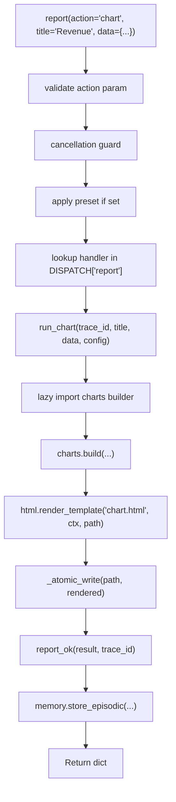
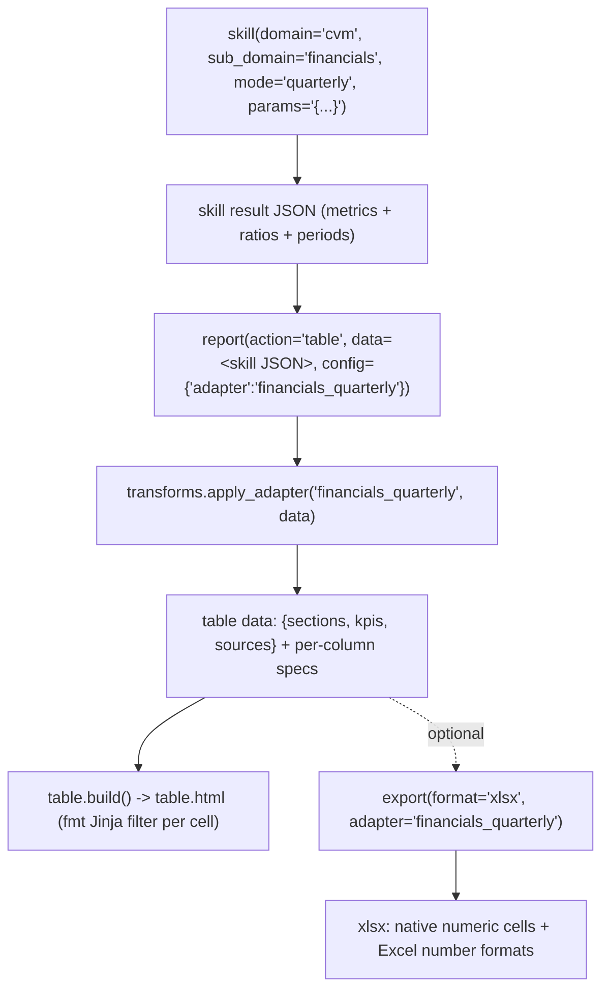

<- Back to [Report Overview](../REPORT.md)

# 🏗️ Architecture

## 🔗 Source Code Reference

| File | Purpose |
|------|---------|
| `tools/report.py` | `@tool` facade: validation, preset merge, dispatch, memory hook |
| `tools/_meta_tool.py` | `@meta_tool` decorator: auto `Literal`, docstring (shared with git/file/cli) |
| `tools/report_ops/_registry.py` | `DISPATCH` dict, `@register_action`, `DISPATCH_METADATA`, `PRESETS` |
| `tools/report_ops/__init__.py` | Auto-discovery: glob + importlib for `actions/*.py` |
| `tools/report_ops/contracts.py` | `report_ok`, `report_fail` return contracts |
| `tools/report_ops/paths.py` | `report_out_dir()`, `report_manifest_path()` |
| `tools/report_ops/data.py` | `load_data()` with SSRF + UNC blocking |
| `tools/report_ops/formats.py` | Number formatting specs (brl/pct/...) + Jinja filter fns + Excel number formats (v1.2) |
| `tools/report_ops/charts.py` | Chart.js config builder |
| `tools/report_ops/maps.py` | Leaflet.js map builder |
| `tools/report_ops/diagrams.py` | Mermaid.js diagram builder |
| `tools/report_ops/html.py` | Jinja2 renderer (registers `formats` filters), `_atomic_write`, manifest/metrics writers |
| `tools/report_ops/export.py` | Playwright PDF/PNG + openpyxl xlsx export (lazy, optional) |
| `tools/report_ops/compare.py` | Side-by-side diff builder |
| `tools/report_ops/timeline.py` | SVG Gantt chart builder |
| `tools/report_ops/scorecard.py` | RAG status + radar chart builder |
| `tools/report_ops/table.py` | Tabular statement builder (v1.2) |
| `tools/report_ops/adapters/` | Skill JSON → table/chart/report data adapters (v1.10, 76 adapters across 26 modules) |
| `tools/report_ops/actions/*.py` | Atomic action wrappers (12 files) |
| `tools/report_ops/templates/*.html` | Jinja2 templates (11 files) |
| `tests/tools/report/` | 21 test files + conftest.py |
| `tests/tools/report/conftest.py` | `mock_cfg` fixture (autouse) |
| `core/path_guard.py` | Centralized path validation |
| `core/gateway_backend/routes/reports.py` | Gateway API for listing reports |

---

## 🌳 Module Tree

```text
tools/report.py             # @tool facade — validation, preset merge, dispatch, memory hook
tools/_meta_tool.py         # @meta_tool decorator — auto Literal + docstring (shared)
tools/report_ops/
├── _registry.py            # DISPATCH dict + @register_action + DISPATCH_METADATA + PRESETS
├── __init__.py             # Auto-discovery: glob(actions/*.py) + importlib
├── contracts.py            # report_ok / report_fail with trace_id injection
├── paths.py                # Per-run folder resolver (workspace/reports/{trace_id}/)
├── data.py                 # CSV/JSON/Excel/SQLite loader with SSRF + UNC guard
├── formats.py              # Number formatting specs + Jinja filter fns + Excel formats (v1.2)
├── charts.py               # Chart.js config builder (lazy jinja2 import)
├── maps.py                 # Leaflet.js map builder (lazy jinja2 import)
├── diagrams.py             # Mermaid.js diagram builder (lazy jinja2 import)
├── html.py                 # Jinja2 renderer (registers formats filters) + _atomic_write + manifest/metrics
├── export.py               # Playwright PDF/PNG + openpyxl xlsx export (lazy, optional)
├── compare.py              # Side-by-side diff table builder
├── timeline.py             # SVG Gantt chart builder
├── scorecard.py            # RAG status dashboard + radar chart builder
├── table.py                # Tabular statement builder (v1.2)
├── adapters/             # Skill JSON → table data adapters (v1.2)
│   ├── __init__.py         # ADAPTERS registry + @register_adapter + apply_adapter + helpers
│   ├── financials.py       # financials_{quarterly,annual,summary}
│   ├── valuation.py        # valuation_{ratios,summary}
│   ├── shareholders.py     # shareholders_{shareholders,free_float,equity_structure,summary}
│   ├── dividends.py        # dividends_{history,annual,summary}
│   ├── comparison.py       # comparison_{side_by_side,summary,growth}  (v1.2.1+)
│   ├── screener.py         # screener_sector  (v1.2.5+)
│   ├── historical.py       # historical_*  (v1.3+)
│   ├── governance.py       # governance_*  (v1.3+)
│   ├── insider.py          # insider_*  (v1.3+)
│   ├── backtest.py         # backtest_*  (v1.3+)
│   ├── cotahist.py         # cotahist table adapters  (v1.3+)
│   ├── cotahist_chart.py   # cotahist_close_chart  (v1.2.3+)
│   ├── cotahist_candlestick.py  # cotahist_candlestick_chart  (v1.2.6+)
│   ├── financials_chart.py # financials_quarterly_chart  (v1.2.2+)
│   ├── financials_dashboard.py  # financials_dashboard  (v1.5 — 7-tab dashboard adapter; v1.9 KPI pass-through fix)
│   ├── financials_statement.py  # financials_statement  (v1.9 — generic statement adapter for bpa/bpp/dre/dfc/dva)
│   ├── valuation_dashboard.py   # valuation_dashboard  (v1.5 — 5-tab dashboard adapter)
│   ├── backtest_dashboard.py    # backtest_dashboard  (v1.6 — 3-tab dashboard adapter)
│   ├── comparison_dashboard.py  # comparison_dashboard  (v1.6 — 5-tab dashboard adapter)
│   ├── dividends_dashboard.py   # dividends_dashboard  (v1.7 — multi-tab dashboard adapter)
│   ├── governance_dashboard.py  # governance_dashboard  (v1.7 — multi-tab dashboard adapter)
│   ├── historical_dashboard.py  # historical_dashboard  (v1.7 — multi-tab dashboard adapter)
│   ├── screener_dashboard.py     # screener_dashboard  (v1.8 — multi-tab dashboard adapter)
│   ├── shareholders_dashboard.py # shareholders_dashboard  (v1.8 — multi-tab dashboard adapter)
│   ├── insider_dashboard.py      # insider_dashboard  (v1.8 — multi-tab dashboard adapter)
│   └── investsite_dashboard.py   # investsite_dashboard  (v1.8 — multi-tab dashboard adapter)
└── actions/                # Atomic action wrappers (one file per action)
    ├── chart.py            # @register_action("report", "chart")
    ├── map.py
    ├── report.py
    ├── dashboard.py
    ├── diagram.py
    ├── export.py
    ├── compare.py
    ├── timeline.py
    ├── scorecard.py
    ├── table.py            # @register_action("report", "table")  (v1.2)
    ├── list.py             # Returns all available actions
    └── help.py             # Returns metadata for specific action

tools/report_ops/templates/
├── base.html           # Layout + sidebar + theme toggle + CSS
├── macros.html         # Reusable components (kpi_card, data_table, bug_card, statement_table, ratio_grid, two_column, subtabs, ...)  — v1.5 added statement/ratio_grid/two_column; v1.9 added subtabs
├── chart.html          # Dedicated Chart.js canvas template (NEW v1.1)
├── report.html         # Single-scroll report sections
├── dashboard.html      # Multi-panel tabs + KPIs + subtabs (v1.9 added subtabs dispatch + centered body)
├── map.html            # Full-screen Leaflet map
├── diagram.html        # Mermaid architecture diagram
├── compare.html        # Side-by-side diff with delta highlighting
├── timeline.html       # SVG Gantt + event list
├── scorecard.html      # RAG cards + radar chart
└── table.html          # Multi-table statements + per-column fmt + search (v1.2)
```

---

## 🔀 Dispatch Flow


```mermaid
graph TD
    A["report(action='chart', title='Revenue', data={...})"] --> B["validate action param"]
    B --> C["cancellation guard"]
    C --> D["apply preset if set"]
    D --> E["lookup handler in DISPATCH['report']"]
    E --> F["run_chart(trace_id, title, data, config)"]
    F --> G["lazy import charts builder"]
    G --> H["charts.build(...)"]
    H --> I["html.render_template('chart.html', ctx, path)"]
    I --> J["_atomic_write(path, rendered)"]
    J --> K["report_ok(result, trace_id)"]
    K --> L["memory.store_episodic(...)"]
    L --> M["Return dict"]
```

### v1.2 — Skill → table → xlsx flow


```mermaid
graph TD
    S["skill(domain='cvm', sub_domain='financials', mode='quarterly', params='{...}')"]
    S --> SK["skill result JSON (metrics + ratios + periods)"]
    SK --> R["report(action='table', data=&lt;skill JSON&gt;, config={'adapter':'financials_quarterly'})"]
    R --> AD["transforms.apply_adapter('financials_quarterly', data)"]
    AD --> TD["table data: {sections, kpis, sources} + per-column specs"]
    TD --> TBL["table.build() -> table.html (fmt Jinja filter per cell)"]
    TD -.optional.-> X["export(format='xlsx', adapter='financials_quarterly')"]
    X --> XLSX["xlsx: native numeric cells + Excel number formats"]
```


---

## 💡 Key Design Decisions

- **Unified DISPATCH** — Single dict holds all actions, handlers, help text, examples. `@meta_tool` reads it to generate schema and docstring. One source. Zero drift.
- **Auto-discovery** — Drop a new file in `actions/` with `@register_action` and it's immediately available. No manual registry updates.
- **Lazy imports** — All heavy modules (pandas, jinja2, plotly, playwright, openpyxl) are imported inside function bodies. MCP startup stays fast.
- **Thin facade** — `report()` validates, merges preset, dispatches, wraps result, fires memory hook. Business logic lives in builders + action wrappers.
- **Template safety** — All user-controlled text is auto-escaped by Jinja2. JSON blobs in `<script>` tags are `</script>`-escaped before render.
- **Atomic writes** — All file writes use temp file + `os.replace` to prevent partial files on crash.
- **Domain-agnostic report tool (v1.2)** — The report tool never imports CVM/B3 code. Skill JSON is flattened into the generic table shape by the `adapters/` adapter layer, registered via `@register_adapter` and invoked through `config["adapter"]`. This keeps skills free of report concerns and the report tool free of domain knowledge.
- **One spec, two renderings (v1.2)** — A column declares a format spec once (`brl`, `pct`, …). The `fmt` Jinja filter renders it in HTML; `excel_format()` maps it to a native Excel number format in xlsx. Adapters emit spec tags, never pre-formatted strings — so HTML and xlsx stay consistent and numeric cells stay native in Excel.
- **Indicator (key-value) tables pre-format (v1.2)** — Ratio tables mix units per row (P/L is a multiple, Market Cap is BRL). Such sections use `_kv_section()` which pre-formats each value to a string with `apply_fmt` and sets the column spec to `text`. Multi-period tables keep native numbers + per-column specs.

---

## 🧪 Testing

```powershell
# Run all report tests
.\venv\Scripts\python tests/tools/report/ -W error --tb=short -v

> **Note:** Ensure `pytest` resolves to your venv. If not, use `python -m pytest` or the full venv path (`venv\Scripts\pytest.exe` on Windows, `venv/bin/pytest` on Unix).
```

**Test architecture:**
- `conftest.py` provides `mock_cfg` (autouse, redirects roots to `tmp_path`)
- Tests are **fully isolated** — real file operations in `tmp_path`, no mocking for integration tests
- One test file per concern (dispatch, contracts, paths, data, each builder, XSS, cancellation, etc.)
- `test_report_real_integration.py` exercises real `resolve_path` with real files (no monkeypatch)

**Test file layout:**
```text
tests/tools/report/
├── conftest.py                           # Shared fixtures (autouse cfg mock)
├── test_report_dispatch.py               # Unknown/empty/case-insensitive actions
├── test_report_contracts.py              # report_ok / report_fail
├── test_report_paths.py                  # report_out_dir, sanitization, manifest paths
├── test_report_data.py                   # load_data: inline, file, CSV, JSON, URL/UNC blocking
├── test_report_chart.py                  # Chart.js config, palette, build
├── test_report_map.py                    # Leaflet map build
├── test_report_diagram.py                # Mermaid diagram build
├── test_report_html.py                   # render_template, atomic write, manifest/metrics
├── test_report_compare.py                # Side-by-side diff: dict, table, list modes
├── test_report_timeline.py               # SVG Gantt: parse, build, escape
├── test_report_scorecard.py              # RAG status, radar config, weighted score
├── test_report_export.py                 # PDF/PNG export, Playwright fallback
├── test_report_presets.py                # Preset merge, override, unknown preset
├── test_report_registry.py               # DISPATCH keys, metadata coverage, PRESETS
├── test_report_list.py                   # report.list action via facade
├── test_report_help.py                   # report.help action via facade
├── test_report_xss.py                    # XSS injection: text, mermaid, collapsible
├── test_report_cancellation.py           # Cancellation guard (BaseException)
├── test_report_real_integration.py       # Full stack: facade → builder → template → filesystem
└── test_report_gateway.py                # metrics.json + gateway backend routes
```

---

*Last updated: 2026-07-29 (v1.9 — subtabs support + financials_statement adapter + dashboard centering). See [API.md](API.md) for action details, [CHANGELOG.md](CHANGELOG.md) for version history, [INSTRUCTIONS.md](INSTRUCTIONS.md) for AI editing rules.*
