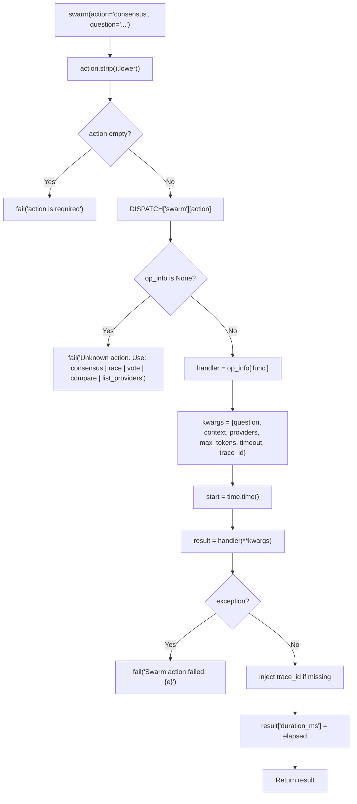
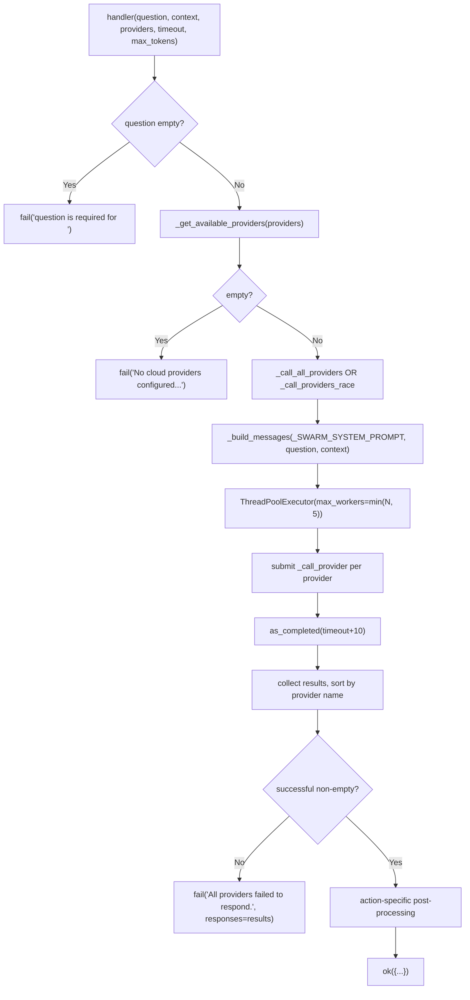
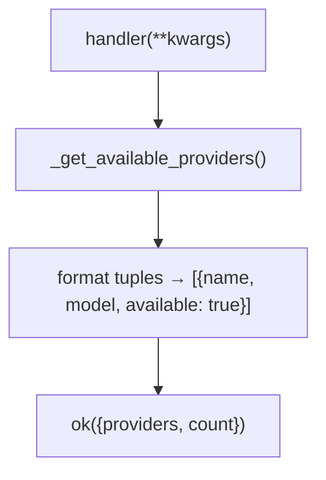

<- Back to [Swarm Overview](../SWARM.md)

# 🏗️ Architecture

## 🔗 Source Code Reference

| File | Purpose |
|------|---------|
| `tools/swarm.py` | `@tool` facade: action dispatch, kwargs forwarding, exception capture, `duration_ms` timing, `trace_id` injection |
| `tools/_meta_tool.py` | `@meta_tool` decorator: docstring `doc_sections` + metadata. (Swarm uses `action: str` — no `Literal` enum generated) |
| `tools/swarm_ops/__init__.py` | Auto-imports every `actions/*.py` module to trigger `@register_action` side effects |
| `tools/swarm_ops/_registry.py` | `DISPATCH` dict + `@register_action` decorator (duplicate-action detection) |
| `tools/swarm_ops/helpers.py` | Shared helpers: `_get_available_providers`, `_build_messages`, `_call_provider`, `_call_all_providers`, `_call_providers_race`, `_SWARM_SYSTEM_PROMPT` |
| `tools/swarm_ops/actions/consensus.py` | All providers → planner synthesis |
| `tools/swarm_ops/actions/race.py` | All providers in parallel → first valid wins |
| `tools/swarm_ops/actions/vote.py` | All providers → agreement analysis |
| `tools/swarm_ops/actions/compare.py` | All providers → side-by-side (no synthesis) |
| `tools/swarm_ops/actions/list_providers.py` | Env introspection — no LLM calls |
| `core/llm/llm.py` | `llm._registry._providers` — provider registry read by `_get_available_providers()` |
| `core/llm_backend/providers/<provider>.py` | Provider implementations: `chat_completion()` (returns OpenAI-shape dict) — called directly by swarm. Located in `core/llm_backend/providers/{anthropic,gemini,lmstudio,openai_compat}.py` |
| `core/contracts.py` | `ok()` / `fail()` — standardized return shape |
| `core/tracer.py` | `tracer` — observability (imported by facade) |
| `registry.py` | `@tool` decorator — auto-discovery of `swarm()` into MCP |

---

## 🌳 Module Tree

```text
tools/swarm.py                       # @tool facade — action dispatch, timing, error capture
tools/_meta_tool.py                  # @meta_tool decorator — docstring + metadata (no Literal for swarm)
tools/swarm_ops/
├── __init__.py                      # Auto-imports all actions/*.py to trigger @register_action
├── _registry.py                     # DISPATCH dict + @register_action decorator
├── helpers.py                       # _get_available_providers, _build_messages,
│                                    # _call_provider, _call_all_providers,
│                                    # _call_providers_race, _SWARM_SYSTEM_PROMPT
└── actions/
    ├── __init__.py                  # (empty — package marker)
    ├── consensus.py                 # All providers → planner synthesis
    ├── race.py                      # All providers in parallel → first valid wins
    ├── vote.py                      # All providers → agreement analysis (unanimous/majority/split/disagreement)
    ├── compare.py                   # All providers → side-by-side (no synthesis)
    └── list_providers.py            # Env introspection — no LLM calls
```

---

## 🔀 Dispatch Flow

### Facade dispatch (all actions)



### Action handler flow (consensus / race / vote / compare)



### Action-specific post-processing

| Action | Post-processing |
|--------|-----------------|
| `consensus` | Format successful responses → `llm.complete(role="planner", system=SYNTHESIS_PROMPT, user=...)` → `synthesis` string |
| `race` | Pick first `r["text"] and not r["error"]` from results → `winner` dict |
| `vote` | Normalize `text.strip().lower()[:200]` → group by key → classify `unanimous`/`majority`/`split`/`disagreement` → `groups` list |
| `compare` | None — return results as-is |
| `list_providers` | (skips provider calls entirely) → format `(name, model)` tuples into `providers` list |

### `list_providers` flow



---

## 💡 Key Design Decisions

### 1. Direct provider calls (NOT through `llm.complete()`)

Swarm calls `provider.chat_completion()` directly, bypassing `llm.complete()`'s role routing, circuit breakers, and rate limiting. **Why:** `llm.complete()` dispatches by *role* — it picks *one* provider per role based on routing config. The swarm's entire purpose is to call the *same question* on *different providers* *in parallel*. There's no role-based way to express "call all of them" — the swarm must reach into `llm._registry._providers` directly.

**Implication:** Swarm does NOT benefit from circuit breakers or rate limiters in `llm.complete()`. Per-provider error handling and resilience is the swarm's own responsibility (handled in `_call_provider()` via try/except).

**Exception — `consensus` synthesis:** The synthesis step in `consensus.py` *does* call `llm.complete(role="planner", ...)`. This is correct: synthesis is a single-model role-routed task, not a multi-provider fan-out.

### 2. `ThreadPoolExecutor` for parallel fan-out (capped at 5 workers)

`_call_all_providers()` and `_call_providers_race()` both use `ThreadPoolExecutor(max_workers=min(len(providers), 5))`. **Why threads, not asyncio:** All cloud provider HTTP calls use `httpx` with synchronous `chat_completion()` methods. Threads are the simplest way to parallelize blocking I/O without rewriting the provider layer. The 5-worker cap prevents thread explosion when many providers are configured.

**Implication — NOT parallel-safe:** Because swarm holds its own `ThreadPoolExecutor`, nesting a `swarm()` call inside `parallel(tools=[...])` would create nested thread pools. `parallel()`'s allowlist excludes swarm for this reason. Swarm must NOT be added to `PARALLEL_SAFE` (see INSTRUCTIONS.md).

### 3. Skip `lmstudio` (cloud-only)

`_get_available_providers()` explicitly skips `name == "lmstudio"`. **Why:** LM Studio is a *local* provider — calling it is free, private, and instant, but it's a single model (no point in "racing" it against itself). Swarm is designed for cross-cloud consensus where each provider offers a genuinely different model. Local models belong to `agent()` / `llm.complete()`, not swarm.

### 4. `*_BASE_MODEL` env var required

A provider is only included if `<NAME>_BASE_MODEL` is set (in addition to `<NAME>_API_KEY`, which is checked at provider registration time). **Why:** The swarm needs an explicit model name to pass to `chat_completion(model=...)`. `llm.complete()` derives the model from role routing; swarm bypasses role routing, so it must read the model name directly from env. Providers without `*_BASE_MODEL` are silently skipped (no crash) — they simply don't participate.

### 5. `action: str` (not `Literal[...]`) — manual dispatch as defense-in-depth

The swarm facade declares `action: str` and the facade body does a manual `DISPATCH["swarm"][action]` lookup that returns a friendly `fail("Unknown action '...'. Use: ...")` for direct-Python callers that bypass schema validation.

**v1.0.1 correction:** contrary to the original v1.0 wording of this section, `@meta_tool` DOES apply the `Literal[...]` enum to swarm's `action` parameter (just like git/file/web) — there is no skip logic in `@meta_tool` (`tools/_meta_tool.py:126-127` unconditionally patches `fn.__annotations__["action"]`). The LLM-facing FastMCP schema therefore gets the enum, which prevents hallucinated action names at the schema layer. The facade's manual dispatch is a defense-in-depth path for internal Python callers (e.g. autocode's `_swarm_debug_consensus`) that call `swarm()` directly rather than through the MCP tool-call boundary. Both layers coexist.

**Why keep the manual dispatch:** the `fail("Unknown action")` message lists valid actions, which is friendlier than a schema-validation rejection for direct callers. Removing it would degrade the developer experience for internal callers without gaining anything (the schema layer already rejects bad actions from the LLM).

### 6. Deterministic output ordering

`_call_all_providers()` sorts results by `r["provider"]` before returning. **Why:** `as_completed()` returns futures in completion order, which varies run-to-run based on which provider responds fastest. Sorting by provider name gives the caller a stable, predictable output order — important for diff-based testing and for the planner synthesis prompt (which embeds provider responses in a fixed order).

**Note:** `_call_providers_race()` does NOT sort — its results are in completion order, with the winner first. This is intentional: race semantics require preserving "who won" ordering.

### 7. Early-return + best-effort cancellation in `race` (v1.0.1, fixed v1.0.2)

`_call_providers_race()` uses `concurrent.futures.wait(return_when=FIRST_COMPLETED)` in a loop and `executor.shutdown(wait=False, cancel_futures=True)` in a `finally` block. **Why:** the function must return as soon as the first valid response lands, without blocking on slower providers.

**v1.0 bug (fixed in v1.0.1):** the original implementation used `as_completed` + `future.cancel()` + `break`, but the `with ThreadPoolExecutor(...)` context manager's `__exit__` calls `shutdown(wait=True)`, which blocked until ALL in-flight provider calls finished. Race had the same wall-clock latency as consensus. The v1.0.1 rewrite avoids the context manager (uses an explicit `executor` + `finally: executor.shutdown(wait=False, cancel_futures=True)`).

**v1.0.1 bug (fixed in v1.0.2, P1-2 cross-LLM):** the v1.0.1 rewrite had a `for future in done:` loop that `break`ed on the first winner. But `wait(FIRST_COMPLETED)` can return MULTIPLE futures in `done` if they complete simultaneously — sibling done futures were discarded. v1.0.2 collects ALL done futures first, then checks for winner outside the inner loop.

**Caveat:** `cancel_futures=True` (Python 3.9+) only cancels PENDING futures — running futures continue to completion in the background. Their results are discarded because `wait=False` releases control immediately. This is best-effort, not guaranteed, but sufficient for the latency goal.

### 8. `**kwargs` absorption in handlers

Each handler signature includes `**kwargs` to absorb unused dispatcher params. The facade forwards *all* kwargs (`question`, `context`, `providers`, `max_tokens`, `timeout`, `trace_id`) to every handler; `list_providers` ignores all of them via `**kwargs`. Same pattern as git/file — prevents the dispatcher from needing per-action parameter filtering.

### 9. `duration_ms` at facade level (not handler level)

The facade measures `time.time()` before/after `handler(**kwargs)` and injects `duration_ms` into the result. **Why:** Single source of truth for wall-clock timing — handlers don't need to remember to time themselves. Includes the full handler execution (provider calls + post-processing), which is what callers actually want to know.

### 10. No `with ThreadPoolExecutor(...)` for fan-out (v1.0.2)

Both `_call_all_providers` and `_call_providers_race` use explicit `executor = ThreadPoolExecutor(...)` + `try/finally: executor.shutdown(wait=False, cancel_futures=True)` instead of the `with` context manager. **Why:** `ThreadPoolExecutor.__exit__` calls `shutdown(wait=True)`, which blocks until ALL in-flight threads finish. If a provider hangs or ignores its timeout, the swarm call deadlocks. This bit us twice: race in v1.0 (fixed v1.0.1) and consensus/vote/compare in v1.0.1 (fixed v1.0.2, P1-1 cross-LLM). The explicit `shutdown(wait=False)` returns immediately; `cancel_futures=True` cancels PENDING futures. See INSTRUCTIONS.md rule #38 — this is the single most important concurrency rule.

---

## 🧪 Testing

```powershell
# Run all swarm tool tests
.\venv\Scripts\python tests/tools/swarm/ -W error --tb=short -v
```

**Test layout:**
```text
tests/tools/swarm/
├── conftest.py              # Fixtures: mock_providers, mock_llm_registry, mock_llm_empty_registry, mock_failing_providers
├── test_dispatch.py         # Facade: unknown action, empty action, case insensitive, duration_ms, DISPATCH registry
├── test_consensus.py        # Success, missing question, no providers, all fail, provider filter, response metadata
├── test_race.py             # Success (winner), missing question, no providers, all fail, provider filter
├── test_vote.py             # Success, missing question, no providers, all fail, unanimous/disagreement, groups sorted
├── test_compare.py          # Success (no synthesis), missing question, no providers, all fail, provider filter
├── test_helpers.py          # (v1.0.1) _sanitize_error, _call_provider error isolation, Gemini key-leak regression
└── test_list_providers.py   # 3 providers (lmstudio excluded), empty, model names present
```

**Mock strategy:**
- Patch `core.llm.llm` singleton — replace `_registry._providers` with mock providers
- Mock `provider.chat_completion()` to return controlled responses (no real API calls)
- Mock `os.getenv` for `*_BASE_MODEL` env vars (scoped to `*_BASE_MODEL` keys only — v1.0.1 fix; was global in v1.0)
- Mock `llm.complete()` for consensus synthesis (returns canned text)
- `mock_llm_empty_registry` fixture: only lmstudio registered → tests "no providers" error
- `mock_failing_providers` fixture: providers raise RuntimeError → tests "all failed" error
- `make_vote_providers` factory (v1.0.1): controlled per-provider response texts for vote classification tests (`unanimous`/`majority`/`split`/`disagreement`/`single_response`); `None` value = provider fails
- `mock_providers_with_key_leak_error` (v1.0.1): Gemini provider raises `httpx.HTTPStatusError` with key-laden URL → P1-1 regression
- `mock_providers_with_slow_one` (v1.0.1): one provider sleeps 2s → P1-2 race latency regression

**Run command:**
```bash
python -m pytest tests/tools/swarm/ -W error --tb=short -v
```

---

*Last updated: 2026-07-13 (v1.0.2). See [API.md](API.md) for action details, [CHANGELOG.md](CHANGELOG.md) for version history, [INSTRUCTIONS.md](INSTRUCTIONS.md) for AI editing rules.*
