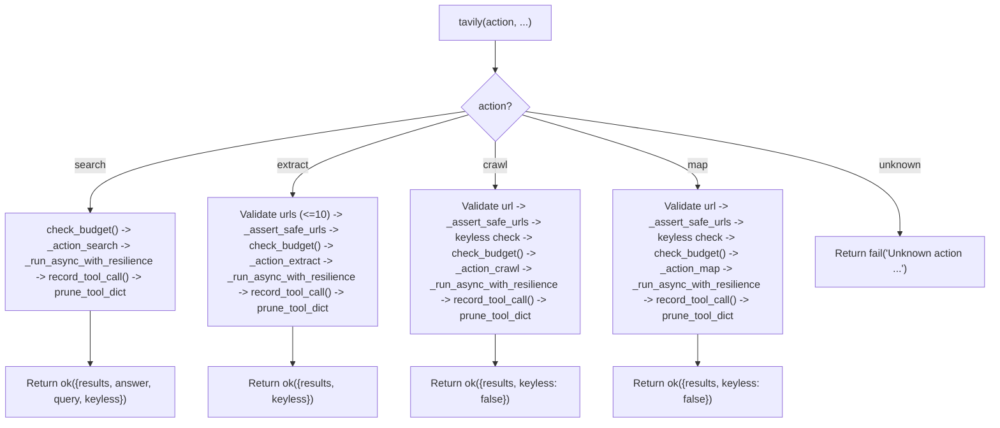

<- Back to [Tavily Overview](../TAVILY.md)

# 🏗️ Architecture

## 🔗 Source Code Reference

| File | Purpose |
|------|---------|
| `tools/tavily.py` | `@tool` + `@meta_tool` facade: action dispatch, validation |
| `tools/tavily_ops/__init__.py` | Auto-discovery: glob `actions/*.py`, `importlib` import |
| `tools/tavily_ops/_registry.py` | `DISPATCH` dict + `@register_action` decorator with duplicate guard |
| `tools/tavily_ops/state.py` | `_TAVILY_CLIENT`, `_CLIENT_LOCK`, `_KEYLESS_WARNED`, `reset_state()` |
| `tools/tavily_ops/client.py` | `_get_singleton_client()`, `_close_client()`, `_TAVILY_CB`, `_is_keyless()`, `_warn_keyless_once()` |
| `tools/tavily_ops/bridge.py` | `_run_async()`, `_run_async_with_resilience()` — async-to-sync bridge with CB + retry |
| `tools/tavily_ops/errors.py` | `_handle_tavily_error()`, API key sanitization, `error_code` classification |
| `tools/tavily_ops/actions/search.py` | `@register_action("tavily", "search", ...)` handler |
| `tools/tavily_ops/actions/extract.py` | `@register_action("tavily", "extract", ...)` handler |
| `tools/tavily_ops/actions/crawl.py` | `@register_action("tavily", "crawl", ...)` handler |
| `tools/tavily_ops/actions/map.py` | `@register_action("tavily", "map", ...)` handler |
| `tools/tavily_ops/actions/research.py` | `run_research()` — workflow-only, NOT registered |
| `core/net/__init__.py` | v1.3: Public re-exports for `from core.net import ...` |
| `core/net/security.py` | `is_safe_network_address()`, `_assert_safe_urls()` — cross-tool SSRF protection |
| `core/net/errors.py` | `classify_http_error()`, `is_retryable_error()`, `get_retry_delay()`, `register_retryable_exception()` — shared HTTP error classification |
| `core/net/retry.py` | `retry_sync()` + `retry_async_factory()` — unified retry with CB hooks |
| `core/net/budget.py` | `APICostTracker`, `record_tool_call()`, `check_budget()` — cost tracking |
| `core/net/url.py` | `normalize_url()`, `extract_domain()`, `is_same_domain()` — URL utilities |
| `core/net/default.py` | `SEARCH_MAX_RESULTS`, `CRAWL_MAX_DEPTH`, `RETRY_BASE_DELAY`, `CB_FAILURE_THRESHOLD` — shared defaults |
| `core/contracts.py` | `ok()` / `fail()` — standardized return dicts with `trace_id` + `error_code` injection |
| `core/config.py` | `cfg.tavily_api_key`, `cfg.tavily_timeout` |
| `core/memory_backend/pruner.py` | `prune_tool_dict()` — head+tail truncation, artifact storage |
| `core/llm_backend/circuit_breaker.py` | `CircuitBreaker` class — thread-safe state machine |
| `tests/tools/tavily/` | Tavily test suite |
| `tests/core/net/` | Net test suite |
| `workflows/deep_research_impl/nodes/search.py` | Uses `tavily(action="search")` facade |

---

## Module Tree

```text
tools/tavily.py                  # @tool + @meta_tool facade - thin dispatch only
tools/tavily_ops/
├── __init__.py                  # Auto-discovery: imports _registry, glob actions/*.py
├── _registry.py                 # DISPATCH dict + @register_action decorator
├── state.py                     # _TAVILY_CLIENT, _CLIENT_LOCK, _KEYLESS_WARNED, reset_state()
├── client.py                    # _get_singleton_client(), _close_client(), _TAVILY_CB
│                                # v1.2: closes old client on key change, lock on close
│                                # v1.3: _warn_keyless_once() uses state._KEYLESS_WARNED
│                                # v1.3: registers Tavily RateLimitError as retryable
├── bridge.py                    # _run_async() + _run_async_with_resilience() (CB + retry)
│                                # v1.2: accepts coroutine factory, uses core/net/retry.py
│                                # v1.3: uses retry_async_factory() from core/net/retry.py
│                                # v1.3: raises CircuitBreakerOpen exception
├── errors.py                    # _handle_tavily_error(), error_code, API key sanitization
│                                # v1.2: regex sanitization, 500-char truncation
│                                # v1.3: handles CircuitBreakerOpen -> error_code="CB_OPEN"
│                                # v1.3: wires budget tracking into error responses
│                                # v1.4: ReadError/WriteError/RemoteProtocolError/NetworkError -> NETWORK_ERROR
│                                # v1.4: HTTP 408 -> RATE_LIMITED (was CLIENT_ERROR)
└── actions/
    ├── search.py                # @register_action("tavily", "search", ...)
    │                            # v1.3: imports SEARCH_MAX_RESULTS from core.net.default
    │                            # v1.3: check_budget() + record_tool_call() wired
    │                            # v1.3: validates include_domains/exclude_domains as list[str]
    ├── extract.py               # @register_action("tavily", "extract", ...)
    │                            # v1.3: NOW uses _run_async_with_resilience (was bypassing)
    │                            # v1.3: normalize_url() on URLs, budget wired
    │                            # v1.3: imports EXTRACT_MAX_URLS/EXTRACT_DEPTH from defaults
    ├── crawl.py                 # @register_action("tavily", "crawl", ...)
    │                            # v1.3: normalize_url() on URL, budget wired
    │                            # v1.3: imports CRAWL_* constants from defaults
    ├── map.py                   # @register_action("tavily", "map", ...)
    │                            # v1.3: imports CRAWL_* constants from defaults, budget wired
    └── research.py              # PLAIN function, NO @register_action (workflow-only)
                                 # v1.3: NOW uses _run_async_with_resilience (was bypassing)
                                 # v1.3: budget wired, citation_format only passed here

core/net/                        # v1.2: Shared network infrastructure
│                                # v1.3: __init__.py re-exports all modules for cross-tool use
│                                # v1.4: on_failure only for retryable errors; 0.0.0.0/:: blocked
├── __init__.py                  # v1.3 NEW: public re-exports for `from core.net import ...`
├── errors.py                    # classify_http_error(), is_retryable_error(), get_retry_delay()
│                                # v1.3: NetworkError -> NETWORK_ERROR (not CONNECT_ERROR)
│                                # v1.3: 408 -> RATE_LIMITED, Read/WriteError -> NETWORK_ERROR
├── security.py                  # is_safe_network_address(), _assert_safe_urls() - SSRF guard
│                                # v1.3: Fixed IPv6 bracket parsing, DNS timeout via ThreadPoolExecutor
│                                # v1.4: is_unspecified check blocks 0.0.0.0 and ::
├── retry.py                     # retry_sync() + retry_async_factory() - unified retry with CB hooks
│                                # v1.3: Added retry_async_factory() for async coroutine retry
│                                # v1.4: on_failure only fires for retryable errors
│                                # v1.4: Removed dead raise last_exception
├── budget.py                    # APICostTracker - cost tracking per tool
│                                # v1.3: Lock() -> RLock(), daily reset, get_status() fix
├── url.py                       # normalize_url(), extract_domain(), is_same_domain()
│                                # v1.3: is_same_domain strips www. prefix
│                                # v1.4: Boundary check - www2.example.com NOT stripped
└── default.py                   # Shared defaults: SEARCH_MAX_RESULTS, CRAWL_MAX_DEPTH, etc.
                                 # v1.3: Fixed header comment (defaults.py -> default.py)
```

---

## Dispatch Flow



---

## Key Design Decisions

### Async-to-Sync Bridge

`_run_async()` handles two cases: (1) no running loop -> `asyncio.run(coro)`; (2) running loop (e.g., inside MCP) -> spawns a `ThreadPoolExecutor(max_workers=1)` and runs `asyncio.run` in a fresh thread. Timeout: `cfg.tavily_timeout + 10` seconds. Deliberately uses per-call ThreadPoolExecutor instead of a persistent background loop - Tavily calls are short network requests, not long Playwright sessions.

### Resilience Pattern

- **v1.2:** `_run_async_with_resilience()` wraps `_run_async()` with circuit breaker (`_TAVILY_CB`) and automatic retry on all retryable errors (3 attempts, exponential backoff via `core/net/retry.py:get_retry_delay()`). **Accepts a coroutine factory (callable), not a coroutine object** - ensures fresh coroutine per retry attempt. Centralized in `bridge.py` so every action gets resilience without per-action edits.
- **v1.3:** `retry_async_factory()` extracted from bridge pattern to `core/net/retry.py` for reuse by web_ops/browser. `bridge.py` now delegates to it.
- **v1.4:** `on_failure` only fires for retryable errors. `retry_async_factory()` checks `is_retryable(e)` BEFORE calling `on_failure()`. A single workflow node with a parameter bug can no longer DOS the entire Tavily tool for all agents.

### Lazy Client with Key Caching

`_get_singleton_client()` caches the `AsyncTavilyClient` instance and re-creates it only if the API key changes. Thread-safe via `_CLIENT_LOCK` (double-checked locking). Keyless mode uses `api_key=None`.

- **v1.2:** Client lifecycle - closes old client before creating new one when API key changes. `_close_client()` acquires `_CLIENT_LOCK` and logs exceptions instead of silently swallowing.
- **v1.3:** Client close - `_close_client_locked()` uses `_run_async()` instead of creating a fresh ThreadPoolExecutor.

### State Ownership

`state.py` owns `_TAVILY_CLIENT`, `_CLIENT_LOCK`, `_KEYLESS_WARNED`. `client.py` does `import tools.tavily_ops.state as state` and reads/writes `state._TAVILY_CLIENT` directly. This prevents the name-binding divergence bug that broke `web_ops`'s `reset_state()`.

- **v1.3:** Keyless warning - `_warn_keyless_once()` uses `state._KEYLESS_WARNED` directly so `reset_state()` properly clears it.

### SSRF at Action Level

`_assert_safe_urls()` is called inside `_action_extract`, `_action_crawl`, and `_action_map` (not at the facade level). `search` does not need SSRF since it doesn't fetch arbitrary URLs. v1.2: `_assert_safe_urls` moved to `core/net/security.py` with scheme validation, empty hostname rejection, and IPv6 port stripping. v1.3: Fixed IPv6 bracket parsing (`[::1]:8080`, `2001:db8::1`). v1.4: Blocks `0.0.0.0` and `::`.

### Raw Content Stripping

`_action_search` strips `raw_content` from all results unless `include_raw_content=True`. Prevents context window explosion.

### Error Type Detection + Sanitization

`_handle_tavily_error()` uses both `isinstance` checks (with lazy tavily imports) and `type(e).__name__` string fallback. API key is stripped via regex (exact match, URL-encoded, Authorization header, query param) from all error messages before returning to the LLM. Error messages truncated to 500 chars to prevent context window bloat.

- **v1.4:** Network error classification - `httpx.ReadError`, `httpx.WriteError`, `httpx.RemoteProtocolError`, `httpx.NetworkError` now map to `NETWORK_ERROR` instead of falling through to `UNKNOWN`.
- **v1.4:** HTTP 408 classification - Maps to `RATE_LIMITED` (retryable) instead of `CLIENT_ERROR` (non-retryable), aligning with `classify_http_error()` in `core/net/errors.py`.

### Budget Tracking

Every action calls `check_budget("tavily.{action}")` before execution and `record_tool_call("tavily.{action}")` after success. Daily limits auto-reset at midnight.

### `research` is Workflow-Only

`run_research()` in `actions/research.py` exists but is NOT exposed in the `@tool` facade. Not registered in `DISPATCH`. Reserved for `workflows/deep_research_impl/nodes/search.py`.

### All Outputs Pruned

Every action result passes through `prune_tool_dict()` from `core.memory_backend.pruner` before return.

### `trace_id` Propagation

`trace_id` is threaded from facade through `ok()` / `fail()` / `prune_tool_dict()` in all action handlers.

### Non-Dict Handler Guard

Facade checks `isinstance(result, dict)` after handler call. Returns `fail()` if handler returns non-dict (regression guard from prior refactors).

### Coroutine Factory Pattern

`_run_async_with_resilience()` accepts a callable that produces a fresh coroutine (`_call`), not an already-instantiated coroutine (`_call()`). This prevents `RuntimeError: cannot reuse already awaited coroutine` on retry attempts.

### Unified Network Infrastructure

All HTTP error classification, retry logic, SSRF guards, and budget tracking live in `core/net/`. Adopted by tavily_ops; web_ops and browser adoption scheduled.

### Cross-Tool Adoption Ready

`core/net/__init__.py` re-exports all modules. `register_retryable_exception()` allows SDK-specific exception registration.

---

## 🧪 Testing

```powershell
# Run all tavily tests (fully mocked, no API calls)
.\venv\Scripts\python tests/tools/tavily/ -W error --tb=short -v

# Run all core/net tests
.\venv\Scripts\python tests/core/net/ -W error --tb=short -v

> **Note:** Ensure `pytest` resolves to your venv. If not, use `python -m pytest` or the full venv path (`venv\Scripts\pytest.exe` on Windows, `venv/bin/pytest` on Unix).
```

### Test Coverage

| File | Tests | Coverage |
|------|-------|----------|
| `conftest.py` | - | Shared fixtures: reset_state, mock_tavily_client, budget reset, resource warning filter |
| `test_search.py` | 8 | Search action, result parsing, keyless capping, trace_id propagation, raw_content stripping, facade params |
| `test_extract.py` | 5 | Extract action, URL validation, batch processing, SSRF, keyless mode |
| `test_crawl.py` | 9 | Crawl action, keyless rejection, URL requirement, extract_depth/format, SDK translation, facade params, coroutine factory |
| `test_map.py` | 7 | Map action, keyless rejection, URL requirement, SDK translation, facade params |
| `test_tavily_error_handling.py` | 14 | All error types + non-dict handler guard, sanitization, truncation, error_code, CB_OPEN |
| `test_tavily_keyless_mode.py` | 5 | Keyless search/extract, keyless crawl/map rejection, warning once |
| `test_tavily_ssrf.py` | 4 | `_assert_safe_urls` blocking across extract/crawl/map, search exempt |
| `test_tavily_client.py` | 3 | Lazy client creation, key change detection, thread safety |
| `test_tavily_state.py` | 2 | State ownership regression guard (web bug), keyless warning reset |
| `test_facade.py` | 5 | `@meta_tool` metadata, action Literal, unknown action, trace_id |
| `test_registry.py` | 6 | Duplicate guard, research not in DISPATCH, all actions registered |
| `test_bridge_timeout.py` | 2 | Timeout actually fires |
| `test_circuit_breaker.py` | 7 | **v1.2:** State transitions, half_open_max_calls, reset, record_success noop |
| `test_bridge_resilience.py` | 6 | **v1.2/v1.3:** Coroutine factory, retry, CB integration, unified backoff |
| `test_client.py` | 5 | **v1.2/v1.3:** Singleton, key change, close logging, old client cleanup, lock verification |

### Core/Net Tests (`tests/core/net/`)

| File | Tests | Coverage |
|------|-------|----------|
| `conftest.py` | - | Budget tracker reset fixture |
| `test_security.py` | 12 | SSRF guard, IPv6 (loopback + public), empty hostname, scheme validation |
| `test_web_errors.py` | 12 | Classification, BOT_BLOCKED, 408, SDK duck-typing, retry delay, NetworkError |
| `test_retry.py` | 6 | Success, retry, exhaust, non-retryable, custom predicate, backoff, jitter |
| `test_budget.py` | 6 | Record, afford, warning, status, thread safety, daily reset |
| `test_url.py` | 7 | Normalize, domain extract, same domain (www stripping) |
| `test_path_validation.py` | 5 | Path-specific SSRF validation |
| `test_ssrf_edge_cases.py` | - | Edge cases (moved from `tests/core/`) |
| `test_ssrf_protection.py` | 7 | SSRF protection tests |

### Mock Strategy

- Patch `tools.tavily_ops.client._get_singleton_client` to return `MagicMock` with **v1.3: `AsyncMock`** for async methods (search/extract/crawl/map/research return coroutines)
- Patch `tools.tavily_ops.client.cfg.tavily_api_key` to `"tvly-test"` for keyed mode tests
- Patch `tools.tavily_ops.client.cfg.tavily_api_key` to `""` for keyless mode tests
- **v1.3:** Patch `tools.tavily_ops.client._is_keyless_mode` / `_is_keyless` for keyless behavior tests
- Patch `core.net.security.is_safe_network_address` for SSRF tests (or mock `_assert_safe_urls` directly)
- Test `_handle_tavily_error()` with both real and mocked exception types
- Reset state via `tools.tavily_ops.state.reset_state()` (not direct module var poking)
- Reset circuit breaker via `tools.tavily_ops.client._TAVILY_CB.reset()` between tests
- **v1.3:** Reset budget tracker via `core.net.budget._budget_tracker._calls.clear()` between tests

---

*Last updated: 2026-07-03. See [API.md](API.md) for action details, [CHANGELOG.md](CHANGELOG.md) for version history, [INSTRUCTIONS.md](INSTRUCTIONS.md) for AI editing rules.*
