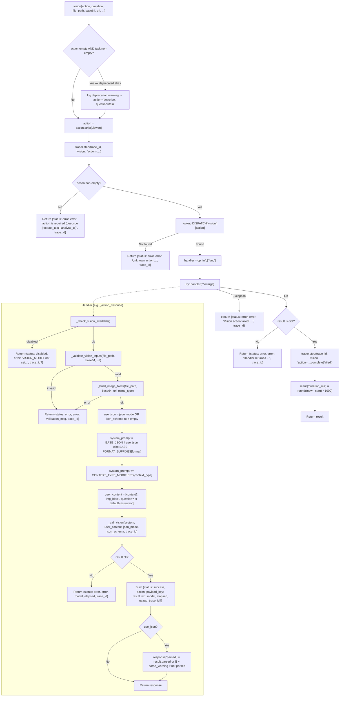

<- Back to [Vision Overview](../VISION.md)

# 🏗️ Architecture

## 🔗 Source Code Reference

| File | Purpose |
|------|---------|
| `tools/vision.py` | `@tool @meta_tool` facade — validates `action` (with deprecated `task` alias resolution), dispatches to handler via `DISPATCH`, wraps in `try/except`, threads `trace_id`, records `duration_ms` |
| `tools/vision_ops/__init__.py` | Auto-discovery: globs `actions/*.py` and imports each so `@register_action` runs before the facade reads `DISPATCH` |
| `tools/vision_ops/_registry.py` | `DISPATCH` dict + `register_action()` decorator. Duplicate registration raises `ValueError` loudly |
| `tools/vision_ops/helpers.py` | 7 helpers: `_validate_vision_inputs`, `_file_to_block`, `_b64_to_block`, `_do_download`, `_download_image_to_data_uri`, `_check_vision_available`, `_build_image_block`, **`_call_vision`** |
| `tools/vision_ops/prompts.py` | 3 base system prompts × 2 variants (markdown + JSON) + `FORMAT_SUFFIXES` + `CONTEXT_TYPE_MODIFIERS` dicts (suffix-based composition) |
| `tools/vision_ops/actions/__init__.py` | Empty — exists so `Path.glob("*.py")` sees the package as a directory; docstring documents the add-new-action workflow |
| `tools/vision_ops/actions/describe.py` | `@register_action("vision", "describe")` — `DESCRIBE_SYSTEM` / `DESCRIBE_JSON_SYSTEM`, returns `description` key |
| `tools/vision_ops/actions/extract_text.py` | `@register_action("vision", "extract_text")` — `EXTRACT_TEXT_SYSTEM` / `EXTRACT_TEXT_JSON_SYSTEM` (OCR specialist persona), returns `text_extracted` key |
| `tools/vision_ops/actions/analyse_ui.py` | `@register_action("vision", "analyse_ui")` — `ANALYSE_UI_SYSTEM` / `ANALYSE_UI_JSON_SYSTEM` (senior UI/UX designer persona), returns `analysis` key |
| `tools/_meta_tool.py` | Generic `@meta_tool(DISPATCH, doc_sections=...)` decorator — generates the `action: Literal[...]` annotation + action list in the docstring from `DISPATCH` keys |
| `core/llm.py` | `llm.call(role, messages, json_mode, json_schema, trace_id)` — the only LLM entry point used by `_call_vision` |
| `core/config.py` | `cfg.vision_model` — vision model name from `.env` (kill-switch source) |
| `core/net/retry.py` | `retry_sync(fn, max_retries, base_delay, max_delay, jitter, is_retryable)` — wraps `_do_download()` with exponential backoff + jitter |
| `core/net/errors.py` | `is_retryable_error(exc)` — classifies `httpx` exceptions and HTTP status codes for `retry_sync` |
| `core/net/default.py` | `RETRY_BASE_DELAY`, `RETRY_MAX_DELAY` — central retry tuning constants shared with `tavily_ops` / `web_ops` / `browser` |
| `core/net/security.py` | `is_safe_network_address(hostname)` — SSRF protection, blocks localhost / private IP ranges |
| `core/tracer.py` | `tracer.step(trace_id, ...)`, `tracer.warning(...)`, `tracer.error(...)` — observability hooks called by the facade and helpers |
| `tests/tools/vision/conftest.py` | Shared fixtures: `mock_cfg`, `mock_llm`, `mock_is_safe_network_address`, `temp_image_file`, `make_mock_response()` |
| `tests/tools/vision/test_describe.py` | 45 tests — Success / Disabled / LLMError / Validation / TraceID / Format / ContextType / JsonSchema / JsonMode classes for the `describe` action |
| `tests/tools/vision/test_extract_text.py` | 20 tests — same class structure, adapted for `extract_text` action |
| `tests/tools/vision/test_analyse_ui.py` | 18 tests — same class structure, adapted for `analyse_ui` action |
| `tests/tools/vision/test_dispatch.py` | 12 tests — `TestDispatch` (facade behavior: empty action, unknown action, deprecated `task` alias, exception handling, non-dict return) + `TestRegistry` (DISPATCH shape + `@meta_tool` annotation generation) |
| `tests/tools/vision/test_helpers.py` | 48 tests — `_validate_vision_inputs` (zero/multiple sources, SSRF, file size, base64 length, URL scheme), `_file_to_block` (MIME detection, unknown extension, read errors), `_b64_to_block` (data URI passthrough, wrapping), `_download_image_to_data_uri` (retry success, retry exhaustion, timeout, HTTP status error, content-type normalization), `_check_vision_available`, `_build_image_block`, `_call_vision` (json_schema parsing, malformed schema fallback) |

> **8-file subpackage:** `vision_ops/` has exactly 8 files: `__init__.py`, `_registry.py`, `helpers.py`, `prompts.py`, and 4 files under `actions/` (`__init__.py` + `describe.py` + `extract_text.py` + `analyse_ui.py`). The old 245-line `tools/vision.py` is now a 199-line facade — net implementation moved into the subpackage.

---

## 🌳 Module Tree

```text
tools/vision.py                             # @tool @meta_tool facade — task alias → action+question, dispatch + tracer + duration_ms
└── tools/vision_ops/
    ├── __init__.py                         # Auto-discovery: Path.glob("actions/*.py") → import_module
    ├── _registry.py
    │   ├── DISPATCH: Dict[str, Dict[str, Dict[str, Any]]]   # {"vision": {"describe": {func, help, examples}, ...}}
    │   └── register_action(tool_name, action_name, help_text, examples)  # decorator
    ├── helpers.py
    │   ├── HTTP_TIMEOUT = 30.0                              # single-image download timeout
    │   ├── MAX_IMAGE_BYTES / MAX_BASE64_LEN                 # env-configurable soft caps (20MB / 10M chars)
    │   ├── _VISION_DOWNLOAD_RETRIES = 2                     # vision-specific (web uses 3, browser uses 2)
    │   ├── _MIME_MAP                                         # {.jpg/.jpeg/.png/.webp/.gif/.bmp → image/*}
    │   ├── _validate_vision_inputs(file_path, base64_str, url)        # → (is_valid, error_msg)
    │   ├── _file_to_block(file_path)                                  # local file → image_url block
    │   ├── _b64_to_block(b64_str, mime_type)                          # base64/data-URI → image_url block
    │   ├── _do_download(url, timeout)                                 # single GET (wrapped by retry_sync)
    │   ├── _download_image_to_data_uri(url, timeout)                  # retry_sync(_do_download) → data URI
    │   ├── _check_vision_available()                                  # → (ok, err_dict) status="disabled"
    │   ├── _build_image_block(file_path, base64_str, url, mime_type)  # source-type dispatch → block
    │   └── _call_vision(system, user_content, json_mode, json_schema, trace_id)  # → LLMResponse
    ├── prompts.py
    │   ├── DESCRIBE_SYSTEM / DESCRIBE_JSON_SYSTEM          # general description (Overview/Elements/Text/Details)
    │   ├── EXTRACT_TEXT_SYSTEM / EXTRACT_TEXT_JSON_SYSTEM   # OCR specialist (reading order, location, [unclear])
    │   ├── ANALYSE_UI_SYSTEM / ANALYSE_UI_JSON_SYSTEM       # senior UI/UX designer (8-section critique)
    │   ├── FORMAT_SUFFIXES                                   # {"markdown": "", "json": ..., "bullet_points": ...}
    │   └── CONTEXT_TYPE_MODIFIERS                            # {"screenshot": ..., "diagram": ..., "photo": ..., "document": ...}
    └── actions/
        ├── __init__.py                                       # empty (auto-discovery contract docstring only)
        ├── describe.py                                       # @register_action("vision", "describe") → _action_describe
        ├── extract_text.py                                   # @register_action("vision", "extract_text") → _action_extract_text
        └── analyse_ui.py                                     # @register_action("vision", "analyse_ui") → _action_analyse_ui
```

---

## 🔀 Dispatch Flow



---

## 🧬 The `_call_vision` Indirection (Why Patches Work)

**The pattern:** action handlers do **not** call `llm.call()` directly. They call `helpers._call_vision(system, user_content, json_mode, json_schema, trace_id)`, which in turn calls `llm.call(role="vision", messages=..., ...)`.

**Why it exists:** Python's `from X import Y` creates a *local binding* at import time. If an action module did `from core.llm import llm` and then called `llm.call(...)`, patching `core.llm.llm` (or `tools.vision_ops.helpers.llm`) at test time would have **no effect** — the action module already holds its own reference to the original `llm` object.

**Why the indirection fixes it:** `_call_vision()` is defined in `helpers.py` and references `llm` via the *module namespace lookup*:

```python
# tools/vision_ops/helpers.py (simplified)
from core.llm import llm   # imported once, into helpers' namespace

def _call_vision(system, user_content, json_mode=False, json_schema="", trace_id=""):
    messages = [
        {"role": "system", "content": system},
        {"role": "user", "content": user_content},
    ]
    schema_dict = None
    if json_schema and json_schema.strip():
        try:
            import json as _json
            schema_dict = _json.loads(json_schema)
        except Exception:
            schema_dict = None  # malformed — let llm.call proceed without it
    return llm.call(
        role="vision",
        messages=messages,
        json_mode=json_mode,
        json_schema=schema_dict,
        trace_id=trace_id,
    )
```

When the test fixture patches `tools.vision_ops.helpers.llm`, it replaces the `llm` attribute on the `helpers` module object. At call time, `_call_vision` looks up `llm` via the module's `__dict__` — so it sees the patched mock. **This is the only patch point needed** to intercept every LLM call from every action handler.

**Same pattern applies to:** `_check_vision_available()` (centralizes the `cfg.vision_model` kill-switch check), `_validate_vision_inputs()` (centralizes the `is_safe_network_address` SSRF check), `_build_image_block()` (centralizes source-type dispatch). All cfg / llm / net interactions go through `helpers`, so `conftest.py` only needs 3 patches (`mock_cfg`, `mock_llm`, `mock_is_safe_network_address`) to control all three.

---

## 🎭 The 3-Action Pattern (Same LLM, Different Prompts)

All three action handlers share an **identical pre-flight and dispatch flow**. The only differences are:

| Aspect | `describe` | `extract_text` | `analyse_ui` |
|--------|------------|----------------|--------------|
| **Base system prompt** | `DESCRIBE_SYSTEM` (Overview / Key Elements / Text Content / Notable Details) | `EXTRACT_TEXT_SYSTEM` (OCR specialist — reading order, location notes, `[unclear]` for low-confidence) | `ANALYSE_UI_SYSTEM` (senior UI/UX designer — Components / Layout / Accessibility / UX Patterns / Design System / Strengths / Issues / Recommendations) |
| **JSON variant** | `DESCRIBE_JSON_SYSTEM` (`{overview, elements, text_content, colors, details, confidence}`) | `EXTRACT_TEXT_JSON_SYSTEM` (`{source_type, blocks: [{location, text, confidence}], full_text, has_text}`) | `ANALYSE_UI_JSON_SYSTEM` (`{components, layout, accessibility, ux_patterns, design_system, strengths, issues: [{description, severity}], recommendations}`) |
| **Response payload key** | `description` | `text_extracted` | `analysis` |
| **Typical caller intent** | General image understanding — "what's in this image?" | OCR / text extraction — "what does the text say?" | UI/UX critique — "is this interface good?" |
| **Recommended `context_type`** | `photo` (often) or `""` | `document` (often) or `""` | `screenshot` (default-ish) |

**Shared flow (identical across handlers):**

1. **`_check_vision_available()`** — return `status="disabled"` on kill-switch (empty `cfg.vision_model`).
2. **`_validate_vision_inputs(file_path, base64, url)`** — exactly one source required, SSRF check on URLs, file-size + base64-length caps enforced.
3. **`_build_image_block(file_path, base64, url, mime_type)`** — source-type dispatch (file → `_file_to_block`; base64 → `_b64_to_block`; url → `_download_image_to_data_uri` → `_b64_to_block`).
4. **Build `system_prompt`**:
   - `use_json = json_mode OR bool(json_schema and json_schema.strip())`
   - If `use_json`: select the action's `*_JSON_SYSTEM` variant + `CONTEXT_TYPE_MODIFIERS.get(context_type, "")` (context-type is orthogonal to json_mode, applied in both branches).
   - Else: select the base prompt + `FORMAT_SUFFIXES.get(format, "")` + `CONTEXT_TYPE_MODIFIERS.get(context_type, "")`. Unknown `format`/`context_type` values silently degrade to `""` (safe fallback).
5. **Build `user_content`** — multimodal list: optional `Context: ...` text block, the image block, then either the caller's `question` or the action's default instruction ("Describe this image in detail." / "Extract all visible text from this image." / "Analyse this UI in detail.").
6. **`_call_vision(system, user_content, json_mode, json_schema, trace_id)`** — single multimodal LLM call to the vision role.
7. **Check `result.ok`** — return `status="error"` with `model`/`elapsed`/`error` on LLM failure.
8. **Build response** — `{"status": "success", "action": <name>, <action_key>: result.text, "model", "elapsed", "usage"}`; conditionally add `trace_id` (only if non-empty); if `use_json`, add `parsed` (dict or `{}`) + `parse_warning` when `result.parsed` is falsy.

**Why three actions instead of one with a "mode" param:** the `@meta_tool` pattern treats each `action` value as a first-class entry in `DISPATCH` with its own handler function, help text, and examples. This gives the LLM calling `vision` a clear schema (`action: Literal["describe", "extract_text", "analyse_ui"]`) and lets each handler evolve independently — e.g. `analyse_ui` can later add a `severity_filter` param without touching `describe` or `extract_text`.

**Why all three share the same LLM call:** the vision role is a single configured model (`cfg.vision_model`). Switching models per-action would require either three `*_MODEL` env vars (config sprawl) or a routing layer inside vision (defeats the "atomic action" principle). Same call, different prompt = cleanest decomposition.

---

## 🔄 The `task` Deprecation Alias (Backward Compat)

**The Pre-v1 contract:** `vision(task="Describe this image", file_path="...")` — a single free-text `task` param.

**The v1.0 contract:** `vision(action="describe", question="Describe this image", file_path="...")` — explicit `action` enum + optional `question`.

**Why an alias was kept:** `tools/agent_ops/actions/vision_delegate.py` calls `vision(task=...)` from the agent's `vision` role. Migrating that caller is a separate concern (it requires coordinating with `agent_ops` test coverage). The alias lets v1.0 ship without forcing a coordinated update.

**How the alias works** (in `tools/vision.py`):

```python
# Backward-compat: legacy `task` parameter → action="describe" + question=task.
if not action and task and task.strip():
    logger.warning(
        "[vision] DEPRECATED: `task` parameter used. "
        "Use `action='describe' + question=...` instead. "
        "Mapping task=%r → action='describe', question=%r. "
        "The `task` alias will be removed in v2.0.",
        task, task,
    )
    tracer.warning(
        trace_id, "vision", "Deprecated `task` parameter used (mapped to action=describe)",
        deprecated_param="task", mapped_action="describe", task_preview=task[:100],
    )
    action = "describe"
    if not question:
        question = task
```

**Semantics:**
- Only kicks in when `action` is empty AND `task` is non-empty (whitespace-stripped). If both are provided, `action` wins and `task` is ignored silently.
- Always maps to `action="describe"` — the Pre-v1 single-prompt behavior was the equivalent of `describe`.
- The deprecation warning is emitted to **both** the Python logger (visible in stderr / dev logs) and the `tracer` (visible in trace JSON).
- `task_preview` is truncated to 100 chars in the tracer payload to avoid leaking huge prompts into the trace log.
- **The alias will be removed in v2.0.** Update `vision_delegate.py` first (see CHANGELOG → In Progress / Next Up).

---

## 📐 JSON Schema Validation, Format Suffixes, Context-Type Modifiers

### JSON Schema Validation

When `json_schema` is non-empty (or `json_mode=True`):

1. The action handler selects the action's `*_JSON_SYSTEM` variant (e.g. `DESCRIBE_JSON_SYSTEM`) — a base prompt that specifies the exact JSON shape and instructs the model to output JSON only (no markdown fences).
2. `_call_vision()` parses the `json_schema` string as a dict via `json.loads()`. On parse failure (malformed JSON), it silently degrades to `schema_dict=None` — the call proceeds, but the LLM will produce unstructured output; the caller detects this via `result.parsed` being `None` (and a `parse_warning` is appended to the response).
3. The parsed dict is forwarded to `llm.call(json_schema=schema_dict)`. Per `llm.call()` semantics, providing a schema implies `json_mode` for response parsing.
4. On success, the response includes `parsed` (dict or `{}` when the LLM produced invalid JSON). When `parsed` is falsy, `parse_warning` is set to a hint message pointing at the action-specific payload key.

**Why the JSON variant omits the `format=json` suffix:** the JSON variant's prompt already specifies the output shape ("Output ONLY valid JSON..."). Appending the format suffix would be redundant.

### Format Suffixes

`FORMAT_SUFFIXES` dict in `prompts.py`:

| `format` value | Suffix appended to base prompt |
|----------------|--------------------------------|
| `"markdown"` (default) | `""` (no suffix — the base prompt already implies structured Markdown) |
| `"json"` | `"\n\nOutput your response as valid JSON."` |
| `"bullet_points"` | `"\n\nFormat your response as bullet points only."` |

Unknown values silently degrade to `""` via `.get(format, "")`. The suffix is **skipped** when `use_json` is true (the JSON variant handles shaping).

### Context-Type Modifiers

`CONTEXT_TYPE_MODIFIERS` dict in `prompts.py`:

| `context_type` value | Modifier appended |
|----------------------|-------------------|
| `""` (default) | `""` (no modifier) |
| `"screenshot"` | `"\n\nThe image is a UI screenshot. Focus on interface elements, layout, and user experience."` |
| `"diagram"` | `"\n\nThe image is a diagram or flowchart. Focus on structure, connections, and data flow."` |
| `"photo"` | `"\n\nThe image is a photograph. Focus on subjects, setting, and visual context."` |
| `"document"` | `"\n\nThe image is a document or scanned text. Focus on text content and document structure."` |

**Orthogonal to `format` / `json_mode`:** the context-type modifier is appended in **both** branches of the system-prompt construction (JSON variant AND base+format-suffix). This lets you combine, e.g., `json_schema='{"type":"object",...}'` with `context_type="screenshot"` to get the JSON variant prompt + the screenshot-focus modifier.

Unknown values silently degrade to `""` via `.get(context_type, "")`.

---

## 🌐 `core/net retry_sync` Adoption in `_download_image_to_data_uri`

**Pre-v1** had a hand-rolled `try/except` loop around `httpx.Client.get()` with manual backoff. **v1.0** replaces it with the project-wide `retry_sync()` utility.

### What changed

| Aspect | Pre-v1 | v1.0 |
|--------|--------|------|
| Retry mechanism | Hand-rolled `for attempt in range(max_retries)` loop with manual `time.sleep` | `retry_sync(fn, max_retries, base_delay, max_delay, jitter, is_retryable)` from `core/net/retry.py` |
| Error classification | Inline `isinstance(e, httpx.TimeoutException)` / `isinstance(e, httpx.HTTPStatusError)` checks | `is_retryable_error(exc)` from `core/net/errors.py` — classifies `httpx` exceptions AND HTTP status codes (5xx and 429 are retryable; 4xx other than 429 are not) |
| Backoff profile | Hardcoded constants in `vision.py` | `RETRY_BASE_DELAY` and `RETRY_MAX_DELAY` from `core/net/default.py` — centrally tunable alongside `tavily_ops` / `web_ops` / `browser` |
| Jitter | None (deterministic backoff) | `jitter=True` — adds ±25% randomness to each delay, prevents thundering-herd on shared endpoints |
| Retry count | `_MAX_RETRIES = 3` (vision-specific) | `_VISION_DOWNLOAD_RETRIES = 2` (vision-specific local constant) — vision uses one fewer retry than the web tool because it's a single image fetch, not a search |

### Retry boundary

Only the HTTP fetch (`_do_download`) is inside the retry boundary. MIME detection and base64 encoding happen **after** retry succeeds, in `_download_image_to_data_uri`. This keeps the retry unit small and ensures a partial response never leaks into the encoding step.

### Error classification

After `retry_sync()` exhausts its retries (or hits a non-retryable error), the exception bubbles up to `_download_image_to_data_uri`, which classifies it for a clean error message:

| Exception type | Error message |
|----------------|---------------|
| `httpx.TimeoutException` | `"Timeout downloading image from {url} (>{timeout}s)"` |
| `httpx.HTTPStatusError` | `"HTTP error {status_code} downloading image."` |
| Any other exception | `"Download error: {exc}"` |

### Why vision uses `max_retries=2` (not 3)

The web tool uses 3 retries because a search returns multiple results — retrying on a transient failure is cheap and likely to recover at least some pages. Vision is fetching **one** image: if the URL is genuinely broken (404, DNS fail, persistent timeout), retrying 3 times just delays the inevitable failure by 3 × backoff. Two retries (i.e. one retry after the initial attempt fails) is the sweet spot — recovers from a single transient blip, fails fast on persistent errors.

The constant is kept as a vision-specific local (`_VISION_DOWNLOAD_RETRIES` in `helpers.py`) rather than being promoted to `core/net/default.py` because it's a vision-specific tuning value, not a project-wide default.

---

## 💡 Key Design Decisions

- **`@meta_tool` auto-discovery** — Adding a new action = drop a file in `vision_ops/actions/` with `@register_action("vision", "<name>", ...)`. The facade's `action: Literal[...]` annotation and docstring action list are regenerated from `DISPATCH` automatically. No edits to `vision.py` needed.
- **Registered with `@tool`** (not in `skills/`) so MCP server discovers it at startup.
- **Uses `llm.call()` directly** (not `llm.complete()`) because it needs multimodal messages with `image_url` content blocks. The standard text-only `llm.complete()` path doesn't accept content blocks.
- **`_call_vision` indirection** — Action handlers never reference `llm` directly. See [The `_call_vision` Indirection](#-the-_call_vision-indirection-why-patches-work) above. Single patch point for tests; clean separation of "what to ask" (handlers) from "how to ask" (helpers).
- **Three actions, one LLM** — `describe`/`extract_text`/`analyse_ui` share the vision role and dispatch path. Only the system prompt differs (base + format suffix + context-type modifier). See [The 3-Action Pattern](#-the-3-action-pattern-same-llm-different-prompts) above.
- **Prompt composition via suffixes** — Format and context-type are *orthogonal* dimensions appended to the base prompt. 3 base prompts × 3 formats × 5 context-types = 45 effective variations from 16 strings (3 base + 3 JSON + 3 format suffixes + 5 context-type modifiers — minus the skipped `format=json` when JSON variant is selected). Avoids the N×M prompt matrix explosion.
- **JSON variant selection** — When `json_mode=True` or `json_schema` is non-empty, the handler picks the action's `*_JSON_SYSTEM` variant (which specifies the exact JSON shape). Format suffix is skipped in this branch — would be redundant. Context-type modifier is still appended (orthogonal).
- **`task` deprecation alias** — Kept for backward compat with `vision_delegate.py`. Maps `task` → `action="describe"` + `question=task`. Emits a deprecation warning to both the logger and the tracer. Will be removed in v2.0. See [The `task` Deprecation Alias](#-the-task-deprecation-alias-backward-compat) above.
- **`core/net retry_sync` adoption** — URL downloads now use the project-wide retry utility with `is_retryable_error` classification and central backoff constants. Vision uses `max_retries=2` (one fewer than web) — single image fetch, not a search. See [`core/net retry_sync` Adoption](#-corenet-retry_sync-adoption-in-_download_image_to_data_uri) above.
- **SSRF protection** — `is_safe_network_address()` (from `core/net/security.py`) blocks localhost, private IP ranges, and link-local addresses before any HTTP request is made. The check runs inside `_validate_vision_inputs()` — never bypass it.
- **Exactly one image source** — `file_path`, `base64`, or `url`. Multiple sources or zero sources are rejected with clear error messages.
- **File size limits** — `MAX_IMAGE_BYTES` (20MB default, env-configurable via `VISION_MAX_FILE_BYTES`) and `MAX_BASE64_LEN` (10M chars default, env-configurable via `VISION_MAX_BASE64_LEN`) prevent memory exhaustion.
- **MIME type auto-detection** from file extension via `_MIME_MAP`, with fallback to `image/jpeg` for unknown extensions (with a stderr warning). LM Studio tolerates slightly-wrong MIME types — the fallback is safe.
- **`duration_ms` always present** — The facade records start time, calls the handler, then unconditionally sets `result["duration_ms"]`. Even error returns carry the timing — useful for SLO debugging without separate instrumentation.
- **`trace_id` conditional inclusion** — Added to the response only when the caller passed a non-empty `trace_id`. Keeps the response shape clean for ad-hoc `vision(action="describe", file_path="...")` calls while still threading observability when called from a workflow.
- **NOT parallel-safe** — Uses LLM calls; do NOT add to `PARALLEL_SAFE`. Kill switch: empty `VISION_MODEL` in `.env` returns `status="disabled"`.

---

## 🧪 Testing

```powershell
# Run all vision tests (143 tests across 6 files)
.\venv\Scripts\pytest tests/tools/vision/ -W error --tb=short -v
```

> **Note:** Ensure `pytest` resolves to your venv. If not, use `python -m pytest` or the full venv path (`venv\Scripts\pytest.exe` on Windows, `venv/bin/pytest` on Unix).

**Mock strategy (single patch surface in `helpers`):**
- Patch `tools.vision_ops.helpers.cfg` (via `mock_cfg`) → controls `cfg.vision_model` for the kill-switch path
- Patch `tools.vision_ops.helpers.llm` (via `mock_llm`) → controls `llm.call()` return values (mock `LLMResponse` via `make_mock_response()`)
- Patch `tools.vision_ops.helpers.is_safe_network_address` (via `mock_is_safe_network_address`) → controls SSRF accept/block paths
- Patch `tools.vision_ops.helpers.httpx.Client.get` (or `_do_download`) for URL download success / failure / retry paths
- Use `temp_image_file` fixture (factory) for file-based tests — writes fake image bytes to `tmp_path`
- Test `json_mode` + `json_schema` parsing success and failure paths

**Test layout:**
```text
tests/tools/vision/
├── conftest.py                # Shared fixtures: mock_cfg, mock_llm, mock_is_safe_network_address, temp_image_file, make_mock_response()
├── test_describe.py           # 45 tests — Success/Disabled/LLMError/Validation/TraceID/Format/ContextType/JsonSchema/JsonMode classes for describe action
├── test_extract_text.py       # 20 tests — same class structure, adapted for extract_text action
├── test_analyse_ui.py         # 18 tests — same class structure, adapted for analyse_ui action
├── test_dispatch.py           # 12 tests — TestDispatch (facade: empty action, unknown action, task alias, exception handling, non-dict return) + TestRegistry (DISPATCH shape, @meta_tool Literal generation)
└── test_helpers.py            # 48 tests — unit tests for all 7 helpers (validation, SSRF, file/base64/url blocks, download retry, vision-available, _call_vision json_schema parsing)
```

**Total: 143 tests.** Replaces the old single-file `test_vision.py`.

**What each scenario class verifies (consistent across `test_describe` / `test_extract_text` / `test_analyse_ui`):**
- `Success` — happy path: returns `status=success`, correct payload key (`description`/`text_extracted`/`analysis`), `model` + `elapsed` + `usage` present, `duration_ms` set by facade
- `Disabled` — `cfg.vision_model = ""` → `status=disabled`
- `LLMError` — `result.ok = False` → `status=error` with `model`/`elapsed`/`error`
- `Validation` — zero/multiple sources, SSRF block, file-not-found, file-too-large, base64-too-long, bad URL scheme → `status=error` with descriptive message
- `TraceID` — `trace_id` threaded through success and all error paths
- `Format` — `markdown`/`json`/`bullet_points` suffixes appended to system prompt (verified via the prompt captured by `mock_llm`)
- `ContextType` — `screenshot`/`diagram`/`photo`/`document` modifiers appended; unknown values silently ignored
- `JsonSchema` — `json_schema` non-empty → JSON variant prompt selected, schema dict forwarded to `llm.call(json_schema=...)`, `parsed` field present in response
- `JsonMode` — `json_mode=True` (without `json_schema`) → JSON variant prompt selected, `parsed` field present, `parse_warning` set when LLM response isn't valid JSON

**`test_dispatch.py` specific coverage:**
- `TestDispatch` — facade-level behavior: empty `action`, unknown `action`, deprecated `task` alias (verifies deprecation warning logged + tracer.warning called + mapping to `action="describe"`), handler exception → `status=error`, handler returns non-dict → `status=error`, `duration_ms` always set
- `TestRegistry` — `DISPATCH["vision"]` has exactly 3 keys (`describe`, `extract_text`, `analyse_ui`); each entry has `func`/`help`/`examples` keys; `@meta_tool` generates the correct `action: Literal[...]` annotation

---

*Last updated: 2026-07-15 (v1.0). See [API.md](API.md) for action details, [CHANGELOG.md](CHANGELOG.md) for version history, [INSTRUCTIONS.md](INSTRUCTIONS.md) for AI editing rules.*
