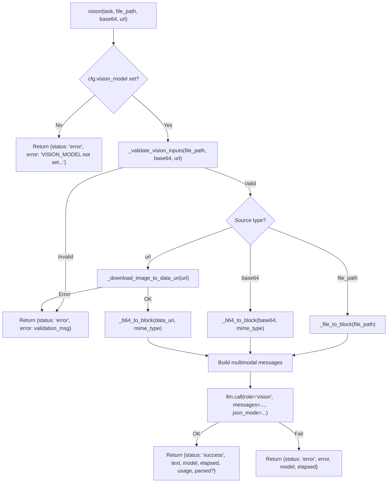

<- Back to [Vision Overview](../VISION.md)

# 🏗️ Architecture

## 🔗 Source Code Reference

| File | Purpose |
|------|---------|
| `tools/vision.py` | `@tool` facade: input validation, SSRF guard, image block building, LLM dispatch |
| `core/config.py` | `cfg.vision_model` — vision model name from `.env` |
| `core/llm.py` | `llm.call(role="vision")` — multimodal LLM dispatch |
| `core/tracer.py` | `tracer.error()`, `tracer.warning()` — observability |
| `core/net/security.py` | `is_safe_network_address()` — SSRF protection |
| `tests/tools/vision/` | Test files (to be restructured — see roadmap) |

---

## 🌳 Module Tree

```text
tools/vision.py
├── vision(task, file_path, base64, url, mime_type, json_mode, context, trace_id)  # @tool facade
├── _validate_vision_inputs(file_path, base64_str, url)                           # Validation + SSRF
├── _file_to_block(file_path)                                                     # Local file → image_url block
├── _b64_to_block(b64_str, mime_type)                                             # Base64 → image_url block
├── _download_image_to_data_uri(url, timeout)                                   # URL → data URI (SSRF-safe)
├── _VISION_SYSTEM                                                                # Standard analysis prompt
└── _VISION_JSON_SYSTEM                                                           # JSON-only output prompt
```

---

## 🔀 Dispatch Flow



---

## 💡 Key Design Decisions

- **Registered with `@tool`** (not in `skills/`) so MCP server discovers it at startup.
- **Uses `llm.call()` directly** because it needs multimodal messages. Does not use the standard text-only `llm.complete()` path.
- **JSON mode uses `llm.call()` built-in parsing** (`response_format` + fence stripping) rather than duplicating the logic.
- **URL sources are automatically downloaded and converted to a data URI**, ensuring compatibility with LM Studio even if it doesn't accept raw HTTP URLs.
- **SSRF protection** — `is_safe_network_address()` blocks localhost and private IP ranges before any HTTP request is made.
- **Exactly one image source** — `file_path`, `base64`, or `url`. Multiple sources or zero sources are rejected with clear error messages.
- **File size limits** — `VISION_MAX_FILE_BYTES` (20MB default) and `VISION_MAX_BASE64_LEN` (10M chars default) prevent memory exhaustion.
- **MIME type auto-detection** from file extension, with fallback to `image/jpeg` for unknown extensions.
- **System prompts are static** — `_VISION_SYSTEM` for standard output, `_VISION_JSON_SYSTEM` for structured JSON. No per-task prompt engineering in the facade; the caller shapes the task.

---

## 🧪 Testing

```powershell
# Run all vision tests
.\venv\Scripts\python tests/tools/vision/ -W error --tb=short -v
```

> **Note:** Ensure `pytest` resolves to your venv. If not, use `python -m pytest` or the full venv path (`venv\Scripts\pytest.exe` on Windows, `venv/bin/pytest` on Unix).

**Current test layout:**
```text
tests/tools/vision/
└── test_vision.py          # Single monolithic test file (all paths in one)
```

**Mock strategy:**
- Patch `core.config.cfg.vision_model` to test kill-switch
- Patch `core.llm.llm.call` to return mock `Result` objects
- Patch `core.net.security.is_safe_network_address` to test SSRF paths
- Patch `httpx.Client.get` for URL download success/failure paths
- Use `tmp_path` for file-based tests
- Test `json_mode` parsing success and failure paths

**Future test restructure (see roadmap):**
```text
tests/tools/vision/
├── conftest.py                          # Shared fixtures
├── test_vision_validation.py            # Input validation: zero sources, multiple sources, bad URLs
├── test_vision_ssrf.py                  # SSRF blocking: localhost, private IPs, bad schemes
├── test_vision_file.py                  # Local file: read, size limits, unknown extensions
├── test_vision_base64.py                # Base64: length limits, malformed data
├── test_vision_url.py                   # URL download: success, timeout, HTTP errors
├── test_vision_llm_dispatch.py          # LLM call: success, failure, json_mode
├── test_vision_output.py                # Output format: success, error, json parsing
└── test_vision_integration.py           # End-to-end with mocked dependencies
```

---

*Last updated: 2026-07-03. See [API.md](API.md) for action details, [CHANGELOG.md](CHANGELOG.md) for version history, [INSTRUCTIONS.md](INSTRUCTIONS.md) for AI editing rules.*
