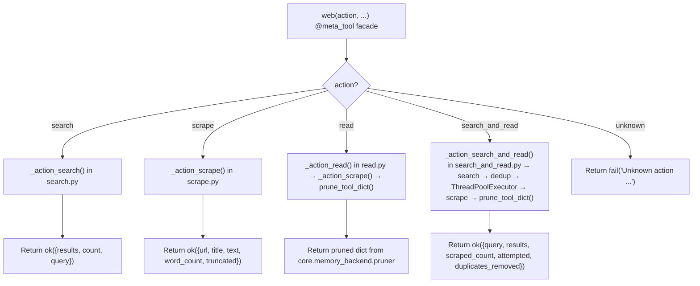

<- Back to [Web Overview](../WEB.md)

# 🏗️ Architecture

## 🔗 Source Code Reference

| File | Purpose |
|------|---------|
| `tools/web.py` | `@tool` + `@meta_tool` facade: action dispatch, validation, tracer steps |
| `tools/web_ops/_registry.py` | `DISPATCH` dict, `@register_action` decorator with duplicate guard |
| `tools/web_ops/__init__.py` | Auto-discovers `actions/*.py` via `pathlib` + `importlib` |
| `tools/web_ops/state.py` | `_HTTP_CLIENT`, `_HTTP_CLIENT_LOCK`, `reset_state()`, `reset_loop()` |
| `tools/web_ops/client.py` | Singleton `httpx.Client`: `_get_singleton_client()`, `_make_client()`, `_close_client()`, `_pick_user_agent()`, `_USER_AGENTS` |
| `tools/web_ops/utils.py` | `_is_safe_url()` — SSRF guard with scheme allowlist, shared by search and scrape |
| `tools/web_ops/actions/search.py` | `_action_search()` — SearXNG query handler |
| `tools/web_ops/actions/scrape.py` | `_action_scrape()`, `_fetch_html()` (guards), `_do_fetch()` (retry-wrapped), `_html_to_text()` — fetch + extract |
| `tools/web_ops/actions/read.py` | `_action_read()` — scrape + `prune_tool_dict()` alias |
| `tools/web_ops/actions/search_and_read.py` | `_action_search_and_read()` — composite: search → dedup → parallel scrape → prune |
| `core/net/security.py` | `is_safe_network_address()` — SSRF protection |
| `core/net/retry.py` | `retry_sync()` — unified retry with backoff |
| `core/net/errors.py` | `is_retryable_error()`, `get_retry_delay()` — error classification |
| `core/net/default.py` | `SCRAPE_TIMEOUT`, `SCRAPE_MAX_RETRIES`, `SEARCH_TIMEOUT` — shared constants |
| `core/contracts.py` | `ok()` / `fail()` — standardized return dicts with `trace_id` injection |
| `core/config.py` | `cfg.searxng_url`, `cfg.web_max_text_chars`, `cfg.web_snippet_chars`, `cfg.web_max_search_results`, `cfg.worker_timeout` |
| `core/memory_backend/pruner.py` | `prune_tool_dict()` — head+tail truncation, artifact storage |
| `core/parallel_executor.py` | `concurrent.futures.wait()` pattern for global timeout handling |

---

## 🌳 Module Tree

```text
tools/web.py
├── web(action, ...) # @tool + @meta_tool facade — action dispatch, validation
tools/web_ops/
├── __init__.py      # Auto-discovers actions/*.py at import time
├── _registry.py     # DISPATCH dict + @register_action decorator
├── state.py         # _HTTP_CLIENT, _HTTP_CLIENT_LOCK, reset_state(), reset_loop()
├── client.py        # Singleton httpx.Client: _get_singleton_client(), _make_client(), _close_client(), _pick_user_agent()
├── utils.py         # _is_safe_url() — SSRF guard, scheme allowlist, shared by search + scrape
└── actions/
    ├── search.py           # _action_search() — SearXNG query
    ├── scrape.py           # _action_scrape() — Fetch + guards + retry_sync() + BS4 clean → {url, title, text, word_count, truncated}
    ├── read.py             # _action_read() — Alias: scrape + prune_tool_dict()
    └── search_and_read.py  # _action_search_and_read() — Search → dedup → parallel scrape → prune
```

---

## 🔀 Dispatch Flow



---

## 💡 Key Design Decisions

- **Thin `@tool` + `@meta_tool` facade** — `tools/web.py` is the only file scanned by `registry.py`. `web_ops/` submodules are invisible to the registry. The facade looks up handlers in `DISPATCH["web"]` and routes parameters.
- **Auto-discovery via `@register_action`** — Action modules in `web_ops/actions/*.py` self-register into `DISPATCH` at import time. Adding a new action = create a file + add decorator. No central wiring needed.
- **Singleton client in `client.py`** — `_HTTP_CLIENT` created once with `httpx.Limits(max_connections=20)` and reused across all calls. `atexit.register(_close_client)` ensures cleanup on process exit. Thread-safe for `ThreadPoolExecutor` usage.
- **User-agent rotation** — `_pick_user_agent()` selects from a pool of 4 realistic browser UAs on singleton creation. Reduces 403 blocks from sites filtering on default `python-httpx` UA.
- **State isolation in `state.py`** — `reset_state()` closes the singleton and nullifies the reference for test isolation. `reset_loop()` is a no-op for compatibility with browser test fixtures.
- **SSRF in `utils.py`** — `_is_safe_url()` is shared by both `search.py` (validates SearXNG URL) and `scrape.py` (validates target URLs). Calls `core.net.security.is_safe_network_address`. Also enforces an `http`/`https` scheme allowlist — rejects `file://`, `ftp://`, `javascript:`, etc.
- **Lazy BS4 import** — `from bs4 import BeautifulSoup` only happens inside `_html_to_text()` on first call. Keeps startup fast if web tool is never used.
- **`read` = `scrape` + pruning** — The `read` action calls `_action_scrape()` internally, then pipes the result through `prune_tool_dict()` from `core.memory_backend.pruner`. This truncates oversized outputs and saves full content to `workspace/.artifacts/`.
- **`scrape` = raw extraction** — Returns the full unpruned result. Exposed as a public action for callers that want complete text without truncation.
- **URL deduplication in `search_and_read`** — SearXNG often returns the same URL from multiple engines. `search_and_read` deduplicates while preserving rank order before scraping.
- **`concurrent.futures.wait()` in `search_and_read`** — Uses `wait()` with `cfg.worker_timeout` global timeout (not `as_completed()`). Handles `not_done` futures as timeout errors. Follows the `parallel_executor.py` pattern. Uses `shutdown(wait=False)` to prevent blocking on slow threads after timeout fires.
- **Pruning in action files** — `read.py` and `search_and_read.py` apply `prune_tool_dict()` inside their handlers. This keeps the facade thin and avoids the facade needing to know which actions prune.
- **Content-type guard in `_fetch_html`** — After receiving headers, rejects `application/pdf` and `image/*` with structured errors. Suggests using `file(action="read_pdf")` or `browser(action="screenshot")` respectively.
- **Response size guard** — Rejects responses with `Content-Length > 10 MB` before reading body. Prevents memory exhaustion from malicious/misconfigured servers.
- **Retry via core/net** — `_fetch_html` uses `retry_sync()` from `core/net/retry.py` with `is_retryable_error()` from `core/net/errors.py`. Retries on HTTP 429/500/502/503/504, `TimeoutException`, `ConnectError`, `NetworkError`. Uses `get_retry_delay()` with jitter. Constants from `core/net/default.py` (`SCRAPE_MAX_RETRIES=3`, `SCRAPE_TIMEOUT=30`, `RETRY_BASE_DELAY=2.0`, `RETRY_MAX_DELAY=30.0`). Does NOT retry client errors (4xx except 429).

---

## 🧪 Testing

```powershell
# Run all web tests
.\venv\Scripts\python tests/tools/web/ -W error --tb=short -v

> **Note:** Ensure `pytest` resolves to your venv. If not, use `python -m pytest` or the full venv path (`venv\Scripts\pytest.exe` on Windows, `venv/bin/pytest` on Unix).
```

**Test coverage (9 files):**

| File | Tests | Coverage |
|------|-------|----------|
| `conftest.py` | — | Shared fixtures: `reset_web_state()`, `mock_cfg_for_web()` (single shared mock), `mock_httpx()` |
| `test_search.py` | — | SearXNG query building, result parsing, timeout, connection error, SSRF on SearXNG URL |
| `test_scrape.py` | — | HTML extraction, title parsing, text cleaning, truncation, missing URL, `max_chars=None` default, content-type guards, response size guard, retry backoff, PDF pre-flight |
| `test_read.py` | — | Alias behavior: scrape + prune_tool_dict() call, missing URL |
| `test_search_and_read.py` | — | URL deduplication, parallel execution, result ordering, empty result handling, timeout with partial results, mixed success/failure |
| `test_error_handling.py` | — | Unknown action, no search results, HTTP errors, SSRF blocking (real is_safe_network_address mock), scheme blocking, invalid hostnames |
| `test_client.py` | — | Singleton creation, thread safety, context manager, connection limits (public API), close/reset, user-agent rotation |
| `test_registry.py` | — | DISPATCH auto-discovery, action metadata, duplicate registration guard |
| `test_facade.py` | — | `@meta_tool` Literal enum generation, unknown action error, tracer step calls, `max_chars=None` not passed to handlers |

**Mock strategy:**
- Mock `httpx.Client` at the action module level (patch `tools.web_ops.actions.{search,scrape}._make_client`)
- Mock `cfg` with explicit integers (no `MagicMock` comparison errors for `cfg.web_max_text_chars`, `cfg.web_snippet_chars`)
- Use a **single shared mock** patched into all action modules — ensures mutations are visible to every handler
- Test SSRF blocking by patching `core.net.security.is_safe_network_address` (not the wrapper)
- Test timeout and connection error handling via `httpx.TimeoutException`, `httpx.ConnectError`
- Test action dispatch (`search`, `scrape`, `read`, `search_and_read`, unknown action)
- Test `_html_to_text` with various HTML structures (no `bs4` mock needed — it\'s pure HTML parsing)
- Test retry by mocking `core.net.retry.time.sleep` and asserting call count (retry_sync lives in core/net/retry.py)
- Test content-type guards by setting `response.headers = {"content-type": "..."}`

**Test patch path migration (old → new):**

| Old Patch | New Patch |
|-----------|-----------|
| `tools.web.cfg` | `tools.web_ops.actions.search.cfg` / `tools.web_ops.actions.scrape.cfg` |
| `tools.web._make_client` | `tools.web_ops.actions.search._make_client` / `tools.web_ops.actions.scrape._make_client` |
| `tools.web._get_singleton_client` | `tools.web_ops.client._get_singleton_client` |
| `tools.web._HTTP_CLIENT` | `tools.web_ops.state._HTTP_CLIENT` |
| `tools.web._is_safe_url` | `tools.web_ops.utils._is_safe_url` |
| `tools.web._do_search` | `tools.web_ops.actions.search._action_search` |
| `tools.web._do_scrape` | `tools.web_ops.actions.scrape._action_scrape` |

**Current test layout:**
```text
tests/tools/web/
├── __init__.py
├── conftest.py              # Shared fixtures (reset_web_state, mock_cfg_for_web, mock_httpx)
├── test_search.py           # Search action tests
├── test_scrape.py           # Scrape action tests + guards + retry
├── test_read.py             # Read alias tests
├── test_search_and_read.py  # Parallel search+scrape tests + timeout
├── test_error_handling.py   # SSRF, HTTP error, timeout, unknown action, scheme blocking
├── test_client.py           # Singleton client lifecycle tests + UA rotation
├── test_registry.py         # DISPATCH registry tests
└── test_facade.py           # @meta_tool facade tests + max_chars=None dispatch
```

---

*Last updated: 2026-07-03. See [API.md](API.md) for action details, [CHANGELOG.md](CHANGELOG.md) for version history, [INSTRUCTIONS.md](INSTRUCTIONS.md) for AI editing rules.*
