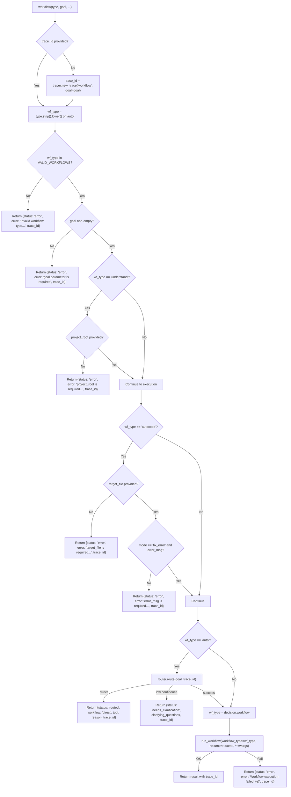

<- Back to [Workflow Overview](../WORKFLOW.md)

# 🏗️ Architecture

## 🔗 Source Code Reference

| File | Purpose |
|------|---------|
| `tools/workflow.py` | `@tool` facade: validation, auto-routing, parameter guards, workflow dispatch |
| `core/router.py` | `router.route()` — auto-routing for `type="auto"` |
| `core/tracer.py` | `tracer.new_trace()`, `tracer.step()`, `tracer.error()` — observability |
| `workflows/base.py` | `run_workflow()` — base workflow execution engine |
| `workflows/research/` | Research workflow implementation |
| `workflows/data/` | Data analysis workflow implementation |
| `workflows/autocode_impl/` | Autocode workflow implementation (TDD + safety) |
| `workflows/report/` | Report generation workflow implementation |
| `workflows/understand/` | Codebase understanding workflow implementation |
| `tests/tools/workflow/` | Test files (to be restructured — see roadmap) |

---

## 🌳 Module Tree

```text
tools/workflow.py
├── workflow(type, goal, ...)           # @tool facade — validation, routing, dispatch
├── _make_error(error, trace_id, ...)   # Standardized error response builder
└── VALID_WORKFLOWS                     # frozenset of allowed workflow types

workflows/
├── base.py                             # run_workflow() — base execution engine
├── research/                           # Research workflow
├── data/                               # Data analysis workflow
├── autocode_impl/                      # Autocode workflow (TDD + safety)
├── report/                             # Report generation workflow
└── understand/                         # Codebase understanding (Knowledge Graph)
```

---

## 🔀 Dispatch Flow



---

## 💡 Key Design Decisions

- **Strict type validation** — `VALID_WORKFLOWS` frozenset prevents the LLM from hallucinating non-existent workflow types (e.g., `"coding"` or `"analysis"`). Unknown types fail fast with a helpful error message, saving execution tokens.
- **Fail-fast parameter guards** — Autocode requires specific parameters depending on the mode. `target_file` is always required; `error_msg` is required for `mode="fix_error"`; `feature_desc` is required for `mode="add_feature"`. If these are missing, the tool aborts BEFORE taking git snapshots or invoking the Planner.
- **Guaranteed observability** — Every single return dictionary (success or error) contains a `trace_id`. If the MCP host does not provide one, the tool generates a new trace immediately. This ensures JSONL logs can perfectly correlate workflow failures back to the original user request.
- **Auto-routing** — `type="auto"` (or omitted) lazily imports the Router model to classify the goal and dynamically select the correct workflow. The Router can return `direct` (not a workflow task), `low` confidence with clarifying questions, or a specific workflow type.
- **Router confidence guard** — If the Router says `low` confidence, the tool aborts execution and returns clarifying questions to the user instead of wasting 15+ minutes on a misunderstood task.
- **Lazy imports** — `core.router` is imported inside the `auto` branch to prevent circular dependencies at startup.
- **Resume support** — `resume=True` passes through to `run_workflow()` for continuing interrupted workflows from checkpoint.

---

## 🧪 Testing

```powershell
# Run all workflow tests
.\venv\Scripts\python tests/tools/workflow/ -W error --tb=short -v
```

> **Note:** Ensure `pytest` resolves to your venv. If not, use `python -m pytest` or the full venv path (`venv\Scripts\pytest.exe` on Windows, `venv/bin/pytest` on Unix).

**Current test layout:**
```text
tests/tools/workflow/
└── test_workflow.py          # Single monolithic test file (all paths in one)
```

**Mock strategy:**
- Patch `core.tracer.tracer.new_trace()` to return predictable trace IDs
- Patch `core.router.router.route()` to test auto-routing paths (direct, low confidence, success)
- Patch `workflows.base.run_workflow()` to test execution success/failure
- Test validation paths: invalid type, missing goal, missing autocode params, missing understand params
- Test trace_id auto-generation when not provided

**Future test restructure (see roadmap):**
```text
tests/tools/workflow/
├── conftest.py                          # Shared fixtures: mock_tracer, mock_router, mock_run_workflow
├── test_workflow_validation.py          # Type validation, goal validation, parameter guards
├── test_workflow_autocode_params.py     # Autocode-specific: target_file, error_msg, feature_desc
├── test_workflow_understand_params.py   # Understand-specific: project_root
├── test_workflow_auto_routing.py        # Auto-routing: direct, low confidence, success
├── test_workflow_execution.py           # Execution: success, failure, resume
├── test_workflow_trace_id.py            # Trace ID: auto-generation, propagation
└── test_workflow_integration.py         # End-to-end with mocked dependencies
```

---

*Last updated: 2026-07-03. See [API.md](API.md) for action details, [CHANGELOG.md](CHANGELOG.md) for version history, [INSTRUCTIONS.md](INSTRUCTIONS.md) for AI editing rules.*
