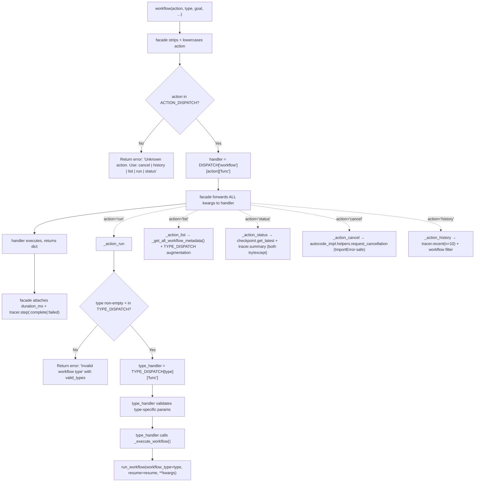
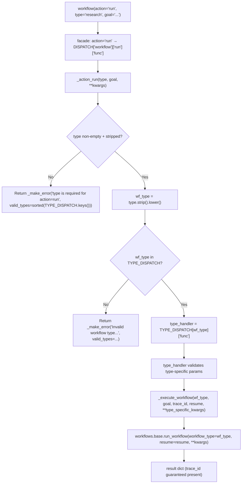

<- Back to [Workflow Overview](../WORKFLOW.md)

# 🏗️ Architecture

> **v1.0 — `@meta_tool` refactor with two-level dispatch.** The 263-line monolithic `tools/workflow.py` was collapsed into a 174-line facade + an 18-file `workflow_ops/` subpackage. Two registries drive dispatch: `ACTION_DISPATCH` (what to do) and `TYPE_DISPATCH` (which workflow to run).

## 🔗 Source Code Reference

| File | Purpose |
|------|---------|
| `tools/workflow.py` | `@tool @meta_tool` facade (174 lines). Validates `action` non-empty + registered, forwards ALL params to the action handler, attaches `duration_ms` + `trace_id` to every result. |
| `tools/_meta_tool.py` | `@meta_tool` decorator — auto-generates `action: Literal["run", "list", "status", "cancel", "history"]` from `DISPATCH` and builds the docstring from per-action `help_text` + `examples`. |
| `tools/workflow_ops/__init__.py` | Subpackage entry — imports `_registry`, `_type_registry`, `actions/`, `types/` in that order so both dispatch tables are populated before `@meta_tool` reads `DISPATCH`. |
| `tools/workflow_ops/_registry.py` | **ACTION_DISPATCH** registry. `DISPATCH` is a nested dict keyed by `tool_name` → `action_name` → `{func, help, examples}`. `register_action("workflow", "run", ...)` decorator populates it. Duplicate registration raises `ValueError`. |
| `tools/workflow_ops/_type_registry.py` | **TYPE_DISPATCH** registry (the second level). Flat dict keyed by `type_name` → `{func, help}`. `register_type("research", ...)` decorator populates it. Duplicate registration raises `ValueError`. |
| `tools/workflow_ops/helpers.py` | Shared utilities: `_make_error()`, `_ensure_trace_id()`, `_validate_goal()`, `_execute_workflow()` (single entry point to `run_workflow()`), `_get_all_workflow_metadata()` (lazy imports each workflow module's `graph.py`), `_WORKFLOW_MODULES` map. |
| `tools/workflow_ops/actions/__init__.py` | Auto-discovery: globs `actions/*.py`, imports each — triggers `@register_action` decorators. Adding a new action = drop a file, no edits here. |
| `tools/workflow_ops/actions/run.py` | `@register_action("workflow", "run")` — the `run` action. Validates `type` non-empty + registered in `TYPE_DISPATCH`, then forwards ALL params to the type handler. Intentionally thin: no type-specific validation here. |
| `tools/workflow_ops/actions/list_workflows.py` | `@register_action("workflow", "list")` — calls `_get_all_workflow_metadata()` + augments with `TYPE_DISPATCH` entries that aren't in the static `_WORKFLOW_MODULES` map (e.g. `auto`, a router pseudo-type). |
| `tools/workflow_ops/actions/status.py` | `@register_action("workflow", "status")` — requires `trace_id`. Wraps `core.observability.checkpoint.get_latest()` + `tracer.summary()` in try/except so a missing module or tracer db error doesn't crash the action. |
| `tools/workflow_ops/actions/cancel.py` | `@register_action("workflow", "cancel")` — requires `trace_id`. Calls `workflows.autocode_impl.helpers.request_cancellation()` (autocode only). Catches `ImportError` separately (autocode not installed → success with "no cancellation mechanism" message). |
| `tools/workflow_ops/actions/history.py` | `@register_action("workflow", "history")` — calls `tracer.recent(n=10)`, filters to traces with a `workflow` field OR `category=="workflow"`, truncates `goal` to 80 chars. |
| `tools/workflow_ops/types/__init__.py` | Auto-discovery: globs `types/*.py`, imports each — triggers `@register_type` decorators. Adding a new type = drop a file, no edits here. |
| `tools/workflow_ops/types/research.py` | `@register_type("research")` — validates `goal`, calls `_execute_workflow("research", ...)`. |
| `tools/workflow_ops/types/data.py` | `@register_type("data")` — validates `goal`, forwards optional `code`. |
| `tools/workflow_ops/types/autocode.py` | `@register_type("autocode")` — fail-fast guards: `target_file` always required, `mode="fix_error"` requires `error_msg`, `mode="add_feature"` requires `feature_desc`. Forwards `target_file`/`mode`/`error_msg`/`feature_desc`/`files`/`git_diff`/`dry_run` to `_execute_workflow`. `files`/`git_diff`/`dry_run` are NEW v1.0 pass-through params (empty values NOT forwarded to match legacy behavior). |
| `tools/workflow_ops/types/deep_research.py` | `@register_type("deep_research")` — same shape as `research` — no special params. |
| `tools/workflow_ops/types/understand.py` | `@register_type("understand")` — validates `project_root` (always required). `[Bug #3 regression]` `project_root` forwarded to `run_workflow` via `_execute_workflow`. |
| `tools/workflow_ops/types/autoresearch.py` | `@register_type("autoresearch")` — validates `target_file` (always required). Forwards `target_file` + optional `project_root`. |
| `tools/workflow_ops/types/auto.py` | `@register_type("auto")` — router dispatch + confidence guard moved from old facade. Three outcomes: (1) router returns `workflow="direct"` → return `{status: "routed", workflow: "direct", tool, reason, trace_id}`; (2) router returns `confidence="low"` → return `{status: "needs_clarification", clarifying_questions, message, trace_id}` — `[Bug #6]` fires EVEN IF `clarifying_questions` is empty/None (provides default question); (3) router returns a specific type with non-low confidence → delegate to `TYPE_DISPATCH[actual_type]["func"]` (re-validates type-specific params) OR fall back to `_execute_workflow` directly for unknown routed types. Catches router exceptions and returns `_make_error("Failed to route workflow: ...")`. |
| `core/router.py` | `router.route()` — auto-routing for `type="auto"`. Unchanged in v1.0. |
| `core/tracer.py` | `tracer.new_trace()`, `tracer.step()`, `tracer.error()`, `tracer.summary()`, `tracer.recent()` — observability. |
| `core/observability/checkpoint.py` | `get_latest(trace_id)` — checkpoint journal lookup used by the `status` action. |
| `workflows/base.py` | `run_workflow()` — base workflow execution engine, invoked by `_execute_workflow()`. |
| `workflows/research_impl/graph.py` | Research workflow implementation (exports `WORKFLOW_METADATA`). |
| `workflows/data_impl/graph.py` | Data analysis workflow implementation. |
| `workflows/autocode_impl/` | Autocode workflow implementation (TDD + safety, exports `request_cancellation`). |
| `workflows/deep_research_impl/graph.py` | Deep research workflow implementation (ReAct loop). |
| `workflows/understand_impl/graph.py` | Codebase understanding workflow implementation. |
| `workflows/autoresearch_impl/graph.py` | Autonomous experiment-driven optimization workflow. |
| `tests/tools/workflow/` | Test suite (11 files, 98 tests) — see [§ Testing](#-testing). |

---

## 🌳 Module Tree

```text
tools/
├── _meta_tool.py                          # @meta_tool decorator (Literal enum + docstring generation)
└── workflow.py                            # @tool @meta_tool facade (174 lines) — thin router
                                            #   validates action, forwards kwargs, attaches duration_ms

tools/workflow_ops/                        # v1.0 NEW — 18 files, two-level dispatch subpackage
├── __init__.py                            # imports _registry, _type_registry, actions, types (in order)
├── _registry.py                           # ACTION_DISPATCH + register_action() decorator
├── _type_registry.py                      # TYPE_DISPATCH + register_type() decorator (second level)
├── helpers.py                             # _make_error, _ensure_trace_id, _validate_goal,
│                                          #   _execute_workflow (single entry to run_workflow),
│                                          #   _get_all_workflow_metadata, _WORKFLOW_MODULES map
├── actions/                               # META-level: what to do (5 actions)
│   ├── __init__.py                        # auto-discovery via Path.glob("*.py")
│   ├── run.py                             # @register_action("workflow", "run")
│   ├── list_workflows.py                  # @register_action("workflow", "list")
│   ├── status.py                          # @register_action("workflow", "status")
│   ├── cancel.py                          # @register_action("workflow", "cancel")
│   └── history.py                         # @register_action("workflow", "history")
└── types/                                 # WORKFLOW-TYPE-level: which workflow to run (7 types)
    ├── __init__.py                        # auto-discovery via Path.glob("*.py")
    ├── research.py                        # @register_type("research")
    ├── data.py                            # @register_type("data")
    ├── autocode.py                        # @register_type("autocode")  — fail-fast param guards
    ├── deep_research.py                   # @register_type("deep_research")
    ├── understand.py                      # @register_type("understand")
    ├── autoresearch.py                    # @register_type("autoresearch")
    └── auto.py                            # @register_type("auto")  — router dispatch + confidence guard

workflows/                                 # (unchanged in v1.0)
├── base.py                                # run_workflow() — base execution engine
├── research_impl/graph.py                 # exports WORKFLOW_METADATA for the `list` action
├── data_impl/graph.py
├── autocode_impl/                         # also exports helpers.request_cancellation() for `cancel`
├── deep_research_impl/graph.py
├── understand_impl/graph.py
└── autoresearch_impl/graph.py

tests/tools/workflow/                      # v1.0 NEW — 11 files, 98 tests
├── conftest.py                            # 4 fixtures (mock_tracer, mock_router, mock_run_workflow,
│                                          #   mock_checkpoint) + make_mock_decision() helper
├── test_validation.py                     # 11 tests — action/type/goal validation + trace_id
├── test_autocode.py                       # 12 tests — autocode param guards + files/git_diff/dry_run
├── test_understand.py                     # 6 tests  — understand param guards + project_root forwarding
├── test_auto_routing.py                   # 9 tests  — direct / low-confidence / success / router exceptions
├── test_run.py                            # 14 tests — dispatch to all 7 types + param forwarding
├── test_list.py                           # 8 tests  — list action + metadata discovery + ImportError handling
├── test_status.py                         # 8 tests  — checkpoint + tracer lookup + error resilience
├── test_cancel.py                         # 6 tests  — cancel + autocode ImportError handling
├── test_history.py                        # 8 tests  — recent traces + workflow filter + goal truncation
└── test_dispatch.py                       # 16 tests — TestDispatch + TestRegistry + TestTypeRegistry
```

---

## 🔀 Two-Level Dispatch Pattern

The v1.0 refactor splits dispatch into **two dimensions**:

1. **ACTION_DISPATCH** (META-level — *what to do*) — `run | list | status | cancel | history`
2. **TYPE_DISPATCH** (WORKFLOW-TYPE-level — *which workflow to run*) — `research | data | autocode | deep_research | understand | autoresearch | auto`

Only the `run` action touches `TYPE_DISPATCH`. The other four actions (`list`, `status`, `cancel`, `history`) are leaf operations on the tracer / checkpoint journal — they don't need a `type`.



### Dispatch flow for `action="run"` (the only action that uses TYPE_DISPATCH)



### `_execute_workflow()` — the single entry point to `run_workflow()`

`helpers._execute_workflow(wf_type, goal, trace_id, resume, **kwargs)` is the ONLY function in the codebase that calls `workflows.base.run_workflow()`. It:

- Builds `run_kwargs` conditionally based on `wf_type` (mirrors the legacy facade branches)
- Forwards `code` only for `data` (and only if non-empty)
- Forwards `target_file`/`mode`/`error_msg`/`feature_desc` for `autocode` (always)
- Forwards `files`/`git_diff`/`dry_run` for `autocode` ONLY when non-empty/`True` (matches legacy "don't forward empty defaults" behavior)
- Forwards `project_root` for `understand` (always — fixes Bug #3)
- Forwards `target_file` (always) + `project_root` (optional) for `autoresearch`
- For `research` + `deep_research`: only `goal` + `trace_id` are forwarded
- Guarantees `trace_id` is present in the returned dict (falls back to wrapping non-dict results in `{status: success, result: ..., trace_id}`)

### `_get_all_workflow_metadata()` — for the `list` action

Iterates the static `_WORKFLOW_MODULES` map (`research`/`data`/`autocode`/`deep_research`/`understand`/`autoresearch` → module paths) and lazily `importlib.import_module()`s each one, reading its `WORKFLOW_METADATA` attribute. Broken modules (ImportError, missing attribute) show up as `{"name": <type>, "error": "metadata not available"}` rather than crashing the list action. The `list` action then augments this with `TYPE_DISPATCH` entries that aren't in the static map (specifically `auto`, a router pseudo-type without a graph module) — so the response shows ALL dispatchable types, not just the graph-backed ones.

### Checkpoint + tracer integration (for `status` / `history` actions)

- **`status`** — looks up both `core.observability.checkpoint.get_latest(trace_id)` (returns the checkpoint journal entry with `_checkpoint_node` + `status` keys) AND `tracer.summary(trace_id)` (returns a summary of all `tracer.step()` calls for that trace). Both are wrapped in `try/except` — a missing checkpoint module or tracer db error returns `checkpoint=False` / `tracer_summary=None` instead of crashing.
- **`history`** — calls `tracer.recent(n=10)` and filters to traces that have a `workflow` field OR `category == "workflow"`. This avoids polluting the response with non-workflow traces (tool calls, LLM calls). `goal` is truncated to 80 chars per entry to keep the response compact for LLM context.

---

## 💡 Key Design Decisions

- **Two-level dispatch (ACTION_DISPATCH + TYPE_DISPATCH)** — The user explicitly wanted `action` (meta-level: what to do) + `type` (workflow type: which workflow) as separate dispatch dimensions. This means `workflow(action="list")` doesn't need a `type`, and `workflow(action="status", trace_id=...)` doesn't need a `type` either — only `action="run"` dispatches into `TYPE_DISPATCH`. The `run` action handler is intentionally thin: it validates `type` is non-empty + registered, then forwards ALL params to the type handler. Type-specific validation (target_file, project_root, etc.) lives in the type handler so it's co-located with the type's other logic.

- **The `type` param name is KEPT (not renamed to `workflow_type`)** — The breaking change is that `type` alone no longer works — callers must use `action="run"` + `type="..."`. This minimizes call-site churn: every existing `workflow(type="research", goal="...")` call becomes `workflow(action="run", type="research", goal="...")` — just adding the `action="run"` prefix. Renaming `type` to `workflow_type` would have required changing every call site's param name AND adding the action param.

- **Auto-discovery for both levels** — Every action AND type module must be imported so its decorator runs. Hardcoding imports would create a maintenance footgun (forgetting to add a new action/type = silent omission from the `Literal` enum + "Unknown action" at runtime). `actions/__init__.py` and `types/__init__.py` both use `Path.glob("*.py")` to import every `.py` file (except `__init__.py` itself), triggering the `@register_action` / `@register_type` decorators. Adding a new file is the only change needed.

- **`@meta_tool` auto-generates the `action: Literal[...]` enum** — The facade declares `action: str = ""` in its signature; `@meta_tool` mutates `__annotations__["action"]` to `Literal["run", "list", "status", "cancel", "history"]` (sorted from `DISPATCH` keys, validated against `^[a-z][a-z0-9_]*$`). It also deletes `__signature__` to force `inspect.signature()` re-derivation, and builds the docstring from per-action `help_text` + `examples`. Decorator order: `@tool` (outer) → `@meta_tool` (inner) — `@meta_tool` mutates in place, `@tool` marks the result.

- **The `auto` type delegates to `TYPE_DISPATCH[routed_type]`** — Rather than calling `_execute_workflow` directly, the auto type handler calls the routed type's handler (`TYPE_DISPATCH[actual_type]["func"]`). This means the routed type's handler re-validates its specific params (e.g. autocode requires `target_file`). If the auto-routed call is missing required params, the user gets a clean validation error from the type handler instead of a confusing crash inside `run_workflow`. If the routed type isn't in `TYPE_DISPATCH` (unknown routed type), it falls back to calling `_execute_workflow` directly with just `goal` + `trace_id` + `resume` — matching the legacy behavior.

- **`_make_error()` is kept (NOT switched to `fail()`)** — The workflow tool's error contract requires `trace_id` on EVERY response, including errors from early validation. `fail()` from `registry.py` doesn't include `trace_id`. The workflow tool also returns `status="error"` (not `"failed"`) for backwards compat with existing JSONL log analyzers. Every error path goes through `_make_error(error, trace_id, **extra)`.

- **`files` / `git_diff` / `dry_run` are only forwarded when non-empty/`True`** — Matches the legacy behavior for `code` (data workflow): empty params aren't forwarded to avoid confusing the workflow with empty defaults. The autocode workflow's v1.1.2 git-diff input mode + pre-flight dry run are opt-in features that default to off.

- **Cancel catches `ImportError` separately from other exceptions** — If `workflows.autocode_impl.helpers` can't be imported (autocode not installed in this deployment), the cancel action returns success with a "no cancellation mechanism is available" message — distinct from a runtime failure of `request_cancellation()`. This makes cancel resilient to deployments that don't include the autocode workflow.

- **Status wraps checkpoint + tracer lookups in try/except** — A missing `core.observability.checkpoint` module or a tracer db error doesn't crash the action — it returns success with `checkpoint=False` or `tracer_summary=None`. This makes status resilient to partial deployments.

- **History filters to workflow traces** — Traces with a `workflow` field OR `category == "workflow"` pass the filter; everything else (tool calls, LLM calls) is dropped. The `goal` is truncated to 80 chars to keep the response compact for LLM context.

- **Lazy router import** — `core.router` is imported inside `types/auto.py`'s `_type_auto()` body (not at module top) to prevent startup circular dependencies. Same pattern as Pre-v1, just moved into the type handler.

- **Resume support** — `resume=True` passes through `_execute_workflow()` to `run_workflow()` for continuing interrupted workflows from checkpoint. Currently embedded in `run` via the `resume` param; the roadmap suggests extracting it into a separate `action="resume"` (see [CHANGELOG.md § In Progress](CHANGELOG.md#-in-progress--next-up)).

- **NOT parallel-safe** — Workflows are long-running blocking calls. The facade's docstring explicitly notes "Do NOT add to PARALLEL_SAFE". The router already routes to `workflow` for workflow intents — no router changes needed for v1.0.

---

## 🧪 Testing

```powershell
# Run all workflow tests (11 files, 98 tests)
.\venv\Scripts\python tests/tools/workflow/ -W error --tb=short -v
```

> **Note:** Ensure `pytest` resolves to your venv. If not, use `python -m pytest` or the full venv path (`venv\Scripts\pytest.exe` on Windows, `venv/bin/pytest` on Unix).

**Current test layout (v1.0):**
```text
tests/tools/workflow/                       # 11 files, 98 tests
├── conftest.py                             # 4 fixtures + make_mock_decision() helper
├── test_validation.py                      # 11 tests
├── test_autocode.py                        # 12 tests
├── test_understand.py                      # 6 tests
├── test_auto_routing.py                    # 9 tests
├── test_run.py                             # 14 tests
├── test_list.py                            # 8 tests
├── test_status.py                          # 8 tests
├── test_cancel.py                          # 6 tests
├── test_history.py                         # 8 tests
└── test_dispatch.py                        # 16 tests
                                            # TOTAL: 98 tests
```

**Test coverage by concern:**

| File | Tests | Coverage |
|------|-------|----------|
| `test_validation.py` | 11 | empty action, unknown action, case-insensitive action, empty `type` for `run`, invalid `type` for `run`, case-insensitive `type`, empty/whitespace `goal`, `trace_id` auto-generation + preservation |
| `test_autocode.py` | 12 | missing `target_file`, `fix_error` missing `error_msg`, `add_feature` missing `feature_desc`, missing `goal`, successful execution (improve/fix_error/add_feature modes), `files`/`git_diff`/`dry_run` pass-through (forwarded + NOT forwarded when empty), execution exception handling |
| `test_understand.py` | 6 | missing `project_root`, whitespace `project_root`, missing `goal`, successful execution, `[Bug #3]` `project_root` forwarded to `run_workflow`, `workflow_type` correct |
| `test_auto_routing.py` | 9 | routes to `direct` (no execution), routes to workflow (high confidence), `[Bug #6]` low confidence with empty/None questions still aborts, low confidence with questions aborts + forwards questions, high/medium confidence proceeds to execution, router exception returns clean error, `auto` missing `goal` returns error before router call |
| `test_run.py` | 14 | dispatch to all 7 types (research/data/autocode/deep_research/understand/autoresearch/auto), `type` validation (missing/invalid/case-insensitive), param forwarding (`resume`, `trace_id`, `code`, `target_file`, `project_root`) |
| `test_list.py` | 8 | returns success, returns `workflows` dict (all 7 types present), includes `count`, includes `trace_id`, works without `trace_id`, metadata includes required fields, handles missing module (`ImportError` → error entry), handles missing `WORKFLOW_METADATA` attr |
| `test_status.py` | 8 | requires `trace_id`, whitespace `trace_id`, with checkpoint (reports node + status), without checkpoint (`checkpoint=False`), includes `tracer.summary`, handles tracer error, handles checkpoint `ImportError`, handles checkpoint `RuntimeError` |
| `test_cancel.py` | 6 | requires `trace_id`, whitespace `trace_id`, calls `request_cancellation`, returns success message mentioning `trace_id` + autocode limitation, handles `request_cancellation` exception, handles `ImportError` (autocode not installed → success with "no cancellation mechanism" message) |
| `test_history.py` | 8 | returns success, returns `runs` list, filters non-workflow traces (only traces with `workflow` field OR `category==workflow`), truncates `goal` to 80 chars, handles empty recent, includes `trace_id`, calls `tracer.recent(n=10)`, handles tracer exception |
| `test_dispatch.py` | 16 | `TestDispatch` (unknown action, empty action, case-insensitive, `duration_ms` present, handler exception caught, `trace_id` threaded), `TestRegistry` (5 actions in `DISPATCH`, all have metadata, names match `^[a-z][a-z0-9_]*$`, facade action `Literal` generated, docstring has action list + `doc_sections`), `TestTypeRegistry` (7 types in `TYPE_DISPATCH`, all have metadata, names match pattern, `"report"` excluded) |

**Mock strategy:**
- `mock_tracer` fixture patches `tracer` in THREE modules simultaneously via `ExitStack`: `tools.workflow.tracer`, `tools.workflow_ops.helpers.tracer`, `tools.workflow_ops.types.auto.tracer`. This is necessary because Python's `from core.tracer import tracer` creates a local binding to the tracer object at import time — patching `core.tracer.tracer` after import doesn't affect existing bindings. Each module that did `from core.tracer import tracer` has its own `tracer` name that must be patched individually. (Same pitfall documented as Anti-Pattern #1 in consult-v1.0-staging and vision-v1.0-staging.)
- `mock_router` fixture patches `core.router.router.route()` to return a `make_mock_decision()` helper object with `.workflow`, `.confidence`, `.clarifying_questions`, `.tool`, `.reason` attributes.
- `mock_run_workflow` fixture patches `workflows.base.run_workflow` to return a deterministic dict.
- `mock_checkpoint` fixture patches `core.observability.checkpoint.get_latest` for `test_status.py`.

---

*Last updated: 2026-07-15 (v1.0). See [API.md](API.md) for action details, [CHANGELOG.md](CHANGELOG.md) for version history, [INSTRUCTIONS.md](INSTRUCTIONS.md) for AI editing rules.*
