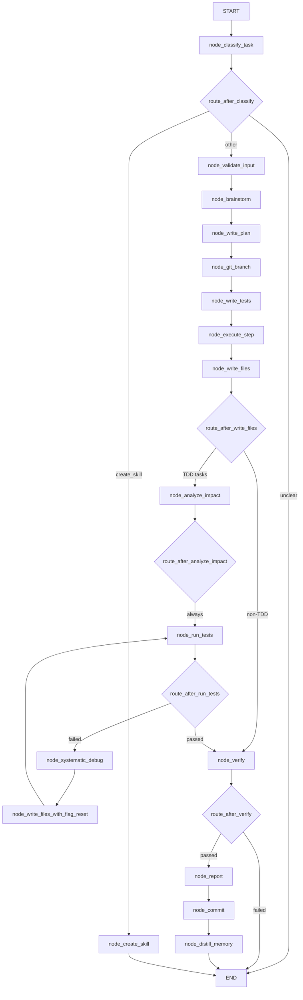

# 🤖 Autocode Workflow

The `autocode` workflow is a fully autonomous, safety-first LangGraph state machine designed to fix bugs, add features, audit code, and scaffold new skills without human intervention. It strictly adheres to **Test-Driven Development (TDD)** principles, workspace isolation, and architectural safety guardrails.

**Key characteristics:**
- **Task classification** — Router model classifies intent into 7 categories (feature, fix, refactor, edit, audit, create_skill, unclear)
- **TDD on disk** — Tests run via real `pytest` subprocess; exit codes are ground truth
- **Surgical patching** — `str_replace` patches preferred over full file rewrites for token efficiency
- **Git scoping** — Workspace-scoped branches and commits; protected file enforcement
- **Knowledge graph integration** — Blast radius analysis via `core.kgraph` for impact assessment
- **Self-correcting loop** — Debug → retry cycle with temperature jitter and memory learning
- **Hallucination guard** — Real pytest exit codes override LLM claims
- **Best-effort nodes** — Report, memory, and notification never fail the workflow

---

## 🚀 Quick Start

```python
from workflows.autocode import run_autocode_agent

# Fix a bug
result = run_autocode_agent(
    task="Fix the timeout handling in web search",
    files={"tools/web.py": open("tools/web.py").read()},
    mode="fix_error",
)

# Add a feature
result = run_autocode_agent(
    task="Add browser fallback to web.search_and_read",
    files={"tools/web.py": open("tools/web.py").read()},
    mode="feature",
)

# Create a skill
result = run_autocode_agent(
    task="Create a skill that fetches weather data from Open-Meteo API",
    mode="create_skill",
)

print(result["status"])   # "done" | "failed" | "needs_clarification"
print(result["result"])   # Human-readable summary
print(result["commit_sha"])  # Git commit hash (if committed)
```

---

## 🏗️ Architecture

```text
workflows/autocode.py (facade)
└── run_autocode_agent(task, files, mode, target_file, dry_run)
    └── get_graph().compile().invoke(state)
        └── build_graph() → 16 nodes + 7 conditional edges

workflows/autocode_helpers/
├── graph.py                    # StateGraph builder: 16 nodes + conditional edges
├── state.py                    # AutocodeState TypedDict + _default_state()
├── routes.py                   # 7 routing functions
├── constants.py                # 9 system prompts (classifier, brainstorm×5, plan, test, coder, debug, verify)
├── helpers.py                  # _call(), _extract_code(), _parse_json(), _parse_json_array(), _files_context(), _write_files(), _get_autocode_run_path(), _cleanup_old_autocode_runs()
├── git_ops.py                  # _git_snapshot(), _git_commit(), _git_create_branch()
├── patch.py                    # apply_patch(), apply_patches(), extract_relevant_sections()
├── mermaid.py                  # export_mermaid() — LangGraph → Mermaid diagram
├── test_runner.py              # run_tests_on_disk() — real pytest subprocess (legacy, superseded by nodes/run_tests.py)
├── test_mapper.py              # _build_test_index(), get_targeted_tests() — AST reverse-index for targeted testing
│
└── nodes/
    ├── classify.py             # node_classify_task — Router LLM classification + mode override
    ├── validate.py             # node_validate_input — task/mode/files validation, path traversal guard
    ├── brainstorm.py           # node_brainstorm — Planner LLM spec refinement + memory recall + KG context injection
    ├── plan.py                 # node_write_plan — Planner LLM step-by-step plan + blast radius context
    ├── branch.py               # node_git_branch — Snapshot + branch creation (git scoping)
    ├── tests.py                # node_write_tests — Executor LLM failing test generation (TDD red)
    ├── execute.py              # node_execute_step — Executor LLM code/patch generation
    ├── write_files.py          # node_write_files — str_replace patches + new file writes + filelock + .bak
    │   └── node_write_files_with_flag_reset — Same + resets step_attempt flag
    ├── run_tests.py            # node_run_tests — Real pytest subprocess + targeted test mapping
    │   └── run_tests_on_disk() — Subprocess runner (also used by analyze_impact)
    ├── analyze_impact.py       # node_analyze_impact — KG blast radius + stale graph micro-update + targeted tests
    ├── debug.py                # node_systematic_debug — Root-cause analysis + temperature jitter + blast radius
    ├── verify.py               # node_verify — Fresh pytest + ruff + LLM review + hallucination guard
    ├── commit.py               # node_commit — Atomic git commit with structured message
    ├── memory.py               # node_distill_memory — Procedural rule extraction via distill_workflow()
    ├── create_skill.py         # node_create_skill — Skill file scaffolding in skills/
    └── report.py               # node_report — HTML code audit report (best-effort)
```

### Execution Flow



**Key design decisions:**
- **Mode override takes priority** — `node_classify_task` first classifies via Router LLM, then overrides with `mode` param (`fix_error`→`fix`, `improve`→`refactor`, etc.). This lets the caller force a task type regardless of the Router's classification.
- **TDD red-green-refactor on disk** — `node_write_tests` generates failing tests, `node_execute_step` generates code, `node_run_tests` runs real pytest. Exit codes are ground truth — the LLM cannot hallucinate a pass.
- **Surgical patching preferred** — `node_write_files` applies `str_replace` patches via `patch.apply_patch()`. Only falls back to full file writes for new files or major restructures. 5-10x token reduction vs full rewrites.
- **Filelock + .bak for atomicity** — Every write uses `FileLock(timeout=10)` and creates `.bak` backups. Failed writes restore from backup.
- **Git scoping via project_root** — All git ops (`_git_snapshot`, `_git_create_branch`, `_git_commit`) accept `project_root`. If set, operations target the workspace repo; otherwise, the agent root. Prevents cross-repo pollution.
- **Protected file enforcement** — `cfg.is_protected(target)` blocks writes to `server.py`, `registry.py`, `core/config.py`, `core/llm.py`, `core/memory.py`, `core/gateway.py`, `core/tracer.py`.
- **Blast radius via KG** — `node_brainstorm` and `node_write_plan` inject knowledge graph caller context. `node_analyze_impact` runs stale graph micro-updates and targeted test mapping.
- **Temperature jitter in debug** — `node_systematic_debug` increases temperature with each retry iteration (`0.1 + iteration * 0.15`, capped at 0.8). Prevents the LLM from getting stuck in the same local minimum.
- **Hallucination guard in verify** — `node_verify` checks: if pytest failed but LLM claims pass, the LLM claim is overridden. Real exit codes always win.
- **Per-run artifact directory** — `_get_autocode_run_path()` creates `workspace/autocode/YYYYMMDD/{trace_id}/` for test files, generated code, and debug logs.
- **Best-effort side effects** — `node_report`, `node_distill_memory`, and `node_commit` catch exceptions. A failed report or memory store never fails the workflow.
- **LangGraph immutability** — All nodes return `dict` (partial updates), never `AutocodeState`. Never mutate `state` in-place. Never spread `**state`.

---

## 📝 Workflow State

```python
class AutocodeState(TypedDict, total=False):
    # Core task
    task: str
    files: dict[str, str]
    mode: str
    target_file: str
    trace_id: str
    dry_run: bool

    # Classification
    task_type: str
    project_root: str
    autocode_run_path: str

    # Brainstorm/Plan
    brainstorm_notes: str
    plan: list[dict]
    plan_accepted: bool
    spec: str

    # TDD loop
    tdd_iteration: int
    tdd_source_code: str
    tdd_error: str
    tdd_status: str
    max_retries: int
    files_map: dict[str, FileSnapshot]
    current_step: int

    # Execution
    execution_notes: str
    modified_files: list[str]

    # Test results
    test_results: dict
    tests_written: bool
    test_code: str
    test_files: list[str]

    # Impact Analysis
    impact_warnings: list[dict]
    targeted_test_cmd: str | None
    analyze_impact_failed: bool

    # Debug
    debug_notes: str
    root_cause: str
    defense_notes: str

    # Verification
    verification_notes: str
    verify_report: str
    verification_passed: bool

    # Git
    commit_sha: str
    branch_name: str

    # Memory
    memory_notes: str
    memory_context: str

    # Skill
    skill_path: str

    # Messages (with reducer)
    messages: Annotated[list[AnyMessage], add_messages]

    # Status
    status: str
    error: str
    error_log: str
    result: str
    patch_errors: list[str]
    step_attempt: int
    evidence_outputs: dict
```

| Field | Type | Description |
|-------|------|-------------|
| `task` | `str` | Original user task description |
| `files` | `dict[str, str]` | File paths → content provided by user |
| `mode` | `str` | Caller override: `feature`, `fix_error`, `improve`, `edit`, `create_skill`, `audit` |
| `task_type` | `str` | Final classification: `feature`, `fix`, `refactor`, `edit`, `audit`, `create_skill`, `unclear` |
| `spec` | `str` | Refined specification with acceptance criteria, constraints, impact review |
| `plan` | `list[dict]` | Execution steps: `[{id, label, description, acceptance, files}]` |
| `current_step` | `int` | Index into `plan` |
| `tdd_source_code` | `str` | JSON string: `{"patches": [...], "new_files": {...}}` |
| `tdd_status` | `str` | `"passed"` | `"failed"` | `"max_retries_exceeded"` | `""` |
| `test_results` | `dict` | `{success, stdout, stderr, returncode}` from pytest |
| `modified_files` | `list[str]` | Files touched by patches/new_files |
| `impact_warnings` | `list[dict]` | `{type, message, agent_fault}` — mapping miss, zombie test, critical path, AST error |
| `targeted_test_cmd` | `str` | `"pytest tests/test_a.py tests/test_b.py"` or `"pytest"` (full suite fallback) |
| `verification_passed` | `bool` | Dual-gate: automated pytest pass + LLM spec/cleanliness checks |
| `commit_sha` | `str` | Git commit hash (empty if no changes or dry_run) |
| `project_root` | `str` | Workspace repo root for git scoping |
| `autocode_run_path` | `str` | Per-run directory: `workspace/autocode/YYYYMMDD/{trace_id}/` |

---

## ⚡ Nodes

### `node_classify_task` — Task Classification

Uses Router LLM (`_call(role="router")`) to classify the task. Then applies mode override:

| Mode Param | Overrides to | Task Type |
|------------|-------------|-----------|
| `fix_error` | `fix` | Root-cause fix, no questions |
| `improve` | `refactor` | Restructure without behavior change |
| `edit` | `edit` | Intentional change with impact review |
| `create_skill` | `create_skill` | Scaffold skill file |
| `audit` | `audit` | Deep security review |

If `task_type == "unclear"` and questions exist, returns `"needs_clarification"` status immediately.

**Output:** `task_type`

### `node_validate_input` — Input Validation

Validates before processing:
1. Task is non-empty string
2. Mode is in valid set (`feature`, `fix`, `fix_error`, `refactor`, `improve`, `edit`, `create_skill`, `audit`)
3. Files is a dict (if provided)
4. No path traversal (`..`, absolute paths)

**Output:** Empty dict (pass) or `{"status": "error", "error": ...}`

### `node_brainstorm` — Spec Refinement

Planner LLM refines the task into a structured spec. Per-task-type system prompts:

| Task Type | Prompt | Behavior |
|-----------|--------|----------|
| `fix` | `FIX_BRAINSTORM_SYSTEM` | Zero questions, root-cause analysis, 2-4 acceptance criteria |
| `edit` | `EDIT_BRAINSTORM_SYSTEM` | Impact review mandatory, no questions unless ambiguous |
| `refactor` | `REFACTOR_BRAINSTORM_SYSTEM` | Restructuring focus, max 1 question |
| `audit` | `AUDIT_BRAINSTORM_SYSTEM` | Security review, impact assessment, 3-5 acceptance criteria |
| `feature` / other | `BRAINSTORM_SYSTEM` | Max 3 questions, YAGNI spec |

**Memory recall:** Queries procedural + episodic memory for past fixes.
**KG context injection:** `find_relevant_files()` injects up to 5 relevant files from the knowledge graph.
**Sleep & Learn rules:** `inject_rules_into_prompt()` augments the system prompt with learned rules.

**Output:** `spec`, `memory_context`, optionally `files` (KG-injected)

### `node_write_plan` — Plan Generation

Planner LLM generates a granular implementation plan (max 8 steps). First step MUST be `write_tests`. Last step MUST be `verify`.

**Blast radius context:** `get_callers()` injects up to 5 unique callers of modified files as a warning.

**Output:** `plan`, `branch`, `current_step`

### `node_git_branch` — Git Snapshot + Branch

1. `_git_snapshot("pre-autocode: ...")` — stashes current state
2. `_git_create_branch(branch)` — creates `autocode/{slug}` branch

**Git scoping:** Uses `project_root` from state if set, else `cfg.agent_root`.

**Output:** Empty dict (side effects only)

### `node_write_tests` — TDD Red Phase

Executor LLM writes failing tests. Covers all acceptance criteria from spec.

**Output:** `test_code`, `current_step`

### `node_execute_step` — Code Generation

Executor LLM generates code for the current plan step. Returns JSON:
```json
{"patches": [{"path": "...", "old": "...", "new": "..."}], "new_files": {"path": "content"}, "explanation": ""}
```

**Output:** `tdd_source_code`, `modified_files`, `current_step`, `execution_notes`

### `node_write_files` — File Application

Applies patches and writes new files:
1. **Patches:** `apply_patch(target, old, new)` — exact `str_replace`, `.bak` backup, filelock
2. **New files:** Full write with filelock + `.bak`
3. **Protected file guard:** `cfg.is_protected(target)` blocks core files
4. **Persist artifacts:** Test file, generated code JSON, debug log to per-run directory

**Output:** `patch_errors`, `test_files`, `autocode_run_path`

### `node_analyze_impact` — Impact Analysis

1. **Stale graph micro-update:** Compares MD5 hashes, updates `GraphStore` for changed files
2. **Targeted test mapping:** `get_targeted_tests()` returns precise pytest command via AST reverse-index
3. **Critical path detection:** If modified file is in `CRITICAL_PATHS`, runs full suite
4. **Warning classification:** `MAPPING_MISS`, `ZOMBIE_TEST`, `NO_TEST_MAPPING`, `CRITICAL_PATH`, `AST_ERROR`

**Output:** `impact_warnings`, `targeted_test_cmd`, `analyze_impact_failed`

### `node_run_tests` — Test Execution

Runs real pytest subprocess:
- Uses `targeted_test_cmd` from impact analysis (or full suite fallback)
- Runs in `project_root` directory for correct imports
- Timeout: `cfg.sandbox_timeout`
- On pass: stores procedural memory `"TDD converged after N iterations"`
- On fail: sets `tdd_status="failed"`, `tdd_error=stderr`

**Output:** `test_results`, `tdd_iteration`, `tdd_status`, `tdd_error`

### `node_systematic_debug` — Root-Cause Analysis

1. **Max retries check:** If `tdd_iteration > max_retries`, stores failure memory and exits loop
2. **Temperature jitter:** `retry_temp = min(0.1 + iteration * 0.15, 0.8)`
3. **Blast radius context:** `get_callers()` injects caller warnings
4. **LLM diagnosis:** Executor analyzes traceback, returns `{"root_cause", "defense_notes", "fix"}`
5. **Loop back:** Sets `tdd_source_code = fix`, routes to `node_write_files_with_flag_reset`

**Output:** `root_cause`, `defense_notes`, `tdd_source_code`, `debug_notes`

### `node_verify` — Verification Gate

**Three-layer verification:**
1. **Fresh pytest:** Runs on autocode run directory. Real exit code is ground truth.
2. **Ruff lint:** Advisory only (non-fatal). Checks `E,F` rules.
3. **LLM review:** Checks syntax, tests, spec, regressions, cleanliness.

**Hallucination guard:** If pytest failed but LLM claims `automated_checks_passed=True`, the LLM claim is overridden.

**Dual-gate decision:** `all_passed = automated_ok AND llm_checks_ok`

**Output:** `verification_passed`, `verification_notes`, `evidence_outputs`

### `node_commit` — Atomic Commit

Structured commit message:
```
feat(autocode): {task[:60]}

- Type: {task_type}
- Steps: {labels}
- Tests: pass
- Verified: yes
```

**Git scoping:** Uses `project_root` from state.

**Output:** `status`, `commit_sha`, `result`

### `node_distill_memory` — Procedural Learning

Calls `distill_workflow(trace_text=..., trace_id=...)` to extract reusable rules from the completed workflow.

Skips for `unclear` and `create_skill` tasks.

**Output:** Empty dict (side effect: procedural memory stored)

### `node_create_skill` — Skill Scaffolding

Executor LLM generates a self-contained skill file in `skills/`:
- Gathers data from public API
- Parses and filters
- Formats as report string
- Registers with `@tool`

**Output:** `skill_path`, `status`, `result`

### `node_report` — HTML Audit Report

Best-effort report generation via `report(action="report", preset="code_audit")`.

Sections: Task, Files Changed, Test Results, Verification, Commit.

**Output:** Empty dict (side effect only)

---

## 🔄 Conditional Routing

### `route_after_classify`

| Condition | Route |
|-----------|-------|
| `task_type == "unclear"` | → `END` |
| `task_type == "create_skill"` | → `node_create_skill` |
| Otherwise | → `node_validate_input` |

### `route_after_write_files`

| Condition | Route |
|-----------|-------|
| `task_type in ["fix", "fix_error", "refactor", "improve", "feature"]` | → `node_analyze_impact` (TDD path) |
| Otherwise | → `node_verify` (non-TDD path) |

### `route_after_analyze_impact`

Always → `node_run_tests` (impact analysis is a pre-test gate)

### `route_after_run_tests`

| Condition | Route |
|-----------|-------|
| `tdd_status == "passed"` or `test_results.success` | → `node_verify` |
| `tdd_status == "max_retries_exceeded"` | → `node_verify` (fail gracefully) |
| Otherwise | → `node_systematic_debug` |

### `route_after_debug`

| Condition | Route |
|-----------|-------|
| `tdd_status == "max_retries_exceeded"` | → `node_verify` (exit loop) |
| Otherwise | → `node_write_files_with_flag_reset` (retry) |

### `route_after_verify`

| Condition | Route |
|-----------|-------|
| `verification_passed == True` | → `node_report` |
| Otherwise | → `END` |

---

## ⚙️ Configuration

```ini
# .env
AUTOCODE_MAX_RETRIES=3
AUTOCODE_MAX_FILE_CHARS=6000
AUTOCODE_DEBUG=0
EXECUTION_TIMEOUT=120
PLANNER_TIMEOUT=180
ROUTER_TIMEOUT=60
AUTOCODE_GRAPH_TIMEOUT=300
```

```python
# core/config.py
self.autocode_max_retries = int(os.getenv("AUTOCODE_MAX_RETRIES", "3"))
self.autocode_max_file_chars = int(os.getenv("AUTOCODE_MAX_FILE_CHARS", "6000"))
self.autocode_debug = int(os.getenv("AUTOCODE_DEBUG", "0"))
self.execution_timeout = int(os.getenv("EXECUTION_TIMEOUT", "120"))
self.planner_timeout = int(os.getenv("PLANNER_TIMEOUT", "180"))
self.router_timeout = int(os.getenv("ROUTER_TIMEOUT", "60"))
self.autocode_graph_timeout = int(os.getenv("AUTOCODE_GRAPH_TIMEOUT", "300"))
```

---

## 📤 Output

The workflow returns a dict:

```json
{
  "status": "done",
  "result": "autocode complete -- abc1234
Branch: autocode/fix-timeout-handling
...",
  "trace_id": "abc123",
  "commit_sha": "abc1234",
  "error": "",
  "verification_notes": "Automated: PASS | LLM: PASS
...",
  "modified_files": ["tools/web.py"]
}
```

**Side effects:**
- Git branch + snapshot + commit
- Files modified (patches or new files)
- Procedural memory stored
- HTML report generated (best-effort)
- Per-run artifacts in `workspace/autocode/YYYYMMDD/{trace_id}/`

---

## 🔄 When to Use vs Alternatives

| Need | Tool/Workflow | Why |
|------|---------------|-----|
| Fix a bug | `autocode` (mode=`fix_error`) | Root-cause analysis, TDD loop, verification |
| Add a feature | `autocode` (mode=`feature`) | Full TDD cycle with planning and impact analysis |
| Refactor code | `autocode` (mode=`improve`) | AST validation, behavioral parity checks |
| Edit existing code | `autocode` (mode=`edit`) | Impact review, regression testing |
| Security audit | `autocode` (mode=`audit`) | Deep review, no code changes |
| Create a skill | `autocode` (mode=`create_skill`) | Scaffold self-contained skill file |
| Quick file edit | `file(action="edit")` | Faster, no TDD overhead |
| Simple code generation | `python` tool | Direct execution, no git/commit |
| Research a topic | `research` / `deep_research` | Information gathering, not code generation |

---

## 🧪 Testing

```powershell
# Run all autocode tests
D:\mcp\agent\venv\Scripts\pytest.exe tests/workflows/autocode/ -W error --tb=short -v
```

**Test coverage (8 files):**

| File | Tests | Coverage |
|------|-------|----------|
| `test_nodes.py` | — | Individual node behavior: classify, validate, brainstorm, plan, execute, write_files, verify, commit, memory, create_skill |
| `test_integration.py` | — | End-to-end workflow: full TDD cycle, git operations, file writes |
| `test_tdd_cycle_and_safety.py` | — | TDD loop: red→green→refactor, max retries, debug iteration, temperature jitter, protected files |
| `test_verification_and_graph_flow.py` | — | Verification gate, hallucination guard, graph construction, routing logic |
| `test_regressions.py` | — | Regression tests: state schema drift, LangGraph immutability, backward compatibility |
| `test_git_scoping.py` | — | Git branch creation, snapshot, commit, workspace vs agent root scoping |
| `test_state_schema.py` | — | AutocodeState TypedDict validation, default state creation |
| `test_analyze_impact.py` | — | Impact analysis, targeted test mapping, blast radius, stale graph micro-update |

**Mock strategy:**
- Patch `core.llm.llm.complete` for all LLM node tests
- Patch `tools.git.git` for git operation tests
- Patch `workflows.autocode_helpers.patch.apply_patch` for patch tests
- Patch `core.kgraph.queries.get_callers` / `find_relevant_files` for KG tests
- Patch `core.memory.memory.store` / `.recall` for memory tests
- Patch `subprocess.run` for pytest/ruff tests
- Patch `core.config.cfg.is_protected` for protected file tests
- Use `tmp_path` fixture for file write tests

**Current test layout:**
```text
tests/workflows/autocode/
├── __init__.py
├── test_analyze_impact.py
├── test_git_scoping.py
├── test_integration.py
├── test_nodes.py
├── test_regressions.py
├── test_state_schema.py
├── test_tdd_cycle_and_safety.py
└── test_verification_and_graph_flow.py
```

> **Future:** When the workflow grows, consider splitting `test_nodes.py` into per-node files and adding `conftest.py`.

---

## 🗺️ Roadmap

### ✅ Completed

| Feature | Status | Notes |
|---------|--------|-------|
| 16-node LangGraph state machine | ✅ v1.0 | classify → validate → brainstorm → plan → branch → tests → execute → write_files → analyze_impact → run_tests → debug → verify → report → commit → distill → create_skill |
| Task classification (7 types) | ✅ v1.0 | feature, fix, refactor, edit, audit, create_skill, unclear |
| Mode override | ✅ v1.0 | Caller can force task type regardless of Router classification |
| TDD on disk with real pytest | ✅ v1.0 | Subprocess execution, exit codes are ground truth |
| Surgical str_replace patching | ✅ v1.0 | `patch.apply_patch()` with exact match, .bak backup, filelock |
| Git scoping | ✅ v1.0 | project_root routes ops to workspace repo or agent root |
| Protected file enforcement | ✅ v1.0 | `cfg.is_protected()` blocks core infrastructure files |
| Knowledge graph integration | ✅ v1.0 | Blast radius analysis, relevant file injection, stale graph micro-update |
| Targeted test mapping | ✅ v1.0 | AST reverse-index via `test_mapper.py`, critical path detection |
| Temperature jitter in debug | ✅ v1.0 | `0.1 + iteration * 0.15`, capped at 0.8 |
| Hallucination guard | ✅ v1.0 | Real pytest exit codes override LLM claims |
| Per-run artifact directory | ✅ v1.0 | `workspace/autocode/YYYYMMDD/{trace_id}/` |
| LangGraph immutability | ✅ v1.0 | Partial update dicts, no in-place mutation, no `**state` spreading |
| Sleep & Learn integration | ✅ v1.0 | `inject_rules_into_prompt()` in brainstorm and plan |
| Procedural memory distillation | ✅ v1.0 | `distill_workflow()` extracts reusable rules |
| Best-effort side effects | ✅ v1.0 | report, memory, commit never fail the workflow |
| File size limits | ✅ v1.0 | `AUTOCODE_MAX_FILE_CHARS` prevents context overflow |
| Path traversal guard | ✅ v1.0 | `..` and absolute paths rejected in validation |
| Ruff lint integration | ✅ v1.0 | Advisory linting in verify node |

### 🔄 In Progress / Next Up

| Feature | Notes | Priority |
|---------|-------|----------|
| `@meta_tool` refactor on tools used | When `git`, `file`, `report` get `@meta_tool`, update calls in nodes | P1 |
| Test restructure | Split `test_nodes.py` into per-node files, add `conftest.py` | P1 |
| Parallel sub-query dispatch in brainstorm | Use LangGraph `Send` for multiple file analysis in parallel | P2 |
| Configurable max plan steps | Hardcoded max 8 steps. Make configurable via `.env` | P2 |
| Configurable patch context lines | `extract_relevant_sections` uses hardcoded 15 lines. Make configurable | P2 |
| Patch retry with expanded context | When `apply_patch` fails with `occurrences > 1`, auto-expand context and retry | P2 |
| Test result caching | Cache pytest results per file hash to avoid redundant test runs | P2 |
| Cross-project skill reuse | When a skill already exists for a similar API, suggest reuse instead of creation | P3 |
| Interactive clarification loop | Instead of immediate END on unclear, allow 1-2 back-and-forth clarifications | P3 |
| Multi-file patch atomicity | Currently patches are applied sequentially. Add transaction rollback on any failure | P3 |
| AST-based patch validation | Validate that patches don't introduce syntax errors before applying | P3 |
| Configurable critical paths | `CRITICAL_PATHS` is hardcoded in `test_mapper.py`. Make configurable via `.env` | P3 |

### 🚫 Deferred / Out of Scope

| # | Feature | Why Deferred | Priority |
|---|---------|------------|----------|
| 1 | **Remove TDD loop** | TDD is the core safety mechanism. Removing it would eliminate the primary guard against hallucinated code. | Skip |
| 2 | **Remove protected file list** | Protected files are the safety rail against agent self-destruction. Removing them risks breaking core infrastructure. | Skip |
| 3 | **Full file rewrites as default** | Surgical patches are 5-10x more token-efficient. Full rewrites are only for new files or major restructuring. | Skip |
| 4 | **Remove git scoping** | Workspace isolation prevents cross-repo pollution. Removing it would risk modifying the wrong repository. | Skip |
| 5 | **Remove knowledge graph integration** | Blast radius analysis prevents regression bugs. Removing it would reduce code change safety. | Skip |
| 6 | **Store full file contents in state** | Use `FileSnapshot` (8KB preview + MD5) to prevent LangGraph checkpoint bloat. | Skip |
| 7 | **Allow .bak file creation** | `.bak` files are the rollback safety net. The project rule against `.bak` files applies to *manual* edits, not the autocode workflow's atomic write mechanism. | Skip |

---

## 🛡️ AI Agent Instructions

### NEVER DO
1. **Never mutate state in-place** — LangGraph does not deep-copy. Always return partial update `dict`s. Never do `state["key"] = value` or `state["list"].append(...)`.
2. **Never spread `**state`** — Never return `{**state, "key": "value"}`. Return only the changed keys.
3. **Never remove protected file checks** — `cfg.is_protected()` must gate every file write. Core infrastructure must never be touched.
4. **Never bypass the TDD loop** — Real pytest exit codes are ground truth. The LLM cannot override a failed test.
5. **Never remove git snapshot/branch** — Safety is non-negotiable. Always snapshot before writing.
6. **Never use `print()` to stdout** — MCP stdio corruption. Use `tracer.step()` for logging.
7. **Never create `.bak` files outside autocode** — The `.bak` mechanism is internal to the workflow's atomic write system. Manual edits should not create `.bak` files.
8. **Never rewrite the entire file** — Surgical edits only. Preserve existing code exactly.
9. **Never skip `compileall` before `pytest`** — catches syntax errors early.
10. **Never remove the hallucination guard** — `node_verify` must check: if pytest failed but LLM claims pass, override the LLM.

### ALWAYS DO
11. **Always return `dict` from nodes** — Not `AutocodeState`. Partial updates only.
12. **Always use `_call()` for LLM invocations** — Not direct `llm.complete()`. `_call()` handles role routing, timeout, and error tracing.
13. **Always pass `trace_id` to tracer calls** — Observability requires trace correlation.
14. **Always use `project_root` for git scoping** — Route git ops to the workspace repo when set.
15. **Always apply patches before new files** — Patches modify existing code; new files don't depend on patches.
16. **Always test the TDD loop** — Mock pytest to fail twice then pass, assert `tdd_iteration` increments correctly.
17. **Always test the hallucination guard** — Mock pytest to fail, mock LLM to claim pass, assert `verification_passed=False`.
18. **Always test protected file blocking** — Mock `cfg.is_protected()` to return `True` and assert write is skipped.
19. **Always test mode override** — Pass `mode="fix_error"` and assert `task_type="fix"` regardless of Router output.
20. **Always update this doc** when adding nodes, changing routing logic, or modifying the state schema.

---

## 🔗 Source Code Reference

| File | Purpose |
|------|---------|
| `workflows/autocode.py` | Facade: `run_autocode_agent()` — main entry point, trace management, result assembly |
| `workflows/autocode_helpers/graph.py` | StateGraph builder: 16 nodes + 7 conditional edges |
| `workflows/autocode_helpers/state.py` | `AutocodeState` TypedDict, `FileSnapshot`, `_default_state()`, constants |
| `workflows/autocode_helpers/routes.py` | 7 routing functions: classify, brainstorm, write_files, analyze_impact, run_tests, debug, verify |
| `workflows/autocode_helpers/constants.py` | 9 system prompts for all LLM roles |
| `workflows/autocode_helpers/helpers.py` | `_call()`, `_extract_code()`, `_parse_json()`, `_files_context()`, `_write_files()`, `_get_autocode_run_path()`, `_cleanup_old_autocode_runs()` |
| `workflows/autocode_helpers/git_ops.py` | `_git_snapshot()`, `_git_commit()`, `_git_create_branch()` |
| `workflows/autocode_helpers/patch.py` | `apply_patch()`, `apply_patches()`, `extract_relevant_sections()` |
| `workflows/autocode_helpers/mermaid.py` | `export_mermaid()` — LangGraph diagram export |
| `workflows/autocode_helpers/test_mapper.py` | `_build_test_index()`, `get_targeted_tests()` — AST reverse-index |
| `workflows/autocode_helpers/test_runner.py` | `run_tests_on_disk()` — legacy pytest subprocess runner |
| `workflows/autocode_helpers/nodes/classify.py` | `node_classify_task` — Router LLM classification |
| `workflows/autocode_helpers/nodes/validate.py` | `node_validate_input` — Input validation |
| `workflows/autocode_helpers/nodes/brainstorm.py` | `node_brainstorm` — Planner spec refinement + memory + KG |
| `workflows/autocode_helpers/nodes/plan.py` | `node_write_plan` — Planner plan generation |
| `workflows/autocode_helpers/nodes/branch.py` | `node_git_branch` — Git snapshot + branch |
| `workflows/autocode_helpers/nodes/tests.py` | `node_write_tests` — Executor test generation |
| `workflows/autocode_helpers/nodes/execute.py` | `node_execute_step` — Executor code generation |
| `workflows/autocode_helpers/nodes/write_files.py` | `node_write_files` / `node_write_files_with_flag_reset` — File application |
| `workflows/autocode_helpers/nodes/run_tests.py` | `node_run_tests` — Real pytest execution |
| `workflows/autocode_helpers/nodes/analyze_impact.py` | `node_analyze_impact` — KG blast radius + targeted tests |
| `workflows/autocode_helpers/nodes/debug.py` | `node_systematic_debug` — Root-cause analysis + retry |
| `workflows/autocode_helpers/nodes/verify.py` | `node_verify` — Fresh pytest + ruff + LLM review + hallucination guard |
| `workflows/autocode_helpers/nodes/commit.py` | `node_commit` — Atomic git commit |
| `workflows/autocode_helpers/nodes/memory.py` | `node_distill_memory` — Procedural rule extraction |
| `workflows/autocode_helpers/nodes/create_skill.py` | `node_create_skill` — Skill scaffolding |
| `workflows/autocode_helpers/nodes/report.py` | `node_report` — HTML audit report |
| `core/config.py` | `cfg.autocode_max_retries`, `cfg.autocode_max_file_chars`, `cfg.is_protected()` |
| `core/llm.py` | `llm.complete()` — LLM dispatch |
| `core/tracer.py` | `tracer.new_trace()` / `.step()` / `.finish()` / `.error()` |
| `core/memory.py` | `memory.store()` / `.recall()` — episodic/semantic/procedural |
| `core/memory_backend/procedural/distill.py` | `distill_workflow()` — procedural rule extraction |
| `core/kgraph/project.py` | `ProjectManager` — path resolution, artifact dirs |
| `core/kgraph/storage.py` | `GraphStore` — SQLite CRUD |
| `core/kgraph/ast_parser.py` | `parse_file_dependencies()` — AST-based import extraction |
| `core/kgraph/queries.py` | `find_relevant_files()`, `get_callers()`, `get_dependencies()` |
| `core/sleep_learn.py` | `inject_rules_into_prompt()` — learned rule injection |
| `tests/workflows/autocode/test_nodes.py` | Individual node tests |
| `tests/workflows/autocode/test_integration.py` | End-to-end workflow tests |
| `tests/workflows/autocode/test_tdd_cycle_and_safety.py` | TDD loop + safety tests |
| `tests/workflows/autocode/test_verification_and_graph_flow.py` | Verification + graph tests |
| `tests/workflows/autocode/test_regressions.py` | Regression + backward compatibility tests |
| `tests/workflows/autocode/test_git_scoping.py` | Git operation tests |
| `tests/workflows/autocode/test_state_schema.py` | State schema tests |
| `tests/workflows/autocode/test_analyze_impact.py` | Impact analysis tests |

---

*Architecture: sync facade → compiled LangGraph StateGraph → 16 pure-function nodes → 7 conditional edges → TDD red-green-refactor loop → surgical str_replace patching → real pytest subprocess → hallucination guard → git scoping → knowledge graph blast radius → procedural memory distillation → best-effort reporting.*
