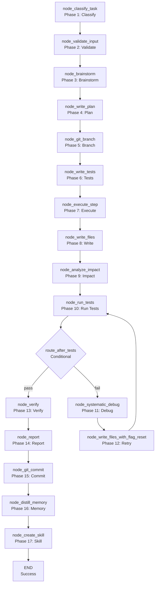

# 🤖 Autocode Workflow

The `autocode` workflow handles **autonomous code generation and modification** tasks. It takes a natural language goal, optionally some initial files, and produces working code with tests, verification, and git commit.

**Key characteristics:**
- **Mode-driven** — Supports `fix_error`, `improve`, `add_feature`, `create_skill`, and `unclear` modes
- **TDD-first** — Generates tests before implementation (when applicable)
- **Iterative refinement** — Debug loop with retry until tests pass or max retries exceeded
- **Impact analysis** — Analyzes blast radius of changes before execution
- **Git integration** — Creates branches, commits changes, and generates commit messages
- **Memory integration** — Stores procedural knowledge for future recall
- **Report generation** — Generates a structured report with the final result

---

## 🚀 Quick Start

```python
from workflows.base import run_workflow

# Fix an error
result = run_workflow(
    workflow_type="autocode",
    goal="Fix the timeout handling in web search",
    mode="fix_error",
    error_msg="TimeoutError: Request timed out after 30 seconds",
    files={"web.py": "..."},
    trace_id="autocode_001",
)

# Add a feature
result = run_workflow(
    workflow_type="autocode",
    goal="Add retry logic to the web search tool",
    mode="add_feature",
    feature_desc="Add exponential backoff retry with jitter",
    files={"web.py": "..."},
    trace_id="autocode_002",
)

# Improve code
result = run_workflow(
    workflow_type="autocode",
    goal="Refactor the web search tool for better error handling",
    mode="improve",
    files={"web.py": "..."},
    trace_id="autocode_003",
)

print(result["status"])  # "success" | "failed"
print(result["result"])  # "Code changes applied successfully..."
```

---

## 🏗️ Architecture

```text
workflows/autocode.py
├── run_autocode_agent()              # Main entry point
│   ├── build_graph()                 # 17-node LangGraph StateGraph
│   │   ├── node_classify_task()      # Phase 1: Classify task type
│   │   ├── node_validate_input()     # Phase 2: Validate input
│   │   ├── node_brainstorm()         # Phase 3: Brainstorm approach
│   │   ├── node_write_plan()         # Phase 4: Generate plan
│   │   ├── node_git_branch()         # Phase 5: Create git branch
│   │   ├── node_write_tests()        # Phase 6: Generate tests (TDD)
│   │   ├── node_execute_step()       # Phase 7: Execute plan step
│   │   ├── node_write_files()        # Phase 8: Write/modify files
│   │   ├── node_analyze_impact()     # Phase 9: Analyze blast radius
│   │   ├── node_run_tests()          # Phase 10: Run tests
│   │   ├── node_systematic_debug()   # Phase 11: Debug failures
│   │   ├── node_write_files_with_flag_reset()  # Phase 12: Retry with fix
│   │   ├── node_verify()             # Phase 13: Verify changes
│   │   ├── node_report()             # Phase 14: Generate report
│   │   ├── node_git_commit()         # Phase 15: Commit changes
│   │   ├── node_distill_memory()     # Phase 16: Store procedural memory
│   │   └── node_create_skill()       # Phase 17: Create skill (if applicable)
│   └── tracer.finish()               # Mark trace complete
```

### Autocode Flow



**Key design decisions:**
- **17-node LangGraph StateGraph** — The most complex workflow in the system. Each node has a specific responsibility.
- **Mode-driven** — The task type (fix_error, improve, add_feature, create_skill, unclear) determines the workflow path. The `node_classify_task` uses the Router LLM to classify the task.
- **TDD-first** — For `add_feature` and `improve` modes, tests are generated before implementation. This ensures test coverage.
- **Iterative debug loop** — If tests fail, the workflow enters a debug loop: `node_systematic_debug` → `node_write_files_with_flag_reset` → `node_run_tests`. This loop repeats until tests pass or `MAX_RETRIES` (3) is exceeded.
- **Impact analysis** — `node_analyze_impact` analyzes the blast radius of changes using the dependency graph. This prevents unintended side effects.
- **Git integration** — `node_git_branch` creates a new branch, and `node_git_commit` commits changes with a descriptive message.
- **Memory integration** — `node_distill_memory` stores procedural knowledge (e.g., "how to fix timeout errors") for future recall.
- **Skill creation** — `node_create_skill` creates a reusable skill file for the agent. This enables the agent to learn from experience.
- **Filelock + atomic writes** — `node_write_files` uses `FileLock` and atomic writes (`tempfile.NamedTemporaryFile` + `os.replace`) to prevent race conditions and data corruption.
- **Result compression** — The final result is compressed via `compress_result()` before being returned.

---

## 📝 Node Reference

### `node_classify_task(state)` — Phase 1: Classify Task Type

**Purpose:** Classify the task type using the Router LLM.

**Logic:**
1. Build prompt with goal, mode, and context
2. Call `llm.complete(role="router", ...)` for classification
3. Parse JSON response for task type

**Output:** Partial dict with `task_type` ("fix" | "improve" | "feature" | "create_skill" | "unclear").

**Error handling:**
- LLM failure → returns `{"task_type": "unclear"}`
- Parse failure → returns `{"task_type": "unclear"}`

**Note:** Mode override takes precedence over LLM classification. If `mode == "fix_error"`, `task_type` is always `"fix"`.

### `node_validate_input(state)` — Phase 2: Validate Input

**Purpose:** Validate input parameters.

**Logic:**
1. Check `goal` is non-empty
2. Check `files` is a dict with valid paths
3. Check `target_file` is valid (if provided)

**Output:** Partial dict with `status` ("valid" | "error") and `error` (if invalid).

**Error handling:**
- Invalid goal → `"error"` status with message
- Invalid files → `"error"` status with message
- Invalid target_file → `"error"` status with message

**Note:** Path traversal check is incomplete. Doesn't catch absolute Windows paths (`C:\file.txt`) or Unicode traversal.

### `node_brainstorm(state)` — Phase 3: Brainstorm Approach

**Purpose:** Brainstorm the approach using the Planner LLM.

**Logic:**
1. Recall relevant memories
2. Build prompt with goal, task type, and context
3. Call `llm.complete(role="planner", ...)` for brainstorming
4. Parse JSON response for approach

**Output:** Partial dict with `brainstorm` (approach text) and `files` (updated with KG files).

**Critical bug:** KG files are lost. The code merges `kg_files` into `files_update` but then stores `state["files"]` (original) instead of `files_update`:
```python
if kg_files:
    files_update = {**kg_files, **state.get("files", {})}
    # ... but then:
    updates["files"] = state["files"]  # BUG: stores original, not merged!
```

### `node_write_plan(state)` — Phase 4: Generate Plan

**Purpose:** Generate a step-by-step plan using the Planner LLM.

**Logic:**
1. Build prompt with goal, task type, and context
2. Call `llm.complete(role="planner", ...)` for planning
3. Parse JSON response for plan steps

**Output:** Partial dict with `plan` (list of step dicts) and `branch` (branch name).

**Note:** Fallback plan has 3 steps: write_tests → implement → verify. This is used when LLM planning fails.

**Note:** `slug` generation may produce empty string if `task[:40]` is all non-alphanumeric. This creates invalid branch name `"autocode/"`.

### `node_git_branch(state)` — Phase 5: Create Git Branch

**Purpose:** Create a git branch for the changes.

**Logic:**
1. Take git snapshot
2. Create branch (if specified)

**Output:** Empty dict (side effects only).

**Note:** `_git_snapshot` calls `git(action="snapshot")` which doesn't exist in the current git tool. This will fail.

**Note:** No check of return values. If snapshot or branch creation fails, the workflow continues silently.

### `node_write_tests(state)` — Phase 6: Generate Tests (TDD)

**Purpose:** Generate tests for the feature/fix.

**Logic:**
1. Build prompt with goal, task type, and context
2. Call `llm.complete(role="test", ...)` for test generation
3. Extract code from markdown fences

**Output:** Partial dict with `test_code` (list of test strings) and `current_step`.

**Note:** `test_code` is `list[str]` but stored as-is in state. Later, `node_write_files` checks if it's a list and joins with `"\n\n"`.

### `node_execute_step(state)` — Phase 7: Execute Plan Step

**Purpose:** Execute a single step of the plan.

**Logic:**
1. Get current step from plan
2. Build prompt with step description and context
3. Call `llm.complete(role="executor", ...)` for code generation
4. Extract code from JSON or markdown fences

**Output:** Partial dict with `code` (generated code), `modified_files`, `current_step`.

**Bug:** Uses `state.get('files_context', '')` but `files_context` doesn't exist in `AutocodeState`. Should use `_files_context(state.get('files', {}))`.

**Bug:** `modified_files` derivation from JSON may fail on non-JSON code. If `code` is not valid JSON, `json.loads(code)` fails and `modified_files` is `[]`.

### `node_write_files(state)` — Phase 8: Write/Modify Files

**Purpose:** Write or modify files on disk.

**Logic:**
1. For each modified file:
   - Apply patch (if patch provided)
   - Write new file (if new file)
   - Update existing file (if content provided)
2. Use `FileLock` for atomic writes
3. Use `tempfile.NamedTemporaryFile` + `os.replace` for atomicity

**Output:** Partial dict with `written_files`, `test_files`, `autocode_run_path`.

**Critical bug:** `.bak` files are created, violating user rule.

**Critical bug:** If `test_code` is missing but `tdd_source_code` exists, `run_dir` is undefined when persisting generated code. NameError.

**Bug:** `node_write_files` doesn't return `status` on error. If JSON parse fails, returns `{}` (empty dict). Workflow continues as if nothing happened.

**Bug:** `FileLock` timeout is 10s but no retry logic. If lock is held by another process, it times out and skips the write.

### `node_analyze_impact(state)` — Phase 9: Analyze Blast Radius

**Purpose:** Analyze the impact of changes on the codebase.

**Logic:**
1. Get modified files from state
2. Query dependency graph for affected files
3. Generate impact warnings

**Output:** Partial dict with `impact_warnings` (list of dicts with `type`, `message`, `agent_fault`).

**Critical bug:** `files_map` is never populated by previous nodes. `node_execute_step` sets `modified_files` (list of dicts), not `files_map` (dict of FileSnapshot). `node_write_files` doesn't set it either. So `node_analyze_impact` always returns early with empty warnings.

**Bug:** `node_analyze_impact` is `async` but LangGraph `StateGraph.add_node` expects sync functions. This may fail or hang.

**Bug:** `impact_warnings` type mismatch. `state.py` says `list[str]`, but `analyze_impact.py` returns `list[dict]`.

### `node_run_tests(state)` — Phase 10: Run Tests

**Purpose:** Run the generated tests.

**Logic:**
1. Get test files from state
2. Run tests via `pytest`
3. Return results

**Output:** Partial dict with `test_results`, `test_passed`, `test_output`.

**Bug:** `test_files` may contain paths that don't exist. `node_write_files` sets them to relative paths, but if the file wasn't written, the test run fails.

**Bug:** `run_tests_on_disk` in `nodes/run_tests.py` has different signature from `test_runner.py`. Same name, different signatures. Confusing.

### `node_systematic_debug(state)` — Phase 11: Debug Failures

**Purpose:** Debug test failures.

**Logic:**
1. Build prompt with test output and context
2. Call `llm.complete(role="executor", ...)` for debug analysis
3. Parse JSON response for root cause and fix

**Output:** Partial dict with `root_cause`, `defense_notes`, `suggested_fix`, `tdd_source_code`.

**Note:** `memory.store()` is called without `await` but `memory.store()` is sync. This is correct.

**Note:** `blast_radius_note` is constructed but used in the system prompt. Correct.

### `node_write_files_with_flag_reset(state)` — Phase 12: Retry with Fix

**Purpose:** Write the fix after debug analysis.

**Logic:**
1. Call `node_write_files(state)` to apply the fix
2. Reset `step_attempt` to 0

**Output:** Partial dict from `node_write_files` with `step_attempt: 0`.

**Note:** This is a thin wrapper around `node_write_files` that resets the retry counter.

### `node_verify(state)` — Phase 13: Verify Changes

**Purpose:** Verify the changes with linting and regression tests.

**Logic:**
1. Run `ruff check` for linting
2. Run regression tests (if applicable)
3. Return verification results

**Output:** Partial dict with `lint_passed`, `lint_output`, `regression_passed`, `evidence_outputs`.

**Bug:** `lint_passed = True` when ruff is not available. Should be `False` or `None`.

**Bug:** `evidence_outputs` includes `regression: fresh_output[:2000]` which is the same as `tests`. Redundant.

### `node_report(state)` — Phase 14: Generate Report

**Purpose:** Generate a structured report with the final result.

**Logic:**
1. Call `report(action="report", title=..., data=..., config=...)` with result and metadata
2. Return the report

**Output:** Empty dict (side effects only).

**Bug:** Type annotation says `AutocodeState` but returns `{}`.

**Bug:** `modified_files` uses `state.get("files_map", {}).keys()` but `files_map` is always empty.

### `node_git_commit(state)` — Phase 15: Commit Changes

**Purpose:** Commit the changes to git.

**Logic:**
1. Generate commit message
2. Call `git(action="commit", message=..., root=...)`
3. Return commit SHA

**Output:** Partial dict with `commit_sha`, `status`, `result`.

**Bug:** `result_lines` includes `state.get("defense_note")` but the field is `defense_notes` (plural). Always empty.

**Bug:** `status` is set to `"done"` regardless of whether commit succeeded. If `_git_commit` returns `None` (no changes), `status` is still `"done"`.

### `node_distill_memory(state)` — Phase 16: Store Procedural Memory

**Purpose:** Store procedural knowledge for future recall.

**Logic:**
1. Build trace text from workflow state
2. Store procedural memory: `memory.store_procedural(text=..., ...)`

**Output:** Empty dict (side effects only).

**Bug:** `node_distill_memory` accesses `state.get("classification", {}).get("task_type", "feature")` but `classification` doesn't exist in state. The fallback to `task_type` is correct but the `classification` access is dead code.

**Bug:** `hypothesis` field is never set by any node. The debug node sets `root_cause`, not `hypothesis`.

**Bug:** `defense_note` (singular) is used but `defense_notes` (plural) is set by debug node. Always empty.

### `node_create_skill(state)` — Phase 17: Create Skill

**Purpose:** Create a reusable skill file.

**Logic:**
1. Generate skill code
2. Write to `cfg.agent_root / "skills" / f"{skill_name}.py"`

**Output:** Partial dict with `skill_path`, `status`, `result`, `error`.

**Bug:** `skill_path` is `cfg.agent_root / "skills" / f"{skill_name}.py"` but should use `project_root` or `workspace_root` for non-agent projects.

**Bug:** No validation that `skill_name` is a valid filename. If it contains `/` or `\`, path traversal may escape `skills/`.

**Bug:** `skill_file_content` is written without checking if it's valid Python. No syntax check.

**Bug:** `skill_created` is never set in state. `autocode.py` checks for it but it's always missing.

---

## ⚙️ Configuration

```ini
# .env
AUTOCODE_GRAPH_TIMEOUT=300          # Workflow timeout (seconds)
AUTOCODE_MAX_RETRIES=3              # Max debug retries
AUTOCODE_MAX_FILE_CHARS=128000      # Max file content chars
AUTOCODE_PLANNER_TIMEOUT=120        # Planner LLM timeout (seconds)
AUTOCODE_EXECUTOR_TIMEOUT=90        # Executor LLM timeout (seconds)
AUTOCODE_ROUTER_TIMEOUT=30          # Router LLM timeout (seconds)
```

```python
# core/config.py
cfg.autocode_graph_timeout = 300    # Workflow timeout (seconds)
cfg.autocode_max_retries = 3         # Max debug retries
cfg.autocode_max_file_chars = 128000 # Max file content chars
cfg.autocode_planner_timeout = 120    # Planner LLM timeout (seconds)
cfg.autocode_executor_timeout = 90     # Executor LLM timeout (seconds)
cfg.autocode_router_timeout = 30      # Router LLM timeout (seconds)
```

---

## 📤 Output

The workflow returns a `dict`:

```json
{
  "status": "success",
  "result": "Code changes applied successfully: Added retry logic to web search",
  "error": "",
  "artifacts": ["web.py", "test_web.py"],
  "commit_sha": "abc123",
  "test_passed": true,
  "lint_passed": true
}
```

**Failure:**
```json
{
  "status": "failed",
  "result": "",
  "error": "Code generation failed: timeout",
  "artifacts": [],
  "commit_sha": "",
  "test_passed": false,
  "lint_passed": false
}
```

---

## 🔄 When to Use vs Alternatives

| Need | Tool | Why |
|------|------|-----|
| Fix code errors | `autocode` workflow | Targeted fixes with test verification |
| Add features | `autocode` workflow | TDD-first with test generation |
| Improve code | `autocode` workflow | Refactoring with impact analysis |
| Create skills | `autocode` workflow | Reusable skill generation |
| Research a topic | `research` workflow | Web search + synthesis, no code changes |
| Analyze data | `data` workflow | Code generation + execution, data analysis |
| Deep research | `deep_research` workflow | Iterative search with convergence detection |
| Understand codebase | `understand` workflow | Static analysis, dependency graph |
| Generate report | `report` workflow | Structured report generation |

---

## 🧪 Testing

```powershell
# Run autocode tests
D:\mcp\agent\venv\Scripts\pytest.exe tests/workflows/autocode/test_autocode.py -W error --tb=short -v
```

**Mock strategy:**
- Patch `llm.complete(role="router")` for classification
- Patch `llm.complete(role="planner")` for planning and brainstorming
- Patch `llm.complete(role="executor")` for code generation and debug
- Patch `llm.complete(role="test")` for test generation
- Patch `git(action="snapshot")` and `git(action="commit")` for git operations
- Patch `python(code=...)` for test execution
- Patch `memory.recall()` and `memory.store_procedural()` for memory operations
- Patch `report(action="report")` for report generation
- Patch `notify(action="notify")` for notification
- Test `node_classify_task` with mode override → assert correct task_type
- Test `node_validate_input` with invalid path → assert error state
- Test `node_brainstorm` with KG files → assert merged files (currently broken)
- Test `node_write_plan` with fallback → assert 3-step plan
- Test `node_git_branch` with snapshot failure → assert graceful handling
- Test `node_write_tests` with code extraction → assert test_code list
- Test `node_execute_step` with non-JSON code → assert modified_files fallback
- Test `node_write_files` with patch → assert atomic write
- Test `node_analyze_impact` with empty files_map → assert early return (currently broken)
- Test `node_run_tests` with missing test files → assert error state
- Test `node_systematic_debug` with max retries → assert failure state
- Test `node_verify` with missing ruff → assert lint_passed=False (currently True)
- Test `node_git_commit` with no changes → assert skipped state
- Test `node_distill_memory` with missing hypothesis → assert graceful handling
- Test `node_create_skill` with invalid name → assert error state

**Current test layout:**
```text
tests/workflows/autocode/
└── test_autocode.py  # Full workflow test
```

> **Future:** Split into per-node files: `test_node_classify.py`, `test_node_validate.py`, `test_node_brainstorm.py`, `test_node_plan.py`, `test_node_git_branch.py`, `test_node_write_tests.py`, `test_node_execute.py`, `test_node_write_files.py`, `test_node_analyze_impact.py`, `test_node_run_tests.py`, `test_node_debug.py`, `test_node_verify.py`, `test_node_report.py`, `test_node_git_commit.py`, `test_node_distill_memory.py`, `test_node_create_skill.py`, plus `conftest.py`.

---

## 🗺️ Roadmap

### ✅ Completed

| Feature | Status | Notes |
|---------|--------|-------|
| 17-node LangGraph StateGraph | ✅ v1.0 | classify → validate → brainstorm → plan → branch → tests → execute → write → impact → run tests → debug → retry → verify → report → commit → memory → skill |
| Mode-driven workflow | ✅ v1.0 | fix_error, improve, add_feature, create_skill, unclear |
| TDD-first | ✅ v1.0 | Tests generated before implementation |
| Iterative debug loop | ✅ v1.0 | Debug → retry → run tests until pass or max retries |
| Impact analysis | ✅ v1.0 | Blast radius analysis using dependency graph |
| Git integration | ✅ v1.0 | Branch creation and commit |
| Memory integration | ✅ v1.0 | Procedural memory storage |
| Report generation | ✅ v1.0 | Structured report with result and metadata |
| Filelock + atomic writes | ✅ v1.0 | Prevents race conditions and data corruption |
| Result compression | ✅ v1.0 | compress_result() prevents oversized responses |

### 🔄 In Progress / Next Up

| # | Feature | Notes | Priority |
|---|---------|-------|----------|
| 1 | **Remove `.bak` file creation** | `.bak` files violate user rule. Found in `patch.py`, `write_files.py`, `helpers.py`. | P0 |
| 2 | **Fix `git(action="snapshot")` doesn't exist** | `_git_snapshot` calls `git(action="snapshot")` which was removed in un-multiplex refactor. | P0 |
| 3 | **Fix `files_map` never populated — analyze_impact never runs** | No node sets `files_map`. `node_execute_step` sets `modified_files`, not `files_map`. | P0 |
| 4 | **Fix `node_analyze_impact` is async in sync graph** | LangGraph `StateGraph.add_node` expects sync. Async function may fail or hang. | P0 |
| 5 | **Fix `node_write_files` `run_dir` NameError** | If `test_code` missing but `tdd_source_code` exists, `run_dir` undefined when persisting generated code. | P0 |
| 6 | **Fix `node_execute_step` uses non-existent `files_context`** | `state.get("files_context", "")` — field doesn't exist in `AutocodeState`. | P0 |
| 7 | **Fix `node_brainstorm` loses KG files** | Merges `kg_files` into `files_update` but stores `state["files"]` (original) instead of merged. | P0 |
| 8 | **Fix `impact_warnings` type mismatch** | `state.py` says `list[str]`, `analyze_impact.py` returns `list[dict]`. | P0 |
| 9 | **Fix `AGENT_ROOT = None` never set** | `state.py` line 10: `AGENT_ROOT = None # Set via cfg`. Never actually set. | P0 |
| 10 | **Fix `node_commit` uses `defense_note` not `defense_notes`** | State field is `defense_notes` (plural). Always empty. | P0 |
| 11 | **Fix `node_distill_memory` uses `hypothesis`/`defense_note` never set** | Debug node sets `root_cause` and `defense_notes`, not `hypothesis` or `defense_note`. | P0 |
| 12 | **Fix `node_report` type annotation wrong** | Returns `AutocodeState` but returns `{}`. | P1 |
| 13 | **Fix `node_create_skill` writes to agent_root regardless of project** | Should use `project_root` or `workspace_root` for non-agent projects. | P1 |
| 14 | **Remove `route_after_debug` and `route_after_brainstorm` dead code** | Graph builder uses direct edges, not these route functions. | P1 |
| 15 | **Fix `mermaid.py` uses LangGraph internals** | `graph.nodes`, `graph.edges`, `graph.conditional_edges` are internal APIs. Fragile. | P1 |
| 16 | **Fix `test_runner.py` `_should_copy_file` wrong arg type** | Called with `Path` (workspace) instead of `frozenset` (protected files). | P1 |
| 17 | **Fix `node_verify` `lint_passed=True` when ruff missing** | Missing ruff should be `False` or `None`, not `True`. | P1 |
| 18 | **Fix `node_report` `modified_files` empty due to `files_map`** | `files_map` always empty. `modified_files` always empty. | P1 |
| 19 | **Fix `node_write_files` doesn't return `status` on error** | JSON parse failure returns `{}`. Workflow continues as if nothing happened. | P1 |
| 20 | **Fix `node_git_branch` no error handling** | Snapshot/branch creation failures not checked. Silent failures. | P1 |
| 21 | **Fix `node_validate_input` path traversal incomplete** | Doesn't catch absolute Windows paths or Unicode traversal. | P1 |
| 22 | **Fix `node_write_plan` slug may be empty** | If `task[:40]` is all non-alphanumeric, `slug` is `""`. Invalid branch name. | P1 |
| 23 | **Fix `node_write_files` `FileLock` no retry logic** | Timeout 10s, no retry. May skip writes under contention. | P2 |
| 24 | **Fix `node_run_tests` test file path may not exist** | `test_files` set by `node_write_files` but may not exist if write failed. | P2 |
| 25 | **Fix `node_create_skill` no filename validation** | `skill_name` with `/` or `\` may escape `skills/` directory. | P2 |
| 26 | **Fix `node_create_skill` no syntax check** | Skill code written without validating it's valid Python. | P2 |
| 27 | **Fix `node_create_skill` `skill_created` never set** | `autocode.py` checks for it but never set by any node. | P2 |
| 28 | **Fix `node_distill_memory` `classification` dead code** | `state.get("classification", {})` — field never set. | P2 |
| 29 | **Test restructure** | Split `test_autocode.py` into per-node files + `conftest.py` | P1 |
| 30 | **Configurable timeout** | Make `AUTOCODE_GRAPH_TIMEOUT` actually used in code | P2 |
| 31 | **Remove `__all__` internal constants** | `MAX_RETRIES`, `MAX_FILE_CHARS`, etc. are config values, not API surface. | P2 |
| 32 | **IDE integration** | LSP or VS Code extension for autocode | P3 |

### 🚫 Deferred / Out of Scope

| # | Feature | Why Deferred | Priority |
|---|---------|------------|----------|
| 1 | **Remove TDD-first** | TDD ensures test coverage. Removing it would degrade code quality. | Skip |
| 2 | **Remove debug loop** | Single-pass code generation would miss edge cases. Iteration is essential. | Skip |
| 3 | **Remove impact analysis** | Blast radius analysis prevents unintended side effects. Essential for safety. | Skip |
| 4 | **Remove git integration** | Git branches and commits are essential for version control. | Skip |
| 5 | **Remove memory integration** | Procedural memory improves future performance. | Skip |
| 6 | **Real-time collaboration** | Multi-user editing would require complex state synchronization. Out of scope. | Skip |
| 7 | **Support non-Python languages** | The workflow is designed for Python. Other languages would require significant changes. | Skip |

---

## 🛡️ AI Agent Instructions

### NEVER DO
1. **Never mutate state in-place** — LangGraph does not deep-copy. Always return partial update `dict`s.
2. **Never spread `**state`** — Never return `{**state, "key": "value"}`. Return only the changed keys.
3. **Never remove TDD-first** — Test generation ensures code quality.
4. **Never remove debug loop** — Iteration catches edge cases.
5. **Never remove impact analysis** — Blast radius analysis prevents unintended side effects.
6. **Never use `print()` to stdout** — MCP stdio corruption. Use `tracer.step()` for logging.
7. **Never create `.bak` files** — forbidden by project rules.
8. **Never rewrite the entire file** — surgical edits only. Preserve existing code exactly.
9. **Never skip `compileall` before `pytest`** — catches syntax errors early.
10. **Never call `agent()` without `action="dispatch"`** — The `agent()` facade requires `action`. Always pass `action="dispatch"` for LLM calls.
11. **Never return `None` from LangGraph nodes** — Always return a `dict` (even empty `{}`).
12. **Never use `files_context` field** — It doesn't exist in `AutocodeState`. Use `_files_context()` helper.
13. **Never store `files_map` as `dict[str, FileSnapshot]`** — No node populates it. Use `modified_files` instead.

### ALWAYS DO
14. **Always return `dict` from nodes** — Not `AutocodeState`. Partial updates only.
15. **Always pass `trace_id` to tracer calls** — Observability requires trace correlation.
16. **Always handle validation failure gracefully** — Invalid input should return error state, not crash.
17. **Always test `node_classify_task` with mode override** — Assert correct task_type regardless of LLM output.
18. **Always test `node_brainstorm` with KG files** — Assert merged files (currently broken).
19. **Always test `node_analyze_impact` with empty files_map** — Assert early return (currently broken).
20. **Always test `node_write_files` with patch** — Assert atomic write and no `.bak` files.
21. **Always test `node_run_tests` with missing test files** — Assert error state.
22. **Always test `node_verify` with missing ruff** — Assert `lint_passed=False` (currently `True`).
23. **Always test `node_git_commit` with no changes** — Assert skipped state.
24. **Always test `node_distill_memory` with missing hypothesis** — Assert graceful handling.
25. **Always test `node_create_skill` with invalid name** — Assert error state.
26. **Always update this doc** when adding nodes, changing routing logic, or modifying error handling.
27. **Always use `defense_notes` (plural)** — The state field is `defense_notes`, not `defense_note`.
28. **Always use `asyncio.to_thread()` for CPU-bound work** — AST parsing and file I/O blocks the event loop.

---

## 🔗 Source Code Reference

| File | Purpose |
|------|---------|
| `workflows/autocode.py` | `run_autocode_agent()` — main entry point |
| `workflows/autocode_impl/graph.py` | `build_graph()` — 17-node LangGraph StateGraph builder |
| `workflows/autocode_impl/state.py` | `AutocodeState` — extended TypedDict with autocode-specific fields |
| `workflows/autocode_impl/routes.py` | `route_after_classify()`, `route_after_tests()` — conditional routing |
| `workflows/autocode_impl/helpers.py` | `_write_files()`, `_call()`, `_extract_code()`, `_parse_json()`, `_files_context()` — shared helpers |
| `workflows/autocode_impl/git_ops.py` | `_git_snapshot()`, `_git_create_branch()`, `_git_commit()` — git operations |
| `workflows/autocode_impl/patch.py` | `apply_patch()`, `apply_patches()`, `extract_relevant_sections()` — patch application |
| `workflows/autocode_impl/mermaid.py` | `export_mermaid()` — mermaid diagram export |
| `workflows/autocode_impl/test_mapper.py` | `get_targeted_tests()`, `_build_test_index()` — test mapping |
| `workflows/autocode_impl/test_runner.py` | `run_tests_on_disk()` — test execution |
| `workflows/autocode_impl/nodes/classify.py` | `node_classify_task()` — task classification |
| `workflows/autocode_impl/nodes/validate.py` | `node_validate_input()` — input validation |
| `workflows/autocode_impl/nodes/brainstorm.py` | `node_brainstorm()` — approach brainstorming |
| `workflows/autocode_impl/nodes/plan.py` | `node_write_plan()` — plan generation |
| `workflows/autocode_impl/nodes/branch.py` | `node_git_branch()` — git branch creation |
| `workflows/autocode_impl/nodes/tests.py` | `node_write_tests()` — test generation |
| `workflows/autocode_impl/nodes/execute.py` | `node_execute_step()` — plan step execution |
| `workflows/autocode_impl/nodes/write_files.py` | `node_write_files()` — file writing |
| `workflows/autocode_impl/nodes/run_tests.py` | `node_run_tests()` — test execution |
| `workflows/autocode_impl/nodes/analyze_impact.py` | `node_analyze_impact()` — blast radius analysis |
| `workflows/autocode_impl/nodes/debug.py` | `node_systematic_debug()` — debug analysis |
| `workflows/autocode_impl/nodes/verify.py` | `node_verify()` — verification |
| `workflows/autocode_impl/nodes/commit.py` | `node_git_commit()` — git commit |
| `workflows/autocode_impl/nodes/memory.py` | `node_distill_memory()` — procedural memory storage |
| `workflows/autocode_impl/nodes/create_skill.py` | `node_create_skill()` — skill creation |
| `workflows/autocode_impl/nodes/report.py` | `node_report()` — report generation |
| `workflows/base.py` | `WorkflowState`, `node_step()`, `node_error()`, `node_done()` — shared infrastructure |
| `tools/agent.py` | `agent(action="dispatch", role="...")` — LLM calls |
| `tools/git.py` | `git(action="snapshot")`, `git(action="commit")` — git operations |
| `tools/python.py` | `python(code=...)` — sandboxed Python execution |
| `tools/memory.py` | `memory.recall()`, `memory.store_procedural()` — memory operations |
| `tools/notify.py` | `notify(action="notify", message=...)` — user notification |
| `tools/report.py` | `report(action="report", title=...)` — report generation |
| `core/config.py` | `cfg.autocode_graph_timeout`, `cfg.autocode_max_retries`, etc. — config |
| `core/utils.py` | `compress_result()` — result compression |
| `tests/workflows/autocode/test_autocode.py` | Full workflow test |

---

*Architecture: 17-node LangGraph StateGraph (classify → validate → brainstorm → plan → branch → tests → execute → write → impact → run tests → debug → retry → verify → report → commit → memory → skill) with TDD-first, iterative debug loop, impact analysis, git integration, and memory storage.*
