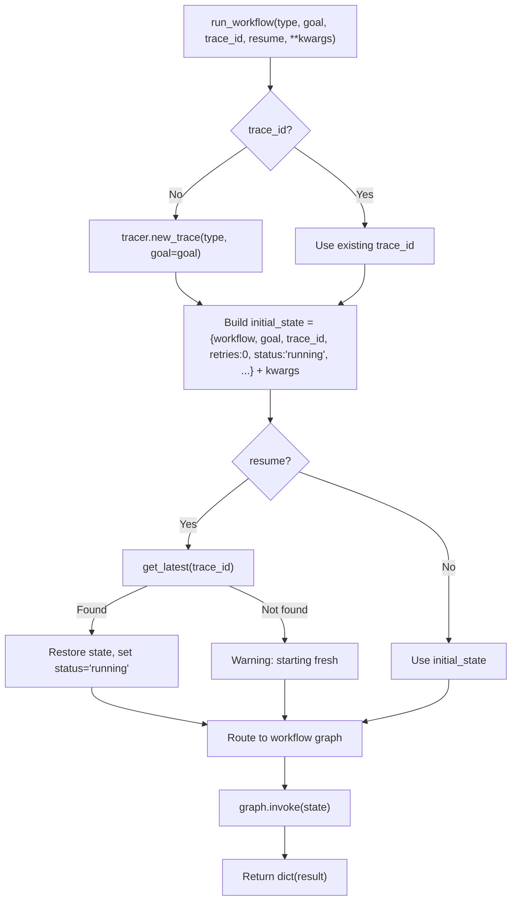

# 🏗️ Workflow Base

The `workflows/base.py` module provides the **shared foundation** for all agent workflows. It defines the common `WorkflowState` TypedDict, node helper utilities, and the `run_workflow()` dispatcher that routes execution to the correct workflow graph.

**Key characteristics:**
- **Shared state schema** — `WorkflowState` is the common denominator across `research`, `data`, `autocode`, `deep_research`, and `understand`
- **LangGraph immutability** — All helpers return partial update `dict`s, never mutate state in-place
- **Checkpoint resumption** — `run_workflow(resume=True)` restores from the latest checkpoint journal
- **Trace lifecycle** — Automatic trace creation, step logging, error tracking, and completion marking
- **Workflow-agnostic** — No workflow-specific logic; pure infrastructure

---

## 🚀 Quick Start

```python
from workflows.base import run_workflow

# Run a research workflow
result = run_workflow(
    workflow_type="research",
    goal="What are the best practices for ChromaDB in production?",
    trace_id="abc123",
)

# Resume from checkpoint
result = run_workflow(
    workflow_type="autocode",
    goal="Fix the timeout handling in web search",
    trace_id="abc123",
    resume=True,
)

print(result["status"])   # "success" | "failed"
print(result["result"])   # Final result summary
```

---

## 🏗️ Architecture

```text
workflows/base.py
├── WorkflowState (TypedDict)     # Shared state schema (25+ fields)
├── trim_state(state)             # Phase 5: Evict oversized fields to async queue
├── node_step(state, node, msg)   # Log a workflow step to the active trace
├── node_error(state, node, msg)  # Mark state as failed, log error, save checkpoint
├── node_done(state, result)      # Mark state as succeeded, finish trace, mark complete
└── run_workflow(type, goal, ...) # Dispatcher: trace creation → checkpoint resume → graph.invoke()
```

### Dispatch Flow



**Key design decisions:**
- **Partial update pattern** — `node_error()` and `node_done()` return `dict`s with only the changed keys (`status`, `error`, `result`, `artifacts`). This is LangGraph best practice — nodes should not return the full state.
- **Trace auto-creation** — If `trace_id` is empty, `tracer.new_trace()` creates one automatically. This means callers never need to manage trace IDs manually.
- **Checkpoint resumption** — `resume=True` attempts to restore from the checkpoint journal via `get_latest(trace_id)`. Version validation (`_checkpoint_version == 1`) prevents loading incompatible checkpoints.
- **Autocode compatibility** — `run_workflow()` converts `goal` → `task` for the autocode workflow. This bridges the `run_workflow()` API (which uses `goal`) with autocode's internal API (which uses `task`).
- **Understand special case** — The `understand` workflow is not a LangGraph StateGraph — it's a sync function (`run_understand_workflow_sync`). The dispatcher handles this specially by calling it directly instead of `graph.invoke()`.
- **Exception isolation** — The entire dispatch is wrapped in a try/except. If any workflow crashes, the error is logged to the trace and a clean failure dict is returned. Never leaks exceptions to the caller.
- **State trimming** — `trim_state()` evicts oversized fields (`search_results`, `output`, `analysis`) to the async eviction queue when they exceed ~1000 tokens. Prevents LangGraph checkpoint bloat.

---

## 📝 Workflow State

```python
class WorkflowState(TypedDict, total=False):
    # Identity
    workflow: str          # "research" | "data" | "autocode" | "deep_research" | "understand"
    goal: str              # What we are trying to accomplish
    trace_id: str          # Tracer ID for this run

    # Inputs (workflow-specific)
    code: str              # Initial code for data workflow
    target_file: str       # File to edit (autocode)
    mode: str              # Autocode mode: fix_error | improve | add_feature
    error_msg: str         # Error traceback (autocode fix_error)
    feature_desc: str      # Feature description (autocode add_feature)

    # Accumulated context
    memory_context: str    # Recalled memories (formatted string)
    file_content: str      # Current file content (autocode)
    search_results: str    # Web search results
    analysis: str          # Agent(analyze) output
    patch: str             # Generated patch (autocode)
    review: dict           # Agent(review) structured output

    # Execution
    output: str            # Python execution output
    exec_error: str        # Execution error if any

    # Control
    retries: int           # Current retry count
    error: str             # Fatal workflow error
    status: str            # "running" | "success" | "failed"

    # Result
    result: str            # Final result summary
    artifacts: list        # Files created, commits made, etc.
```

| Field | Type | Description |
|-------|------|-------------|
| `workflow` | `str` | Workflow type identifier |
| `goal` | `str` | Primary task description |
| `trace_id` | `str` | Observability trace ID |
| `code` | `str` | Python code for data workflow |
| `target_file` | `str` | Target file path for autocode |
| `mode` | `str` | Autocode mode override |
| `error_msg` | `str` | Error traceback for autocode fix mode |
| `feature_desc` | `str` | Feature description for autocode feature mode |
| `memory_context` | `str` | Formatted memory recall results |
| `file_content` | `str` | Current file content (autocode) |
| `search_results` | `str` | Web search or scraped content |
| `analysis` | `str` | LLM analysis output |
| `patch` | `str` | Generated code patch |
| `review` | `dict` | Structured review output |
| `output` | `str` | Python execution stdout |
| `exec_error` | `str` | Python execution stderr |
| `retries` | `int` | Retry counter (autocode, deep_research) |
| `error` | `str` | Fatal error message |
| `status` | `str` | `"running"` → `"success"` / `"failed"` |
| `result` | `str` | Final human-readable result |
| `artifacts` | `list` | Created files, commits, reports, etc. |

> **Note:** This is a shared schema. Individual workflows (e.g., `autocode`) extend it with additional fields. The `total=False` flag makes all fields optional, allowing partial updates.

---

## ⚡ Utilities

### `trim_state(state)` — Phase 5 Memory Eviction

Evicts oversized fields from working memory to the async eviction queue:

```python
def trim_state(state: WorkflowState) -> WorkflowState:
    # Returns a NEW state dict (Copy-on-Write)
    # Evicts: search_results, output, analysis
    # Threshold: len(val) // 4 > 1000 tokens (~4000 chars)
    # Replaced with: "[Evicted: N tokens saved to episodic memory. Use memory tool to recall.]"
```

**Why:** Prevents LangGraph checkpoint bloat. Large search results or Python outputs can make checkpoints unwieldy.

**Thread safety:** Uses `eviction_queue.push()` which is async-safe.

### `node_step(state, node, message, checkpoint=False, **kwargs)` — Trace Logging

Logs a workflow step to the active trace:

```python
node_step(state, "execute", "running code", chars=len(code))
# → tracer.step(trace_id, "execute", "running code", chars=len(code))
```

**Checkpoint option:** If `checkpoint=True`, also saves a checkpoint via `save_checkpoint()`.

### `node_error(state, node, message, **kwargs)` — Error Handling

Marks state as failed and logs to trace:

```python
node_error(state, "execute", "Code generation failed: timeout")
# → Returns: {"status": "failed", "error": "Code generation failed: timeout"}
# → tracer.error(trace_id, "execute", "Code generation failed: timeout")
# → save_checkpoint(trace_id, "execute", {"status": "failed", "error": "..."})
```

**Guard:** Message is never empty. Falls back to `"Unspecified error in node 'execute'"`.

**Returns:** Partial dict with `status` and `error`.

### `node_done(state, result, artifacts=None)` — Completion

Marks state as succeeded:

```python
node_done(state, result="Analysis complete", artifacts=["report.html"])
# → Returns: {"status": "success", "result": "Analysis complete", "artifacts": ["report.html"]}
# → tracer.finish(trace_id, success=True, result="Analysis complete")
# → mark_complete(trace_id)
```

**Returns:** Partial dict with `status`, `result`, `artifacts`.

---

## 🔄 Workflow Dispatcher

### `run_workflow(workflow_type, goal, trace_id, resume, **kwargs)`

Routes to the correct workflow graph:

| Workflow Type | Graph Builder | Special Handling |
|---------------|--------------|------------------|
| `research` | `workflows.research.build_research_graph()` | Standard StateGraph |
| `data` | `workflows.data.build_data_graph()` | Standard StateGraph |
| `autocode` | `workflows.autocode.build_graph()` | Converts `goal` → `task` |
| `deep_research` | `workflows.deep_research_core.build_deep_research_graph()` | Standard StateGraph |
| `understand` | `workflows.understand.run_understand_workflow_sync()` | Direct function call (not StateGraph) |

**Returns:** `dict` with at minimum `{status, result, error, artifacts}`.

**Error handling:**
- Unknown workflow type → `"failed"` with clear error message
- Workflow crash → `"failed"` with exception details, trace logged
- Checkpoint version mismatch → warning, starts fresh

---

## ⚙️ Configuration

```ini
# .env — no base-specific env vars
# Uses shared config:
#   All timeouts from core/config.py
```

```python
# core/config.py
# No base-specific config. Uses:
#   cfg.* — various timeout and limit settings
```

---

## 📤 Output

The dispatcher returns a `dict`:

```json
{
  "status": "success",
  "result": "Analysis complete: Top 3 months are Jan, Mar, Dec",
  "error": "",
  "artifacts": ["report.html"]
}
```

**Failure:**
```json
{
  "status": "failed",
  "result": "",
  "error": "Workflow 'unknown' crashed: ValueError: Invalid workflow type",
  "artifacts": []
}
```

---

## 🔄 When to Use vs Alternatives

| Need | Tool | Why |
|------|------|-----|
| Run a workflow | `run_workflow()` | Standard entry point, trace management, checkpoint support |
| Log a node step | `node_step()` | Consistent trace logging across all workflows |
| Mark node failure | `node_error()` | Standardized error handling + checkpoint save |
| Mark node success | `node_done()` | Standardized completion + trace finish |
| Evict large state fields | `trim_state()` | Prevents checkpoint bloat |
| Direct workflow access | Import graph builder | Bypass dispatcher for testing or custom invocation |

---

## 🧪 Testing

```powershell
# Run base node tests
D:\mcp\agent\venv\Scripts\pytest.exe tests/workflows/base/test_base_nodes.py -W error --tb=short -v
```

**Mock strategy:**
- Patch `core.tracer.tracer` for trace logging tests
- Patch `workflows.helpers.checkpoint.save_checkpoint` / `get_latest` / `mark_complete` for checkpoint tests
- Patch `core.memory_backend.eviction.eviction_queue.push` for trim_state tests
- Test `node_error` with empty message → fallback
- Test `node_done` with None artifacts → empty list
- Test `trim_state` with oversized fields → eviction
- Test `run_workflow` with unknown type → failed status
- Test `run_workflow` with `resume=True` and valid/invalid checkpoints
- Test `run_workflow` autocode compatibility — assert `task` key exists

**Current test layout:**
```text
tests/workflows/base/
└── test_base_nodes.py          # Node helper tests + dispatcher tests
```

> **Future:** When the module grows, split into `test_node_helpers.py`, `test_dispatcher.py`, `test_trim_state.py`, and add `conftest.py`.

---

## 🗺️ Roadmap

### ✅ Completed

| Feature | Status | Notes |
|---------|--------|-------|
| Shared `WorkflowState` TypedDict | ✅ v1.0 | 25+ fields, `total=False`, used by all workflows |
| `node_step()` trace logging | ✅ v1.0 | Consistent step logging with optional checkpoint |
| `node_error()` error handling | ✅ v1.0 | Guard against empty messages, saves checkpoint |
| `node_done()` completion | ✅ v1.0 | Finishes trace, marks complete |
| `trim_state()` memory eviction | ✅ v1.0 | Phase 5: evicts oversized fields to async queue |
| `run_workflow()` dispatcher | ✅ v1.0 | Routes to 5 workflow types, trace auto-creation |
| Checkpoint resumption | ✅ v1.0 | `resume=True` restores from journal, version validation |
| Autocode compatibility | ✅ v1.0 | Converts `goal` → `task` for autocode workflow |
| Understand special case | ✅ v1.0 | Direct function call instead of StateGraph |
| Exception isolation | ✅ v1.0 | Try/except wrapper, clean failure dicts |
| LangGraph immutability | ✅ v1.0 | Partial update dicts, no in-place mutation |

### 🔄 In Progress / Next Up

| Feature | Notes | Priority |
|---------|-------|----------|
| `@meta_tool` refactor on tools used | When `notify` gets `@meta_tool`, update calls in `node_done` | P1 |
| Test restructure | Split `test_base_nodes.py` into per-concern files + `conftest.py` | P1 |
| Configurable eviction threshold | Hardcoded `len(val) // 4 > 1000`. Make configurable via `.env` | P2 |
| Configurable evicted fields | Hardcoded `["search_results", "output", "analysis"]`. Make configurable | P2 |
| Workflow registration | Replace hardcoded if/elif dispatch with dynamic registry (e.g., `WORKFLOW_REGISTRY` dict) | P2 |
| Input validation | Add `run_workflow()` input validation (non-empty goal, valid workflow_type) | P2 |
| Timeout wrapper | Add configurable timeout around `graph.invoke()` to prevent hung workflows | P2 |
| Result pruning | Pipe `result` through `prune_tool_dict()` before return to prevent oversized outputs | P3 |
| Parallel workflow dispatch | Evaluate `asyncio.gather()` for parallel workflow execution | P3 |

### 🚫 Deferred / Out of Scope

| # | Feature | Why Deferred | Priority |
|---|---------|------------|----------|
| 1 | **Remove checkpoint system** | Checkpoints are essential for resumability and debugging. Removing them would break workflow reliability. | Skip |
| 2 | **Remove trace auto-creation** | Trace IDs are required for observability. Manual trace management would burden every caller. | Skip |
| 3 | **Store full state in checkpoints** | `trim_state()` already prevents bloat. Full state storage would be wasteful. | Skip |
| 4 | **Synchronous-only workflows** | Async workflows (understand) need special handling. The current hybrid approach is correct. | Skip |
| 5 | **Workflow composition** | Running workflows inside workflows (e.g., `research` → `autocode`) would create complex state management. Use sequential calls instead. | Skip |

---

## 🛡️ AI Agent Instructions

### NEVER DO
1. **Never mutate state in-place** — LangGraph does not deep-copy. Always return partial update `dict`s.
2. **Never spread `**state`** — Never return `{**state, "key": "value"}`. Return only the changed keys.
3. **Never remove checkpoint saving from `node_error`** — Checkpoints are the safety net for resumability.
4. **Never let `node_error` return an empty message** — The guard ensures meaningful error logs.
5. **Never use `print()` to stdout** — MCP stdio corruption. Use `tracer.step()` for logging.
6. **Never create `.bak` files** — forbidden by project rules.
7. **Never rewrite the entire file** — surgical edits only. Preserve existing code exactly.
8. **Never skip `compileall` before `pytest`** — catches syntax errors early.

### ALWAYS DO
9. **Always return `dict` from `node_error` and `node_done`** — Not `WorkflowState`. Partial updates only.
10. **Always pass `trace_id` to tracer calls** — Observability requires trace correlation.
11. **Always validate checkpoint version** — `_checkpoint_version == 1` before resuming.
12. **Always handle unknown workflow types** — Return `"failed"` with clear error, never crash.
13. **Always test `trim_state` with oversized fields** — Assert fields are evicted and replaced with placeholder text.
14. **Always test checkpoint resumption** — Mock `get_latest` to return valid/invalid checkpoints.
15. **Always test autocode compatibility** — Assert `task` key exists when `workflow_type="autocode"`.
16. **Always update this doc** when adding fields to `WorkflowState`, changing helper signatures, or modifying dispatch logic.

---

## 🔗 Source Code Reference

| File | Purpose |
|------|---------|
| `workflows/base.py` | Shared `WorkflowState`, `trim_state()`, `node_step()`, `node_error()`, `node_done()`, `run_workflow()` |
| `core/tracer.py` | `tracer.new_trace()` / `.step()` / `.error()` / `.finish()` / `.warning()` — observability |
| `core/config.py` | `cfg.*` — shared configuration |
| `core/memory_backend/eviction.py` | `eviction_queue.push()` — async memory eviction |
| `workflows/helpers/checkpoint.py` | `save_checkpoint()`, `get_latest()`, `mark_complete()` — checkpoint journal |
| `workflows/research.py` | `build_research_graph()` — research workflow |
| `workflows/data.py` | `build_data_graph()` — data workflow |
| `workflows/autocode.py` | `build_graph()` — autocode workflow |
| `workflows/deep_research_core/graph.py` | `build_deep_research_graph()` — deep research workflow |
| `workflows/understand.py` | `run_understand_workflow_sync()` — understand workflow |
| `tests/workflows/base/test_base_nodes.py` | Node helper + dispatcher tests |

---

*Architecture: shared WorkflowState TypedDict + 3 node helper utilities (step, error, done) + memory eviction (trim_state) + workflow dispatcher (run_workflow) with trace lifecycle management + checkpoint resumption + exception isolation + LangGraph immutability compliance.*
