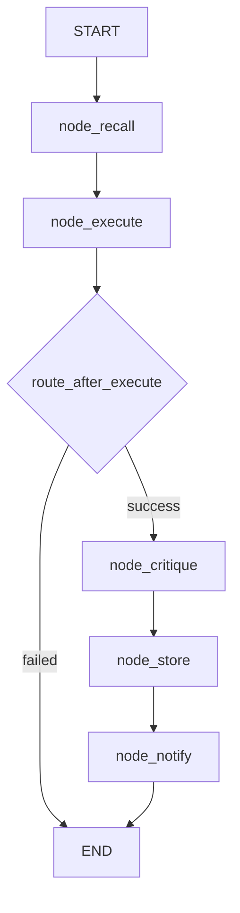

# 📊 Data Workflow

The `data` workflow executes Python-based data analysis, calculations, and dataset generation. It is the agent's primary tool for running pandas/numpy code, performing statistical analysis, and generating data-driven insights.

**Key characteristics:**
- **Code execution on disk** — Real Python code runs via `python_exec` tool with `mode="run_data"`
- **Optional code generation** — If no code is provided, delegates to `agent(role="code")` to generate Python from the goal
- **Critique layer** — `agent(role="critique")` evaluates output quality against the original goal
- **Memory integration** — Stores both episodic (what was done) and procedural (how it was done) memories
- **Best-effort critique** — Failed critique does not fail the workflow; output is used as-is
- **5-node linear pipeline** — Simple, fast, no loops

---

## 🚀 Quick Start

```python
from workflows.base import run_workflow

# With explicit code
result = run_workflow(
    workflow_type="data",
    goal="Analyse monthly sales and find the top 3 months",
    code="import pandas as pd
df = pd.read_csv('sales.csv')
print(df.groupby('month')['revenue'].sum().nlargest(3))",
)

# Without code — agent generates it
result = run_workflow(
    workflow_type="data",
    goal="Calculate the mean and standard deviation of a list of numbers",
)

print(result["result"])  # Output + critique analysis
```

---

## 🏗️ Architecture

```text
workflows/data.py
├── build_data_graph()              # StateGraph builder: 5 nodes + 2 conditional edges
├── node_recall(state)              # Memory recall: episodic + semantic
├── node_execute(state)             # Code generation (if needed) + python_exec execution
├── node_critique(state)            # LLM critique of output quality
├── node_store(state)               # Episodic + procedural memory storage
├── node_notify(state)              # Desktop notification + node_done()
├── route_after_execute(state)      # "critique" if success, "failed" if error
└── route_after_critique(state)     # Always "store"
```

### Execution Flow



**Key design decisions:**
- **Code generation fallback** — If `code` is not provided in state, `node_execute` delegates to `agent(role="code")` which returns structured JSON with `{analysis, patch, assumptions, tests}`. The `patch` field is extracted as the code to run. If the JSON doesn't contain a `patch`, falls back to regex extraction from markdown code blocks.
- **Structured response parsing** — `agent(role="code")` returns JSON. `node_execute` tries `parsed["patch"]` first, then regex ````python
(.*?)
```
`, then raw text. Three-level fallback for robustness.
- **Critique is advisory** — `node_critique` uses `agent(role="critique")` with a 90s timeout. If it fails, the workflow continues with just the raw output. The critique is appended to the result as `OUTPUT:
...

ANALYSIS:
...`.
- **Dual memory storage** — `node_store` saves: (1) episodic memory of the analysis result, and (2) procedural memory of the working code (if code was generated and execution succeeded). This enables future reuse of successful data patterns.
- **No loops** — Unlike `autocode` or `deep_research`, the data workflow is a straight pipeline. No retry, no iteration. Fast and deterministic.
- **LangGraph immutability** — All nodes return partial update `dict`s. No in-place state mutation. No `**state` spreading.

---

## 📝 Workflow State

The data workflow uses the shared `WorkflowState` from `workflows/base.py` with these data-specific keys:

```python
class WorkflowState(TypedDict, total=False):
    # Core inputs
    goal: str              # User's data analysis goal
    code: str              # Optional Python code to execute
    trace_id: str          # Trace identifier

    # Memory
    memory_context: str    # Recalled memories from node_recall

    # Execution
    output: str            # stdout from python_exec
    exec_error: str        # Error message if execution failed
    result: str            # Final output + critique analysis

    # Status
    status: str            # "pending" | "running" | "complete" | "error" | "failed"
    error: str             # Error message
```

| Field | Type | Description |
|-------|------|-------------|
| `goal` | `str` | User's data analysis goal or question |
| `code` | `str` | Optional Python code. If empty, `agent(role="code")` generates it. |
| `memory_context` | `str` | Recalled memories: `[episodic] text` or `[semantic] text` |
| `output` | `str` | Raw stdout from `python(mode="run_data", code=...)` |
| `exec_error` | `str` | Error message if `python` execution failed |
| `result` | `str` | Final result: `OUTPUT:
...

ANALYSIS:
...` (or just output if critique failed) |

---

## ⚡ Nodes

### `node_recall` — Memory Recall

Queries ChromaDB memory collections before execution:
- **Episodic:** "Have I done this analysis before?"
- **Semantic:** "What patterns do I know about this data topic?"

Results formatted as `[type] text` and injected into `memory_context`.

**Output:** `"memory_context"`

### `node_execute` — Code Generation + Execution

**Two paths:**

**Path A: Code provided**
```python
code = state.get("code", "")
result = python(mode="run_data", code=code)
```

**Path B: Code generation needed**
```python
r = agent(
    role="code",
    task=f"Write Python code to: {goal}. Use print() for all output.",
    context=state.get("memory_context", ""),
    trace_id=state.get("trace_id", ""),
)
# Extract code from structured response:
# 1. parsed["patch"] (JSON field)
# 2. regex: ```python
(.*?)
``` (markdown block)
# 3. raw text (fallback)
code = extracted_code
result = python(mode="run_data", code=code)
```

**Error handling:**
- Code generation fails → `node_error(state, "execute", ...)` → END
- Code execution fails → `exec_error` set, routed to END via `route_after_execute`

**Output:** `"output"`, `"exec_error"`, `"code"` (if generated)

### `node_critique` — Output Quality Evaluation

Uses `agent(role="critique")` to evaluate whether the output adequately answers the goal.

**Prompt:** `"Does this output adequately answer: '{goal}'? Note any missing analysis, errors, or improvements."`

**Timeout:** 90s (agent facade default).

**Best-effort:** If critique fails, returns raw output as `result`. Never fails the workflow.

**Output:** `"result"` — `OUTPUT:
...

ANALYSIS:
...` (or just output)

### `node_store` — Memory Persistence

Stores two types of memory:

**Episodic:**
```python
memory.store_episodic(
    text=f"Data analysis: '{goal[:60]}'
Result: {result[:400]}",
    importance=6,
    goal=goal,
    outcome="success",
    tools_used="python,agent,memory",
    trace_id=state.get("trace_id", ""),
)
```

**Procedural** (only if code was generated and execution succeeded):
```python
memory.store_procedural(
    text=f"Working data code for '{goal[:60]}':
{code[:400]}",
    importance=6,
    tags="data,python,working-code",
    trace_id=state.get("trace_id", ""),
)
```

**Output:** Empty dict (side effects only)

### `node_notify` — Completion Notification

Calls `notify(action="send", title="Data analysis complete", message=...)` and marks workflow done.

**Output:** `node_done(state, result=...)`

---

## 🔄 Conditional Routing

### `route_after_execute`

| Condition | Route |
|-----------|-------|
| `state.get("exec_error")` is truthy | → `END` (workflow fails) |
| Otherwise | → `node_critique` |

### `route_after_critique`

Always → `node_store` (critique is advisory, never fails workflow)

---

## ⚙️ Configuration

```ini
# .env — no data-specific env vars currently
# Uses shared config:
#   EXECUTION_TIMEOUT — python_exec timeout
#   PLANNER_TIMEOUT — agent(role="code") timeout
```

```python
# core/config.py
# No data-specific config. Uses:
#   cfg.execution_timeout — for python_exec
#   cfg.planner_timeout — for agent(role="code")
#   cfg.agent_timeout — for agent(role="critique")
```

---

## 📤 Output

The workflow returns a `WorkflowState` dict:

```json
{
  "status": "complete",
  "result": "OUTPUT:
Top 3 months: Jan ($120K), Mar ($115K), Dec ($110K)

ANALYSIS:
The analysis correctly identifies the top revenue months...",
  "goal": "Analyse monthly sales and find the top 3 months",
  "output": "Top 3 months: Jan ($120K), Mar ($115K), Dec ($110K)",
  "exec_error": "",
  "code": "import pandas as pd
df = pd.read_csv('sales.csv')
...",
  "memory_context": "[episodic] Previous sales analysis..."
}
```

**Side effects:**
- Episodic memory stored
- Procedural memory stored (if code was generated)
- Desktop notification sent

---

## 🔄 When to Use vs Alternatives

| Need | Tool/Workflow | Why |
|------|---------------|-----|
| Data analysis with pandas/numpy | `data` | Optimized for data workflows, memory integration |
| Quick calculation | `python` tool | Faster, no workflow overhead |
| Statistical modeling | `data` | Code generation + critique + memory |
| Data visualization | `python` tool | Direct matplotlib/plotly execution |
| ML model training | `python` tool | Direct scikit-learn/TensorFlow execution |
| Complex multi-step analysis | `deep_research` | Iterative research, not code execution |
| Code generation with TDD | `autocode` | Full TDD cycle, git scoping, verification |
| File processing | `python` tool | Direct file I/O, no workflow overhead |

---

## 🧪 Testing

```powershell
# Run data workflow tests
D:\mcp\agent\venv\Scripts\pytest.exe tests/workflows/data/test_data_flow.py -W error --tb=short -v
```

**Mock strategy:**
- Patch `core.memory.memory.recall` for recall node tests
- Patch `tools.python_exec.python` for execution node tests
- Patch `tools.agent.agent` for code generation and critique node tests
- Patch `core.memory.memory.store_episodic` / `.store_procedural` for store node tests
- Patch `tools.notify.notify` for notification tests
- Test code extraction: JSON `patch` field, markdown block regex, raw text fallback
- Test error routing: `exec_error` → END, critique failure → continue with raw output

**Current test layout:**
```text
tests/workflows/data/
└── test_data_flow.py          # Single test file (all nodes + routing)
```

> **Future:** When the workflow grows, split into `test_recall.py`, `test_execute.py`, `test_critique.py`, `test_store.py`, `test_notify.py`, and add `conftest.py`.

---

## 🗺️ Roadmap

### ✅ Completed

| Feature | Status | Notes |
|---------|--------|-------|
| 5-node LangGraph pipeline | ✅ v1.0 | recall → execute → critique → store → notify |
| Code execution via python_exec | ✅ v1.0 | `mode="run_data"` for data analysis |
| Optional code generation | ✅ v1.0 | `agent(role="code")` with structured JSON response |
| Three-level code extraction | ✅ v1.0 | JSON `patch` → markdown regex → raw text fallback |
| LLM critique layer | ✅ v1.0 | `agent(role="critique")` with 90s timeout |
| Best-effort critique | ✅ v1.0 | Failed critique does not fail workflow |
| Dual memory storage | ✅ v1.0 | Episodic (result) + procedural (working code) |
| Error routing | ✅ v1.0 | `exec_error` → END, critique failure → continue |
| LangGraph immutability | ✅ v1.0 | Partial update dicts, no `**state` spreading |

### 🔄 In Progress / Next Up

| Feature | Notes | Priority |
|---------|-------|----------|
| `@meta_tool` refactor on tools used | When `python_exec`, `agent`, `notify` get `@meta_tool`, update calls | P1 |
| Test restructure | Split `test_data_flow.py` into per-node files + `conftest.py` | P1 |
| Configurable code generation timeout | Hardcoded agent timeout. Make configurable via `.env` | P2 |
| Configurable critique timeout | Hardcoded 90s. Make configurable via `.env` | P2 |
| Result artifact storage | Save generated code and output to `workspace/.artifacts/` | P2 |
| Data validation layer | Add `agent(role="validate")` to check data quality before critique | P2 |
| Multi-dataset analysis | Support `datasets: list[str]` input for cross-dataset analysis | P3 |
| Visualization generation | Auto-generate matplotlib/plotly charts from analysis output | P3 |
| Streaming output | Yield partial results as code executes instead of batch return | P3 |

### 🚫 Deferred / Out of Scope

| # | Feature | Why Deferred | Priority |
|---|---------|------------|----------|
| 1 | **TDD loop** | Data analysis is exploratory, not production code. TDD overhead is unnecessary. | Skip |
| 2 | **Git scoping** | Data analysis doesn't modify the codebase. No git operations needed. | Skip |
| 3 | **Knowledge graph integration** | Data analysis operates on external datasets, not the codebase graph. | Skip |
| 4 | **Browser fallback** | Data analysis doesn't fetch web pages. | Skip |
| 5 | **Self-correcting loop** | The workflow is intentionally simple. Complex retry logic belongs in `autocode` or `deep_research`. | Skip |
| 6 | **Store full file contents in state** | Use `FileSnapshot` (8KB preview + MD5) to prevent LangGraph checkpoint bloat. | Skip |

---

## 🛡️ AI Agent Instructions

### NEVER DO
1. **Never mutate state in-place** — LangGraph does not deep-copy. Always return partial update `dict`s.
2. **Never spread `**state`** — Never return `{**state, "key": "value"}`. Return only the changed keys.
3. **Never let critique failure fail the workflow** — `node_critique` is advisory. If it fails, return raw output.
4. **Never skip memory storage** — Both episodic and procedural memories should be stored for reusable data patterns.
5. **Never use `print()` to stdout** — MCP stdio corruption. Use `node_step()` for logging.
6. **Never create `.bak` files** — forbidden by project rules.
7. **Never rewrite the entire file** — surgical edits only. Preserve existing code exactly.
8. **Never skip `compileall` before `pytest`** — catches syntax errors early.

### ALWAYS DO
9. **Always return `dict` from nodes** — Not `WorkflowState`. Partial updates only.
10. **Always use `agent(role="code")` for code generation** — Not direct `llm.complete()`. The code role has structured JSON output.
11. **Always extract code with three-level fallback** — JSON `patch` → markdown regex → raw text.
12. **Always test code generation path** — Mock `agent` to return JSON without `patch` and assert regex fallback works.
13. **Always test error routing** — Mock `python` to fail and assert `route_after_execute` returns `"failed"`.
14. **Always test critique failure** — Mock `agent(role="critique")` to fail and assert workflow continues with raw output.
15. **Always update this doc** when adding nodes, changing routing logic, or modifying code extraction.

---

## 🔗 Source Code Reference

| File | Purpose |
|------|---------|
| `workflows/data.py` | 5-node LangGraph workflow: recall, execute, critique, store, notify |
| `workflows/base.py` | `WorkflowState`, `node_step()`, `node_error()`, `node_done()` |
| `tools/python_exec.py` | `python(mode="run_data", code=...)` — code execution |
| `tools/agent.py` | `agent(role="code")` — code generation, `agent(role="critique")` — output evaluation |
| `core/memory.py` | `memory.recall()` / `.store_episodic()` / `.store_procedural()` — memory operations |
| `tools/notify.py` | `notify(action="send")` — completion notification |
| `core/config.py` | `cfg.execution_timeout`, `cfg.planner_timeout` — shared timeouts |
| `tests/workflows/data/test_data_flow.py` | Single test file covering all nodes + routing |

---

*Architecture: 5-node LangGraph pipeline → memory recall → code generation (optional) + python_exec execution → LLM critique (best-effort) → dual memory storage → notification → conditional routing on execution error.*
