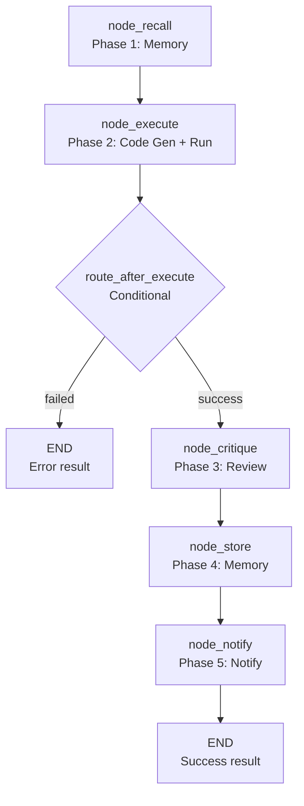

# 📊 Data Workflow

The `data` workflow handles **data analysis and visualization** tasks. It takes a natural language goal, optionally some initial Python code, and produces a data analysis result with optional visualization.

**Key characteristics:**
- **Goal-driven** — User describes what they want; LLM generates the analysis code
- **Execution loop** — Generated code is executed in the sandboxed Python environment
- **Critique loop** — If execution fails, the LLM critiques the error and generates a fix
- **Memory integration** — Recalls relevant past analyses for context
- **Notification** — Reports completion to the user

---

## 🚀 Quick Start

```python
from workflows.base import run_workflow

# Basic analysis
result = run_workflow(
    workflow_type="data",
    goal="Analyze the top 5 most active months from the sales dataset",
    trace_id="data_001",
)

# With initial code
result = run_workflow(
    workflow_type="data",
    goal="Plot a bar chart of monthly revenue",
    code="import pandas as pd; df = pd.read_csv('sales.csv')",
    trace_id="data_002",
)

print(result["status"])  # "success" | "failed"
print(result["result"])  # "Analysis complete: Top 5 months are..."
```

---

## 🏗️ Architecture

```text
workflows/data.py
├── build_data_graph()              # 5-node LangGraph StateGraph
│   ├── node_recall()               # Phase 1: Memory recall
│   ├── node_execute()              # Phase 2: Code generation + execution
│   ├── route_after_execute()       # Conditional: failed → END, success → critique
│   ├── node_critique()             # Phase 3: Review + critique
│   ├── node_store()                # Phase 4: Store results in memory
│   └── node_notify()               # Phase 5: Notify user
```

### Data Flow



**Key design decisions:**
- **Memory first** — `node_recall` runs before code generation to provide relevant past analyses as context. This improves the quality of generated code.
- **Single-pass execution** — The workflow does not loop on execution failure. If code generation fails, the workflow ends with an error. If execution fails, the error is captured but the workflow still proceeds to critique (not retry).
- **Critique as review, not retry** — `node_critique` reviews the output and provides feedback. It does not generate a fix or retry execution. The critique is stored in memory for future reference.
- **Procedural memory** — If code was generated and execution succeeded, the code is stored in procedural memory. This enables future recall of similar analyses.
- **No JSON parsing** — The code role outputs raw Python code, not JSON. The workflow extracts code from markdown fences using regex.
- **Result compression** — The execution output is compressed via `compress_result()` before being returned. This prevents oversized responses.

---

## 📝 Node Reference

### `node_recall(state)` — Phase 1: Memory Recall

**Purpose:** Recall relevant past analyses from memory.

**Logic:**
```python
memory.recall(
    query=goal,
    limit=5,
    trace_id=state["trace_id"],
)
```

**Output:** Partial dict with `memory_context`.

**Error handling:** If memory recall fails, returns `{"memory_context": ""}` (empty string). The workflow proceeds without context.

### `node_execute(state)` — Phase 2: Code Generation + Execution

**Purpose:** Generate Python code from the goal and execute it.

**Logic:**
1. Build prompt with goal, memory context, and initial code (if provided)
2. Call `agent(role="code", task=...)` to generate code
3. Extract code from markdown fences using regex
4. Execute code via `python(code=...)`
5. Return output or error

**Output:** Partial dict with `output`, `exec_error`, `code`.

**Error handling:**
- Code generation fails → `node_error(state, "execute", ...)` → workflow ends
- Execution fails → `exec_error` set, output is empty string
- Code extraction fails → `node_error(state, "execute", ...)` → workflow ends

**Regex for code extraction:**
```python
match = re.search(r"```python\n(.*?)\`\`\`", text, re.DOTALL)
```

> **Note:** The regex uses `\`\`\`` which is a malformed escape sequence in raw strings. This emits a `SyntaxWarning` in modern Python. Should be `\n```` or use non-raw string.

### `route_after_execute(state)` — Conditional Router

**Purpose:** Route to critique or END based on execution result.

**Logic:**
```python
if state.get("exec_error"):
    return "failed"  # → END
return "critique"    # → node_critique
```

**Output:** String literal `"failed"` or `"critique"`.

### `node_critique(state)` — Phase 3: Review + Critique

**Purpose:** Review the execution output and provide feedback.

**Logic:**
1. Call `agent(role="critique", task=...)` with the output
2. Return the critique text

**Output:** Partial dict with `result` (critique text).

**Guard:** If `output` is empty, returns empty state (no critique). This is a silent skip — no trace step explains why.

### `node_store(state)` — Phase 4: Memory Storage

**Purpose:** Store the analysis result in memory.

**Logic:**
1. Store semantic memory: `memory.store_semantic(text=result, ...)`
2. Store procedural memory: `memory.store_procedural(text=code, ...)` (only if code was generated and execution succeeded)

**Output:** Empty dict (side effects only).

**Note:** Procedural memory is stored for ALL successful executions, including user-provided code. The doc says "only if code was generated" but the code doesn't distinguish.

### `node_notify(state)` — Phase 5: User Notification

**Purpose:** Notify the user of completion.

**Logic:**
1. Call `notify(action="notify", message=...)` with the result
2. Return `node_done(state, result=...)`

**Output:** `node_done` result dict.

---

## ⚙️ Configuration

```ini
# .env — no data-specific env vars
# Uses shared config:
# cfg.code_timeout — for agent(role="code")
# cfg.critique_timeout — for agent(role="critique")
# cfg.python_timeout — for python(code=...)
```

```python
# core/config.py
# No data-specific config. Uses:
# cfg.code_timeout — LLM code generation timeout
# cfg.critique_timeout — LLM critique timeout
# cfg.python_timeout — Python execution timeout
```

---

## 📤 Output

The workflow returns a `dict`:

```json
{
  "status": "success",
  "result": "Analysis complete: Top 5 months are Jan, Mar, Dec, Jun, Sep",
  "error": "",
  "artifacts": []
}
```

**Failure:**
```json
{
  "status": "failed",
  "result": "",
  "error": "Code generation failed: timeout",
  "artifacts": []
}
```

---

## 🔄 When to Use vs Alternatives

| Need | Tool | Why |
|------|------|-----|
| Analyze data | `data` workflow | Goal-driven, generates code, executes, reviews |
| Research a topic | `research` workflow | Web search + synthesis, no code execution |
| Fix code | `autocode` workflow | Targeted code changes with test verification |
| Deep research | `deep_research` workflow | Iterative search with convergence detection |
| Understand codebase | `understand` workflow | Codebase analysis and dependency mapping |
| Generate report | `report` workflow | Structured report generation |

---

## 🧪 Testing

```powershell
# Run data workflow tests
D:\mcp\agent\venv\Scripts\pytest.exe tests/workflows/data/test_data_flow.py -W error --tb=short -v
```

**Mock strategy:**
- Patch `agent(action="dispatch", role="code")` for code generation
- Patch `python(code=...)` for execution
- Patch `agent(action="dispatch", role="critique")` for critique
- Patch `memory.recall()` and `memory.store_*` for memory operations
- Patch `notify(action="notify")` for notification
- Test `node_execute` with code extraction failure → assert error state
- Test `route_after_execute` with `exec_error` → assert `"failed"`
- Test `route_after_execute` without `exec_error` → assert `"critique"`
- Test `node_store` with user-provided code → assert procedural memory NOT stored

**Current test layout:**
```text
tests/workflows/data/
└── test_data_flow.py  # Full workflow test
```

> **Future:** Split into per-node files: `test_node_recall.py`, `test_node_execute.py`, `test_node_critique.py`, `test_node_store.py`, `test_node_notify.py`, plus `conftest.py`.

---

## 🗺️ Roadmap

### ✅ Completed

| Feature | Status | Notes |
|---------|--------|-------|
| 5-node LangGraph pipeline | ✅ v1.0 | recall → execute → critique → store → notify |
| Memory recall integration | ✅ v1.0 | Phase 1: recalls relevant past analyses |
| Code generation + execution | ✅ v1.0 | Phase 2: generates Python, executes in sandbox |
| Conditional routing | ✅ v1.0 | Execution failure → END, success → critique |
| Critique review | ✅ v1.0 | Phase 3: LLM reviews output |
| Memory storage | ✅ v1.0 | Phase 4: stores semantic + procedural memory |
| User notification | ✅ v1.0 | Phase 5: notifies user of completion |
| Result compression | ✅ v1.0 | `compress_result()` prevents oversized responses |

### 🔄 In Progress / Next Up

| # | Feature | Notes | Priority |
|---|---------|-------|----------|
| 1 | **Fix `agent()` missing `action="dispatch"`** | `node_execute` and `node_critique` call `agent()` without required `action` parameter. Always returns error. | P0 |
| 2 | **Fix code-gen failure routing to critique instead of END** | `node_execute` returns `node_error()` on failure, but `route_after_execute` checks `exec_error` (not set by `node_error`), so workflow routes to `node_critique` instead of END. | P0 |
| 3 | **Fix execution failure not calling `node_error`** | When `python()` execution fails, `node_execute` sets `exec_error` but never calls `node_error()`. No trace step, no error checkpoint. | P0 |
| 4 | **Fix `**state` spreading in all nodes** | All nodes return `{**state, ...}` which violates LangGraph best practice. Should return partial dicts with only changed keys. | P0 |
| 5 | **Add exception isolation to all nodes** | No `try/except` in any node. Tool call exceptions crash the entire workflow. | P1 |
| 6 | **Fix `content` param misused for text in `node_critique`** | `content` is documented as "base64-encoded image string". Using it for arbitrary text is a semantic mismatch. Use `context` instead. | P1 |
| 7 | **Fix procedural memory stored for user-provided code** | `node_store` stores procedural memory for ALL successful executions, not just LLM-generated code. Should distinguish. | P1 |
| 8 | **Fix regex escape inconsistency in code extraction** | `r"```python\n(.*?)\`\`\``"` has malformed escape `\`\`\``. Emits `SyntaxWarning`. Should be `r"```python\n(.*?)\n```"`. | P1 |
| 9 | **Fix silent empty output critique skip** | `node_critique` silently skips when `output` is empty. Should log reason. | P1 |
| 10 | **Handle `notify()` failure in `node_notify`** | If `notify()` raises or returns error, `node_notify` crashes or propagates error dict. | P2 |
| 11 | **Test restructure** | Split `test_data_flow.py` into per-node files + `conftest.py` | P1 |
| 12 | **Configurable code generation timeout** | Hardcoded agent timeout. Make configurable via `.env` | P2 |
| 13 | **Code extraction fallback** | If regex fails, try JSON extraction or raw text | P2 |
| 14 | **Execution retry loop** | On execution failure, retry with fix instead of ending | P3 |
| 15 | **Visualization support** | Detect matplotlib/plotly output and return as artifact | P3 |

### 🚫 Deferred / Out of Scope

| # | Feature | Why Deferred | Priority |
|---|---------|------------|----------|
| 1 | **Remove memory integration** | Memory recall improves code quality. Removing it would degrade results. | Skip |
| 2 | **Remove critique node** | Critique provides valuable feedback. Removing it would lose quality assurance. | Skip |
| 3 | **Add execution retry loop** | Current single-pass execution is intentional. Retry loops add complexity and may not improve reliability. | Skip |
| 4 | **Support non-Python languages** | The workflow is specifically designed for Python data analysis. Other languages would require significant changes. | Skip |
| 5 | **Real-time streaming output** | Streaming would require WebSocket or SSE infrastructure. Out of scope for current architecture. | Skip |

---

## 🛡️ AI Agent Instructions

### NEVER DO
1. **Never mutate state in-place** — LangGraph does not deep-copy. Always return partial update `dict`s.
2. **Never spread `**state`** — Never return `{**state, "key": "value"}`. Return only the changed keys.
3. **Never remove memory recall from `node_recall`** — Context improves code quality significantly.
4. **Never skip `node_error` on execution failure** — Always log errors to trace and checkpoint.
5. **Never use `print()` to stdout** — MCP stdio corruption. Use `tracer.step()` for logging.
6. **Never create `.bak` files** — forbidden by project rules.
7. **Never rewrite the entire file** — surgical edits only. Preserve existing code exactly.
8. **Never skip `compileall` before `pytest`** — catches syntax errors early.
9. **Never call `agent()` without `action="dispatch"`** — The `agent()` facade requires `action`. Always pass `action="dispatch"` for LLM calls.
10. **Never return `None` from LangGraph nodes** — Always return a `dict` (even empty `{}`).

### ALWAYS DO
11. **Always return `dict` from nodes** — Not `WorkflowState`. Partial updates only.
12. **Always pass `trace_id` to tracer calls** — Observability requires trace correlation.
13. **Always handle code extraction failure** — If regex fails, return error state.
14. **Always test `route_after_execute` with both paths** — Assert `"failed"` and `"critique"`.
15. **Always test memory storage** — Assert semantic + procedural memory stored correctly.
16. **Always test notification** — Assert `notify()` called with correct message.
17. **Always update this doc** when adding nodes, changing routing logic, or modifying error handling.
18. **Always use `context` parameter for text** — `content` is for base64 images. Use `context` for additional text.

---

## 🔗 Source Code Reference

| File | Purpose |
|------|---------|
| `workflows/data.py` | `build_data_graph()` — 5-node LangGraph StateGraph for data analysis |
| `workflows/base.py` | `WorkflowState`, `node_step()`, `node_error()`, `node_done()` — shared infrastructure |
| `tools/agent.py` | `agent(action="dispatch", role="code")` — code generation |
| `tools/agent.py` | `agent(action="dispatch", role="critique")` — critique review |
| `tools/python.py` | `python(code=...)` — sandboxed Python execution |
| `tools/memory.py` | `memory.recall()`, `memory.store_semantic()`, `memory.store_procedural()` — memory operations |
| `tools/notify.py` | `notify(action="notify", message=...)` — user notification |
| `core/config.py` | `cfg.code_timeout`, `cfg.critique_timeout`, `cfg.python_timeout` — timeouts |
| `core/utils.py` | `compress_result()` — result compression |
| `tests/workflows/data/test_data_flow.py` | Full workflow test |

---

*Architecture: 5-node LangGraph pipeline (recall → execute → critique → store → notify) with memory integration, code generation, sandboxed execution, and result compression.*
