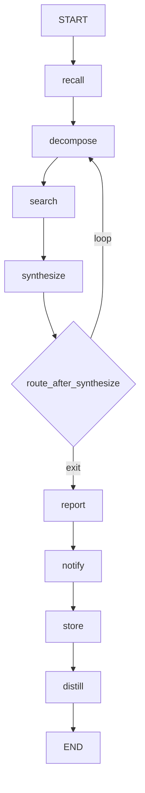

# 🔬 Deep Research Workflow

The `deep_research` workflow is an **iterative, budget-aware research pipeline** that replaces the linear `research` workflow with a **ReAct-style loop**: decompose → search → extract → synthesize → evaluate → [loop or exit].

It is designed for complex, multi-faceted research goals that require multiple search rounds, evidence synthesis, and self-evaluation before producing a final report.

**Key characteristics:**
- **ReAct-style loop** — 8 nodes with conditional edges: decompose → search → synthesize → [route back to decompose or exit to report]
- **Budget-aware** — Hard caps on iterations, API calls, and browser actions
- **Three-tier tool selection** — `tavily` → `web` → `browser` fallback chain per query
- **Citation tracking** — Every source registered via `core.citations`
- **Convergence detection** — Exits when knowledge stops changing (`SequenceMatcher`)
- **Stuck-loop detection** — Exits when no evidence is found for 2 consecutive iterations
- **Memory integration** — Recalls past research before starting, stores results after completion
- **URL deduplication** — Cross-iteration `seen_urls` set prevents re-scraping same pages
- **Facade timeout** — `ThreadPoolExecutor(max_workers=1)` wrapper with configurable timeout

---

## 🚀 Quick Start

```python
from workflows.deep_research import run_deep_research_agent

result = run_deep_research_agent(
    goal="What are the trade-offs between ChromaDB and Pinecone for production RAG?",
)
print(result["result"])
```

**With overrides:**
```python
result = run_deep_research_agent(
    goal="...",
    max_iterations=5,          # Default: 10
    trace_id="abc123",
    timeout=120,                 # Facade timeout in seconds
)
```

---

## 🏗️ Architecture

```text
workflows/deep_research.py (facade)
└── run_deep_research_agent(goal, **kwargs)
    └── ThreadPoolExecutor(max_workers=1) + timeout
        └── run_workflow("deep_research", ...)
            └── build_deep_research_graph()
                ├── recall ──→ decompose ──→ search ──→ synthesize ──→ [route]
                │                                              ↑
                │                                              └────── loop back
                │
                └── report ──→ notify ──→ store ──→ distill ──→ END

workflows/deep_research_core/
├── graph.py                    # StateGraph builder, 8 nodes + conditional edges
├── state.py                    # DeepResearchState TypedDict
├── routes.py                   # route_after_synthesize: loop vs exit logic
├── budget.py                   # Pure budget functions: decrement, log, check, format
├── constants.py                # Prompts, convergence threshold, JS detection hints
└── nodes/
    ├── decompose.py            # LLM-based goal decomposition into sub-queries
    ├── search.py               # Tool selection, search execution, evidence extraction, browser fallback
    └── synthesize.py           # Knowledge merging, completeness evaluation, convergence check
```

### Execution Flow



**Key design decisions:**
- **Thin facade with timeout** — `run_deep_research_agent()` wraps `run_workflow()` in a `ThreadPoolExecutor(max_workers=1)` with a configurable timeout. This prevents the LangGraph loop from hanging indefinitely. The facade also extracts `trace_id` and `timeout` from kwargs so they don't leak into the LangGraph state.
- **StateGraph, not StateMachine** — Uses LangGraph's `StateGraph` with `add_conditional_edges` for the cyclic loop. This gives checkpointing, streaming, and visual debugging out of the box.
- **Replace semantics for knowledge** — `_merge_knowledge()` replaces (not appends) the knowledge base each iteration. This prevents infinite context growth. The cap is `_MAX_PREV_KNOWLEDGE_CHARS = 6000`.
- **Three-tier tool selection** — `_select_tool()` chooses `tavily` for complex queries with API budget, `web` for simple queries or when Tavily is exhausted, and `browser` only as a fallback for JS-walled content. Browser is never selected as the primary tool.
- **Browser fallback respects budget** — `_try_browser_fallback()` checks `is_browser_budget_exhausted()` before any browser action. Each fallback consumes 2 browser actions (navigate + text_content).
- **URL deduplication across iterations** — `seen_urls` is a `set` persisted in state. Prevents re-scraping the same page in different iterations.
- **Direct `llm.complete(role="planner")` in decompose** — Bypasses `agent(role="plan")` to avoid autocode prompt leak. The planner role is used directly for sub-query generation.
- **Synthesis via `agent(role="research")`** — Delegates to the research role facade, not direct `llm.complete()`. Gives the research role its own model config and timeout.
- **Evaluation via `agent(role="executor")`** — Completeness scoring uses the executor role for fast, cheap evaluation.
- **Best-effort nodes** — `report`, `notify`, `store`, `distill` all catch exceptions and continue. The workflow never fails because of a side-effect node.
- **Budget events audit trail** — Every tool selection, fallback, and error is logged to `budget_events` for post-hoc analysis.

---

## 📝 Workflow State

```python
class DeepResearchState(WorkflowState, total=False):
    # Research inputs
    goal: str
    sub_queries: list[str]
    pending_queries: list[str]

    # Evidence
    extracted_evidence: list[dict]
    failed_sources: list[dict]

    # Knowledge
    knowledge_base: str
    _prev_knowledge: str
    completeness: float
    converged: bool

    # Control
    iteration: int
    consecutive_empty_iterations: int
    budget_api_calls: int
    budget_browser_actions: int
    budget_events: list[dict]

    # Config
    max_iterations: int
    completeness_threshold: float
    convergence_threshold: float

    # Report
    report: str
    result: str
    status: str

    # Memory (recalled context from episodic/semantic memory)
    memory_context: str

    # Cross-iteration URL deduplication
    seen_urls: list[str]
```

| Field | Type | Description |
|-------|------|-------------|
| `goal` | `str` | Original user research question |
| `sub_queries` | `list[str]` | Decomposed sub-queries from the planner LLM |
| `pending_queries` | `list[str]` | Sub-queries yet to be searched in current iteration |
| `extracted_evidence` | `list[dict]` | Evidence from current iteration (cleared after synthesize) |
| `failed_sources` | `list[dict]` | URLs that failed extraction, with reason and iteration |
| `knowledge_base` | `str` | Running synthesis (replaced each iteration, capped at 6K chars) |
| `_prev_knowledge` | `str` | Snapshot of knowledge before synthesis (for convergence detection) |
| `completeness` | `float` | 0.0–100.0 score from LLM evaluation |
| `converged` | `bool` | `SequenceMatcher` ratio > threshold between `_prev_knowledge` and `knowledge_base` |
| `iteration` | `int` | Current loop iteration (0, 1, 2, ...) |
| `consecutive_empty_iterations` | `int` | Stuck-loop counter (resets on non-empty evidence) |
| `budget_api_calls` | `int` | Remaining Tavily API calls |
| `budget_browser_actions` | `int` | Remaining browser actions (2 per fallback: navigate + text_content) |
| `budget_events` | `list[dict]` | Audit trail of budget decisions |
| `max_iterations` | `int` | Hard cap on loop iterations (default: 10) |
| `completeness_threshold` | `float` | Exit threshold for completeness score (default: 85.0) |
| `convergence_threshold` | `float` | `SequenceMatcher` ratio threshold (default: 0.85) |
| `report` | `str` | Final synthesized report |
| `result` | `str` | Final result (same as report) |
| `status` | `str` | `"success"` | `"incomplete"` | `"failed"` | `"timeout"` |
| `memory_context` | `str` | Recalled memories from episodic/semantic collections |
| `seen_urls` | `list[str]` | Deduplication set (stored as list for JSON serialization) |

---

## ⚡ Nodes

### `recall` — Memory Recall

Queries ChromaDB memory collections before decomposing:
- **Episodic:** "Have I researched this topic before?"
- **Semantic:** "What do I know about this topic?"

Results formatted as `[type|score=0.XX] text` and injected into `memory_context`.

**Output:** `memory_context` — formatted string of recalled memories.

### `decompose` — Goal Decomposition

Uses `llm.complete(role="planner")` (not `agent(role="plan")`) to break the goal into 3-5 searchable sub-queries.

**Prompt strategy:**
- **First iteration:** Generates initial sub-queries from the goal alone.
- **Subsequent iterations:** Includes `knowledge_base[:2000]` + `memory_context[:1000]` to generate follow-up queries that explore gaps, contradictions, or uncovered angles.

**Parsing:** `_parse_sub_queries()` handles three formats:
1. JSON array: `["query1", "query2", ...]`
2. JSON object: `{"queries": [...]}` or `{"steps": [{"description": ...}]}`
3. Line heuristic: bullet/numbered lists or `Step N: query` patterns

**Fallback:** If parsing fails, returns `[goal]` (single sub-query = original goal).

**Output:** `sub_queries`, `pending_queries` — list of sub-query strings.

### `search` — Execute Sub-Queries, Extract Evidence

The most complex node. Handles tool selection, search execution, evidence extraction, browser fallback, and budget management.

**Tool selection (`_select_tool`):**

| Condition | Selected Tool | Rationale |
|-----------|--------------|-----------|
| No `TAVILY_API_KEY` | `web` | Tavily unavailable |
| Complex query (8+ words, "compare", "vs") + API budget | `tavily` | Better ranking for complex queries |
| API budget available | `tavily` | Default to AI-ranked search |
| API budget exhausted | `web` | Free fallback |

**Search with fallback (`_execute_search_with_fallback`):**
1. Try `tavily` first (if selected)
2. If empty/error, log event and fallback to `web`
3. Return actual tool used + state updates

**Evidence extraction (`_extract_evidence`):**
1. Iterate top 3 results per query
2. Skip already-seen URLs (`seen_urls` set)
3. Skip previously failed URLs
4. Skip URLs with no content or < 100 chars
5. **Browser fallback** for JS walls or < 300 chars (respects browser budget)
6. Summarize evidence via `llm.complete(role="summarize")` (2-3 bullet points)
7. Register citation via `citations.add()`

**Budget tracking:**
- Each successful Tavily search decrements `budget_api_calls`
- Each browser fallback decrements `budget_browser_actions` twice (navigate + text_content)
- Every event logged to `budget_events`

**Output:** `extracted_evidence`, `pending_queries` (cleared), `iteration` (incremented), `consecutive_empty_iterations`, `budget_*`, `seen_urls`, `failed_sources`.

### `synthesize` — Merge Evidence, Evaluate, Check Convergence

**Three-step process:**

1. **Synthesize:** `agent(role="research")` merges `prev_knowledge[:1000]` + new evidence into updated knowledge.
2. **Evaluate:** `agent(role="executor")` scores completeness 0-100 against the original goal.
3. **Converge:** `SequenceMatcher` checks if new knowledge is similar enough to old knowledge.

**Knowledge merging:** `_merge_knowledge()` uses **replace semantics** — new synthesis always replaces old knowledge. Prevents infinite context growth.

**Knowledge capping:** `_cap_knowledge()` truncates to `_MAX_PREV_KNOWLEDGE_CHARS = 6000` chars, cutting from the head and keeping the tail. Finds sentence/paragraph boundary to avoid mid-sentence breaks.

**Score parsing:** `_parse_score()` extracts the last numeric value from critique text, clamps to 0-100, ignores negative numbers.

**Output:** `knowledge_base`, `_prev_knowledge`, `completeness`, `converged`, `synthesis`, `extracted_evidence` (cleared).

### `report` — Build Final Report

Assembles the final report from `synthesis` or `knowledge_base`. Sets status:
- `"success"` if `completeness >= completeness_threshold`
- `"incomplete"` otherwise

**Output:** `report`, `result`, `status`.

### `notify` — Send Completion Notification

Calls `notify(action="send", title="DeepResearch", message=result[:500])`.

**Best-effort:** Catches exceptions and continues.

### `store` — Save to Memory

Stores findings in ChromaDB:
- **Semantic:** `memory.store_semantic(text=f"Deep Research: {result[:800]}", importance=6, tags="deep_research")`
- **Episodic:** `memory.store_episodic(text=f"Completed deep research: '{goal[:60]}'", importance=5, goal=goal, outcome=status, tools_used="tavily,web,browser,llm")`

**Best-effort:** Catches exceptions and continues.

### `distill` — Workflow Distillation (Placeholder)

**No-op** until v2. `sleep_learn` does not export `distill_workflow`.

Returns state unchanged.

---

## 🔄 Conditional Routing

### `route_after_synthesize`

Exit conditions (evaluated in order):

| # | Condition | Result | Reason |
|---|-----------|--------|--------|
| 1 | `iteration >= max_iterations` | → `report` | Hard cap, always exits |
| 2 | `consecutive_empty_iterations >= 2` | → `report` | Stuck-loop guard |
| 3 | `completeness >= threshold` AND `converged` | → `report` | Dual-gate: quality + stability |
| 4 | Otherwise | → `decompose` | Continue loop |

**Convergence detection:** Uses `difflib.SequenceMatcher` with `CONVERGENCE_SIMILARITY_THRESHOLD = 0.85`. Compares `_prev_knowledge` and `knowledge_base`. If either is empty, not converged.

---

## ⚙️ Configuration

```ini
# .env
DEEP_RESEARCH_MAX_ITERATIONS=10
DEEP_RESEARCH_MAX_API_CALLS=20
DEEP_RESEARCH_MAX_BROWSER_ACTIONS=5
DEEP_RESEARCH_COMPLETENESS_THRESHOLD=85.0
DEEP_RESEARCH_CONVERGENCE_THRESHOLD=0.85
DEEP_RESEARCH_TIMEOUT_SECONDS=300
```

```python
# core/config.py
self.deep_research_max_iterations = int(os.getenv("DEEP_RESEARCH_MAX_ITERATIONS", "10"))
self.deep_research_max_api_calls = int(os.getenv("DEEP_RESEARCH_MAX_API_CALLS", "20"))
self.deep_research_max_browser_actions = int(os.getenv("DEEP_RESEARCH_MAX_BROWSER_ACTIONS", "5"))
self.deep_research_completeness_threshold = float(os.getenv("DEEP_RESEARCH_COMPLETENESS_THRESHOLD", "85.0"))
self.deep_research_convergence_threshold = float(os.getenv("DEEP_RESEARCH_CONVERGENCE_THRESHOLD", "0.85"))
self.deep_research_timeout_seconds = int(os.getenv("DEEP_RESEARCH_TIMEOUT_SECONDS", "300"))
```

---

## 📤 Output

The workflow returns a `DeepResearchState` dict. The final result is in `"result"`:

```json
{
  "status": "success",
  "result": "Synthesized markdown report...",
  "report": "Synthesized markdown report...",
  "goal": "What are the trade-offs between ChromaDB and Pinecone?",
  "trace_id": "abc123",
  "knowledge_base": "...",
  "completeness": 92.0,
  "converged": true,
  "iteration": 4,
  "budget_api_calls": 16,
  "budget_browser_actions": 3,
  "budget_events": [
    {"iteration": 1, "tool": "search", "action": "selected", "reason": "tavily"},
    {"iteration": 2, "tool": "search", "action": "fallback", "reason": "tavily->web: empty_results"}
  ],
  "failed_sources": [
    {"url": "https://...", "reason": "no_content", "iteration": 2}
  ],
  "seen_urls": ["https://...", "https://..."],
  "error": ""
}
```

**Side effects:**
- Semantic + episodic memories stored in ChromaDB
- Citations registered in `core.citations`
- Desktop notification sent (best-effort)
- Budget audit trail in `budget_events`

---

## 🔄 Comparison with `research` Workflow

| Aspect | `research` (Linear) | `deep_research` (Iterative) |
|--------|---------------------|------------------------------|
| Structure | 8-node pipeline | Cyclic ReAct loop |
| Search | Single query | Multiple sub-queries, sequential |
| Extraction | Parallel scrape (all URLs) | Selective extraction with deduplication |
| Synthesis | One-shot | Iterative, knowledge replaced each round |
| Evaluation | None | Completeness scoring + convergence detection |
| Tool usage | `web` only | `tavily` → `web` → `browser` fallback chain |
| Budget | Unbounded | Explicit iteration/API/browser limits |
| Memory | Recall + store + distill + notify | Same pattern (recall before, store after) |
| Use case | Quick reports | Complex, multi-faceted investigations |

---

## 🧪 Testing

```powershell
# Run all deep research tests
D:\mcp\agent\venv\Scripts\pytest.exe tests/workflows/deep_research/ -W error --tb=short -v
```

**Test coverage (7 files):**

| File | Tests | Coverage |
|------|-------|----------|
| `test_graph.py` | — | StateGraph construction, node wiring, conditional edges, entry point, compilation |
| `test_search.py` | — | Tool selection, search execution, fallback chain, evidence extraction, browser fallback, budget tracking, URL deduplication |
| `test_decompose.py` | — | Sub-query parsing (JSON array, JSON object, line heuristic), fallback to goal, LLM error handling |
| `test_synthesize.py` | — | Knowledge merging, knowledge capping, score parsing, convergence detection, agent mocking |
| `test_budget.py` | — | Budget decrement, exhaustion checks, event logging, audit formatting |
| `test_seen_urls.py` | — | URL deduplication across iterations, seen_urls persistence |
| `test_timeout.py` | — | Facade timeout, ThreadPoolExecutor wrapper, timeout error handling |

**Mock strategy:**
- Patch `core.llm.llm.complete` for decompose/summarize/evaluate tests
- Patch `tools.agent.agent` for synthesize tests
- Patch `tools.web.web` and `tools.tavily.tavily` for search tests
- Patch `tools.browser.browser` for browser fallback tests
- Patch `core.memory.memory.recall` / `.store_semantic` / `.store_episodic` for memory tests
- Patch `core.citations.citations.add` for citation tests
- Patch `core.config.cfg` for budget configuration tests
- Patch `workflows.deep_research_core.routes._is_converged` for convergence tests

**Current test layout:**
```text
tests/workflows/deep_research/
├── __init__.py
├── test_budget.py
├── test_decompose.py
├── test_graph.py
├── test_search.py
├── test_seen_urls.py
├── test_synthesize.py
└── test_timeout.py
```

> **Future:** When the workflow is refactored (e.g., parallel sub-query dispatch), tests may be restructured to add `conftest.py` and split by concern.

---

## 🗺️ Roadmap

### ✅ Completed

| Feature | Status | Notes |
|---------|--------|-------|
| 8-node LangGraph cyclic pipeline | ✅ v1.0 | recall → decompose → search → synthesize → [route] → report → notify → store → distill |
| ReAct-style loop | ✅ v1.0 | Conditional edges: loop back to decompose or exit to report |
| Budget tracking | ✅ v1.0 | Iteration, API call, and browser action limits with audit trail |
| Three-tier tool selection | ✅ v1.0 | `tavily` → `web` → `browser` fallback |
| Convergence detection | ✅ v1.0 | `SequenceMatcher` at 0.85 threshold |
| Stuck-loop detection | ✅ v1.0 | `consecutive_empty_iterations >= 2` |
| URL deduplication | ✅ v1.0 | Cross-iteration `seen_urls` set |
| Citation tracking | ✅ v1.0 | `citations.add()` per successful extraction |
| Memory integration | ✅ v1.0 | Recall before, semantic + episodic store after |
| Facade timeout | ✅ v1.0 | `ThreadPoolExecutor(max_workers=1)` with `future.result(timeout=...)` |
| Knowledge capping | ✅ v1.0 | `_cap_knowledge()` at 6K chars, paragraph-boundary cut |
| Direct planner LLM in decompose | ✅ v1.0 | Bypasses `agent(role="plan")` to avoid autocode prompt leak |
| Synthesis via agent facade | ✅ v1.0 | `agent(role="research")` instead of direct `llm.complete()` |
| Best-effort side-effect nodes | ✅ v1.0 | report, notify, store, distill all catch exceptions |

### 🔄 In Progress / Next Up

| Feature | Notes | Priority |
|---------|-------|----------|
| Parallel sub-query dispatch | Use LangGraph `Send` for tavily/web sub-queries (browser stays sequential) | P1 |
| Tavily keyless graceful degradation | When Tavily is keyless, automatically fall back to `web(search)` without user intervention | P1 |
| `_do_research()` accelerator | Tavily broad-sweep when iteration > 3 and completeness < 50 | P1 |
| Wire `_do_research()` accelerator | Call `tavily._do_research()` directly from `deep_research_core/nodes/search.py` when iteration > 3 and completeness < 50. Bypass tool facade for internal use | P1 |
| Standardize `max_results` | Currently hardcoded `max_results=5` in `node_search`. Use `cfg.web_max_search_results` or add `DEEP_RESEARCH_MAX_SEARCH_RESULTS` to `.env` | P2 |
| Workflow distillation | Wire up `_node_distill` when `sleep_learn` exports `distill_workflow` | P2 |
| Telemetry persistence | Write `budget_events` to disk per `trace_id` | P2 |
| Streaming partial results | Yield intermediate synthesis per iteration instead of batch return | P2 |
| Deduplicate URLs across `tavily` + `web` | When Tavily and web return overlapping URLs, deduplicate before extraction | P2 |
| Knowledge compaction | LLM-based summarization when `knowledge_base` exceeds 8K chars | P3 |
| Tool selection classifier | Train lightweight classifier after 100+ traces to replace heuristic | P3 |
| Configurable decompose count | Hardcoded 3-5 sub-queries. Make configurable via `.env` | P3 |
| Configurable evidence per query | Hardcoded top 3 results. Make configurable | P3 |
| Result quality pre-filtering | Filter low-quality evidence before synthesis based on source reliability | P3 |
| Multi-model synthesis | Use different LLM roles for synthesis vs evaluation (already partially done) | P3 |

### 🚫 Deferred / Out of Scope

| # | Feature | Why Deferred | Priority |
|---|---------|------------|----------|
| 1 | **Remove browser fallback** | Browser fallback is essential for JS-heavy sites. Removing it would break many real-world pages. | Skip |
| 2 | **Synchronous search only** | Sequential search is currently required for URL deduplication and budget tracking. Parallel dispatch is P1, not skip. | Skip |
| 3 | **Store full page text in memory** | Memory stores summaries only (first 800 chars). Full text would bloat ChromaDB. | Skip |
| 4 | **Interactive user clarification** | Would require bidirectional communication. Out of scope for autonomous workflow. | Skip |
| 5 | **Real-time search during synthesis** | Synthesis is a single LLM call. Interactive search would require a nested loop. | Skip |
| 6 | **Remove facade timeout** | The timeout is the only protection against infinite loops. Removing it risks hanging the agent. | Skip |

---

## 🛡️ AI Agent Instructions

### NEVER DO
1. **Never remove the facade timeout** — `ThreadPoolExecutor(max_workers=1)` + `future.result(timeout=...)` is the only protection against infinite loops.
2. **Never call `agent(role="plan")` in decompose** — Use `llm.complete(role="planner")` directly to avoid autocode prompt leak.
3. **Never select `browser` as primary tool** — Browser is only a fallback for JS-walled content. Primary tools are `tavily` and `web`.
4. **Never bypass browser budget** — Always check `is_browser_budget_exhausted()` before any browser action.
5. **Never append to `knowledge_base`** — Use `_merge_knowledge()` replace semantics. Appending causes infinite context growth.
6. **Never skip URL deduplication** — `seen_urls` prevents re-scraping and redundant API calls.
7. **Never let side-effect nodes fail the workflow** — `report`, `notify`, `store`, `distill` must catch exceptions and continue.
8. **Never create `.bak` files** — forbidden by project rules.
9. **Never rewrite the entire file** — surgical edits only. Preserve existing code exactly.
10. **Never print to stdout** — MCP stdio corruption. Use `node_step()` for logging.
11. **Never skip `compileall` before `pytest`** — catches syntax errors early.

### ALWAYS DO
12. **Always use `agent(role="research")` for synthesis** — Not direct `llm.complete()`. The research role has its own model config.
13. **Always use `agent(role="executor")` for evaluation** — Fast, cheap scoring. Separate from synthesis role.
14. **Always cap knowledge before sending to LLM** — `_cap_knowledge()` at 6K chars prevents context overflow.
15. **Always test the stuck-loop guard** — Patch `consecutive_empty_iterations = 2` and assert route returns `"report"`.
16. **Always test convergence detection** — Patch `_is_converged` to `True` + `completeness >= threshold` and assert route returns `"report"`.
17. **Always test budget exhaustion** — Patch `budget_api_calls = 0` and assert `_select_tool` returns `"web"`.
18. **Always test browser fallback** — Mock `web` to return `< 100` chars and assert `browser(navigate)` is called.
19. **Always update this doc** when adding nodes, changing routing logic, or modifying tool integrations.

---

## 🔗 Source Code Reference

| File | Purpose |
|------|---------|
| `workflows/deep_research.py` | Facade: `run_deep_research_agent()` with ThreadPoolExecutor timeout wrapper |
| `workflows/deep_research_core/graph.py` | StateGraph builder: 8 nodes + conditional edges |
| `workflows/deep_research_core/state.py` | `DeepResearchState` TypedDict |
| `workflows/deep_research_core/routes.py` | `route_after_synthesize`: loop vs exit logic |
| `workflows/deep_research_core/budget.py` | Pure budget functions: decrement, log, check, format |
| `workflows/deep_research_core/constants.py` | Prompts, convergence threshold, JS detection hints |
| `workflows/deep_research_core/nodes/decompose.py` | `node_decompose_goal`: LLM-based sub-query generation with multi-format parsing |
| `workflows/deep_research_core/nodes/search.py` | `node_search`: tool selection, search execution, evidence extraction, browser fallback |
| `workflows/deep_research_core/nodes/synthesize.py` | `node_synthesize`: knowledge merging, completeness evaluation, convergence check |
| `workflows/base.py` | `WorkflowState`, `run_workflow()`, `node_step()`, `node_error()`, `node_done()` |
| `tools/tavily.py` | `tavily(action="search")` — primary search tool |
| `tools/web.py` | `web(action="search")` — free fallback search tool |
| `tools/browser.py` | `browser(action="navigate")` / `browser(action="text_content")` — JS fallback |
| `tools/agent.py` | `agent(role="research")` / `agent(role="executor")` — synthesis and evaluation |
| `tools/notify.py` | `notify(action="send")` — completion notification |
| `core/citations.py` | `citations.add()` / `citations.get_sources()` — citation tracking |
| `core/memory.py` | `memory.recall()` / `.store_semantic()` / `.store_episodic()` — memory operations |
| `core/config.py` | `cfg.deep_research_*` — all budget and threshold config |
| `tests/workflows/deep_research/test_graph.py` | StateGraph construction tests |
| `tests/workflows/deep_research/test_search.py` | Search node tests |
| `tests/workflows/deep_research/test_decompose.py` | Decompose node tests |
| `tests/workflows/deep_research/test_synthesize.py` | Synthesize node tests |
| `tests/workflows/deep_research/test_budget.py` | Budget tracking tests |
| `tests/workflows/deep_research/test_seen_urls.py` | URL deduplication tests |
| `tests/workflows/deep_research/test_timeout.py` | Facade timeout tests |

---

*Architecture: thin facade with ThreadPoolExecutor timeout + LangGraph StateGraph cyclic loop + 8 pure-function nodes + conditional routing + three-tier tool selection + budget tracking + convergence detection + URL deduplication + knowledge capping + best-effort side-effect nodes + memory integration.*
