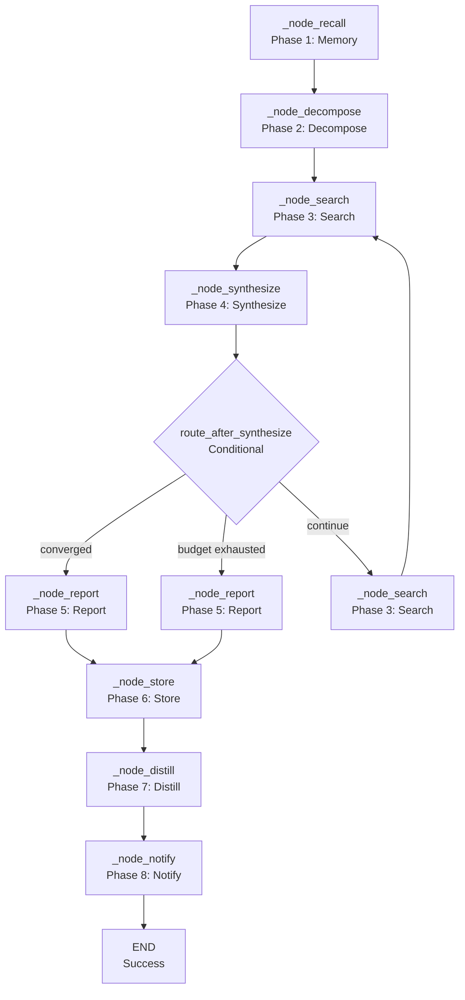

# 🔬 Deep Research Workflow

The `deep_research` workflow performs **iterative, deep research** on a topic. It uses a cyclic LangGraph workflow to search, synthesize, and evaluate until the research converges or the budget is exhausted.

**Key characteristics:**
- **Iterative search** — Cycles between search, synthesis, and evaluation until convergence
- **Budget management** — Tracks API calls and browser actions to prevent runaway costs
- **Convergence detection** — Uses cosine similarity to detect when new information stops adding value
- **Multi-tool search** — Uses Tavily API, web search, and browser fallback for comprehensive coverage
- **Memory integration** — Recalls past research for context and stores results for future recall
- **Report generation** — Generates a structured report with the final synthesis

---

## 🚀 Quick Start

```python
from workflows.base import run_workflow

# Deep research on a topic
result = run_workflow(
    workflow_type="deep_research",
    goal="What are the latest advancements in quantum computing error correction?",
    trace_id="deep_research_001",
)

print(result["status"])  # "success" | "failed" | "incomplete"
print(result["result"])  # "Quantum computing error correction has seen..."
```

---

## 🏗️ Architecture

```text
workflows/deep_research.py
├── run_deep_research()               # Sync facade (entry point)
│   ├── ThreadPoolExecutor(max_workers=1)
│   └── run_workflow()                # Dispatcher

workflows/deep_research_impl/
├── graph.py                          # LangGraph builder
│   ├── _node_recall()                # Phase 1: Memory recall
│   ├── _node_decompose()             # Phase 2: Goal decomposition
│   ├── _node_search()                # Phase 3: Multi-tool search
│   ├── _node_synthesize()            # Phase 4: Synthesis + evaluation
│   ├── _node_report()                # Phase 5: Report generation
│   ├── _node_store()                 # Phase 6: Memory storage
│   ├── _node_distill()               # Phase 7: Distillation (placeholder)
│   └── _node_notify()                # Phase 8: Notify user
├── state.py                          # DeepResearchState TypedDict
├── routes.py                         # Conditional routing logic
├── budget.py                         # Budget tracking and audit
├── constants.py                      # Shared constants and prompts
└── nodes/
    ├── decompose.py                  # Goal decomposition logic
    ├── search.py                     # Multi-tool search logic
    └── synthesize.py               # Synthesis + evaluation logic
```

### Deep Research Flow



**Key design decisions:**
- **Cyclic workflow** — The workflow loops between search and synthesis until convergence or budget exhaustion. This is the core innovation of deep research.
- **Convergence detection** — Uses cosine similarity between the previous and current knowledge base. If similarity exceeds `CONVERGENCE_SIMILARITY_THRESHOLD` (0.85), the workflow converges.
- **Budget tracking** — Tracks API calls (Tavily) and browser actions separately. Prevents runaway costs.
- **Multi-tool search** — Three-tier tool selection: Tavily API → web search → browser fallback. Each tier has different cost and coverage characteristics.
- **Goal decomposition** — The planner LLM breaks the goal into sub-queries for parallel search. This improves coverage.
- **Evaluation** — The executor LLM evaluates the synthesis quality and completeness. This provides a stopping criterion.
- **Memory recall** — Recalls past research for context. This prevents redundant research.
- **Report generation** — Generates a structured report with the final synthesis, sources, and metadata.

---

## 📝 Node Reference

### `_node_recall(state)` — Phase 1: Memory Recall

**Purpose:** Recall relevant past research from memory.

**Logic:**
```python
memory.recall(
    query=goal,
    limit=5,
    trace_id=state["trace_id"],
)
```

**Output:** Partial dict with `memory_context`.

**Error handling:** If memory recall fails, returns `{"memory_context": ""}`. The workflow proceeds without context.

### `_node_decompose(state)` — Phase 2: Goal Decomposition

**Purpose:** Break the goal into sub-queries for parallel search.

**Logic:**
1. Build prompt with goal, memory context, and current findings
2. Call `llm.complete(role="planner", ...)` for decomposition
3. Parse sub-queries from JSON or bullet list

**Output:** Partial dict with `queries` (list of sub-query strings).

**Error handling:**
- LLM failure → returns `{"queries": [goal]}` (fallback to single query)
- Parse failure → returns `{"queries": [goal]}` (fallback to single query)

**Note:** The `_parse_sub_queries` regex has a fragile character class: `r'[\-*•]'`. The `\` escape before `*` is unnecessary and may emit a `SyntaxWarning`.

**Note:** JSON parsing doesn't handle trailing commas. LLMs sometimes output `["query1", "query2",]` which `json.loads` rejects.

### `_node_search(state)` — Phase 3: Multi-Tool Search

**Purpose:** Search for information using multiple tools.

**Logic:**
1. For each sub-query:
   - Select tool: Tavily API (if budget allows) → web search → browser fallback
   - Execute search
   - Extract evidence (top 3 results per query)
   - Summarize evidence
2. Update budget tracking

**Output:** Partial dict with `extracted_evidence`, `seen_urls`, `budget_api_calls`, `budget_browser_actions`.

**Error handling:**
- Individual search failures are logged but don't fail the workflow
- Budget exhaustion stops the search loop
- Browser fallback failures are logged but don't fail the workflow

**Critical bug:** API budget is decremented for ALL successful searches, including web searches (which don't consume Tavily API calls). Only Tavily searches should decrement the API budget.

**Critical bug:** API budget is NOT decremented for failed Tavily searches. The API call was made (and consumed) but the budget doesn't reflect it.

**Note:** `max_results=5` is hardcoded for search queries. Not configurable.

**Note:** `_is_js_wall` uses hardcoded indicators instead of `JS_HEAVY_HINTS` from `constants.py`. Dead code.

### `_node_synthesize(state)` — Phase 4: Synthesis + Evaluation

**Purpose:** Synthesize evidence and evaluate completeness.

**Logic:**
1. Build prompt with goal, evidence, and previous knowledge
2. Call `agent(action="dispatch", role="research", ...)` for synthesis
3. Parse synthesis and score from JSON
4. Call `agent(action="dispatch", role="executor", ...)` for evaluation
5. Parse evaluation score
6. Determine convergence

**Output:** Partial dict with `knowledge_base`, `_prev_knowledge`, `completeness`, `extracted_evidence`, `converged`, `synthesis`.

**Critical bug:** `agent()` calls are missing `action="dispatch"`. The `agent()` facade requires `action`.

**Critical bug:** `_agent_ok` and `_agent_text` are defensive wrappers for `LLMResponse` objects, but `agent()` returns `dict`. These wrappers are dead code.

**Critical bug:** `task` parameter is used for the system prompt, not the user task. The `agent()` facade passes `task` to `llm.complete(user=task)`. But here `SYNTHESIZE_SYSTEM_PROMPT` is passed as the user message, and the role's system prompt is ignored. This is semantically wrong.

**Bug:** `completeness_threshold` default is `0.85` in code but `85.0` in `.env`. The node and route use different scales. The `_parse_score` returns 0-100, but `completeness_threshold` from state defaults to `0.85` (from node fallback). The route checks `completeness >= threshold` which is always true for any score >= 1.

**Bug:** `_parse_score` removes negative numbers with `re.sub(r"-\d+", "", text)`. This removes ALL negative numbers, including legitimate ones in ranges like "score: 85-90" which becomes "score: 90".

### `route_after_synthesize(state)` — Conditional Router

**Purpose:** Route to report, search, or END based on synthesis result.

**Logic:**
```python
converged = _is_converged(prev_knowledge, knowledge_base, CONVERGENCE_SIMILARITY_THRESHOLD)
if converged:
    return "converged"  # → _node_report
if is_budget_exhausted(state):
    return "budget_exhausted"  # → _node_report
return "continue"  # → _node_search
```

**Output:** String literal `"converged"`, `"budget_exhausted"`, or `"continue"`.

**Note:** `converged` is recomputed in the route, not taken from state. The `synthesize` node already computes it. This is redundant and could diverge if the threshold changes.

### `_node_report(state)` — Phase 5: Report Generation

**Purpose:** Generate a structured report with the final synthesis.

**Logic:**
1. Call `report(action="report", title=..., data=..., config=...)` with synthesis and sources
2. Return the report

**Output:** Partial dict with `report_html` and `report_path`.

**Note:** If both `knowledge_base` and `synthesis` are empty, `report` is `""` and `status` is `"incomplete"`. The user gets an empty report with `"incomplete"` status — confusing.

### `_node_store(state)` — Phase 6: Memory Storage

**Purpose:** Store the research result in memory.

**Logic:**
1. Store semantic memory: `memory.store_semantic(text=result[:800], ...)`

**Output:** Empty dict (side effects only).

**Note:** Only 800 chars of the result are stored in semantic memory. For long research results, this is a tiny fraction.

### `_node_distill(state)` — Phase 7: Distillation

**Purpose:** Extract procedural knowledge from the research result.

**Logic:**
Placeholder — returns state unchanged. Not wired in v1.

**Output:** State dict (unchanged).

### `_node_notify(state)` — Phase 8: User Notification

**Purpose:** Notify the user of completion.

**Logic:**
1. Call `notify(action="notify", message=...)` with the result
2. Return `node_done(state, result=...)`

**Output:** `node_done` result dict.

---

## ⚙️ Configuration

```ini
# .env
DEEP_RESEARCH_MAX_API_CALLS=15          # Max Tavily API calls per run
DEEP_RESEARCH_MAX_BROWSER_ACTIONS=10   # Max browser actions per run
DEEP_RESEARCH_CONVERGENCE_THRESHOLD=0.85 # Convergence similarity threshold (0-1)
DEEP_RESEARCH_TIMEOUT_SECONDS=300       # Workflow timeout (seconds)
```

```python
# core/config.py
cfg.deep_research_max_api_calls = 15      # Max Tavily API calls per run
cfg.deep_research_max_browser_actions = 10 # Max browser actions per run
cfg.deep_research_convergence_threshold = 0.85 # Convergence similarity threshold (0-1)
cfg.deep_research_timeout_seconds = 300    # Workflow timeout (seconds)
```

---

## 📤 Output

The workflow returns a `dict`:

```json
{
  "status": "success",
  "result": "Quantum computing error correction has seen...",
  "error": "",
  "artifacts": ["report.html"]
}
```

**Incomplete (budget exhausted):**
```json
{
  "status": "incomplete",
  "result": "Partial research: Quantum computing error correction...",
  "error": "",
  "artifacts": ["report.html"]
}
```

**Failure:**
```json
{
  "status": "failed",
  "result": "",
  "error": "Deep research failed: timeout",
  "artifacts": []
}
```

---

## 🔄 When to Use vs Alternatives

| Need | Tool | Why |
|------|------|-----|
| Deep research on a topic | `deep_research` workflow | Iterative search with convergence detection |
| Quick research | `research` workflow | Single-pass search + synthesis, faster |
| Analyze data | `data` workflow | Code generation + execution, data analysis |
| Fix code | `autocode` workflow | Targeted code changes with test verification |
| Understand codebase | `understand` workflow | Static analysis, dependency graph |
| Generate report | `report` workflow | Structured report generation |

---

## 🧪 Testing

```powershell
# Run deep research tests
D:\mcp\agent\venv\Scripts\pytest.exe tests/workflows/deep_research/test_deep_research.py -W error --tb=short -v
```

**Mock strategy:**
- Patch `llm.complete(role="planner")` for decomposition
- Patch `agent(action="dispatch", role="research")` for synthesis
- Patch `agent(action="dispatch", role="executor")` for evaluation
- Patch `web(action="search")` and `web(action="read")` for search
- Patch `browser(action="navigate")` and `browser(action="text_content")` for browser fallback
- Patch `memory.recall()` and `memory.store_semantic()` for memory operations
- Patch `report(action="report")` for report generation
- Patch `notify(action="notify")` for notification
- Test convergence detection with similar knowledge bases → assert `"converged"` route
- Test budget exhaustion → assert `"budget_exhausted"` route
- Test `node_search` with Tavily failure → assert web fallback
- Test `node_search` with browser fallback → assert text extraction

**Current test layout:**
```text
tests/workflows/deep_research/
└── test_deep_research.py  # Full workflow test
```

> **Future:** Split into per-node files: `test_node_recall.py`, `test_node_decompose.py`, `test_node_search.py`, `test_node_synthesize.py`, `test_node_report.py`, `test_node_store.py`, `test_node_distill.py`, `test_node_notify.py`, plus `conftest.py`.

---

## 🗺️ Roadmap

### ✅ Completed

| Feature | Status | Notes |
|---------|--------|-------|
| Cyclic LangGraph workflow | ✅ v1.0 | Search → synthesize → evaluate → loop until convergence |
| Budget management | ✅ v1.0 | API calls + browser actions tracked separately |
| Convergence detection | ✅ v1.0 | Cosine similarity between knowledge bases |
| Multi-tool search | ✅ v1.0 | Tavily → web → browser fallback |
| Goal decomposition | ✅ v1.0 | Planner LLM breaks goal into sub-queries |
| Evaluation | ✅ v1.0 | Executor LLM evaluates synthesis quality |
| Memory integration | ✅ v1.0 | Recall + store for context and future use |
| Report generation | ✅ v1.0 | Structured report with synthesis and sources |

### 🔄 In Progress / Next Up

| # | Feature | Notes | Priority |
|---|---------|-------|----------|
| 1 | **Fix `agent()` missing `action="dispatch"` in `node_synthesize` and `node_evaluate`** | `agent()` requires `action` parameter. Without it, returns error dict. | P0 |
| 2 | **Fix `task` parameter used for system prompt in `agent()` calls** | `task` is passed to `llm.complete(user=task)`. System prompt should be separate. | P0 |
| 3 | **Fix API budget decremented for web searches** | `node_search` decrements `budget_api_calls` for ALL successful searches, including web. Only Tavily should decrement. | P0 |
| 4 | **Fix API budget NOT decremented for failed Tavily searches** | Failed Tavily calls still consume API budget. Not reflected in tracking. | P0 |
| 5 | **Fix `completeness_threshold` scale mismatch** | Node defaults to `0.85` (0-1), route and `.env` use `85.0` (0-100). Route check always true for score >= 1. | P0 |
| 6 | **Remove `_agent_ok` and `_agent_text` dead code** | `agent()` returns `dict`, not `LLMResponse`. Wrappers are unnecessary. | P1 |
| 7 | **Fix `**state` spreading in graph nodes** | All nodes return `{**state, ...}`. Should return partial dicts. | P1 |
| 8 | **Fix memory failure silent in `_node_recall`** | Exception caught, returns empty context. No trace step, no error log. | P1 |
| 9 | **Fix `_node_report` empty report not handled** | Empty `knowledge_base` + `synthesis` produces empty report with `"incomplete"` status. | P1 |
| 10 | **Fix `_node_store` only storing 800 chars** | Long research results truncated. Semantic memory nearly useless. | P1 |
| 11 | **Fix `route_after_synthesize` recomputing `converged`** | Already computed in `node_synthesize`. Redundant and may diverge. | P1 |
| 12 | **Remove `format_audit` dead code** | Function exists but never called. | P3 |
| 13 | **Remove `JS_HEAVY_HINTS` dead code** | Defined in `constants.py` but never used. `search.py` uses hardcoded indicators. | P2 |
| 14 | **Fix `_parse_sub_queries` regex fragility** | Character class `r'[\-*•]'` has unnecessary escape. May emit `SyntaxWarning`. | P1 |
| 15 | **Fix `_parse_sub_queries` trailing comma handling** | LLMs may output trailing commas in JSON. `json.loads` rejects them. | P1 |
| 16 | **Fix `node_search` hardcoded `max_results=5`** | Should be configurable via `.env`. | P2 |
| 17 | **Fix `node_search` not filtering empty queries** | Empty strings in `queries` cause searches for `""`. | P2 |
| 18 | **Fix `_summarize_evidence` bypassing role config** | Uses custom system prompt instead of role's configured prompt. | P2 |
| 19 | **Fix `_extract_evidence` hardcoded top 3** | Should be configurable. | P2 |
| 20 | **Fix `_parse_score` removing negative numbers incorrectly** | `re.sub(r"-\d+", "", text)` removes numbers from ranges like "85-90". | P1 |
| 21 | **Fix `_cap_knowledge` may exceed max after prefix** | Truncation + prefix may exceed `max_chars`. | P2 |
| 22 | **Add `synthesis` field to `DeepResearchState`** | Field returned by `node_synthesize` but not declared in TypedDict. | P3 |
| 23 | **Test restructure** | Split `test_deep_research.py` into per-node files + `conftest.py` | P1 |
| 24 | **Configurable convergence threshold** | Make `CONVERGENCE_SIMILARITY_THRESHOLD` actually use `.env` value | P2 |
| 25 | **Streaming synthesis** | Stream synthesis output for real-time feedback | P3 |

### 🚫 Deferred / Out of Scope

| # | Feature | Why Deferred | Priority |
|---|---------|------------|----------|
| 1 | **Remove cyclic workflow** | Single-pass research would miss important information. Iteration is essential. | Skip |
| 2 | **Remove budget management** | Budget tracking prevents runaway costs. Removing it would risk excessive API usage. | Skip |
| 3 | **Remove convergence detection** | Without convergence detection, the workflow would run indefinitely or stop prematurely. | Skip |
| 4 | **Remove multi-tool search** | Single-tool search would have limited coverage. Multi-tool is essential. | Skip |
| 5 | **Real-time collaboration** | Multi-user research would require complex state synchronization. Out of scope. | Skip |

---

## 🛡️ AI Agent Instructions

### NEVER DO
1. **Never mutate state in-place** — Always return partial update `dict`s.
2. **Never spread `**state`** — Never return `{**state, "key": "value"}`. Return only the changed keys.
3. **Never remove budget management** — Budget tracking prevents runaway costs.
4. **Never remove convergence detection** — Without it, the workflow would run indefinitely.
5. **Never use `print()` to stdout** — MCP stdio corruption. Use `tracer.step()` for logging.
6. **Never create `.bak` files** — forbidden by project rules.
7. **Never rewrite the entire file** — surgical edits only. Preserve existing code exactly.
8. **Never skip `compileall` before `pytest`** — catches syntax errors early.
9. **Never call `agent()` without `action="dispatch"`** — The `agent()` facade requires `action`. Always pass `action="dispatch"` for LLM calls.
10. **Never use `task` parameter for system prompts** — `task` is the user message. Use role's `system_prompt` or add `system` parameter to `agent()`.
11. **Never return `None` from LangGraph nodes** — Always return a `dict` (even empty `{}`).

### ALWAYS DO
12. **Always return `dict` from nodes** — Not `WorkflowState`. Partial updates only.
13. **Always pass `trace_id` to tracer calls** — Observability requires trace correlation.
14. **Always handle search failure gracefully** — Individual search failures should not fail the workflow.
15. **Always test `route_after_synthesize` with all paths** — Assert `"converged"`, `"budget_exhausted"`, and `"continue"`.
16. **Always test budget exhaustion** — Assert workflow stops when budget is exhausted.
17. **Always test convergence detection** — Assert workflow stops when knowledge converges.
18. **Always test multi-tool fallback** — Assert Tavily → web → browser fallback chain.
19. **Always update this doc** when adding nodes, changing routing logic, or modifying error handling.
20. **Always use `llm.complete()` directly for custom system prompts** — `agent()` uses role's system prompt. Bypass for custom prompts.

---

## 🔗 Source Code Reference

| File | Purpose |
|------|---------|
| `workflows/deep_research.py` | `run_deep_research()` — sync facade with ThreadPoolExecutor |
| `workflows/deep_research_impl/graph.py` | `build_deep_research_graph()` — 8-node LangGraph StateGraph |
| `workflows/deep_research_impl/state.py` | `DeepResearchState` — extended TypedDict with budget fields |
| `workflows/deep_research_impl/routes.py` | `route_after_synthesize()` — conditional routing logic |
| `workflows/deep_research_impl/budget.py` | `decrement_api_calls()`, `decrement_browser_actions()`, `is_budget_exhausted()` — budget tracking |
| `workflows/deep_research_impl/constants.py` | `SYNTHESIZE_SYSTEM_PROMPT`, `EVALUATE_SYSTEM_PROMPT`, `CONVERGENCE_SIMILARITY_THRESHOLD` — shared constants |
| `workflows/deep_research_impl/nodes/decompose.py` | `node_decompose_goal()` — goal decomposition |
| `workflows/deep_research_impl/nodes/search.py` | `node_search()` — multi-tool search |
| `workflows/deep_research_impl/nodes/synthesize.py` | `node_synthesize()` — synthesis + evaluation |
| `workflows/base.py` | `WorkflowState`, `node_step()`, `node_error()`, `node_done()` — shared infrastructure |
| `tools/agent.py` | `agent(action="dispatch", role="research")` — synthesis |
| `tools/agent.py` | `agent(action="dispatch", role="executor")` — evaluation |
| `tools/web.py` | `web(action="search", query=...)` — web search |
| `tools/web.py` | `web(action="read", url=...)` — web scraping |
| `tools/browser.py` | `browser(action="navigate", url=...)` — browser fallback |
| `tools/memory.py` | `memory.recall()`, `memory.store_semantic()` — memory operations |
| `tools/notify.py` | `notify(action="notify", message=...)` — user notification |
| `tools/report.py` | `report(action="report", title=...)` — report generation |
| `core/config.py` | `cfg.deep_research_max_api_calls`, `cfg.deep_research_max_browser_actions`, `cfg.deep_research_convergence_threshold` — config |
| `tests/workflows/deep_research/test_deep_research.py` | Full workflow test |

---

*Architecture: 8-node cyclic LangGraph StateGraph (recall → decompose → search → synthesize → evaluate → loop/report → store → distill → notify) with budget management, convergence detection, multi-tool search, and memory integration.*
