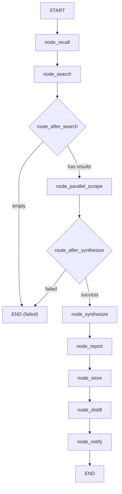

# 🔬 Research Workflow

The `research` workflow is the agent's end-to-end research pipeline. It takes a user query, discovers information via web search, extracts and summarizes content, generates a structured report, stores findings in memory, and notifies the user.

**Key characteristics:**
- **LangGraph StateGraph** — 8 nodes with conditional edges, fully checkpointed
- **Parallel extraction** — `ThreadPoolExecutor` scrapes multiple URLs concurrently
- **Browser fallback** — JS-heavy pages automatically retried with `browser(navigate + text_content)`
- **LLM synthesis** — Scraped summaries + memory context synthesized by `agent(role="research")`
- **Citation tracking** — All sources tracked via `core.citations`
- **Memory integration** — Results stored in episodic, semantic, and procedural memory
- **Nested-call guard** — `threading.local()` prevents `parallel → parallel` deadlock

---

## 🚀 Quick Start

```python
from workflows.base import run_workflow

result = run_workflow(
    workflow_type="research",
    goal="What are the best practices for ChromaDB in production?",
)
print(result["result"])
```

---

## 🏗️ Architecture

```text
workflows/research.py
├── build_research_graph()              # StateGraph builder, 8 nodes + conditional edges
├── WorkflowState (TypedDict)           # State schema
│   ├── goal, trace_id, query
│   ├── search_results, urls_data
│   ├── summaries, citations
│   ├── report_html, report_path
│   └── status, error
│
├── Nodes (in execution order):
│   ├── node_recall                     # Memory recall: episodic + semantic
│   ├── node_search                     # SearXNG search via web(action="search")
│   ├── node_parallel_scrape            # ThreadPoolExecutor + web(read) + LLM summarize + browser fallback
│   ├── node_synthesize                 # Aggregate summaries + memory into coherent report via agent(role="research")
│   ├── node_report                     # Generate HTML report via report tool
│   ├── node_store                      # Store findings in ChromaDB memory
│   ├── node_distill                    # Procedural memory extraction
│   └── node_notify                     # Send notification via notify tool
│
├── Worker functions:
│   ├── _scrape_and_summarize()        # web(read) → LLM summarize (parallel pool)
│   └── _browser_fallback_scrape()     # browser(navigate+text_content) → LLM summarize (sequential)
│
└── Conditional edges:
    ├── route_after_search → synthesize | failed
    └── route_after_synthesize → report | failed
```

### Execution Flow



**Key design decisions:**
- **Two-phase scraping** — Phase 1: parallel `web(read)` for all URLs. Phase 2: sequential `browser(navigate+text_content)` only for URLs where `web(read)` returned `< 300` chars. Browser is NOT_PARALLEL_SAFE, so fallback runs outside the thread pool.
- **Nested-call guard** — `_parallel_scrape_active` (threading.local) prevents deadlock if a worker thread triggers another `node_parallel_scrape` (e.g., via autocode tool invocation).
- **Inference slot management** — LLM summarization inside workers uses `tracker.inference_slot(timeout=30.0)` to respect `cfg.max_concurrent_inferences`.
- **Dossier truncation** — After scraping, the combined dossier is hard-capped to `cfg.web_max_text_chars * 2` chars, cut at paragraph boundaries to preserve markdown structure.
- **Citation registration** — Successful scrapes (web or browser) register citations via `citations.add(tid, url, title, snippet)` for downstream report generation.
- **Best-effort nodes** — `node_report`, `node_distill`, and `node_notify` catch exceptions and continue. The workflow never fails because of a report generation or distillation error.
- **Synthesis via agent facade** — `node_synthesize` delegates to `agent(role="research", task=..., content=...)` instead of direct `llm.complete()`. This gives the research role its own model config, timeout, and system prompt.

---

## 📝 Workflow State

```python
class WorkflowState(TypedDict, total=False):
    goal: str              # Original user query
    trace_id: str          # Trace identifier
    query: str             # Refined search query (unused — goal is used directly)
    search_results: str    # Raw SearXNG results (JSON string) or synthesized dossier (after scrape)
    urls_data: list        # URLs selected for scraping (unused — parsed from search_results JSON)
    summaries: list        # LLM summaries per page (unused — inlined into dossier)
    citations: list        # Tracked citations (unused — stored in core.citations singleton)
    report_html: str       # Generated HTML report (unused — report tool handles output)
    report_path: str       # Path to saved report (unused — report tool handles output)
    status: str            # "pending" | "running" | "complete" | "error" | "failed"
    error: str             # Error message if failed
    result: str            # Final synthesized text (set by node_synthesize, returned by node_notify)
    memory_context: str    # Recalled memory context (set by node_recall, used by node_synthesize)
```

> **Note:** Several fields (`query`, `urls_data`, `summaries`, `citations`, `report_html`, `report_path`) are declared in the TypedDict but not actively used in the current implementation. The workflow uses `search_results` as a polymorphic field (JSON string after search, markdown dossier after scrape).

---

## ⚡ Nodes

### `node_recall` — Memory Recall

Queries ChromaDB memory collections before searching:
- **Episodic:** "Have I researched this topic before?"
- **Semantic:** "What do I know about this topic?"

Results injected into `WorkflowState["memory_context"]` as context for downstream nodes.

```python
memory.recall(query=goal, top_k=5, trace_id=state.get("trace_id", ""))
```

**Output:** `"memory_context"` — formatted string of recalled memories with type and score.

### `node_search` — URL Discovery

Calls `web(action="search", query=goal, max_results=3)` to get ranked URLs from SearXNG.

**Output:** `"search_results"` — JSON string of `{url, title, snippet}` dicts.

**Error handling:** If search fails or returns no valid URLs, `search_results` is set to `""` and the router routes to `failed`.

### `node_parallel_scrape` — Concurrent Extraction + Browser Fallback

The most complex node. Two-phase scraping with parallel web scraping and sequential browser fallback.

**Phase 1: Parallel Web Scraping**

Uses `ThreadPoolExecutor(max_workers=cfg.max_concurrent_workers)` to process each URL:

```python
def _scrape_and_summarize(url, title, goal, trace_id):
    # 1. Scrape via web(read)
    result = web(action="read", url=url)
    if result.status != "success":
        return {"status": "failed", "error": ...}

    text = result["data"]["text"]
    if len(text) < 300:
        return {"status": "needs_browser", ...}  # Mark for Phase 2

    text = text[:cfg.web_max_text_chars]  # Truncate

    # 2. Summarize via LLM (with inference slot)
    with tracker.inference_slot(timeout=30.0):
        resp = llm.complete(role="executor", system=..., user=...)

    return {"status": "success", "summary": resp.text}
```

**Phase 2: Sequential Browser Fallback**

For URLs marked `"needs_browser"`, runs sequentially (respects browser's global lock):

```python
def _browser_fallback_scrape(url, title, goal, trace_id):
    fallback_tid = trace_id or f"fb_{uuid.uuid4().hex[:8]}"

    # Navigate
    browser(action="navigate", url=url, trace_id=fallback_tid, 
            timeout=cfg.research_browser_fallback_timeout)

    # Extract text
    browser(action="text_content", selector="body", trace_id=fallback_tid,
            timeout=cfg.research_browser_fallback_timeout)

    # Summarize (same as Phase 1)
    ...
```

**Dossier assembly:**

Successful scrapes are assembled into a markdown dossier:
```markdown
### [Source 1] Page Title
URL: https://...

Summary text...

### [Source 2] Page Title
URL: https://...

Summary text...
```

**Dossier truncation:** Hard-capped to `cfg.web_max_text_chars * 2` chars, cut at paragraph boundaries.

**Output:** `"search_results"` — markdown dossier string (overwrites the JSON from `node_search`).

### `node_synthesize` — Report Generation

Aggregates dossier + memory context into a coherent answer via `agent(role="research")`:

```python
agent(
    role="research",
    task=f"Synthesise the provided sources to answer: {goal}",
    content=f"MEMORY:
{memory_context}

WEB SOURCES:
{search_results}",
    trace_id=state.get("trace_id", ""),
)
```

**Output:** `"result"` — synthesized markdown text.

### `node_report` — HTML Export

Calls `report(action="report", ...)` to generate a self-contained HTML dashboard with findings and citations.

**Output:** Side effect — report saved to workspace. No state mutation.

### `node_store` — Memory Persistence

Stores findings in ChromaDB:
- **Semantic:** `memory.store_semantic(text=f"Research on '{goal}':\n{result[:800]}", importance=6, ...)`
- **Episodic:** `memory.store_episodic(text=f"Completed research workflow: '{goal[:60]}'", importance=5, ...)`

**Output:** Side effect — memory entries created. No state mutation.

### `node_distill` — Procedural Learning

Extracts reusable workflow patterns via `distill_workflow()`:
- "For technical topics, prefer official documentation over blogs"
- "For recent events, prioritize news sources < 7 days old"

**Output:** Side effect — procedural rules stored. No state mutation. Never fails the workflow.

### `node_notify` — User Notification

Calls `notify(action="send", title="Research complete", message=...)` and marks workflow done.

**Output:** `node_done(state, result=..., artifacts=[...])`

---

## 🔄 Conditional Routing

### `route_after_search`

```python
def route_after_search(state):
    sr = state.get("search_results", "")
    mc = state.get("memory_context", "")
    if not sr and not mc:
        return "failed"   # No search results and no memory context
    return "synthesize"   # Proceed to synthesis (even with empty results if memory exists)
```

### `route_after_synthesize`

```python
def route_after_synthesize(state):
    if state.get("status") == "failed":
        return "failed"
    return "report"
```

---

## ⚙️ Configuration

```ini
# .env
SEARXNG_URL=http://localhost:8080
WEB_MAX_SEARCH_RESULTS=10
WEB_MAX_TEXT_CHARS=8000
WEB_SNIPPET_CHARS=300
MAX_CONCURRENT_WORKERS=3
WORKER_TIMEOUT=60
WORKER_MAX_TOKENS=250
RESEARCH_BROWSER_FALLBACK_MAX=3
RESEARCH_BROWSER_FALLBACK_TIMEOUT=15
```

```python
# core/config.py
self.searxng_url = os.getenv("SEARXNG_URL", "http://localhost:8080")
self.web_max_text_chars = int(os.getenv("WEB_MAX_TEXT_CHARS", "8000"))
self.web_max_search_results = int(os.getenv("WEB_MAX_SEARCH_RESULTS", "10"))
self.web_snippet_chars = int(os.getenv("WEB_SNIPPET_CHARS", "300"))
self.max_concurrent_workers = int(os.getenv("MAX_CONCURRENT_WORKERS", "3"))
self.worker_timeout = int(os.getenv("WORKER_TIMEOUT", "60"))
self.worker_max_tokens = int(os.getenv("WORKER_MAX_TOKENS", "250"))
self.research_browser_fallback_max = int(os.getenv("RESEARCH_BROWSER_FALLBACK_MAX", "3"))
self.research_browser_fallback_timeout = int(os.getenv("RESEARCH_BROWSER_FALLBACK_TIMEOUT", "15"))
```

---

## 📤 Output

The workflow returns a `WorkflowState` dict. The final result is in `"result"`:

```json
{
  "status": "complete",
  "result": "Synthesized markdown report...",
  "goal": "What are the best practices for ChromaDB in production?",
  "trace_id": "abc123",
  "search_results": "### [Source 1] ...",
  "memory_context": "[episodic|score=0.8] ...",
  "error": ""
}
```

**Side effects:**
- HTML report saved to workspace via `report` tool
- Citations registered in `core.citations`
- Semantic + episodic memories stored in ChromaDB
- Procedural rules distilled (best-effort)
- Desktop notification sent (best-effort)

---

## 🔄 When to Use vs Alternatives

| Need | Workflow | Why |
|------|----------|-----|
| Quick fact-check | `research` | Single search + synthesis, 1-2 minutes |
| Comprehensive report | `research` | Parallel scrape + full synthesis + HTML report |
| Multi-step investigation | `deep_research` (future) | Iterative ReAct loop with evaluation |
| Academic research | `deep_research` (future) | Structured decomposition + evidence tracking |
| Real-time monitoring | `research` + cron | Scheduled execution with delta reporting |
| Single page read | `web(read)` | Faster, no LLM overhead |
| JS-heavy page | `browser(navigate+text_content)` | Direct browser control |
| AI-ranked search | `tavily(search)` | Better relevance, citations |

---

## 🧪 Testing

```powershell
# Run all research workflow tests
D:\mcp\agent\venv\Scripts\pytest.exe tests/workflows/research/ -W error --tb=short -v
```

**Test coverage (3 files):**

| File | Tests | Coverage |
|------|-------|----------|
| `test_research_flow.py` | — | Full workflow execution: recall → search → scrape → synthesize → report → store → distill → notify |
| `test_parallel_scrape.py` | — | ThreadPoolExecutor scraping, browser fallback, dossier assembly, truncation |
| `test_research_parallel.py` | — | Parallel execution edge cases, nested-call guard, timeout handling |

**Mock strategy:**
- Patch `tools.web.web` to return mock search/scrape results
- Patch `tools.browser.browser` to return mock navigate/text_content results
- Patch `core.llm.llm.complete` or `tools.agent.agent` to return deterministic summaries
- Patch `core.memory.memory.recall` / `.store_semantic` / `.store_episodic` for memory tests
- Patch `core.citations.citations.add` / `.get_sources` for citation tests
- Patch `tools.report.report` and `tools.notify.notify` for side-effect tests
- Patch `core.runtime.activity_tracker.tracker.inference_slot` for slot management tests
- Patch `workflows.research._parallel_scrape_active` for nested-call guard tests

**Current test layout:**
```text
tests/workflows/research/
├── __init__.py
├── test_research_flow.py       # End-to-end workflow tests
├── test_parallel_scrape.py     # Parallel scraping + browser fallback tests
└── test_research_parallel.py   # Parallel execution edge cases
```

> **Future:** When the workflow is refactored (e.g., `@meta_tool` on tools, node extraction), tests may be restructured to match `tests/workflows/` patterns or split by node.

---

## 🗺️ Roadmap

### ✅ Completed

| Feature | Status | Notes |
|---------|--------|-------|
| 8-node LangGraph pipeline | ✅ v1.0 | recall → search → scrape → synthesize → report → store → distill → notify |
| Parallel web scraping | ✅ v1.0 | `ThreadPoolExecutor` with `cfg.max_concurrent_workers` |
| LLM summarization per page | ✅ v1.0 | `llm.complete(role="executor")` with inference slot |
| Browser fallback for JS pages | ✅ v1.0 | Sequential `browser(navigate+text_content)` for `< 300` char pages |
| Nested-call guard | ✅ v1.0 | `threading.local()` prevents `parallel → parallel` deadlock |
| Citation tracking | ✅ v1.0 | `core.citations.add()` per successful scrape |
| Memory integration | ✅ v1.0 | Semantic + episodic storage |
| Procedural distillation | ✅ v1.0 | `distill_workflow()` best-effort |
| HTML report generation | ✅ v1.0 | `report` tool with sections + sources |
| Dossier truncation | ✅ v1.0 | Hard cap at `cfg.web_max_text_chars * 2`, paragraph-boundary cut |
| Synthesis via agent facade | ✅ v1.0 | `agent(role="research")` instead of direct `llm.complete()` |

### 🔄 In Progress / Next Up

| Feature | Notes | Priority |
|---------|-------|----------|
| `tavily(search)` as primary search | Use `tavily(action="search")` when `TAVILY_API_KEY` is configured; fallback to `web(search)` when keyless or tavily fails | P1 |
| `tavily(extract)` for bulk extraction | Use `tavily(action="extract")` for bulk URL extraction instead of parallel `web(read)` | P1 |
| Standardize `max_results` | Currently hardcoded `max_results=3` in `node_search`. Use `cfg.web_max_search_results` or add `RESEARCH_MAX_SEARCH_RESULTS` to `.env` | P2 |
| Tavily keyless graceful degradation | When Tavily is keyless, automatically fall back to `web(search)` without user intervention | P1 |
| Deduplicate URLs across sources | When using both `tavily` and `web`, deduplicate identical URLs before scraping | P2 |
| Streaming partial results | Show findings as they arrive instead of batch return at end | P2 |
| Configurable search result count | `node_search` hardcodes `max_results=3`. Make configurable via state or `.env` | P2 |
| Configurable dossier cap | Hard-coded `cfg.web_max_text_chars * 2`. Make configurable | P2 |
| Result quality scoring | Score each source by relevance and filter low-quality scrapes before synthesis | P2 |
| Multi-query expansion | Break complex goals into sub-queries, search each, merge results | P3 |
| Source reliability ranking | Prioritize `.edu`, `.gov`, official docs over blogs and forums | P3 |
| Citation format options | Support APA, MLA, IEEE citation formats in reports | P3 |

### 🚫 Deferred / Out of Scope

| # | Feature | Why Deferred | Priority |
|---|---------|------------|----------|
| 1 | **Replace with `deep_research` workflow** | `deep_research` is a separate workflow with iterative ReAct. `research` is the fast path for simple queries. Both coexist. | Skip |
| 2 | **Remove browser fallback** | Browser fallback is essential for JS-heavy sites. Removing it would break many real-world pages. | Skip |
| 3 | **Synchronous scraping only** | Parallel scraping is a core performance feature. Sequential-only would be 3-5x slower. | Skip |
| 4 | **Store full page text in memory** | Memory stores summaries only (first 800 chars). Full text would bloat ChromaDB. | Skip |
| 5 | **Real-time web search during synthesis** | Synthesis is a single LLM call. Interactive search would require a ReAct loop (deep_research territory). | Skip |

---

## 🛡️ AI Agent Instructions

### NEVER DO
1. **Never remove the nested-call guard** — `_parallel_scrape_active` prevents deadlock. Removing it risks hanging the workflow.
2. **Never call `browser` inside the thread pool** — Browser is NOT_PARALLEL_SAFE. Fallback must run sequentially after the pool closes.
3. **Never skip `tracker.inference_slot()` in workers** — Violates `cfg.max_concurrent_inferences` and can overwhelm the LLM backend.
4. **Never hardcode `max_results=3` in `node_search`** — It's currently hardcoded. Make it configurable instead of increasing the magic number.
5. **Never let `node_report`, `node_distill`, or `node_notify` fail the workflow** — These are best-effort. Catch exceptions and continue.
6. **Never create `.bak` files** — forbidden by project rules.
7. **Never rewrite the entire file** — surgical edits only. Preserve existing code exactly.
8. **Never print to stdout** — MCP stdio corruption. Use `node_step()` for logging.
9. **Never skip `compileall` before `pytest`** — catches syntax errors early.

### ALWAYS DO
10. **Always use `agent(role="research")` for synthesis** — Not direct `llm.complete()`. The research role has its own model config and timeout.
11. **Always truncate text before LLM summarization** — `text[:cfg.web_max_text_chars]` prevents context overflow.
12. **Always register citations for successful scrapes** — Both web and browser fallback paths must call `citations.add()`.
13. **Always use a stable `trace_id` for browser fallback** — `fallback_tid = trace_id or f"fb_{uuid.uuid4().hex[:8]}"` ensures `navigate` and `text_content` share the same browser context.
14. **Always test the nested-call guard** — Patch `_parallel_scrape_active.active = True` and assert the node returns early.
15. **Always test browser fallback path** — Mock `web(read)` to return `< 300` chars and assert `browser(navigate)` is called.
16. **Always test dossier truncation** — Create a dossier > `cfg.web_max_text_chars * 2` and assert it's cut at paragraph boundaries.
17. **Always update this doc** when adding nodes, changing routing logic, or modifying tool integrations.

---

## 🔗 Source Code Reference

| File | Purpose |
|------|---------|
| `workflows/research.py` | 8-node LangGraph workflow: recall, search, parallel_scrape, synthesize, report, store, distill, notify |
| `workflows/base.py` | `WorkflowState`, `run_workflow()`, `node_step()`, `node_error()`, `node_done()` |
| `tools/web.py` | `web(action="search")` and `web(action="read")` — URL discovery and scraping |
| `tools/browser.py` | `browser(action="navigate")` and `browser(action="text_content")` — JS fallback |
| `tools/agent.py` | `agent(role="research")` — synthesis facade |
| `tools/report.py` | `report(action="report")` — HTML report generation |
| `tools/notify.py` | `notify(action="send")` — completion notification |
| `core/citations.py` | `citations.add()` / `citations.get_sources()` — citation tracking |
| `core/memory.py` | `memory.recall()` / `.store_semantic()` / `.store_episodic()` — memory operations |
| `core/runtime/activity_tracker.py` | `tracker.inference_slot()` — concurrency limit enforcement |
| `core/config.py` | `cfg.web_max_text_chars`, `cfg.max_concurrent_workers`, `cfg.worker_timeout`, `cfg.research_browser_fallback_max`, etc. |
| `core/memory_backend/procedural/distill.py` | `distill_workflow()` — procedural rule extraction |
| `tests/workflows/research/test_research_flow.py` | End-to-end workflow tests |
| `tests/workflows/research/test_parallel_scrape.py` | Parallel scraping + browser fallback tests |
| `tests/workflows/research/test_research_parallel.py` | Parallel execution edge cases |

---

*Architecture: LangGraph StateGraph + 8 pure-function nodes + conditional routing + ThreadPoolExecutor parallel scraping + sequential browser fallback + inference slot management + citation tracking + memory storage + procedural distillation + best-effort reporting/notification.*
