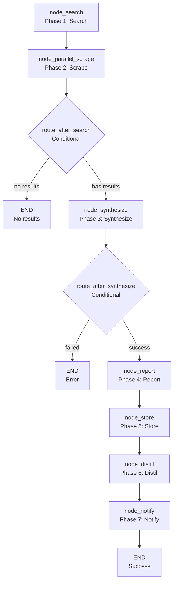

# 🔍 Research Workflow

The `research` workflow handles **web research and synthesis** tasks. It takes a natural language goal, searches the web for relevant information, scrapes the results, and synthesizes a comprehensive answer.

**Key characteristics:**
- **Web search first** — Searches the web for relevant sources
- **Parallel scraping** — Scrapes multiple sources concurrently for speed
- **Synthesis** — LLM synthesizes the scraped content into a coherent answer
- **Memory integration** — Stores the research result in memory for future recall
- **Citation tracking** — Tracks sources for attribution
- **Notification** — Reports completion to the user

---

## 🚀 Quick Start

```python
from workflows.base import run_workflow

# Basic research
result = run_workflow(
    workflow_type="research",
    goal="What are the best practices for ChromaDB in production?",
    trace_id="research_001",
)

print(result["status"])  # "success" | "failed"
print(result["result"])  # "ChromaDB best practices include..."
```

---

## 🏗️ Architecture

```text
workflows/research.py
├── build_research_graph()              # 8-node LangGraph StateGraph
│   ├── node_search()                   # Phase 1: Web search
│   ├── node_parallel_scrape()          # Phase 2: Parallel scraping
│   ├── route_after_search()            # Conditional: no results → END
│   ├── node_synthesize()               # Phase 3: LLM synthesis
│   ├── route_after_synthesize()        # Conditional: failed → END
│   ├── node_report()                   # Phase 4: Generate report
│   ├── node_store()                    # Phase 5: Store in memory
│   ├── node_distill()                  # Phase 6: Distill to procedural memory
│   └── node_notify()                   # Phase 7: Notify user
```

### Research Flow



**Key design decisions:**
- **Parallel scraping** — Uses `ThreadPoolExecutor` with `max_workers=3` to scrape up to 3 sources concurrently. This reduces latency significantly compared to sequential scraping.
- **Timeout handling** — Each scrape has a 30-second timeout (web tool) + 30-second LLM summarization timeout. Total per-source timeout is 60 seconds.
- **Deduplication** — `seen_urls` prevents scraping the same URL twice across iterations.
- **Citation tracking** — The `citations` module tracks sources per trace_id. This enables attribution in the final report.
- **Memory storage** — The synthesized result is stored in semantic memory. The `node_distill` step extracts procedural knowledge (e.g., "how to research X") for future recall.
- **Report generation** — The `node_report` step generates a structured report with the synthesis, sources, and metadata.
- **No JSON parsing** — The synthesis role outputs markdown, not JSON. The workflow handles raw text.
- **Result compression** — The final result is compressed via `compress_result()` before being returned.

---

## 📝 Node Reference

### `node_search(state)` — Phase 1: Web Search

**Purpose:** Search the web for relevant sources.

**Logic:**
```python
web(action="search", query=goal, max_results=3)
```

**Output:** Partial dict with `urls_data` (list of `{url, title, snippet}`).

**Error handling:** If search fails, returns `{"urls_data": []}`. The workflow proceeds with empty results.

**Note:** `max_results=3` is hardcoded despite `cfg.web_max_search_results` defaulting to 10. This is a known limitation.

### `node_parallel_scrape(state)` — Phase 2: Parallel Scraping

**Purpose:** Scrape multiple sources concurrently.

**Logic:**
1. Filter out already-seen URLs
2. Spawn up to 3 concurrent workers via `ThreadPoolExecutor`
3. Each worker: `web(action="read", url=...)` → LLM summarize
4. Collect results, update `seen_urls`

**Output:** Partial dict with `summaries` (list of `{url, title, summary}`).

**Error handling:**
- Individual scrape failures are logged but don't fail the workflow
- Timeout failures are caught and skipped
- LLM summarization failures are caught and skipped

**Guard:** `_is_nested_parallel()` prevents recursive parallel scraping from worker threads. Uses `threading.local()` flag.

**Note:** The `as_completed` timeout is `cfg.worker_timeout + 30` (60 + 30 = 90s). This is the timeout for the **first** future to complete, not the total time. If the first future completes quickly, subsequent futures can hang indefinitely.

### `route_after_search(state)` — Conditional Router

**Purpose:** Route to synthesis or END based on search results.

**Logic:**
```python
if not state.get("urls_data"):
    return "no_results"  # → END
return "has_results"     # → node_synthesize
```

**Output:** String literal `"no_results"` or `"has_results"`.

### `node_synthesize(state)` — Phase 3: LLM Synthesis

**Purpose:** Synthesize scraped content into a coherent answer.

**Logic:**
1. Build prompt with goal and summaries
2. Call `agent(action="dispatch", role="research", task=...)` for synthesis
3. Return the synthesized text

**Output:** Partial dict with `result` (synthesis text).

**Error handling:**
- `agent()` failure → `node_error(state, "synthesize", ...)` → workflow ends

**Critical bug:** The status check is broken:
```python
if not r.get("status") == "success":  # BUG: always False!
```
This is `(not "success") == "success"` → `False == "success"` → `False`. The error path **never fires**.

**Fix:** `if r.get("status") != "success":`

### `route_after_synthesize(state)` — Conditional Router

**Purpose:** Route to report or END based on synthesis result.

**Logic:**
```python
if state.get("status") == "failed":
    return "failed"  # → END
return "success"     # → node_report
```

**Output:** String literal `"failed"` or `"success"`.

### `node_report(state)` — Phase 4: Generate Report

**Purpose:** Generate a structured report with synthesis, sources, and metadata.

**Logic:**
1. Call `report(action="report", title=..., data=..., config=...)` with synthesis and sources
2. Return the report

**Output:** Partial dict with `report_html` and `report_path`.

**Note:** The `report` tool's `action="report"` is the report action name (generates a single-scroll HTML report), not a mistake.

### `node_store(state)` — Phase 5: Memory Storage

**Purpose:** Store the research result in memory.

**Logic:**
1. Store semantic memory: `memory.store_semantic(text=result[:800], ...)`

**Output:** Empty dict (side effects only).

**Note:** Only 800 chars of the result are stored in semantic memory. For long research results, this is a tiny fraction. The semantic memory will be nearly useless for recall.

### `node_distill(state)` — Phase 6: Distill to Procedural Memory

**Purpose:** Extract procedural knowledge from the research result.

**Logic:**
1. Call `agent(action="dispatch", role="extract", task=...)` to extract procedural knowledge
2. Store procedural memory: `memory.store_procedural(text=..., ...)`

**Output:** Empty dict (side effects only).

**Note:** The `status` check `state.get("status") == "failed"` is redundant. `node_distill` only runs on success paths.

### `node_notify(state)` — Phase 7: User Notification

**Purpose:** Notify the user of completion.

**Logic:**
1. Call `notify(action="notify", message=...)` with the result
2. Return `node_done(state, result=...)`

**Output:** `node_done` result dict.

**Note:** `artifacts` contains `{"sources": sources}` but `artifacts` is documented as a list of strings. This breaks consumers that expect strings.

---

## ⚙️ Configuration

```ini
# .env — no research-specific env vars
# Uses shared config:
# cfg.web_max_search_results — default 10 (hardcoded to 3 in code)
# cfg.worker_timeout — default 60s
# cfg.research_timeout — for agent(role="research")
```

```python
# core/config.py
# No research-specific config. Uses:
# cfg.web_max_search_results — web search max results
# cfg.worker_timeout — worker thread timeout
# cfg.research_timeout — LLM research timeout
```

---

## 📤 Output

The workflow returns a `dict`:

```json
{
  "status": "success",
  "result": "ChromaDB best practices include...",
  "error": "",
  "artifacts": ["report.html"]
}
```

**Failure:**
```json
{
  "status": "failed",
  "result": "",
  "error": "Synthesis failed: timeout",
  "artifacts": []
}
```

---

## 🔄 When to Use vs Alternatives

| Need | Tool | Why |
|------|------|-----|
| Research a topic | `research` workflow | Web search + synthesis, comprehensive answer |
| Analyze data | `data` workflow | Code generation + execution, data analysis |
| Fix code | `autocode` workflow | Targeted code changes with test verification |
| Deep research | `deep_research` workflow | Iterative search with convergence detection |
| Understand codebase | `understand` workflow | Codebase analysis and dependency mapping |
| Generate report | `report` workflow | Structured report generation |

---

## 🧪 Testing

```powershell
# Run research workflow tests
D:\mcp\agent\venv\Scripts\pytest.exe tests/workflows/research/test_research_flow.py -W error --tb=short -v
```

**Mock strategy:**
- Patch `web(action="search")` for search results
- Patch `web(action="read")` for scrape results
- Patch `agent(action="dispatch", role="research")` for synthesis
- Patch `agent(action="dispatch", role="extract")` for distillation
- Patch `memory.store_semantic()` and `memory.store_procedural()` for memory storage
- Patch `notify(action="notify")` for notification
- Test `node_search` with empty results → assert `"no_results"` route
- Test `node_parallel_scrape` with timeout → assert graceful handling
- Test `node_synthesize` with `agent()` failure → assert error state
- Test `route_after_synthesize` with `"failed"` status → assert `"failed"` route

**Current test layout:**
```text
tests/workflows/research/
└── test_research_flow.py  # Full workflow test
```

> **Future:** Split into per-node files: `test_node_search.py`, `test_node_scrape.py`, `test_node_synthesize.py`, `test_node_report.py`, `test_node_store.py`, `test_node_distill.py`, `test_node_notify.py`, plus `conftest.py`.

---

## 🗺️ Roadmap

### ✅ Completed

| Feature | Status | Notes |
|---------|--------|-------|
| 8-node LangGraph pipeline | ✅ v1.0 | search → scrape → synthesize → report → store → distill → notify |
| Parallel scraping | ✅ v1.0 | ThreadPoolExecutor with max_workers=3 |
| Timeout handling | ✅ v1.0 | 30s scrape + 30s summarization per source |
| Deduplication | ✅ v1.0 | seen_urls prevents duplicate scraping |
| Citation tracking | ✅ v1.0 | citations module tracks sources per trace_id |
| Memory storage | ✅ v1.0 | Semantic + procedural memory storage |
| Report generation | ✅ v1.0 | Structured report with synthesis and sources |
| Result compression | ✅ v1.0 | compress_result() prevents oversized responses |

### 🔄 In Progress / Next Up

| # | Feature | Notes | Priority |
|---|---------|-------|----------|
| 1 | **Fix `agent()` missing `action="dispatch"` in `node_synthesize`** | `agent()` requires `action` parameter. Without it, returns error dict. | P0 |
| 2 | **Fix `not r.get("status") == "success"` always false** | `(not "success") == "success"` → `False`. Error path never fires. | P0 |
| 3 | **Fix `max_results=3` hardcoded in `node_search`** | Should use `cfg.web_max_search_results` (default 10). | P1 |
| 4 | **Fix `as_completed` timeout semantics** | Timeout is for first future, not total. Subsequent futures can hang. | P1 |
| 5 | **Add future cancellation on timeout** | Pending ThreadPoolExecutor futures keep running on timeout. | P1 |
| 6 | **Fix `report_tool` signature** | Verify `report()` tool signature matches usage. | P1 |
| 7 | **Fix semantic memory only storing 800 chars** | Long research results truncated. Semantic memory nearly useless. | P1 |
| 8 | **Remove redundant `status` check in `node_distill`** | `node_distill` only runs on success paths. Check is dead code. | P1 |
| 9 | **Fix nested-call guard** | `_is_nested_parallel()` guard is broken for worker thread recursion. | P2 |
| 10 | **Fix `artifacts` containing dict not strings** | `artifacts` should be list of strings. Passing dict breaks consumers. | P2 |
| 11 | **Fix dossier truncation splitting headers** | Truncation may cut `### [Source N]` headers in half. | P2 |
| 12 | **Add URL deduplication** | `node_search` may return duplicate URLs from different results. | P2 |
| 13 | **Add URL validation** | `r["url"]` could be `javascript:void(0)` or relative paths. | P3 |
| 14 | **Test restructure** | Split `test_research_flow.py` into per-node files + `conftest.py` | P1 |
| 15 | **Configurable search results** | Make `max_results` configurable via `.env` | P2 |
| 16 | **Streaming synthesis** | Stream synthesis output for real-time feedback | P3 |
| 17 | **Multi-language support** | Support non-English search and synthesis | P3 |

### 🚫 Deferred / Out of Scope

| # | Feature | Why Deferred | Priority |
|---|---------|------------|----------|
| 1 | **Remove parallel scraping** | Sequential scraping would be too slow. Parallel is essential. | Skip |
| 2 | **Remove citation tracking** | Attribution is important for trust. Removing it would degrade quality. | Skip |
| 3 | **Add real-time streaming** | Streaming would require WebSocket/SSE infrastructure. Out of scope. | Skip |
| 4 | **Support non-web sources** | The workflow is designed for web research. Other sources would require significant changes. | Skip |
| 5 | **Automatic fact-checking** | Fact-checking would require additional LLM calls and complex logic. Out of scope. | Skip |

---

## 🛡️ AI Agent Instructions

### NEVER DO
1. **Never mutate state in-place** — LangGraph does not deep-copy. Always return partial update `dict`s.
2. **Never spread `**state`** — Never return `{**state, "key": "value"}`. Return only the changed keys.
3. **Never remove parallel scraping** — Sequential scraping would be too slow.
4. **Never skip citation tracking** — Attribution is important for trust.
5. **Never use `print()` to stdout** — MCP stdio corruption. Use `tracer.step()` for logging.
6. **Never create `.bak` files** — forbidden by project rules.
7. **Never rewrite the entire file** — surgical edits only. Preserve existing code exactly.
8. **Never skip `compileall` before `pytest`** — catches syntax errors early.
9. **Never call `agent()` without `action="dispatch"`** — The `agent()` facade requires `action`. Always pass `action="dispatch"` for LLM calls.
10. **Never return `None` from LangGraph nodes** — Always return a `dict` (even empty `{}`).

### ALWAYS DO
11. **Always return `dict` from nodes** — Not `WorkflowState`. Partial updates only.
12. **Always pass `trace_id` to tracer calls** — Observability requires trace correlation.
13. **Always handle search failure gracefully** — Empty results should route to END, not crash.
14. **Always test `route_after_search` with both paths** — Assert `"no_results"` and `"has_results"`.
15. **Always test `route_after_synthesize` with both paths** — Assert `"failed"` and `"success"`.
16. **Always test memory storage** — Assert semantic + procedural memory stored correctly.
17. **Always test notification** — Assert `notify()` called with correct message.
18. **Always update this doc** when adding nodes, changing routing logic, or modifying error handling.
19. **Always use `!= "success"` not `not ... == "success"`** — The latter is always False due to operator precedence.

---

## 🔗 Source Code Reference

| File | Purpose |
|------|---------|
| `workflows/research.py` | `build_research_graph()` — 8-node LangGraph StateGraph for web research |
| `workflows/base.py` | `WorkflowState`, `node_step()`, `node_error()`, `node_done()` — shared infrastructure |
| `tools/agent.py` | `agent(action="dispatch", role="research")` — synthesis |
| `tools/agent.py` | `agent(action="dispatch", role="extract")` — distillation |
| `tools/web.py` | `web(action="search", query=...)` — web search |
| `tools/web.py` | `web(action="read", url=...)` — web scraping |
| `tools/memory.py` | `memory.store_semantic()`, `memory.store_procedural()` — memory operations |
| `tools/notify.py` | `notify(action="notify", message=...)` — user notification |
| `tools/report.py` | `report(action="report", title=...)` — report generation |
| `core/config.py` | `cfg.web_max_search_results`, `cfg.worker_timeout`, `cfg.research_timeout` — timeouts |
| `core/utils.py` | `compress_result()` — result compression |
| `tests/workflows/research/test_research_flow.py` | Full workflow test |

---

*Architecture: 8-node LangGraph pipeline (search → scrape → synthesize → report → store → distill → notify) with parallel scraping, citation tracking, memory integration, and result compression.*
