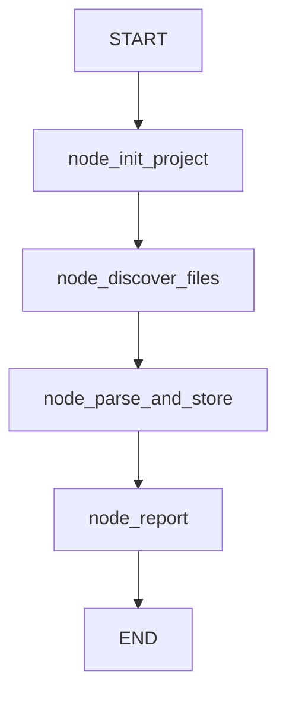

# 🧠 Understand Workflow

The `understand` workflow builds and maintains a **deterministic, local-first Codebase Knowledge Graph** for any Python project. It scans files, parses AST dependencies, and stores the graph in SQLite for fast structural queries.

**Key characteristics:**
- **AST-based dependency parsing** — Extracts imports and module references via Python AST (not regex)
- **Incremental indexing** — Only parses changed/new files (MD5 hash + mtime comparison)
- **Physical isolation** — Separate artifact directories for agent root vs workspace projects
- **Hybrid storage** — SQLite for graph topology, ChromaDB for semantic search (vectors only, no edges)
- **Async nodes** — All nodes are `async` with `asyncio.to_thread()` for I/O-bound operations
- **Batch processing** — Files parsed in batches of 10 with `asyncio.gather()`

---

## 🚀 Quick Start

```python
from workflows.understand import run_understand_workflow_sync

# Index the agent's own codebase
result = run_understand_workflow_sync("D:/mcp/agent", is_agent_root=True)
print(f"Parsed {result['files_parsed']} files, {result['edges_created']} edges")

# Index a workspace project
result = run_understand_workflow_sync("D:/mcp/agent/workspace/projects/my_project", is_agent_root=False)
```

**Via workflow runner:**
```python
from workflows.base import run_workflow

result = run_workflow(
    workflow_type="understand",
    goal="Build the knowledge graph for the codebase",
    project_root="D:/mcp/agent/workspace/projects/my_project",
)
```

---

## 🏗️ Architecture

```text
workflows/understand.py
├── run_understand_workflow_sync(project_path, is_agent_root)  # Sync facade: ThreadPoolExecutor + new event loop
├── run_understand_workflow(project_path, is_agent_root)       # Async entry: builds graph + ainvoke
├── build_understand_graph()                                    # StateGraph builder: 4 nodes + linear edges
├── _default_state(project_path, is_agent_root)                 # Initialize UnderstandState with ProjectManager
│
├── Nodes (in execution order):
│   ├── node_init_project          # ProjectManager init, size check, GraphStore creation
│   ├── node_discover_files        # os.walk scan, MD5/mtime comparison, changed file detection
│   ├── node_parse_and_store       # AST parse + SQLite upsert in batches of 10
│   └── node_report                # Generate HTML report via report tool
│
└── External:
    ├── core/kgraph/project.py     # ProjectManager: path resolution, size limits, artifact dirs
    ├── core/kgraph/storage.py     # GraphStore: SQLite CRUD for nodes/edges
    ├── core/kgraph/ast_parser.py  # parse_file_dependencies(): AST-based import extraction
    └── core/tracer.py             # tracer.new_trace() / .step() / .finish() / .error()
```

### Execution Flow



**Key design decisions:**
- **Sync facade with new event loop** — `run_understand_workflow_sync()` creates a new `asyncio` event loop in a `ThreadPoolExecutor` thread. Prevents `RuntimeError` when called from an already-running loop (e.g., FastAPI/FastMCP). This is the primary entry point.
- **Async nodes, sync I/O** — All nodes are `async def` but use `asyncio.to_thread()` for SQLite and filesystem operations. Keeps the event loop responsive but doesn't require async SQLite drivers.
- **Incremental via hash + mtime** — `node_discover_files` compares `md5(content)` + `st_mtime` + `st_size` against the SQLite `nodes` table. Only changed/new files are queued for parsing.
- **Batch size 10** — `node_parse_and_store` processes files in batches of 10 with `asyncio.gather()`. Prevents memory explosion on large codebases while keeping CPU utilization high.
- **AST parser returns raw deps** — `parse_file_dependencies()` returns module names (e.g., `"core.config"`). The node converts these to target paths (`"core/config.py"`) before upserting edges.
- **ProjectManager resolves paths** — `is_agent_root=True` uses `cfg.agent_root` as source and `.understand/` as artifacts. `is_agent_root=False` uses `code/` subdirectory for source and `.understand/` for artifacts.
- **Size rejection** — `pm.get_indexing_mode()` returns `"reject"` if the project exceeds size limits. Prevents accidental indexing of monorepos.
- **Report is best-effort** — `node_report` catches exceptions and continues. A failed report doesn't fail the workflow.

---

## 📝 Workflow State

```python
class UnderstandState(TypedDict, total=False):
    project_path: str           # Absolute path to project root
    is_agent_root: bool         # True for agent's own codebase
    project_id: str             # Normalized project identifier
    artifact_dir: str           # Path to .understand/ directory
    status: str                 # "running" | "completed" | "completed_with_errors" | "failed"
    files_to_parse: list        # [(full_path, rel_path, md5_hash, mtime, size), ...]
    files_parsed: int           # Count of successfully parsed files
    edges_created: int          # Count of dependency edges created
    errors: list[str]           # Parse errors per file
```

| Field | Type | Description |
|-------|------|-------------|
| `project_path` | `str` | Absolute path to project root (agent root or workspace project) |
| `is_agent_root` | `bool` | `True` if indexing the agent's own codebase |
| `project_id` | `str` | Normalized identifier from `ProjectManager` |
| `artifact_dir` | `str` | Path to `.understand/` artifacts directory |
| `status` | `str` | `"running"` → `"completed"` / `"completed_with_errors"` / `"failed"` |
| `files_to_parse` | `list[tuple]` | Discovered files: `(full_path, rel_path, md5_hash, mtime, size)` |
| `files_parsed` | `int` | Successfully parsed and stored files |
| `edges_created` | `int` | Total dependency edges upserted |
| `errors` | `list[str]` | Parse errors (e.g., `"Failed to parse x.py: SyntaxError"`) |

---

## ⚡ Nodes

### `node_init_project` — Initialize Project

1. Creates `ProjectManager` for path resolution and artifact directory setup
2. Checks `source_root` exists (for workspace projects)
3. Calls `pm.get_indexing_mode()` — returns `"reject"` if too large
4. Calls `pm.ensure_initialized()` — creates `.understand/` directory structure
5. Creates `GraphStore(db_path)` — initializes SQLite schema

**Output:** `"status": "running"` or `"failed"` with errors.

### `node_discover_files` — Scan for Changes

1. `os.walk(pm.source_root)` skipping: `node_modules`, `__pycache__`, `.git`, `.venv`, `venv`, `.understand`, `dist`, `build`, `.pytest_cache`
2. Only `.py` files, skip files > `ProjectManager.MAX_FILE_SIZE_BYTES`
3. For each file, compare `st_mtime`, `st_size` against SQLite `nodes` table
4. If mtime/size match, compare `md5(content)` against `content_hash`
5. Queue changed/new files as `(full_path, rel_path, md5_hash, mtime, size)` tuples

**Output:** `"files_to_parse"` — list of tuples.

### `node_parse_and_store` — AST Parse + Graph Upsert

1. If `files_to_parse` is empty → `"status": "completed"` (no-op)
2. Process in batches of 10:
   - `asyncio.gather(*[parse_file_dependencies(project_id, full_path) for ...])`
   - Convert module deps to target paths: `"core.config"` → `["core/config.py", "core/config"]`
   - `store.upsert_file_graph(project_id, rel_path, md5_hash, target_paths, mtime, size)`
3. Track `files_parsed` and `edges_created` counts

**Output:** `"files_parsed"`, `"edges_created"`, `"errors"`, `"status"`.

### `node_report` — HTML Report

Calls `report(action="report", preset="code_audit", ...)` with:
- Project path
- Files parsed / edges created counts
- First 20 errors (if any)

**Best-effort:** Catches exceptions, does not fail workflow.

---

## ⚙️ Configuration

```ini
# .env — no understand-specific env vars currently
# ProjectManager uses hardcoded limits:
#   MAX_FILE_SIZE_BYTES = 1MB (files > 1MB are skipped)
#   Size rejection threshold for get_indexing_mode()
```

```python
# core/config.py
self.agent_root = os.getenv("AGENT_ROOT", "D:/mcp/agent")
# ProjectManager resolves paths relative to agent_root
```

**Directory structure:**

```text
# Agent root
D:/mcp/agent/
├── .understand/
│   ├── kg.db              # SQLite graph
│   ├── vectors/           # ChromaDB (semantic search)
│   └── cache/
│       ├── test_index.json
│       └── ast_metadata/
└── .gitignore             # .understand/ is ignored

# Workspace project
D:/mcp/agent/workspace/projects/{name}/
├── code/                  # Actual git clone
│   ├── src/
│   └── ...
└── .understand/
    ├── kg.db
    ├── vectors/
    └── cache/
```

---

## 📤 Output

The workflow returns an `UnderstandState` dict:

```json
{
  "status": "completed",
  "project_path": "D:/mcp/agent/workspace/projects/my_project",
  "is_agent_root": false,
  "project_id": "my_project",
  "artifact_dir": "D:/mcp/agent/workspace/projects/my_project/.understand",
  "files_parsed": 47,
  "edges_created": 312,
  "errors": [],
  "files_to_parse": []
}
```

**Side effects:**
- SQLite `kg.db` with `nodes` and `edges` tables
- HTML report saved via `report` tool
- Tracer steps logged

---

## 🔄 When to Use vs Alternatives

| Need | Tool/Workflow | Why |
|------|---------------|-----|
| Index agent's own codebase | `understand` | Self-analysis for autocode improvements |
| Index external project | `understand` | Structural context for bug fixes, refactors |
| Query file dependencies | `understand` + graph queries | "What imports this file?" via SQLite |
| Semantic code search | `understand` + ChromaDB vectors | "Find auth logic" via vector similarity |
| Quick file listing | `file(action="list")` | Faster, no indexing needed |
| Single file analysis | `python` + AST | Direct, no graph overhead |
| Full project grep | `cli` + `grep` | Regex search, no structure |

---

## 🧪 Testing

```powershell
# Run understand workflow tests
D:\mcp\agent\venv\Scripts\pytest.exe tests/workflows/understand/test_understand.py -W error --tb=short -v
```

**Mock strategy:**
- Patch `core.kgraph.project.ProjectManager` for path resolution tests
- Patch `core.kgraph.storage.GraphStore` for SQLite operations
- Patch `core.kgraph.ast_parser.parse_file_dependencies` for AST parsing tests
- Patch `core.tracer.tracer` for trace step verification
- Patch `tools.report.report` for report generation tests
- Create temporary directories with `.py` files for integration tests
- Mock `os.walk` or use `tmp_path` fixture for filesystem tests

**Current test layout:**
```text
tests/workflows/understand/
└── test_understand.py          # Single test file (all nodes + facade)
```

> **Future:** When the workflow grows, split into `test_init.py`, `test_discover.py`, `test_parse.py`, `test_report.py`, and add `conftest.py`.

---

## 🗺️ Roadmap

### ✅ Completed

| Feature | Status | Notes |
|---------|--------|-------|
| 4-node LangGraph pipeline | ✅ v1.0 | init → discover → parse → report |
| AST-based dependency parsing | ✅ v1.0 | `parse_file_dependencies()` via Python AST |
| Incremental indexing | ✅ v1.0 | MD5 + mtime comparison against SQLite |
| Physical isolation | ✅ v1.0 | Agent root vs workspace project directory structures |
| Size rejection | ✅ v1.0 | `get_indexing_mode() == "reject"` for oversized projects |
| Batch processing | ✅ v1.0 | Batches of 10 with `asyncio.gather()` |
| Sync facade with new event loop | ✅ v1.0 | `run_understand_workflow_sync()` for FastMCP compatibility |
| Best-effort report | ✅ v1.0 | Failed report doesn't fail workflow |
| Skip directories | ✅ v1.0 | `node_modules`, `__pycache__`, `.git`, `.venv`, etc. |
| File size limit | ✅ v1.0 | Skip files > `MAX_FILE_SIZE_BYTES` (1MB) |

### 🔄 In Progress / Next Up

| Feature | Notes | Priority |
|---------|-------|----------|
| `@meta_tool` refactor on tools used | When `file`, `report`, etc. get `@meta_tool`, update calls in `node_report` | P1 |
| Test restructure | Split `test_understand.py` into per-node files + `conftest.py` | P1 |
| Configurable batch size | Hardcoded `batch_size = 10`. Make configurable via `.env` | P2 |
| Configurable file size limit | Hardcoded `MAX_FILE_SIZE_BYTES = 1MB`. Make configurable via `.env` | P2 |
| Configurable skip directories | Hardcoded `skip_dirs` set. Make configurable via `.env` | P2 |
| Parallel batch processing | Currently `asyncio.gather()` within a batch. Evaluate `ThreadPoolExecutor` for CPU-bound AST parsing | P2 |
| ChromaDB vector indexing | Currently GraphStore creates schema but vectors are not populated. Wire semantic indexing | P2 |
| Graph query API | Expose `GraphStore` queries as tool actions (e.g., "find callers of X") | P3 |
| Cross-project graph linking | Link dependencies between workspace projects and agent root | P3 |
| Auto-reindex on git pull | Watch for file changes and trigger incremental reindex | P3 |

### 🚫 Deferred / Out of Scope

| # | Feature | Why Deferred | Priority |
|---|---------|------------|----------|
| 1 | **Sleep & Learn graph mutation** | The graph is deterministic; Sleep & Learn only learns *how to use* it, not what to store | Skip |
| 2 | **Store full file contents in LangGraph state** | Use `FileSnapshot` (8KB preview + MD5) to prevent checkpoint bloat | Skip |
| 3 | **Default `asyncio.to_thread()` for AST parsing** | AST parsing is CPU-bound; `asyncio.to_thread()` is correct but a dedicated `ThreadPoolExecutor` (like `AST_EXECUTOR = ThreadPoolExecutor(max_workers=2)`) would be better | Skip |
| 4 | **Cross-project cache collisions** | The AST `@lru_cache` key must include `project_id` — already enforced | Skip |
| 5 | **Graph edges in ChromaDB** | Vector search is for semantics; SQLite is for structure. Never store edges in ChromaDB | Skip |
| 6 | **Non-Python file parsing** | Currently `.py` only. JS/TS/Go parsing would require additional AST parsers | Skip |

---

## 🛡️ AI Agent Instructions

### NEVER DO
1. **Never store full file contents in LangGraph state** — Use `FileSnapshot` (8KB preview + MD5) to prevent checkpoint bloat.
2. **Never let Sleep & Learn mutate the graph structure** — The graph is deterministic; Sleep & Learn only learns *how to use* it.
3. **Never store graph edges in ChromaDB** — Vector search is for semantics; SQLite is for structure.
4. **Never skip the size check** — `get_indexing_mode() == "reject"` prevents accidental indexing of monorepos.
5. **Never use the default `asyncio.to_thread()` executor for AST parsing** — Use a dedicated `ThreadPoolExecutor` with limited workers to prevent resource exhaustion.
6. **Never allow cross-project cache collisions** — The AST `@lru_cache` key MUST include `project_id`.
7. **Never parse files larger than 1MB** — Skip them silently to prevent memory issues.
8. **Never create `.bak` files** — forbidden by project rules.
9. **Never rewrite the entire file** — surgical edits only. Preserve existing code exactly.
10. **Never print to stdout** — MCP stdio corruption. Use `tracer.step()` for logging.
11. **Never skip `compileall` before `pytest`** — catches syntax errors early.

### ALWAYS DO
12. **Always use `run_understand_workflow_sync()` from sync contexts** — Creates a new event loop in a thread. Prevents `RuntimeError` in FastMCP.
13. **Always check `is_same_path()` for agent root** — `run_understand_workflow()` forces `is_agent_root=True` if path matches `cfg.agent_root`.
14. **Always use `asyncio.to_thread()` for SQLite operations** — Keeps the event loop responsive.
15. **Always handle `get_indexing_mode() == "reject"`** — Return `"failed"` with clear error message.
16. **Always test incremental indexing** — Mock `GraphStore` to return existing nodes and assert no re-parsing.
17. **Always test the sync facade** — Call `run_understand_workflow_sync()` from an async context and assert no `RuntimeError`.
18. **Always update this doc** when adding nodes, changing storage topology, or modifying the AST parser.

---

## 🔗 Source Code Reference

| File | Purpose |
|------|---------|
| `workflows/understand.py` | 4-node LangGraph workflow: init, discover, parse, report + sync facade |
| `workflows/base.py` | `WorkflowState`, `run_workflow()` — used by other workflows |
| `core/kgraph/project.py` | `ProjectManager`: path resolution, size limits, artifact directory setup |
| `core/kgraph/storage.py` | `GraphStore`: SQLite CRUD for nodes/edges, hash/mtime tracking |
| `core/kgraph/ast_parser.py` | `parse_file_dependencies()`: AST-based import extraction |
| `core/tracer.py` | `tracer.new_trace()` / `.step()` / `.finish()` / `.error()` — observability |
| `core/config.py` | `cfg.agent_root` — agent root path |
| `tools/report.py` | `report(action="report")` — HTML report generation |
| `tests/workflows/understand/test_understand.py` | Single test file covering all nodes + facade |

---

*Architecture: sync facade (ThreadPoolExecutor + new event loop) → async LangGraph StateGraph → 4 nodes (init, discover, parse, report) → ProjectManager path resolution → AST parser → SQLite GraphStore → incremental MD5/mtime indexing → batch asyncio.gather processing.*
