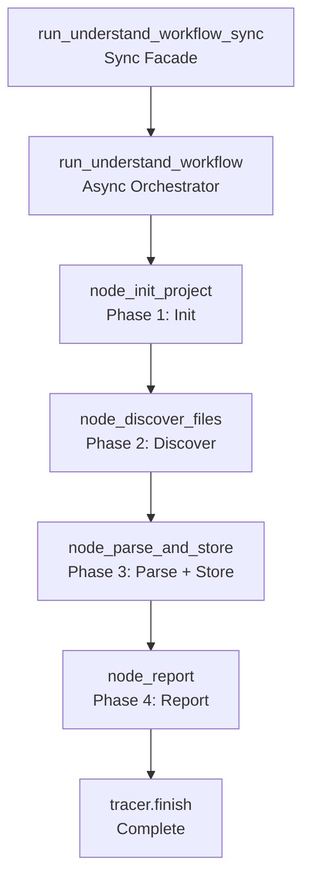

# 🧠 Understand Workflow

The `understand` workflow analyzes a **project's codebase** to build a dependency graph, map file relationships, and identify architectural patterns. It is the foundation for intelligent code navigation, impact analysis, and automated refactoring suggestions.

**Key characteristics:**
- **Static analysis** — Parses Python AST to extract imports, class hierarchies, and function calls
- **Dependency graph** — Builds a graph in SQLite (via `GraphStore`) for fast querying
- **Incremental updates** — Only re-parses changed files (MD5 hash comparison)
- **Project isolation** — Each project gets its own graph database and artifact directory
- **Async I/O** — All file I/O uses `asyncio.to_thread()` to prevent blocking the event loop
- **Memory integration** — Stores project metadata in procedural memory for future recall

---

## 🚀 Quick Start

```python
from workflows.base import run_workflow

# Analyze a project
result = run_workflow(
    workflow_type="understand",
    goal="Analyze the codebase structure",
    project_root="/path/to/project",
    trace_id="understand_001",
)

print(result["status"])  # "success" | "failed"
print(result["result"])  # "Project analysis complete: 42 files, 156 dependencies"
```

---

## 🏗️ Architecture

```text
workflows/understand.py
├── run_understand_workflow_sync()    # Sync facade (entry point)
│   ├── run_understand_workflow()     # Async orchestrator
│   │   ├── node_init_project()       # Phase 1: Init project + GraphStore
│   │   ├── node_discover_files()     # Phase 2: File discovery + hash check
│   │   ├── node_parse_and_store()    # Phase 3: AST parsing + graph storage
│   │   └── node_report()             # Phase 4: Generate report
│   └── tracer.finish()               # Mark trace complete
```

### Understand Flow



**Key design decisions:**
- **Not a LangGraph StateGraph** — Unlike other workflows, `understand` is a direct async function call. This is because the workflow is I/O-bound (file discovery, AST parsing) and doesn't need LangGraph's state management.
- **Sync facade** — `run_understand_workflow_sync()` wraps the async orchestrator in a `ThreadPoolExecutor` with a configurable timeout. This provides a sync API for callers.
- **GraphStore per project** — Each project gets its own SQLite database at `artifact_root / "graph.db"`. The database is created lazily on first access.
- **MD5 hash comparison** — Files are only re-parsed if their content hash changes. This enables incremental updates.
- **Batch processing** — Files are parsed in batches of 10 to prevent memory spikes and allow progress reporting.
- **Skip directories** — `node_modules`, `__pycache__`, `.git`, etc. are skipped during file discovery.
- **Memory storage** — Project metadata is stored in procedural memory for future recall.

---

## 📝 Node Reference

### `node_init_project(state)` — Phase 1: Initialize Project

**Purpose:** Initialize the project structure and GraphStore.

**Logic:**
1. Resolve `project_root` via `ProjectManager`
2. Create `GraphStore` instance (lazy init)
3. Log trace step

**Output:** Partial dict with `project_id`, `project_path`, `is_agent_root`, `db_path`.

**Note:** The `GraphStore` instance is created but discarded. Later nodes create their own instances. This is wasteful but not broken.

### `node_discover_files(state)` — Phase 2: File Discovery

**Purpose:** Discover all Python files in the project and check for changes.

**Logic:**
1. Walk the project directory tree (excluding skip directories)
2. For each `.py` file: compute MD5 hash, compare with stored hash
3. Collect files that are new or changed

**Output:** Partial dict with `files_to_parse` (list of changed file paths).

**Error handling:**
- File read errors are logged but don't fail the workflow
- Permission errors are logged but don't fail the workflow

**Note:** `os.walk` mutates `dirs` in-place to prune the walk. This is fragile — if `os.walk` implementation changes, it may silently fail.

**Note:** MD5 hash is computed by reading the entire file into memory (`read_bytes()`). For large files, this is memory-intensive.

### `node_parse_and_store(state)` — Phase 3: AST Parsing + Graph Storage

**Purpose:** Parse changed files and store dependencies in the graph.

**Logic:**
1. For each changed file (in batches of 10):
   - Parse AST to extract imports
   - Resolve imports to file paths
   - Store file node and dependency edges in GraphStore
2. Update `seen_urls` (actually `seen_files` — naming is from research workflow)

**Output:** Partial dict with `files_parsed`, `edges_created`, `errors`, `status`.

**Error handling:**
- Parse errors are collected in `errors` list
- `status` is `"completed"` if no errors, `"completed_with_errors"` if some errors

**Note:** `asyncio.gather` is used for batch processing, but `parse_file_dependencies` is CPU-bound (AST parsing). Running it in `asyncio.gather` without `asyncio.to_thread()` blocks the event loop.

**Note:** Duplicate target paths are created for each dependency: both `dep.replace(".", "/") + ".py"` and `dep` itself. This creates duplicate edges.

### `node_report(state)` — Phase 4: Generate Report

**Purpose:** Generate a report of the analysis results.

**Logic:**
1. Call `report(action="report", title=..., data=..., config=...)` with analysis results
2. Return the report

**Output:** Partial dict with `report_html` and `report_path`.

**Note:** The `report` tool's `action="report"` is the report action name (generates a single-scroll HTML report), not a mistake.

---

## ⚙️ Configuration

```ini
# .env
UNDERSTAND_MAX_FILE_SIZE_MB=1          # Max file size to parse (MB)
UNDERSTAND_BATCH_SIZE=10               # Files per batch
UNDERSTAND_TIMEOUT_SECONDS=300         # Workflow timeout (seconds)
```

```python
# core/config.py
cfg.understand_max_file_size_mb = 1    # Max file size to parse (MB)
cfg.understand_batch_size = 10          # Files per batch
cfg.understand_timeout_seconds = 300    # Workflow timeout (seconds)
```

---

## 📤 Output

The workflow returns a `dict`:

```json
{
  "status": "success",
  "result": "Project analysis complete: 42 files, 156 dependencies",
  "error": "",
  "artifacts": ["report.html"]
}
```

**Failure:**
```json
{
  "status": "failed",
  "result": "",
  "error": "Project analysis failed: timeout",
  "artifacts": []
}
```

---

## 🔄 When to Use vs Alternatives

| Need | Tool | Why |
|------|------|-----|
| Analyze codebase | `understand` workflow | Static analysis, dependency graph, incremental updates |
| Research a topic | `research` workflow | Web search + synthesis, no code analysis |
| Fix code | `autocode` workflow | Targeted code changes with test verification |
| Deep research | `deep_research` workflow | Iterative search with convergence detection |
| Analyze data | `data` workflow | Code generation + execution, data analysis |
| Generate report | `report` workflow | Structured report generation |

---

## 🧪 Testing

```powershell
# Run understand workflow tests
D:\mcp\agent\venv\Scripts\pytest.exe tests/workflows/understand/test_understand.py -W error --tb=short -v
```

**Mock strategy:**
- Patch `ProjectManager` for project resolution
- Patch `GraphStore` for database operations
- Patch `os.walk` for file discovery
- Patch `hashlib.md5` for hash comparison
- Patch `parse_file_dependencies` for AST parsing
- Patch `report(action="report")` for report generation
- Test `node_init_project` with invalid path → assert error state
- Test `node_discover_files` with no Python files → assert empty `files_to_parse`
- Test `node_parse_and_store` with parse error → assert `"completed_with_errors"` status
- Test `node_report` with empty results → assert graceful handling

**Current test layout:**
```text
tests/workflows/understand/
└── test_understand.py  # Full workflow test
```

> **Future:** Split into per-node files: `test_node_init.py`, `test_node_discover.py`, `test_node_parse.py`, `test_node_report.py`, plus `conftest.py`.

---

## 🗺️ Roadmap

### ✅ Completed

| Feature | Status | Notes |
|---------|--------|-------|
| Project initialization | ✅ v1.0 | ProjectManager resolution, GraphStore creation |
| File discovery | ✅ v1.0 | os.walk with skip directories, MD5 hash check |
| AST parsing | ✅ v1.0 | parse_file_dependencies for import extraction |
| Graph storage | ✅ v1.0 | GraphStore upsert for file nodes and dependency edges |
| Incremental updates | ✅ v1.0 | MD5 hash comparison, only re-parse changed files |
| Batch processing | ✅ v1.0 | Batch size 10 for memory efficiency |
| Report generation | ✅ v1.0 | Structured report with analysis results |
| Memory storage | ✅ v1.0 | Project metadata in procedural memory |

### 🔄 In Progress / Next Up

| # | Feature | Notes | Priority |
|---|---------|-------|----------|
| 1 | **Fix hardcoded `tid` strings in all nodes** | All nodes use hardcoded `tid` (`"understand_init"`, `"understand_discover"`, etc.) instead of `state.get("trace_id", "")`. No trace correlation. | P0 |
| 2 | **Fix `_default_state` missing `trace_id`** | `trace_id` created in `run_understand_workflow()` but never injected into `initial_state`. Nodes can't access it. | P0 |
| 3 | **Fix `GraphStore` created but discarded in `node_init`** | `GraphStore` instance created but not stored in state. Later nodes create their own. Wasteful and risky. | P0 |
| 4 | **Fix `GraphStore` connection leaked in `node_discover`** | No `with` statement or explicit `.close()`. SQLite connections left open until GC. | P1 |
| 5 | **Fix `os.walk` dirs mutation fragility** | `dirs[:] = [d for d in dirs if d not in skip_dirs]` mutates in-place. Fragile if `os.walk` implementation changes. | P1 |
| 6 | **Fix double file read for MD5** | `read_bytes()` reads entire file into memory. Should use chunked hashing. | P1 |
| 7 | **Fix duplicate target paths in edge creation** | Both `dep.replace(".", "/") + ".py"` and `dep` added as targets. Duplicate edges. | P1 |
| 8 | **Fix CPU-bound AST parsing without `to_thread()`** | `parse_file_dependencies` is CPU-bound. `asyncio.gather` blocks event loop. | P1 |
| 9 | **Fix `completed_with_errors` treated as failure** | `run_understand_workflow()` checks `status == "completed"` only. `"completed_with_errors"` treated as failure. | P1 |
| 10 | **Fix `report_tool` signature** | Verify `report()` tool signature matches usage. | P1 |
| 11 | **Fix silent exception in `node_report`** | `try/except` around `report_tool()` with no logging. Silent failures. | P2 |
| 12 | **Fix dangerous nested event loop in sync facade** | `ThreadPoolExecutor` + `new_event_loop()` may leak threads or hang. | P2 |
| 13 | **Fix wrong return type on `build_understand_graph`** | Returns `CompiledGraph` but annotated as `StateGraph`. | P2 |
| 14 | **Make `skip_dirs` configurable** | Currently hardcoded local set. Should be `.env` or `ProjectManager` config. | P3 |
| 15 | **Add `GraphStore` init failure handling** | `node_init_project` doesn't handle `GraphStore.__init__` failure. | P3 |
| 16 | **Test restructure** | Split `test_understand.py` into per-node files + `conftest.py` | P1 |
| 17 | **Configurable batch size** | Make `UNDERSTAND_BATCH_SIZE` actually used in code | P2 |
| 18 | **ChromaDB vector indexing** | Currently GraphStore creates schema but vectors are not populated | P2 |
| 19 | **Multi-language support** | Support JavaScript, TypeScript, Go, etc. | P3 |

### 🚫 Deferred / Out of Scope

| # | Feature | Why Deferred | Priority |
|---|---------|------------|----------|
| 1 | **Remove GraphStore** | GraphStore is essential for dependency querying. Removing it would break impact analysis. | Skip |
| 2 | **Remove incremental updates** | Full re-parse on every run would be too slow for large projects. | Skip |
| 3 | **Remove batch processing** | Processing all files at once would cause memory spikes. | Skip |
| 4 | **Real-time file watching** | File watching would require additional infrastructure (e.g., watchdog). Out of scope. | Skip |
| 5 | **IDE integration** | IDE plugins would require LSP or VS Code extension development. Out of scope. | Skip |

---

## 🛡️ AI Agent Instructions

### NEVER DO
1. **Never mutate state in-place** — Always return partial update `dict`s.
2. **Never spread `**state`** — Never return `{**state, "key": "value"}`. Return only the changed keys.
3. **Never remove GraphStore** — Dependency graph is essential for impact analysis.
4. **Never remove incremental updates** — Full re-parse would be too slow.
5. **Never use `print()` to stdout** — MCP stdio corruption. Use `tracer.step()` for logging.
6. **Never create `.bak` files** — forbidden by project rules.
7. **Never rewrite the entire file** — surgical edits only. Preserve existing code exactly.
8. **Never skip `compileall` before `pytest`** — catches syntax errors early.
9. **Never use hardcoded `tid` strings** — Always use `state.get("trace_id", "")` for trace correlation.
10. **Never return `None` from LangGraph nodes** — Always return a `dict` (even empty `{}`).

### ALWAYS DO
11. **Always return `dict` from nodes** — Not `WorkflowState`. Partial updates only.
12. **Always pass `trace_id` to tracer calls** — Observability requires trace correlation.
13. **Always handle file read errors gracefully** — Log and continue, don't crash.
14. **Always test `node_discover_files` with no Python files** — Assert empty `files_to_parse`.
15. **Always test `node_parse_and_store` with parse errors** — Assert `"completed_with_errors"` status.
16. **Always test `node_report` with empty results** — Assert graceful handling.
17. **Always test sync facade timeout** — Assert timeout handling.
18. **Always update this doc** when adding nodes, changing parsing logic, or modifying error handling.
19. **Always use `asyncio.to_thread()` for CPU-bound work** — AST parsing blocks the event loop.

---

## 🔗 Source Code Reference

| File | Purpose |
|------|---------|
| `workflows/understand.py` | `run_understand_workflow_sync()`, `run_understand_workflow()` — sync facade + async orchestrator |
| `workflows/base.py` | `WorkflowState`, `node_step()`, `node_error()`, `node_done()` — shared infrastructure |
| `core/kgraph/project.py` | `ProjectManager` — project resolution and path management |
| `core/kgraph/storage.py` | `GraphStore` — SQLite graph database |
| `core/kgraph/ast_parser.py` | `parse_file_dependencies()` — AST import extraction |
| `tools/report.py` | `report(action="report", title=...)` — report generation |
| `core/config.py` | `cfg.understand_max_file_size_mb`, `cfg.understand_batch_size`, `cfg.understand_timeout_seconds` — config |
| `tests/workflows/understand/test_understand.py` | Full workflow test |

---

*Architecture: 4-phase async orchestrator (init → discover → parse + store → report) with GraphStore dependency graph, incremental updates, batch processing, and memory integration. Not a LangGraph StateGraph — direct async function calls.*
