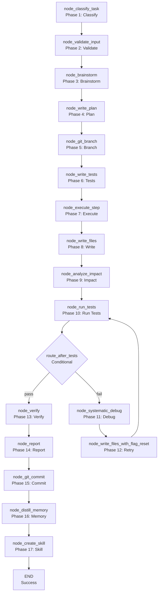

<- Back to [Autocode Overview](../AUTOCODE.md)

# 🏗️ Architecture

## 🔗 Source Code Reference

| File | Purpose |
|------|---------|
| `workflows/autocode.py` | `run_autocode_agent()` — main entry point |
| `workflows/autocode_impl/graph.py` | `build_graph()` — 17-node LangGraph StateGraph builder |
| `workflows/autocode_impl/state.py` | `AutocodeState` — extended TypedDict with autocode-specific fields |
| `workflows/autocode_impl/routes.py` | `route_after_classify()`, `route_after_tests()` — conditional routing |
| `workflows/autocode_impl/helpers.py` | `_write_files()`, `_call()`, `_extract_code()`, `_parse_json()`, `_files_context()` — shared helpers |
| `workflows/autocode_impl/git_ops.py` | `_git_snapshot()`, `_git_create_branch()`, `_git_commit()` — git operations |
| `workflows/autocode_impl/patch.py` | `apply_patch()`, `apply_patches()`, `extract_relevant_sections()` — patch application |
| `workflows/autocode_impl/mermaid.py` | `export_mermaid()` — mermaid diagram export |
| `workflows/autocode_impl/test_mapper.py` | `get_targeted_tests()`, `_build_test_index()` — test mapping |
| `workflows/autocode_impl/test_runner.py` | `run_tests_on_disk()` — test execution |
| `workflows/autocode_impl/nodes/classify.py` | `node_classify_task()` — task classification |
| `workflows/autocode_impl/nodes/validate.py` | `node_validate_input()` — input validation |
| `workflows/autocode_impl/nodes/brainstorm.py` | `node_brainstorm()` — approach brainstorming |
| `workflows/autocode_impl/nodes/plan.py` | `node_write_plan()` — plan generation |
| `workflows/autocode_impl/nodes/branch.py` | `node_git_branch()` — git branch creation |
| `workflows/autocode_impl/nodes/tests.py` | `node_write_tests()` — test generation |
| `workflows/autocode_impl/nodes/execute.py` | `node_execute_step()` — plan step execution |
| `workflows/autocode_impl/nodes/write_files.py` | `node_write_files()` — file writing |
| `workflows/autocode_impl/nodes/run_tests.py` | `node_run_tests()` — test execution |
| `workflows/autocode_impl/nodes/analyze_impact.py` | `node_analyze_impact()` — blast radius analysis |
| `workflows/autocode_impl/nodes/debug.py` | `node_systematic_debug()` — debug analysis |
| `workflows/autocode_impl/nodes/verify.py` | `node_verify()` — verification |
| `workflows/autocode_impl/nodes/commit.py` | `node_git_commit()` — git commit |
| `workflows/autocode_impl/nodes/memory.py` | `node_distill_memory()` — procedural memory storage |
| `workflows/autocode_impl/nodes/create_skill.py` | `node_create_skill()` — skill creation |
| `workflows/autocode_impl/nodes/report.py` | `node_report()` — report generation |
| `workflows/base.py` | `WorkflowState`, `node_step()`, `node_error()`, `node_done()` — shared infrastructure |
| `tools/agent.py` | `agent(action="dispatch", role="...")` — LLM calls |
| `tools/git.py` | `git(action="snapshot")`, `git(action="commit")` — git operations |
| `tools/python.py` | `python(code=...)` — sandboxed Python execution |
| `tools/memory.py` | `memory.recall()`, `memory.store_procedural()` — memory operations |
| `tools/notify.py` | `notify(action="notify", message=...)` — user notification |
| `tools/report.py` | `report(action="report", title=...)` — report generation |
| `core/config.py` | `cfg.autocode_graph_timeout`, `cfg.autocode_max_retries`, etc. — config |
| `core/utils.py` | `compress_result()` — result compression |
| `tests/workflows/autocode/test_autocode.py` | Full workflow test |

---

## 🌳 Module Tree

```text
workflows/autocode.py
├── run_autocode_agent()              # Main entry point
│   ├── build_graph()                 # 17-node LangGraph StateGraph
│   │   ├── node_classify_task()      # Phase 1: Classify task type
│   │   ├── node_validate_input()     # Phase 2: Validate input
│   │   ├── node_brainstorm()         # Phase 3: Brainstorm approach
│   │   ├── node_write_plan()         # Phase 4: Generate plan
│   │   ├── node_git_branch()         # Phase 5: Create git branch
│   │   ├── node_write_tests()        # Phase 6: Generate tests (TDD)
│   │   ├── node_execute_step()       # Phase 7: Execute plan step
│   │   ├── node_write_files()        # Phase 8: Write/modify files
│   │   ├── node_analyze_impact()     # Phase 9: Analyze blast radius
│   │   ├── node_run_tests()          # Phase 10: Run tests
│   │   ├── node_systematic_debug()   # Phase 11: Debug failures
│   │   ├── node_write_files_with_flag_reset()  # Phase 12: Retry with fix
│   │   ├── node_verify()             # Phase 13: Verify changes
│   │   ├── node_report()             # Phase 14: Generate report
│   │   ├── node_git_commit()         # Phase 15: Commit changes
│   │   ├── node_distill_memory()     # Phase 16: Store procedural memory
│   │   └── node_create_skill()       # Phase 17: Create skill (if applicable)
│   └── tracer.finish()               # Mark trace complete
```

---

## 🔀 Dispatch Flow



---

## 💡 Key Design Decisions

- **17-node LangGraph StateGraph** — The most complex workflow in the system. Each node has a specific responsibility.
- **Mode-driven** — The task type (fix_error, improve, add_feature, create_skill, unclear) determines the workflow path. The `node_classify_task` uses the Router LLM to classify the task.
- **TDD-first** — For `add_feature` and `improve` modes, tests are generated before implementation. This ensures test coverage.
- **Iterative debug loop** — If tests fail, the workflow enters a debug loop: `node_systematic_debug` → `node_write_files_with_flag_reset` → `node_run_tests`. This loop repeats until tests pass or `MAX_RETRIES` (3) is exceeded.
- **Impact analysis** — `node_analyze_impact` analyzes the blast radius of changes using the dependency graph. This prevents unintended side effects.
- **Git integration** — `node_git_branch` creates a new branch, and `node_git_commit` commits changes with a descriptive message.
- **Memory integration** — `node_distill_memory` stores procedural knowledge (e.g., "how to fix timeout errors") for future recall.
- **Skill creation** — `node_create_skill` creates a reusable skill file for the agent. This enables the agent to learn from experience.
- **Filelock + atomic writes** — `node_write_files` uses `FileLock` and atomic writes (`tempfile.NamedTemporaryFile` + `os.replace`) to prevent race conditions and data corruption.
- **Result compression** — The final result is compressed via `compress_result()` before being returned.

---

## 🧪 Testing

```powershell
# Run autocode tests
.\venv\Scripts\python tests/workflows/autocode/ -W error --tb=short -v
```

> **Note:** Ensure `pytest` resolves to your venv. If not, use `python -m pytest` or the full venv path (`venv\Scripts\pytest.exe` on Windows, `venv/bin/pytest` on Unix).

**Mock strategy:**
- Patch `llm.complete(role="router")` for classification
- Patch `llm.complete(role="planner")` for planning and brainstorming
- Patch `llm.complete(role="executor")` for code generation and debug
- Patch `llm.complete(role="test")` for test generation
- Patch `git(action="snapshot")` and `git(action="commit")` for git operations
- Patch `python(code=...)` for test execution
- Patch `memory.recall()` and `memory.store_procedural()` for memory operations
- Patch `report(action="report")` for report generation
- Patch `notify(action="notify")` for notification
- Test `node_classify_task` with mode override → assert correct task_type
- Test `node_validate_input` with invalid path → assert error state
- Test `node_brainstorm` with KG files → assert merged files (currently broken)
- Test `node_write_plan` with fallback → assert 3-step plan
- Test `node_git_branch` with snapshot failure → assert graceful handling
- Test `node_write_tests` with code extraction → assert test_code list
- Test `node_execute_step` with non-JSON code → assert modified_files fallback
- Test `node_write_files` with patch → assert atomic write
- Test `node_analyze_impact` with empty files_map → assert early return (currently broken)
- Test `node_run_tests` with missing test files → assert error state
- Test `node_systematic_debug` with max retries → assert failure state
- Test `node_verify` with missing ruff → assert lint_passed=False (currently True)
- Test `node_git_commit` with no changes → assert skipped state
- Test `node_distill_memory` with missing hypothesis → assert graceful handling
- Test `node_create_skill` with invalid name → assert error state

**Current test layout:**
```text
tests/workflows/autocode/
└── test_autocode.py  # Full workflow test
```

> **Future:** Split into per-node files: `test_node_classify.py`, `test_node_validate.py`, `test_node_brainstorm.py`, `test_node_plan.py`, `test_node_git_branch.py`, `test_node_write_tests.py`, `test_node_execute.py`, `test_node_write_files.py`, `test_node_analyze_impact.py`, `test_node_run_tests.py`, `test_node_debug.py`, `test_node_verify.py`, `test_node_report.py`, `test_node_git_commit.py`, `test_node_distill_memory.py`, `test_node_create_skill.py`, plus `conftest.py`.

---

*Last updated: 2026-07-04. See [API](API.md) for node details, [CHANGELOG.md](CHANGELOG.md) for version history, [INSTRUCTIONS.md](INSTRUCTIONS.md) for AI editing rules.*
