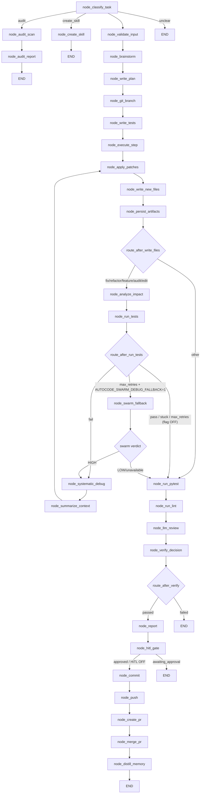

<- Back to [Autocode Overview](../AUTOCODE.md)

# 🏗️ Architecture

Module tree, dispatch flow, and the 7 design decisions that shaped the workflow. For per-version history see [CHANGELOG.md](CHANGELOG.md); for facade/config see [API.md](API.md); for per-node reference see [NODES.md](NODES.md); for state TypedDicts/accessors see [SUBSTATE.md](SUBSTATE.md).

---

## 🔗 Source Code Reference

| File | Purpose |
|------|---------|
| `workflows/autocode.py` | Thin facade. Exports `build_graph`, `get_graph`, `WORKFLOW_METADATA`, `AutocodeState`, `_default_state`, `_shape_artifacts`, `_resolve_files_input`. Entry: `run_workflow("autocode")` → `invoke_with_timeout()`. |
| `workflows/autocode_impl/graph.py` | `build_graph()` (32-node StateGraph). `invoke_with_timeout()` — daemon-thread + cancellation-flag signaling + adaptive per-task-type timeouts. `get_graph()` singleton guarded by `threading.Lock`. |
| `workflows/autocode_impl/state.py` | `AutocodeState` TypedDict + 8 sub-state TypedDicts + 8 accessors + `_default_state()`. |
| `workflows/autocode_impl/routes.py` | 6 routing functions: `route_after_classify`, `_write_files`, `_run_tests`, `_verify`, `_swarm_fallback`, `_hitl_gate`. |
| `workflows/autocode_impl/helpers.py` | `_call()`, `_parse_json()` (delegates to `core.json_extract`), `_should_skip_node()`, `_blast_radius_warning()`, `_get_autocode_run_path()`, `_cleanup_old_autocode_runs()`. Cancellation: `request_cancellation()`, `clear_cancellation()`, `is_cancellation_requested()`, `set_graph_start_time()`, `_remaining_timeout(default)`. |
| `workflows/autocode_impl/constants.py` | All SYSTEM prompts. `DEBUG_SYSTEM` (4-phase), `CODER_SYSTEM` (Lazy Dev ladder), `PARALLEL_HYPOTHESES_SYSTEM` + `SUBAGENT_VALIDATE_SYSTEM` (v3.5), `AUDIT_REPORT_SYSTEM` (v3.7). |
| `workflows/autocode_impl/vcs_ops.py` | **[v3.10]** Remote VCS helpers ONLY (local git ops moved to `tools/git_ops/workflow_helpers.py`): `_github_pull`, `_github_push`, `_github_pr_create`, `_github_pr_comment`, `_github_pr_merge` / Swarm (`_swarm_debug_consensus`). `git_ops.py` is a thin re-export wrapper for `_git_commit` + `_git_create_branch` (aliased to `workflow_helpers.commit` + `create_branch`). |
| `workflows/autocode_impl/patch.py` | `apply_patch()`, `apply_patches()`, `extract_relevant_sections()`. |
| `core/json_extract.py` | Consolidated JSON extraction: `extract_json`, `extract_json_array`, `extract_first_json`. Used by `helpers._parse_json` + `core/router._extract_first_json`. |
| `core/config_backend/execution.py` | All 17 autocode config flags. See [API.md](API.md) § Config Flags. |
| `tools/workflow_ops/types/autocode.py` | `_type_autocode()` — forwards `hitl_approved` + `target_file` + `mode` end-to-end through the workflow tool. |
| `tests/workflows/autocode/` | 248 tests across per-concern files. |

---

## 🌳 Module Tree

```text
workflows/base.py
└── run_workflow(workflow_type="autocode", goal="...", **kwargs)
    ├── invoke_with_timeout(initial_state)        # in workflows/autocode_impl/graph.py
    │   ├── clear_cancellation() + set_graph_start_time() + _cleanup_old_autocode_runs()
    │   ├── build_graph()                          # 32-node StateGraph (29 active + 3 wrappers)
    │   │   # Phases 1-17 + A1/A2 (audit). See NODES.md for the per-node table.
    │   │   # Active nodes (29): classify → validate → brainstorm → plan → branch →
    │   │   #   tests → execute → apply_patches → write_new_files → persist_artifacts →
    │   │   #   analyze_impact → run_tests → swarm_fallback → systematic_debug →
    │   │   #   summarize_context → run_pytest → run_lint → llm_review →
    │   │   #   verify_decision → report → hitl_gate → commit → push → create_pr →
    │   │   #   merge_pr → distill_memory → create_skill → audit_scan → audit_report
    │   │   # Backward-compat wrappers (registered, NOT wired):
    │   │   # ├── node_write_files()  → apply_patches + write_new_files + persist_artifacts
    │   │   # ├── node_verify()       → run_pytest + run_lint + llm_review + verify_decision
    │   │   # └── node_publish()      → push + create_pr + merge_pr
    │   └── graph.invoke(initial_state)            # daemon thread, timeout-bounded
    └── tracer.finish()
```

The 3 backward-compat wrappers are kept for `import`-compatibility (tests import them directly). Registered via `add_node(...)` but NOT wired. Excluded from `WORKFLOW_METADATA["nodes"]`. Removal deferred to post-2.0.

---

## 🔀 Dispatch Flow



**Conditional routes:**

- `route_after_classify` — `feature`/`fix`/`refactor`/`edit`/`audit` → `node_validate_input`; `create_skill` → `node_create_skill` (bypasses TDD); `audit` → `node_audit_scan` (bypasses TDD, v3.7); `unclear` → `END`.
- `route_after_write_files` — `fix`/`refactor`/`feature`/`audit`/`edit` → `node_analyze_impact`; other → `node_run_pytest`. Short-circuits to `node_run_pytest` when `status=="error"` (Hardening P1.5).
- `route_after_run_tests` — `pass`/`stuck` → `node_run_pytest`; `fail` → `node_systematic_debug`; `max_retries_exceeded` + `AUTOCODE_SWARM_DEBUG_FALLBACK=1` → `node_swarm_fallback`. Short-circuits on `status=="error"`.
- `route_after_swarm_fallback` — HIGH confidence → `node_systematic_debug`; LOW/MEDIUM/unavailable → `node_run_pytest`.
- `route_after_verify` — `passed` → `node_report`; `failed` → `END` (does NOT re-enter debug loop — the loop already exhausted retries by the time verify chain runs).
- `route_after_hitl_gate` — `awaiting_approval` → `END`; else → `node_commit`.

**Debug loop:** `node_systematic_debug` → `node_summarize_context` → `node_apply_patches` → `node_write_new_files` → `node_persist_artifacts` → `node_analyze_impact` → `node_run_tests` → (back to `node_systematic_debug` until tests pass, `MAX_RETRIES` exceeded, `tdd_status="stuck"`, OR the architecture-question exit fires — 3+ consecutive `tests_passed=False`).

---

## 💡 Key Design Decisions

1. **Mode-driven, TDD-first** — The 8 modes (`feature`, `fix`, `fix_error`, `refactor`, `improve`, `edit`, `create_skill`, `audit`) determine the workflow path. `node_classify_task` uses the Router LLM with `mode` override; `fix_error` normalizes to `fix`, `improve` to `refactor`. Tests are generated BEFORE implementation for all modes except `create_skill` and `audit` (both bypass TDD — `create_skill` produces a single skill file; `audit` is read-only whole-repo scan).

2. **Sub-state architecture (v3.0)** — State is split into 8 typed sub-state TypedDicts (`plan_state`, `tdd`, `files_state`, `impact`, `debug`, `verify`, `vcs`, `memory`) behind an accessor layer (`_get_plan`, `_get_tdd`, `_get_files`, `_get_impact`, `_get_debug`, `_get_verify`, `_get_vcs`, `_get_memory`). Accessors are 4-line sub-state-only reads — NO legacy flat-field fallback. Every write goes through read-modify-write (RMW); every read goes through the accessor. Ephemeral inter-node scratch (test_results, _pytest_output, lint_output, etc.) stays flat by design. Eliminates the v2.0.5 split-brain class of bugs (writer updated one source, reader read the other).

3. **Iterative 4-phase debug loop** — `node_systematic_debug` uses a 4-phase prompt (investigation → pattern → hypothesis → fix). `debug_history` accumulates across iterations; `node_summarize_context` compresses it via chonkie `SentenceChunker` (soft dep) before re-entering the loop. Three exit conditions: tests pass, `MAX_RETRIES` exceeded, `tdd_status="stuck"` (same error signature on consecutive iterations, #39), or architecture-question exit (3+ consecutive `tests_passed=False` with DIFFERENT errors, configurable threshold via `AUTOCODE_ARCHITECTURE_QUESTION_THRESHOLD`).

4. **Mutually-exclusive 4-path debug chain** — Inside `node_systematic_debug`, the chain is swarm → parallel subagent → single subagent → single-LLM, with fall-through on each path's failure. Swarm (`AUTOCODE_SWARM_DEBUG=1`) uses 2-run `consensus → vote`. Parallel subagent (`AUTOCODE_PARALLEL_SUBAGENT_DEBUG=1`, v3.5) dispatches N hypotheses → N subagents via `ThreadPoolExecutor`, aggregates by `hypothesis_confidence`. Single subagent (`AUTOCODE_SUBAGENT_DEBUG=1`) dispatches one isolated curated-context subagent. Swarm-fallback (`AUTOCODE_SWARM_DEBUG_FALLBACK=1`, v3.1) is AFTER the loop exhausts retries — independent of the in-loop flags.

5. **Cancellation-aware timeout** — `invoke_with_timeout()` wraps `graph.invoke()` in a daemon thread with `threading.Thread.join(timeout=...)`. On timeout, sets `request_cancellation()` — `_call()` retries abort via `threading.Event.wait()` (interruptible backoff). v3.6 added cancellation-aware `subprocess.run()` wrappers (pre-check + `_remaining_timeout(default)` + post-check) in `node_run_pytest`, `node_run_lint`, `node_run_tests` — bounds daemon-thread zombie linger to ≤1s past the graph deadline. Full process-level termination (the `multiprocessing.Process` rewrite) is deferred — Python's `threading.Thread` doesn't support `Thread.kill()`.

6. **HiTL async-checkpoint-resume (v3.4)** — The opt-in HiTL approval gate (`AUTOCODE_HITL_ENABLED=1`, default OFF) uses async-checkpoint-resume over sync-pause (`threading.Event` block). The gateway's worker pool assumes stateless workers — a sync-paused worker would consume a worker slot for the entire review duration (could be hours). The async pattern adds one extra call but preserves the worker pool, works with the existing checkpoint infrastructure, and is testable in isolation. `node_hitl_gate` (between report and commit) and the HiTL check at the top of `node_create_skill` both follow this pattern. Checkpoint failure is non-fatal.

7. **All 12 integration flags default OFF** — Backward compat: with all GitHub/Swarm/Subagent/HiTL/parallel-subagent/adaptive-timeout flags OFF, autocode behaves identically to a local-only single-LLM workflow (v1.x). Operators opt in to remote operations, swarm escalation, parallel debug, HiTL gating, and adaptive timeouts independently. The 5 base config flags (`AUTOCODE_GRAPH_TIMEOUT`, `AUTOCODE_MAX_RETRIES`, `AUTOCODE_MAX_FILE_CHARS`, `AUTOCODE_DEBUG`, `AUTOCODE_ARCHITECTURE_QUESTION_THRESHOLD`) are always-on.

### Helper layer

`_call(role, system, user, ..., retries=2, trace_id="")` loops `retries + 1` times, sleeping `2 ** attempt` seconds between attempts (interruptible via `threading.Event.wait()`). All 8 in-tree callers pass `trace_id=tid`. `_parse_json()` delegates to `core.json_extract.extract_json` (strips markdown fences, partial JSON, trailing content). `_should_skip_node(state)` checks the canonical skip-status set `{"needs_clarification", "failed", "error", "skipped"}` (v3.3 #58). `_blast_radius_warning(project_root, files, tid)` queries `core.kgraph.queries.get_callers` (lazy import — kgraph is optional).

### Lazy Dev / YAGNI Ladder

`CODER_SYSTEM` includes the 7-rung minimization ladder (inspired by [DietrichGebert/ponytail](https://github.com/DietrichGebert/ponytail)): YAGNI → reuse → stdlib → native → installed dep → one line → minimum code. `DEBUG_SYSTEM` Phase 4 ("fix") also applies the ladder. The `ponytail:` comment convention marks deliberate simplifications with known ceilings: `# ponytail: <ceiling>, <upgrade path if ceiling hit>`. v3.7 F7 extended the ladder from per-task to whole-repo via `node_audit_scan` + `node_audit_report`. See [INSTRUCTIONS.md](INSTRUCTIONS.md) ALWAYS DO for the rule.

---

## 🧪 Testing

```bash
python -m pytest tests/workflows/autocode/ -v
```

**Mock strategy:** Patch `llm.complete(role=...)` for the 5 LLM roles (router, planner, executor, test, summarize). Patch `git(action=...)`, `python(code=...)`, `memory.recall()`/`memory.store_procedural()`, `report(action=...)`, `notify(action=...)`. Use `pytest-mock` `mocker` fixture for swarm/subagent integration tests.

**Test counts:** 248 tests pass after v3.8 (#57 per-node test coverage).

**Test layout** (per-concern, one concern per file in `tests/workflows/autocode/`): `conftest.py`, `test_graph.py`, `test_routes.py`, `test_facade.py`, `test_should_skip_node.py`, `test_helpers.py`, `test_invoke_with_timeout.py`, `test_cancellation_aware.py`, `test_safety.py`, `test_execute.py`, `test_run_tests.py`, `test_debug.py`, `test_analyze_impact.py`, `test_verify.py`, `test_branch.py`, `test_create_skill.py`, `test_hitl_gate.py`, `test_audit_mode.py`, `test_swarm_integration.py`, `test_parallel_subagent.py`, `test_nodes_pre_tdd.py` (v3.8), `test_nodes_verify.py` (v3.8), `test_nodes_publish.py` (v3.8), `test_nodes_write.py` (v3.8).

---

*Last updated: 2026-07-22 (v3.11.1). See [CHANGELOG.md](CHANGELOG.md) for version history.*
