<- Back to [Autocode Overview](../AUTOCODE.md)

# 🏗️ Architecture

## 🔗 Source Code Reference

| File | Purpose |
|------|---------|
| `workflows/autocode.py` | `run_autocode_agent()` — main entry point |
| `workflows/autocode_impl/graph.py` | `build_graph()` — 28-node LangGraph StateGraph builder (was 27 in v2.0-beta; **[v2.0-rc1]** Phase 4 added `node_summarize_context` between `node_systematic_debug` and `node_apply_patches`; **[v2.0-beta]** Phase 3 split 3 "god nodes" into 10 focused nodes + kept the 3 originals as backward-compat wrappers — see "Source Code Reference" rows for `apply_patches.py` / `write_new_files.py` / `persist_artifacts.py` / `run_pytest.py` / `run_lint.py` / `llm_review.py` / `verify_decision.py` / `push.py` / `create_pr.py` / `merge_pr.py`). **[v2.0]** `invoke_with_timeout()` (in `base.py`, called from the autocode facade) wires the new `helpers.py` cancellation flag (`clear_cancellation()` at start, `request_cancellation()` on timeout). `WORKFLOW_METADATA["nodes"]` lists 27 nodes — the 3 backward-compat wrappers (`node_write_files` / `node_verify` / `node_publish`) are deliberately EXCLUDED so MCP clients render only active nodes (the new `node_summarize_context` IS included — it is wired into the debug loop). The graph itself registers 28 nodes via `add_node(...)` (wrappers + summarize_context included). **[v2.0 GA]** `WORKFLOW_METADATA["version"]` bumped `"2.0-rc3"` → `"2.0"` in Phase 7 (graph topology UNCHANGED — Phase 7 was Ponytail integration + dead code removal + doc consolidation, not a node/graph change). `WORKFLOW_METADATA["loops"][0]["nodes"]` (the `debug_loop` list) includes `node_summarize_context`. |
| `workflows/autocode_impl/state.py` | `AutocodeState` — extended TypedDict with autocode-specific fields ([v1.3] added `pushed`, `pr_number`, `pr_url`, `swarm_verdict`; fixed TypedDict drift on `branch`). **[v2.0]** Adds 8 sub-state TypedDicts (`PlanState`, `TDDState`, `FilesState`, `ImpactState`, `DebugState`, `VerifyState`, `VCSState`, `MemoryState`) + 8 backward-compat accessor functions (`_get_plan`, `_get_tdd`, `_get_files`, `_get_impact`, `_get_debug`, `_get_verify`, `_get_vcs`, `_get_memory`). `debug_history: list[dict]` field in `TDDState` (Phase 4 #37 placeholder — **[v2.0-rc1]** now POPULATED by `node_systematic_debug` on every iteration). **[v2.0-rc1]** New `debug_summary: str` field in `TDDState` (line 69) — written by `node_summarize_context`, holds the compressed debug_history chunk for bounded-context reads. **[v2.0-rc3]** `_default_state()` now populates all 8 sub-states with default values — sub-states are now PRIMARY storage, not just empty overlays. Legacy flat fields KEPT as mirrors for backward compat with unmigrated nodes + tests (`# TODO(2.0-post):` removal deferred to a post-2.0 cleanup). See "[v2.0] Sub-state Architecture" section below. |
| `workflows/autocode_impl/routes.py` | `route_after_classify()`, `route_after_write_files()`, `route_after_run_tests()`, `route_after_verify()` — conditional routing. **[v1.4]** `route_after_analyze_impact()` deleted (was always constant — replaced with direct edge `node_analyze_impact → node_run_tests` in graph.py). |
| `workflows/autocode_impl/helpers.py` | `_call()`, `_extract_code()`, `_parse_json()`, `_files_context()` — shared helpers. **[Pre-2.0 Fix]** `_call()` now retries 2× with exponential backoff (was single attempt — a rate-limit blip crashed the workflow). `tracer.error()` calls now use 3 args (tid, category, msg) not 2. **[v2.0]** `_parse_json()` now delegates to `core/json_extract.py` (consolidated JSON extraction — single source of truth). New cancellation flag: `request_cancellation()`, `clear_cancellation()`, `is_cancellation_requested()` — `_call()` checks the flag before each retry (aborts instead of sleeping through backoff if `invoke_with_timeout()` already timed out). **[v2.0-rc2]** `_write_files()` function marked DEPRECATED — dead-code audit found it was never called by any node (`execute.py` imported it but never used the import — dead import removed: `from ...helpers import _call, _write_files, ...` → `from ...helpers import _call, _files_context, _parse_json`). **[v2.0 GA] Phase 7.2: `_write_files()` DELETED** — the deprecated function body was removed entirely (replaced with a `# [v2.0] Phase 7: _write_files() DELETED — was dead code (never called by any node).` comment pointing readers to `nodes/apply_patches.py` + `nodes/write_new_files.py`). No behavior change — the function was unreachable before. |
| `workflows/autocode_impl/constants.py` | All SYSTEM prompts for autocode (`TASK_CLASSIFIER_SYSTEM`, `BRAINSTORM_SYSTEM`, `AUDIT_BRAINSTORM_SYSTEM`, `FIX_BRAINSTORM_SYSTEM`, `EDIT_BRAINSTORM_SYSTEM`, `REFACTOR_BRAINSTORM_SYSTEM`, `CREATE_SKILL_SYSTEM`, `PLAN_SYSTEM`, `TEST_SYSTEM`, `CODER_SYSTEM`, `DEBUG_SYSTEM`, `VERIFY_SYSTEM`). **[v2.0-rc1]** `DEBUG_SYSTEM` restructured into a 4-phase prompt (investigation → pattern → hypothesis → fix) inspired by obra/superpowers `systematic-debugging` skill; JSON output now includes required `phase` field (`investigation`/`pattern`/`hypothesis`/`fix` — enum enforced by `_DEBUG_JSON_SCHEMA` in `nodes/debug.py`). **[v2.0 GA] Phase 7.1:** `CODER_SYSTEM` now includes the 7-rung Lazy Dev minimization ladder inspired by [DietrichGebert/ponytail](https://github.com/DietrichGebert/ponytail): (1) Does this need to exist? (YAGNI), (2) Already in codebase? (reuse), (3) Stdlib does it? (use stdlib), (4) Native platform feature? (use native), (5) Installed dependency? (use existing dep), (6) One line? (one line), (7) Only then: minimum code that works. Core principle: "lazy about the solution, never about reading" — the ladder runs AFTER understanding the problem, not instead of it. New `ponytail:` comment convention for deliberate simplifications with known ceiling (e.g., `# ponytail: global lock, per-account locks if needed`). **[v2.0 GA] Phase 7.1b:** `DEBUG_SYSTEM` Phase 4 ("fix") also got the Lazy Dev minimization rule ("the fix should be minimal — one line if possible. Can the fix reuse existing code? Is there a stdlib solution? Prefer the smallest change that addresses the root cause."). |
| `core/json_extract.py` | **[v2.0] NEW FILE** — consolidated JSON extraction utility. 3 functions: `extract_json(text)`, `extract_json_array(text)`, `extract_first_json(text)`. Single source of truth for all LLM JSON parsing. `helpers._parse_json` and `router._extract_first_json` both delegate to this module (eliminates the historical split where helpers used markdown-fence-strip + `json.loads` and router used `json.JSONDecoder().raw_decode()`). |
| `workflows/autocode_impl/vcs_ops.py` | **[v2.0-rc2] NEW FILE (Phase 5.1 VCS consolidation)** — unified VCS helper module that merges former `git_ops.py` (local operations) + `github_ops.py` (remote operations) into one module. Organized in 3 sections: (1) **Local operations** — `_git_commit()`, `_git_create_branch()` (was in `git_ops.py`); (2) **Remote operations** — `_github_pull()`, `_github_push()`, `_github_pr_create()`, `_github_pr_comment()`, `_github_pr_merge()` (was in `github_ops.py`); (3) **Swarm integration** — `_swarm_debug_consensus()` (was in `github_ops.py`). All lazy imports, `is_configured()` guards, `tracer.step` logging, structured returns preserved — pure move + merge, no behavior change. Resolves the v1.3 "2.0 Review Notes" item `git_ops.py + github_ops.py split → consider merging into unified vcs_ops.py`. All node imports updated to `from workflows.autocode_impl.vcs_ops import ...` (was: from `git_ops` / `github_ops`). |
| `workflows/autocode_impl/git_ops.py` | **[v2.0-rc2] THIN RE-EXPORT WRAPPER (Phase 5.1)** — was the local-git-operations module (`_git_snapshot()`, `_git_create_branch()`, `_git_commit()`); now a thin re-export wrapper that re-exports `_git_commit` + `_git_create_branch` from `vcs_ops.py` for backward compat with external importers. New code MUST import from `vcs_ops.py` directly — see INSTRUCTIONS.md ALWAYS DO #53. (Note: `_git_snapshot()` was removed in v1.0.1 — the re-export wrapper does NOT re-export it.) |
| `workflows/autocode_impl/github_ops.py` | **[v1.3]** Originally `_github_pull()`, `_github_push()`, `_github_pr_create()`, `_github_pr_comment()`, `_github_pr_merge()`, `_swarm_debug_consensus()` — remote GitHub operations (lazy imports, `is_configured()` guards, tracer.step logging, structured returns). **[v2.0-rc2] THIN RE-EXPORT WRAPPER (Phase 5.1)** — now a thin re-export wrapper that re-exports all github/swarm functions from `vcs_ops.py` for backward compat with external importers. New code MUST import from `vcs_ops.py` directly — see INSTRUCTIONS.md ALWAYS DO #53. |
| `workflows/autocode_impl/patch.py` | `apply_patch()`, `apply_patches()`, `extract_relevant_sections()` — patch application |
| ~~`workflows/autocode_impl/mermaid.py`~~ | **[v1.4]** DELETED — never called (`WORKFLOW_METADATA` serves the same purpose for MCP clients). Found by: Kimi. |
| ~~`workflows/autocode_impl/test_mapper.py`~~ | **[v1.4]** DELETED — unused (analyze_impact imports from `core.kgraph.test_mapper`, not this module). Found by: Kimi. |
| ~~`workflows/autocode_impl/test_runner.py`~~ | **[v1.4]** DELETED — unused (`node_run_tests` has its own test execution logic). Found by: Kimi. |
| `workflows/autocode_impl/nodes/classify.py` | `node_classify_task()` — task classification |
| `workflows/autocode_impl/nodes/validate.py` | `node_validate_input()` — input validation |
| `workflows/autocode_impl/nodes/brainstorm.py` | `node_brainstorm()` — approach brainstorming |
| `workflows/autocode_impl/nodes/plan.py` | `node_write_plan()` — plan generation |
| `workflows/autocode_impl/nodes/branch.py` | `node_git_branch()` — git branch creation |
| `workflows/autocode_impl/nodes/tests.py` | `node_write_tests()` — test generation |
| `workflows/autocode_impl/nodes/execute.py` | `node_execute_step()` — plan step execution |
| `workflows/autocode_impl/nodes/write_files.py` | **[v2.0-beta] BACKWARD-COMPAT WRAPPER (Phase 3.1)** — `node_write_files()` now calls the 3 split nodes in sequence (`node_apply_patches` → `node_write_new_files` → `node_persist_artifacts`) and merges their partial state updates into one dict matching the original return shape. Registered in `graph.py` via `add_node(...)` for external callers + tests that import `node_write_files` directly, but NOT wired into the graph (no edges in or out). Excluded from `WORKFLOW_METADATA["nodes"]` (27-entry list) so MCP clients render only active nodes. `_is_path_safe()` helper was MOVED to `apply_patches.py` (re-exported from this module for `import`-compatibility). `_build_pr_body` was never in this file. `# TODO(2.0):` Phase 6 removes this wrapper once all external callers import the 3 split nodes directly. |
| `workflows/autocode_impl/nodes/apply_patches.py` | **[v2.0-beta] NEW (Phase 3.1 split)** — `node_apply_patches(state)` applies `str_replace` patches to existing files only. Reads `tdd_source_code` JSON, extracts `patches[]`, calls `workflows/autocode_impl/patch.apply_patch(target, old_text, new_text)` per patch. Builds `modified_files` list (paths successfully patched) + `patch_errors` list (path-traversal blocks + missing-file + apply failures) for downstream impact analysis. Honors `dry_run` (returns `{"status": "dry_run", "modified_files": []}`). Hosts the `_is_path_safe(base_path, rel_path) -> bool` helper (shared with `write_new_files.py` via `from workflows.autocode_impl.nodes.apply_patches import _is_path_safe`). |
| `workflows/autocode_impl/nodes/write_new_files.py` | **[v2.0-beta] NEW (Phase 3.1 split)** — `node_write_new_files(state)` writes new files / overwrites existing ones using atomic writes (`tempfile.NamedTemporaryFile` + `os.replace` + `FileLock` with 1 retry). Reads `tdd_source_code` JSON, extracts `new_files{}` dict. Also builds `files_map` for `analyze_impact` — snapshots of all modified files (from patches applied by `node_apply_patches` + new files written here) with `{content_preview, preview_md5, full_md5, size, truncated}`. Imports `_is_path_safe` from `apply_patches.py` (Phase 3.1 moved the helper there). Honors `dry_run` (returns `{}`). |
| `workflows/autocode_impl/nodes/persist_artifacts.py` | **[v2.0-beta] NEW (Phase 3.1 split)** — `node_persist_artifacts(state)` writes `test_autocode_feature.py` (from `state["test_code"]`, joined if list), `generated_code.json` (from `state["tdd_source_code"]`), and `debug_log.json` (from `state["debug_notes"]` / `root_cause` / `defense_notes` / `tdd_iteration`) to the per-run `_get_autocode_run_path(tid)` folder. Returns `{"test_files": [rel_path], "autocode_run_path": str}` so downstream verify nodes can find the test file. Honors `dry_run` (returns `{}`). |
| `workflows/autocode_impl/nodes/run_tests.py` | `node_run_tests()` — test execution |
| `workflows/autocode_impl/nodes/analyze_impact.py` | `node_analyze_impact()` — blast radius analysis. **[v2.0]** `_run_async()` simplified from create/destroy event loop per call (`asyncio.new_event_loop` + `set_event_loop` + `run_until_complete` + `close`) to `asyncio.run(coro)`. Fixes the resource-leak risk flagged by 3 LLMs (DeepSeek, Kimi, MiMo) in the v1.4 cross-LLM review. No behavior change. |
| `workflows/autocode_impl/nodes/debug.py` | `node_systematic_debug()` — debug analysis. **[v2.0-rc1]** Phase 4 refactor: (1) reads `debug_history` from `TDDState` via `_get_tdd` (was stateless per iteration — closes #37 prerequisite); (2) accumulates a new entry per iteration `{iteration, phase, root_cause, fix[:200], tests_passed: False}` and returns it via `"tdd": {"debug_history": updated_history}`; (3) injects last 5 entries into the LLM user prompt under a `PRIOR DEBUG ATTEMPTS (do NOT repeat these)` block; (4) uses `DEBUG_SYSTEM` from `constants.py` (was inline) — the 4-phase prompt (investigation → pattern → hypothesis → fix); (5) `_DEBUG_JSON_SCHEMA` now includes required `phase` field (enum); (6) new architecture-question exit: if `_ARCHITECTURE_QUESTION_THRESHOLD` (3) or more consecutive entries all have `tests_passed=False`, bail with `tdd_status="max_retries_exceeded"` + procedural memory store (`tags="tdd_failure,architecture_question,autocode,phase4"`) — DIFFERENT from #39 stuck detection (same error repeating); this fires when DIFFERENT errors occur each iteration, suggesting architectural bug. Swarm path also accumulates history (`phase="swarm"`, extra `confidence` field). Both early-exit paths preserve `debug_history` in the return dict. |
| `workflows/autocode_impl/nodes/summarize_context.py` | **[v2.0-rc1] NEW (Phase 4.3)** — `node_summarize_context(state)` compresses `debug_history` before re-entering the debug loop (closes #37). Reads `debug_history` from the TDD sub-state via `_get_tdd`, calls `_summarize_debug_history(history)` helper, returns `{"tdd": {"debug_summary": summary}}`. Empty history → `{"tdd": {"debug_summary": ""}}`. Helper reverses history (most recent first), renders each entry as a single sentence (`iter=N phase=P tests_passed=B [confidence=C] root_cause=R fix_preview=F`), tries `chonkie.SentenceChunker` (lazy import, soft dependency, `chunk_size=512`, `chunk_overlap=0`) and returns the FIRST chunk (most recent); on any `Exception` (including `ModuleNotFoundError` when chonkie isn't installed) falls back to `json.dumps(last_three, ensure_ascii=False, default=str)` — JSON serialization of the last 3 entries (most recent first). Tracer logs entry count + compressed length. Does NOT mutate `debug_history` — the full history is preserved for the architecture-question exit check in `node_systematic_debug`. |
| `workflows/autocode_impl/nodes/verify.py` | **[v2.0-beta] BACKWARD-COMPAT WRAPPER (Phase 3.2)** — `node_verify()` now calls the 4 split nodes in sequence (`node_run_pytest` → `node_run_lint` → `node_llm_review` → `node_verify_decision`) and merges their partial state updates into one dict matching the original return shape. Registered in `graph.py` via `add_node(...)` for external callers + tests that import `node_verify` directly, but NOT wired into the graph. Excluded from `WORKFLOW_METADATA["nodes"]` (27-entry list). `# TODO(2.0):` Phase 6 removes this wrapper once all external callers import the 4 split nodes directly. |
| `workflows/autocode_impl/nodes/run_pytest.py` | **[v2.0-beta] NEW (Phase 3.2 split)** — `node_run_pytest(state)` runs a fresh pytest subprocess on the autocode run directory (`test_autocode_feature.py` + optional `tests/` subdir). Skips pytest entirely if no test files exist (Pre-2.0 Fix — was: ran entire project suite). Stores `test_results` dict `{success, stdout, stderr, returncode}` + `tests_passed` bool + ephemeral `_pytest_output` (first 2000 chars) for the `llm_review` node. Handles `FileNotFoundError` (pytest missing) + `subprocess.TimeoutExpired` (120s). |
| `workflows/autocode_impl/nodes/run_lint.py` | **[v2.0-beta] NEW (Phase 3.2 split)** — `node_run_lint(state)` runs `ruff check --select E,F --no-cache` scoped to `modified_files` only (Pre-2.0 Fix — was: entire workspace). Returns `lint_output` (first 500 chars) + `lint_passed` (bool, or `None` if ruff unavailable or no files). `lint_passed = None` (was `True`) when ruff missing — Pre-2.0 Fix #7. |
| `workflows/autocode_impl/nodes/llm_review.py` | **[v2.0-beta] NEW (Phase 3.2 split)** — `node_llm_review(state)` calls `_call(role="executor", system=VERIFY_SYSTEM, ...)` with implementation context (patches + new files), fresh pytest output, and ruff output. Stores `llm_review_data` dict `{automated_checks_passed, checks: {syntax, tests, spec, regressions, cleanliness}, summary}`. Uses `_parse_json` from `helpers.py` for the LLM response. `verify_decision` applies the hallucination guard against this data. |
| `workflows/autocode_impl/nodes/verify_decision.py` | **[v2.0-beta] NEW (Phase 3.2 split)** — `node_verify_decision(state)` composes the results from the 3 previous nodes (run_pytest + run_lint + llm_review) and makes the final verification decision. Applies the hallucination guard (real pytest exit code overrides LLM claim of `automated_checks_passed`). Handles `tdd_status in ("max_retries_exceeded", "stuck")` early-exit (Pre-2.0 Fix — moved here from the original `verify.py`). Returns `verification_passed`, `verification_notes`, `evidence_outputs` `{tests, lint, regression}`, and `trace_id`. |
| `workflows/autocode_impl/nodes/commit.py` | `node_git_commit()` — git commit. **[v2.0]** First node migrated to the accessor pattern: reads `state["branch"]` via `_get_vcs(state, "branch", "main")` instead of `state.get("branch", "main")`. Proof-of-concept for the sub-state / legacy-fallback accessor layer (see "[v2.0] Sub-state Architecture" below). No behavior change — accessor returns the same value as the legacy path until Phase 6 removes the legacy fields. |
| `workflows/autocode_impl/nodes/publish.py` | **[v2.0-beta] BACKWARD-COMPAT WRAPPER (Phase 3.3)** — `node_publish()` now calls the 3 split nodes in sequence (`node_push` → `node_create_pr` → `node_merge_pr`) and merges their partial state updates into one dict matching the original return shape. Registered in `graph.py` via `add_node(...)` for external callers + tests that import `node_publish` directly, but NOT wired into the graph. Excluded from `WORKFLOW_METADATA["nodes"]` (27-entry list). `_build_pr_body(state)` helper was MOVED to `create_pr.py` in Phase 3.3 (signature unchanged). `# TODO(2.0):` Phase 6 removes this wrapper once all external callers import the 3 split nodes directly. |
| `workflows/autocode_impl/nodes/push.py` | **[v2.0-beta] NEW (Phase 3.3 split)** — `node_push(state)` pushes the branch to the remote via `_github_push(branch, tid)` if `cfg.autocode_push_on_commit` is ON. Skip conditions (same as `node_commit`): `status in {needs_clarification, failed, skipped}`, `verification_passed` falsy, `dry_run` truthy → `{"status": "dry_run"}`. Returns `{"pushed": bool}` (False if push flag off, no branch, or push failed). |
| `workflows/autocode_impl/nodes/create_pr.py` | **[v2.0-beta] NEW (Phase 3.3 split)** — `node_create_pr(state)` opens a PR from the autocode branch via `_github_pr_create(branch, title, body, tid)` if `cfg.autocode_open_pr` is ON AND `state["pushed"]` is True. Builds the PR body via `_build_pr_body(state)` — **moved here from `publish.py` in Phase 3.3** (signature unchanged; reads `task`, `task_type`, `commit_sha`, `verification_passed`, `root_cause`, `swarm_verdict`; surfaces swarm LOW-confidence warning if applicable). Returns `{"pr_number": int, "pr_url": str}` (both default to `0` / `""` if PR not created). |
| `workflows/autocode_impl/nodes/merge_pr.py` | **[v2.0-beta] NEW (Phase 3.3 split)** — `node_merge_pr(state)` auto-merges the PR via `_github_pr_merge(pr_number, tid)` if `cfg.autocode_auto_merge` is ON AND `state["pr_number"]` is set. **DANGEROUS — default OFF.** Terminal node — returns `{}` (no state update); no downstream node needs the merge result. `# TODO(2.0):` Add `AUTOCODE_AUTO_MERGE_METHOD` config (squash/merge/rebase) — currently hardcoded to `squash` inside `_github_pr_merge`. |
| `workflows/autocode_impl/nodes/memory.py` | `node_distill_memory()` — procedural memory storage |
| `workflows/autocode_impl/nodes/create_skill.py` | `node_create_skill()` — skill creation |
| `workflows/autocode_impl/nodes/report.py` | `node_report()` — report generation |
| `workflows/base.py` | `WorkflowState`, `node_step()`, `node_error()`, `node_done()` — shared infrastructure |
| `tools/agent.py` | `agent(action="dispatch", role="...")` — LLM calls |
| `tools/git.py` | `git(action="snapshot")`, `git(action="commit")` — git operations |
| `tools/python.py` | `python(code=...)` — sandboxed Python execution |
| `tools/memory.py` | `memory.recall()`, `memory.store_procedural()` — memory operations |
| `tools/notify.py` | `notify(action="notify", message=...)` — user notification |
| `tools/report.py` | `report(action="report", title=...)` — report generation |
| `core/config.py` | `cfg.autocode_graph_timeout`, `cfg.autocode_max_retries`, etc. — config ([v1.3] added 6 GitHub/Swarm flags — all default OFF) |
| `core/utils.py` | `compress_result()` — result compression |
| `tools/github.py` | **[v1.3]** `github(action="pull"|"push"|"pr_create"|"pr_comment"|"pr_merge")` — remote GitHub operations used by `github_ops.py` helpers |
| `tools/swarm.py` | **[v1.3]** `swarm(action="consensus"|"vote")` — multi-model consultation used by `_swarm_debug_consensus()` |
| `tests/workflows/autocode/` | Per-concern test files + `conftest.py` (see Testing section below) |

---

## 🌳 Module Tree

```text
workflows/autocode.py
├── run_autocode_agent()              # Main entry point
│   ├── build_graph()                 # 28-node LangGraph StateGraph (was 27 in v2.0-beta; [v2.0-rc1] Phase 4 added node_summarize_context)
│   │   ├── node_classify_task()      # Phase 1: Classify task type
│   │   ├── node_validate_input()     # Phase 2: Validate input
│   │   ├── node_brainstorm()         # Phase 3: Brainstorm approach
│   │   ├── node_write_plan()         # Phase 4: Generate plan ([v1.4] branch name + trace_id suffix)
│   │   ├── node_git_branch()         # Phase 5: Create git branch ([v1.3] optional pull before)
│   │   ├── node_write_tests()        # Phase 6: Generate tests (TDD)
│   │   ├── node_execute_step()       # Phase 7: Execute plan step ([v1.4] uses _parse_json)
│   │   ├── node_apply_patches()      # [v2.0-beta] Phase 8a: Apply str_replace patches (Phase 3.1 split)
│   │   ├── node_write_new_files()    # [v2.0-beta] Phase 8b: Write new/overwrite files + build files_map (Phase 3.1 split)
│   │   ├── node_persist_artifacts()  # [v2.0-beta] Phase 8c: Persist test file + gen code + debug log to run_dir (Phase 3.1 split)
│   │   ├── node_analyze_impact()     # Phase 9: Analyze blast radius
│   │   ├── node_run_tests()          # Phase 10: Run tests
│   │   ├── node_systematic_debug()   # Phase 11: Debug failures ([v1.3] optional swarm; [v2.0-rc1] 4-phase structure + debug_history accumulation + architecture-question exit) → loops back to node_summarize_context
│   │   ├── node_summarize_context()  # [v2.0-rc1] Phase 11a: Compress debug_history before re-entering loop (Phase 4.3 NEW)
│   │   ├── node_run_pytest()         # [v2.0-beta] Phase 12a: Fresh pytest subprocess (Phase 3.2 split)
│   │   ├── node_run_lint()           # [v2.0-beta] Phase 12b: Ruff on modified_files only (Phase 3.2 split)
│   │   ├── node_llm_review()         # [v2.0-beta] Phase 12c: LLM spec + cleanliness review (Phase 3.2 split)
│   │   ├── node_verify_decision()    # [v2.0-beta] Phase 12d: Compose results + hallucination guard + max_retries/stuck early-exit (Phase 3.2 split)
│   │   ├── node_report()             # Phase 13: Generate report
│   │   ├── node_git_commit()         # Phase 14: Commit changes ([v1.4] .get("label", "step") fallback; [v2.0] _get_vcs accessor)
│   │   ├── node_push()               # [v2.0-beta] Phase 15a: Push branch (Phase 3.3 split)
│   │   ├── node_create_pr()          # [v2.0-beta] Phase 15b: Create PR (Phase 3.3 split; _build_pr_body moved here)
│   │   ├── node_merge_pr()           # [v2.0-beta] Phase 15c: Auto-merge PR if enabled (Phase 3.3 split; terminal)
│   │   ├── node_distill_memory()     # Phase 16: Store procedural memory
│   │   └── node_create_skill()       # Phase 17: Create skill (if applicable) ([v1.4] atomic write)
│   │   # Backward-compat wrappers (registered but NOT wired — [v2.0-beta] Phase 3):
│   │   # ├── node_write_files()      #   wrapper → apply_patches + write_new_files + persist_artifacts
│   │   # ├── node_verify()           #   wrapper → run_pytest + run_lint + llm_review + verify_decision
│   │   # └── node_publish()          #   wrapper → push + create_pr + merge_pr
│   └── tracer.finish()               # Mark trace complete
```

**[v1.3] Note on the publish node:** `node_publish` is registered in the graph
between `node_commit` and `node_distill_memory` via two new edges
(`node_commit → node_publish`, `node_publish → node_distill_memory`). With all
v1.3 config flags OFF (the default), `node_publish` is a no-op that returns `{}`
— autocode behaves identically to v1.2.

**[v2.0-beta] Update:** `node_publish` is now a BACKWARD-COMPAT WRAPPER (Phase 3.3
split). The 3 active publish nodes are `node_push` → `node_create_pr` →
`node_merge_pr`. The wrapper is still registered via `add_node(...)` (so external
callers + tests that `import node_publish` still work) but NO LONGER wired into
the graph — the edges now go `node_commit → node_push → node_create_pr →
node_merge_pr → node_distill_memory`. The wrapper is excluded from
`WORKFLOW_METADATA["nodes"]` (27-entry list) so MCP clients render only the 3
active publish nodes. Same pattern applies to `node_write_files` (Phase 3.1) and
`node_verify` (Phase 3.2) — see "Backward-compat wrappers" subsection below.

**[v2.0-rc1] Update:** A new node `node_summarize_context` is now wired between
`node_systematic_debug` and `node_apply_patches` in the debug loop (Phase 4.3).
The debug loop now runs `debug → summarize_context → apply_patches → write_new_files
→ persist_artifacts → analyze_impact → run_tests → [route_after_run_tests]`. The
new node is NOT a wrapper — it is a fully-wired active node registered in
`WORKFLOW_METADATA["nodes"]` (27-entry list — wrappers still excluded). Graph
registers 28 nodes via `add_node(...)` (was 27 — +1 `node_summarize_context`).
`node_systematic_debug` itself was also refactored: 4-phase prompt
(investigation → pattern → hypothesis → fix), `debug_history` accumulation across
iterations (entry shape `{iteration, phase, root_cause, fix[:200], tests_passed}`),
last 5 entries injected into the LLM user prompt, and a new architecture-question
exit (3+ consecutive `tests_passed=False` → bail with `tdd_status="max_retries_exceeded"`
+ procedural memory store). `state.py` `TDDState` gains `debug_summary: str` field
(written by `node_summarize_context`). `WORKFLOW_METADATA["version"]` → `"2.0-rc1"`.

**[v2.0-rc2] Update:** Phase 5 (VCS consolidation + cleanup) shipped. **Graph
topology UNCHANGED** — Phase 5 did NOT add, remove, or rewire any node. The
changes were: (1) new unified `workflows/autocode_impl/vcs_ops.py` merges former
`git_ops.py` (local) + `github_ops.py` (remote) into one module, organized in 3
sections (Local operations / Remote operations / Swarm integration); `git_ops.py`
+ `github_ops.py` kept as thin re-export wrappers for backward compat. All node
imports updated to `from workflows.autocode_impl.vcs_ops import ...` (was: from
`git_ops` / `github_ops`). (2) The 3 backward-compat node wrappers
(`node_write_files` / `node_verify` / `node_publish`) are KEPT — tests import them
directly; removal deferred from Phase 6 to Phase 7 (tests must be updated to
import split nodes directly first). (3) `helpers._write_files()` marked DEPRECATED
(dead code — was never called by any node; `execute.py`'s dead import removed).
`WORKFLOW_METADATA["version"]` → `"2.0-rc2"`.

**[v2.0-rc3] Update:** Phase 6 (state migration — sub-states primary) shipped.
**Graph topology UNCHANGED** — Phase 6 did NOT add, remove, or rewire any node.
`_default_state()` now populates all 8 sub-states with default values — sub-states
are now PRIMARY storage, not just empty overlays. Legacy flat fields kept as
mirrors for backward compat with unmigrated nodes + tests. `_get_plan` accessor
updated to read from `plan_state` (not `plan` — overloaded key). `WORKFLOW_METADATA["version"]` → `"2.0-rc3"`.

**[v2.0 GA] Update:** Phase 7 (Ponytail integration + dead code removal + doc
consolidation) shipped. **Graph topology UNCHANGED** — Phase 7 did NOT add,
remove, or rewire any node. The changes were: (1) **Phase 7.1:** `constants.py`
`CODER_SYSTEM` now includes the 7-rung Lazy Dev minimization ladder inspired by
[DietrichGebert/ponytail](https://github.com/DietrichGebert/ponytail) (YAGNI →
reuse → stdlib → native → installed dep → one line → minimum code); core
principle "lazy about the solution, never about reading"; new `ponytail:` comment
convention for deliberate simplifications. (2) **Phase 7.1b:** `DEBUG_SYSTEM`
Phase 4 ("fix") also got the Lazy Dev minimization rule ("the fix should be
minimal — one line if possible"). (3) **Phase 7.2:** `helpers._write_files()`
DELETED (was DEPRECATED in v2.0-rc2 — dead-code audit confirmed it was never
called by any node). (4) **Phase 7.3:** API.md split into API.md (facade + state
accessors + graph overview) + new NODES.md (per-node reference). (5) **Phase
7.4:** `WORKFLOW_METADATA["version"]` → `"2.0"` (GA). The original Phase 7 scope
(timeout hardening #35 + backward-compat wrapper removal) was DESCOPED — the
Phase 1 cancellation flag is the production mitigation for #35 (full
process-level termination deferred to post-2.0), and the 3 wrappers remain KEPT
for test compatibility. **All 7 phases of the 2.0 refactor ✅ COMPLETE.**

---

## 🔀 Dispatch Flow

```mermaid
graph TD
    A["node_classify_task<br/>Phase 1: Classify"] --> B["node_validate_input<br/>Phase 2: Validate"]
    B --> C["node_brainstorm<br/>Phase 3: Brainstorm"]
    C --> D["node_write_plan<br/>Phase 4: Plan"]
    D --> E["node_git_branch<br/>Phase 5: Branch"]
    E --> F["node_write_tests<br/>Phase 6: Tests"]
    F --> G["node_execute_step<br/>Phase 7: Execute"]
    G --> AP["node_apply_patches [v2.0-beta]<br/>Phase 8a: Patches"]
    AP --> WNF["node_write_new_files [v2.0-beta]<br/>Phase 8b: New files + files_map"]
    WNF --> PA["node_persist_artifacts [v2.0-beta]<br/>Phase 8c: Persist test + gen code + debug log"]
    PA --> RT1{"route_after_write_files"}
    RT1 -->|fix/refactor/improve/feature/audit/edit| I["node_analyze_impact<br/>Phase 9: Impact"]
    RT1 -->|other| RP["node_run_pytest [v2.0-beta]<br/>Phase 12a: Fresh pytest"]
    I --> J["node_run_tests<br/>Phase 10: Run Tests"]
    J --> RT2{"route_after_run_tests<br/>Conditional"}
    RT2 -->|pass / max_retries| RP
    RT2 -->|fail| M["node_systematic_debug [v2.0-rc1]<br/>Phase 11: 4-phase Debug (investigation → pattern → hypothesis → fix)"]
    M --> SC["node_summarize_context [v2.0-rc1]<br/>Phase 11a: Compress debug_history"]
    SC --> AP
    RP --> RL["node_run_lint [v2.0-beta]<br/>Phase 12b: Ruff on modified_files"]
    RL --> LR["node_llm_review [v2.0-beta]<br/>Phase 12c: LLM spec review"]
    LR --> VD["node_verify_decision [v2.0-beta]<br/>Phase 12d: Compose + hallucination guard"]
    VD --> RT3{"route_after_verify"}
    RT3 -->|verification_passed| O["node_report<br/>Phase 13: Report"]
    RT3 -->|failed| S["END<br/>Failed"]
    O --> P["node_git_commit<br/>Phase 14: Commit"]
    P --> PU["node_push [v2.0-beta]<br/>Phase 15a: Push"]
    PU --> CPR["node_create_pr [v2.0-beta]<br/>Phase 15b: Create PR"]
    CPR --> MPR["node_merge_pr [v2.0-beta]<br/>Phase 15c: Auto-merge (terminal)"]
    MPR --> Q["node_distill_memory<br/>Phase 16: Memory"]
    Q --> R["node_create_skill<br/>Phase 17: Skill"]
    R --> S["END<br/>Success"]
```



**[v1.3] Edge change:** The v1.2 edge `node_commit → node_distill_memory` is
split into `node_commit → node_publish → node_distill_memory`. With all v1.3
config flags OFF, `node_publish` is a no-op (`return {}`) so the graph behaves
identically to v1.2. With `AUTOCODE_PUSH_ON_COMMIT=1` (+ optionally
`AUTOCODE_OPEN_PR` and `AUTOCODE_AUTO_MERGE`), `node_publish` calls the
matching `github_ops.py` helpers in sequence.

**[v2.0-beta] Edge changes (Phase 3 splits):**
- **Phase 3.1:** `node_write_files` (single node, was Phase 8) replaced by a 3-node chain `node_apply_patches → node_write_new_files → node_persist_artifacts`. The conditional edge `route_after_write_files` now originates from `node_persist_artifacts` (was: `node_write_files`). The debug-loop edge now targets `node_apply_patches` (was: `node_write_files`). The downstream `route_after_write_files` and `route_after_run_tests` `node_verify` mapping key now resolves to `node_run_pytest` (the first verify sub-node).
- **Phase 3.2:** `node_verify` (single node, was Phase 12) replaced by a 4-node chain `node_run_pytest → node_run_lint → node_llm_review → node_verify_decision`. The conditional edge `route_after_verify` now originates from `node_verify_decision` (was: `node_verify`). The max-retries / stuck early-exit logic (was inside `node_verify`) moved into `node_verify_decision`.
- **Phase 3.3:** `node_publish` (single node, was Phase 15) replaced by a 3-node chain `node_push → node_create_pr → node_merge_pr`. The edges `node_commit → node_publish → node_distill_memory` are replaced by `node_commit → node_push → node_create_pr → node_merge_pr → node_distill_memory`.

The 3 original nodes (`node_write_files`, `node_verify`, `node_publish`) are kept
as backward-compat wrappers — registered via `add_node(...)` so external callers +
tests that `import` them directly still work, but NOT wired (no edges in or out).
Excluded from `WORKFLOW_METADATA["nodes"]` (27-entry list — wrappers excluded).

**[v2.0-rc1] Edge changes (Phase 4 debug loop refactor):**
- **Phase 4.3 (summarize_context inserted):** The v2.0-beta edge `node_systematic_debug → node_apply_patches` is split into a 2-edge chain `node_systematic_debug → node_summarize_context → node_apply_patches`. The new `node_summarize_context` compresses `debug_history` (via chonkie `SentenceChunker` soft dep, JSON-of-last-3-entries fallback) before re-entering the loop so the next debug iteration sees a bounded context (#37).
- **Phase 4.2 (debug_history accumulation):** `node_systematic_debug` now reads `debug_history` from `TDDState` (was stateless per iteration) and appends a new entry on every iteration. The entry shape is `{iteration, phase, root_cause, fix[:200], tests_passed: False}` (`tests_passed` is updated by `run_tests` on the next loop). Last 5 entries are injected into the LLM user prompt under a `PRIOR DEBUG ATTEMPTS (do NOT repeat these)` block.
- **Phase 4.1 (4-phase prompt):** `DEBUG_SYSTEM` in `constants.py` restructured into 4 phases (investigation → pattern → hypothesis → fix) inspired by obra/superpowers `systematic-debugging`. JSON output now includes required `phase` field (enum enforced by `_DEBUG_JSON_SCHEMA`).
- **Phase 4.2 (architecture-question exit):** New early-exit path: if `_ARCHITECTURE_QUESTION_THRESHOLD` (3) or more consecutive entries all have `tests_passed=False`, bail with `tdd_status="max_retries_exceeded"` + procedural memory store (`tags="tdd_failure,architecture_question,autocode,phase4"`). This is DIFFERENT from #39 stuck detection (same error signature on consecutive iterations) — the architecture-question exit fires when DIFFERENT errors occur each iteration, suggesting the bug is architectural, not a fix-the-line bug. Inspired by superpowers Phase 4.5 pattern.

**[v1.4] Dead-code removal:** The dead `node_write_files_with_flag_reset`
node (was Phase 12, between `node_systematic_debug` and `node_run_tests`) is
deleted — it was registered but never wired (the debug loop edges to
`node_write_files` directly), and it reset `step_attempt` (a field that
doesn't exist in `AutocodeState`). The dead `route_after_analyze_impact`
conditional edge (was between `node_analyze_impact` and `node_run_tests`, but
always returned `"node_run_tests"`) is replaced with a direct edge. Graph now
has 17 nodes (was 18 in v1.3). See CHANGELOG.md § "Cross-LLM Review Findings
(Pre-2.0)" — found by MiMo and Kimi.

---

## 💡 Key Design Decisions

- **28-node LangGraph StateGraph** ([v2.0-rc1] was 27 in v2.0-beta — Phase 4 added `node_summarize_context` between `node_systematic_debug` and `node_apply_patches`; [v2.0-beta] was 17 in v2.0-alpha — Phase 3 split `node_write_files` / `node_verify` / `node_publish` into 10 focused nodes; [v1.4] was 18 in v1.3 — deleted dead `node_write_files_with_flag_reset`; [v1.3] was 17 in v1.2 — added `node_publish`) — The most complex workflow in the system. Each node has a specific responsibility. The 3 backward-compat wrappers (`node_write_files` / `node_verify` / `node_publish`) are registered via `add_node(...)` for `import`-compatibility but NOT wired into the graph. The new `node_summarize_context` IS wired into the graph (between debug and apply_patches in the debug loop).
- **Mode-driven** — The task type (fix_error, improve, add_feature, create_skill, unclear) determines the workflow path. The `node_classify_task` uses the Router LLM to classify the task.
- **TDD-first** — For `add_feature` and `improve` modes, tests are generated before implementation. This ensures test coverage.
- **Iterative debug loop** — If tests fail, the workflow enters a debug loop: `node_systematic_debug` → `node_summarize_context` → `node_apply_patches` → `node_write_new_files` → `node_persist_artifacts` → `node_analyze_impact` → `node_run_tests` ([v2.0-rc1] Phase 4.3 inserted `node_summarize_context` between `node_systematic_debug` and `node_apply_patches` to compress `debug_history` before re-entering the loop — closes #37; [v2.0-beta] Phase 3.1 changed the loop target from `node_write_files` to `node_apply_patches` — the first of the 3 split write nodes). This loop repeats until tests pass, `MAX_RETRIES` (3) is exceeded, `tdd_status == "stuck"` (same error signature on consecutive iterations — [Pre-2.0 Fix] `node_verify_decision` now handles `"stuck"` correctly [Phase 3.2 moved the check from `node_verify` to `node_verify_decision`]), OR **[v2.0-rc1]** the architecture-question exit fires (3+ consecutive iterations with `tests_passed=False` AND different errors each time → bail with `tdd_status="max_retries_exceeded"` + procedural memory store; different from `"stuck"` which fires on the SAME error repeating). [v1.3] `node_systematic_debug` can optionally use the swarm tool for a 2-run consensus → vote pattern (see `node_systematic_debug` in [NODES.md](NODES.md)). **[v2.0-rc1]** `node_systematic_debug` uses a 4-phase prompt (investigation → pattern → hypothesis → fix) inspired by obra/superpowers `systematic-debugging`; each iteration's `{iteration, phase, root_cause, fix[:200], tests_passed}` is appended to `debug_history` (in `TDDState` sub-state) and the last 5 entries are injected into the LLM user prompt under a `PRIOR DEBUG ATTEMPTS (do NOT repeat these)` block. **[v1.4]** The intermediate `node_write_files_with_flag_reset` (was between `node_systematic_debug` and `node_run_tests`) is deleted as dead code — see Dead Code section in CHANGELOG.md.
- **Impact analysis** — `node_analyze_impact` analyzes the blast radius of changes using the dependency graph. This prevents unintended side effects.
- **Git integration** — `node_git_branch` creates a new branch ([v1.3] optionally pulls first via `AUTOCODE_PULL_BEFORE_BRANCH`), and `node_git_commit` commits changes with a descriptive message.
- **GitHub integration** — [v1.3] `node_publish` ran after `node_git_commit` to push the branch, open a PR, and optionally auto-merge — all gated on config flags and `is_configured()`. **[v2.0-beta]** `node_publish` is split into 3 nodes (`node_push` → `node_create_pr` → `node_merge_pr`) for finer-grained routing; the original `node_publish` is now a backward-compat wrapper. See `github_ops.py` for the helper layer.
- **Memory integration** — `node_distill_memory` stores procedural knowledge (e.g., "how to fix timeout errors") for future recall.
- **Skill creation** — `node_create_skill` creates a reusable skill file for the agent. This enables the agent to learn from experience.
- **Filelock + atomic writes** — `node_write_new_files` (Phase 3.1 split) uses `FileLock` and atomic writes (`tempfile.NamedTemporaryFile` + `os.replace`) to prevent race conditions and data corruption. (Was: `node_write_files` before the Phase 3.1 split.)
- **Result compression** — The final result is compressed via `compress_result()` before being returned.

---

## 🧭 [v1.3] Design Decision Notes

The v1.3 GitHub + Swarm integration introduces four deliberate design choices
that should be preserved during future edits. Each is marked `# TODO(2.0):`
in the source code where the 2.0 refactor may revisit it.

1. **`node_publish` is a separate node — NOT folded into `node_commit`.**
   - **Why separate:** `node_commit` is local-only and always runs (TDD code is committed even on failure). `node_publish` is opt-in (config flags), remote-touching, and may fail (network, GitHub API, permissions). Folding them would couple commit failure semantics with publish failure semantics. Keeping them separate means: (a) a push failure does NOT undo the commit, (b) the publish step can be skipped in dry_run / needs_clarification / failed / skipped states independently, (c) the graph topology stays self-documenting (the mermaid diagram shows the publish step).
   - **Source:** `workflows/autocode_impl/nodes/publish.py` (top docstring).
   - **[v2.0-beta] Resolved:** `node_publish` is now SPLIT into `node_push`, `node_create_pr`, `node_merge_pr` (Phase 3.3) for finer-grained routing and retry. The original `node_publish` is kept as a backward-compat wrapper (registered, NOT wired). `# TODO(2.0):` Phase 6 removes the wrapper once all external callers have migrated to the 3 split nodes.

2. **`github_ops.py` is a separate module from `git_ops.py`.**
   - **Why separate:** `git_ops.py` wraps the local `git` tool (no network, no auth, no env vars required). `github_ops.py` wraps the remote `github` tool (requires `GITHUB_TOKEN` + `GITHUB_OWNER` + `GITHUB_REPO`, network-dependent, may graceful-skip via `is_configured()`). They have different failure modes and different availability requirements. Mixing them would force every autocode call to import the github tool even when only local git is needed.
   - **Pattern:** Both modules follow the same shape — lazy import inside each helper, `project_root`/`tid` params, `tracer.step()` for observability, structured returns (`bool` / `dict | None`) — so they look alike but live apart.
   - **Source:** `workflows/autocode_impl/github_ops.py` (top docstring).
   - `# TODO(2.0):` Consider merging `git_ops.py` + `github_ops.py` into a unified `vcs_ops.py` module (see CHANGELOG.md § 2.0 Review Notes).
   - **[v2.0-rc2] RESOLVED** in Phase 5.1 — new unified `workflows/autocode_impl/vcs_ops.py` merges `git_ops.py` (local) + `github_ops.py` (remote) into one module, organized in 3 sections (Local operations / Remote operations / Swarm integration). `git_ops.py` + `github_ops.py` kept as thin re-export wrappers for backward compat with external importers. All node imports updated to `from workflows.autocode_impl.vcs_ops import ...`. See INSTRUCTIONS.md ALWAYS DO #53 for the new import rule.

3. **Swarm debug is non-blocking — the fix always applies, regardless of confidence.**
   - **Why non-blocking:** The debug loop already has its own safety net (`MAX_RETRIES`, stuck-detection routing in `route_after_run_tests`, the `node_verify` gate, the git branch). Adding a swarm-confidence gate would block the loop on a multi-LLM vote that may itself fail or take minutes. The swarm verdict is captured in `state.swarm_verdict` and surfaced in the PR body (and, for LOW confidence, optionally as a PR comment) so human reviewers see the disagreement without the workflow stalling.
   - **Confidence map:** `unanimous → HIGH`, `majority → MEDIUM`, `split`/`disagreement`/unknown → `LOW`.
   - **Source:** `workflows/autocode_impl/nodes/debug.py` (top docstring), `_swarm_debug_consensus()` in `github_ops.py`.
   - `# TODO(2.0):` Consider `AUTOCODE_SWARM_BLOCK_ON_LOW_CONFIDENCE` flag for stricter gating, and review confidence thresholds (e.g., MEDIUM should require ≥3 providers).

4. **All 6 new v1.3 config flags default OFF.**
   - **Why default OFF:** Backward compatibility. With all flags OFF, `node_publish` returns `{}`, `_github_pull()` returns `False`, `_swarm_debug_consensus()` is never invoked — autocode v1.3 is byte-for-byte behaviorally identical to v1.2 unless the operator explicitly opts in. This means the v1.3 release is safe to deploy to existing installations with no `.env` changes.
   - **The 6 flags:** `AUTOCODE_PULL_BEFORE_BRANCH`, `AUTOCODE_PUSH_ON_COMMIT`, `AUTOCODE_OPEN_PR`, `AUTOCODE_AUTO_MERGE`, `AUTOCODE_DEBUG_COMMENT_PR`, `AUTOCODE_SWARM_DEBUG` (see `core/config.py` lines 341-346).
   - `# TODO(2.0):` Consider per-task overrides (e.g., different PR strategy for different task types) rather than global flags.

---

## 🧭 [v1.4] Pre-2.0 Hardening Notes

The v1.4 release is a hardening + dead-code-cleanup pass based on a cross-LLM
review (DeepSeek, Qwen, MiMo, Kimi — see CHANGELOG.md § "Cross-LLM Review
Findings (Pre-2.0)"). It contains **no new features and no new config flags** —
all changes are bug fixes, security guards, and deletions. Each fix is marked
`[Pre-2.0 Fix]` in the source and referenced in this section so future editors
can trace the rationale.

1. **`_is_path_safe()` guards LLM-generated paths in `node_write_files`.**
   - **Why:** [Pre-2.0 Fix] The existing path traversal check in `node_validate_input` only covered user-supplied paths. LLM-generated `patches[].path` and `new_files{}` keys were written directly to `base_path / rel_path` with no validation — an LLM hallucination like `"../../etc/passwd"` would escape `base_path`.
   - **Fix:** New `_is_path_safe(base_path, rel_path) -> bool` helper in `nodes/write_files.py` uses `Path.resolve().is_relative_to()` to verify the resolved target stays inside `base_path`. Called for both patch targets and new-file targets.
   - **Source:** Originally `workflows/autocode_impl/nodes/write_files.py` (lines 16-40 + 2 call sites). **[v2.0-beta]** Phase 3.1 moved `_is_path_safe()` to `nodes/apply_patches.py` (now imported by `nodes/write_new_files.py` via `from workflows.autocode_impl.nodes.apply_patches import _is_path_safe`). The original `write_files.py` re-exports it for `import`-compatibility.
   - **Found by:** Qwen (P0.1). See CHANGELOG.md.
   - `# TODO(2.0):` Consider centralizing all path-safety checks in `core/path_guard.py` so nodes don't each roll their own.

2. **`_call()` retries 2× with exponential backoff in `helpers.py`.**
   - **Why:** [Pre-2.0 Fix] A single rate-limit blip or transient network error from the LLM provider crashed the entire autocode workflow. There was no retry.
   - **Fix:** `_call(role, system, user, ..., retries=2)` now loops `retries + 1` times, sleeping `2 ** attempt` seconds between attempts (1s, 2s, 4s). On final failure it raises the last exception after logging via `tracer.error(tid, "llm_call", ...)` (also fixed: was 2 args, now 3).
   - **Source:** `workflows/autocode_impl/helpers.py` (lines 72-106).
   - **Found by:** MiMo (P2.6) + Qwen (P1.4, the tracer.error signature). See CHANGELOG.md.
   - `# TODO(2.0):` Consider making `retries` configurable per role (planner may tolerate more retries than executor).

3. **Branch name now includes `trace_id` suffix for uniqueness.**
   - **Why:** [Pre-2.0 Fix] Two runs with the same `task` produced the same `autocode/{slug}` branch name. The second run would check out the first run's branch and cross-contaminate git history.
   - **Fix:** `node_write_plan` now appends `-{tid_suffix}` where `tid_suffix = tid.replace("-", "")[:8]` (first 8 hex chars of trace_id, dashes stripped). Format: `autocode/{slug}-{tid_suffix}`.
   - **Source:** `workflows/autocode_impl/nodes/plan.py` (lines 73-78).
   - **Found by:** MiMo + Kimi (P2). See CHANGELOG.md.
   - `# TODO(2.0):` Consider making this configurable — some operators may want reusable branches across runs.

4. **Dead-code deletions — do NOT re-add.**
   - **`node_write_files_with_flag_reset`** — was a thin wrapper around `node_write_files` that reset `step_attempt` (a field that doesn't exist in `AutocodeState`). Registered in the graph but never wired (debug loop edges to `node_write_files` directly). Deleted from `nodes/write_files.py`, `graph.py` (add_node + WORKFLOW_METADATA nodes list).
   - **`route_after_analyze_impact`** — was a conditional router that always returned `"node_run_tests"`. Replaced with `workflow.add_edge("node_analyze_impact", "node_run_tests")` direct edge in `graph.py`.
   - **`"node_brainstorm"` mapping** in `route_after_classify` — `route_after_classify` never returns `"node_brainstorm"` (always routes to `node_validate_input` first). Removed from the conditional_edges mapping dict.
   - **`mermaid.py`** — never called by any node, route, or test. `WORKFLOW_METADATA` serves the same purpose for MCP clients.
   - **`test_mapper.py`** — unused (analyze_impact imports from `core.kgraph.test_mapper`, not this local copy).
   - **`test_runner.py`** — unused (`node_run_tests` has its own test execution logic).
   - **Found by:** Kimi (mermaid/test_mapper/test_runner), MiMo (route_after_analyze_impact + node_brainstorm mapping). See CHANGELOG.md § "Dead code" entries.
   - `# TODO(2.0):` Consider an import-time lint check that flags any registered-but-not-wired node or any conditional_edges mapping key that the route function never returns.

---

## 🧭 [v2.0] Sub-state Architecture

The v2.0-alpha release introduces a backward-compatible accessor layer over the
`AutocodeState` TypedDict. The goal is to migrate autocode from a flat ~35-field
state dict to 8 focused sub-state TypedDicts without breaking any existing node or
test in a single big-bang refactor. The migration is sequenced across the 7-phase
plan (see CHANGELOG.md § "2.0 Refactor Progress"); Phase 1 + Phase 2 shipped in
v2.0-alpha, **Phase 3 (node splits) shipped in v2.0-beta, Phase 4 (debug loop
refactor) shipped in v2.0-rc1, Phase 5 (VCS consolidation + cleanup) shipped in
v2.0-rc2, Phase 6 (state migration — sub-states primary) shipped in v2.0-rc3,
Phase 7 (Ponytail integration + dead code removal + doc consolidation) shipped in
v2.0 GA. All 7 phases ✅ COMPLETE.** Legacy flat field removal + accessor
fallback branch removal are deferred to a post-2.0 cleanup (`# TODO(2.0-post):`).

**[v2.0 GA] Update:** The 7-phase 2.0 refactor is COMPLETE. Phase 1 + Phase 2 shipped in v2.0-alpha — Phase 3 (node splits) shipped in v2.0-beta — Phase 4 (debug loop refactor) shipped in v2.0-rc1 — Phase 5 (VCS consolidation + cleanup) shipped in v2.0-rc2 — Phase 6 (state migration — sub-states primary) shipped in v2.0-rc3 — Phase 7 (Ponytail integration + dead code removal + doc consolidation) shipped in v2.0 GA. **Sub-states are now PRIMARY storage** (Phase 6 — `_default_state()` populates all 8 sub-states with default values; legacy flat fields kept as mirrors). The 3 backward-compat node wrappers (`node_write_files` / `node_verify` / `node_publish`) remain KEPT for test compatibility — removal is `# TODO(2.0-post):`. The original Phase 6 scope (legacy field removal) + original Phase 7 scope (timeout hardening #35 + wrapper removal) were DESCOPED — both are deferred to a post-2.0 cleanup. `WORKFLOW_METADATA["version"]` → `"2.0"` (GA).

### The 8 sub-state TypedDicts

| Sub-state | TypedDict | Representative fields (legacy flat equivalents in parens) |
|-----------|-----------|----------------------------------------------------------|
| Plan | `PlanState` | `task_type`, `plan`, `branch`, `current_step` |
| TDD | `TDDState` | `test_code`, `test_results`, `tdd_status`, `tdd_iteration`, `debug_history` **[v2.0] new** (Phase 4 — **[v2.0-rc1]** now POPULATED by `node_systematic_debug` on every iteration; entry shape `{iteration, phase, root_cause, fix[:200], tests_passed}`), `debug_summary` **[v2.0-rc1] new** (compressed chunk from `node_summarize_context`) |
| Files | `FilesState` | `files`, `modified_files`, `written_files`, `files_map` |
| Impact | `ImpactState` | `impact_warnings`, `blast_radius_note` |
| Debug | `DebugState` | `root_cause`, `defense_notes`, `tdd_source_code`, `debug_notes`, `swarm_verdict` |
| Verify | `VerifyState` | `lint_passed`, `lint_output`, `regression_passed`, `evidence_outputs`, `verification_passed`, `verification_notes` |
| VCS | `VCSState` | `branch`, `commit_sha`, `pushed`, `pr_number`, `pr_url` |
| Memory | `MemoryState` | `brainstorm`, `skill_path`, `skill_created` |

### The 8 backward-compat accessor functions

Each accessor reads from the corresponding sub-state dict (e.g., `state["vcs"]`) if
present, else falls back to the legacy flat field (e.g., `state["branch"]`). The
legacy flat fields are **KEPT** in `AutocodeState` for the duration of the refactor
and removed only in Phase 6 after every node has migrated.

```python
# Signature pattern (state.py)
def _get_vcs(state: dict, key: str, default=None):
    """Read `key` from state["vcs"] if present, else fall back to state[key]."""
    vcs = state.get("vcs")
    if isinstance(vcs, dict) and key in vcs:
        return vcs[key]
    return state.get(key, default)
```

The 8 accessors: `_get_plan`, `_get_tdd`, `_get_files`, `_get_impact`, `_get_debug`,
`_get_verify`, `_get_vcs`, `_get_memory`.

### Why an accessor layer (instead of just rewriting state shape)

1. **No big-bang refactor.** Every node currently does `state.get("branch")`,
   `state.get("test_results")`, etc. Switching all 17 nodes in one commit would be
   unreviewable and would break tests across the suite. The accessor layer lets us
   migrate one node at a time — each migration is a small, reviewable diff.
2. **Legacy fallback buys time.** Until Phase 6, both the legacy flat fields and
   the new sub-state dicts coexist. An unmigrated node reading `state["branch"]`
   still works whether the upstream writer used the legacy flat field or the new
   `state["vcs"]["branch"]` shape — the accessor always returns the right value.
3. **Phase 4 unblock.** The new `debug_history` field in `TDDState` is the
   placeholder for #37 (context summarization). Declaring it now (in Phase 2) lets
   Phase 4 wire `node_systematic_debug` to accumulate history without another
   state-shape change. **[v2.0-rc1]** Phase 4 also adds `debug_summary: str` to
   `TDDState` (written by the new `node_summarize_context` node) — same forward-
   declaration pattern.
4. **Trivial Phase 6 cleanup.** Once all nodes call accessors, removing the legacy
   flat fields + the fallback branches in the accessors is a mechanical diff.

### `node_commit` is the proof-of-concept

`node_git_commit` (Phase 14) is the **first node migrated to accessors** — it reads
`state["branch"]` via `_get_vcs(state, "branch", "main")` instead of
`state.get("branch", "main")`. Chosen because:

- It reads exactly one field (`branch`) — smallest possible migration diff.
- It runs late in the graph (Phase 14) so any breakage is caught late in the run,
  not early (easy to bisect).
- The fallback default `"main"` exercises the accessor's default-parameter path.

Other nodes continue to read legacy flat fields directly until Phase 3 migrates
them as part of the `node_write_files` / `node_verify` splits.

`# TODO(2.0):` **[v2.0-beta] Phase 3 split the 3 god nodes into 10 focused nodes,
but did NOT migrate them to accessors** (the split nodes still read legacy flat
fields via `state.get(...)`). **[v2.0-rc1] Phase 4 migrated `node_systematic_debug`**
to accessors — it now reads `debug_history` via `_get_tdd(state, "debug_history", [])`.
Migrating the remaining split nodes + 6 unmigrated nodes to accessors is part of
Phase 5 (was "async refactor" in the original plan — **[v2.0-rc2] Phase 5 actually
shipped as VCS consolidation + cleanup**; the async-refactor scope was dropped —
`_run_async` was already simplified in Phase 1). Phase 6 removes the legacy flat
fields + the accessor fallback branches. **[v2.0-rc2] Phase 5.2 note:** the 3
backward-compat node wrappers (`node_write_files` / `node_verify` / `node_publish`)
are KEPT for test compatibility — removal deferred from Phase 6 to Phase 7 (tests
must be updated to import split nodes directly first).

### Backward-compat wrappers (Phase 3)

The 3 "god nodes" split in Phase 3 keep their original names as backward-compat
wrappers. Each wrapper runs all its split children in sequence and merges their
partial state updates into one dict matching the original return shape.

| Wrapper | Replaces (Phase) | Children (run in order) | Wired? |
|---------|------------------|-------------------------|--------|
| `node_write_files` | Phase 3.1 | `node_apply_patches` → `node_write_new_files` → `node_persist_artifacts` | ❌ Registered only |
| `node_verify` | Phase 3.2 | `node_run_pytest` → `node_run_lint` → `node_llm_review` → `node_verify_decision` | ❌ Registered only |
| `node_publish` | Phase 3.3 | `node_push` → `node_create_pr` → `node_merge_pr` | ❌ Registered only |

**Registered but NOT wired.** All 3 wrappers are added to the graph via
`workflow.add_node(...)` so external callers and tests that `import` them
directly (e.g. `test_verify.py` imports `node_verify` to exercise the full
verify chain) still work. None of them have edges in or out — the graph flow
uses the split nodes directly. All 3 wrappers are excluded from
`WORKFLOW_METADATA["nodes"]` (27-entry list — wrappers excluded) so MCP clients
render only the 27 active nodes (the new `node_summarize_context` IS included).

`# TODO(2.0-post):` Wrapper removal is DEFERRED to a post-2.0 cleanup. **[v2.0 GA]** Phase 7 shipped WITHOUT removing the 3 wrappers — tests still import them directly (`test_verify.py` imports `node_verify`, etc.), so removing them would break the test suite. The original Phase 7 scope (wrapper removal) was DESCOPED in favor of shipping the GA. Tests that import the wrapper should eventually be rewritten to exercise the relevant split node (or chain) directly — see `test_verify.py` for the migration pattern (`patch("...llm_review._call")` replaces the old `patch("...verify._call")`). **[v2.0-rc2] Phase 5.2 note:** wrapper removal was DEFERRED from Phase 6 to Phase 7. **[v2.0 GA]** Phase 7 further DEFERRED wrapper removal to post-2.0.

### Cancellation flag (Phase 1)

Phase 1 also adds a module-level cancellation flag to `helpers.py` — not strictly
part of the sub-state architecture, but it shares the "buy time until Phase 7"
philosophy:

```python
# helpers.py
def request_cancellation() -> None: ...
def clear_cancellation() -> None: ...
def is_cancellation_requested() -> bool: ...
```

`_call()` checks `is_cancellation_requested()` before each retry — if
`invoke_with_timeout()` already timed out and called `request_cancellation()`,
the in-flight LLM call aborts instead of sleeping through exponential backoff.
This is a partial mitigation for #35 (daemon-thread zombie risk); **[v2.0 GA]**
full process-level termination was DESCOPED from Phase 7 to a post-2.0 cleanup
(`# TODO(2.0-post):`).

`# TODO(2.0-post):` The in-process flag will eventually be replaced with
`concurrent.futures` / `multiprocessing` for hard termination. **[v2.0 GA] DESCOPED:**
the original Phase 7 scope (full process-level termination for #35) was DEFERRED
to a post-2.0 cleanup — the Phase 1 cancellation flag is the production
mitigation in v2.0 GA (it aborts `_call()` retries on timeout, which covers the
common case of multi-retry backoff blocking the timeout). The flag may be removed
at that point.

---

## 🧪 Testing

```powershell
# Run autocode tests
.\venv\Scripts\python tests/workflows/autocode/ -W error --tb=short -v
```

> **Note:** Ensure `pytest` resolves to your venv. If not, use `python -m pytest` or the full venv path (`venv\Scripts\pytest.exe` on Windows, `venv/bin/pytest` on Unix).

**Mock strategy:**
- Patch `llm.complete(role="router")` for classification
- Patch `llm.complete(role="planner")` for planning and brainstorming
- Patch `llm.complete(role="executor")` for code generation and debug
- Patch `llm.complete(role="test")` for test generation
- Patch `git(action="snapshot")` and `git(action="commit")` for git operations
- Patch `python(code=...)` for test execution
- Patch `memory.recall()` and `memory.store_procedural()` for memory operations
- Patch `report(action="report")` for report generation
- Patch `notify(action="notify")` for notification
- Test `node_classify_task` with mode override → assert correct task_type
- Test `node_validate_input` with invalid path → assert error state
- Test `node_brainstorm` with KG files → assert merged files (**[Pre-2.0 Fix]** KG files are now in the LLM prompt — was: merged AFTER the call, brainstorm never saw them)
- Test `node_write_plan` with fallback → assert 3-step plan
- Test `node_git_branch` with snapshot failure → assert graceful handling
- Test `node_write_tests` with code extraction → assert test_code list
- Test `node_execute_step` with non-JSON code → assert modified_files fallback
- Test `node_write_files` with patch → assert atomic write (**[v2.0-beta]** `node_write_files` is now a backward-compat wrapper around the 3 split nodes; test still passes through the wrapper which calls `apply_patches` + `write_new_files` + `persist_artifacts` in sequence)
- Test `node_analyze_impact` with empty files_map → assert early return (currently broken)
- Test `node_run_tests` with missing test files → assert error state
- Test `node_systematic_debug` with max retries → assert failure state
- Test `node_verify` with missing ruff → assert `lint_passed=None` ([P1 #7] was `True`; **[Pre-2.0 Fix]** `node_verify` also handles `tdd_status="stuck"` and skips pytest when no test files exist; **[v2.0-beta]** Phase 3.2 moved these checks into `node_verify_decision` — `test_verify.py` patches `workflows.autocode_impl.nodes.llm_review._call` instead of `verify._call` because `_call` is now imported into `llm_review.py` for the LLM spec check; `verify.py` is the backward-compat wrapper)
- Test `node_git_commit` with no changes → assert skipped state
- Test `node_distill_memory` with missing hypothesis → assert graceful handling
- Test `node_create_skill` with invalid name → assert error state

**[v2.0-beta] Test updates for Phase 3 splits:** `test_graph.py` — `test_graph_has_exactly_27_nodes` (was 24), `test_metadata_has_26_nodes` (was 23 — wrappers excluded), `test_metadata_exists` asserts `WORKFLOW_METADATA["version"] == "2.0-beta"`, `test_tdd_loop_edge_exists` now asserts `("node_systematic_debug", "node_apply_patches")` (was: → `node_write_files`). `test_debug.py` — `test_debug_edge_routes_to_apply_patches` (was: `…_to_write_files`). `test_verify.py` — patch target `workflows.autocode_impl.nodes.llm_review._call` (was: `…verify._call`).

**[v2.0-rc1] Test updates for Phase 4 debug loop refactor:** `test_graph.py` — `test_graph_has_exactly_27_nodes` → `test_graph_has_exactly_28_nodes` (was 27 — +1 `node_summarize_context`); `test_metadata_has_26_nodes` → `test_metadata_has_27_nodes` (was 26 — +1 `node_summarize_context`; wrappers still excluded); `test_metadata_exists` asserts `WORKFLOW_METADATA["version"] == "2.0-rc1"`; `test_tdd_loop_edge_exists` now asserts `("node_systematic_debug", "node_summarize_context")` AND `("node_summarize_context", "node_apply_patches")` (was: a single `("node_systematic_debug", "node_apply_patches")` edge). `test_debug.py` — existing `test_debug_edge_routes_to_apply_patches` renamed to `test_debug_edge_routes_to_summarize_context` (the debug node now edges to `summarize_context` first, then `summarize_context` edges to `apply_patches`); `test_debug_sets_max_retries_exceeded` extended to assert that the return dict includes `"tdd": {"debug_history": debug_history}` (preserve history on early exit); new `test_debug_accumulates_debug_history` (asserts that a non-early-exit return includes a new entry in `debug_history`); new `test_debug_architecture_question_exit` (asserts that 3+ consecutive `tests_passed=False` entries trigger the architecture-question exit with the correct memory tags). `# TODO(2.0):` Phase 5 may add a `test_summarize_context` test file (currently exercised transitively via `test_graph.py` edge assertions + `test_debug.py` history-accumulation tests).

**Test layout (per-concern, one concern per file):**
```text
tests/workflows/autocode/
├── conftest.py            # base_state + temp_workspace fixtures
├── test_graph.py          # topology + WORKFLOW_METADATA + singleton + state schema + partial-dict
├── test_routes.py         # all 5 route_after_* functions + #39 stuck routing
├── test_facade.py         # imports + run_workflow + #44 artifacts + #46 git-diff + #47 dry-run + distill
├── test_execute.py        # node_execute_step + node_write_files + .bak checks
├── test_run_tests.py      # #39 stuck detection + file-existence + budget wiring
├── test_debug.py          # debug loop routing + JSON parsing + max-retries
├── test_verify.py         # node_verify + lint + commit + defense_notes
├── test_branch.py         # node_git_branch + git scoping + dry-run + no-snapshot
├── test_create_skill.py   # name sanitization + syntax validation + skill_created flag
├── test_helpers.py        # path helpers + patch + protected files + path traversal
├── test_safety.py         # dry-run mode + protected files + memory callbacks + TDD loop + dead routes
└── test_analyze_impact.py # AST parser
```

---

*Last updated: 2026-07-11 (v2.0 GA — **all 7 phases of the 2.0 refactor ✅ COMPLETE.** Phase 7 (Ponytail integration + dead code removal + doc consolidation): new `constants.py` row in Source Code Reference documenting the 7-rung Lazy Dev minimization ladder in `CODER_SYSTEM` (inspired by DietrichGebert/ponytail: YAGNI → reuse → stdlib → native → installed dep → one line → minimum code) + the Lazy Dev minimization rule in `DEBUG_SYSTEM` Phase 4 + the `ponytail:` comment convention; `helpers.py` row updated to note `_write_files()` is DELETED in Phase 7.2 (was DEPRECATED in v2.0-rc2 — dead code, never called by any node); `state.py` row updated to note sub-states are now PRIMARY storage (Phase 6 / v2.0-rc3); `graph.py` row updated to note Phase 7 did NOT change graph topology (still 28 nodes, 27 metadata) + version bumped `"2.0-rc3"` → `"2.0"` (GA); new "[v2.0-rc3] Update" + "[v2.0 GA] Update" callouts after the [v2.0-rc2] Update; "[v2.0] Sub-state Architecture" intro updated to list all 7 phases as shipped + note legacy flat-field removal + wrapper removal are deferred to post-2.0; "Backward-compat wrappers (Phase 3)" subsection updated to note Phase 7 shipped WITHOUT removing the wrappers (DESCOPED); cancellation flag subsection updated to note #35 process-level termination was DESCOPED from Phase 7 to post-2.0. Prior v2.0-rc3 — Phase 6 (state migration): `_default_state()` now populates all 8 sub-states as PRIMARY storage. Prior v2.0-rc2 — Phase 5 (VCS consolidation + cleanup): new `vcs_ops.py` row + `git_ops.py`/`github_ops.py` rows updated to thin re-export wrappers + `helpers.py` row updated to DEPRECATED + `[v2.0-rc2] Update` callout + `[v1.3] Design Decision Notes` #2 marked RESOLVED. Prior v2.0-rc1 — Phase 4 (debug loop refactor): new `node_summarize_context` row + `node_systematic_debug` row updated; module tree shows 28 nodes + 3 commented-out wrappers; mermaid diagram updated with `summarize_context` node between `systematic_debug` and `apply_patches`; "[v2.0-rc1] Edge changes (Phase 4 debug loop refactor)" section; Key Design Decisions bullets updated). See [API.md](API.md) for facade + state accessors + graph overview, [NODES.md](NODES.md) for per-node reference, [CHANGELOG.md](CHANGELOG.md) for version history + 7-phase refactor progress, [INSTRUCTIONS.md](INSTRUCTIONS.md) for AI editing rules.*
