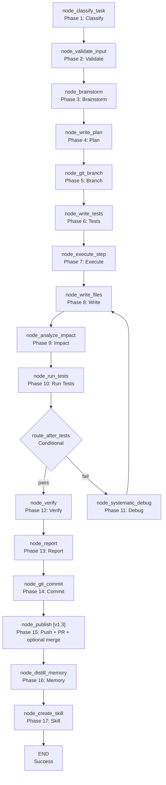

<- Back to [Autocode Overview](../AUTOCODE.md)

# 🏗️ Architecture

## 🔗 Source Code Reference

| File | Purpose |
|------|---------|
| `workflows/autocode.py` | `run_autocode_agent()` — main entry point |
| `workflows/autocode_impl/graph.py` | `build_graph()` — 17-node LangGraph StateGraph builder (was 18 in v1.3; **[v1.4]** removed dead `node_write_files_with_flag_reset` + dead `route_after_analyze_impact` conditional edge — see Dead Code section in CHANGELOG.md). **[v2.0]** `WORKFLOW_METADATA["version"]` bumped from `"1.4"` to `"2.0-alpha"`; `invoke_with_timeout()` (in `base.py`, called from the autocode facade) now wires the new `helpers.py` cancellation flag (`clear_cancellation()` at start, `request_cancellation()` on timeout). Graph topology unchanged in Phase 1+2 — still 17 nodes. |
| `workflows/autocode_impl/state.py` | `AutocodeState` — extended TypedDict with autocode-specific fields ([v1.3] added `pushed`, `pr_number`, `pr_url`, `swarm_verdict`; fixed TypedDict drift on `branch`). **[v2.0]** Adds 8 sub-state TypedDicts (`PlanState`, `TDDState`, `FilesState`, `ImpactState`, `DebugState`, `VerifyState`, `VCSState`, `MemoryState`) + 8 backward-compat accessor functions (`_get_plan`, `_get_tdd`, `_get_files`, `_get_impact`, `_get_debug`, `_get_verify`, `_get_vcs`, `_get_memory`). New `debug_history` field in `TDDState` (Phase 4 #37 placeholder — not yet populated). Legacy flat fields KEPT (removed in Phase 6). See "[v2.0] Sub-state Architecture" section below. |
| `workflows/autocode_impl/routes.py` | `route_after_classify()`, `route_after_write_files()`, `route_after_run_tests()`, `route_after_verify()` — conditional routing. **[v1.4]** `route_after_analyze_impact()` deleted (was always constant — replaced with direct edge `node_analyze_impact → node_run_tests` in graph.py). |
| `workflows/autocode_impl/helpers.py` | `_write_files()`, `_call()`, `_extract_code()`, `_parse_json()`, `_files_context()` — shared helpers. **[Pre-2.0 Fix]** `_call()` now retries 2× with exponential backoff (was single attempt — a rate-limit blip crashed the workflow). `tracer.error()` calls now use 3 args (tid, category, msg) not 2. **[v2.0]** `_parse_json()` now delegates to `core/json_extract.py` (consolidated JSON extraction — single source of truth). New cancellation flag: `request_cancellation()`, `clear_cancellation()`, `is_cancellation_requested()` — `_call()` checks the flag before each retry (aborts instead of sleeping through backoff if `invoke_with_timeout()` already timed out). |
| `core/json_extract.py` | **[v2.0] NEW FILE** — consolidated JSON extraction utility. 3 functions: `extract_json(text)`, `extract_json_array(text)`, `extract_first_json(text)`. Single source of truth for all LLM JSON parsing. `helpers._parse_json` and `router._extract_first_json` both delegate to this module (eliminates the historical split where helpers used markdown-fence-strip + `json.loads` and router used `json.JSONDecoder().raw_decode()`). |
| `workflows/autocode_impl/git_ops.py` | `_git_snapshot()`, `_git_create_branch()`, `_git_commit()` — local git operations (branch creation, commit) |
| `workflows/autocode_impl/github_ops.py` | **[v1.3]** `_github_pull()`, `_github_push()`, `_github_pr_create()`, `_github_pr_comment()`, `_github_pr_merge()`, `_swarm_debug_consensus()` — remote GitHub operations (lazy imports, `is_configured()` guards, tracer.step logging, structured returns) |
| `workflows/autocode_impl/patch.py` | `apply_patch()`, `apply_patches()`, `extract_relevant_sections()` — patch application |
| ~~`workflows/autocode_impl/mermaid.py`~~ | **[v1.4]** DELETED — never called (`WORKFLOW_METADATA` serves the same purpose for MCP clients). Found by: Kimi. |
| ~~`workflows/autocode_impl/test_mapper.py`~~ | **[v1.4]** DELETED — unused (analyze_impact imports from `core.kgraph.test_mapper`, not this module). Found by: Kimi. |
| ~~`workflows/autocode_impl/test_runner.py`~~ | **[v1.4]** DELETED — unused (`node_run_tests` has its own test execution logic). Found by: Kimi. |
| `workflows/autocode_impl/nodes/classify.py` | `node_classify_task()` — task classification |
| `workflows/autocode_impl/nodes/validate.py` | `node_validate_input()` — input validation |
| `workflows/autocode_impl/nodes/brainstorm.py` | `node_brainstorm()` — approach brainstorming |
| `workflows/autocode_impl/nodes/plan.py` | `node_write_plan()` — plan generation |
| `workflows/autocode_impl/nodes/branch.py` | `node_git_branch()` — git branch creation |
| `workflows/autocode_impl/nodes/tests.py` | `node_write_tests()` — test generation |
| `workflows/autocode_impl/nodes/execute.py` | `node_execute_step()` — plan step execution |
| `workflows/autocode_impl/nodes/write_files.py` | `node_write_files()` — file writing. **[Pre-2.0 Fix]** New `_is_path_safe()` helper validates LLM-generated paths against `base_path` using `Path.resolve().is_relative_to()` (was: only user input validated — LLM could emit `../../etc/passwd`). |
| `workflows/autocode_impl/nodes/run_tests.py` | `node_run_tests()` — test execution |
| `workflows/autocode_impl/nodes/analyze_impact.py` | `node_analyze_impact()` — blast radius analysis. **[v2.0]** `_run_async()` simplified from create/destroy event loop per call (`asyncio.new_event_loop` + `set_event_loop` + `run_until_complete` + `close`) to `asyncio.run(coro)`. Fixes the resource-leak risk flagged by 3 LLMs (DeepSeek, Kimi, MiMo) in the v1.4 cross-LLM review. No behavior change. |
| `workflows/autocode_impl/nodes/debug.py` | `node_systematic_debug()` — debug analysis |
| `workflows/autocode_impl/nodes/verify.py` | `node_verify()` — verification |
| `workflows/autocode_impl/nodes/commit.py` | `node_git_commit()` — git commit. **[v2.0]** First node migrated to the accessor pattern: reads `state["branch"]` via `_get_vcs(state, "branch", "main")` instead of `state.get("branch", "main")`. Proof-of-concept for the sub-state / legacy-fallback accessor layer (see "[v2.0] Sub-state Architecture" below). No behavior change — accessor returns the same value as the legacy path until Phase 6 removes the legacy fields. |
| `workflows/autocode_impl/nodes/publish.py` | **[v1.3]** `node_publish()` — push branch + create PR + optional auto-merge (all gated on config flags + `is_configured()`) |
| `workflows/autocode_impl/nodes/memory.py` | `node_distill_memory()` — procedural memory storage |
| `workflows/autocode_impl/nodes/create_skill.py` | `node_create_skill()` — skill creation |
| `workflows/autocode_impl/nodes/report.py` | `node_report()` — report generation |
| `workflows/base.py` | `WorkflowState`, `node_step()`, `node_error()`, `node_done()` — shared infrastructure |
| `tools/agent.py` | `agent(action="dispatch", role="...")` — LLM calls |
| `tools/git.py` | `git(action="snapshot")`, `git(action="commit")` — git operations |
| `tools/python.py` | `python(code=...)` — sandboxed Python execution |
| `tools/memory.py` | `memory.recall()`, `memory.store_procedural()` — memory operations |
| `tools/notify.py` | `notify(action="notify", message=...)` — user notification |
| `tools/report.py` | `report(action="report", title=...)` — report generation |
| `core/config.py` | `cfg.autocode_graph_timeout`, `cfg.autocode_max_retries`, etc. — config ([v1.3] added 6 GitHub/Swarm flags — all default OFF) |
| `core/utils.py` | `compress_result()` — result compression |
| `tools/github.py` | **[v1.3]** `github(action="pull"|"push"|"pr_create"|"pr_comment"|"pr_merge")` — remote GitHub operations used by `github_ops.py` helpers |
| `tools/swarm.py` | **[v1.3]** `swarm(action="consensus"|"vote")` — multi-model consultation used by `_swarm_debug_consensus()` |
| `tests/workflows/autocode/` | Per-concern test files + `conftest.py` (see Testing section below) |

---

## 🌳 Module Tree

```text
workflows/autocode.py
├── run_autocode_agent()              # Main entry point
│   ├── build_graph()                 # 17-node LangGraph StateGraph (was 18 in v1.3; [v1.4] removed dead node_write_files_with_flag_reset)
│   │   ├── node_classify_task()      # Phase 1: Classify task type
│   │   ├── node_validate_input()     # Phase 2: Validate input
│   │   ├── node_brainstorm()         # Phase 3: Brainstorm approach
│   │   ├── node_write_plan()         # Phase 4: Generate plan ([v1.4] branch name + trace_id suffix)
│   │   ├── node_git_branch()         # Phase 5: Create git branch ([v1.3] optional pull before)
│   │   ├── node_write_tests()        # Phase 6: Generate tests (TDD)
│   │   ├── node_execute_step()       # Phase 7: Execute plan step ([v1.4] uses _parse_json)
│   │   ├── node_write_files()        # Phase 8: Write/modify files ([v1.4] _is_path_safe guard)
│   │   ├── node_analyze_impact()     # Phase 9: Analyze blast radius
│   │   ├── node_run_tests()          # Phase 10: Run tests
│   │   ├── node_systematic_debug()   # Phase 11: Debug failures ([v1.3] optional swarm)
│   │   ├── node_verify()             # Phase 12: Verify changes ([v1.4] handles stuck + skip pytest if no tests + ruff scoped to modified_files)
│   │   ├── node_report()             # Phase 13: Generate report
│   │   ├── node_git_commit()         # Phase 14: Commit changes ([v1.4] .get("label", "step") fallback)
│   │   ├── node_publish()            # [v1.3] Phase 15: Push + PR + optional auto-merge
│   │   ├── node_distill_memory()     # Phase 16: Store procedural memory
│   │   └── node_create_skill()       # Phase 17: Create skill (if applicable) ([v1.4] atomic write)
│   └── tracer.finish()               # Mark trace complete
```

**[v1.3] Note on the publish node:** `node_publish` is registered in the graph
between `node_commit` and `node_distill_memory` via two new edges
(`node_commit → node_publish`, `node_publish → node_distill_memory`). With all
v1.3 config flags OFF (the default), `node_publish` is a no-op that returns `{}`
— autocode behaves identically to v1.2.

---

## 🔀 Dispatch Flow



**[v1.3] Edge change:** The v1.2 edge `node_commit → node_distill_memory` is
split into `node_commit → node_publish → node_distill_memory`. With all v1.3
config flags OFF, `node_publish` is a no-op (`return {}`) so the graph behaves
identically to v1.2. With `AUTOCODE_PUSH_ON_COMMIT=1` (+ optionally
`AUTOCODE_OPEN_PR` and `AUTOCODE_AUTO_MERGE`), `node_publish` calls the
matching `github_ops.py` helpers in sequence.

**[v1.4] Dead-code removal:** The dead `node_write_files_with_flag_reset`
node (was Phase 12, between `node_systematic_debug` and `node_run_tests`) is
deleted — it was registered but never wired (the debug loop edges to
`node_write_files` directly), and it reset `step_attempt` (a field that
doesn't exist in `AutocodeState`). The dead `route_after_analyze_impact`
conditional edge (was between `node_analyze_impact` and `node_run_tests`, but
always returned `"node_run_tests"`) is replaced with a direct edge. Graph now
has 17 nodes (was 18 in v1.3). See CHANGELOG.md § "Cross-LLM Review Findings
(Pre-2.0)" — found by MiMo and Kimi.

---

## 💡 Key Design Decisions

- **17-node LangGraph StateGraph** ([v1.4] was 18 in v1.3 — deleted dead `node_write_files_with_flag_reset`; [v1.3] was 17 in v1.2 — added `node_publish`) — The most complex workflow in the system. Each node has a specific responsibility.
- **Mode-driven** — The task type (fix_error, improve, add_feature, create_skill, unclear) determines the workflow path. The `node_classify_task` uses the Router LLM to classify the task.
- **TDD-first** — For `add_feature` and `improve` modes, tests are generated before implementation. This ensures test coverage.
- **Iterative debug loop** — If tests fail, the workflow enters a debug loop: `node_systematic_debug` → `node_write_files` → `node_analyze_impact` → `node_run_tests`. This loop repeats until tests pass, `MAX_RETRIES` (3) is exceeded, or `tdd_status == "stuck"` (same error signature on consecutive iterations — [Pre-2.0 Fix] `node_verify` now handles `"stuck"` correctly). [v1.3] `node_systematic_debug` can optionally use the swarm tool for a 2-run consensus → vote pattern (see `node_systematic_debug` in [API.md](API.md)). **[v1.4]** The intermediate `node_write_files_with_flag_reset` (was between `node_systematic_debug` and `node_run_tests`) is deleted as dead code — see Dead Code section in CHANGELOG.md.
- **Impact analysis** — `node_analyze_impact` analyzes the blast radius of changes using the dependency graph. This prevents unintended side effects.
- **Git integration** — `node_git_branch` creates a new branch ([v1.3] optionally pulls first via `AUTOCODE_PULL_BEFORE_BRANCH`), and `node_git_commit` commits changes with a descriptive message.
- **GitHub integration** — [v1.3] `node_publish` runs after `node_git_commit` to push the branch, open a PR, and optionally auto-merge — all gated on config flags and `is_configured()`. See `github_ops.py` for the helper layer.
- **Memory integration** — `node_distill_memory` stores procedural knowledge (e.g., "how to fix timeout errors") for future recall.
- **Skill creation** — `node_create_skill` creates a reusable skill file for the agent. This enables the agent to learn from experience.
- **Filelock + atomic writes** — `node_write_files` uses `FileLock` and atomic writes (`tempfile.NamedTemporaryFile` + `os.replace`) to prevent race conditions and data corruption.
- **Result compression** — The final result is compressed via `compress_result()` before being returned.

---

## 🧭 [v1.3] Design Decision Notes

The v1.3 GitHub + Swarm integration introduces four deliberate design choices
that should be preserved during future edits. Each is marked `# TODO(2.0):`
in the source code where the 2.0 refactor may revisit it.

1. **`node_publish` is a separate node — NOT folded into `node_commit`.**
   - **Why separate:** `node_commit` is local-only and always runs (TDD code is committed even on failure). `node_publish` is opt-in (config flags), remote-touching, and may fail (network, GitHub API, permissions). Folding them would couple commit failure semantics with publish failure semantics. Keeping them separate means: (a) a push failure does NOT undo the commit, (b) the publish step can be skipped in dry_run / needs_clarification / failed / skipped states independently, (c) the graph topology stays self-documenting (the mermaid diagram shows the publish step).
   - **Source:** `workflows/autocode_impl/nodes/publish.py` (top docstring).
   - `# TODO(2.0):` Consider splitting `node_publish` further into `node_push`, `node_pr_create`, `node_pr_merge` for finer-grained routing and retry (see CHANGELOG.md § 2.0 Review Notes).

2. **`github_ops.py` is a separate module from `git_ops.py`.**
   - **Why separate:** `git_ops.py` wraps the local `git` tool (no network, no auth, no env vars required). `github_ops.py` wraps the remote `github` tool (requires `GITHUB_TOKEN` + `GITHUB_OWNER` + `GITHUB_REPO`, network-dependent, may graceful-skip via `is_configured()`). They have different failure modes and different availability requirements. Mixing them would force every autocode call to import the github tool even when only local git is needed.
   - **Pattern:** Both modules follow the same shape — lazy import inside each helper, `project_root`/`tid` params, `tracer.step()` for observability, structured returns (`bool` / `dict | None`) — so they look alike but live apart.
   - **Source:** `workflows/autocode_impl/github_ops.py` (top docstring).
   - `# TODO(2.0):` Consider merging `git_ops.py` + `github_ops.py` into a unified `vcs_ops.py` module (see CHANGELOG.md § 2.0 Review Notes).

3. **Swarm debug is non-blocking — the fix always applies, regardless of confidence.**
   - **Why non-blocking:** The debug loop already has its own safety net (`MAX_RETRIES`, stuck-detection routing in `route_after_run_tests`, the `node_verify` gate, the git branch). Adding a swarm-confidence gate would block the loop on a multi-LLM vote that may itself fail or take minutes. The swarm verdict is captured in `state.swarm_verdict` and surfaced in the PR body (and, for LOW confidence, optionally as a PR comment) so human reviewers see the disagreement without the workflow stalling.
   - **Confidence map:** `unanimous → HIGH`, `majority → MEDIUM`, `split`/`disagreement`/unknown → `LOW`.
   - **Source:** `workflows/autocode_impl/nodes/debug.py` (top docstring), `_swarm_debug_consensus()` in `github_ops.py`.
   - `# TODO(2.0):` Consider `AUTOCODE_SWARM_BLOCK_ON_LOW_CONFIDENCE` flag for stricter gating, and review confidence thresholds (e.g., MEDIUM should require ≥3 providers).

4. **All 6 new v1.3 config flags default OFF.**
   - **Why default OFF:** Backward compatibility. With all flags OFF, `node_publish` returns `{}`, `_github_pull()` returns `False`, `_swarm_debug_consensus()` is never invoked — autocode v1.3 is byte-for-byte behaviorally identical to v1.2 unless the operator explicitly opts in. This means the v1.3 release is safe to deploy to existing installations with no `.env` changes.
   - **The 6 flags:** `AUTOCODE_PULL_BEFORE_BRANCH`, `AUTOCODE_PUSH_ON_COMMIT`, `AUTOCODE_OPEN_PR`, `AUTOCODE_AUTO_MERGE`, `AUTOCODE_DEBUG_COMMENT_PR`, `AUTOCODE_SWARM_DEBUG` (see `core/config.py` lines 341-346).
   - `# TODO(2.0):` Consider per-task overrides (e.g., different PR strategy for different task types) rather than global flags.

---

## 🧭 [v1.4] Pre-2.0 Hardening Notes

The v1.4 release is a hardening + dead-code-cleanup pass based on a cross-LLM
review (DeepSeek, Qwen, MiMo, Kimi — see CHANGELOG.md § "Cross-LLM Review
Findings (Pre-2.0)"). It contains **no new features and no new config flags** —
all changes are bug fixes, security guards, and deletions. Each fix is marked
`[Pre-2.0 Fix]` in the source and referenced in this section so future editors
can trace the rationale.

1. **`_is_path_safe()` guards LLM-generated paths in `node_write_files`.**
   - **Why:** [Pre-2.0 Fix] The existing path traversal check in `node_validate_input` only covered user-supplied paths. LLM-generated `patches[].path` and `new_files{}` keys were written directly to `base_path / rel_path` with no validation — an LLM hallucination like `"../../etc/passwd"` would escape `base_path`.
   - **Fix:** New `_is_path_safe(base_path, rel_path) -> bool` helper in `nodes/write_files.py` uses `Path.resolve().is_relative_to()` to verify the resolved target stays inside `base_path`. Called for both patch targets and new-file targets.
   - **Source:** `workflows/autocode_impl/nodes/write_files.py` (lines 16-40 + 2 call sites).
   - **Found by:** Qwen (P0.1). See CHANGELOG.md.
   - `# TODO(2.0):` Consider centralizing all path-safety checks in `core/path_guard.py` so nodes don't each roll their own.

2. **`_call()` retries 2× with exponential backoff in `helpers.py`.**
   - **Why:** [Pre-2.0 Fix] A single rate-limit blip or transient network error from the LLM provider crashed the entire autocode workflow. There was no retry.
   - **Fix:** `_call(role, system, user, ..., retries=2)` now loops `retries + 1` times, sleeping `2 ** attempt` seconds between attempts (1s, 2s, 4s). On final failure it raises the last exception after logging via `tracer.error(tid, "llm_call", ...)` (also fixed: was 2 args, now 3).
   - **Source:** `workflows/autocode_impl/helpers.py` (lines 72-106).
   - **Found by:** MiMo (P2.6) + Qwen (P1.4, the tracer.error signature). See CHANGELOG.md.
   - `# TODO(2.0):` Consider making `retries` configurable per role (planner may tolerate more retries than executor).

3. **Branch name now includes `trace_id` suffix for uniqueness.**
   - **Why:** [Pre-2.0 Fix] Two runs with the same `task` produced the same `autocode/{slug}` branch name. The second run would check out the first run's branch and cross-contaminate git history.
   - **Fix:** `node_write_plan` now appends `-{tid_suffix}` where `tid_suffix = tid.replace("-", "")[:8]` (first 8 hex chars of trace_id, dashes stripped). Format: `autocode/{slug}-{tid_suffix}`.
   - **Source:** `workflows/autocode_impl/nodes/plan.py` (lines 73-78).
   - **Found by:** MiMo + Kimi (P2). See CHANGELOG.md.
   - `# TODO(2.0):` Consider making this configurable — some operators may want reusable branches across runs.

4. **Dead-code deletions — do NOT re-add.**
   - **`node_write_files_with_flag_reset`** — was a thin wrapper around `node_write_files` that reset `step_attempt` (a field that doesn't exist in `AutocodeState`). Registered in the graph but never wired (debug loop edges to `node_write_files` directly). Deleted from `nodes/write_files.py`, `graph.py` (add_node + WORKFLOW_METADATA nodes list).
   - **`route_after_analyze_impact`** — was a conditional router that always returned `"node_run_tests"`. Replaced with `workflow.add_edge("node_analyze_impact", "node_run_tests")` direct edge in `graph.py`.
   - **`"node_brainstorm"` mapping** in `route_after_classify` — `route_after_classify` never returns `"node_brainstorm"` (always routes to `node_validate_input` first). Removed from the conditional_edges mapping dict.
   - **`mermaid.py`** — never called by any node, route, or test. `WORKFLOW_METADATA` serves the same purpose for MCP clients.
   - **`test_mapper.py`** — unused (analyze_impact imports from `core.kgraph.test_mapper`, not this local copy).
   - **`test_runner.py`** — unused (`node_run_tests` has its own test execution logic).
   - **Found by:** Kimi (mermaid/test_mapper/test_runner), MiMo (route_after_analyze_impact + node_brainstorm mapping). See CHANGELOG.md § "Dead code" entries.
   - `# TODO(2.0):` Consider an import-time lint check that flags any registered-but-not-wired node or any conditional_edges mapping key that the route function never returns.

---

## 🧭 [v2.0] Sub-state Architecture

The v2.0-alpha release introduces a backward-compatible accessor layer over the
`AutocodeState` TypedDict. The goal is to migrate autocode from a flat ~35-field
state dict to 8 focused sub-state TypedDicts without breaking any existing node or
test in a single big-bang refactor. The migration is sequenced across the 7-phase
plan (see CHANGELOG.md § "2.0 Refactor Progress"); only Phase 1 + Phase 2 ship in
v2.0-alpha.

### The 8 sub-state TypedDicts

| Sub-state | TypedDict | Representative fields (legacy flat equivalents in parens) |
|-----------|-----------|----------------------------------------------------------|
| Plan | `PlanState` | `task_type`, `plan`, `branch`, `current_step` |
| TDD | `TDDState` | `test_code`, `test_results`, `tdd_status`, `tdd_iteration`, `debug_history` **[v2.0] new** (Phase 4 #37 placeholder — not yet populated) |
| Files | `FilesState` | `files`, `modified_files`, `written_files`, `files_map` |
| Impact | `ImpactState` | `impact_warnings`, `blast_radius_note` |
| Debug | `DebugState` | `root_cause`, `defense_notes`, `tdd_source_code`, `debug_notes`, `swarm_verdict` |
| Verify | `VerifyState` | `lint_passed`, `lint_output`, `regression_passed`, `evidence_outputs`, `verification_passed`, `verification_notes` |
| VCS | `VCSState` | `branch`, `commit_sha`, `pushed`, `pr_number`, `pr_url` |
| Memory | `MemoryState` | `brainstorm`, `skill_path`, `skill_created` |

### The 8 backward-compat accessor functions

Each accessor reads from the corresponding sub-state dict (e.g., `state["vcs"]`) if
present, else falls back to the legacy flat field (e.g., `state["branch"]`). The
legacy flat fields are **KEPT** in `AutocodeState` for the duration of the refactor
and removed only in Phase 6 after every node has migrated.

```python
# Signature pattern (state.py)
def _get_vcs(state: dict, key: str, default=None):
    """Read `key` from state["vcs"] if present, else fall back to state[key]."""
    vcs = state.get("vcs")
    if isinstance(vcs, dict) and key in vcs:
        return vcs[key]
    return state.get(key, default)
```

The 8 accessors: `_get_plan`, `_get_tdd`, `_get_files`, `_get_impact`, `_get_debug`,
`_get_verify`, `_get_vcs`, `_get_memory`.

### Why an accessor layer (instead of just rewriting state shape)

1. **No big-bang refactor.** Every node currently does `state.get("branch")`,
   `state.get("test_results")`, etc. Switching all 17 nodes in one commit would be
   unreviewable and would break tests across the suite. The accessor layer lets us
   migrate one node at a time — each migration is a small, reviewable diff.
2. **Legacy fallback buys time.** Until Phase 6, both the legacy flat fields and
   the new sub-state dicts coexist. An unmigrated node reading `state["branch"]`
   still works whether the upstream writer used the legacy flat field or the new
   `state["vcs"]["branch"]` shape — the accessor always returns the right value.
3. **Phase 4 unblock.** The new `debug_history` field in `TDDState` is the
   placeholder for #37 (context summarization). Declaring it now (in Phase 2) lets
   Phase 4 wire `node_systematic_debug` to accumulate history without another
   state-shape change.
4. **Trivial Phase 6 cleanup.** Once all nodes call accessors, removing the legacy
   flat fields + the fallback branches in the accessors is a mechanical diff.

### `node_commit` is the proof-of-concept

`node_git_commit` (Phase 14) is the **first node migrated to accessors** — it reads
`state["branch"]` via `_get_vcs(state, "branch", "main")` instead of
`state.get("branch", "main")`. Chosen because:

- It reads exactly one field (`branch`) — smallest possible migration diff.
- It runs late in the graph (Phase 14) so any breakage is caught late in the run,
  not early (easy to bisect).
- The fallback default `"main"` exercises the accessor's default-parameter path.

Other nodes continue to read legacy flat fields directly until Phase 3 migrates
them as part of the `node_write_files` / `node_verify` splits.

`# TODO(2.0):` Migrate remaining 16 nodes to accessors during Phase 3 (node splits)
and Phase 4 (debug history). Phase 6 removes the legacy flat fields + the accessor
fallback branches.

### Cancellation flag (Phase 1)

Phase 1 also adds a module-level cancellation flag to `helpers.py` — not strictly
part of the sub-state architecture, but it shares the "buy time until Phase 7"
philosophy:

```python
# helpers.py
def request_cancellation() -> None: ...
def clear_cancellation() -> None: ...
def is_cancellation_requested() -> bool: ...
```

`_call()` checks `is_cancellation_requested()` before each retry — if
`invoke_with_timeout()` already timed out and called `request_cancellation()`,
the in-flight LLM call aborts instead of sleeping through exponential backoff.
This is a partial mitigation for #35 (daemon-thread zombie risk); full
process-level termination lands in Phase 7.

`# TODO(2.0):` Phase 7 will replace the in-process flag with
`concurrent.futures` / `multiprocessing` for hard termination. The flag may be
removed at that point.

---

## 🧪 Testing

```powershell
# Run autocode tests
.\venv\Scripts\python tests/workflows/autocode/ -W error --tb=short -v
```

> **Note:** Ensure `pytest` resolves to your venv. If not, use `python -m pytest` or the full venv path (`venv\Scripts\pytest.exe` on Windows, `venv/bin/pytest` on Unix).

**Mock strategy:**
- Patch `llm.complete(role="router")` for classification
- Patch `llm.complete(role="planner")` for planning and brainstorming
- Patch `llm.complete(role="executor")` for code generation and debug
- Patch `llm.complete(role="test")` for test generation
- Patch `git(action="snapshot")` and `git(action="commit")` for git operations
- Patch `python(code=...)` for test execution
- Patch `memory.recall()` and `memory.store_procedural()` for memory operations
- Patch `report(action="report")` for report generation
- Patch `notify(action="notify")` for notification
- Test `node_classify_task` with mode override → assert correct task_type
- Test `node_validate_input` with invalid path → assert error state
- Test `node_brainstorm` with KG files → assert merged files (**[Pre-2.0 Fix]** KG files are now in the LLM prompt — was: merged AFTER the call, brainstorm never saw them)
- Test `node_write_plan` with fallback → assert 3-step plan
- Test `node_git_branch` with snapshot failure → assert graceful handling
- Test `node_write_tests` with code extraction → assert test_code list
- Test `node_execute_step` with non-JSON code → assert modified_files fallback
- Test `node_write_files` with patch → assert atomic write
- Test `node_analyze_impact` with empty files_map → assert early return (currently broken)
- Test `node_run_tests` with missing test files → assert error state
- Test `node_systematic_debug` with max retries → assert failure state
- Test `node_verify` with missing ruff → assert `lint_passed=None` ([P1 #7] was `True`; **[Pre-2.0 Fix]** `node_verify` also handles `tdd_status="stuck"` and skips pytest when no test files exist)
- Test `node_git_commit` with no changes → assert skipped state
- Test `node_distill_memory` with missing hypothesis → assert graceful handling
- Test `node_create_skill` with invalid name → assert error state

**Test layout (per-concern, one concern per file):**
```text
tests/workflows/autocode/
├── conftest.py            # base_state + temp_workspace fixtures
├── test_graph.py          # topology + WORKFLOW_METADATA + singleton + state schema + partial-dict
├── test_routes.py         # all 5 route_after_* functions + #39 stuck routing
├── test_facade.py         # imports + run_workflow + #44 artifacts + #46 git-diff + #47 dry-run + distill
├── test_execute.py        # node_execute_step + node_write_files + .bak checks
├── test_run_tests.py      # #39 stuck detection + file-existence + budget wiring
├── test_debug.py          # debug loop routing + JSON parsing + max-retries
├── test_verify.py         # node_verify + lint + commit + defense_notes
├── test_branch.py         # node_git_branch + git scoping + dry-run + no-snapshot
├── test_create_skill.py   # name sanitization + syntax validation + skill_created flag
├── test_helpers.py        # path helpers + patch + protected files + path traversal
├── test_safety.py         # dry-run mode + protected files + memory callbacks + TDD loop + dead routes
└── test_analyze_impact.py # AST parser
```

---

*Last updated: 2026-07-11 (v2.0-alpha — 2.0 refactor Phase 1 + Phase 2: new `core/json_extract.py` row in Source Code Reference; `helpers.py` row updated with cancellation flag + `_parse_json` delegation; `analyze_impact.py` row updated with `_run_async` simplification; `state.py` row updated with sub-state TypedDicts + accessors; `commit.py` row updated with `_get_vcs` migration; new "[v2.0] Sub-state Architecture" section documenting the backward-compat accessor pattern + cancellation flag; graph structure unchanged — 17 nodes. See [API](API.md) for node details, [CHANGELOG.md](CHANGELOG.md) for version history + 7-phase refactor progress, [INSTRUCTIONS.md](INSTRUCTIONS.md) for AI editing rules).*
