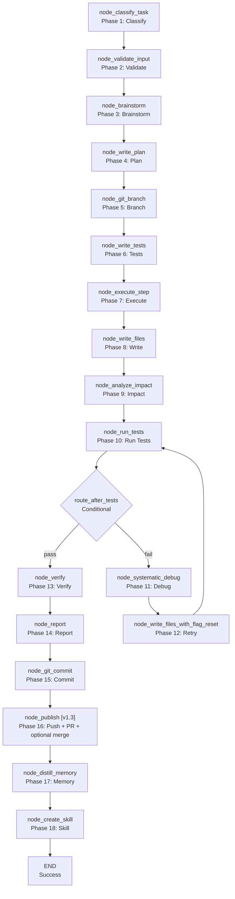

<- Back to [Autocode Overview](../AUTOCODE.md)

# 🏗️ Architecture

## 🔗 Source Code Reference

| File | Purpose |
|------|---------|
| `workflows/autocode.py` | `run_autocode_agent()` — main entry point |
| `workflows/autocode_impl/graph.py` | `build_graph()` — 18-node LangGraph StateGraph builder (was 17 in v1.2; [v1.3] added `node_publish`) |
| `workflows/autocode_impl/state.py` | `AutocodeState` — extended TypedDict with autocode-specific fields ([v1.3] added `pushed`, `pr_number`, `pr_url`, `swarm_verdict`; fixed TypedDict drift on `branch`) |
| `workflows/autocode_impl/routes.py` | `route_after_classify()`, `route_after_tests()` — conditional routing |
| `workflows/autocode_impl/helpers.py` | `_write_files()`, `_call()`, `_extract_code()`, `_parse_json()`, `_files_context()` — shared helpers |
| `workflows/autocode_impl/git_ops.py` | `_git_snapshot()`, `_git_create_branch()`, `_git_commit()` — local git operations (branch creation, commit) |
| `workflows/autocode_impl/github_ops.py` | **[v1.3]** `_github_pull()`, `_github_push()`, `_github_pr_create()`, `_github_pr_comment()`, `_github_pr_merge()`, `_swarm_debug_consensus()` — remote GitHub operations (lazy imports, `is_configured()` guards, tracer.step logging, structured returns) |
| `workflows/autocode_impl/patch.py` | `apply_patch()`, `apply_patches()`, `extract_relevant_sections()` — patch application |
| `workflows/autocode_impl/mermaid.py` | `export_mermaid()` — mermaid diagram export |
| `workflows/autocode_impl/test_mapper.py` | `get_targeted_tests()`, `_build_test_index()` — test mapping |
| `workflows/autocode_impl/test_runner.py` | `run_tests_on_disk()` — test execution |
| `workflows/autocode_impl/nodes/classify.py` | `node_classify_task()` — task classification |
| `workflows/autocode_impl/nodes/validate.py` | `node_validate_input()` — input validation |
| `workflows/autocode_impl/nodes/brainstorm.py` | `node_brainstorm()` — approach brainstorming |
| `workflows/autocode_impl/nodes/plan.py` | `node_write_plan()` — plan generation |
| `workflows/autocode_impl/nodes/branch.py` | `node_git_branch()` — git branch creation |
| `workflows/autocode_impl/nodes/tests.py` | `node_write_tests()` — test generation |
| `workflows/autocode_impl/nodes/execute.py` | `node_execute_step()` — plan step execution |
| `workflows/autocode_impl/nodes/write_files.py` | `node_write_files()` — file writing |
| `workflows/autocode_impl/nodes/run_tests.py` | `node_run_tests()` — test execution |
| `workflows/autocode_impl/nodes/analyze_impact.py` | `node_analyze_impact()` — blast radius analysis |
| `workflows/autocode_impl/nodes/debug.py` | `node_systematic_debug()` — debug analysis |
| `workflows/autocode_impl/nodes/verify.py` | `node_verify()` — verification |
| `workflows/autocode_impl/nodes/commit.py` | `node_git_commit()` — git commit |
| `workflows/autocode_impl/nodes/publish.py` | **[v1.3]** `node_publish()` — push branch + create PR + optional auto-merge (all gated on config flags + `is_configured()`) |
| `workflows/autocode_impl/nodes/memory.py` | `node_distill_memory()` — procedural memory storage |
| `workflows/autocode_impl/nodes/create_skill.py` | `node_create_skill()` — skill creation |
| `workflows/autocode_impl/nodes/report.py` | `node_report()` — report generation |
| `workflows/base.py` | `WorkflowState`, `node_step()`, `node_error()`, `node_done()` — shared infrastructure |
| `tools/agent.py` | `agent(action="dispatch", role="...")` — LLM calls |
| `tools/git.py` | `git(action="snapshot")`, `git(action="commit")` — git operations |
| `tools/python.py` | `python(code=...)` — sandboxed Python execution |
| `tools/memory.py` | `memory.recall()`, `memory.store_procedural()` — memory operations |
| `tools/notify.py` | `notify(action="notify", message=...)` — user notification |
| `tools/report.py` | `report(action="report", title=...)` — report generation |
| `core/config.py` | `cfg.autocode_graph_timeout`, `cfg.autocode_max_retries`, etc. — config ([v1.3] added 6 GitHub/Swarm flags — all default OFF) |
| `core/utils.py` | `compress_result()` — result compression |
| `tools/github.py` | **[v1.3]** `github(action="pull"|"push"|"pr_create"|"pr_comment"|"pr_merge")` — remote GitHub operations used by `github_ops.py` helpers |
| `tools/swarm.py` | **[v1.3]** `swarm(action="consensus"|"vote")` — multi-model consultation used by `_swarm_debug_consensus()` |
| `tests/workflows/autocode/` | Per-concern test files + `conftest.py` (see Testing section below) |

---

## 🌳 Module Tree

```text
workflows/autocode.py
├── run_autocode_agent()              # Main entry point
│   ├── build_graph()                 # 18-node LangGraph StateGraph (was 17 in v1.2)
│   │   ├── node_classify_task()      # Phase 1: Classify task type
│   │   ├── node_validate_input()     # Phase 2: Validate input
│   │   ├── node_brainstorm()         # Phase 3: Brainstorm approach
│   │   ├── node_write_plan()         # Phase 4: Generate plan
│   │   ├── node_git_branch()         # Phase 5: Create git branch ([v1.3] optional pull before)
│   │   ├── node_write_tests()        # Phase 6: Generate tests (TDD)
│   │   ├── node_execute_step()       # Phase 7: Execute plan step
│   │   ├── node_write_files()        # Phase 8: Write/modify files
│   │   ├── node_analyze_impact()     # Phase 9: Analyze blast radius
│   │   ├── node_run_tests()          # Phase 10: Run tests
│   │   ├── node_systematic_debug()   # Phase 11: Debug failures ([v1.3] optional swarm)
│   │   ├── node_write_files_with_flag_reset()  # Phase 12: Retry with fix
│   │   ├── node_verify()             # Phase 13: Verify changes
│   │   ├── node_report()             # Phase 14: Generate report
│   │   ├── node_git_commit()         # Phase 15: Commit changes
│   │   ├── node_publish()            # [v1.3] Phase 16: Push + PR + optional auto-merge
│   │   ├── node_distill_memory()     # Phase 17: Store procedural memory
│   │   └── node_create_skill()       # Phase 18: Create skill (if applicable)
│   └── tracer.finish()               # Mark trace complete
```

**[v1.3] Note on the publish node:** `node_publish` is registered in the graph
between `node_commit` and `node_distill_memory` via two new edges
(`node_commit → node_publish`, `node_publish → node_distill_memory`). With all
v1.3 config flags OFF (the default), `node_publish` is a no-op that returns `{}`
— autocode behaves identically to v1.2.

---

## 🔀 Dispatch Flow



**[v1.3] Edge change:** The v1.2 edge `node_commit → node_distill_memory` is
split into `node_commit → node_publish → node_distill_memory`. With all v1.3
config flags OFF, `node_publish` is a no-op (`return {}`) so the graph behaves
identically to v1.2. With `AUTOCODE_PUSH_ON_COMMIT=1` (+ optionally
`AUTOCODE_OPEN_PR` and `AUTOCODE_AUTO_MERGE`), `node_publish` calls the
matching `github_ops.py` helpers in sequence.

---

## 💡 Key Design Decisions

- **18-node LangGraph StateGraph** ([v1.3] was 17 in v1.2 — added `node_publish`) — The most complex workflow in the system. Each node has a specific responsibility.
- **Mode-driven** — The task type (fix_error, improve, add_feature, create_skill, unclear) determines the workflow path. The `node_classify_task` uses the Router LLM to classify the task.
- **TDD-first** — For `add_feature` and `improve` modes, tests are generated before implementation. This ensures test coverage.
- **Iterative debug loop** — If tests fail, the workflow enters a debug loop: `node_systematic_debug` → `node_write_files_with_flag_reset` → `node_run_tests`. This loop repeats until tests pass or `MAX_RETRIES` (3) is exceeded. [v1.3] `node_systematic_debug` can optionally use the swarm tool for a 2-run consensus → vote pattern (see `node_systematic_debug` in [API.md](API.md)).
- **Impact analysis** — `node_analyze_impact` analyzes the blast radius of changes using the dependency graph. This prevents unintended side effects.
- **Git integration** — `node_git_branch` creates a new branch ([v1.3] optionally pulls first via `AUTOCODE_PULL_BEFORE_BRANCH`), and `node_git_commit` commits changes with a descriptive message.
- **GitHub integration** — [v1.3] `node_publish` runs after `node_git_commit` to push the branch, open a PR, and optionally auto-merge — all gated on config flags and `is_configured()`. See `github_ops.py` for the helper layer.
- **Memory integration** — `node_distill_memory` stores procedural knowledge (e.g., "how to fix timeout errors") for future recall.
- **Skill creation** — `node_create_skill` creates a reusable skill file for the agent. This enables the agent to learn from experience.
- **Filelock + atomic writes** — `node_write_files` uses `FileLock` and atomic writes (`tempfile.NamedTemporaryFile` + `os.replace`) to prevent race conditions and data corruption.
- **Result compression** — The final result is compressed via `compress_result()` before being returned.

---

## 🧭 [v1.3] Design Decision Notes

The v1.3 GitHub + Swarm integration introduces four deliberate design choices
that should be preserved during future edits. Each is marked `# TODO(2.0):`
in the source code where the 2.0 refactor may revisit it.

1. **`node_publish` is a separate node — NOT folded into `node_commit`.**
   - **Why separate:** `node_commit` is local-only and always runs (TDD code is committed even on failure). `node_publish` is opt-in (config flags), remote-touching, and may fail (network, GitHub API, permissions). Folding them would couple commit failure semantics with publish failure semantics. Keeping them separate means: (a) a push failure does NOT undo the commit, (b) the publish step can be skipped in dry_run / needs_clarification / failed / skipped states independently, (c) the graph topology stays self-documenting (the mermaid diagram shows the publish step).
   - **Source:** `workflows/autocode_impl/nodes/publish.py` (top docstring).
   - `# TODO(2.0):` Consider splitting `node_publish` further into `node_push`, `node_pr_create`, `node_pr_merge` for finer-grained routing and retry (see CHANGELOG.md § 2.0 Review Notes).

2. **`github_ops.py` is a separate module from `git_ops.py`.**
   - **Why separate:** `git_ops.py` wraps the local `git` tool (no network, no auth, no env vars required). `github_ops.py` wraps the remote `github` tool (requires `GITHUB_TOKEN` + `GITHUB_OWNER` + `GITHUB_REPO`, network-dependent, may graceful-skip via `is_configured()`). They have different failure modes and different availability requirements. Mixing them would force every autocode call to import the github tool even when only local git is needed.
   - **Pattern:** Both modules follow the same shape — lazy import inside each helper, `project_root`/`tid` params, `tracer.step()` for observability, structured returns (`bool` / `dict | None`) — so they look alike but live apart.
   - **Source:** `workflows/autocode_impl/github_ops.py` (top docstring).
   - `# TODO(2.0):` Consider merging `git_ops.py` + `github_ops.py` into a unified `vcs_ops.py` module (see CHANGELOG.md § 2.0 Review Notes).

3. **Swarm debug is non-blocking — the fix always applies, regardless of confidence.**
   - **Why non-blocking:** The debug loop already has its own safety net (`MAX_RETRIES`, stuck-detection routing in `route_after_run_tests`, the `node_verify` gate, the git branch). Adding a swarm-confidence gate would block the loop on a multi-LLM vote that may itself fail or take minutes. The swarm verdict is captured in `state.swarm_verdict` and surfaced in the PR body (and, for LOW confidence, optionally as a PR comment) so human reviewers see the disagreement without the workflow stalling.
   - **Confidence map:** `unanimous → HIGH`, `majority → MEDIUM`, `split`/`disagreement`/unknown → `LOW`.
   - **Source:** `workflows/autocode_impl/nodes/debug.py` (top docstring), `_swarm_debug_consensus()` in `github_ops.py`.
   - `# TODO(2.0):` Consider `AUTOCODE_SWARM_BLOCK_ON_LOW_CONFIDENCE` flag for stricter gating, and review confidence thresholds (e.g., MEDIUM should require ≥3 providers).

4. **All 6 new v1.3 config flags default OFF.**
   - **Why default OFF:** Backward compatibility. With all flags OFF, `node_publish` returns `{}`, `_github_pull()` returns `False`, `_swarm_debug_consensus()` is never invoked — autocode v1.3 is byte-for-byte behaviorally identical to v1.2 unless the operator explicitly opts in. This means the v1.3 release is safe to deploy to existing installations with no `.env` changes.
   - **The 6 flags:** `AUTOCODE_PULL_BEFORE_BRANCH`, `AUTOCODE_PUSH_ON_COMMIT`, `AUTOCODE_OPEN_PR`, `AUTOCODE_AUTO_MERGE`, `AUTOCODE_DEBUG_COMMENT_PR`, `AUTOCODE_SWARM_DEBUG` (see `core/config.py` lines 341-346).
   - `# TODO(2.0):` Consider per-task overrides (e.g., different PR strategy for different task types) rather than global flags.

---

## 🧪 Testing

```powershell
# Run autocode tests
.\venv\Scripts\python tests/workflows/autocode/ -W error --tb=short -v
```

> **Note:** Ensure `pytest` resolves to your venv. If not, use `python -m pytest` or the full venv path (`venv\Scripts\pytest.exe` on Windows, `venv/bin/pytest` on Unix).

**Mock strategy:**
- Patch `llm.complete(role="router")` for classification
- Patch `llm.complete(role="planner")` for planning and brainstorming
- Patch `llm.complete(role="executor")` for code generation and debug
- Patch `llm.complete(role="test")` for test generation
- Patch `git(action="snapshot")` and `git(action="commit")` for git operations
- Patch `python(code=...)` for test execution
- Patch `memory.recall()` and `memory.store_procedural()` for memory operations
- Patch `report(action="report")` for report generation
- Patch `notify(action="notify")` for notification
- Test `node_classify_task` with mode override → assert correct task_type
- Test `node_validate_input` with invalid path → assert error state
- Test `node_brainstorm` with KG files → assert merged files (currently broken)
- Test `node_write_plan` with fallback → assert 3-step plan
- Test `node_git_branch` with snapshot failure → assert graceful handling
- Test `node_write_tests` with code extraction → assert test_code list
- Test `node_execute_step` with non-JSON code → assert modified_files fallback
- Test `node_write_files` with patch → assert atomic write
- Test `node_analyze_impact` with empty files_map → assert early return (currently broken)
- Test `node_run_tests` with missing test files → assert error state
- Test `node_systematic_debug` with max retries → assert failure state
- Test `node_verify` with missing ruff → assert lint_passed=False (currently True)
- Test `node_git_commit` with no changes → assert skipped state
- Test `node_distill_memory` with missing hypothesis → assert graceful handling
- Test `node_create_skill` with invalid name → assert error state

**Test layout (per-concern, one concern per file):**
```text
tests/workflows/autocode/
├── conftest.py            # base_state + temp_workspace fixtures
├── test_graph.py          # topology + WORKFLOW_METADATA + singleton + state schema + partial-dict
├── test_routes.py         # all 5 route_after_* functions + #39 stuck routing
├── test_facade.py         # imports + run_workflow + #44 artifacts + #46 git-diff + #47 dry-run + distill
├── test_execute.py        # node_execute_step + node_write_files + .bak checks
├── test_run_tests.py      # #39 stuck detection + file-existence + budget wiring
├── test_debug.py          # debug loop routing + JSON parsing + max-retries
├── test_verify.py         # node_verify + lint + commit + defense_notes
├── test_branch.py         # node_git_branch + git scoping + dry-run + no-snapshot
├── test_create_skill.py   # name sanitization + syntax validation + skill_created flag
├── test_helpers.py        # path helpers + patch + protected files + path traversal
├── test_safety.py         # dry-run mode + protected files + memory callbacks + TDD loop + dead routes
└── test_analyze_impact.py # AST parser
```

---

*Last updated: 2026-07-10 (v1.3 — `node_publish` + `github_ops.py` + swarm debug + 6 new flags; 17 → 18 nodes). See [API](API.md) for node details, [CHANGELOG.md](CHANGELOG.md) for version history, [INSTRUCTIONS.md](INSTRUCTIONS.md) for AI editing rules.*
