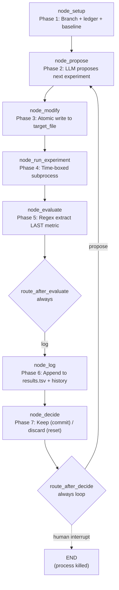

<- Back to [Autoresearch Overview](../AUTORESEARCH.md)

# 🏗️ Architecture

## 🔗 Source Code Reference

| File | Purpose |
|------|---------|
| `workflows/autoresearch.py` | Thin facade — re-exports `build_autoresearch_graph` + `WORKFLOW_METADATA`. No business logic. |
| `workflows/autoresearch_impl/__init__.py` | Empty package init. |
| `workflows/autoresearch_impl/state.py` | `AutoresearchState` TypedDict (extends `WorkflowState`, `total=False`) + `_default_state()` factory. |
| `workflows/autoresearch_impl/graph.py` | `build_autoresearch_graph()` — 7-node LangGraph StateGraph builder. `WORKFLOW_METADATA` dict (version `"1.0"`). |
| `workflows/autoresearch_impl/routes.py` | `route_after_evaluate` (always → log) + `route_after_decide` (always → propose — the infinite loop back-edge). |
| `workflows/autoresearch_impl/nodes/setup.py` | `node_setup` — git branch + `results.tsv` ledger + baseline experiment. Hosts `_run_experiment_subprocess`, `_extract_metric_from_output`, `_git_create_branch`. |
| `workflows/autoresearch_impl/nodes/propose.py` | `node_propose` — LLM planner call (via `autocode_impl.helpers._call`). Hosts `_PROPOSE_SYSTEM` prompt, `_format_history`, `_read_target_file`, `_call_planner`, `_parse_proposal`. |
| `workflows/autoresearch_impl/nodes/modify.py` | `node_modify` — atomic write (`tempfile.mkstemp` + `os.fsync` + `os.replace`). Hosts `_atomic_write`. |
| `workflows/autoresearch_impl/nodes/run_experiment.py` | `node_run_experiment` — time-boxed subprocess execution. Hosts `_run_subprocess`. |
| `workflows/autoresearch_impl/nodes/evaluate.py` | `node_evaluate` — regex metric extraction (last occurrence). Hosts `_extract_metric`. |
| `workflows/autoresearch_impl/nodes/decide.py` | `node_decide` — keep (git commit) / discard (git reset). Hosts `_is_improvement`, `_git_commit`, `_git_reset_hard`. |
| `workflows/autoresearch_impl/nodes/log.py` | `node_log` — append to `results.tsv` + update `experiment_history`. Hosts `_append_to_ledger`. |
| `workflows/base.py` | `WorkflowState` (parent TypedDict) + `run_workflow()` dispatcher. The `autoresearch` branch in `run_workflow()` initializes state via `_default_state()`, invokes the graph with `recursion_limit=1000` (LangGraph default of 25 is too low for the infinite loop). |
| `workflows/autocode_impl/helpers.py` | `_call()` — LLM call helper with retry + interruptible backoff. Reused by `node_propose` for consistency with autocode. |
| `core/config.py` | 4 autoresearch knobs: `autoresearch_time_budget` (300), `autoresearch_target_file` ("train.py"), `autoresearch_metric_name` ("val_bpb"), `autoresearch_metric_direction` ("lower"). |
| `core/json_extract.py` | `extract_json()` — used by `node_propose._parse_proposal()` to strip markdown fences from LLM JSON. |
| `core/tracer.py` | `tracer.step()` / `tracer.warning()` / `tracer.error()` — observability. All nodes log via tracer (MCP stdio safety — no `print()`). |
| `tools/git.py` | `git(action="checkout_new"|"checkout_branch")` — used by `node_setup` to create/switch the experiment branch. NOT used by `node_decide` (which calls `git` via `subprocess.run` directly to bypass tracing noise during the tight loop). |
| `tests/workflows/autoresearch/` | Per-concern test files + `conftest.py` (see Testing section below). |

---

## 🌳 Module Tree

```text
workflows/autoresearch.py
├── build_autoresearch_graph()        # Re-exported from autoresearch_impl/graph.py
└── WORKFLOW_METADATA                 # Re-exported (name="autoresearch", version="1.0")

workflows/autoresearch_impl/
├── __init__.py                       # Empty
├── state.py
│   ├── AutoresearchState             # TypedDict(WorkflowState, total=False)
│   └── _default_state(...)           # Factory pulling defaults from cfg
├── graph.py
│   ├── WORKFLOW_METADATA             # MCP client introspection dict
│   └── build_autoresearch_graph()    # 7-node StateGraph builder
├── routes.py
│   ├── route_after_evaluate          # always → log
│   └── route_after_decide            # always → propose (infinite loop back-edge)
└── nodes/
    ├── __init__.py
    ├── setup.py                      # node_setup — branch + ledger + baseline
    ├── propose.py                    # node_propose — LLM proposal
    ├── modify.py                     # node_modify — atomic write to target_file
    ├── run_experiment.py             # node_run_experiment — time-boxed subprocess
    ├── evaluate.py                   # node_evaluate — regex metric extraction
    ├── decide.py                     # node_decide — keep (commit) / discard (reset)
    └── log.py                        # node_log — append to results.tsv + history
```

---

## 🔀 Dispatch Flow



**Conditional routes (both unconditional):**

- `route_after_evaluate` — Always returns `"log"`. We log every experiment (including failures) so the ledger is a complete audit trail. The keep/discard decision happens AFTER logging, in `node_decide`.
- `route_after_decide` — Always returns `"propose"`. The experiment loop is evolutionary and runs indefinitely. A human interrupts the process when satisfied with `current_best` (or when the LLM has stopped proposing productive changes). LangGraph's `recursion_limit` (set to 1000 by the dispatcher) caps the iterations per invocation — `GraphRecursionError` is the EXPECTED exit when the limit is hit, not a crash.

**Single-iteration flow:** `setup → propose → modify → run_experiment → evaluate → log → decide → propose (loop)`. That's 7 node calls per experiment (6 after the first iteration, which includes setup). With `recursion_limit=1000`, the dispatcher caps at ~166 experiments per invocation — enough for an overnight run. Callers wanting more should invoke the graph directly with a higher limit.

---

## 💡 Key Design Decisions

### Evolutionary loop (not convergent)
Unlike `autocode` (one task, iterate until tests pass — convergent), autoresearch is **evolutionary**: many experiments, one branch, results.tsv ledger of outcomes. There is no "done" state — the loop runs until a human stops it. This mirrors karpathy/autoresearch's design: you don't know in advance how many experiments will be needed, so the loop has no built-in exit.

### Indefinite execution via unconditional back-edge
`route_after_decide` always returns `"propose"` — there's no condition under which the loop exits cleanly. LangGraph's `recursion_limit` is the only safety cap. The dispatcher sets `recursion_limit=1000` (≈166 experiments at 6 nodes per iteration after setup); operators wanting longer runs invoke the graph directly with a higher limit. The `GraphRecursionError` raised when the limit is hit is the EXPECTED exit condition, not a bug.

### Git-based keep/discard
`node_decide` runs raw `subprocess.run(["git", "add"/"commit"/"reset"/"clean", ...])` — NOT the `git` tool. This is deliberate: the `git` tool wraps every call in `tracer.step` + result compression, which adds noise to the trace log during the tight experiment loop (dozens of iterations per hour). Git is the safety net here: improvements are committed (so they survive), failures are `git reset --hard HEAD` + `git clean -fd` so the next iteration starts from the last-known-good state.

### Atomic writes
`node_modify._atomic_write` uses `tempfile.mkstemp(dir=str(path.parent))` + `os.fsync(f.fileno())` + `os.replace(tmp_path, path)`. The tempfile is created in the same directory as the target (guarantees same-filesystem rename — `os.replace` is atomic on POSIX and Windows for same-FS renames). If the process is killed mid-write, the tempfile is leaked (not the target file); readers never see a half-written `target_file`. On write failure, the tempfile is `os.unlink`'d in the exception handler.

### Results ledger (`results.tsv`)
Every experiment — keep OR discard — is appended to `results.tsv` as a single tab-separated row: `iteration\tcommit\tmetric\tstatus\tdescription`. The ledger is the human audit trail: `tail -f results.tsv` while the loop runs to watch progress; `awk -F'\t' '$4=="keep"' results.tsv` to list only the wins. The in-memory `experiment_history` list is the LLM's view of the past (capped at the most recent 20 entries when formatted into the proposal prompt).

### Reuses autocode infrastructure (don't duplicate)
- `node_propose` calls `workflows.autocode_impl.helpers._call()` for LLM retries (2× with exponential backoff) + cancellation flag wiring + `json_schema` plumbing. This keeps autoresearch consistent with autocode's LLM-call semantics without duplicating the helper.
- `node_propose._parse_proposal` uses `core.json_extract.extract_json()` (single source of truth for LLM JSON parsing — strips markdown fences, handles partial JSON).
- `node_setup._git_create_branch` uses the `git` tool's `checkout_new` action (with `checkout_branch` fallback if the branch already exists). This matches autocode's `_git_create_branch` pattern.

### Lazy imports for tools
`tools.git`, `core.json_extract`, `workflows.autocode_impl.helpers._call` are all imported INSIDE node functions (not at module top). This avoids circular imports — `workflows.autocode_impl` imports from `tools.*`, and `tools.*` may transitively import `workflows.*` via the registry. Matches autocode's pattern.

### State TypedDict extends WorkflowState
`AutoresearchState(WorkflowState, total=False)` inherits shared dispatcher fields (`workflow`, `trace_id`, `status`, `error`, `result`, `artifacts`) and adds autoresearch-specific fields. `total=False` because LangGraph nodes return PARTIAL dicts (only the keys they actually modify). This is the same pattern as `AutocodeState`, `ResearchState`, etc.

### WORKFLOW_METADATA mirrors autocode
The metadata dict (used by MCP clients to render the workflow without reading source) has the same schema as autocode's (the most complex existing workflow): `name`, `version`, `description`, `entry_point`, `nodes` (with `type`/`role`/`description`), `edges` (with `condition` + optional `type="loop"` flag), `loops` (with `exit_condition` + `max_iterations`), `branches` (empty for v1.0), `safety_features` (5 entries: `git_branch`, `results_ledger`, `time_budget`, `atomic_writes`, `git_reset_on_discard`).

### Equality is NOT an improvement
`node_decide._is_improvement` returns `False` when `new == best`. This is deliberate: if the LLM proposes a no-op change that just shuffles code without moving the metric, we want to discard it (so the next proposal starts from the same baseline, not a "tied" state that confuses the LLM). Strict inequality only.

---

## 🧪 Testing

```bash
# Run autoresearch tests
python -m pytest tests/workflows/autoresearch/ -v -W error --tb=short
```

**Test counts:** 22/22 autoresearch tests pass with `-W error`.

**Mock strategy:**
- Patch `subprocess.run` for `node_setup` (baseline experiment) and `node_run_experiment` (target file execution).
- Patch `subprocess.run` for `node_decide` (git add/commit/reset/clean/rev-parse).
- Patch `tools.git.git` for `node_setup._git_create_branch`.
- Patch `workflows.autocode_impl.helpers._call` for `node_propose` (LLM call).
- No live LLM calls, no live subprocess, no live git operations.

**Test layout (per-concern, one concern per file):**

```text
tests/workflows/autoresearch/
├── __init__.py
├── conftest.py                  # base_state + mock_subprocess + mock_git + tmp_project fixtures
├── test_graph.py                # 14 tests: topology + WORKFLOW_METADATA + facade re-exports
│                                #   - build_graph returns compiled graph with .invoke()
│                                #   - graph has exactly 7 nodes (setup, propose, modify,
│                                #     run_experiment, evaluate, decide, log)
│                                #   - entry point is "setup"
│                                #   - experiment_loop exists in WORKFLOW_METADATA.loops
│                                #   - metadata name="autoresearch", version="1.0"
│                                #   - 7 node entries with type + description
│                                #   - safety_features list present
│                                #   - loop edge has type="loop"
│                                #   - facade re-exports build_autoresearch_graph + WORKFLOW_METADATA
└── test_loop_integration.py     # 8 integration tests: end-to-end loop + per-node logic
                                 #   - full loop iteration with all nodes mocked (verifies
                                 #     call order: setup → propose → modify → run_experiment →
                                 #     evaluate → log → decide → propose)
                                 #   - GraphRecursionError is the expected exit (loop is infinite)
                                 #   - decide keep: improved metric → commit + update current_best
                                 #   - decide discard: worse metric → git reset --hard HEAD
                                 #   - evaluate extracts LAST occurrence of {metric_name}: <float>
                                 #   - evaluate handles missing metric (returns 0.0 + status=failed)
                                 #   - modify writes via atomic tempfile + os.replace
                                 #   - modify skips + sets status=failed on empty proposal
                                 #   - log appends TSV row + updates experiment_history + count
```

**Dispatcher test (`tests/workflows/base/test_dispatcher.py`):** Updated to assert the unknown-type error message includes `"autoresearch"` in the list of valid workflow types.

---

*Last updated: 2026-07-14 (v1.2.1 — initial implementation).*
